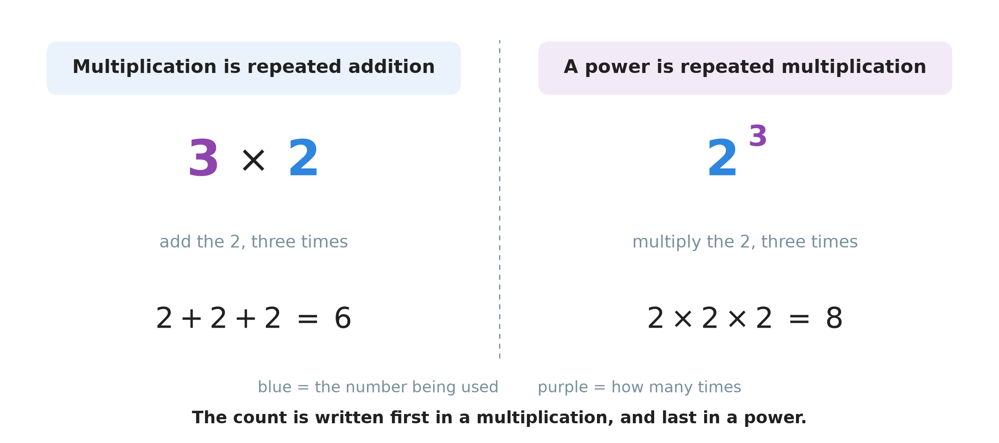
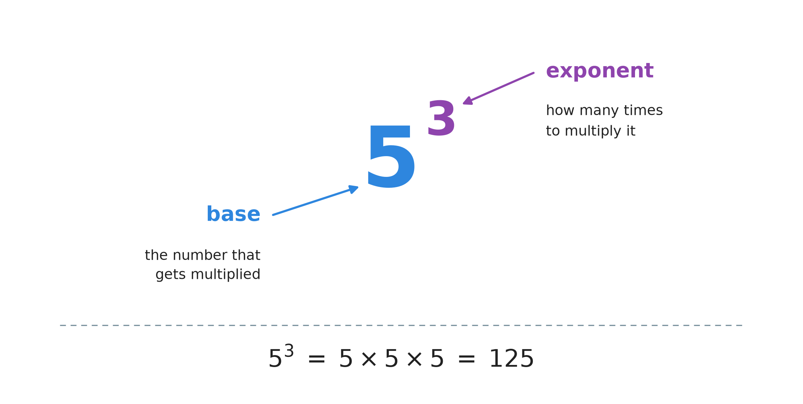
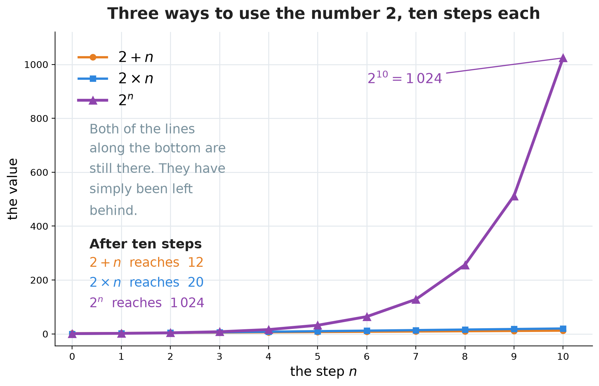
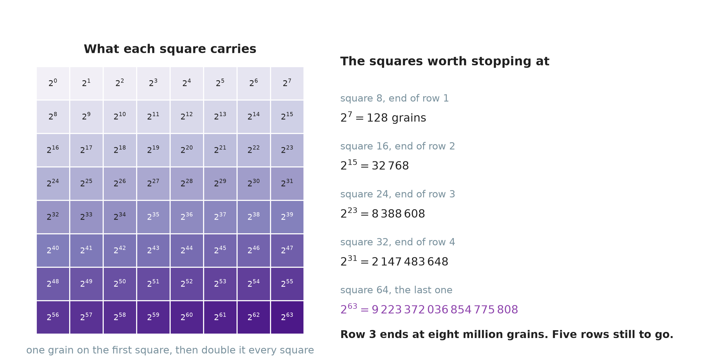
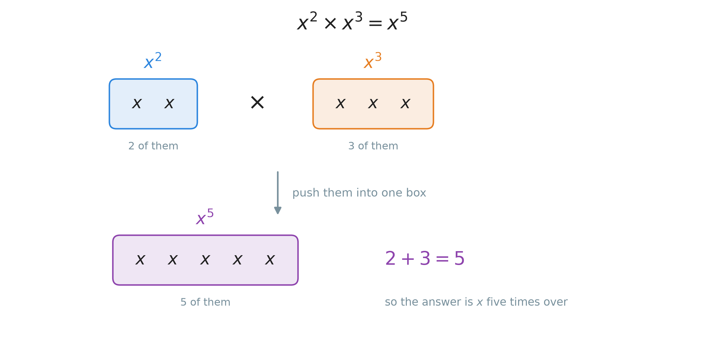
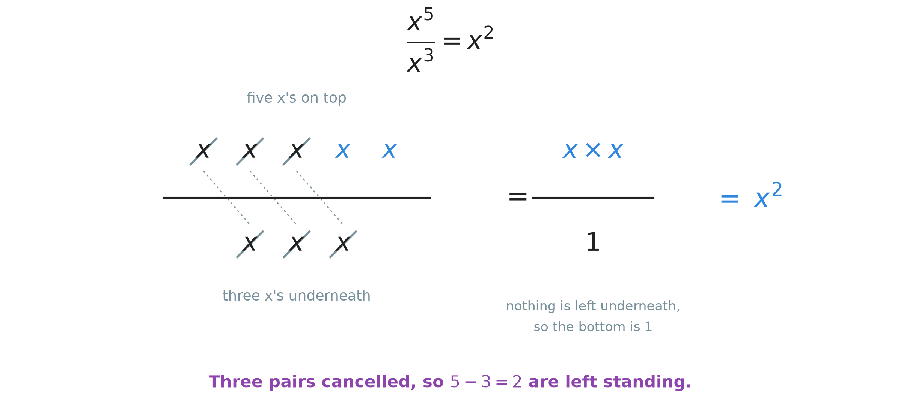
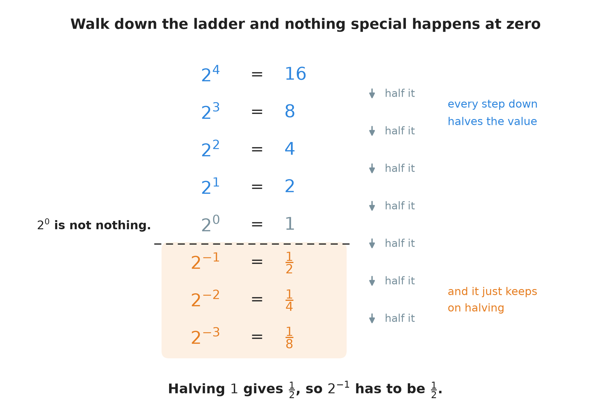
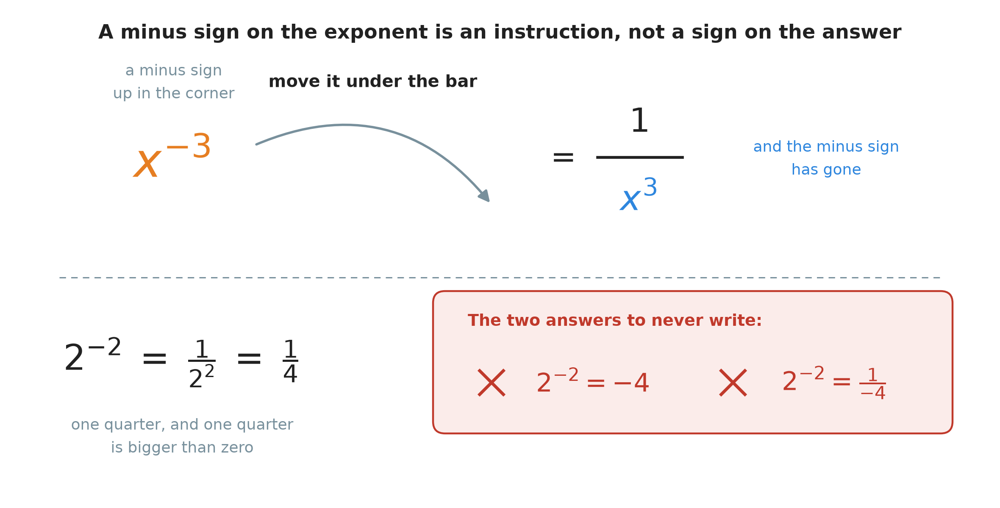
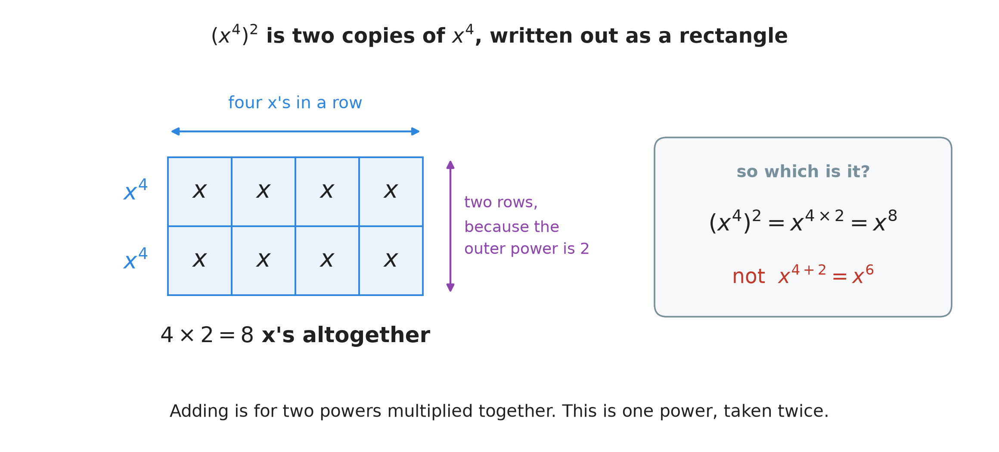
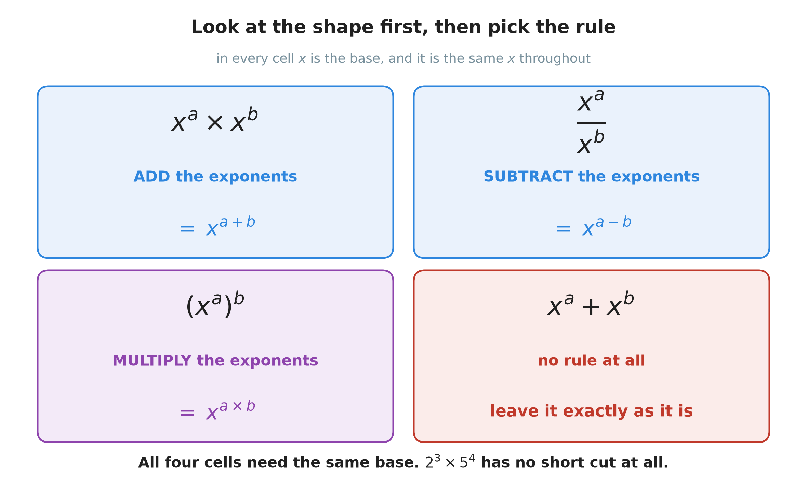

# 10. Exponents

**What this chapter teaches**
What the small raised number in $5^{3}$ means, why numbers written this way grow faster than
anything you have seen so far, and the five rules that let you work with them without writing
every multiplication out.

**Before you start**
Read
[Chapter 6, section 1](./../6_The_Distributive_Property/6_The_Distributive_Property.md#1-multiplication-before-we-start)
for multiplication as repeated addition, for what brackets mean, and for the order and
grouping rules. You need
[Chapter 1, section 3.3](./../1_Fractions/1_Fractions.md#33-simplifying-a-fraction)
for cancelling a fraction down, and
[Chapter 9](./../9_Negative_Numbers/9_Negative_Numbers.md)
for negative numbers, because section 7 puts a negative number somewhere new.

---

## Table of contents

1. [A fifth operation](#1-a-fifth-operation)
2. [How to read a power](#2-how-to-read-a-power)
3. [How fast a power grows](#3-how-fast-a-power-grows)
4. [Rule 1: multiplying powers with the same base](#4-rule-1-multiplying-powers-with-the-same-base)
5. [Rule 2: dividing powers with the same base](#5-rule-2-dividing-powers-with-the-same-base)
6. [Rule 3: the exponent zero](#6-rule-3-the-exponent-zero)
7. [Rule 4: a negative exponent](#7-rule-4-a-negative-exponent)
8. [Rule 5: a power raised to a power](#8-rule-5-a-power-raised-to-a-power)
9. [Using the rules together](#9-using-the-rules-together)
10. [Glossary](#10-glossary)
11. [Check your understanding](#11-check-your-understanding)
12. [Important notes](#12-important-notes)

---

## 1. A fifth operation

### 1.1 The four you already have

The book has given you four ways to put two numbers together.

| Operation | Where it was taught |
| --- | --- |
| Addition | [Chapter 5, section 4](./../5_Adding_And_Subtracting_Large_Numbers/5_Adding_And_Subtracting_Large_Numbers.md#4-adding-large-numbers) |
| Subtraction | [Chapter 5, section 6](./../5_Adding_And_Subtracting_Large_Numbers/5_Adding_And_Subtracting_Large_Numbers.md#6-subtracting-large-numbers) |
| Multiplication | [Chapter 6, section 1](./../6_The_Distributive_Property/6_The_Distributive_Property.md#1-multiplication-before-we-start) |
| Division | [Chapter 8](./../8_Dividing_Large_Numbers/8_Dividing_Large_Numbers.md) |

This chapter adds a fifth one. Its name is **exponentiation**, and you already know most of the
idea behind it.

### 1.2 Each operation is a short cut for the one before it

Go back to the first thing
[Chapter 6](./../6_The_Distributive_Property/6_The_Distributive_Property.md#11-multiplication-is-repeated-addition)
said about multiplication. Multiplying is adding the same number again and again:

$$
3 \times 2 = 2 + 2 + 2 = 6
$$

Nobody invented multiplication to do something new. They invented it because writing
$2 + 2 + 2$ is slow and writing $3 \times 2$ is fast.

Now ask the same question one level up. What if you want to **multiply** the same number again
and again?

$$
2 \times 2 \times 2 = 8
$$

There is a short way to write that too:

$$
2^{3} = 2 \times 2 \times 2 = 8
$$

    

**Figure 1 — The same two numbers doing the same two jobs on both sides. The blue $2$ is the
number that gets used. The purple $3$ says how many times to use it. On the left the copies are
added; on the right they are multiplied. Look at where the purple $3$ is written: first on the
left, last on the right.**

**Definition.** **Exponentiation** is multiplying the same number by itself again and again. It
is to multiplication what multiplication is to addition.

### 1.3 The count moves to the corner

Figure 1 shows one thing you must not skip past. In a multiplication the count is written
**first**, beside the other number, on the same line. In a power the count is written **last**,
small and raised into the top right corner.

That is the whole difference in how they look. The difference in what they *do* is bigger:
$3 \times 2$ is $6$, and $2^{3}$ is $8$.

**Warning.** $2^{3}$ is not $2 \times 3$. It is easy to look at $2^{3}$, see a $2$ and a $3$,
and answer $6$. The right answer is $8$, and the gap between the two grows very quickly:
$2^{10}$ is $1\,024$, while $2 \times 10$ is only $20$.

### Summary of section 1

* Multiplication is a short cut for adding the same number again and again.
* **Exponentiation** is a short cut for multiplying the same number again and again.
* $2^{3}$ means $2 \times 2 \times 2$, which is $8$.
* In $3 \times 2$ the count comes first. In $2^{3}$ the count comes last, up in the corner.
* $2^{3}$ and $2 \times 3$ are different questions with different answers.

---

## 2. How to read a power

### 2.1 The two parts and their names

Every expression of this kind has exactly two parts.

    

**Figure 2 — The big number on the line is the base. The small raised number beside it is the
exponent. Underneath is what the pair of them is short for: five multiplied by itself three
times over, which comes to $125$.**

**Definition.** The **base** is the number that gets multiplied. In $5^{3}$ the base is $5$.

**Definition.** The **exponent** is the small raised number. It says how many times the base is
used. In $5^{3}$ the exponent is $3$.

**Definition.** A **power** is the whole expression: a base with an exponent on it. $5^{3}$ is
a power. So is $2^{10}$.

Written with letters instead of numbers, a power looks like this:

$$
x^{a} = \underbrace{x \times x \times \dots \times x}_{a \text{ of them}}
$$

* $x$ — the base, the number that gets multiplied.
* $a$ — the exponent, how many of them there are.
* The curly line underneath is only a label. It says "there are $a$ copies of $x$ in here".

**Note.** Many books call the exponent "the power" as well, and say "five to the power three".
This book uses **exponent** for the small number and **power** for the whole thing, so that the
two never get mixed up. If you meet the other wording, it means the same.

### 2.2 Saying it out loud

You will hear three different ways of reading the same thing.

| Written | Said | Why |
| --- | --- | --- |
| $5^{2}$ | "five squared" | An exponent of $2$ has its own word. |
| $5^{3}$ | "five cubed" | An exponent of $3$ has its own word too. |
| $5^{4}$ | "five to the power four" | Everything above $3$ uses the long form. |

**Definition.** **Squaring** a number means raising it to the exponent $2$. $5^{2} = 25$.

**Definition.** **Cubing** a number means raising it to the exponent $3$. $5^{3} = 125$.

**Note.** A keyboard has no small raised position, so people type a **caret** instead — the `^`
symbol. Typing `5^4` means $5^{4}$. Calculators, spreadsheets and programming languages all use
it. It is only a way of typing; the maths is unchanged.

### 2.3 Working one out, one step at a time

There is no clever method here. Write the multiplication out and do it one piece at a time.

**Example.** Work out $3^{4}$.

The exponent is $4$, so write four threes:

$$
3^{4} = 3 \times 3 \times 3 \times 3
$$

Now multiply from the left, keeping the running answer:

$$
3 \times 3 = 9
$$

$$
9 \times 3 = 27
$$

$$
27 \times 3 = 81
$$

$$
3^{4} = 81
$$

**Example.** Work out $6^{5}$.

The exponent is $5$, so write five sixes:

$$
6^{5} = 6 \times 6 \times 6 \times 6 \times 6
$$

$$
6 \times 6 = 36
$$

$$
36 \times 6 = 216
$$

The next two steps are large enough to want the column method from
[Chapter 7, section 3](./../7_Multiplying_Large_Numbers/7_Multiplying_Large_Numbers.md#3-multiplying-by-one-digit-in-columns).
For $216 \times 6$: $6 \times 6 = 36$, so write $6$ and carry $3$; $1 \times 6 = 6$, plus the
carried $3$ is $9$; $2 \times 6 = 12$.

$$
216 \times 6 = 1\,296
$$

For $1\,296 \times 6$: $6 \times 6 = 36$, write $6$ and carry $3$; $9 \times 6 = 54$, plus $3$
is $57$, write $7$ and carry $5$; $2 \times 6 = 12$, plus $5$ is $17$, write $7$ and carry $1$;
$1 \times 6 = 6$, plus $1$ is $7$.

$$
1\,296 \times 6 = 7\,776
$$

$$
6^{5} = 7\,776
$$

Notice how much the answer grew. The base only went from $3$ to $6$, and the exponent from $4$
to $5$, but the answer went from $81$ to nearly eight thousand. Section 3 is about exactly
that.

### 2.4 The exponent one

What does $5^{1}$ mean? Use the definition. The exponent says how many copies of the base to
multiply together, and here there is one copy.

$$
5^{1} = 5
$$

There is nothing for it to be multiplied by, so the answer is the base itself. The same is true
for every number:

$$
x^{1} = x
$$

**Note.** This means every ordinary number is secretly a power. $7$ is $7^{1}$. Nobody writes
the $1$, but it is there, and section 4 will need you to remember that.

### 2.5 Why the rules are written with letters

From section 4 onwards, most of this chapter is written with letters: $x$, $a$, $b$. That is
not a new idea.
[Chapter 6, section 2.4](./../6_The_Distributive_Property/6_The_Distributive_Property.md#24-the-rule-in-symbols)
already wrote a rule that way.

A letter stands for **any number at all**. When this chapter writes

$$
x^{a} \times x^{b} = x^{a + b}
$$

it is making one statement that covers $2^{3} \times 2^{4}$, and $10^{5} \times 10^{6}$, and
every other pair of the same shape, all at the same time. Writing the rule with letters is the
only way to say it once instead of for ever.

**Note.** A letter keeps its meaning all the way through one calculation. If $x$ is $7$ on the
first line, it is still $7$ three lines later. Different letters may stand for different
numbers, but the same letter always stands for the same number.

### Summary of section 2

* The **base** is the number being multiplied. The **exponent** is the small raised number that
  counts how many.
* The whole expression is called a **power**.
* $5^{2}$ is "five squared". $5^{3}$ is "five cubed". Above that, "to the power of".
* On a keyboard, `^` stands for the raised position: `5^4` means $5^{4}$.
* To work a power out, write the multiplication in full and do it one step at a time.
* $x^{1} = x$, so every plain number is already a power.
* A letter in a rule stands for any number, so one rule covers every case at once.

---

## 3. How fast a power grows

### 3.1 Every step multiplies by the base again

Raise the exponent by one and the base gets used one more time. So the answer gets multiplied
by the base once more.

With a base of $2$, "one more time" means doubling:

$$
2^{1} = 2
$$

$$
2^{2} = 2 \times 2 = 4
$$

$$
2^{3} = 2 \times 2 \times 2 = 8
$$

$$
2^{4} = 2 \times 2 \times 2 \times 2 = 16
$$

Each answer is twice the one above it. Nothing dramatic has happened yet. Doubling feels slow
while the numbers are small.

### 3.2 Doubling does not stay slow

Put a power next to an addition and a multiplication, and give all three the same number to
work with. Here is the number $2$ used in all three ways, for ten steps.

| Step $n$ | Add: $2 + n$ | Multiply: $2 \times n$ | Power: $2^{n}$ |
| :---: | :---: | :---: | :---: |
| $0$ | $2$ | $0$ | $1$ |
| $1$ | $3$ | $2$ | $2$ |
| $2$ | $4$ | $4$ | $4$ |
| $3$ | $5$ | $6$ | $8$ |
| $4$ | $6$ | $8$ | $16$ |
| $5$ | $7$ | $10$ | $32$ |
| $10$ | $12$ | $20$ | $1\,024$ |

At step $2$ all three columns agree. Three steps later the power column is three times the size
of the others. Five steps after that it is fifty times the size.

    

**Figure 3 — The same three columns, drawn. The orange and blue lines are still there at the
bottom of the picture; they have simply been left behind. Look at how flat the purple line is
for the first four steps, and how steep it is after step seven. It never changed its behaviour.
It doubled at every single step, from beginning to end.**

**Definition.** **Exponential growth** is growth where the amount is multiplied by the same
number at every step, instead of having the same number added at every step. It starts slowly
and then becomes very large very fast.

**Note.** This finishes something that
[Chapter 7, section 2.2](./../7_Multiplying_Large_Numbers/7_Multiplying_Large_Numbers.md#22-by-one-hundred-and-by-one-thousand)
started. That section called $10$, $100$ and $1000$ the **powers of ten**, but it had no way of
writing them. Now there is one: $10^{1} = 10$, $10^{2} = 100$, $10^{3} = 1000$. The exponent is
exactly the number of zeros, which is exactly the number of places every digit moves to the
left.

### 3.3 A king who could not pay

There is an old story from India about this, and it is the clearest picture of exponential
growth there is.

A wise man invented the game of chess. The King liked it so much that he offered any reward the
wise man cared to name. The wise man asked for rice, and he asked for it like this:

> One grain of rice on the first square of the chessboard. Two grains on the second square.
> Four on the third. Keep doubling, square by square, to the end of the board.

The King thought he had been let off cheaply, and agreed.

A chessboard has $64$ squares. The first square holds $1$ grain, which is $2^{0}$. The second
holds $2$, which is $2^{1}$. The third holds $4$, which is $2^{2}$. Each square doubles, so
square number $n$ carries $2^{n-1}$ grains.

    

**Figure 4 — Every square of the board, with its exponent written on it and its size shown by
how dark it is. The list on the right gives the counts the story turns on. Notice that the
board is still pale at square $24$ — and that square already carries more than eight million
grains.**

Follow the rows across:

* End of the first row, square $8$: $2^{7} = 128$ grains. A handful.
* End of the second row, square $16$: $2^{15} = 32\,768$ grains. A bowl.
* End of the third row, square $24$: $2^{23} = 8\,388\,608$ grains. More than eight million,
  and five rows still to go.
* End of the fourth row, square $32$: $2^{31} = 2\,147\,483\,648$ grains. Over two billion, and
  the board is only half done.
* The last square, number $64$: $2^{63} = 9\,223\,372\,036\,854\,775\,808$ grains. That number
  has nineteen digits.

The King could not pay. Nobody could. That last square alone holds more rice than the whole
world grows in hundreds of years.

**Note.** Look at where the trouble came from. The wise man never asked for a large number. He
asked for **one grain**, and then for one rule: double it. The rule is what was expensive.

### Summary of section 3

* Raising the exponent by one multiplies the answer by the base one more time.
* **Exponential growth** multiplies at every step instead of adding at every step.
* It looks harmless at first. $2^{3}$ is only $8$.
* It does not stay harmless. $2^{10}$ is $1\,024$, and $2^{63}$ has nineteen digits.
* $10^{1} = 10$, $10^{2} = 100$, $10^{3} = 1000$: the exponent counts the zeros.
* The chessboard story starts with one grain and one doubling rule. The rule did all the damage.

---

## 4. Rule 1: multiplying powers with the same base

Writing every multiplication out by hand works, but it is slow, and for a big exponent it is
impossible. The next five sections each give one rule that lets you skip the writing out. Every
one of them is found the same way: write the thing out in full, look at what happened, and give
that a name.

### 4.1 Write it out and count

Take $x^{2} \times x^{3}$ and replace each power by what it stands for.

$$
x^{2} \times x^{3} = (x \times x) \times (x \times x \times x)
$$

The brackets are only there to show where each power ended. Everything inside is a
multiplication, and
[Chapter 6, section 1.4](./../6_The_Distributive_Property/6_The_Distributive_Property.md#14-the-grouping-does-not-matter-either)
says the grouping of a chain of multiplications does not matter, so the brackets can go:

$$
= x \times x \times x \times x \times x
$$

Now count the $x$'s. There are five.

$$
= x^{5}
$$

    

**Figure 5 — Two $x$'s in the first box and three in the second. Push them into one box and no
$x$ is created and none is lost, so the big box must hold $2 + 3 = 5$ of them. That is the only
thing the rule is describing.**

### 4.2 The rule

$$
x^{a} \times x^{b} = x^{a + b}
$$

**In words:** when you multiply two powers that have the **same base**, keep the base and add
the exponents together.

* $x$ — the base. It has to be the same in both.
* $a$ — how many $x$'s the first power has.
* $b$ — how many $x$'s the second power has.
* $a + b$ — how many there are once both lots are in one place.

### 4.3 Two examples

**Example.** Simplify $y^{3} \times y^{4}$.

First check the bases. Both are $y$, so the rule applies.

$$
y^{3} \times y^{4} = y^{3 + 4} = y^{7}
$$

**Example.** Work out $2^{2} \times 2^{3}$, and check it.

Both bases are $2$, so add the exponents:

$$
2^{2} \times 2^{3} = 2^{2 + 3} = 2^{5} = 32
$$

Check it the long way, without the rule:

$$
2^{2} = 4 \qquad \text{and} \qquad 2^{3} = 8
$$

$$
4 \times 8 = 32
$$

Same answer. The rule saved the writing out, not the truth.

### 4.4 The bases have to match

**Warning.** This rule needs the **same base** on both sides, and there is no rule at all when
the bases are different. $2^{3} \times 5^{4}$ cannot be turned into a single power. The only
thing to do with it is work both parts out and multiply them.

The reason is in Figure 5. The rule works because everything in both boxes was the same thing,
so they could be counted together. Two's and five's cannot be counted together, any more than
you can add $3$ apples to $4$ oranges and call the answer $7$ apples.

### Summary of section 4

* $x^{a} \times x^{b} = x^{a + b}$: same base, so add the exponents.
* The reason is counting. Two $x$'s beside three $x$'s is five $x$'s.
* The base is kept exactly as it was. Only the exponents are added.
* The bases must match. $2^{3} \times 5^{4}$ has no short cut.

---

## 5. Rule 2: dividing powers with the same base

### 5.1 Write it out and cancel

Take $\dfrac{x^{5}}{x^{3}}$ and again replace each power by what it stands for.

$$
\frac{x^{5}}{x^{3}} = \frac{x \times x \times x \times x \times x}{x \times x \times x}
$$

You already know what to do with a fraction like this.
[Chapter 1, section 3.3](./../1_Fractions/1_Fractions.md#33-simplifying-a-fraction)
says a fraction can be simplified by dividing the top and the bottom by the same number. Here
that number is $x$, and it can be done three times, because there are three $x$'s underneath.

    

**Figure 6 — Each $x$ underneath cancels one $x$ on top. The dotted lines join the pairs that go.
Three pairs leave, so $5 - 3 = 2$ are left standing on top. Nothing is left underneath, which
means the bottom is now $1$ — not nothing.**

$$
= \frac{x \times x}{1} = x^{2}
$$

### 5.2 The rule

$$
\frac{x^{a}}{x^{b}} = x^{a - b} \qquad (x \neq 0)
$$

**In words:** when you divide two powers that have the **same base**, keep the base and take
the bottom exponent away from the top one.

* $x$ — the base. It has to be the same on top and underneath.
* $a$ — how many $x$'s are on top.
* $b$ — how many $x$'s are underneath, and so how many pairs cancel.
* $a - b$ — how many are still standing on top afterwards.

**Note.** $x \neq 0$ is read "$x$ is not zero", and it is there because a fraction bar is a
division ([Chapter 1, section 2.2](./../1_Fractions/1_Fractions.md#22-a-fraction-is-a-division))
and nothing can be divided by zero. If the base were $0$, the bottom of the fraction would be
$0$ as well, and there would be nothing to work out. Every rule in this chapter that comes from
this one carries the same condition.

### 5.3 Two examples

**Example.** Simplify $\dfrac{m^{7}}{m^{2}}$.

Both bases are $m$, so subtract:

$$
\frac{m^{7}}{m^{2}} = m^{7 - 2} = m^{5}
$$

**Example.** Work out $\dfrac{2^{5}}{2^{3}}$, and check it.

$$
\frac{2^{5}}{2^{3}} = 2^{5 - 3} = 2^{2} = 4
$$

Check the long way:

$$
2^{5} = 32 \qquad \text{and} \qquad 2^{3} = 8
$$

$$
32 \div 8 = 4
$$

Same answer again.

### Summary of section 5

* $\dfrac{x^{a}}{x^{b}} = x^{a - b}$: same base, so subtract the bottom exponent from the top.
* The reason is cancelling, which is the simplifying you already did in Chapter 1.
* The order matters. Top exponent first, then take the bottom one away.
* The base must not be zero, because nothing can be divided by zero.

---

## 6. Rule 3: the exponent zero

### 6.1 A question the definition cannot answer

So far the exponent has always been a counting number: two $x$'s, three $x$'s, five $x$'s. Now
look at $5^{0}$ and try to read it the same way. "Multiply five by itself zero times." That is
not a sentence that means anything. You cannot multiply nothing together.

So the definition runs out here, and something else has to decide the answer. Two different
things decide it, and they agree.

### 6.2 Keep walking down the ladder

Write the powers of $2$ in a column, biggest first. Going **up** the column multiplies by $2$
each time, because that is what raising the exponent does. So going **down** the column must
divide by $2$ each time — it is the same steps walked backwards.

    

**Figure 7 — Each row is half the row above it: $16$, $8$, $4$, $2$. Carry on down and the next
row after $2$ must be $1$. That row is $2^{0}$, so $2^{0} = 1$. Nothing unusual happens at the
dashed line — the halving just keeps going, which is what section 7 is about.**

$2^{1}$ is $2$. Halve it and you get $1$. The row below $2^{1}$ is $2^{0}$. So $2^{0} = 1$.

### 6.3 The same answer from Rule 2

The ladder is the picture. Here is the proof.

Take any power divided by itself, say $\dfrac{x^{3}}{x^{3}}$, and work it out in two different
ways.

**The first way — use Rule 2.** Same base on top and bottom, so subtract the exponents:

$$
\frac{x^{3}}{x^{3}} = x^{3 - 3} = x^{0}
$$

**The second way — think about what it is.** Any number divided by itself is $1$. That is
[Chapter 1, section 2.3](./../1_Fractions/1_Fractions.md#23-when-the-parts-build-the-whole-back),
and it is why $\frac{8}{8} = 1$:

$$
\frac{x^{3}}{x^{3}} = 1
$$

Both ways start from the same expression, so both answers are the same thing:

$$
x^{0} = 1
$$

### 6.4 The rule

$$
x^{0} = 1 \qquad (x \neq 0)
$$

**In words:** any base except zero, raised to the exponent zero, is $1$.

* $x$ — the base. It can be any number except $0$.
* $0$ — the exponent.
* $1$ — the answer, whatever the base was. $7^{0} = 1$. $500^{0} = 1$. $2^{0} = 1$.

**Warning.** $x^{0}$ is $1$, not $0$. The zero is in the exponent, not in the answer. This is
the same mistake as the one in section 7, in a different coat: a number in the corner is an
instruction about how many times to multiply, and it never walks down onto the answer line.

**Note.** Look back at Figure 4. The first square of the chessboard carries $2^{0}$ grains, and
the story says one grain. The rule and the story agree, which is a small check that the rule is
the right one.

### Summary of section 6

* "Multiply it zero times" cannot be read straight, so the answer comes from the other rules.
* Going down the ladder of powers divides by the base each time, and the step below $2^{1} = 2$
  lands on $1$.
* Rule 2 says $\frac{x^{3}}{x^{3}} = x^{0}$, and plain division says the same fraction is $1$.
* So $x^{0} = 1$ for every base except zero.
* $7^{0} = 1$. The answer does not depend on the base at all.

---

## 7. Rule 4: a negative exponent

### 7.1 One more word first

**Definition.** The **reciprocal** of a number is what you get when you turn it upside down. The
reciprocal of $\frac{a}{b}$ is $\frac{b}{a}$.

A whole number can be turned upside down too, because a whole number is a fraction with $1$
underneath. $4$ is $\frac{4}{1}$, so:

$$
\text{the reciprocal of } 4 \text{ is } \frac{1}{4}
$$

That is the whole of the new vocabulary. Now back to the ladder.

### 7.2 The ladder does not stop at zero

Look at Figure 7 again, at the rows below the dashed line. Nothing about the halving changes
there. $2^{0}$ is $1$; halve it and you get $\frac{1}{2}$; halve that and you get $\frac{1}{4}$.
The exponents keep counting down too: $0$, then $-1$, then $-2$.

So the row for $2^{-1}$ has to be $\frac{1}{2}$, and the row for $2^{-2}$ has to be
$\frac{1}{4}$. Look at what those answers are:

$$
2^{-1} = \frac{1}{2} = \frac{1}{2^{1}} \qquad \text{and} \qquad 2^{-2} = \frac{1}{4} = \frac{1}{2^{2}}
$$

The negative exponent has turned the power upside down. It has become its reciprocal.

### 7.3 The same answer from Rule 2

Again, the ladder is the picture, and Rule 2 is the proof. Take $\dfrac{x^{5}}{x^{7}}$ — a
fraction with **more** underneath than on top — and work it out in two ways.

**The first way — use Rule 2.** Subtract the exponents, exactly as before. Subtracting a bigger
number from a smaller one gives an answer below zero, which is
[Chapter 9](./../9_Negative_Numbers/9_Negative_Numbers.md#12-taking-away-more-than-you-have):

$$
\frac{x^{5}}{x^{7}} = x^{5 - 7} = x^{-2}
$$

**The second way — cancel, as in Figure 6.** There are five $x$'s on top and seven underneath.
Five pairs cancel, and this time it is the **top** that runs out first:

$$
\frac{x^{5}}{x^{7}} = \frac{x \times x \times x \times x \times x}{x \times x \times x \times x \times x \times x \times x}
$$

Five pairs go. Nothing is left on top, so the top is $1$. Two $x$'s are left underneath:

$$
= \frac{1}{x \times x} = \frac{1}{x^{2}}
$$

Both ways began with the same fraction, so both answers are the same thing:

$$
x^{-2} = \frac{1}{x^{2}}
$$

### 7.4 The rule

$$
x^{-a} = \frac{1}{x^{a}} \qquad (x \neq 0)
$$

**In words:** a negative exponent means "move this under the fraction bar and make the exponent
positive".

* $x$ — the base. Not zero, for the same reason as in section 5.2.
* $-a$ — the exponent, with its minus sign.
* $\frac{1}{x^{a}}$ — the answer: the reciprocal of the power with a positive exponent.

    

**Figure 8 — The minus sign is an instruction to cross the bar, and it is used up doing it. What
arrives underneath has a plain positive exponent. Below the dashed line the same move is done
with real numbers, next to the two answers people write instead.**

**Example.** Work out $2^{-3}$.

Move it under the bar and make the exponent positive:

$$
2^{-3} = \frac{1}{2^{3}}
$$

Work out the bottom:

$$
2^{3} = 2 \times 2 \times 2 = 8
$$

$$
2^{-3} = \frac{1}{8}
$$

### 7.5 A negative exponent does not give a negative answer

**Warning.** $2^{-3}$ is $\frac{1}{8}$. It is not $-8$, and it is not $-6$, and it is not
$\frac{1}{-8}$. The answer is a positive number — a small one, but firmly above zero.

This is worth stopping on, because the minus sign here is doing a job you have not seen it do
before. [Chapter 9, section 4.2](./../9_Negative_Numbers/9_Negative_Numbers.md#42-the-minus-sign-has-two-jobs)
gave the minus sign two jobs: it can mean "subtract", and it can mean "this number is below
zero". In the corner of a power it is doing a third job. It is an instruction about **where the
power goes**, not a statement about which side of zero the answer is on.

A good test: a negative exponent always makes the answer **smaller**, never negative. $2^{3}$
is $8$ and $2^{-3}$ is $\frac{1}{8}$. Both are bigger than zero.

### Summary of section 7

* The **reciprocal** of a number is that number turned upside down. The reciprocal of $4$ is
  $\frac{1}{4}$.
* $x^{-a} = \frac{1}{x^{a}}$: a negative exponent moves the power under the fraction bar.
* The minus sign is spent on the move, so the exponent underneath is positive.
* It comes from Rule 2, used on a fraction with more underneath than on top.
* A negative exponent makes the answer smaller, not negative. $2^{-3} = \frac{1}{8}$.

---

## 8. Rule 5: a power raised to a power

### 8.1 Two copies of the same power

Sometimes a whole power is inside a bracket, with another exponent outside it:

$$
(x^{4})^{2}
$$

Read it the way you read any exponent. The outer exponent is $2$, and it applies to everything
inside the bracket — that is what brackets do
([Chapter 6, section 1.2](./../6_The_Distributive_Property/6_The_Distributive_Property.md#12-brackets-say-do-this-part-first)).
So this means two copies of $x^{4}$, multiplied together:

$$
(x^{4})^{2} = x^{4} \times x^{4}
$$

Now write each copy out in full:

$$
= (x \times x \times x \times x) \times (x \times x \times x \times x)
$$

    

**Figure 9 — Two copies of $x^{4}$, laid out as two rows of four. Counting the $x$'s is the area
question from [Chapter 6, section 3](./../6_The_Distributive_Property/6_The_Distributive_Property.md#3-seeing-the-rule-as-a-rectangle):
how many in a row, times how many rows. So $4 \times 2 = 8$.**

$$
= x^{8}
$$

### 8.2 The rule

$$
(x^{a})^{b} = x^{a \times b}
$$

**In words:** when a power is raised to another power, keep the base and **multiply** the two
exponents.

* $x$ — the base.
* $a$ — the inner exponent: how many $x$'s are in one copy.
* $b$ — the outer exponent: how many copies there are.
* $a \times b$ — how many $x$'s there are altogether.

### 8.3 Multiply, do not add

**Warning.** $(x^{3})^{2}$ is $x^{6}$, not $x^{5}$. This is the commonest mistake in the whole
chapter, and it happens because Rule 1 also had two exponents in it, and Rule 1 said add.

Here is how to tell them apart. Rule 1 has **two separate powers, multiplied together**:
$x^{3} \times x^{2}$. Rule 5 has **one power, inside a bracket, taken several times**:
$(x^{3})^{2}$. In Rule 1 you are pushing two boxes together, so you count them up. In Rule 5
you are making copies of one box, so you count in rows.

Check it with numbers if you are ever unsure:

$$
(2^{3})^{2} = 8^{2} = 64
$$

And $2^{6} = 64$, while $2^{5} = 32$. Multiplying the exponents is right.

### 8.4 When there is more than one thing inside the bracket

Sometimes the bracket holds a whole product, not a single power:

$$
(2 x^{3} y^{2})^{3}
$$

**Note.** $2 x^{3} y^{2}$ is short for $2 \times x^{3} \times y^{2}$. When a number and a letter
stand next to each other with nothing between them, a multiplication sign is understood. This
saves a great deal of writing, and from here on the chapter uses it.

The outer exponent applies to the whole bracket, so this is three copies of it:

$$
(2 x^{3} y^{2})^{3} = (2 x^{3} y^{2}) \times (2 x^{3} y^{2}) \times (2 x^{3} y^{2})
$$

Everything here is a multiplication, and
[Chapter 6, section 1.3](./../6_The_Distributive_Property/6_The_Distributive_Property.md#13-the-order-of-the-two-factors-does-not-matter)
says the order of a chain of multiplications does not matter. So gather the three $2$'s
together, the three $x^{3}$'s together, and the three $y^{2}$'s together:

$$
= (2 \times 2 \times 2) \times (x^{3} \times x^{3} \times x^{3}) \times (y^{2} \times y^{2} \times y^{2})
$$

Each of those three brackets is now a power raised to a power, which is Rule 5:

$$
= 2^{3} \times (x^{3})^{3} \times (y^{2})^{3}
$$

$$
= 8 \times x^{9} \times y^{6}
$$

$$
(2 x^{3} y^{2})^{3} = 8 x^{9} y^{6}
$$

**The short way to say it:** an exponent on a bracket goes to **every** factor inside the
bracket, one at a time. Do not forget the plain number: the $2$ became $2^{3} = 8$, not $2$ and
not $6$.

### Summary of section 8

* $(x^{a})^{b} = x^{a \times b}$: a power raised to a power multiplies the exponents.
* The reason is a rectangle: $b$ rows with $a$ in each row.
* Rule 1 adds because it joins two separate powers. Rule 5 multiplies because it copies one
  power several times.
* An exponent outside a bracket reaches every factor inside it, numbers included.

---

## 9. Using the rules together

### 9.1 Which rule belongs to which shape

All five rules are now in place. Before using them together, here is how to tell at a glance
which one a question is asking for.

    

**Figure 10 — Look at the *shape* of the expression first, not at the numbers in it. Three of
the four shapes have a rule. The fourth one, in red, is the one people invent a rule for, and
the right move there is to leave it alone.**

| The shape | What to do | Where it was explained |
| --- | --- | --- |
| $x^{a} \times x^{b}$ | Add the exponents | Section 4 |
| $\dfrac{x^{a}}{x^{b}}$ | Subtract the exponents | Section 5 |
| $x^{0}$ | Write $1$ | Section 6 |
| $x^{-a}$ | Move it under the bar | Section 7 |
| $(x^{a})^{b}$ | Multiply the exponents | Section 8 |
| $x^{a} + x^{b}$ | Nothing. Leave it. | Section 9.2 |

### 9.2 The rule that does not exist

**Warning.** $x^{a} + x^{b}$ is **not** $x^{a + b}$. There is no rule for adding two powers
together, and nothing can be done to the expression at all.

It is worth seeing how wrong it goes. Take $2^{3} + 2^{2}$ and do it properly:

$$
2^{3} = 8 \qquad \text{and} \qquad 2^{2} = 4
$$

$$
8 + 4 = 12
$$

Now do it with the invented rule:

$$
2^{3 + 2} = 2^{5} = 32
$$

$12$ and $32$. Not close.

The reason is in Figure 5 again. Rule 1 works because $x^{2} \times x^{3}$ means five $x$'s
**multiplied**, so they can all go in one box. $x^{2} + x^{3}$ means two $x$'s multiplied, then
three $x$'s multiplied, and then the two results **added**. Adding is not what fills the box.

**Note.** Rule 1 adds the **exponents** when the powers are **multiplied**. That swap of words
is what makes this mistake so easy to make. The word "add" in Rule 1 never applies to the
powers themselves.

### 9.3 Two rules in one question

**Example.** Simplify $(a^{3})^{4} \times a^{-5}$.

**Step 1 — deal with the bracket.** $(a^{3})^{4}$ is a power raised to a power, so multiply the
exponents (Rule 5):

$$
(a^{3})^{4} = a^{3 \times 4} = a^{12}
$$

**Step 2 — now it is a multiplication.** Two powers with the same base $a$, so add the
exponents (Rule 1):

$$
a^{12} \times a^{-5} = a^{12 + (-5)}
$$

Adding a negative is the same as subtracting, from
[Chapter 9, section 4.3](./../9_Negative_Numbers/9_Negative_Numbers.md#43-adding-a-negative-number-is-the-same-as-subtracting):

$$
12 + (-5) = 12 - 5 = 7
$$

$$
(a^{3})^{4} \times a^{-5} = a^{7}
$$

**Note.** The exponent was negative and the answer is not. A negative exponent is just a number
in the corner, and it obeys the ordinary rules of Chapter 9 when the rules add or subtract it.

### 9.4 A long one, piece by piece

**Example.** Simplify $\dfrac{(2 x^{3} y^{2})^{3}}{4 x^{4} y^{8}}$, and write the answer with no
negative exponents.

A question like this looks frightening only because there is a lot of it. Take one piece at a
time, and finish each piece before starting the next.

**Step 1 — open the bracket on top.** This was done in full in section 8.4:

$$
(2 x^{3} y^{2})^{3} = 8 x^{9} y^{6}
$$

**Step 2 — write the whole fraction again.**

$$
\frac{8 x^{9} y^{6}}{4 x^{4} y^{8}}
$$

**Step 3 — split it into three separate divisions.** The plain numbers divide into each other,
the $x$'s divide into each other, and the $y$'s divide into each other. They do not mix,
because they are different bases.

The plain numbers:

$$
\frac{8}{4} = 2
$$

The $x$ part, using Rule 2:

$$
\frac{x^{9}}{x^{4}} = x^{9 - 4} = x^{5}
$$

The $y$ part, also Rule 2. Here the bottom exponent is the bigger one, so the answer is
negative:

$$
\frac{y^{6}}{y^{8}} = y^{6 - 8} = y^{-2}
$$

**Step 4 — clear the negative exponent.** The question asked for no negative exponents, so use
Rule 4 and move it under the bar:

$$
y^{-2} = \frac{1}{y^{2}}
$$

**Step 5 — put the three pieces back together.**

$$
2 \times x^{5} \times \frac{1}{y^{2}} = \frac{2 x^{5}}{y^{2}}
$$

$$
\frac{(2 x^{3} y^{2})^{3}}{4 x^{4} y^{8}} = \frac{2 x^{5}}{y^{2}}
$$

**Note.** The $y^{-2}$ ended up underneath, and the $2$ and the $x^{5}$ stayed on top. That is
the whole of Step 4: the pieces with a negative exponent cross the bar, and the pieces with a
positive exponent stay where they are.

### 9.5 Finding a missing exponent

**Example.** Find $n$, if $2^{n} \times 2^{3} = 32$.

**Step 1 — tidy the left-hand side.** Two powers with the same base, multiplied, so Rule 1 adds
the exponents:

$$
2^{n} \times 2^{3} = 2^{n + 3}
$$

So the question now says:

$$
2^{n + 3} = 32
$$

**Step 2 — write the right-hand side as a power of the same base.** Keep doubling until you
reach $32$:

$$
2 \times 2 = 4
$$

$$
4 \times 2 = 8
$$

$$
8 \times 2 = 16
$$

$$
16 \times 2 = 32
$$

That is five twos, so $32 = 2^{5}$.

**Step 3 — compare.** Now both sides are a power of $2$:

$$
2^{n + 3} = 2^{5}
$$

Two powers of $2$ can only be equal if they use the same number of twos. So the exponents must
be equal:

$$
n + 3 = 5
$$

**Step 4 — finish.**

$$
n = 5 - 3 = 2
$$

Check it. If $n = 2$, then $2^{2} \times 2^{3} = 4 \times 8 = 32$. Correct.

### Summary of section 9

* Look at the shape of an expression before you look at its numbers.
* $x^{a} + x^{b}$ has no rule. $2^{3} + 2^{2} = 12$, and the invented answer $2^{5} = 32$ is
  nowhere near.
* In a long question, open the brackets first, then handle each base on its own.
* Different bases never mix. The numbers, the $x$'s and the $y$'s are three separate jobs.
* If both sides are a power of the same base, the exponents must be equal, and that finds a
  missing exponent.

---

## 10. Glossary

Only the terms first used in this chapter are listed here.

* **Base** — the number that gets multiplied in a power. In $5^{3}$, the base is $5$.
* **Caret** — the `^` symbol, used to type an exponent when there is no raised position on the
  keyboard. `5^4` means $5^{4}$.
* **Cubing** — raising a number to the exponent $3$. $5^{3} = 125$, said "five cubed".
* **Exponent** — the small raised number in a power. It says how many times the base is
  multiplied. In $5^{3}$, the exponent is $3$.
* **Exponential growth** — growth that multiplies by the same number at every step instead of
  adding the same number at every step.
* **Exponentiation** — the operation of raising a base to an exponent. It is repeated
  multiplication, just as multiplication is repeated addition.
* **Power** — a base with an exponent on it, taken as a whole. $5^{3}$ is a power.
* **Reciprocal** — a number turned upside down. The reciprocal of $\frac{a}{b}$ is
  $\frac{b}{a}$, and the reciprocal of $4$ is $\frac{1}{4}$.
* **Squaring** — raising a number to the exponent $2$. $5^{2} = 25$, said "five squared".

**Note.** Several words in this chapter were defined earlier and are not repeated here:
**multiplication**, **factor**, **product**, **brackets**, the **commutative** and
**associative** properties
([Chapter 6, section 1](./../6_The_Distributive_Property/6_The_Distributive_Property.md#1-multiplication-before-we-start)),
**simplifying a fraction**
([Chapter 1, section 3.3](./../1_Fractions/1_Fractions.md#33-simplifying-a-fraction)),
**area of a rectangle**
([Chapter 6, section 3.1](./../6_The_Distributive_Property/6_The_Distributive_Property.md#31-area-is-just-counting-squares)),
and **negative number** and **sign**
([Chapter 9, section 1.3](./../9_Negative_Numbers/9_Negative_Numbers.md#13-below-zero-is-normal)).

---

## 11. Check your understanding

Try each one before you open the answer.

**Question 1.** Work out $4^{3}$.

Answer

The exponent is $3$, so write three fours:

$$
4^{3} = 4 \times 4 \times 4
$$

$$
4 \times 4 = 16
$$

$$
16 \times 4 = 64
$$

$$
4^{3} = 64
$$

**Question 2.** Simplify $a^{5} \times a^{2}$.

Answer

Both bases are $a$, and the powers are multiplied, so Rule 1 adds the exponents:

$$
a^{5} \times a^{2} = a^{5 + 2} = a^{7}
$$

**Question 3.** Work out $7^{0}$.

Answer

Any base except zero raised to the exponent $0$ is $1$:

$$
7^{0} = 1
$$

The answer is not $0$ and not $7$. The base makes no difference here at all.

**Question 4.** Simplify $\dfrac{k^{9}}{k^{4}}$.

Answer

Both bases are $k$, and the powers are divided, so Rule 2 subtracts the bottom exponent from
the top one:

$$
\frac{k^{9}}{k^{4}} = k^{9 - 4} = k^{5}
$$

**Question 5.** Write $3^{-4}$ with a positive exponent, then work out its value.

Answer

Move it under the bar and make the exponent positive:

$$
3^{-4} = \frac{1}{3^{4}}
$$

Now work out the bottom:

$$
3 \times 3 = 9
$$

$$
9 \times 3 = 27
$$

$$
27 \times 3 = 81
$$

$$
3^{-4} = \frac{1}{81}
$$

One eighty-first is a very small number, but it is bigger than zero.

**Question 6.** Simplify $(p^{2})^{5} \times p^{-3}$.

Answer

**The bracket first.** A power raised to a power, so multiply the exponents:

$$
(p^{2})^{5} = p^{2 \times 5} = p^{10}
$$

**Then the multiplication.** Same base, so add the exponents:

$$
p^{10} \times p^{-3} = p^{10 + (-3)} = p^{10 - 3} = p^{7}
$$

**Question 7.** Simplify $\dfrac{(3 a^{2} b^{4})^{2}}{9 a^{-1} b^{5}}$, writing the answer with
no negative exponents.

Answer

**Step 1 — open the bracket on top.** The exponent $2$ reaches every factor inside:

$$
(3 a^{2} b^{4})^{2} = 3^{2} \times (a^{2})^{2} \times (b^{4})^{2} = 9 a^{4} b^{8}
$$

**Step 2 — write the fraction again.**

$$
\frac{9 a^{4} b^{8}}{9 a^{-1} b^{5}}
$$

**Step 3 — take the three bases separately.**

The plain numbers:

$$
\frac{9}{9} = 1
$$

The $a$ part. The bottom exponent is $-1$, and subtracting a negative is adding
([Chapter 9, section 4.4](./../9_Negative_Numbers/9_Negative_Numbers.md#44-subtracting-a-negative-number-is-the-same-as-adding)):

$$
\frac{a^{4}}{a^{-1}} = a^{4 - (-1)} = a^{4 + 1} = a^{5}
$$

The $b$ part:

$$
\frac{b^{8}}{b^{5}} = b^{8 - 5} = b^{3}
$$

**Step 4 — put it back together.** Multiplying by $1$ changes nothing, so the $1$ is not
written:

$$
\frac{(3 a^{2} b^{4})^{2}}{9 a^{-1} b^{5}} = a^{5} b^{3}
$$

The commonest slip here is the $a$ part. A negative exponent underneath comes **up**, and it
makes the exponent bigger, not smaller.

**Question 8.** Find $n$, if $2^{n} \times 2^{3} = 32$.

Answer

**Tidy the left.** Same base, multiplied, so add the exponents:

$$
2^{n} \times 2^{3} = 2^{n + 3}
$$

**Write $32$ as a power of $2$.** Doubling from $2$: $4$, $8$, $16$, $32$. That is five twos:

$$
32 = 2^{5}
$$

**Compare.**

$$
2^{n + 3} = 2^{5}
$$

Both sides are a power of $2$, so they use the same number of twos:

$$
n + 3 = 5
$$

$$
n = 5 - 3 = 2
$$

Check: $2^{2} \times 2^{3} = 4 \times 8 = 32$. Correct.

**Question 9.** A student writes $2^{3} + 2^{2} = 2^{5} = 32$. Find the mistake and give the
right answer.

Answer

The student used Rule 1, but Rule 1 is for powers that are **multiplied**, not added. There is
no rule for adding two powers together.

Work each power out on its own and then add:

$$
2^{3} = 8 \qquad \text{and} \qquad 2^{2} = 4
$$

$$
2^{3} + 2^{2} = 8 + 4 = 12
$$

The right answer is $12$. The invented answer was $32$, so this is not a small slip.

The wording is what causes it. Rule 1 says *add the exponents when the powers are multiplied*.
The word "add" belongs to the exponents, never to the powers.

**Question 10.** Without working either of them out, say which is bigger: $(2^{4})^{3}$ or
$2^{4} \times 2^{3}$. Explain how you know.

Answer

$(2^{4})^{3}$ is bigger.

The left one is a power raised to a power, so its exponents multiply: $4 \times 3 = 12$, giving
$2^{12}$.

The right one is two powers multiplied, so its exponents add: $4 + 3 = 7$, giving $2^{7}$.

Both are powers of $2$, and a bigger exponent on the same base means more twos multiplied
together, so it means a bigger number. $12$ is bigger than $7$, so $2^{12}$ is bigger than
$2^{7}$.

(Working them out is not needed, but they are $4\,096$ and $128$.)

---

## 12. Important notes

**The four mistakes people actually make.**

* **Reading $2^{3}$ as $2 \times 3$.** The exponent is not a factor. It is a count of how many
  factors there are. $2^{3}$ is $8$, not $6$.
* **Adding the exponents of two powers that are added.** $x^{a} + x^{b}$ has no rule at all.
  The word "add" in Rule 1 belongs to the exponents of powers that are **multiplied**.
* **Adding instead of multiplying for $(x^{a})^{b}$.** $(x^{3})^{2}$ is $x^{6}$, not $x^{5}$.
  Two separate powers get counted up; one power copied several times gets counted in rows.
* **Making the answer negative because the exponent is.** $2^{-3}$ is $\frac{1}{8}$, a positive
  number. A minus sign in the corner says where the power goes, not which side of zero the
  answer is on.

**The three ideas to keep.**

* **Every rule here is just counting, written short.** Rule 1 counts two boxes of $x$'s
  together. Rule 2 counts what is left after cancelling. Rule 5 counts a rectangle. If you ever
  forget a rule, write the power out in full and count. The rule will come back.
* **The base must be the same, always.** Every rule in this chapter is about one base at a
  time. $2^{3} \times 5^{4}$ cannot be joined, and in the long example of section 9.4 the
  numbers, the $x$'s and the $y$'s were three separate jobs that never touched.
* **Look at the shape before the numbers.** Figure 10 is the fastest way to work: decide what
  shape is in front of you, and the rule follows. Most errors in this chapter are not errors of
  arithmetic. They are the right rule used on the wrong shape.

**How this chapter connects to the rest of the book.**
This is the fifth operation, and it sits on top of everything before it. Working out $6^{5}$
used Chapter 7's column multiplication. Rule 2 used Chapter 1's cancelling. Rule 5 used
Chapter 6's rectangle. The exponents in section 9 were added and subtracted with Chapter 9's
negative numbers. Nothing was replaced; all of it was used.

Two things also point forwards. First, this chapter finally wrote down what
[Chapter 7, section 2.2](./../7_Multiplying_Large_Numbers/7_Multiplying_Large_Numbers.md#22-by-one-hundred-and-by-one-thousand)
called the powers of ten, and being able to write $10^{3}$ instead of $1000$ is how very large
and very small numbers get handled. Second, the expressions here have grown long enough that
the order of the steps has started to matter: in section 9.4 the bracket had to be opened
before anything else could be done. So far the brackets have always said which part comes
first. There is a general rule for when there are no brackets to tell you, and this book has
not reached it yet.

---

- [Back to the book](./../README.md)
- Previous: [9 Negative numbers](./../9_Negative_Numbers/9_Negative_Numbers.md)
- Next: not written yet.
