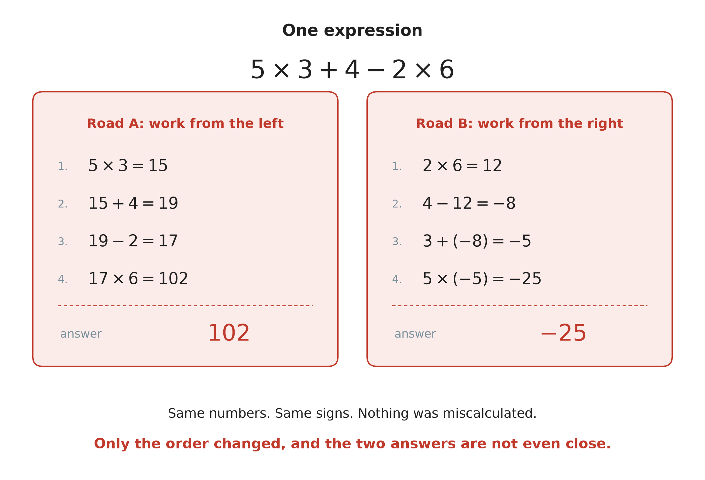
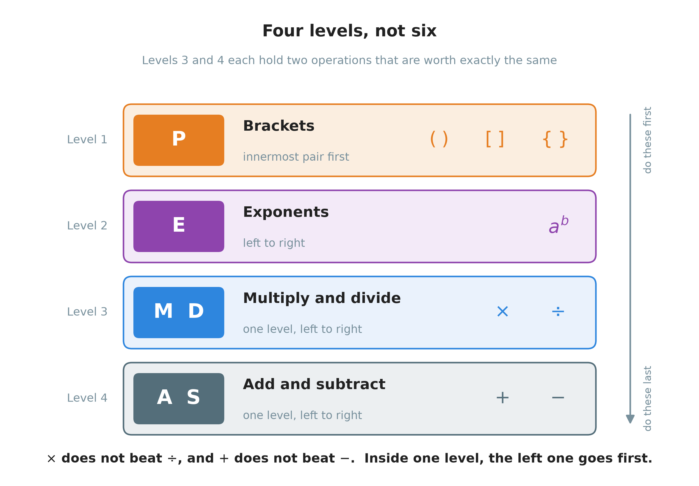
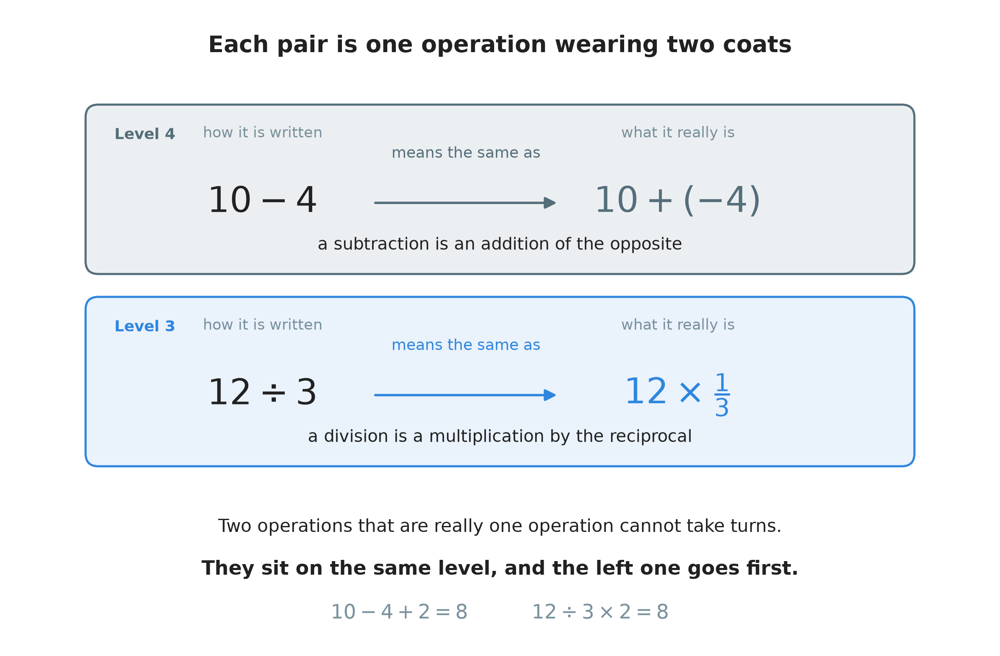
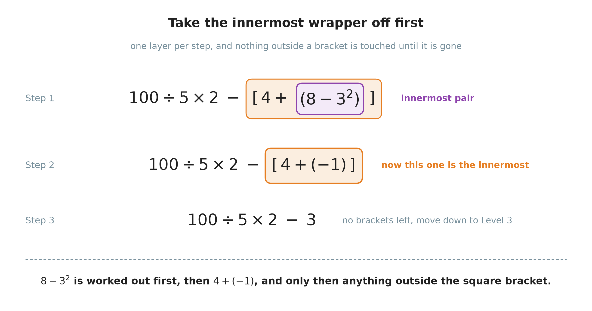
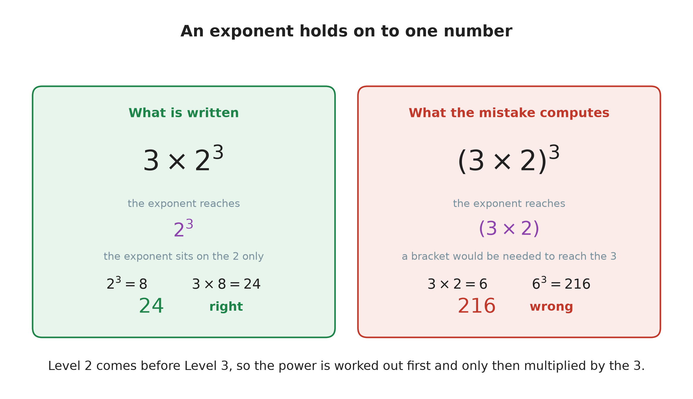
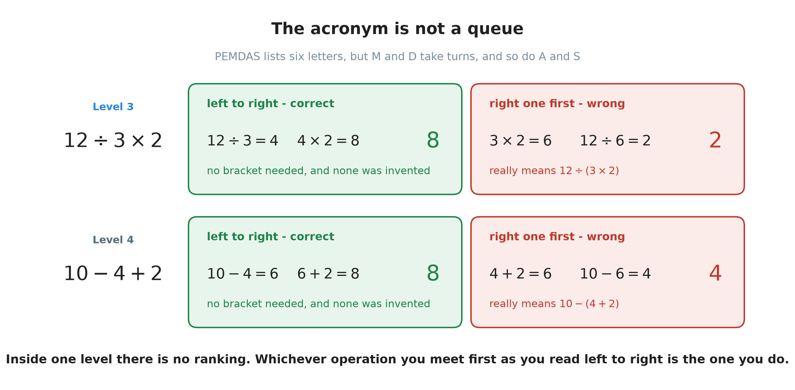
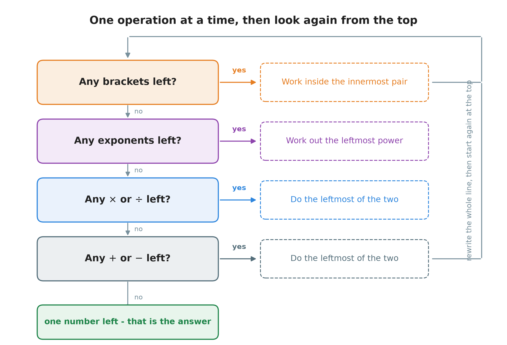
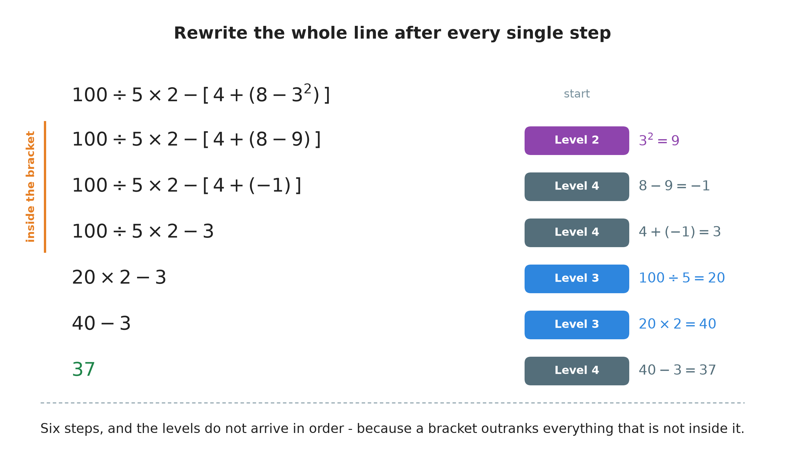

# 11. The order of operations

**What this chapter teaches**
Why a line like $5 \times 3 + 4 - 2 \times 6$ has exactly one right answer, and what decides
that answer. You will learn the order that everybody in the world agrees to follow, why the
order is in that particular shape, and the four mistakes that people make with it.

**Before you start**
Read
[Chapter 6, section 1](./../6_The_Distributive_Property/6_The_Distributive_Property.md#1-multiplication-before-we-start)
for what a bracket means and for the rules about changing the order of a calculation. You
need [Chapter 9](./../9_Negative_Numbers/9_Negative_Numbers.md) for negative numbers, because
several answers in this chapter fall below zero, and
[Chapter 10](./../10_Exponents/10_Exponents.md) for exponents, because they have a place in the
order too.

---

## Table of contents

1. [One expression, two answers](#1-one-expression-two-answers)
2. [The agreed order](#2-the-agreed-order)
3. [Why the order is this way round](#3-why-the-order-is-this-way-round)
4. [Level 1: brackets](#4-level-1-brackets)
5. [Level 2: exponents](#5-level-2-exponents)
6. [Level 3: multiply and divide](#6-level-3-multiply-and-divide)
7. [Level 4: add and subtract](#7-level-4-add-and-subtract)
8. [Three expressions, worked in full](#8-three-expressions-worked-in-full)
9. [Glossary](#9-glossary)
10. [Check your understanding](#10-check-your-understanding)
11. [Important notes](#11-important-notes)

---

## 1. One expression, two answers

### 1.1 Five ways to put numbers together

The book has now given you five operations. They are listed, with links, in
[Chapter 10, section 1.1](./../10_Exponents/10_Exponents.md#11-the-four-you-already-have)
and
[section 1.2](./../10_Exponents/10_Exponents.md#12-each-operation-is-a-short-cut-for-the-one-before-it):
addition, subtraction, multiplication, division and exponentiation.

Until now you have used them one at a time. A whole chapter was about adding. A whole chapter
was about dividing. Each calculation had one operation in it, so there was nothing to decide.

This chapter is about what happens when several of them stand in the same line.

### 1.2 The same line, worked two ways

Look at this line:

$$
5 \times 3 + 4 - 2 \times 6
$$

There are four operations here and no instructions. So try the two most natural things.

**Work from the left.** Take the numbers in the order you read them.

$$
5 \times 3 = 15
$$

$$
15 + 4 = 19
$$

$$
19 - 2 = 17
$$

$$
17 \times 6 = 102
$$

**Work from the right.** Start at the far end and come back.

$$
2 \times 6 = 12
$$

$$
4 - 12 = -8
$$

$$
3 + (-8) = -5
$$

$$
5 \times (-5) = -25
$$

    

**Figure 1 — Two roads through one expression. Every single step in both columns is correct
arithmetic. Nothing was miscalculated. Only the order changed, and the two answers are $102$
and $-25$.**

That is a serious problem. If the order is free, the expression does not mean anything. It is
not one question with one answer. It is a pile of numbers that different people will read in
different ways.

### 1.3 So somebody had to decide

There is no way to discover the right order by thinking harder. The symbols do not contain
the answer. The only way out is for everyone to agree on one order and then always use it.

> **Definition.** A **convention** is a rule that people agreed to follow together. It is not
> true or false. It is simply the choice everybody made, so that everybody understands each
> other.

Driving on one side of the road is a convention. Which side does not matter much. That
everybody picks the same side matters enormously.

> **Definition.** An **expression** is a line of mathematics made of numbers, operation signs
> and brackets, with no equals sign in it. $15 + 3^{2} - 4$ is an expression.
> $15 + 3^{2} - 4 = 20$ is not — that is an equation, because it makes a claim.

The convention for the order of operations is what the rest of this chapter is about. Once you
know it, the line in section 1.2 has exactly one answer, and it is neither $102$ nor $-25$.

### Summary of section 1

* An expression can hold several operations at once.
* Working from the left and working from the right can give completely different answers.
* Both answers were calculated correctly, so arithmetic alone cannot settle it.
* So mathematicians agreed on one fixed order. That agreement is called a **convention**.
* An **expression** is a line of maths with no equals sign in it.

---

## 2. The agreed order

### 2.1 Four levels

The agreed order sorts the operations into four **levels**. Everything on a higher level is
done before anything on a lower level.

    

**Figure 2 — The four levels. Look at the bottom two bars. Multiply and divide share one bar,
and add and subtract share one bar. There is no line between them inside the bar, because
neither one beats the other.**

Read the tower from the top:

1. **Brackets.** Work out everything inside brackets first.
2. **Exponents.** Work out the powers next.
3. **Multiply and divide.** These two together, and neither one first.
4. **Add and subtract.** These two together, and neither one first.

### 2.2 The word PEMDAS

The order is usually remembered by the first letters of its six operations.

> **Definition.** **PEMDAS** is a memory word for the order of operations. The letters stand
> for **P**arentheses, **E**xponents, **M**ultiplication, **D**ivision, **A**ddition,
> **S**ubtraction.

*Parentheses* is another word for round brackets, $(\;)$. This book says *brackets*.

> **Warning.** PEMDAS has six letters, but there are only **four** levels. The M and the D are
> one level together. The A and the S are one level together. The word puts them in a row
> because you cannot write two letters in the same place, not because one comes before the
> other. This is the single biggest cause of wrong answers in this chapter, and section 6 and
> section 7 are about nothing else.

### 2.3 The order in a table

| Level | Letters | Operation | Signs | How to work inside the level |
| :--- | :---: | :--- | :---: | :--- |
| 1 — highest | **P** | Brackets | $(\;)$  $[\;]$  $\{\;\}$ | Innermost pair first |
| 2 | **E** | Exponents | $a^{b}$ | Left to right |
| 3 | **M** and **D** | Multiply and divide | $\times$  $\div$ | Equal. Left to right |
| 4 — lowest | **A** and **S** | Add and subtract | $+$  $-$ | Equal. Left to right |

### 2.4 What "left to right" means

Two operations on the same level do not fight. You simply take them in the order you meet them
as you read the line, the same way you read words on a page.

> **Definition.** Two operations have **equal priority** when neither one is done before the
> other because of what it is. When two operations of equal priority stand in the same line,
> the one further to the left is done first. This is the **left-to-right rule**.

So in $12 \div 3 \times 2$ the division is on the left, so the division goes first. In
$5 \times 12 \div 3$ the multiplication is on the left, so the multiplication goes first.
Nothing about $\times$ or $\div$ decides it. Only the position on the page.

### Summary of section 2

* The order has four levels: brackets, exponents, multiply-and-divide, add-and-subtract.
* Everything on a higher level happens before anything on a lower level.
* PEMDAS is a memory word for the same thing, but it has six letters for four levels.
* Multiply and divide are one level. Add and subtract are one level.
* Inside one level, you work from left to right.

---

## 3. Why the order is this way round

The order is a convention, so it could in principle have been anything. But it is not
random. The shape of it comes straight from what the operations are, and seeing that is what
stops you having to remember it.

### 3.1 Each operation is a package of the one below it

[Chapter 10, section 1.2](./../10_Exponents/10_Exponents.md#12-each-operation-is-a-short-cut-for-the-one-before-it)
showed the ladder. Multiplication is a short way of writing repeated addition:

$$
3 \times 4 = 4 + 4 + 4
$$

And exponentiation is a short way of writing repeated multiplication:

$$
2^{3} = 2 \times 2 \times 2
$$

So $3 \times 4$ is not one number sitting next to another. It is a **package** that holds three
additions inside it. And $2^{3}$ is a package that holds two multiplications inside it.

A package has to be opened before you can use what is in it. That is the whole order, in one
sentence: **the tighter the package, the sooner it is opened.** An exponent packs the most, so
it is opened first. A multiplication packs less, so it is opened next. An addition packs
nothing at all, so it waits until the end.

### 3.2 Multiply before add, worked out with real numbers

Take this line:

$$
2 + 3 \times 4
$$

The piece $3 \times 4$ means *three fours*. Write those fours out in full and nothing is
hidden any more:

$$
2 + 4 + 4 + 4
$$

Now add from the left:

$$
2 + 4 = 6
$$

$$
6 + 4 = 10
$$

$$
10 + 4 = 14
$$

So the answer is $14$.

Now try adding first, the other way round. That gives $2 + 3 = 5$, and then $5 \times 4 = 20$.
But $20$ is *five fours*, and the line never said five fours. It said two, and then three fours.
Adding first quietly changed the question.

**The rule for the reader:** the multiplication had to be unpacked before the $2$ could join
in, because until it was unpacked nobody knew how many fours there were.

### 3.3 Each of the two pairs is one operation wearing two coats

Now the part that people find strangest: why multiply and divide share a level, and why add
and subtract share a level.

The answer is that each pair is not really two operations at all.

[Chapter 9, section 4.3](./../9_Negative_Numbers/9_Negative_Numbers.md#43-adding-a-negative-number-is-the-same-as-subtracting)
showed that taking a number away is the same as adding its opposite:

$$
10 - 4 = 10 + (-4)
$$

And a division is a multiplication by the
[reciprocal](./../10_Exponents/10_Exponents.md#71-one-more-word-first) — the number turned
upside down:

$$
12 \div 3 = 12 \times \frac{1}{3}
$$

Check that second one with numbers. $12 \div 3 = 4$. And $12 \times \frac{1}{3}$ means a third
of $12$, which is also $4$. The two lines say the same thing.

    

**Figure 3 — Take the coat off and there is one operation underneath. A subtraction is an
addition. A division is a multiplication. That is why each pair shares a level: you cannot put
one of them before the other when they are the same thing.**

### 3.4 And that is why you go from left to right

Here is the honest reason for the left-to-right rule, and it is not the one most books give.

Rewrite $10 - 4 + 2$ with no subtraction in it:

$$
10 + (-4) + 2
$$

Now everything in the line is an addition, and
[Chapter 6, section 1.3](./../6_The_Distributive_Property/6_The_Distributive_Property.md#13-the-order-of-the-two-factors-does-not-matter)
said that additions may be taken in any order you like. Try three orders:

$$
10 + (-4) + 2 = 6 + 2 = 8
$$

$$
10 + 2 + (-4) = 12 + (-4) = 8
$$

$$
2 + (-4) + 10 = -2 + 10 = 8
$$

All three give $8$. So the order genuinely does not matter — as long as the $-$ sign stays
attached to the $4$.

The wrong answer comes from letting it come loose. Writing $10 - (4 + 2) = 10 - 6 = 4$ does not
reorder anything. It drags the minus sign onto the $2$ as well, so the $+2$ becomes a $-2$, and
that is a different question.

**So the left-to-right rule is a safe recipe, not a law of nature.** If you always take the
operations in the order you read them, every sign stays with the number that follows it, and
you never have to think about any of this again.

### Summary of section 3

* Each operation is a package of the operation below it: a power packs multiplications, a
  multiplication packs additions.
* The tighter the package, the sooner it must be opened. That is the order.
* $2 + 3 \times 4 = 14$, because until the three fours are unpacked, nobody knows how many
  fours there are.
* A subtraction is really an addition, and a division is really a multiplication. That is why
  each pair shares one level.
* Left to right is a safe recipe: it keeps every sign attached to the number after it.

---

## 4. Level 1: brackets

### 4.1 A bracket is an instruction

[Chapter 6, section 1.2](./../6_The_Distributive_Property/6_The_Distributive_Property.md#12-brackets-say-do-this-part-first)
already said what a bracket does: it says *do this part first*. Now you can see why that
matters so much. A bracket is the one thing that can beat the order of operations, because it
sits above everything else on Level 1.

Compare these two lines. They hold the same numbers and the same signs.

$$
2 + 3 \times 4 = 2 + 12 = 14
$$

$$
(2 + 3) \times 4 = 5 \times 4 = 20
$$

Without the bracket, the multiplication wins and the answer is $14$. With the bracket, the
addition is pulled up to Level 1 and the answer is $20$.

> **Note.** A bracket does not change any rule. It changes the *question*. If you want an
> addition done before a multiplication, a bracket is the only way to ask for it.

### 4.2 The other bracket shapes

You will also meet square brackets $[\;]$ and curly brackets $\{\;\}$.

> **Definition.** **Square brackets** $[\;]$ and **curly brackets** $\{\;\}$ mean exactly the
> same as round brackets. They are used when one pair sits inside another, so that the eye can
> tell which closing bracket belongs to which opening one.

So $[\,4 + (8 - 1)\,]$ is easier to read than $(4 + (8 - 1))$, and it means the same thing.
All three shapes together are called **grouping symbols**.

### 4.3 Brackets inside brackets

When one bracket sits inside another, work the **innermost** pair first, then the next one out,
and so on. Nothing outside a bracket may be touched while the bracket is still there.

Take this expression:

$$
100 \div 5 \times 2 - [\,4 + (8 - 3^{2})\,]
$$

    

**Figure 4 — One wrapper comes off per step. In Step 1 the purple ring is the innermost pair,
so that is the one that gets worked out. When it is gone, in Step 2, the orange pair becomes
the innermost, so its turn is next. The $100 \div 5 \times 2$ on the left waits through all of
it.**

### 4.4 Inside a bracket, the whole order starts again

Look inside the round bracket of that expression:

$$
8 - 3^{2}
$$

There is a subtraction and an exponent in there. Which goes first? The same four levels apply,
because a bracket is a small expression of its own. Exponents are Level 2 and subtraction is
Level 4, so the power goes first:

$$
3^{2} = 9
$$

$$
8 - 9 = -1
$$

The answer is $-1$, from
[Chapter 9, section 1.2](./../9_Negative_Numbers/9_Negative_Numbers.md#12-taking-away-more-than-you-have).
Now the round bracket is finished, and the square bracket becomes the innermost one:

$$
4 + (-1) = 4 - 1 = 3
$$

So the whole square bracket is worth $3$, and the expression is now
$100 \div 5 \times 2 - 3$. Section 8.4 finishes it.

> **Note.** This is why the order is a loop and not a list. You do not walk down the four
> levels once. Every time you finish one operation you look again from the top, because what
> is left may have brackets in it that you could not reach before.

### Summary of section 4

* A bracket says *do this part first*, and it beats every other level.
* $2 + 3 \times 4 = 14$, but $(2 + 3) \times 4 = 20$.
* Square and curly brackets mean the same as round ones. They just make nested pairs readable.
* With brackets inside brackets, do the innermost pair first.
* Inside a bracket, the same four levels apply all over again.

---

## 5. Level 2: exponents

### 5.1 An exponent holds on to one number only

An exponent is written in the corner of one number, and it belongs to that number alone.

Take:

$$
3 \times 2^{3}
$$

The little $3$ sits on the $2$. It says nothing about the first $3$ at all. So the power is
worked out on its own, and only then is it multiplied:

$$
2^{3} = 2 \times 2 \times 2 = 8
$$

$$
3 \times 8 = 24
$$

    

**Figure 5 — How far the exponent reaches. On the left it holds the $2$ only, and the answer
is $24$. On the right a bracket has widened its reach to cover both numbers, and the answer
jumps to $216$. The bracket is the only difference.**

> **Warning.** Do not multiply first and raise the result to the power. $3 \times 2^{3}$ is
> $24$, not $216$. Level 2 comes before Level 3, so the power is always worked out before it
> is used in anything else.

### 5.2 A bracket can widen the reach

If you really do want the multiplication first, you have to ask for it with a bracket:

$$
(3 \times 2)^{3} = 6^{3} = 216
$$

The bracket is now on Level 1, so it is worked out first, and the exponent then lands on the
single number $6$.

The same thing happens in the other direction. In

$$
(3 + 2)^{2}
$$

the bracket goes first, and the power second:

$$
3 + 2 = 5
$$

$$
5^{2} = 5 \times 5 = 25
$$

That is Level 1, then Level 2 — exactly the order in the tower.

### 5.3 More than one power in a line

If a line holds several powers, work them all out. Take:

$$
15 + 5^{2} - 9 \times 6 + 2^{3}
$$

Level 2 comes before Levels 3 and 4, so both powers go first:

$$
5^{2} = 25
$$

$$
2^{3} = 8
$$

$$
15 + 25 - 9 \times 6 + 8
$$

They do not affect each other, so here left to right is only a tidy habit, not a rule you can
break. The line is now ready for Level 3. Section 8.3 finishes it.

### Summary of section 5

* An exponent belongs to the one number it sits on, and to nothing else.
* $3 \times 2^{3} = 24$. The power is worked out first, then multiplied.
* A bracket is the only way to make an exponent cover more than one number.
* $(3 + 2)^{2} = 25$: Level 1 first, then Level 2.
* If there are several powers, work them all out before moving down a level.

---

## 6. Level 3: multiply and divide

### 6.1 Whichever one comes first as you read

Multiplication and division sit on the same level. Neither beats the other. Take them in the
order you meet them.

$$
12 \div 3 \times 2
$$

The division is further left, so it goes first:

$$
12 \div 3 = 4
$$

$$
4 \times 2 = 8
$$

The answer is $8$.

> **Warning.** It is very tempting to do the multiplication first, because **M** comes before
> **D** in PEMDAS. That gives $3 \times 2 = 6$ and then $12 \div 6 = 2$, and $2$ is wrong. The
> letters in a memory word are not a queue.

### 6.2 Doing the right one first is the same as inventing a bracket

Look closely at what that wrong answer actually computed. Doing $3 \times 2$ first means
treating the line as though it had been written:

$$
12 \div (3 \times 2)
$$

But nobody wrote that bracket. It was added by the reader. That is the real mistake, and it is
worth naming, because it is the same mistake in section 7.

    

**Figure 6 — The same trap twice. On each row the green box reads straight through from the
left and gets $8$. The red box does the right-hand operation first, which is the same as
putting in a bracket that was never written, and gets $2$ and $4$.**

### 6.3 When the order really does not matter

Two multiplications in a row can be taken in any order at all. That was
[Chapter 6, section 1.4](./../6_The_Distributive_Property/6_The_Distributive_Property.md#14-the-grouping-does-not-matter-either):

$$
4 \times 5 \times 2 = 20 \times 2 = 40
$$

$$
4 \times 5 \times 2 = 4 \times 10 = 40
$$

Both are $40$. So when a line is all multiplications, you may please yourself.

As soon as a division joins the line, stop pleasing yourself and read from the left. It costs
nothing and it is never wrong.

### Summary of section 6

* Multiply and divide share Level 3. Neither one goes first because of what it is.
* Take them in the order you read them: $12 \div 3 \times 2 = 8$.
* Doing the right-hand one first is the same as adding a bracket nobody wrote.
* A line of nothing but multiplications can be done in any order.

---

## 7. Level 4: add and subtract

### 7.1 The same rule, on the bottom level

Addition and subtraction share the lowest level, and they behave exactly like Level 3.

$$
10 - 4 + 2
$$

The subtraction is further left, so it goes first:

$$
10 - 4 = 6
$$

$$
6 + 2 = 8
$$

The answer is $8$. Look at the bottom row of Figure 6 again. Doing $4 + 2$ first gives $4$, and
that is the invented bracket $10 - (4 + 2)$, not the line that was written.

> **Warning.** **A** comes before **S** in PEMDAS, and it means nothing. Addition does not beat
> subtraction.

### 7.2 The answer is allowed to go below zero on the way

While you work along Level 4 the running total can drop under zero and come back. That is
normal now, and
[Chapter 9](./../9_Negative_Numbers/9_Negative_Numbers.md) is why it does not stop you.

Take the line that section 5.3 left half finished, after Level 3 has been done as well:

$$
15 + 25 - 54 + 8
$$

Left to right, one operation per line:

$$
15 + 25 = 40
$$

$$
40 - 54 = -14
$$

$$
-14 + 8 = -6
$$

The answer is $-6$. Notice that the third step added a positive number to a negative one and
the total climbed back towards zero, exactly as
[Chapter 9, section 4.1](./../9_Negative_Numbers/9_Negative_Numbers.md#41-every-calculation-is-a-walk-along-the-line)
describes.

> **Note.** Never stop early because a total has gone negative. A negative number in the middle
> of a calculation is not a mistake and not a dead end. Keep going.

### Summary of section 7

* Add and subtract share Level 4, and neither beats the other.
* $10 - 4 + 2 = 8$. Doing $4 + 2$ first invents the bracket $10 - (4 + 2)$.
* The letters A and S in PEMDAS are not a ranking.
* The running total may go below zero on the way. Carry on.

---

## 8. Three expressions, worked in full

### 8.1 The habit that prevents nearly every mistake

Do **one** operation. Then write the whole expression out again, with that one operation
replaced by its answer. Then look at the new line from the top.

    

**Figure 7 — The routine, drawn as a loop. Follow the "no" arrows down until a question
answers yes. Do that one operation, rewrite the line, and the long arrow on the right takes
you back to the top to look again. You leave at the bottom only when a single number is left.**

It feels slow. It is not. Rewriting the line takes two seconds and it is the only thing that
stops you from carrying a half-finished thought in your head.

### 8.2 The expression from section 1.2

$$
5 \times 3 + 4 - 2 \times 6
$$

**Level 1 — brackets.** There are none.

**Level 2 — exponents.** There are none.

**Level 3 — multiply and divide.** Two multiplications. Leftmost first:

$$
5 \times 3 = 15
$$

$$
15 + 4 - 2 \times 6
$$

Now the next one:

$$
2 \times 6 = 12
$$

$$
15 + 4 - 12
$$

**Level 4 — add and subtract.** Leftmost first:

$$
15 + 4 = 19
$$

$$
19 - 12 = 7
$$

**The answer is $7$.** Not $102$, and not $-25$. Figure 1 showed two roads that both looked
reasonable, and the convention says that neither of them was the road.

### 8.3 An expression with a bracket and two powers

$$
15 + (3 + 2)^{2} - 9 \times 6 + 2^{3}
$$

**Level 1 — brackets.** One pair:

$$
3 + 2 = 5
$$

$$
15 + 5^{2} - 9 \times 6 + 2^{3}
$$

**Level 2 — exponents.** Two of them:

$$
5^{2} = 5 \times 5 = 25
$$

$$
2^{3} = 2 \times 2 \times 2 = 8
$$

$$
15 + 25 - 9 \times 6 + 8
$$

**Level 3 — multiply and divide.** One multiplication:

$$
9 \times 6 = 54
$$

$$
15 + 25 - 54 + 8
$$

**Level 4 — add and subtract.** Left to right, as in section 7.2:

$$
15 + 25 = 40
$$

$$
40 - 54 = -14
$$

$$
-14 + 8 = -6
$$

**The answer is $-6$.**

> **Note.** The bracket in this one held $3 + 2$, which is a Level 4 operation. It was still
> done first, before both powers. A bracket lifts whatever is inside it to the top, whatever
> that thing happens to be.

### 8.4 An expression with a bracket inside a bracket

$$
100 \div 5 \times 2 - [\,4 + (8 - 3^{2})\,]
$$

This is the one from section 4.3. Here it is from beginning to end.

**Innermost bracket, Level 2 inside it.** The round pair holds $8 - 3^{2}$, and inside that
pair the power comes before the subtraction:

$$
3^{2} = 9
$$

$$
100 \div 5 \times 2 - [\,4 + (8 - 9)\,]
$$

**Innermost bracket, Level 4 inside it.**

$$
8 - 9 = -1
$$

$$
100 \div 5 \times 2 - [\,4 + (-1)\,]
$$

**The square bracket is now the innermost one.** Adding a negative number is subtracting, from
[Chapter 9, section 4.3](./../9_Negative_Numbers/9_Negative_Numbers.md#43-adding-a-negative-number-is-the-same-as-subtracting):

$$
4 + (-1) = 4 - 1 = 3
$$

$$
100 \div 5 \times 2 - 3
$$

**Level 3 — multiply and divide.** No brackets and no powers are left. The division is further
left than the multiplication, so it goes first:

$$
100 \div 5 = 20
$$

$$
20 \times 2 - 3
$$

$$
20 \times 2 = 40
$$

$$
40 - 3
$$

**Level 4 — add and subtract.**

$$
40 - 3 = 37
$$

**The answer is $37$.**

    

**Figure 8 — The whole thing on one page. Read the coloured tags down the right-hand side:
Level 2, Level 4, Level 4, Level 3, Level 3, Level 4. They are not in order, and they are not
meant to be. The first three steps happened inside the bracket, and a bracket outranks
everything outside it.**

> **Warning.** The division came before the multiplication here, because $100 \div 5$ is
> further left. If you had done $5 \times 2 = 10$ first you would have got
> $100 \div 10 - 3 = 7$, which is wrong by thirty.

### Summary of section 8

* Do one operation, rewrite the whole line, then look again from the top.
* $5 \times 3 + 4 - 2 \times 6 = 7$.
* $15 + (3 + 2)^{2} - 9 \times 6 + 2^{3} = -6$.
* $100 \div 5 \times 2 - [\,4 + (8 - 3^{2})\,] = 37$.
* The levels do not arrive in order when there are brackets, and that is correct.

---

## 9. Glossary

Only the terms first used in this chapter are listed here.

* **Convention** — a rule people agreed to follow together, so that everybody reads the same
  thing the same way. It is a choice, not a discovery.
* **Curly brackets** — the grouping symbols $\{\;\}$. They mean the same as round brackets.
* **Equal priority** — two operations have equal priority when neither is done first because
  of what it is. Multiply and divide have equal priority, and so do add and subtract.
* **Expression** — a line of mathematics made of numbers, operation signs and brackets, with
  no equals sign in it.
* **Grouping symbols** — the three bracket shapes $(\;)$, $[\;]$ and $\{\;\}$ taken together.
* **Left-to-right rule** — when two operations of equal priority stand in one line, do the one
  further to the left first.
* **Level** — one step of the order of operations. There are four. Everything on a higher
  level is done before anything on a lower level.
* **Order of operations** — the agreed order in which the operations in an expression are
  carried out: brackets, exponents, multiply and divide, add and subtract.
* **PEMDAS** — the memory word for that order: Parentheses, Exponents, Multiplication,
  Division, Addition, Subtraction.
* **Parentheses** — another word for round brackets, $(\;)$.
* **Square brackets** — the grouping symbols $[\;]$. They mean the same as round brackets.

**Note.** Several words used in this chapter were defined earlier and are not repeated here:
**brackets**
([Chapter 6, section 1.2](./../6_The_Distributive_Property/6_The_Distributive_Property.md#12-brackets-say-do-this-part-first)),
the **commutative** and **associative** properties
([Chapter 6, sections 1.3 and 1.4](./../6_The_Distributive_Property/6_The_Distributive_Property.md#13-the-order-of-the-two-factors-does-not-matter)),
**base**, **exponent** and **power**
([Chapter 10, section 2.1](./../10_Exponents/10_Exponents.md#21-the-two-parts-and-their-names)),
**reciprocal**
([Chapter 10, section 7.1](./../10_Exponents/10_Exponents.md#71-one-more-word-first)),
and **negative number** and **opposite**
([Chapter 9, sections 1.3 and 2.2](./../9_Negative_Numbers/9_Negative_Numbers.md#13-below-zero-is-normal)).

---

## 10. Check your understanding

Try each one before you open the answer. Write the whole line out again after every step.

**Question 1.** Work out $18 - 3 \times 4 + 2$.

Answer

No brackets and no powers, so start at Level 3.

$$
3 \times 4 = 12
$$

$$
18 - 12 + 2
$$

Level 4, left to right:

$$
18 - 12 = 6
$$

$$
6 + 2 = 8
$$

The answer is $\mathbf{8}$.

**Question 2.** Work out $24 \div 6 \times 2$.

Answer

Both operations are on Level 3, so neither beats the other. The division is further left, so
it goes first.

$$
24 \div 6 = 4
$$

$$
4 \times 2 = 8
$$

The answer is $\mathbf{8}$.

If you did $6 \times 2 = 12$ first you got $24 \div 12 = 2$. That is the invented bracket
$24 \div (6 \times 2)$, and it was not written.

**Question 3.** Work out $5 + 2 \times (8 - 3)^{2}$.

Answer

Level 1 first:

$$
8 - 3 = 5
$$

$$
5 + 2 \times 5^{2}
$$

Level 2:

$$
5^{2} = 25
$$

$$
5 + 2 \times 25
$$

Level 3:

$$
2 \times 25 = 50
$$

$$
5 + 50 = 55
$$

The answer is $\mathbf{55}$.

**Question 4.** Work out $40 - 2^{4} \div 4 + 7$.

Answer

Level 2 first:

$$
2^{4} = 2 \times 2 \times 2 \times 2 = 16
$$

$$
40 - 16 \div 4 + 7
$$

Level 3:

$$
16 \div 4 = 4
$$

$$
40 - 4 + 7
$$

Level 4, left to right:

$$
40 - 4 = 36
$$

$$
36 + 7 = 43
$$

The answer is $\mathbf{43}$.

The common slip here is doing $40 - 16$ first. That is Level 4 work done before Level 3 work.

**Question 5.** Work out $3 \times [\,15 - (2 + 3)^{2} \div 5\,] + 6$.

Answer

Innermost bracket first:

$$
2 + 3 = 5
$$

$$
3 \times [\,15 - 5^{2} \div 5\,] + 6
$$

Still inside the square bracket, Level 2 comes next:

$$
5^{2} = 25
$$

$$
3 \times [\,15 - 25 \div 5\,] + 6
$$

Still inside, Level 3 before Level 4:

$$
25 \div 5 = 5
$$

$$
3 \times [\,15 - 5\,] + 6
$$

$$
15 - 5 = 10
$$

$$
3 \times 10 + 6
$$

The bracket is gone. Level 3, then Level 4:

$$
3 \times 10 = 30
$$

$$
30 + 6 = 36
$$

The answer is $\mathbf{36}$.

**Question 6.** Work out $2 \times 3^{2}$ and $(2 \times 3)^{2}$. Say in one sentence what the
bracket changed.

Answer

Without the bracket, the exponent holds the $3$ only:

$$
3^{2} = 9
$$

$$
2 \times 9 = 18
$$

With the bracket, the multiplication is lifted to Level 1 and happens first:

$$
2 \times 3 = 6
$$

$$
6^{2} = 36
$$

The answers are $\mathbf{18}$ and $\mathbf{36}$.

The bracket widened how far the exponent reaches: from the $3$ alone to both numbers together.

**Question 7.** A student writes $36 \div 6 \div 3 = 36 \div 2 = 18$. Find the mistake and give
the right answer.

Answer

The student did the right-hand division first, getting $6 \div 3 = 2$, and then divided $36$ by
that. Both divisions are on Level 3, so the leftmost one goes first.

$$
36 \div 6 = 6
$$

$$
6 \div 3 = 2
$$

The answer is $\mathbf{2}$.

What the student really calculated was $36 \div (6 \div 3)$, with a bracket that nobody wrote.

**Question 8.** Where would you put one pair of brackets in $10 - 4 + 2$ to make the answer
$4$?

Answer

Around the $4 + 2$:

$$
10 - (4 + 2) = 10 - 6 = 4
$$

This is the same line as the wrong answer in Figure 6 — but here it is correct, because the
bracket was actually written down. That is the whole difference. A bracket you write is an
instruction. A bracket you imagine is a mistake.

**Question 9.** Work out $7 \times 2 - 4^{2} \div 8$.

Answer

Level 2 first:

$$
4^{2} = 4 \times 4 = 16
$$

$$
7 \times 2 - 16 \div 8
$$

Level 3, left to right. There are two operations on this level:

$$
7 \times 2 = 14
$$

$$
14 - 16 \div 8
$$

$$
16 \div 8 = 2
$$

$$
14 - 2
$$

Level 4:

$$
14 - 2 = 12
$$

The answer is $\mathbf{12}$.

**Question 10.** Work out $1 + 2 \times 3^{2} - (10 - 4)$.

Answer

Level 1 first:

$$
10 - 4 = 6
$$

$$
1 + 2 \times 3^{2} - 6
$$

Level 2:

$$
3^{2} = 9
$$

$$
1 + 2 \times 9 - 6
$$

Level 3:

$$
2 \times 9 = 18
$$

$$
1 + 18 - 6
$$

Level 4, left to right:

$$
1 + 18 = 19
$$

$$
19 - 6 = 13
$$

The answer is $\mathbf{13}$.

Notice that the bracket held a subtraction, which lives on the lowest level, and it was still
the very first thing done.

---

## 11. Important notes

**The four mistakes people actually make.**

* **Believing that M beats D because M comes first in PEMDAS.** It does not. $12 \div 3 \times 2$
  is $8$, not $2$. The same goes for A and S: $10 - 4 + 2$ is $8$, not $4$.
* **Inventing a bracket.** Every wrong answer on a shared level is really this one mistake.
  Doing the right-hand operation first turns $12 \div 3 \times 2$ into $12 \div (3 \times 2)$,
  and nobody wrote that bracket. When you check your work, ask yourself what brackets your
  working assumed, and then look at the page to see if they are there.
* **Letting an exponent reach too far.** $3 \times 2^{3}$ is $24$, not $216$. The exponent sits
  on one number. Only a bracket can widen it.
* **Walking down the four levels once and stopping.** After every operation the line has
  changed, so you go back to the top and look again. This is what makes brackets inside
  brackets work without any extra rule.

**The three ideas to keep.**

* **The order is not arbitrary, even though it is a convention.** A power packs
  multiplications, a multiplication packs additions, and a package has to be opened before what
  is in it can be used. Read the tower in Figure 2 from the top and that is what you are
  seeing.
* **A subtraction is an addition and a division is a multiplication.** That single fact is why
  the two pairs share levels, and it is worth more than the memory word. If you ever forget
  whether $\times$ beats $\div$, remember that they are the same operation, so neither can.
* **Rewrite the line after every step.** Nearly every error in this chapter is made by someone
  doing two steps in their head at once. One operation, one new line. Figure 8 shows what that
  looks like.

**How this chapter connects to the rest of the book.**
This chapter did not add anything new to calculate. It arranged what was already there. Every
level is a chapter you have read:
[Chapter 5](./../5_Adding_And_Subtracting_Large_Numbers/5_Adding_And_Subtracting_Large_Numbers.md)
for Level 4,
[Chapters 7 and 8](./../7_Multiplying_Large_Numbers/7_Multiplying_Large_Numbers.md) for
Level 3, [Chapter 10](./../10_Exponents/10_Exponents.md) for Level 2, and
[Chapter 6](./../6_The_Distributive_Property/6_The_Distributive_Property.md) for the brackets
on Level 1.

It also closes a door that had been standing open for five chapters.
[Chapter 3, section 5.3](./../3_Percentages/3_Percentages.md#53-the-formula)
used a bracket in a formula and said in one line that the bracket came first.
[Chapter 6, section 1.2](./../6_The_Distributive_Property/6_The_Distributive_Property.md#12-brackets-say-do-this-part-first)
explained what a bracket does but not what happens when there is no bracket.
[Chapter 9, section 6.2](./../9_Negative_Numbers/9_Negative_Numbers.md#62-when-there-is-work-above-and-below-the-bar)
said that a fraction bar groups the work above it and the work below it, which is a bracket in
disguise. And
[Chapter 10, section 9.4](./../10_Exponents/10_Exponents.md#94-a-long-one-piece-by-piece)
had to open a bracket before anything else and said plainly that the general rule had not been
reached yet. It has now.

From here on, every expression in this book has exactly one meaning, and you can read it.

---

- [Back to the book](./../README.md)
- Previous: [10 Exponents](./../10_Exponents/10_Exponents.md)
- Next: [12 Divisibility and prime numbers](./../12_Divisibility_And_Prime_Numbers/12_Divisibility_And_Prime_Numbers.md)
