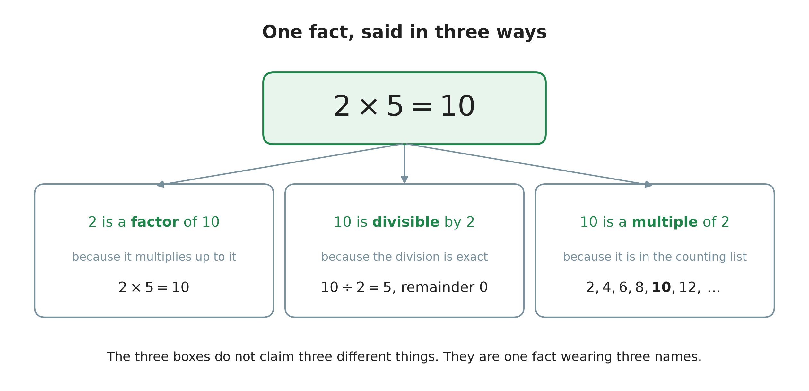
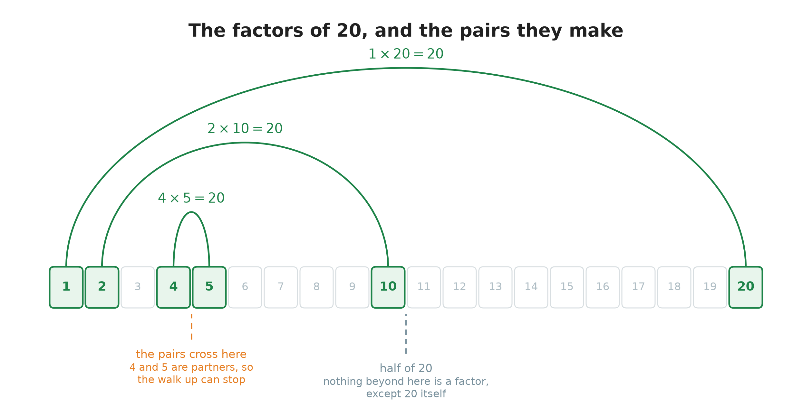
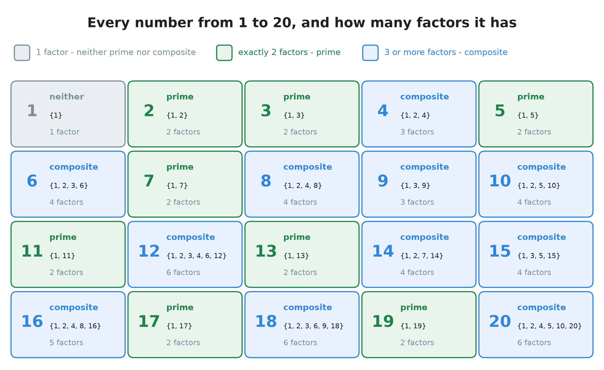
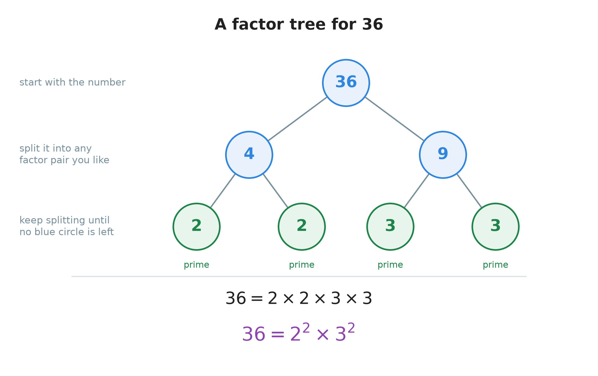
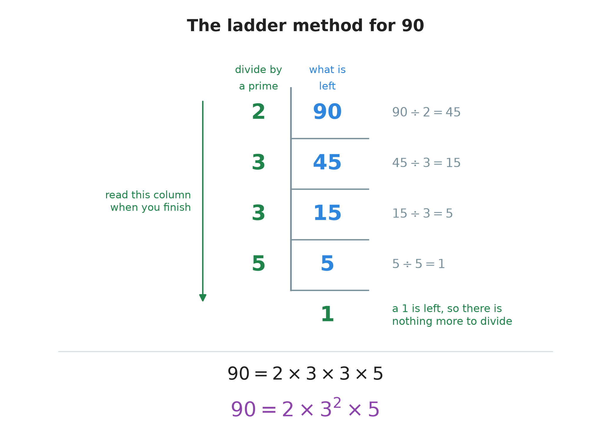
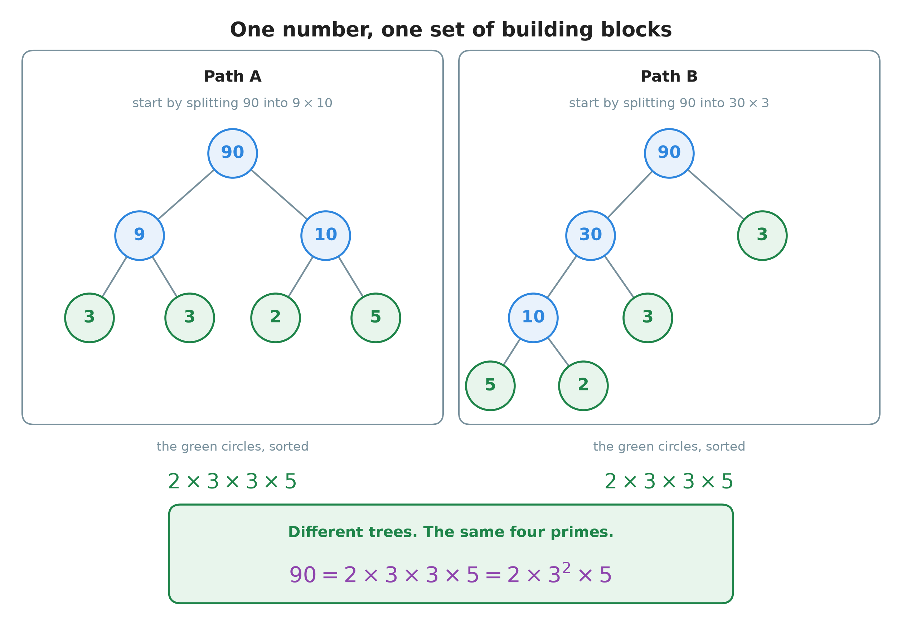
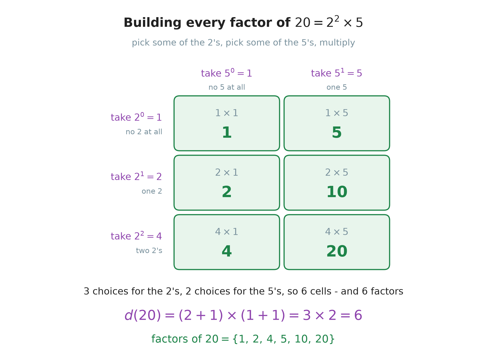

# 12. Divisibility and prime numbers

**What this chapter teaches**
What it means for one number to divide another with nothing left over, how to find every
factor of a number, which numbers cannot be broken up at all, and how to write any number as
a multiplication of those unbreakable numbers.

**Before you start**
Read [Chapter 8](./../8_Dividing_Large_Numbers/8_Dividing_Large_Numbers.md) for division and
the remainder, because this whole chapter is about the remainder being zero. You need
[Chapter 6, section 1.1](./../6_The_Distributive_Property/6_The_Distributive_Property.md#11-multiplication-is-repeated-addition)
for the word **factor**, and [Chapter 10](./../10_Exponents/10_Exponents.md) for powers,
because from section 4 onwards every answer is written with exponents.

---

## Table of contents

1. [Division that leaves nothing behind](#1-division-that-leaves-nothing-behind)
2. [Finding every factor of a number](#2-finding-every-factor-of-a-number)
3. [Prime and composite](#3-prime-and-composite)
4. [Breaking a number into primes](#4-breaking-a-number-into-primes)
5. [One number, one fingerprint](#5-one-number-one-fingerprint)
6. [Counting the factors without listing them](#6-counting-the-factors-without-listing-them)
7. [Glossary](#7-glossary)
8. [Check your understanding](#8-check-your-understanding)
9. [Important notes](#9-important-notes)

---

## 1. Division that leaves nothing behind

### 1.1 Two kinds of division

[Chapter 8](./../8_Dividing_Large_Numbers/8_Dividing_Large_Numbers.md) taught you how to
divide one whole number by another. It also taught you that a division can end in two
different ways.

Share $10$ between $2$ people:

$$
10 \div 2 = 5 \quad \text{remainder } 0
$$

Everybody gets $5$ and the table is empty. Nothing is left over.

Now share $10$ between $3$ people:

$$
10 \div 3 = 3 \quad \text{remainder } 1
$$

Everybody gets $3$ and one thing is still sitting on the table.

[Chapter 8, section 5.3](./../8_Dividing_Large_Numbers/8_Dividing_Large_Numbers.md#53-the-equation-that-says-what-a-right-answer-is)
gave you one equation that describes both of these:

$$
\text{dividend} = (\text{divisor} \times \text{quotient}) + \text{remainder}
$$

Put the two divisions into it:

$$
10 = (2 \times 5) + 0
$$

$$
10 = (3 \times 3) + 1
$$

Look at the last number in each line. That single number is the whole subject of this
chapter.

> **Definition.** A whole number is **divisible** by another whole number when the division
> leaves a remainder of $0$. The answer is a whole number and there is nothing left over.
> $10$ is divisible by $2$. $10$ is not divisible by $3$.

> **Note.** Chapters 1, 2 and 4 all taught you what to do with the leftover: turn it into a
> fraction, or carry on into a decimal. Those chapters were about making the leftover useful.
> This chapter is about the cases where there is no leftover at all.

### 1.2 The numbers this chapter talks about

Everything here is about **whole numbers**, and almost always about the whole numbers above
zero.

> **Definition.** The **whole numbers** are the counting numbers together with zero:
> $0, 1, 2, 3, 4, 5, \dots$ They have no fraction part and no decimal part.

> **Definition.** The **positive integers** are the whole numbers greater than zero:
> $1, 2, 3, 4, 5, \dots$ They are also called the **natural numbers** — they are the numbers
> you use to count real things.

> **Note.** [Chapter 9](./../9_Negative_Numbers/9_Negative_Numbers.md) added the numbers below
> zero. They are not wrong and they have not gone away, but they play no part in this chapter.
> Every number from here to the end of the chapter is a positive integer, unless a line says
> otherwise.

### 1.3 One fact, said in three ways

Here is a multiplication you have known since Chapter 6:

$$
2 \times 5 = 10
$$

Mathematicians have three different sentences for this one fact. You need all three, because
books, teachers and exam questions use all three.

    

**Figure 1 — Three sentences, one fact. The boxes do not say three different things. They look
at the same multiplication from three sides.**

The first sentence uses a word you already have.
[Chapter 6, section 1.1](./../6_The_Distributive_Property/6_The_Distributive_Property.md#11-multiplication-is-repeated-addition)
defined a **factor** as one of the numbers you multiply together. So $2$ is a factor of $10$,
because $2$ multiplied by something whole gives $10$.

The second sentence is section 1.1: $10 \div 2$ leaves nothing over, so $10$ is **divisible**
by $2$.

The third sentence needs one new word.

> **Definition.** A **multiple** of a number is what you get when you multiply that number by
> a whole number. The multiples of $3$ are $3, 6, 9, 12, 15, 18, \dots$ — the numbers you say
> when you count in threes.

So $10$ is a multiple of $2$, because $10$ turns up when you count $2, 4, 6, 8, 10$.

Here is the pattern to remember. A **factor** is small and goes *into* the number. A
**multiple** is big and is built *from* the number.

| Sentence | The small number | The big number |
| :--- | :---: | :---: |
| $2$ is a **factor** of $10$ | $2$ | $10$ |
| $10$ is **divisible** by $2$ | $2$ | $10$ |
| $10$ is a **multiple** of $2$ | $2$ | $10$ |

The two right-hand columns never change. Only the word and the word order do.

> **Warning.** The words *factor* and *multiple* are easy to swap by mistake. $2$ is a factor
> of $10$; $10$ is a multiple of $2$. Saying "$10$ is a factor of $2$" is wrong, because $2$
> is not divisible by $10$.

### 1.4 Even and odd

Two very old words are just names for one particular case of divisibility.

> **Definition.** An **even** number is a whole number that is divisible by $2$. The even
> numbers are $0, 2, 4, 6, 8, 10, 12, \dots$

> **Definition.** An **odd** number is a whole number that is **not** divisible by $2$.
> Dividing it by $2$ always leaves a remainder of $1$. The odd numbers are
> $1, 3, 5, 7, 9, 11, 13, \dots$

Every whole number is one or the other. There is no third group, and no number is both.

### Summary of section 1

* A division either leaves a remainder of $0$ or it does not.
* If the remainder is $0$, the first number is **divisible** by the second.
* "$a$ is a factor of $b$", "$b$ is divisible by $a$" and "$b$ is a multiple of $a$" are three
  ways of saying the same thing.
* A factor goes into the number. A multiple is built from it.
* **Even** means divisible by $2$. **Odd** means not divisible by $2$.

---

## 2. Finding every factor of a number

### 2.1 The two factors you get for free

Every positive integer has at least two factors, and you know them both before you start
working.

**The number $1$ is always a factor**, because dividing by $1$ changes nothing:

$$
N \div 1 = N \quad \text{remainder } 0
$$

**The number itself is always a factor**, because one whole thing fits into itself exactly
once:

$$
N \div N = 1 \quad \text{remainder } 0
$$

So the list of factors of any number starts with $1$ and ends with the number. The work is
finding what sits in between.

### 2.2 Walking up from 1: all the factors of 10

The method is simple and it never misses anything. Test $1$, then $2$, then $3$, and so on.
Each time the division comes out exactly, you have found **two** factors at once: the number
you tested, and the answer.

**Test $1$.**

$$
10 \div 1 = 10 \quad \text{remainder } 0
$$

That gives the pair $1$ and $10$.

**Test $2$.** The last digit of $10$ is even, so this one will work:

$$
10 \div 2 = 5 \quad \text{remainder } 0
$$

That gives the pair $2$ and $5$.

**Test $3$.**

$$
10 \div 3 = 3 \quad \text{remainder } 1
$$

There is a leftover, so $3$ is not a factor.

**Test $4$.**

$$
10 \div 4 = 2 \quad \text{remainder } 2
$$

There is a leftover, so $4$ is not a factor.

**Test $5$.** You already have $5$. It arrived as the partner of $2$. Section 2.4 explains why
that is the signal to stop.

Now write the factors down in order, smallest first:

$$
\text{factors of } 10 = \{1,\, 2,\, 5,\, 10\}
$$

> **Note.** The curly brackets $\{\;\}$ around that list are only a tidy way of writing "here
> is a collection of numbers". They are not the grouping brackets of
> [Chapter 11, section 4.2](./../11_The_Order_Of_Operations/11_The_Order_Of_Operations.md#42-the-other-bracket-shapes),
> and they do not mean "do this part first".

### 2.3 The factors of 20

Same method, a bigger number.

**Test $1$:**

$$
20 \div 1 = 20 \quad \text{remainder } 0 \qquad \text{the pair } (1,\, 20)
$$

**Test $2$:**

$$
20 \div 2 = 10 \quad \text{remainder } 0 \qquad \text{the pair } (2,\, 10)
$$

**Test $3$:**

$$
20 \div 3 = 6 \quad \text{remainder } 2 \qquad \text{not a factor}
$$

**Test $4$:**

$$
20 \div 4 = 5 \quad \text{remainder } 0 \qquad \text{the pair } (4,\, 5)
$$

**Test $5$:** $5$ has already appeared, as the partner of $4$. Stop.

$$
\text{factors of } 20 = \{1,\, 2,\, 4,\, 5,\, 10,\, 20\}
$$

    

**Figure 2 — The six factors of $20$ are really three pairs. Watch how the arcs get shorter as
you move right. The two ends of each pair are walking towards each other, and between $4$ and
$5$ they meet.**

> **Definition.** Two factors that multiply together to give the number are a **factor pair**.
> $(4,\, 5)$ is a factor pair of $20$, because $4 \times 5 = 20$.

### 2.4 Where to stop

You do not have to test every number up to $20$. There are two reasons to stop early, and both
are worth understanding.

**The first reason: nothing past the halfway point can be a factor.**

Suppose some number $f$ is a factor of $N$, and $f$ is bigger than half of $N$. Its partner is
$N \div f$. If you divide by something bigger than half, the answer must come out below $2$:

$$
f > \frac{N}{2} \quad \Rightarrow \quad \frac{N}{f} < 2
$$

* $N$ — the number whose factors you are looking for.
* $f$ — the number you are testing.
* $\frac{N}{f}$ — the partner of $f$, which has to be a whole number if $f$ is a factor.
* $>$ and $<$ — "is bigger than" and "is smaller than", from
  [Chapter 9, section 3](./../9_Negative_Numbers/9_Negative_Numbers.md#3-which-of-two-numbers-is-bigger).

The only positive integer below $2$ is $1$. So the partner is $1$, and that means $f$ is $N$
itself.

In words: **past the halfway point, the only factor is the number itself.** For $20$ that means
you never need to test $11$, $12$, $13$ and so on. The grey mark in Figure 2 shows where that
line falls.

**The second reason: the pairs meet in the middle.**

The halfway rule is true, but you can usually stop long before it. Every time you find a factor
you find its partner as well, and the partner always lands on the far side. As you walk up,
your test number grows and its partner shrinks. Sooner or later the two cross.

For $20$: the test number $4$ had partner $5$, which was still above it. The next test number
is $5$, and its partner is $4$ — now *below* it. You have crossed the middle. Every pair from
here on is a pair you have already written down, with its two numbers the other way round.

> **Note.** This is also the reason the walk up from $1$ never misses anything. Every factor
> belongs to a pair, and at least one member of every pair sits below the crossing point. Test
> everything up to the crossing point and you have caught them all.

### 2.5 Four quick tests

You do not always have to divide to find out whether a division will work. For the smallest
divisors there are tests you can do just by looking at the digits.

| Divisor | The test | Example |
| :---: | :--- | :--- |
| $2$ | The last digit is $0$, $2$, $4$, $6$ or $8$ | $148$ ends in $8$, so $148$ is divisible by $2$ |
| $3$ | The digits added together make a multiple of $3$ | $372$: $3 + 7 + 2 = 12$, and $12$ is a multiple of $3$, so $372$ is divisible by $3$ |
| $5$ | The last digit is $0$ or $5$ | $845$ ends in $5$, so $845$ is divisible by $5$ |
| $10$ | The last digit is $0$ | $90$ ends in $0$, so $90$ is divisible by $10$ |

**Why the tests for 2, 5 and 10 work.**

[Chapter 5, section 2.3](./../5_Adding_And_Subtracting_Large_Numbers/5_Adding_And_Subtracting_Large_Numbers.md#23-what-a-number-is-made-of)
showed that every number splits into its places. Split $148$:

$$
148 = 140 + 8
$$

The part in front, $140$, ends in a zero, so it is a multiple of $10$. And $10$ is
$2 \times 5$. So $140$ can be divided by $2$, by $5$ and by $10$ with nothing left over — and
that stays true whatever the other digits are.

That leaves only the last digit able to cause a leftover. Here the last digit is $8$, and $8$
is divisible by $2$. So $148$ is divisible by $2$ as well.

**Why the test for 3 works.**

This one looks like magic. It is not. Split $372$ into its places:

$$
372 = 300 + 70 + 2
$$

Now write each place as "a number just below it, plus a little":

$$
300 = 3 \times 100 = 3 \times (99 + 1)
$$

$$
70 = 7 \times 10 = 7 \times (9 + 1)
$$

Open both brackets with the
[distributive property](./../6_The_Distributive_Property/6_The_Distributive_Property.md#24-the-rule-in-symbols)
and collect the pieces:

$$
372 = (3 \times 99) + 3 + (7 \times 9) + 7 + 2
$$

$$
372 = (297 + 63) + (3 + 7 + 2)
$$

$$
372 = 360 + 12
$$

Look at what that did. The first bracket was built out of $99$ and $9$, and both of those are
multiples of $3$. So the whole of $360$ divides by $3$ with nothing left over:

$$
360 \div 3 = 120
$$

The second bracket is $3 + 7 + 2$, which is exactly the sum of the digits. That is the only
part that can leave something over. Here it is $12$, and:

$$
12 \div 3 = 4
$$

Nothing left over, so $372$ is divisible by $3$. And the two answers add up to the real one:

$$
120 + 4 = 124, \qquad 372 \div 3 = 124
$$

The same argument works for any number, because $9$, $99$, $999$ and every number like them is
a multiple of $3$. That is the whole trick.

### Summary of section 2

* $1$ and the number itself are factors of every positive integer.
* Walk up from $1$. Every exact division hands you a **factor pair**, so you find two factors
  at a time.
* Nothing bigger than half the number can be a factor, except the number itself.
* You can usually stop even sooner: once your test number and its partner cross, you are
  finished.
* The last digit decides divisibility by $2$, $5$ and $10$. The sum of the digits decides
  divisibility by $3$.

---

## 3. Prime and composite

### 3.1 Counting the factors

Section 2 found four factors for $10$ and six for $20$. Now try a number where the walk up
stops almost at once. Take $7$.

**Test $1$:**

$$
7 \div 1 = 7 \quad \text{remainder } 0 \qquad \text{the pair } (1,\, 7)
$$

**Test $2$:**

$$
7 \div 2 = 3 \quad \text{remainder } 1 \qquad \text{not a factor}
$$

**Test $3$:**

$$
7 \div 3 = 2 \quad \text{remainder } 1 \qquad \text{not a factor}
$$

The answer, $2$, has already dropped below the number being tested, $3$. The pairs have
crossed, so there is nothing left to look for.

$$
\text{factors of } 7 = \{1,\, 7\}
$$

Two factors, and they are the two you get for free. Nothing at all sits in between. Numbers
like this have their own name, and so do the numbers that have something in between.

> **Definition.** A **prime number** is a whole number greater than $1$ that has **exactly
> two** factors: $1$ and itself. The first few are
> $2,\, 3,\, 5,\, 7,\, 11,\, 13,\, 17,\, 19,\, 23, \dots$

> **Definition.** A **composite number** is a whole number greater than $1$ that has **more
> than two** factors. The first few are $4,\, 6,\, 8,\, 9,\, 10,\, 12,\, 14,\, 15, \dots$

A composite number can be split into a multiplication of two smaller whole numbers. A prime
number cannot. That is the difference, and everything else in this chapter follows from it.

    

**Figure 3 — Every number from $1$ to $20$. The colour is decided by the number in the bottom
line of each cell, and by nothing else. Exactly two factors means green. Three or more means
blue. The number $1$ has only one factor, so it is neither.**

### 3.2 Why 1 is not a prime number

Look at the first cell of Figure 3 again. Many people expect $1$ to be prime, and it is not.

The definition asks for **exactly two** factors, and it means two *different* numbers. For
$1$, the two candidates are:

* $1$, because $1 \div 1 = 1$;
* itself, which is also $1$.

Those are the same number. So the list of factors of $1$ is $\{1\}$, and it has length one,
not two.

$$
\text{factors of } 1 = \{1\}
$$

One factor is not two factors, so $1$ is not prime. One factor is not more than two factors
either, so $1$ is not composite.

> **Note.** $1$ is the only whole number above zero that belongs to neither group. It is not a
> mistake in the definitions and it is not an accident. Section 5.2 shows what would break if
> $1$ were allowed in.

### 3.3 The number 2, and why it is on its own

$2$ is the **smallest** prime number, and it is the **only even** prime number.

Being even is not what makes a number composite. $2$ is even, and $2$ is prime: its factors
are $1$ and $2$, which is exactly two.

But no other even number can manage it. Take any even number bigger than $2$ — say $8$. Being
even means $2$ divides it. So the list of factors already contains:

* $1$;
* $2$;
* the number itself.

That is three factors before you have even started looking, and three is more than two. So
every even number above $2$ is composite.

> **Warning.** "Even numbers cannot be prime" is a very common thing to say, and it is wrong.
> $2$ is even and prime. What is true is that every even number **greater than $2$** is
> composite.

### 3.4 Odd does not mean prime

Every prime above $2$ is odd. It is tempting to turn that round and say that every odd number
is prime. That is false, and it is the most common mistake in this chapter.

| Odd number | Factors | Prime or composite? |
| :---: | :--- | :--- |
| $9$ | $\{1,\, 3,\, 9\}$ | composite, because $9 = 3 \times 3$ |
| $15$ | $\{1,\, 3,\, 5,\, 15\}$ | composite, because $15 = 3 \times 5$ |
| $21$ | $\{1,\, 3,\, 7,\, 21\}$ | composite, because $21 = 3 \times 7$ |
| $25$ | $\{1,\, 5,\, 25\}$ | composite, because $25 = 5 \times 5$ |

Being odd only says that $2$ does not divide the number. It says nothing about $3$, $5$, $7$
or any other divisor. To call a number prime you have to check them all.

### 3.5 Is 29 prime?

Here is the full check, using the stopping rule from section 2.4.

**Test $2$:**

$$
29 \div 2 = 14 \quad \text{remainder } 1
$$

**Test $3$:**

$$
29 \div 3 = 9 \quad \text{remainder } 2
$$

**Test $4$:**

$$
29 \div 4 = 7 \quad \text{remainder } 1
$$

**Test $5$:**

$$
29 \div 5 = 5 \quad \text{remainder } 4
$$

Stop here. The test number is $5$ and the answer is $5$ as well, so the two ends have met.
Anything bigger than $5$ would have a partner smaller than $5$, and every number smaller than
$5$ has already been tested.

Not one of them divided $29$ exactly. So:

$$
\text{factors of } 29 = \{1,\, 29\}
$$

Exactly two factors, so **$29$ is prime**.

### 3.6 The primes never run out

The primes get thinner on the ground as you go up. Figure 3 has eight of them in its first
twenty numbers. Between $80$ and $100$ there are only three. It is natural to wonder whether
they stop somewhere.

They do not. The Greek mathematician Euclid proved more than two thousand years ago that
there is no largest prime number. However far you count, there is always another one ahead of
you.

Finding very large primes is hard work, and it is done by computers. The largest ones known
today have tens of millions of digits.

### Summary of section 3

* A **prime** number has exactly two factors: $1$ and itself.
* A **composite** number has three or more factors, so it can be split into smaller whole
  numbers.
* $1$ has only one factor, so it is neither prime nor composite.
* $2$ is the smallest prime and the only even one. Every other even number has $1$, $2$ and
  itself, which is already three factors.
* Odd does **not** mean prime. $9$, $15$, $21$ and $25$ are all odd and all composite.
* To prove a number is prime, test the divisors from $2$ upwards until the pairs cross.
* The primes go on for ever.

---

## 4. Breaking a number into primes

### 4.1 The building blocks

A composite number can be split. A prime number cannot. So if you keep splitting a composite
number, and keep splitting the pieces, the splitting has to stop somewhere — and it can only
stop when every piece is prime.

Try it on $20$. Pick any factor pair you like. Take $4 \times 5$:

$$
20 = 4 \times 5
$$

Now look at the two pieces. $5$ is prime, so it stays as it is. $4$ is composite, and it
splits:

$$
4 = 2 \times 2
$$

Put that back in place of the $4$:

$$
20 = 2 \times 2 \times 5
$$

Now check every piece. $2$ is prime. $2$ is prime. $5$ is prime. There is nothing left to
split, so the job is finished.

Primes are to numbers what atoms are to matter. Every composite number is a little molecule
built by multiplying primes together, and breaking it apart always leads back to the same
atoms.

### 4.2 Writing the answer down

> **Definition.** The **prime factorization** of a number is that number written as a
> multiplication in which every factor is prime.

When the same prime appears more than once, write it as a power, using the notation from
[Chapter 10, section 2.1](./../10_Exponents/10_Exponents.md#21-the-two-parts-and-their-names):

$$
20 = 2 \times 2 \times 5 = 2^{2} \times 5
$$

The $2^{2}$ says "two twos multiplied together", which is exactly what the long form shows.
Both lines say the same thing. The short one is easier to read, and section 6 needs it.

Two small habits make the answers easy to compare:

* **Write the primes in order, smallest first.** $2^{2} \times 5$, not $5 \times 2^{2}$.
* **A prime that appears once needs no exponent.** You may write $5^{1}$, and
  [Chapter 10, section 2.4](./../10_Exponents/10_Exponents.md#24-the-exponent-one)
  says it is correct, but plain $5$ is shorter and means the same.

> **Warning.** $20 = 4 \times 5$ is **not** a prime factorization, because $4$ is not prime.
> Stopping while a composite number is still sitting in the line is the most common error in
> this section. Before you write the answer, look at every single factor and ask whether it
> is prime.

### 4.3 The first method: a factor tree

A **factor tree** is a way of writing the splitting down so you do not lose track of it. Here
is $36$.

**Step 1.** Write $36$ at the top and split it into any factor pair. Take $4 \times 9$:

$$
36 = 4 \times 9
$$

**Step 2.** Look at each piece and ask whether it is prime.

* $4$ is composite, because $4 = 2 \times 2$.
* $9$ is composite, because $9 = 3 \times 3$.

**Step 3.** Split them both, and draw the new pieces underneath:

$$
36 = (2 \times 2) \times (3 \times 3)
$$

**Step 4.** Check every piece again. $2$ is prime and $3$ is prime, so the tree stops.

**Step 5.** Write the answer with exponents:

$$
36 = 2 \times 2 \times 3 \times 3 = 2^{2} \times 3^{2}
$$

    

**Figure 4 — The factor tree for $36$. A blue circle still has to be split. A green circle is
prime and stays where it is. You are finished when no blue circle is left.**

**Check it.** Multiply the green circles back together and you must land on $36$ again:

$$
2 \times 2 = 4
$$

$$
3 \times 3 = 9
$$

$$
4 \times 9 = 36
$$

### 4.4 The second method: the ladder

The tree asks you to think of a factor pair. Sometimes no pair comes to mind. The **ladder**
never asks: you simply divide by the smallest prime that fits, again and again, until you
reach $1$.

Here is $90$.

**Step 1.** Try the smallest prime, $2$. The last digit of $90$ is $0$, so $90$ is even:

$$
90 \div 2 = 45
$$

**Step 2.** Try $2$ again on $45$. The last digit is $5$, so $45$ is odd and $2$ does not fit.
Move up to the next prime, $3$. Add the digits: $4 + 5 = 9$, and $9$ is a multiple of $3$, so
the test in section 2.5 says yes:

$$
45 \div 3 = 15
$$

**Step 3.** Try $3$ again on $15$. Add the digits: $1 + 5 = 6$, and $6$ is a multiple of $3$:

$$
15 \div 3 = 5
$$

**Step 4.** Try $3$ on $5$. It does not fit. Move up to $5$:

$$
5 \div 5 = 1
$$

**Step 5.** You have reached $1$, so there is nothing more to divide. Collect every prime you
divided by:

$$
90 = 2 \times 3 \times 3 \times 5 = 2 \times 3^{2} \times 5
$$

    

**Figure 5 — The ladder for $90$. The primes you divide by go down the left of the line, and
what is left of the number goes down the right. The $1$ at the bottom is the signal to stop,
and the answer is the left-hand column read downwards.**

**Check it.**

$$
3 \times 3 = 9
$$

$$
2 \times 9 = 18
$$

$$
18 \times 5 = 90
$$

### 4.5 A bigger one: 180

The ladder does not get harder when the number gets bigger. It just gets longer.

$180$ is even:

$$
180 \div 2 = 90
$$

$90$ is even too:

$$
90 \div 2 = 45
$$

$45$ is odd. Its digits add to $4 + 5 = 9$, so $3$ fits:

$$
45 \div 3 = 15
$$

$15$ has digits adding to $6$, so $3$ fits again:

$$
15 \div 3 = 5
$$

And $5$ is prime:

$$
5 \div 5 = 1
$$

The primes used were $2,\, 2,\, 3,\, 3,\, 5$:

$$
180 = 2 \times 2 \times 3 \times 3 \times 5 = 2^{2} \times 3^{2} \times 5
$$

**Check it.**

$$
2^{2} = 4
$$

$$
3^{2} = 9
$$

$$
4 \times 9 = 36
$$

$$
36 \times 5 = 180
$$

### 4.6 Choosing between the two methods

| | Factor tree | Ladder |
| :--- | :--- | :--- |
| What you must find at each step | any factor pair | the smallest prime that fits |
| Where the answer ends up | at the ends of the branches | down the left-hand column |
| Best for | small numbers you know well | large numbers, and any number you cannot split at a glance |
| Comes out in order? | no, you have to sort it | yes, smallest prime first |

Neither is better mathematically. They are two ways of writing down the same splitting, and
section 5 shows that they must agree.

### Summary of section 4

* Keep splitting a composite number until every piece is prime. That result is its **prime
  factorization**.
* Write repeated primes as a power, and put the primes in order: $20 = 2^{2} \times 5$.
* A **factor tree** starts from a factor pair you choose and splits downwards.
* The **ladder** divides by the smallest prime that fits, again and again, until $1$ is left.
* An answer that still contains a composite number is not finished.
* Always check by multiplying the primes back together.

---

## 5. One number, one fingerprint

### 5.1 Two trees for 90

Section 4.3 said you may start a factor tree from **any** factor pair. That should worry you a
little. If two people choose different pairs, do they get different answers?

Take $90$ and try it properly.

**Path A.** Start with $9 \times 10$.

$$
90 = 9 \times 10
$$

$$
9 = 3 \times 3
$$

$$
10 = 2 \times 5
$$

Collect the pieces: $3,\, 3,\, 2,\, 5$. Sorted, that is:

$$
90 = 2 \times 3 \times 3 \times 5 = 2 \times 3^{2} \times 5
$$

**Path B.** Start with $30 \times 3$ instead. This tree has a different shape: one branch stops
straight away, and the other goes down three levels.

$$
90 = 30 \times 3
$$

$$
30 = 10 \times 3
$$

$$
10 = 5 \times 2
$$

Collect the pieces: $3,\, 3,\, 5,\, 2$. Sorted, that is:

$$
90 = 2 \times 3 \times 3 \times 5 = 2 \times 3^{2} \times 5
$$

    

**Figure 6 — Two different trees for the same number. The shapes are not the same, the depths
are not the same, and the order the primes appear in is not the same. The set of primes at the
ends of the branches is.**

And the ladder in section 4.4, which never used a factor pair at all, gave that same line.
Three different routes, one answer.

### 5.2 The Fundamental Theorem of Arithmetic

This is not luck. It is a theorem, and it has a grand name because it holds the whole subject
up.

> **Definition.** The **Fundamental Theorem of Arithmetic** says that every whole number
> greater than $1$ is either prime itself, or can be written as a product of primes in
> **exactly one** way. Only the order of the factors can change.

In words: a number has one set of prime building blocks and no other. Nobody can find a second
set, however clever the tree.

That is why a prime factorization is worth calling a **fingerprint**. It belongs to that one
number and to no other. If two numbers have the same prime factorization, they are the same
number.

> **Note.** This is what would break if $1$ were counted as a prime, as section 3.2 promised.
> Watch:
>
> $$20 = 2^{2} \times 5$$
>
> $$20 = 1 \times 2^{2} \times 5$$
>
> $$20 = 1 \times 1 \times 2^{2} \times 5$$
>
> You could go on for ever, and $20$ would have endlessly many different prime factorizations
> instead of one. Leaving $1$ out of the primes is what keeps the word *exactly* in the
> theorem true.

### 5.3 What the fingerprint is for

Once you have the primes of a number, you can answer questions about it without dividing at
all.

**Question.** Take the number $N$ whose prime factorization is:

$$
N = 2^{3} \times 3 \times 5^{2}
$$

What is $N$, and is it divisible by $15$?

**First, what is $N$?** Work out each power, then multiply, left to right:

$$
2^{3} = 8
$$

$$
5^{2} = 25
$$

$$
8 \times 3 = 24
$$

$$
24 \times 25 = 600
$$

So $N = 600$.

**Now, is $600$ divisible by $15$?** You could divide and see. But there is a better way: find
the fingerprint of $15$ as well.

$$
15 = 3 \times 5
$$

To divide $600$ by $15$ exactly, $600$ must contain a $3$ and a $5$ among its primes. Look at
its fingerprint again:

$$
600 = 2^{3} \times \mathbf{3} \times \mathbf{5} \times 5
$$

Both are there. So pull them out and see what stays behind:

$$
600 = (3 \times 5) \times (2^{3} \times 5) = 15 \times 40
$$

That is a clean multiplication of whole numbers, so $600$ is divisible by $15$, and the answer
is $40$.

**Check:** $2^{3} = 8$, and $8 \times 5 = 40$, and $15 \times 40 = 600$.

This gives you a general rule, and it costs nothing extra:

> **Explanation.** One number divides another exactly when **every prime in the smaller
> number's fingerprint also appears in the bigger one's, at least as many times**.

**One where it fails.** Is $600$ divisible by $9$?

$$
9 = 3 \times 3
$$

That needs two $3$'s. But $600 = 2^{3} \times 3 \times 5^{2}$ has only **one** $3$. The second
one is simply not there, so no amount of rearranging will produce it.

So $600$ is not divisible by $9$. And a real division agrees:

$$
600 \div 9 = 66 \quad \text{remainder } 6
$$

### Summary of section 5

* Different factor trees for the same number give the same primes.
* The **Fundamental Theorem of Arithmetic** says that is always true: one number, exactly one
  prime factorization.
* Only the order of the factors can change, which is why the book writes them smallest first.
* The theorem needs $1$ to be left out of the primes. Otherwise a number would have endlessly
  many factorizations.
* A prime factorization is a fingerprint. You can read divisibility straight off it: every
  prime of the divisor must be there, and enough times.

---

## 6. Counting the factors without listing them

### 6.1 Where the count comes from

Section 2 found the factors of $20$ by testing one number after another. For a number like
$600$ that would take a long time. There is a much faster way, and it comes straight out of
the fingerprint.

Start from what $20$ is made of:

$$
20 = 2^{2} \times 5
$$

That is two $2$'s and one $5$, and **nothing else**. By the Fundamental Theorem there is
nothing else to have. So any factor of $20$ has to be built out of those same pieces, and
building one means making two decisions:

* **How many $2$'s do I take?** None, one, or both. That is **three** choices.
* **How many $5$'s do I take?** None, or the one. That is **two** choices.

Every pair of decisions builds one factor, and different decisions build different factors.

    

**Figure 7 — Every factor of $20$, built to order. Three rows times two columns is six cells,
and the six cells hold the six factors of $20$, each one exactly once.**

Read the cells and you get $1,\, 5,\, 2,\, 10,\, 4,\, 20$. Sorted, that is:

$$
\{1,\, 2,\, 4,\, 5,\, 10,\, 20\}
$$

which is exactly the list section 2.3 found the slow way.

The important part is where the **three** came from. The exponent of $2$ is $2$, but there are
$3$ choices, because "take none of them" is a choice too. Taking none of a prime is what puts
the $1$ in the top-left cell.

### 6.2 The formula

First, a name for the general shape of a fingerprint.

> **Definition.** Any whole number $N$ greater than $1$ can be written as
>
> $$N = p_{1}^{e_{1}} \times p_{2}^{e_{2}} \times \dots \times p_{k}^{e_{k}}$$
>
> where $p_{1}, p_{2}, \dots, p_{k}$ are different primes written smallest first, and each
> $e$ says how many times its prime appears. This is called the **standard form** of $N$.

* $p_{1}, p_{2}, \dots$ — the different primes in the number. The little numbers below are
  only labels: $p_{1}$ means "the first prime", $p_{2}$ means "the second prime".
* $e_{1}, e_{2}, \dots$ — the exponents. $e_{1}$ is how many times $p_{1}$ appears.
* $k$ — how many different primes there are altogether.

For $20 = 2^{2} \times 5$: $p_{1} = 2$ with $e_{1} = 2$, and $p_{2} = 5$ with $e_{2} = 1$, so
$k = 2$.

Now count the factors. Each prime gives you "its exponent, plus one" choices, and the choices
are made independently, so the numbers multiply:

$$
d(N) = (e_{1} + 1) \times (e_{2} + 1) \times \dots \times (e_{k} + 1)
$$

In words: take every exponent, add $1$ to each of them, and multiply the results together.
That is how many factors the number has.

* $d(N)$ — how many factors $N$ has. The letter $d$ stands for *divisors*, another word for
  factors.
* $e_{1} + 1$ — the number of choices for the first prime: take none of it, or one, or two,
  and so on.

For $20$:

$$
d(20) = (2 + 1) \times (1 + 1) = 3 \times 2 = 6
$$

Six factors, which matches the list.

> **Warning.** The formula only works on a **prime** factorization. If you feed it
> $36 = 4 \times 9$ and count $(1+1) \times (1+1) = 4$, you get a wrong answer, because $4$ and
> $9$ are not primes and their factors overlap. Break the number down fully first.

### 6.3 Two more counts

**How many factors does $36$ have?**

Section 4.3 found the fingerprint:

$$
36 = 2^{2} \times 3^{2}
$$

The exponents are $2$ and $2$. Add $1$ to each:

$$
d(36) = (2 + 1) \times (2 + 1) = 3 \times 3 = 9
$$

**Check** by listing them: $\{1,\, 2,\, 3,\, 4,\, 6,\, 9,\, 12,\, 18,\, 36\}$. Count them —
there are $9$.

**How many factors does $600$ have?**

Section 5.3 found the fingerprint:

$$
600 = 2^{3} \times 3 \times 5^{2}
$$

The exponents are $3$, $1$ and $2$. Remember that the $3$ in the middle has an invisible
exponent of $1$. Add $1$ to each:

$$
d(600) = (3 + 1) \times (1 + 1) \times (2 + 1)
$$

$$
d(600) = 4 \times 2 \times 3
$$

$$
4 \times 2 = 8
$$

$$
8 \times 3 = 24
$$

So $600$ has $24$ factors. Listing those one at a time would have meant testing every number
up to $300$.

> **Note.** The commonest slip here is forgetting the exponent $1$ on a prime that appears
> once. In $600 = 2^{3} \times 3 \times 5^{2}$ the middle prime is $3^{1}$, so it contributes
> $1 + 1 = 2$, not $1$. Leave it out and you get $12$ instead of $24$.

### Summary of section 6

* Every factor of a number is built by choosing how many of each of its primes to take.
* "Take none of this prime" is one of the choices. That is where the $+1$ comes from.
* $d(N) = (e_{1}+1)(e_{2}+1)\dots(e_{k}+1)$ counts the factors without listing them.
* The formula needs the full prime factorization. It gives nonsense on a partial split.
* A prime written with no exponent still counts as $1$, so it contributes a factor of $2$.

---

## 7. Glossary

Only the words that appear for the first time in this chapter. Everything else is linked back
to the chapter that defined it.

* **Divisible** — able to be divided by another whole number with a remainder of $0$. $10$ is
  divisible by $2$; $10$ is not divisible by $3$.
* **Divisibility** — the property of being divisible. It is the subject of this chapter.
* **Whole numbers** — the counting numbers together with zero: $0, 1, 2, 3, 4, \dots$
* **Positive integers**, also called **natural numbers** — the whole numbers greater than
  zero: $1, 2, 3, 4, \dots$
* **Multiple** — the result of multiplying a number by a whole number. The multiples of $3$
  are $3, 6, 9, 12, \dots$
* **Even** — divisible by $2$.
* **Odd** — not divisible by $2$. Dividing an odd number by $2$ always leaves $1$.
* **Factor pair** — two factors that multiply to give the number. $(4,\, 5)$ is a factor pair
  of $20$.
* **Prime number** — a whole number greater than $1$ with exactly two factors: $1$ and itself.
* **Composite number** — a whole number greater than $1$ with three or more factors.
* **Prime factorization** — a number written as a multiplication in which every factor is
  prime. The prime factorization of $20$ is $2^{2} \times 5$.
* **Factor tree** — a way of finding a prime factorization by splitting a number into a factor
  pair, then splitting each piece, until only primes are left.
* **Ladder method** — a way of finding a prime factorization by dividing by the smallest prime
  that fits, over and over, until $1$ is left.
* **Fundamental Theorem of Arithmetic** — the theorem that every whole number greater than $1$
  has exactly one prime factorization, apart from the order of the factors.
* **Standard form** of a number — its prime factorization written as
  $p_{1}^{e_{1}} \times p_{2}^{e_{2}} \times \dots$, with the primes in order, smallest first.
* **$d(N)$** — how many factors the number $N$ has. The $d$ stands for *divisors*, which is
  another word for factors.

> **Note.** **Factor** and **product** are from
> [Chapter 6, section 1.1](./../6_The_Distributive_Property/6_The_Distributive_Property.md#11-multiplication-is-repeated-addition),
> **dividend**, **divisor** and **quotient** are from
> [Chapter 1, section 1.2](./../1_Fractions/1_Fractions.md#12-the-three-names),
> **remainder** is from
> [Chapter 8, section 5.2](./../8_Dividing_Large_Numbers/8_Dividing_Large_Numbers.md#52-how-big-may-a-remainder-be),
> **greatest common factor** is from
> [Chapter 3, section 4.2](./../3_Percentages/3_Percentages.md#42-doing-it-in-one-step-the-greatest-common-factor),
> and **base**, **exponent** and **power** are from
> [Chapter 10, section 2.1](./../10_Exponents/10_Exponents.md#21-the-two-parts-and-their-names).

---

## 8. Check your understanding

**Question 1.** Is $15$ prime or composite? List all of its factors to prove your answer.

Answer

Walk up from $1$.

$$
15 \div 1 = 15 \quad \text{remainder } 0 \qquad \text{the pair } (1,\, 15)
$$

$$
15 \div 2 = 7 \quad \text{remainder } 1 \qquad \text{not a factor}
$$

$$
15 \div 3 = 5 \quad \text{remainder } 0 \qquad \text{the pair } (3,\, 5)
$$

The next test number is $4$, whose partner would be below $4$. The pairs have crossed, so stop.

$$
\text{factors of } 15 = \{1,\, 3,\, 5,\, 15\}
$$

That is $\mathbf{4}$ factors, which is more than two, so $15$ is **composite**.

**Question 2.** List all the factors of $12$.

Answer

$$
12 \div 1 = 12 \qquad \text{the pair } (1,\, 12)
$$

$$
12 \div 2 = 6 \qquad \text{the pair } (2,\, 6)
$$

$$
12 \div 3 = 4 \qquad \text{the pair } (3,\, 4)
$$

The next test number is $4$, and its partner is $3$ — below it. The pairs have crossed.

$$
\text{factors of } 12 = \{1,\, 2,\, 3,\, 4,\, 6,\, 12\}
$$

**Question 3.** Is $51$ prime?

Answer

It looks prime, and it is not.

$51$ is odd, so $2$ is out. But try the digit test for $3$:

$$
5 + 1 = 6
$$

$6$ is a multiple of $3$, so $3$ divides $51$:

$$
51 \div 3 = 17 \quad \text{remainder } 0
$$

That is a third factor, so $51$ is **composite**.

$$
\text{factors of } 51 = \{1,\, 3,\, 17,\, 51\}
$$

This is the mistake from section 3.4. Odd only rules out $2$. It says nothing about $3$.

**Question 4.** Find the prime factorization of $24$. Write the answer with exponents.

Answer

Using a factor tree, starting from $4 \times 6$:

$$
24 = 4 \times 6
$$

$$
4 = 2 \times 2
$$

$$
6 = 2 \times 3
$$

Collect the primes: $2,\, 2,\, 2,\, 3$.

$$
24 = 2 \times 2 \times 2 \times 3 = 2^{3} \times 3
$$

**Check:** $2^{3} = 8$, and $8 \times 3 = 24$.

**Question 5.** Find the prime factorization of $48$.

Answer

Using the ladder:

$$
48 \div 2 = 24
$$

$$
24 \div 2 = 12
$$

$$
12 \div 2 = 6
$$

$$
6 \div 2 = 3
$$

$$
3 \div 3 = 1
$$

The primes used were $2,\, 2,\, 2,\, 2,\, 3$.

$$
48 = 2^{4} \times 3
$$

**Check:** $2^{4} = 16$, and $16 \times 3 = 48$.

**Question 6.** How many factors does $48$ have? Use the formula, not a list.

Answer

From Question 5:

$$
48 = 2^{4} \times 3
$$

The exponents are $4$ and $1$. Remember the invisible $1$ on the $3$. Add $1$ to each and
multiply:

$$
d(48) = (4 + 1) \times (1 + 1) = 5 \times 2 = 10
$$

$48$ has $\mathbf{10}$ factors.

**Check by listing:** $\{1,\, 2,\, 3,\, 4,\, 6,\, 8,\, 12,\, 16,\, 24,\, 48\}$ — ten of them.

**Question 7.** A number $M$ has the prime factorization $M = 2^{2} \times 7$.

a) What is $M$?
b) How many factors does $M$ have?
c) Is $M$ divisible by $14$? Answer using the primes, not by dividing.

Answer

**a)** Work out the power first, then multiply:

$$
2^{2} = 4
$$

$$
4 \times 7 = 28
$$

So $M = \mathbf{28}$.

**b)** The exponents are $2$ and $1$:

$$
d(M) = (2 + 1) \times (1 + 1) = 3 \times 2 = 6
$$

$M$ has $\mathbf{6}$ factors: $\{1,\, 2,\, 4,\, 7,\, 14,\, 28\}$.

**c)** The fingerprint of $14$ is:

$$
14 = 2 \times 7
$$

That needs one $2$ and one $7$. $M$ has two $2$'s and one $7$, so both are there with enough
to spare. Pull them out:

$$
M = (2 \times 7) \times 2 = 14 \times 2
$$

So yes, $M$ is divisible by $14$, and $28 \div 14 = 2$.

**Question 8.** Find the prime factorization of $200$.

Answer

$200$ ends in $0$, so start with $2$:

$$
200 \div 2 = 100
$$

$$
100 \div 2 = 50
$$

$$
50 \div 2 = 25
$$

$25$ is odd, and its digits add to $7$, so $3$ does not fit. It ends in $5$, so try $5$:

$$
25 \div 5 = 5
$$

$$
5 \div 5 = 1
$$

The primes used were $2,\, 2,\, 2,\, 5,\, 5$.

$$
200 = 2^{3} \times 5^{2}
$$

**Check:** $2^{3} = 8$, $5^{2} = 25$, and $8 \times 25 = 200$.

**Question 9.** A student writes: "the prime factorization of $40$ is $4 \times 10$". Find the
mistake and give the right answer.

Answer

$4 \times 10$ really is $40$, so the arithmetic is fine. The mistake is that the work stopped
too early: neither $4$ nor $10$ is prime.

Carry on splitting:

$$
4 = 2 \times 2
$$

$$
10 = 2 \times 5
$$

$$
40 = 2 \times 2 \times 2 \times 5 = 2^{3} \times 5
$$

**Check:** $2^{3} = 8$, and $8 \times 5 = 40$.

A prime factorization is only finished when every single factor in the line is prime.

**Question 10.** Without doing any division, say whether $2^{4} \times 3^{2}$ is divisible by
$24$, and whether it is divisible by $5$.

Answer

**Divisible by $24$?** First find the fingerprint of $24$. Question 4 did it:

$$
24 = 2^{3} \times 3
$$

That asks for three $2$'s and one $3$. Our number has four $2$'s and two $3$'s, so there is
enough of both.

$$
2^{4} \times 3^{2} = (2^{3} \times 3) \times (2 \times 3) = 24 \times 6
$$

So **yes**. (And $2^{4} \times 3^{2} = 16 \times 9 = 144$, with $144 \div 24 = 6$.)

**Divisible by $5$?** The number $5$ is a prime, and there is no $5$ anywhere in
$2^{4} \times 3^{2}$. By the Fundamental Theorem there is no other way to write this number, so
a $5$ cannot appear from somewhere else.

So **no**. (And indeed $144 \div 5 = 28$ remainder $4$.)

---

## 9. Important notes

**The mistakes people actually make.**

* **Calling $1$ a prime number.** A prime needs exactly two *different* factors. $1$ has one
  factor, so it is neither prime nor composite. It is not a borderline case or a matter of
  taste — section 5.2 shows that the whole subject falls apart if $1$ is let in.
* **Saying that no even number is prime.** $2$ is even and prime. The true statement is that
  every even number *greater than $2$* is composite.
* **Thinking every odd number is prime.** Odd only means $2$ does not divide it. $9$, $15$,
  $21$, $25$ and $51$ are all odd and all composite.
* **Stopping a prime factorization too early.** $20 = 4 \times 5$ and $40 = 4 \times 10$ are
  not answers, because $4$ and $10$ are not prime. Look at every factor in the line before you
  stop.
* **Expecting different factor trees to give different answers.** They cannot. That is what the
  Fundamental Theorem says.
* **Forgetting the invisible exponent $1$.** In $600 = 2^{3} \times 3 \times 5^{2}$ the middle
  prime is $3^{1}$, so it contributes $1 + 1 = 2$ to the factor count.

**The three ideas to keep.**

* **Primes are the atoms.** Every other number above $1$ is built by multiplying primes, and
  there is only one way to build each one. When a number puzzles you, break it into primes and
  look at what it is made of.
* **The fingerprint answers questions that look like division questions.** Is $600$ divisible
  by $15$? Look for a $3$ and a $5$ in $2^{3} \times 3 \times 5^{2}$ — they are both there, so
  yes. Is it divisible by $9$? That needs two $3$'s and there is only one, so no. No long
  division anywhere.
* **The $+1$ in the factor formula is "take none of this prime".** If you remember that one
  sentence you never have to remember the formula, because you can rebuild it from Figure 7.

**How this chapter connects to the rest of the book.**
[Chapter 1](./../1_Fractions/1_Fractions.md) and
[Chapter 8](./../8_Dividing_Large_Numbers/8_Dividing_Large_Numbers.md) were about what to do
with a remainder. This chapter turned the question round and asked which divisions have no
remainder at all.

[Chapter 6, section 1.1](./../6_The_Distributive_Property/6_The_Distributive_Property.md#11-multiplication-is-repeated-addition)
gave you the word *factor* and used it for the two numbers in one multiplication. Here the word
grew up: a number does not have two factors, it has a whole list of them, and section 2 shows
how to find every one.

[Chapter 3, section 4.2](./../3_Percentages/3_Percentages.md#42-doing-it-in-one-step-the-greatest-common-factor)
introduced the greatest common factor and found it by looking at what divided both numbers.
Section 2 of this chapter is that looking, done properly and in an order that cannot miss
anything.

[Chapter 10](./../10_Exponents/10_Exponents.md) taught exponents as rules to practise. This is
the first chapter that uses them to do real work: $2^{3} \times 3 \times 5^{2}$ is not an
exercise, it is the name of the number $600$.

And [Chapter 11](./../11_The_Order_Of_Operations/11_The_Order_Of_Operations.md) is quietly at
work in every line of section 5.3 and section 6. When you turn $2^{3} \times 3 \times 5^{2}$
into $600$, the powers go first and the multiplications second. That is Level 2 before Level 3,
and you did not have to think about it.

---

- [Back to the book](./../README.md)
- Previous: [11 The order of operations](./../11_The_Order_Of_Operations/11_The_Order_Of_Operations.md)
- Next: not written yet.
