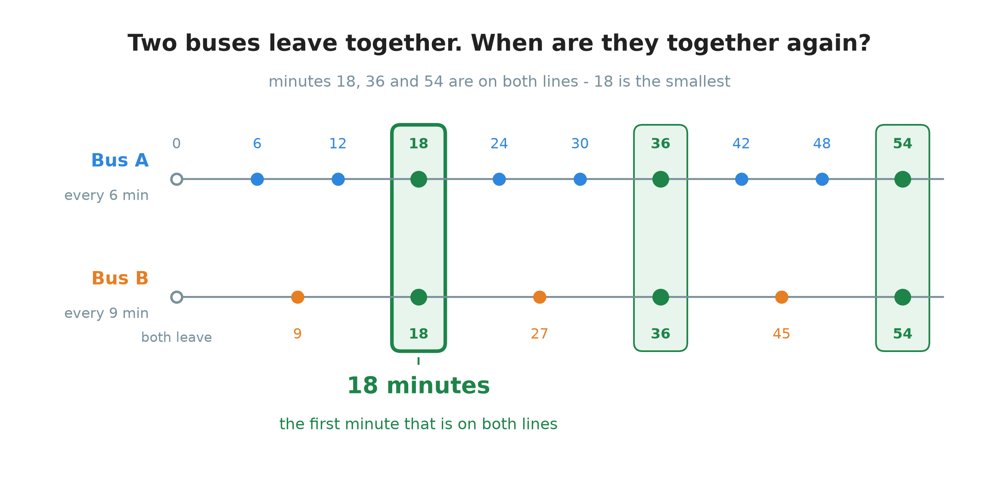
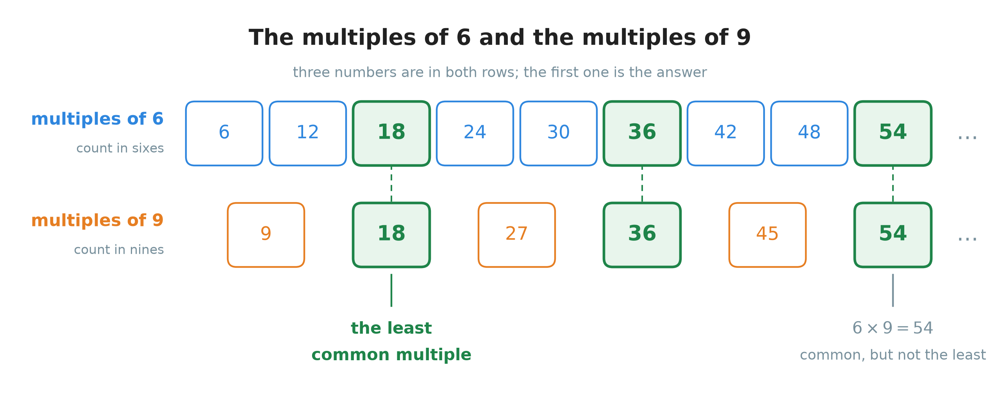
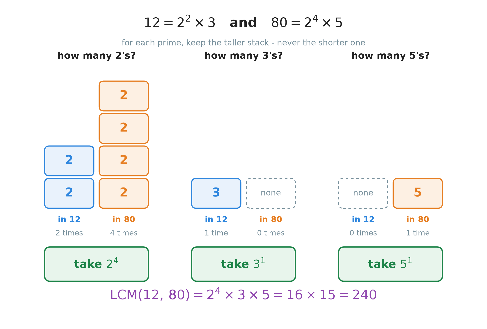
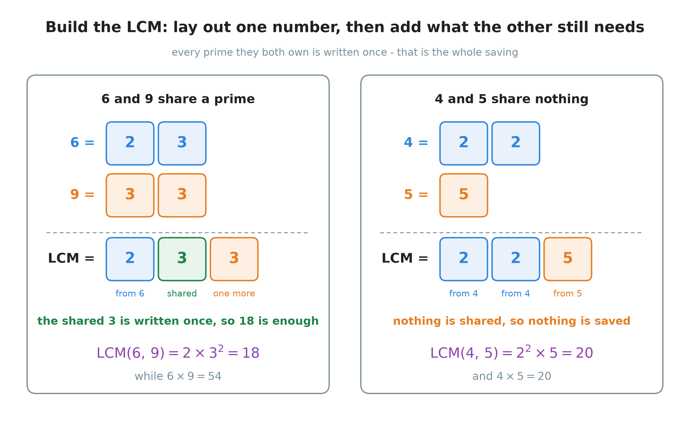
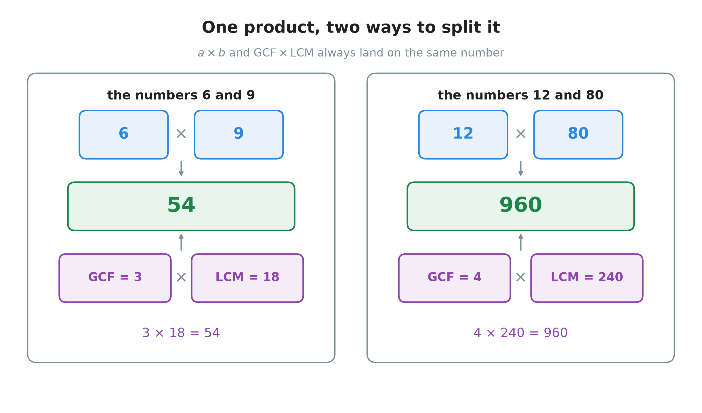
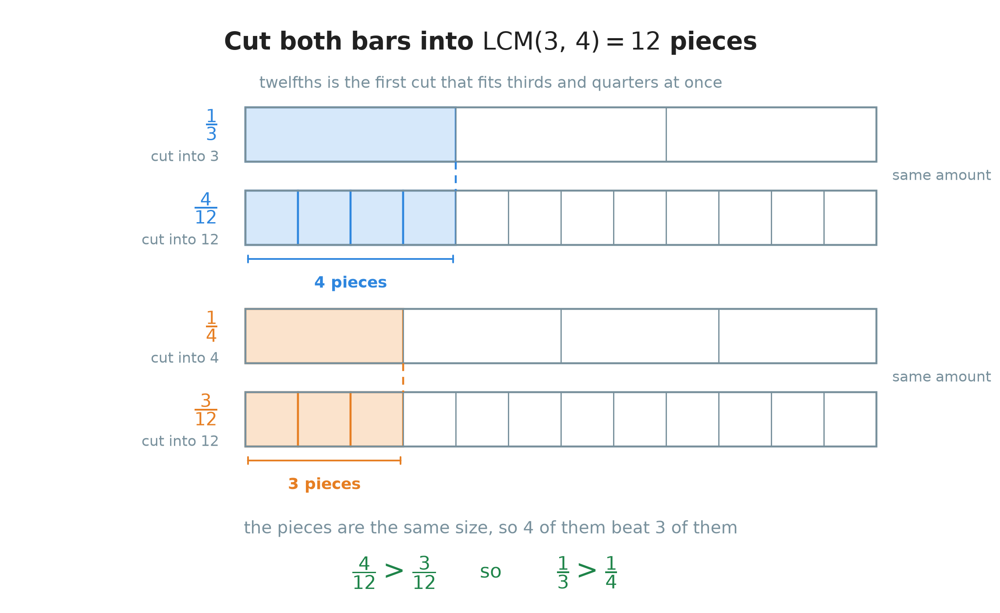

# 13. The least common multiple

**What this chapter teaches**
How to find the smallest number that two or more numbers both divide into, two ways of
finding it, why the second way always works, and what it is for.

**Before you start**
Read [Chapter 12](./../12_Divisibility_And_Prime_Numbers/12_Divisibility_And_Prime_Numbers.md)
first. This chapter uses the word **multiple** from
[section 1.3](./../12_Divisibility_And_Prime_Numbers/12_Divisibility_And_Prime_Numbers.md#13-one-fact-said-in-three-ways),
the prime factorizations from
[section 4](./../12_Divisibility_And_Prime_Numbers/12_Divisibility_And_Prime_Numbers.md#4-breaking-a-number-into-primes),
and the divisibility rule from
[section 5.3](./../12_Divisibility_And_Prime_Numbers/12_Divisibility_And_Prime_Numbers.md#53-what-the-fingerprint-is-for)
on almost every page. You also need
[Chapter 1, section 3](./../1_Fractions/1_Fractions.md#3-the-same-amount-written-in-different-ways)
for equivalent fractions, because that is what section 5 is built on.

---

## Table of contents

1. [Numbers that meet](#1-numbers-that-meet)
2. [The first method: write the lists out](#2-the-first-method-write-the-lists-out)
3. [The second method: build it from the primes](#3-the-second-method-build-it-from-the-primes)
4. [Two short cuts](#4-two-short-cuts)
5. [What the LCM is for: fractions with different bottom numbers](#5-what-the-lcm-is-for-fractions-with-different-bottom-numbers)
6. [Glossary](#6-glossary)
7. [Check your understanding](#7-check-your-understanding)
8. [Important notes](#8-important-notes)

---

## 1. Numbers that meet

### 1.1 Two buses

Two buses stop outside your house. They both leave at eight o'clock in the morning.

* Bus A comes back every $6$ minutes.
* Bus B comes back every $9$ minutes.

You want to catch either bus, so you would like to know the next moment when **both** of them
are at the stop at the same time.

    

**Figure 1 — The two buses meet again after 18 minutes. They meet again at 36 and at 54, but
18 is the first time. Look at the green columns: those are the only minutes that appear on
both lines.**

The answer is $18$ minutes. Nothing in the picture is hard. What matters is the **shape** of
the question, because it comes back again and again:

> Two things repeat at different speeds. When do they line up?

The same shape turns up when you compare two fractions, when you set up a timetable, and when
you plan anything that repeats. This chapter is about answering it without drawing a picture
every time.

### 1.2 The multiples of a number

[Chapter 12, section 1.3](./../12_Divisibility_And_Prime_Numbers/12_Divisibility_And_Prime_Numbers.md#13-one-fact-said-in-three-ways)
gave you the word for the numbers on one of those bus lines.

A **multiple** of a number is what you get when you multiply it by a whole number. The
multiples of $6$ are the minutes when bus A is at the stop:

$$
6 \times 1 = 6
$$

$$
6 \times 2 = 12
$$

$$
6 \times 3 = 18
$$

$$
6 \times 4 = 24
$$

So the multiples of $6$ are $6,\, 12,\, 18,\, 24,\, 30,\, 36,\, \dots$ — the numbers you say
when you count in sixes.

> **Note.** The list of multiples never ends. However far you count, you can always multiply
> by the next whole number and get one more. This matters later: a pair of numbers can never
> run out of common multiples, so there is always an answer to look for.

Two more things are worth noticing about that list, because the whole chapter leans on them.

**The smallest multiple of a number is the number itself.** The multipliers are the counting
numbers $1, 2, 3, \dots$, and the smallest of them is $1$. So the list starts at
$6 \times 1 = 6$, and there is nothing before it.

**Every multiple of $6$ is divisible by $6$.** That is the same fact said the other way round,
and Chapter 12 made a point of it. If a number is in the list, dividing it by $6$ leaves a
remainder of $0$.

### 1.3 A multiple that belongs to both

Now put the two lists side by side.

> **Definition.** A **common multiple** of two numbers is a number that is a multiple of both
> of them at the same time. It is in both lists.

The word *common* here means *shared*. It is the same word as in **greatest common factor**
from [Chapter 3, section 4.2](./../3_Percentages/3_Percentages.md#42-doing-it-in-one-step-the-greatest-common-factor).

**Example.** Is $12$ a common multiple of $3$ and $4$?

$$
3 \times 4 = 12 \qquad \text{so } 12 \text{ is a multiple of } 3
$$

$$
4 \times 3 = 12 \qquad \text{so } 12 \text{ is a multiple of } 4
$$

Both are true, so yes: $12$ is a common multiple of $3$ and $4$.

### 1.4 The least common multiple

Figure 1 shows that $18$, $36$ and $54$ are all common multiples of $6$ and $9$. There are
endlessly many more. Usually you want one of them in particular: the small one.

> **Definition.** The **least common multiple** of two or more numbers is the **smallest**
> positive whole number that is a multiple of all of them. It is written $\mathrm{LCM}$, and
> the numbers go in brackets after it.

So the bus question has this answer:

$$
\mathrm{LCM}(6,\, 9) = 18
$$

Read it out loud as "the least common multiple of six and nine is eighteen".

> **Note.** *Least* is an old word for *smallest*. Some books say **lowest** common multiple
> instead. It is the same thing, and the short form $\mathrm{LCM}$ fits both.

### Summary of section 1

* A **multiple** of a number is that number multiplied by a whole number. The list never ends.
* The smallest multiple of a number is the number itself.
* A **common multiple** of two numbers is in both lists.
* The **least common multiple**, $\mathrm{LCM}$, is the smallest of those shared numbers.
* $\mathrm{LCM}(6,\, 9) = 18$, which is when the two buses meet again.

---

## 2. The first method: write the lists out

### 2.1 The four steps

For small numbers you do not need any theory. You can simply write both lists and look.

1. Write the first few multiples of the first number.
2. Write the first few multiples of the second number.
3. Find the numbers that are in both lists.
4. Take the smallest one.

That is the whole method. The only skill is knowing when to stop writing, and section 2.5
gives you that.

### 2.2 A first one: 3 and 5

**Find $\mathrm{LCM}(3,\, 5)$.**

**Step 1.** Count in threes:

$$
3,\quad 6,\quad 9,\quad 12,\quad 15,\quad 18,\quad 21,\quad 24,\quad 27,\quad 30,\quad \dots
$$

**Step 2.** Count in fives:

$$
5,\quad 10,\quad 15,\quad 20,\quad 25,\quad 30,\quad \dots
$$

**Step 3.** Which numbers are in both? Go along the first list and check each one against the
second. $3$, no. $6$, no. $9$, no. $12$, no. $15$, **yes**.

**Step 4.** $15$ is the first one you reach, so it is the smallest.

$$
\mathrm{LCM}(3,\, 5) = 15
$$

**Check.** A common multiple must divide by both numbers with nothing left over:

$$
15 \div 3 = 5 \quad \text{remainder } 0
$$

$$
15 \div 5 = 3 \quad \text{remainder } 0
$$

Always do this check. It costs two divisions and it catches almost every mistake.

### 2.3 A second one: 6 and 9

**Find $\mathrm{LCM}(6,\, 9)$.**

You already know the answer from Figure 1. Here it is as two lists instead of two bus lines.

    

**Figure 2 — The multiples of $6$ on top, the multiples of $9$ underneath. Three tiles are
green, which means they are in both rows. The first green tile is the answer. The last green
tile is $6 \times 9 = 54$ — look at it now, because section 2.4 is about it.**

$$
\mathrm{LCM}(6,\, 9) = 18
$$

**Check:**

$$
18 \div 6 = 3 \quad \text{remainder } 0
$$

$$
18 \div 9 = 2 \quad \text{remainder } 0
$$

### 2.4 The product is a common multiple, but usually not the least

Multiply the two numbers together:

$$
6 \times 9 = 54
$$

Figure 2 shows $54$ sitting in both rows, in green. So $54$ really is a common multiple. In
fact this is always true, and it is easy to see why:

* $54 = 6 \times 9$, so $54$ is $6$ multiplied by a whole number. It is a multiple of $6$.
* $54 = 9 \times 6$, so it is also $9$ multiplied by a whole number. It is a multiple of $9$.

> **Explanation.** For any two positive whole numbers $a$ and $b$, the product $a \times b$ is
> always a common multiple of $a$ and $b$. Multiplying the two numbers together never gives a
> wrong answer to the question *"give me a common multiple"*.

But $54$ is not the answer to *this* question. The question asked for the **least** one, and
$18$ is smaller.

> **Warning.** The commonest mistake in this chapter is to answer $a \times b$ and stop.
> $6 \times 9 = 54$ is a common multiple of $6$ and $9$. It is not the least common multiple.
> Section 4.1 says exactly when the product *is* the right answer, and it is not often.

Why is there something smaller than $54$? Because $6$ and $9$ have a factor in common: they
are both divisible by $3$. When you multiply $6 \times 9$ you pay for that $3$ twice. Section
3 takes that idea apart properly.

### 2.5 Two things you know before you start

Writing lists is easy, but you can waste a lot of paper. Two facts tell you where the answer
must be, so you know when to start looking and when to give up.

**The LCM is never smaller than the bigger of the two numbers.**

The LCM is a multiple of $6$, and the multiples of $6$ are $6, 12, 18, \dots$ — every one of
them is at least $6$. It is also a multiple of $9$, so it is at least $9$. It has to satisfy
both, so it is at least $9$, the bigger of the two.

$$
\mathrm{LCM}(a,\, b) \geq \text{the bigger of } a \text{ and } b
$$

**The LCM is never bigger than the product.**

Section 2.4 showed that $a \times b$ is a common multiple. The least common multiple is the
smallest of all the common multiples, so it cannot be bigger than one of them.

$$
\mathrm{LCM}(a,\, b) \leq a \times b
$$

* $\geq$ means "is greater than or equal to".
* $\leq$ means "is less than or equal to".

So for $6$ and $9$ the answer had to be somewhere from $9$ to $54$. That is where you look,
and you can stop writing the moment you pass $54$.

### 2.6 Where this method runs out

Now try $\mathrm{LCM}(12,\, 80)$ the same way. The answer turns out to be $240$, and:

$$
240 \div 12 = 20
$$

So the list of multiples of $12$ needs **twenty** entries before it reaches the answer:

$$
12,\, 24,\, 36,\, 48,\, 60,\, 72,\, 84,\, 96,\, 108,\, 120,\, 132,\, 144,\, 156,\, 168,\, 180,\, 192,\, 204,\, 216,\, 228,\, 240
$$

That is slow, and every entry is a chance to make an arithmetic slip. With bigger numbers it
gets worse quickly. You need a method that does not depend on how big the answer is. That is
section 3.

### Summary of section 2

* Method 1: write both lists of multiples, find the shared numbers, take the smallest.
* Always check the answer by dividing it by both numbers. Both remainders must be $0$.
* $a \times b$ is always a common multiple, but usually not the least one.
* The answer is always between the bigger of the two numbers and their product.
* Lists get slow as soon as the answer is far away. Use them only for small numbers.

---

## 3. The second method: build it from the primes

### 3.1 What a common multiple must contain

Before the method, the reason for it. This is the heart of the chapter, and it is one step
from something you already know.

[Chapter 12, section 5.3](./../12_Divisibility_And_Prime_Numbers/12_Divisibility_And_Prime_Numbers.md#53-what-the-fingerprint-is-for)
ended with this rule:

> One number divides another exactly when **every prime in the smaller number's fingerprint
> also appears in the bigger one's, at least as many times**.

Now read it forwards instead of backwards. Suppose some number $M$ is a common multiple of
$12$ and $80$. Being a common multiple means $M$ is divisible by both. So:

* $12 = 2^{2} \times 3$, and $M$ is divisible by $12$. So $M$ must contain **at least two**
  $2$'s and **at least one** $3$.
* $80 = 2^{4} \times 5$, and $M$ is divisible by $80$. So $M$ must contain **at least four**
  $2$'s and **at least one** $5$.

Put the two demands about the prime $2$ next to each other. $M$ needs at least two $2$'s, and
$M$ needs at least four $2$'s. Four is the harder demand. Any $M$ that has four $2$'s already
has two of them, so meeting the harder demand meets the easier one for free.

That is the whole idea:

> **Explanation.** For each prime, a common multiple must contain that prime **at least as
> many times as the number that uses it most**. The **least** common multiple contains it
> exactly that many times and no more, because any extra copy would only make the number
> bigger without being needed.

So the rule is *take the larger count*, and now you know why. Taking the smaller count fails
immediately: a number with only two $2$'s is not divisible by $80$, and so it is not a common
multiple at all.

    

**Figure 3 — One group for each prime. In every group there are two stacks: how many times
that prime is inside $12$, and how many times it is inside $80$. Keep the taller stack.
The three green boxes are the answer, and multiplying them gives $240$.**

### 3.2 The five steps

1. Write the prime factorization of each number
   ([Chapter 12, section 4](./../12_Divisibility_And_Prime_Numbers/12_Divisibility_And_Prime_Numbers.md#4-breaking-a-number-into-primes)).
2. List every prime that appears in **any** of them.
3. For each of those primes, count how many times it appears in each number.
4. Keep the **largest** count.
5. Multiply all the kept powers together.

> **Warning.** Step 4 says **largest**. Taking the smallest count is the second commonest
> mistake in this chapter, and the answer it gives is not a common multiple at all. Section 3.1
> says why: the number that needs the most copies of a prime would not divide the result.

### 3.3 6 and 9 again, from the primes

Before trusting a new method, run it on a question you already know the answer to.

**Step 1.** The two prime factorizations:

$$
6 = 2 \times 3
$$

$$
9 = 3 \times 3 = 3^{2}
$$

**Step 2.** The primes that appear anywhere: $2$ and $3$.

**Step 3 and 4.** Count each one, and keep the bigger count:

| Prime | Times in $6$ | Times in $9$ | Keep |
| :---: | :---: | :---: | :---: |
| $2$ | $1$ | $0$ | $2^{1}$ |
| $3$ | $1$ | $2$ | $3^{2}$ |

**Step 5.** Multiply. Work out the power first, then multiply
([Chapter 11](./../11_The_Order_Of_Operations/11_The_Order_Of_Operations.md)):

$$
3^{2} = 9
$$

$$
2 \times 9 = 18
$$

$$
\mathrm{LCM}(6,\, 9) = 2 \times 3^{2} = 18
$$

The same $18$ that the lists gave, and the same $18$ the buses gave.

Figure 4 shows what just happened, and at the same time answers the question from section 2.4:
where did the saving come from?

    

**Figure 4 — Building the LCM means laying out the primes of the first number and then adding
only what the second number still needs. Left: $6$ and $9$ both own a $3$, so that $3$ is
written once instead of twice, and $18$ is enough. Right: $4$ and $5$ own nothing in common,
so nothing is saved and the LCM is the full product $20$.**

> **Note.** In the left panel, $9$ needs two $3$'s. One of them is already on the table,
> because $6$ brought a $3$ with it. So $9$ only adds **one more**. That single saved tile is
> the whole difference between $18$ and $54$: $54 \div 3 = 18$.

### 3.4 The one the lists could not reach: 12 and 80

**Find $\mathrm{LCM}(12,\, 80)$.**

**Step 1.** Break both numbers into primes. Use the ladder from
[Chapter 12, section 4.4](./../12_Divisibility_And_Prime_Numbers/12_Divisibility_And_Prime_Numbers.md#44-the-second-method-the-ladder):

$$
12 \div 2 = 6
$$

$$
6 \div 2 = 3
$$

$$
3 \div 3 = 1
$$

$$
12 = 2 \times 2 \times 3 = 2^{2} \times 3
$$

And for $80$:

$$
80 \div 2 = 40
$$

$$
40 \div 2 = 20
$$

$$
20 \div 2 = 10
$$

$$
10 \div 2 = 5
$$

$$
5 \div 5 = 1
$$

$$
80 = 2 \times 2 \times 2 \times 2 \times 5 = 2^{4} \times 5
$$

**Step 2.** The primes that appear anywhere: $2$, $3$ and $5$.

**Steps 3 and 4.** This is Figure 3, written as a table:

| Prime | Times in $12$ | Times in $80$ | Keep |
| :---: | :---: | :---: | :---: |
| $2$ | $2$ | $4$ | $2^{4}$ |
| $3$ | $1$ | $0$ | $3^{1}$ |
| $5$ | $0$ | $1$ | $5^{1}$ |

> **Note.** A $0$ in this table is not a problem. It means the prime is simply not in that
> number, so that number asks for none of it. The other number still asks for one, and one is
> bigger than none.

**Step 5.** Multiply the kept powers. Powers first, then the multiplications, left to right:

$$
2^{4} = 16
$$

$$
16 \times 3 = 48
$$

$$
48 \times 5 = 240
$$

$$
\mathrm{LCM}(12,\, 80) = 2^{4} \times 3 \times 5 = 240
$$

**Check:**

$$
240 \div 12 = 20 \quad \text{remainder } 0
$$

$$
240 \div 80 = 3 \quad \text{remainder } 0
$$

Five short divisions and one multiplication, instead of twenty lines of counting.

### 3.5 The formula

Here is the same method in symbols. Do not start here — start with the table above, then read
this as a shorter way of writing it down.

Suppose two numbers are built from the same list of primes $p_{1}, p_{2}, \dots$, where an
exponent may be $0$ if that prime is missing:

$$
a = p_{1}^{e_{1}} \times p_{2}^{e_{2}} \times \dots
$$

$$
b = p_{1}^{f_{1}} \times p_{2}^{f_{2}} \times \dots
$$

Then:

$$
\mathrm{LCM}(a,\, b) = p_{1}^{\max(e_{1},\, f_{1})} \times p_{2}^{\max(e_{2},\, f_{2})} \times \dots
$$

In words: for each prime, keep the bigger of the two exponents, then multiply everything
together.

* $p_{1}, p_{2}, \dots$ — the primes that appear in either number.
* $e_{1}, e_{2}, \dots$ — how many times each prime appears in $a$.
* $f_{1}, f_{2}, \dots$ — how many times each prime appears in $b$.
* $\max(e,\, f)$ — the bigger of the two numbers $e$ and $f$. $\max$ is short for *maximum*.
  If they are equal, $\max$ is that same value.

**Try it on the numbers you just did.** With $a = 12 = 2^{2} \times 3^{1} \times 5^{0}$ and
$b = 80 = 2^{4} \times 3^{0} \times 5^{1}$:

$$
\max(2,\, 4) = 4
$$

$$
\max(1,\, 0) = 1
$$

$$
\max(0,\, 1) = 1
$$

$$
\mathrm{LCM}(12,\, 80) = 2^{4} \times 3^{1} \times 5^{1} = 240
$$

Which is the table, exactly.

> **Note.** The exponents written as $0$ are only there so that both numbers can be written
> with the same list of primes. You would never write $12 = 2^{2} \times 3 \times 5^{0}$ in an
> answer. It is a drawing device, like the empty dashed tiles in Figure 3.

### 3.6 Three numbers at once: 12, 18 and 30

Nothing about the method depends on there being only two numbers. With three numbers you
compare three counts instead of two and keep the biggest.

**Find $\mathrm{LCM}(12,\, 18,\, 30)$.**

**Step 1.** All three prime factorizations:

$$
12 = 2^{2} \times 3
$$

$$
18 = 2 \times 3^{2}
$$

$$
30 = 2 \times 3 \times 5
$$

**Step 2.** The primes used anywhere: $2$, $3$ and $5$.

**Steps 3 and 4.**

| Prime | In $12$ | In $18$ | In $30$ | Keep |
| :---: | :---: | :---: | :---: | :---: |
| $2$ | $2$ | $1$ | $1$ | $2^{2}$ |
| $3$ | $1$ | $2$ | $1$ | $3^{2}$ |
| $5$ | $0$ | $0$ | $1$ | $5^{1}$ |

**Step 5.** Powers first, then multiply:

$$
2^{2} = 4
$$

$$
3^{2} = 9
$$

$$
4 \times 9 = 36
$$

$$
36 \times 5 = 180
$$

$$
\mathrm{LCM}(12,\, 18,\, 30) = 2^{2} \times 3^{2} \times 5 = 180
$$

**Check all three:**

$$
180 \div 12 = 15 \quad \text{remainder } 0
$$

$$
180 \div 18 = 10 \quad \text{remainder } 0
$$

$$
180 \div 30 = 6 \quad \text{remainder } 0
$$

> **Note.** Notice that the winning count came from a different number each time: the $2$'s
> from $12$, the $3$'s from $18$, the $5$ from $30$. No single one of the three numbers is
> "the important one". Each prime is decided on its own.

### Summary of section 3

* Every common multiple must contain each prime at least as often as the number that uses it
  most. That is Chapter 12, section 5.3 read forwards.
* So the LCM keeps, for each prime, the **largest** count — never the smallest.
* The five steps: factorize, list the primes, count, keep the largest, multiply.
* A prime missing from a number counts as $0$ times, and $0$ never wins against $1$.
* The method works for three or more numbers with no change.
* Always check by dividing the answer by every number you started with.

---

## 4. Two short cuts

### 4.1 Numbers that share nothing

Look at the right-hand panel of Figure 4 again. The numbers $4$ and $5$ have no prime in
common at all: $4 = 2^{2}$ and $5$ is a prime on its own. Nothing overlaps, so nothing can be
saved, and the LCM is the whole product.

> **Definition.** Two numbers are **coprime** when they share no prime factor. They are also
> called **relatively prime**. $4$ and $5$ are coprime. $6$ and $9$ are not, because both
> contain a $3$.

> **Explanation.** If $a$ and $b$ are coprime, then
> $\mathrm{LCM}(a,\, b) = a \times b$. Every prime belongs to only one of the two numbers, so
> for that prime the other number's count is $0$, and the larger count is simply the one it
> already had. Nothing is dropped, so the LCM keeps everything from both numbers — which is
> exactly $a \times b$.

**Example.** $\mathrm{LCM}(3,\, 5)$. Both are primes, and they are different primes, so they
are coprime:

$$
\mathrm{LCM}(3,\, 5) = 3 \times 5 = 15
$$

That is the answer section 2.2 found by writing out ten multiples of $3$.

**Example.** $\mathrm{LCM}(4,\, 5) = 4 \times 5 = 20$.

> **Warning.** Coprime does **not** mean both numbers are prime. $4$ is not prime and $9$ is
> not prime, but $4 = 2^{2}$ and $9 = 3^{2}$ share nothing, so they are coprime and
> $\mathrm{LCM}(4,\, 9) = 36$. What matters is the primes they are built from, not whether
> they are primes themselves.

### 4.2 The bridge between the LCM and the GCF

[Chapter 3, section 4.2](./../3_Percentages/3_Percentages.md#42-doing-it-in-one-step-the-greatest-common-factor)
gave you the **greatest common factor**: the biggest number that divides both. The LCM and the
GCF are tied together by a short rule.

$$
\mathrm{LCM}(a,\, b) \times \mathrm{GCF}(a,\, b) = a \times b
$$

In words: multiply the least common multiple by the greatest common factor, and you get the
same answer as multiplying the two original numbers.

* $a$ and $b$ — the two numbers you started with.
* $\mathrm{GCF}(a,\, b)$ — the greatest common factor, the biggest number that divides both.
* $\mathrm{LCM}(a,\, b)$ — the least common multiple, the smallest number both divide into.

    

**Figure 5 — The green box in the middle is the product $a \times b$. The pair above it and
the pair below it both multiply to that same number. The rule is not a new fact — it is one
number cut in two in two different ways.**

**Check it on $6$ and $9$.** The biggest number that divides both $6$ and $9$ is $3$:

$$
\mathrm{GCF}(6,\, 9) = 3
$$

$$
3 \times 18 = 54
$$

$$
6 \times 9 = 54
$$

The two sides agree.

**Check it on $12$ and $80$.** The biggest number that divides both is $4$:

$$
\mathrm{GCF}(12,\, 80) = 4
$$

$$
4 \times 240 = 960
$$

$$
12 \times 80 = 960
$$

They agree again.

This is most useful as a **check**. When you have found an LCM by one route, the rule lets you
test it by a different route, which is the habit
[Chapter 7, section 7.2](./../7_Multiplying_Large_Numbers/7_Multiplying_Large_Numbers.md#72-checking-your-answer)
recommended: a check that repeats the same steps repeats the same mistake.

### Summary of section 4

* Two numbers are **coprime** when they share no prime factor.
* For coprime numbers, and only for them, $\mathrm{LCM}(a,\, b) = a \times b$.
* Coprime does not mean prime. $4$ and $9$ are coprime.
* $\mathrm{LCM}(a,\, b) \times \mathrm{GCF}(a,\, b) = a \times b$, always.
* Use that rule to check an answer you found another way.

---

## 5. What the LCM is for: fractions with different bottom numbers

### 5.1 The question

Which is larger, $\frac{1}{3}$ or $\frac{1}{4}$?

[Chapter 1, section 4.2](./../1_Fractions/1_Fractions.md#42-when-the-numerators-are-the-same)
can already answer this one, because the top numbers match. But that trick only works in
special cases. The method in this section works for any two fractions, and it is the reason
the LCM is worth learning.

The difficulty is that thirds and quarters are different sizes. You cannot compare "one third"
with "one quarter" by counting, because the things being counted are not the same. It is like
comparing $3$ boxes with $4$ bags.

[Chapter 1, section 4.1](./../1_Fractions/1_Fractions.md#41-when-the-denominators-are-the-same)
showed how easy it becomes when the bottom numbers match: with the same bottom number, the
bigger top number wins, and that is all there is to it. So the job is to make the bottom
numbers match.

### 5.2 The least common denominator

The bottom number of a fraction says how many pieces the whole was cut into. To rewrite
$\frac{1}{3}$ with a different bottom number, you have to cut the whole into more pieces — and
that only works if the new number of pieces can be shared out evenly among the old ones.

So the new bottom number must be a multiple of $3$. And for the other fraction it must be a
multiple of $4$. It must be a common multiple of both. The smallest choice is the LCM.

> **Definition.** The **least common denominator** of two or more fractions is the least
> common multiple of their bottom numbers. It is written $\mathrm{LCD}$.

For $\frac{1}{3}$ and $\frac{1}{4}$:

$$
\mathrm{LCD} = \mathrm{LCM}(3,\, 4) = 12
$$

$3$ and $4$ are coprime, so section 4.1 gives this in one line: $3 \times 4 = 12$.

> **Note.** Any common multiple would work. $24$ and $36$ are common multiples of $3$ and $4$
> too, and they give correct answers. The *least* one is chosen because it keeps the numbers
> small, and small numbers mean fewer mistakes.

### 5.3 Cutting both fractions the same way

Now rewrite each fraction with $12$ underneath. The tool is the rule from
[Chapter 1, section 3.2](./../1_Fractions/1_Fractions.md#32-the-rule-do-the-same-thing-to-the-top-and-to-the-bottom):
multiply the top and the bottom by the same number, and the value does not change.

**The first fraction.** To turn $3$ into $12$, multiply by $4$, because $3 \times 4 = 12$. So
multiply the top by $4$ as well:

$$
\frac{1}{3} = \frac{1 \times 4}{3 \times 4} = \frac{4}{12}
$$

**The second fraction.** To turn $4$ into $12$, multiply by $3$, because $4 \times 3 = 12$. So
multiply the top by $3$ as well:

$$
\frac{1}{4} = \frac{1 \times 3}{4 \times 3} = \frac{3}{12}
$$

> **Warning.** Both numbers must be multiplied — the top **and** the bottom. Writing
> $\frac{1}{3} = \frac{1}{12}$ is wrong, and badly wrong: $\frac{1}{12}$ is a much smaller
> amount. The reason the value survives is that multiplying by $\frac{4}{4}$ is multiplying by
> $1$, and [Chapter 1, section 2.3](./../1_Fractions/1_Fractions.md#23-when-the-parts-build-the-whole-back)
> showed that any number over itself is $1$.

**Now compare.** Both fractions are counted in twelfths, so the pieces are the same size, and
the bigger top number wins:

$$
4 > 3 \quad \text{so} \quad \frac{4}{12} > \frac{3}{12}
$$

$$
\frac{1}{3} > \frac{1}{4}
$$

    

**Figure 6 — All four bars are the same length. Cutting a bar more finely does not change how
much is shaded: the dashed line shows that the shaded part ends in the same place. Once both
bars are cut into twelfths, the comparison is just counting pieces — $4$ against $3$.**

> **Note.** The same rewriting is what lets you add and subtract fractions with different
> bottom numbers. You cannot add thirds to quarters, but you can add twelfths to twelfths.

### 5.4 A second one: $\frac{5}{6}$ against $\frac{7}{9}$

**Which is larger, $\frac{5}{6}$ or $\frac{7}{9}$?**

**Step 1. Find the least common denominator.** That is $\mathrm{LCM}(6,\, 9)$, which section
3.3 worked out:

$$
\mathrm{LCD} = \mathrm{LCM}(6,\, 9) = 18
$$

These two are not coprime, so the product $54$ would also work — but it would make the numbers
three times bigger for no reason.

**Step 2. Rewrite the first fraction.** To turn $6$ into $18$, multiply by $3$, because
$6 \times 3 = 18$:

$$
\frac{5}{6} = \frac{5 \times 3}{6 \times 3} = \frac{15}{18}
$$

**Step 3. Rewrite the second fraction.** To turn $9$ into $18$, multiply by $2$, because
$9 \times 2 = 18$:

$$
\frac{7}{9} = \frac{7 \times 2}{9 \times 2} = \frac{14}{18}
$$

**Step 4. Compare the top numbers.**

$$
15 > 14 \quad \text{so} \quad \frac{15}{18} > \frac{14}{18}
$$

$$
\frac{5}{6} > \frac{7}{9}
$$

Note that the answer is given in the **original** forms. The twelfths and the eighteenths were
only a tool for comparing; nobody asked you to change the fractions.

### Summary of section 5

* Two fractions can only be compared by counting when their bottom numbers match.
* The new bottom number must be a common multiple of both old ones.
* The smallest choice is the **least common denominator**, which is the LCM of the bottom
  numbers.
* Rewrite each fraction by multiplying its top and its bottom by the same number.
* Then the bigger top number wins, and you give the answer in the original fractions.

---

## 6. Glossary

Only the words that appear for the first time in this chapter. Everything else is linked back
to the chapter that defined it.

* **Common multiple** — a number that is a multiple of two or more numbers at the same time.
  $54$ is a common multiple of $6$ and $9$.
* **Least common multiple**, written $\mathrm{LCM}$ — the smallest positive whole number that
  is a multiple of all the given numbers. $\mathrm{LCM}(6,\, 9) = 18$. Also called the
  *lowest* common multiple.
* **$\mathrm{LCM}(a,\, b)$** — the way the least common multiple is written down. The numbers
  it is about go inside the brackets.
* **Coprime**, also called **relatively prime** — two numbers that share no prime factor.
  $4$ and $5$ are coprime, and so are $4$ and $9$.
* **Least common denominator**, written $\mathrm{LCD}$ — the least common multiple of the
  bottom numbers of two or more fractions.
* **$\max$** — short for *maximum*: the bigger of the numbers written inside the brackets.
  $\max(2,\, 4) = 4$.

> **Note.** **Multiple**, **divisible**, **prime number** and **prime factorization** are from
> [Chapter 12](./../12_Divisibility_And_Prime_Numbers/12_Divisibility_And_Prime_Numbers.md),
> **factor** and **product** are from
> [Chapter 6, section 1.1](./../6_The_Distributive_Property/6_The_Distributive_Property.md#11-multiplication-is-repeated-addition),
> **greatest common factor** is from
> [Chapter 3, section 4.2](./../3_Percentages/3_Percentages.md#42-doing-it-in-one-step-the-greatest-common-factor),
> **numerator**, **denominator** and **equivalent fractions** are from
> [Chapter 1](./../1_Fractions/1_Fractions.md), and **exponent** and **power** are from
> [Chapter 10, section 2.1](./../10_Exponents/10_Exponents.md#21-the-two-parts-and-their-names).

---

## 7. Check your understanding

**Question 1.** Find $\mathrm{LCM}(4,\, 6)$ by writing out the two lists.

Answer

Multiples of $4$:

$$
4,\quad 8,\quad 12,\quad 16,\quad 20,\quad 24,\quad \dots
$$

Multiples of $6$:

$$
6,\quad 12,\quad 18,\quad 24,\quad 30,\quad \dots
$$

The numbers in both lists are $12$, $24$, and so on. The smallest is $12$.

$$
\mathrm{LCM}(4,\, 6) = 12
$$

**Check:** $12 \div 4 = 3$ remainder $0$, and $12 \div 6 = 2$ remainder $0$.

Note that $4 \times 6 = 24$ is also a common multiple, but it is not the least. The two
numbers share a factor of $2$.

**Question 2.** Find $\mathrm{LCM}(15,\, 20)$ using prime factorizations.

Answer

**Step 1.** Break both numbers into primes:

$$
15 = 3 \times 5
$$

$$
20 = 2 \times 2 \times 5 = 2^{2} \times 5
$$

**Step 2.** The primes used anywhere: $2$, $3$ and $5$.

**Steps 3 and 4.**

| Prime | In $15$ | In $20$ | Keep |
| :---: | :---: | :---: | :---: |
| $2$ | $0$ | $2$ | $2^{2}$ |
| $3$ | $1$ | $0$ | $3^{1}$ |
| $5$ | $1$ | $1$ | $5^{1}$ |

The prime $5$ appears once in each, so the bigger count is still $1$. It is written once, not
twice — that is the saving.

**Step 5.**

$$
2^{2} = 4
$$

$$
4 \times 3 = 12
$$

$$
12 \times 5 = 60
$$

$$
\mathrm{LCM}(15,\, 20) = 2^{2} \times 3 \times 5 = 60
$$

**Check:** $60 \div 15 = 4$ remainder $0$, and $60 \div 20 = 3$ remainder $0$.

**Question 3.** Find $\mathrm{LCM}(7,\, 8)$, and say how you knew without doing much work.

Answer

$$
7 = 7 \qquad \text{(a prime on its own)}
$$

$$
8 = 2^{3}
$$

The only prime in $7$ is $7$, and the only prime in $8$ is $2$. They share nothing, so they
are **coprime**, and section 4.1 says the LCM is just the product:

$$
\mathrm{LCM}(7,\, 8) = 7 \times 8 = 56
$$

**Check:** $56 \div 7 = 8$ remainder $0$, and $56 \div 8 = 7$ remainder $0$.

**Question 4.** A student says "$\mathrm{LCM}(10,\, 15) = 150$, because $10 \times 15 = 150$".
Find the mistake and give the right answer.

Answer

$150$ really is a common multiple of $10$ and $15$, so the student has not broken any rule of
arithmetic. The mistake is that $150$ is not the **least** one. The product is only the answer
when the two numbers are coprime, and these two are not:

$$
10 = 2 \times 5
$$

$$
15 = 3 \times 5
$$

They both contain a $5$. Take the bigger count of each prime:

| Prime | In $10$ | In $15$ | Keep |
| :---: | :---: | :---: | :---: |
| $2$ | $1$ | $0$ | $2^{1}$ |
| $3$ | $0$ | $1$ | $3^{1}$ |
| $5$ | $1$ | $1$ | $5^{1}$ |

$$
2 \times 3 = 6
$$

$$
6 \times 5 = 30
$$

$$
\mathrm{LCM}(10,\, 15) = 30
$$

**Check:** $30 \div 10 = 3$ remainder $0$, and $30 \div 15 = 2$ remainder $0$.

The shared $5$ was paid for twice in $150$, and once in $30$. And indeed
$150 \div 5 = 30$.

**Question 5.** A student writes: "$18 = 2 \times 3^{2}$ and $24 = 2^{3} \times 3$, so the LCM
is $2 \times 3 = 6$, because I take the smaller power each time." Find the mistake and give
the right answer.

Answer

The rule is the **largest** count for each prime, not the smallest. The quickest way to see
that $6$ is wrong is to test it: $6 \div 18$ does not even give a whole number, so $6$ is not
a multiple of $18$ at all. It is far too small — section 2.5 says the answer can never be
below $24$.

Take the bigger count each time:

| Prime | In $18$ | In $24$ | Keep |
| :---: | :---: | :---: | :---: |
| $2$ | $1$ | $3$ | $2^{3}$ |
| $3$ | $2$ | $1$ | $3^{2}$ |

$$
2^{3} = 8
$$

$$
3^{2} = 9
$$

$$
8 \times 9 = 72
$$

$$
\mathrm{LCM}(18,\, 24) = 72
$$

**Check:** $72 \div 18 = 4$ remainder $0$, and $72 \div 24 = 3$ remainder $0$.

**Question 6.** Find $\mathrm{LCM}(8,\, 9,\, 12)$.

Answer

**Step 1.** All three prime factorizations:

$$
8 = 2^{3}
$$

$$
9 = 3^{2}
$$

$$
12 = 2^{2} \times 3
$$

**Step 2.** The primes used anywhere: $2$ and $3$.

**Steps 3 and 4.**

| Prime | In $8$ | In $9$ | In $12$ | Keep |
| :---: | :---: | :---: | :---: | :---: |
| $2$ | $3$ | $0$ | $2$ | $2^{3}$ |
| $3$ | $0$ | $2$ | $1$ | $3^{2}$ |

**Step 5.**

$$
2^{3} = 8
$$

$$
3^{2} = 9
$$

$$
8 \times 9 = 72
$$

$$
\mathrm{LCM}(8,\, 9,\, 12) = 2^{3} \times 3^{2} = 72
$$

**Check:** $72 \div 8 = 9$, $72 \div 9 = 8$, $72 \div 12 = 6$. All three remainders are $0$.

Notice that $12$ contributed nothing in the end: $8$ already brought more $2$'s and $9$
already brought more $3$'s.

**Question 7.** Question 2 found $\mathrm{LCM}(15,\, 20) = 60$. The greatest common factor of
$15$ and $20$ is $5$. Use section 4.2 to check the answer.

Answer

The rule says:

$$
\mathrm{LCM}(a,\, b) \times \mathrm{GCF}(a,\, b) = a \times b
$$

The left-hand side:

$$
60 \times 5 = 300
$$

The right-hand side:

$$
15 \times 20 = 300
$$

They match, so the answer $60$ survives the check.

This check is worth doing because it uses a completely different route from the one that
produced the answer. If you had made a slip in the prime factorizations, the two sides would
not agree.

**Question 8.** Two buses leave a stop together. One comes back every $12$ minutes, the other
every $15$ minutes. How long until they are both at the stop again?

Answer

This is the question from section 1.1 with different numbers. You want the first minute that
is a multiple of both $12$ and $15$, which is $\mathrm{LCM}(12,\, 15)$.

$$
12 = 2^{2} \times 3
$$

$$
15 = 3 \times 5
$$

| Prime | In $12$ | In $15$ | Keep |
| :---: | :---: | :---: | :---: |
| $2$ | $2$ | $0$ | $2^{2}$ |
| $3$ | $1$ | $1$ | $3^{1}$ |
| $5$ | $0$ | $1$ | $5^{1}$ |

$$
2^{2} = 4
$$

$$
4 \times 3 = 12
$$

$$
12 \times 5 = 60
$$

$$
\mathrm{LCM}(12,\, 15) = 60
$$

They meet again after $\mathbf{60}$ minutes — one hour.

**Check:** $60 \div 12 = 5$ (the first bus has been round five times) and $60 \div 15 = 4$
(the second has been round four times). Both are whole numbers, so both buses really are at
the stop.

**Question 9.** Which is larger, $\frac{2}{5}$ or $\frac{3}{7}$?

Answer

**Step 1. The least common denominator.** $5$ and $7$ are different primes, so they are
coprime and the LCM is the product:

$$
\mathrm{LCD} = \mathrm{LCM}(5,\, 7) = 5 \times 7 = 35
$$

**Step 2. Rewrite the first fraction.** To turn $5$ into $35$, multiply by $7$:

$$
\frac{2}{5} = \frac{2 \times 7}{5 \times 7} = \frac{14}{35}
$$

**Step 3. Rewrite the second fraction.** To turn $7$ into $35$, multiply by $5$:

$$
\frac{3}{7} = \frac{3 \times 5}{7 \times 5} = \frac{15}{35}
$$

**Step 4. Compare.** Both are counted in thirty-fifths, so the bigger top number wins:

$$
15 > 14 \quad \text{so} \quad \frac{15}{35} > \frac{14}{35}
$$

$$
\frac{3}{7} > \frac{2}{5}
$$

**Question 10.** Is $100$ a common multiple of $4$ and $5$? Is it the least common multiple?

Answer

**Is it common?** Divide and look at the remainders:

$$
100 \div 4 = 25 \quad \text{remainder } 0
$$

$$
100 \div 5 = 20 \quad \text{remainder } 0
$$

Both remainders are $0$, so **yes**, $100$ is a common multiple of $4$ and $5$.

**Is it the least?** No. $4$ and $5$ are coprime, so section 4.1 gives the least one straight
away:

$$
\mathrm{LCM}(4,\, 5) = 4 \times 5 = 20
$$

And $20$ is smaller than $100$. In fact $100 = 20 \times 5$, so $100$ is a multiple of the
LCM — which is true of every common multiple.

This is the difference the word *least* carries. A number can pass the "common multiple" test
and still be the wrong answer.

---

## 8. Important notes

**The mistakes people actually make.**

* **Answering $a \times b$ every time.** The product is always a common multiple, so it never
  looks obviously wrong. It is only the *least* one when the two numbers are coprime.
  $\mathrm{LCM}(6,\, 9)$ is $18$, not $54$.
* **Taking the smallest power instead of the largest.** This one is worse than it looks,
  because the answer it gives is not a common multiple at all. If you take $2^{2}$ when $80$
  needs $2^{4}$, the result is not divisible by $80$.
* **Confusing the LCM with the GCF.** They pull in opposite directions. A factor of a number
  is at most as big as the number; a multiple is at least as big. $\mathrm{GCF}(12,\, 80) = 4$
  and $\mathrm{LCM}(12,\, 80) = 240$, and a glance at the sizes tells you which is which.
* **Thinking coprime means prime.** $4$ and $9$ are both composite and still coprime. What
  matters is whether they share a prime, not whether they are primes.
* **Changing only the bottom of a fraction.** $\frac{1}{3}$ is not $\frac{1}{12}$. Whatever
  you do to the bottom you must do to the top, or the value moves.
* **Forgetting to check.** Two divisions catch nearly everything. If either remainder is not
  $0$, the answer is not a common multiple, and there is no point looking any further.

**The three ideas to keep.**

* **A common multiple has to contain everything both numbers contain.** That single sentence
  produces the whole method. Each prime is decided on its own, by whichever number asks for
  more of it, and the least common multiple takes exactly that much and nothing spare.
* **The saving is the overlap.** $a \times b$ writes every shared prime down twice. The LCM
  writes it once. When there is no overlap there is no saving, which is exactly why coprime
  numbers give $\mathrm{LCM}(a,\, b) = a \times b$.
* **Two answers to the same question should be checked against each other.** The lists and the
  primes both gave $18$ for $6$ and $9$. The GCF rule gives a third route. Agreement between
  different routes is real evidence; repeating one route is not.

**How this chapter connects to the rest of the book.**
[Chapter 12](./../12_Divisibility_And_Prime_Numbers/12_Divisibility_And_Prime_Numbers.md) built
the fingerprint and showed what it is for: reading divisibility straight off the primes. This
chapter is the first thing that fingerprint pays for. Section 3.1 is nothing more than
Chapter 12, section 5.3 read in the other direction, and everything else in section 3 follows
from it.

[Chapter 1](./../1_Fractions/1_Fractions.md) taught equivalent fractions and left a gap: it
could compare two fractions when the tops matched or the bottoms matched, and had no method
for the general case. Section 5 closes that gap. The LCM decides which bottom number to aim
for, and Chapter 1's rule does the rewriting.

[Chapter 3, section 4.2](./../3_Percentages/3_Percentages.md#42-doing-it-in-one-step-the-greatest-common-factor)
introduced the greatest common factor as a short cut for simplifying. Section 4.2 shows that
the GCF and the LCM are two halves of one product, so learning one of them tells you something
about the other.

And [Chapter 11](./../11_The_Order_Of_Operations/11_The_Order_Of_Operations.md) is quietly at
work every time a line like $2^{4} \times 3 \times 5$ is turned into $240$. The powers are
worked out first and the multiplications second, left to right. You did not have to think
about it, which is what a convention is for.

---

- [Back to the book](./../README.md)
- Previous: [12 Divisibility and prime numbers](./../12_Divisibility_And_Prime_Numbers/12_Divisibility_And_Prime_Numbers.md)
- Next: [14 The greatest common factor](./../14_The_Greatest_Common_Factor/14_The_Greatest_Common_Factor.md)
