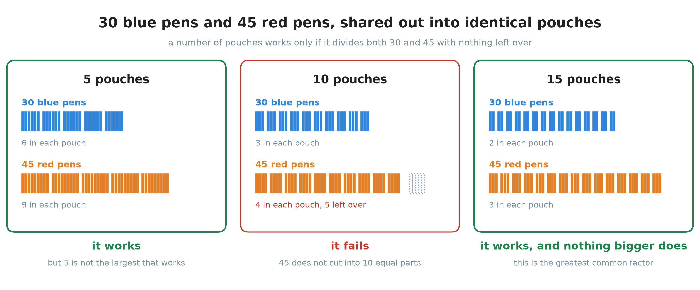
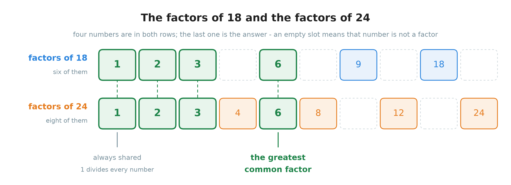
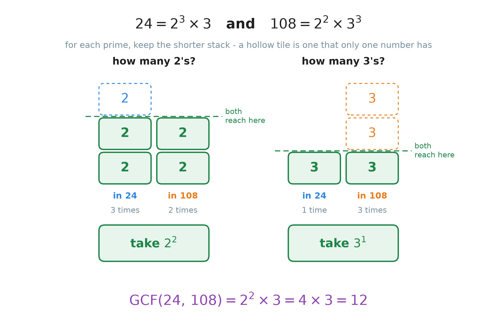
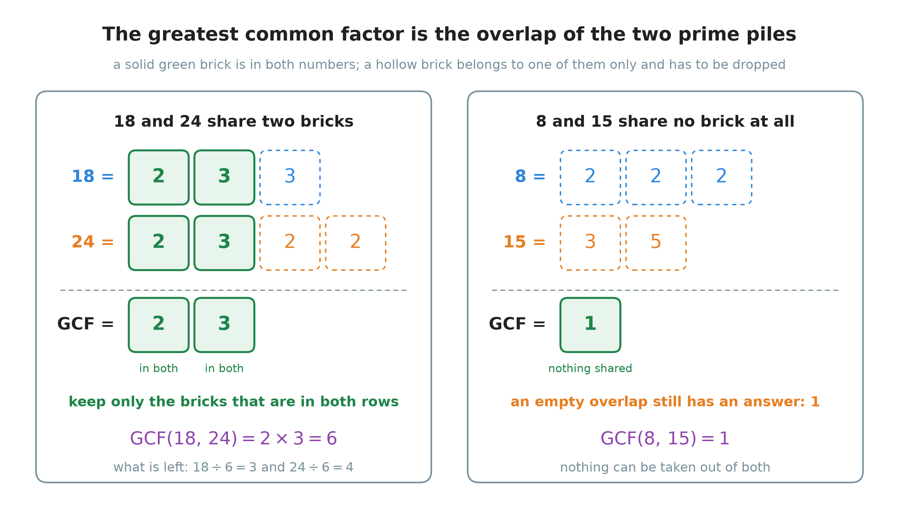
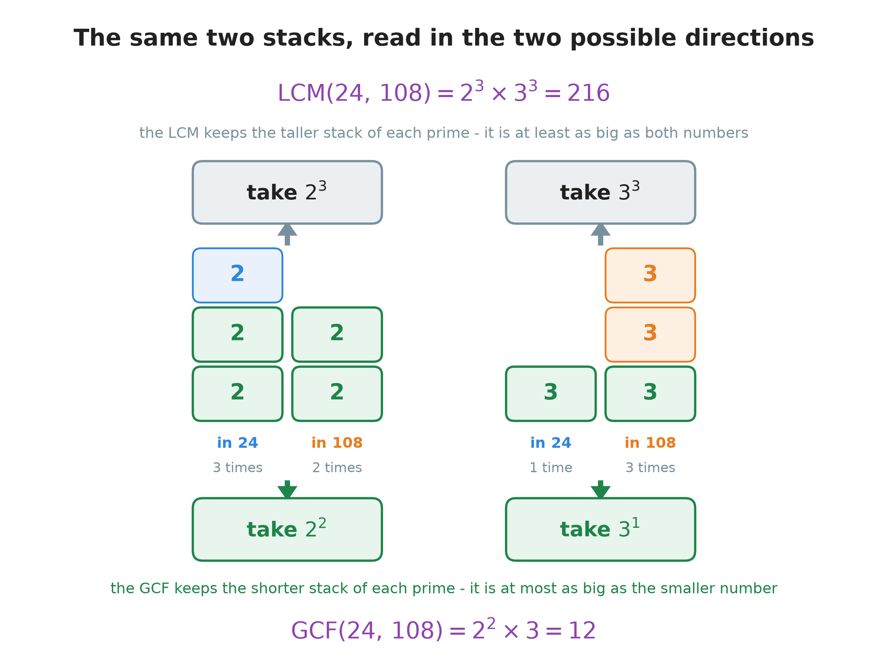
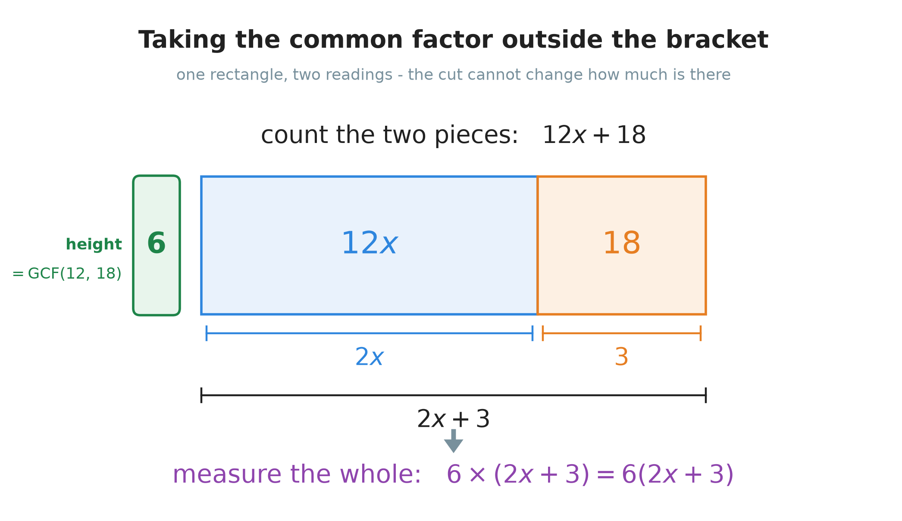

# 14. The greatest common factor

**What this chapter teaches**
How to find the biggest number that divides two or more numbers, two ways of finding it, why
the second way always works, and what it is for.

**Before you start**
Read [Chapter 12](./../12_Divisibility_And_Prime_Numbers/12_Divisibility_And_Prime_Numbers.md)
first. This chapter uses the factor lists of
[section 2](./../12_Divisibility_And_Prime_Numbers/12_Divisibility_And_Prime_Numbers.md#2-finding-every-factor-of-a-number),
the prime factorizations of
[section 4](./../12_Divisibility_And_Prime_Numbers/12_Divisibility_And_Prime_Numbers.md#4-breaking-a-number-into-primes),
and the divisibility rule of
[section 5.3](./../12_Divisibility_And_Prime_Numbers/12_Divisibility_And_Prime_Numbers.md#53-what-the-fingerprint-is-for)
on almost every page. Read
[Chapter 13](./../13_The_Least_Common_Multiple/13_The_Least_Common_Multiple.md) as well. It is
the twin of this one, and section 4 here compares the two side by side.

---

## Table of contents

1. [Numbers that share](#1-numbers-that-share)
2. [The first method: write the lists out](#2-the-first-method-write-the-lists-out)
3. [The second method: read it off the primes](#3-the-second-method-read-it-off-the-primes)
4. [The GCF and the LCM, side by side](#4-the-gcf-and-the-lcm-side-by-side)
5. [What the greatest common factor is for](#5-what-the-greatest-common-factor-is-for)
6. [Glossary](#6-glossary)
7. [Check your understanding](#7-check-your-understanding)
8. [Important notes](#8-important-notes)

---

## 1. Numbers that share

### 1.1 Two piles of pens

A teacher has $30$ blue pens and $45$ red pens. She wants to put them all into pouches for her
class. Every pouch has to be **identical**: the same number of blue pens, and the same number
of red pens. No pen may be left over.

How many pouches can she make?

She cannot choose any number she likes. Look at three tries.

    

**Figure 1 — Each panel cuts both piles into the same number of equal parts. With $5$ pouches
both piles divide. With $10$ pouches the blue pens divide but the red ones do not, and five
pens are left with nowhere to go. With $15$ pouches both divide again — and no bigger number
works.**

The answer is $15$ pouches. Nothing in the picture is hard. What matters is the **shape** of
the question, because it comes back again and again:

> Two amounts must be broken into equal parts of the same size, with nothing left over. How
> large can the number of parts be?

> **Note.** This is [Chapter 13](./../13_The_Least_Common_Multiple/13_The_Least_Common_Multiple.md)
> stood on its head. There, two things repeated and you looked for the first moment they met,
> which sent you **upwards** to a bigger number. Here two amounts have to be cut up, and you
> look for the largest cut that fits both, which sends you **downwards** to a smaller number.
> The two chapters ask opposite questions about the same pair of numbers.

### 1.2 The factors of a number

[Chapter 12, section 2](./../12_Divisibility_And_Prime_Numbers/12_Divisibility_And_Prime_Numbers.md#2-finding-every-factor-of-a-number)
taught you how to find every number that divides a given number.

A **factor** of a number divides it with a remainder of $0$. Walking up from $1$ and taking
each factor together with its partner gives the full list:

$$
\text{factors of } 30 = \{1,\, 2,\, 3,\, 5,\, 6,\, 10,\, 15,\, 30\}
$$

$$
\text{factors of } 45 = \{1,\, 3,\, 5,\, 9,\, 15,\, 45\}
$$

Three things about those lists matter for the whole chapter.

**The list of factors stops.** A multiple can be as large as you like, but no factor of $30$ is
bigger than $30$. So a factor list is short and you can write all of it, which is something you
could never do with multiples.

**$1$ is a factor of every number.** Dividing anything by $1$ leaves the number unchanged and
no remainder.

**The biggest factor of a number is the number itself.** It sits at the top of every list, as
the partner of $1$.

### 1.3 A factor that belongs to both

Now put the two lists side by side and look for numbers that appear in both.

> **Definition.** A **common factor** of two numbers is a number that is a factor of both of
> them at the same time. It divides both, with nothing left over.

The word *common* means *shared*, exactly as it does in *common multiple* from
[Chapter 13, section 1.3](./../13_The_Least_Common_Multiple/13_The_Least_Common_Multiple.md#13-a-multiple-that-belongs-to-both).

**Example.** Is $5$ a common factor of $30$ and $45$?

$$
30 \div 5 = 6 \quad \text{remainder } 0
$$

$$
45 \div 5 = 9 \quad \text{remainder } 0
$$

Both divisions come out even, so yes.

**Example.** Is $10$ a common factor of $30$ and $45$?

$$
30 \div 10 = 3 \quad \text{remainder } 0
$$

$$
45 \div 10 = 4 \quad \text{remainder } 5
$$

The second division does not come out even, so no. That is the middle panel of Figure 1: the
blue pens split into ten equal parts and the red pens do not.

> **Note.** Every pair of numbers has at least one common factor, because $1$ divides
> everything. So this question always has an answer, however badly the two numbers get on.

### 1.4 The greatest common factor

In Figure 1 the numbers $5$ and $15$ both worked. So did $1$ and $3$. Usually you want one of
them in particular: the big one.

[Chapter 3, section 4.2](./../3_Percentages/3_Percentages.md#42-doing-it-in-one-step-the-greatest-common-factor)
already gave it a name, as a short cut for simplifying fractions. Here is the same definition
with the notation that goes with it.

> **Definition.** The **greatest common factor** of two or more numbers is the **biggest**
> whole number that is a factor of all of them. It is written $\mathrm{GCF}$, and the numbers
> go in brackets after it.

So the pen question has this answer:

$$
\mathrm{GCF}(30,\, 45) = 15
$$

Read it out loud as "the greatest common factor of thirty and forty-five is fifteen".

> **Note.** Many books write $\mathrm{GCD}$ and say **greatest common divisor** instead. It is
> the same thing. *Divisor* is the word
> [Chapter 1, section 1.2](./../1_Fractions/1_Fractions.md#12-the-three-names) used for the
> number you divide **by**, and a number divides another exactly when it is a factor of it, so
> *factor* and *divisor* name the same idea here.

### Summary of section 1

* A **factor** of a number divides it with nothing left over. The list of factors stops.
* $1$ is a factor of every number. The biggest factor of a number is the number itself.
* A **common factor** of two numbers is in both factor lists.
* The **greatest common factor**, $\mathrm{GCF}$, is the biggest of those shared numbers.
* $\mathrm{GCF}(30,\, 45) = 15$, which is how many identical pouches the teacher can fill.

---

## 2. The first method: write the lists out

### 2.1 The four steps

For small numbers you do not need any theory. Write both lists and look.

1. Write **all** the factors of the first number.
2. Write **all** the factors of the second number.
3. Find the numbers that are in both lists.
4. Take the biggest one.

Step 1 and step 2 are
[Chapter 12, section 2.2](./../12_Divisibility_And_Prime_Numbers/12_Divisibility_And_Prime_Numbers.md#22-walking-up-from-1-all-the-factors-of-10)
done twice. Walk up from $1$, test each number, and write down both members of every pair you
find.

### 2.2 A first one: 10 and 15

**Find $\mathrm{GCF}(10,\, 15)$.**

**Step 1.** The factor pairs of $10$:

$$
1 \times 10 = 10
$$

$$
2 \times 5 = 10
$$

$$
\text{factors of } 10 = \{1,\, 2,\, 5,\, 10\}
$$

**Step 2.** The factor pairs of $15$:

$$
1 \times 15 = 15
$$

$$
3 \times 5 = 15
$$

$$
\text{factors of } 15 = \{1,\, 3,\, 5,\, 15\}
$$

**Step 3.** Go along the first list and check each number against the second. $1$, yes. $2$,
no. $5$, **yes**. $10$, no. So the common factors are $\{1,\, 5\}$.

**Step 4.** The biggest of them is $5$.

$$
\mathrm{GCF}(10,\, 15) = 5
$$

**Check.** A common factor must divide both numbers with nothing left over:

$$
10 \div 5 = 2 \quad \text{remainder } 0
$$

$$
15 \div 5 = 3 \quad \text{remainder } 0
$$

Do this check after every answer in this chapter. Two divisions catch nearly every mistake.

> **Warning.** Write the factors in **pairs**, as above. Most wrong factor lists are wrong in
> the same way: the writer starts at $2$ and forgets $1$, or stops before the number itself.
> Both of those are members of the first pair, so writing pairs makes them impossible to lose.

### 2.3 A second one: 18 and 24

**Find $\mathrm{GCF}(18,\, 24)$.**

**Step 1.** The factor pairs of $18$ are $1 \times 18$, $2 \times 9$ and $3 \times 6$:

$$
\text{factors of } 18 = \{1,\, 2,\, 3,\, 6,\, 9,\, 18\}
$$

**Step 2.** The factor pairs of $24$ are $1 \times 24$, $2 \times 12$, $3 \times 8$ and
$4 \times 6$:

$$
\text{factors of } 24 = \{1,\, 2,\, 3,\, 4,\, 6,\, 8,\, 12,\, 24\}
$$

**Step 3.** Four numbers are in both lists.

    

**Figure 2 — Both rows use the same columns, so a shared factor sits directly above its twin.
The green columns are $1$, $2$, $3$ and $6$. An empty dashed slot means that number is a
factor of only one of the two, so it can never be the answer.**

$$
\text{common factors} = \{1,\, 2,\, 3,\, 6\}
$$

**Step 4.** The biggest is $6$.

$$
\mathrm{GCF}(18,\, 24) = 6
$$

**Check.** $18 \div 6 = 3$ remainder $0$, and $24 \div 6 = 4$ remainder $0$.

### 2.4 Two things you know before you start

Even before writing anything, you know roughly where the answer has to be. Both facts are
useful, and both are easy to see.

**The greatest common factor is at least $1$.** Section 1.3 said why: $1$ divides everything,
so it is always in both lists.

**The greatest common factor is at most the smaller of the two numbers.** A factor of a number
is never bigger than that number, so a factor of *both* is never bigger than the smaller one.

Put together:

$$
1 \leq \mathrm{GCF}(a,\, b) \leq \text{the smaller of } a \text{ and } b
$$

* $a$ and $b$ — the two numbers you started with.
* $\leq$ — "is smaller than or equal to", from
  [Chapter 13, section 2.5](./../13_The_Least_Common_Multiple/13_The_Least_Common_Multiple.md#25-two-things-you-know-before-you-start).

For $18$ and $24$ that says the answer is somewhere from $1$ to $18$, and $6$ is. For $10$ and
$15$ it says from $1$ to $10$, and $5$ is.

> **Warning.** If your answer is bigger than the smaller of the two numbers, it is wrong, and
> it is wrong in a way worth naming: you have found a **multiple** instead of a **factor**.
> Section 4 comes back to this, because it is the commonest mistake in the whole topic.

### 2.5 Where this method runs out

Lists are fine when the lists are short. They stop being fine quickly.

**Find $\mathrm{GCF}(24,\, 108)$.**

The factors of $24$ you already have. Now walk up through $108$, pair by pair:

$$
1 \times 108 \qquad 2 \times 54 \qquad 3 \times 36 \qquad 4 \times 27 \qquad 6 \times 18
\qquad 9 \times 12
$$

$5$, $7$, $8$, $10$ and $11$ divide nothing. At $12$ the partner is $9$, which is **below**
$12$, so the two ends of the walk have crossed and you can stop —
[Chapter 12, section 2.4](./../12_Divisibility_And_Prime_Numbers/12_Divisibility_And_Prime_Numbers.md#24-where-to-stop)
explains why that is safe.

$$
\text{factors of } 108 = \{1,\, 2,\, 3,\, 4,\, 6,\, 9,\, 12,\, 18,\, 27,\, 36,\, 54,\, 108\}
$$

Twelve factors, eleven test divisions, and one slip anywhere in that line loses the answer.
Comparing the two lists gives $\{1,\, 2,\, 3,\, 4,\, 6,\, 12\}$, so
$\mathrm{GCF}(24,\, 108) = 12$.

The answer is right. The method is not worth keeping. And it gets worse: with three numbers
you would write three lists.

### Summary of section 2

* Write both factor lists, find the numbers in both, take the biggest.
* Write factors in **pairs**, so that $1$ and the number itself cannot be forgotten.
* $1 \leq \mathrm{GCF}(a,\, b) \leq$ the smaller of the two numbers.
* Always check the answer with two divisions.
* For large numbers the lists get long and the method gets unreliable.

---

## 3. The second method: read it off the primes

### 3.1 What a common factor may contain

Before the method, the reason for it. This is the heart of the chapter, and it is one step from
something you already know.

[Chapter 12, section 5.3](./../12_Divisibility_And_Prime_Numbers/12_Divisibility_And_Prime_Numbers.md#53-what-the-fingerprint-is-for)
ended with this rule:

> One number divides another exactly when **every prime in the smaller number's fingerprint
> also appears in the bigger one's, at least as many times**.

Chapter 13 read that rule forwards, from the small number up. Now read it the other way, from
the big numbers down. Suppose some number $d$ is a common factor of $24$ and $108$. Being a
common factor means $d$ divides both. So:

* $24 = 2^{3} \times 3$, and $d$ divides $24$. So $d$ may contain **at most three** $2$'s and
  **at most one** $3$. It may contain no other prime at all, because $24$ has no other prime
  for it to hide behind.
* $108 = 2^{2} \times 3^{3}$, and $d$ divides $108$. So $d$ may contain **at most two** $2$'s
  and **at most three** $3$'s.

Put the two limits on the prime $2$ next to each other. $d$ may have at most three $2$'s, and
$d$ may have at most two $2$'s. The second limit is the tighter one. Anything that obeys the
tighter limit obeys the looser one automatically, so the tighter limit is the only one that
counts.

That is the whole idea:

> **Explanation.** For each prime, a common factor may contain that prime **at most as many
> times as the number that uses it least**. The **greatest** common factor contains it exactly
> that many times, because taking fewer copies would only make the answer smaller for no
> reason.

So the rule is *take the smaller count*, and now you know why.

    

**Figure 3 — One group for each prime. In every group there are two stacks: how many times that
prime is inside $24$, and how many times it is inside $108$. A tile is green when both stacks
reach it. A hollow tile is one that only a single number has, so it cannot be used. Keep the
green height, and multiplying the two green boxes gives $12$.**

> **Note.** Notice which number wins each group. For the prime $2$ the shorter stack belongs to
> $108$; for the prime $3$ it belongs to $24$. There is no "small number" that wins everywhere.
> Each prime is decided on its own.

### 3.2 The five steps

1. Write the prime factorization of each number
   ([Chapter 12, section 4](./../12_Divisibility_And_Prime_Numbers/12_Divisibility_And_Prime_Numbers.md#4-breaking-a-number-into-primes)).
2. List every prime that appears in **all** of them.
3. For each of those primes, count how many times it appears in each number.
4. Keep the **smallest** count.
5. Multiply all the kept powers together.

> **Warning.** Step 4 says **smallest**. Taking the largest count is the commonest mistake in
> this chapter, and it does not give a slightly wrong answer — it gives the least common
> multiple, which is usually far bigger than either number and is not a factor of anything.
> Section 4.1 draws the two side by side.

> **Warning.** Step 2 says **all**. A prime that appears in only one of the numbers is thrown
> away completely, however many times it appears there. It cannot help: the other number does
> not have it even once.

### 3.3 18 and 24, from the primes

Before trusting a new method, run it on a question you already know the answer to.

**Step 1.** The two prime factorizations:

$$
18 = 2 \times 3 \times 3 = 2 \times 3^{2}
$$

$$
24 = 2 \times 2 \times 2 \times 3 = 2^{3} \times 3
$$

**Step 2.** The primes that appear in **both**: $2$ and $3$.

**Steps 3 and 4.**

| Prime | In $18$ | In $24$ | Smaller count | Keep |
| :---: | :---: | :---: | :---: | :---: |
| $2$ | $1$ | $3$ | $1$ | $2^{1}$ |
| $3$ | $2$ | $1$ | $1$ | $3^{1}$ |

**Step 5.**

$$
\mathrm{GCF}(18,\, 24) = 2 \times 3 = 6
$$

Which is exactly what the two long lists gave in section 2.3, with far less writing.

There is a picture for this that is worth carrying with you. Think of the primes as bricks.
$18$ is built from the bricks $2,\, 3,\, 3$ and $24$ is built from the bricks
$2,\, 2,\, 2,\, 3$. A common factor can only be built from bricks that **both** piles have.

    

**Figure 4 — The shared bricks are drawn first in each row, so the overlap is the green block
at the start of both. $18$ and $24$ share a $2$ and a $3$, which is $6$. $8$ and $15$ share
nothing at all, so the only thing left to take is $1$.**

> **Note.** Look at what is left after the shared bricks are taken out. $18 \div 6 = 3$ and
> $24 \div 6 = 4$, and $3$ and $4$ share no prime. That is always the sign that you took the
> **greatest** common factor and not just a common one. Section 5.2 uses this.

> **Note.** The bricks were reordered so that the shared ones come first. That is allowed:
> [Chapter 6, section 1.3](./../6_The_Distributive_Property/6_The_Distributive_Property.md#13-the-order-of-the-two-factors-does-not-matter)
> says the order of the numbers in a multiplication never changes the product.

### 3.4 The one the lists could not reach: 24 and 108

**Step 1.** Both ladders
([Chapter 12, section 4.4](./../12_Divisibility_And_Prime_Numbers/12_Divisibility_And_Prime_Numbers.md#44-the-second-method-the-ladder)).
Divide by the smallest prime that fits, again and again, until you reach $1$.

For $24$:

$$
24 \div 2 = 12
$$

$$
12 \div 2 = 6
$$

$$
6 \div 2 = 3
$$

$$
3 \div 3 = 1
$$

$$
24 = 2 \times 2 \times 2 \times 3 = 2^{3} \times 3
$$

For $108$:

$$
108 \div 2 = 54
$$

$$
54 \div 2 = 27
$$

$$
27 \div 3 = 9
$$

$$
9 \div 3 = 3
$$

$$
3 \div 3 = 1
$$

$$
108 = 2 \times 2 \times 3 \times 3 \times 3 = 2^{2} \times 3^{3}
$$

**Step 2.** The primes in both: $2$ and $3$.

**Steps 3 and 4.**

| Prime | In $24$ | In $108$ | Smaller count | Keep |
| :---: | :---: | :---: | :---: | :---: |
| $2$ | $3$ | $2$ | $2$ | $2^{2}$ |
| $3$ | $1$ | $3$ | $1$ | $3^{1}$ |

**Step 5.**

$$
2^{2} = 4
$$

$$
4 \times 3 = 12
$$

$$
\mathrm{GCF}(24,\, 108) = 2^{2} \times 3 = 12
$$

**Check.** $24 \div 12 = 2$ remainder $0$, and $108 \div 12 = 9$ remainder $0$.

Compare that with section 2.5. The same answer, without writing out twelve factors.

> **Note.** Here both numbers happen to be built from the same two primes. When one of the
> numbers has a prime the other does not, its count in the other number is $0$, and the smaller
> count is $0$ — so that prime is dropped. Section 3.6 shows one.

### 3.5 The formula

Here is the same method in symbols. Do not start here — start with the tables above, then read
this as a shorter way of writing them down.

Suppose two numbers are built from the same list of primes $p_{1}, p_{2}, \dots$, where an
exponent may be $0$ if that prime is missing:

$$
a = p_{1}^{e_{1}} \times p_{2}^{e_{2}} \times \dots
$$

$$
b = p_{1}^{f_{1}} \times p_{2}^{f_{2}} \times \dots
$$

Then:

$$
\mathrm{GCF}(a,\, b) = p_{1}^{\min(e_{1},\, f_{1})} \times p_{2}^{\min(e_{2},\, f_{2})} \times \dots
$$

In words: for each prime, keep the **smaller** of the two exponents, then multiply everything
together.

* $p_{1}, p_{2}, \dots$ — the primes that appear in either number.
* $e_{1}, e_{2}, \dots$ — how many times each prime appears in $a$.
* $f_{1}, f_{2}, \dots$ — how many times each prime appears in $b$.
* $\min(e,\, f)$ — the smaller of the two numbers $e$ and $f$. $\min$ is short for *minimum*.
  If they are equal, $\min$ is that same value.

**Try it on the numbers you just did.** With $a = 24 = 2^{3} \times 3^{1}$ and
$b = 108 = 2^{2} \times 3^{3}$:

$$
\min(3,\, 2) = 2
$$

$$
\min(1,\, 3) = 1
$$

$$
\mathrm{GCF}(24,\, 108) = 2^{2} \times 3^{1} = 12
$$

Which is the table, exactly.

> **Note.** The formula already handles a prime that only one number has, and you do not need a
> special rule for it. If $b$ has no $5$ at all then $f = 0$, so $\min(e,\, 0) = 0$, and the
> kept power is $5^{0}$. And
> [Chapter 10, section 6](./../10_Exponents/10_Exponents.md#6-rule-3-the-exponent-zero) showed
> that $5^{0} = 1$. Multiplying by $1$ changes nothing — which is another way of saying that
> the prime was dropped.

### 3.6 Three numbers at once: 48, 72 and 120

Nothing about the method depends on there being only two numbers. With three numbers you
compare three counts instead of two and keep the smallest.

**Find $\mathrm{GCF}(48,\, 72,\, 120)$.**

**Step 1.** All three prime factorizations:

$$
48 = 16 \times 3 = 2^{4} \times 3
$$

$$
72 = 8 \times 9 = 2^{3} \times 3^{2}
$$

$$
120 = 8 \times 15 = 2^{3} \times 3 \times 5
$$

**Step 2.** The prime $5$ is in $120$ only, so it is not in all three. The primes in all three
are $2$ and $3$.

**Steps 3 and 4.**

| Prime | In $48$ | In $72$ | In $120$ | Smallest count | Keep |
| :---: | :---: | :---: | :---: | :---: | :---: |
| $2$ | $4$ | $3$ | $3$ | $3$ | $2^{3}$ |
| $3$ | $1$ | $2$ | $1$ | $1$ | $3^{1}$ |
| $5$ | $0$ | $0$ | $1$ | $0$ | nothing |

**Step 5.**

$$
2^{3} = 8
$$

$$
8 \times 3 = 24
$$

$$
\mathrm{GCF}(48,\, 72,\, 120) = 2^{3} \times 3 = 24
$$

**Check.** $48 \div 24 = 2$, $72 \div 24 = 3$ and $120 \div 24 = 5$, all with remainder $0$.

> **Note.** The prime $5$ appears in the table with a count of $0$ twice, and $0$ is the
> smallest, so nothing is taken. One missing number is enough. It would not matter if $120$
> held a hundred copies of $5$ — if $48$ has none, no common factor can have one.

### Summary of section 3

* A common factor may hold each prime **at most** as many times as the number that holds it
  least. The greatest one holds exactly that many.
* Break every number into primes, then for each prime keep the **smallest** count.
* A prime that is missing from even one of the numbers is dropped.
* In symbols: $\mathrm{GCF}(a,\, b) = p_{1}^{\min(e_{1},\, f_{1})} \times p_{2}^{\min(e_{2},\, f_{2})} \times \dots$
* $\mathrm{GCF}(24,\, 108) = 12$ and $\mathrm{GCF}(48,\, 72,\, 120) = 24$.

---

## 4. The GCF and the LCM, side by side

### 4.1 The same stacks, two directions

Chapter 13 and this chapter build the same picture out of the same two numbers. They differ in
one word.

* A common **multiple** has to be divisible by both numbers, so it must **meet** two demands.
  For each prime it takes the **larger** count.
* A common **factor** has to divide both numbers, so it must **respect** two limits. For each
  prime it takes the **smaller** count.

    

**Figure 5 — One picture, two readings. Nothing about $24$ and $108$ has changed between the
top half and the bottom half. Go up and you take the taller stack of each prime and reach
$216$. Go down and you take the shorter stack and reach $12$.**

Here are the two methods in one table.

| | Greatest common factor | Least common multiple |
| --- | --- | --- |
| What it is | the biggest number that **divides** both | the smallest number both **divide into** |
| Written | $\mathrm{GCF}(a,\, b)$ | $\mathrm{LCM}(a,\, b)$ |
| For each prime, take | the **smallest** count | the **largest** count |
| Its size | never bigger than the smaller number | never smaller than the bigger number |
| For $24$ and $108$ | $2^{2} \times 3 = 12$ | $2^{3} \times 3^{3} = 216$ |

The size row is the fastest check there is. Lay the four numbers out in order:

$$
1 \leq 12 \leq 24 \leq 108 \leq 216 \leq 2592
$$

The greatest common factor sits at the bottom end, below both numbers. The least common
multiple sits at the top end, above both. If an answer lands on the wrong side, you have solved
the wrong problem.

> **Warning.** Answering $\mathrm{GCF}(10,\, 15) = 30$ is a real and common mistake. $30$ is
> the least common multiple. A quick look at the sizes settles it: a factor of $10$ cannot
> possibly be $30$.

### 4.2 Coprime, said the other way

[Chapter 13, section 4.1](./../13_The_Least_Common_Multiple/13_The_Least_Common_Multiple.md#41-numbers-that-share-nothing)
called two numbers **coprime** when they share no prime factor. The greatest common factor
gives that idea a second, shorter description.

> **Explanation.** Two numbers are coprime exactly when $\mathrm{GCF}(a,\, b) = 1$.
>
> If they share no prime, then for every prime one of the two counts is $0$, so every
> $\min$ is $0$, and every kept power is $p^{0} = 1$. Multiplying $1$'s together gives $1$.
>
> The other direction is just as short. If the two numbers did share a prime $p$, then $p$
> itself would be a common factor, and $p$ is at least $2$. So the greatest common factor could
> not be $1$.

**Example.** $8 = 2^{3}$ and $15 = 3 \times 5$. They have no prime in common, so:

$$
\mathrm{GCF}(8,\, 15) = 1
$$

That is the right-hand panel of Figure 4. The two numbers have nothing to give, and $1$ is
what is left.

> **Note.** As Chapter 13 warned, coprime does **not** mean both numbers are prime. Neither $8$
> nor $15$ is prime. What matters is that their prime bricks do not overlap.

### 4.3 The bridge, and now the reason

[Chapter 13, section 4.2](./../13_The_Least_Common_Multiple/13_The_Least_Common_Multiple.md#42-the-bridge-between-the-lcm-and-the-gcf)
gave you this rule, checked it twice, and could not say why it was true:

$$
\mathrm{LCM}(a,\, b) \times \mathrm{GCF}(a,\, b) = a \times b
$$

Now the reason fits in two lines. Pick any prime, and let $e$ be how many times it appears in
$a$ and $f$ how many times in $b$.

* The greatest common factor takes $\min(e,\, f)$ copies of it.
* The least common multiple takes $\max(e,\, f)$ copies of it.
* Multiply those two answers together and the copies add up:
  $\min(e,\, f) + \max(e,\, f)$.

But the smaller of two numbers and the larger of two numbers **are** the two numbers, just
sorted. So:

$$
\min(e,\, f) + \max(e,\, f) = e + f
$$

And $e + f$ is exactly how many copies of that prime sit inside $a \times b$. That holds for
every prime at once, so the two sides of the rule are the same number.

**With real numbers.** For the prime $2$ in $24$ and $108$, $e = 3$ and $f = 2$:

$$
\min(3,\, 2) = 2 \qquad \max(3,\, 2) = 3
$$

$$
2 + 3 = 5 \qquad \text{and} \qquad 3 + 2 = 5
$$

**Check the whole rule on $24$ and $108$:**

$$
12 \times 216 = 2592
$$

$$
24 \times 108 = 2592
$$

> **Note.** This rule is more useful now than it was in Chapter 13. Back then you could not
> find a greatest common factor from the primes, so the rule was only a way of checking an
> answer. Now you can, so it also gives a second route to the least common multiple:
>
> $$
> \mathrm{LCM}(24,\, 108) = \frac{24 \times 108}{\mathrm{GCF}(24,\, 108)} = \frac{2592}{12} = 216
> $$

### Summary of section 4

* The GCF takes the **smallest** count of each prime; the LCM takes the **largest**.
* The GCF is never bigger than the smaller number; the LCM is never smaller than the bigger
  one. Use that to catch an answer on the wrong side.
* $\mathrm{GCF}(a,\, b) = 1$ says exactly the same thing as "$a$ and $b$ are coprime".
* $\mathrm{LCM}(a,\, b) \times \mathrm{GCF}(a,\, b) = a \times b$, because
  $\min(e,\, f) + \max(e,\, f) = e + f$.

---

## 5. What the greatest common factor is for

### 5.1 Sharing into equal groups

Go back to the pens from section 1.1. The teacher has $30$ blue pens and $45$ red pens, and
wants as many identical pouches as she can make.

A number of pouches works only if it divides $30$ and also divides $45$. She wants the largest
such number, which is the greatest common factor.

**Step 1.** The two prime factorizations:

$$
30 = 2 \times 3 \times 5
$$

$$
45 = 3 \times 3 \times 5 = 3^{2} \times 5
$$

**Steps 2 to 4.**

| Prime | In $30$ | In $45$ | Smaller count | Keep |
| :---: | :---: | :---: | :---: | :---: |
| $2$ | $1$ | $0$ | $0$ | nothing |
| $3$ | $1$ | $2$ | $1$ | $3^{1}$ |
| $5$ | $1$ | $1$ | $1$ | $5^{1}$ |

**Step 5.**

$$
\mathrm{GCF}(30,\, 45) = 3 \times 5 = 15
$$

**So she can make $15$ pouches.** Now finish the question: what goes inside one?

$$
30 \div 15 = 2 \quad \text{blue pens}
$$

$$
45 \div 15 = 3 \quad \text{red pens}
$$

Each pouch holds $2$ blue pens and $3$ red pens. That is the right-hand panel of Figure 1.

> **Note.** $2$ and $3$ share no factor except $1$, so they are coprime. That is the signal
> from section 3.3 again: if the two numbers left over still shared something, she could have
> made more pouches.

### 5.2 Simplifying a fraction in one step

[Chapter 1, section 3.3](./../1_Fractions/1_Fractions.md#33-simplifying-a-fraction) simplified
fractions by dividing top and bottom by a shared number, then looking again, then again.
[Chapter 3, section 4.2](./../3_Percentages/3_Percentages.md#42-doing-it-in-one-step-the-greatest-common-factor)
said that dividing by the greatest common factor finishes the job in one move — but at that
point in the book you had no way of finding one. Now you have.

**Simplify $\frac{18}{24}$.**

Section 3.3 found $\mathrm{GCF}(18,\, 24) = 6$. Divide both lines by it, which is
[Chapter 1's rule](./../1_Fractions/1_Fractions.md#32-the-rule-do-the-same-thing-to-the-top-and-to-the-bottom):

$$
\frac{18}{24} = \frac{18 \div 6}{24 \div 6} = \frac{3}{4}
$$

> **Explanation.** Why is one step always enough? Because of what is left. Dividing by the
> greatest common factor removes **every** brick the two numbers share, so the numbers left
> behind — here $3$ and $4$ — have no prime in common. They are coprime, and by section 4.2
> that means nothing except $1$ divides both. There is nothing left to cancel, so the fraction
> is finished.

That also answers the Warning in Chapter 3: a fraction is finished exactly when its top and
bottom are coprime.

**Simplify $\frac{30}{45}$.** Section 5.1 found $\mathrm{GCF}(30,\, 45) = 15$:

$$
\frac{30}{45} = \frac{30 \div 15}{45 \div 15} = \frac{2}{3}
$$

And $2$ and $3$ are coprime, so that is the end of it.

### 5.3 Taking a common factor outside a bracket

[Chapter 6, section 2](./../6_The_Distributive_Property/6_The_Distributive_Property.md#2-the-distributive-property)
multiplied a bracket out:

$$
6 \times (2x + 3) = 12x + 18
$$

Running that backwards is a job for the greatest common factor. You are given $12x + 18$ and
you want to know what could stand outside a bracket.

> **Note.** A letter stands for any number, as
> [Chapter 10, section 2.5](./../10_Exponents/10_Exponents.md#25-why-the-rules-are-written-with-letters)
> explained. $12x$ means $12 \times x$, whatever $x$ turns out to be.

**Step 1.** Find the greatest common factor of the two numbers in front:

$$
12 = 2^{2} \times 3 \qquad 18 = 2 \times 3^{2}
$$

Taking the smaller count of each prime gives $2 \times 3 = 6$, so
$\mathrm{GCF}(12,\, 18) = 6$.

**Step 2.** Divide each term by it:

$$
12 \div 6 = 2 \qquad \text{so } 12x \text{ becomes } 2x
$$

$$
18 \div 6 = 3
$$

**Step 3.** Write the factor outside and the two answers inside:

$$
12x + 18 = 6(2x + 3)
$$

**Check** by multiplying back out, which is
[Chapter 6, section 2.4](./../6_The_Distributive_Property/6_The_Distributive_Property.md#24-the-rule-in-symbols):
$6 \times 2x = 12x$ and $6 \times 3 = 18$. Correct.

Here is why it works, and it is a picture you have seen before.

    

**Figure 6 — One rectangle, read twice.
[Chapter 6, section 3](./../6_The_Distributive_Property/6_The_Distributive_Property.md#3-seeing-the-rule-as-a-rectangle)
drew this to explain multiplying out. Count the two pieces and you get $12x + 18$; measure the
whole thing and you get $6 \times (2x + 3)$. The cut cannot change how much is there, so the
two readings must agree. The height of the rectangle is the greatest common factor: it is the
tallest rectangle that both pieces will stand on.**

> **Warning.** It must be the **greatest** common factor, or the job is not finished. Writing
> $12x + 18 = 2(6x + 9)$ is true, but $6$ and $9$ still share a $3$, so there is more to take
> out. Just as with fractions, you are done when what is left inside the bracket is coprime.

### Summary of section 5

* The GCF answers "how many equal groups, at most?" — and dividing by it says what goes in one.
* Dividing top and bottom by the GCF simplifies a fraction in a single step.
* A fraction is finished exactly when its top and bottom are coprime.
* The GCF is also the number you take outside a bracket, and the rectangle from Chapter 6 shows
  why.

---

## 6. Glossary

Only the words that appear for the first time in this chapter. Everything else is linked back
to the chapter that defined it.

* **Common factor** — a number that is a factor of two or more numbers at the same time. $3$
  is a common factor of $18$ and $24$.
* **$\mathrm{GCF}(a,\, b)$** — the way the greatest common factor is written down. The numbers
  it is about go inside the brackets. $\mathrm{GCF}(18,\, 24) = 6$.
* **Greatest common divisor**, written $\mathrm{GCD}$ — another name for the greatest common
  factor. The two names mean the same thing.
* **$\min$** — short for *minimum*: the smaller of the numbers written inside the brackets.
  $\min(3,\, 2) = 2$.

> **Note.** **Greatest common factor** itself was defined in
> [Chapter 3, section 4.2](./../3_Percentages/3_Percentages.md#42-doing-it-in-one-step-the-greatest-common-factor).
> **Factor**, **divisible**, **prime number**, **prime factorization**, the **ladder method**
> and the **factor pair** are from
> [Chapter 12](./../12_Divisibility_And_Prime_Numbers/12_Divisibility_And_Prime_Numbers.md),
> **coprime**, **least common multiple** and **$\max$** are from
> [Chapter 13](./../13_The_Least_Common_Multiple/13_The_Least_Common_Multiple.md),
> **exponent** and **power** are from
> [Chapter 10, section 2.1](./../10_Exponents/10_Exponents.md#21-the-two-parts-and-their-names),
> **term** and the **distributive property** are from
> [Chapter 6, section 2](./../6_The_Distributive_Property/6_The_Distributive_Property.md#2-the-distributive-property),
> and **numerator** and **denominator** are from
> [Chapter 1](./../1_Fractions/1_Fractions.md).

---

## 7. Check your understanding

**Question 1.** Find $\mathrm{GCF}(12,\, 20)$ by writing out the two factor lists.

Answer

The factor pairs of $12$ are $1 \times 12$, $2 \times 6$ and $3 \times 4$:

$$
\text{factors of } 12 = \{1,\, 2,\, 3,\, 4,\, 6,\, 12\}
$$

The factor pairs of $20$ are $1 \times 20$, $2 \times 10$ and $4 \times 5$:

$$
\text{factors of } 20 = \{1,\, 2,\, 4,\, 5,\, 10,\, 20\}
$$

The numbers in both lists are $\{1,\, 2,\, 4\}$. The biggest is $4$.

$$
\mathrm{GCF}(12,\, 20) = 4
$$

**Check:** $12 \div 4 = 3$ remainder $0$, and $20 \div 4 = 5$ remainder $0$.

**Question 2.** Find $\mathrm{GCF}(36,\, 60)$ using prime factorizations.

Answer

**Step 1.** Break both numbers into primes:

$$
36 = 6 \times 6 = (2 \times 3) \times (2 \times 3) = 2^{2} \times 3^{2}
$$

$$
60 = 6 \times 10 = (2 \times 3) \times (2 \times 5) = 2^{2} \times 3 \times 5
$$

**Steps 2 to 4.**

| Prime | In $36$ | In $60$ | Smaller count | Keep |
| :---: | :---: | :---: | :---: | :---: |
| $2$ | $2$ | $2$ | $2$ | $2^{2}$ |
| $3$ | $2$ | $1$ | $1$ | $3^{1}$ |
| $5$ | $0$ | $1$ | $0$ | nothing |

The prime $5$ is not in $36$ at all, so it is dropped.

**Step 5.**

$$
2^{2} = 4
$$

$$
4 \times 3 = 12
$$

$$
\mathrm{GCF}(36,\, 60) = 2^{2} \times 3 = 12
$$

**Check:** $36 \div 12 = 3$ remainder $0$, and $60 \div 12 = 5$ remainder $0$.

**Question 3.** Find $\mathrm{GCF}(45,\, 75)$.

Answer

$$
45 = 5 \times 9 = 3^{2} \times 5
$$

$$
75 = 3 \times 25 = 3 \times 5^{2}
$$

| Prime | In $45$ | In $75$ | Smaller count | Keep |
| :---: | :---: | :---: | :---: | :---: |
| $3$ | $2$ | $1$ | $1$ | $3^{1}$ |
| $5$ | $1$ | $2$ | $1$ | $5^{1}$ |

$$
\mathrm{GCF}(45,\, 75) = 3 \times 5 = 15
$$

**Check:** $45 \div 15 = 3$ remainder $0$, and $75 \div 15 = 5$ remainder $0$.

Notice that each number won one of the two primes, as in Figure 3.

**Question 4.** A student is asked for $\mathrm{GCF}(10,\, 15)$ and answers $30$. What has gone
wrong, and what is the right answer?

Answer

$30$ is the **least common multiple** of $10$ and $15$, not the greatest common factor. The
student has solved Chapter 13's question instead of this one.

You can see it is wrong without doing any work at all. Section 2.4 says the greatest common
factor is never bigger than the smaller of the two numbers, so the answer cannot be more than
$10$. And $30$ is not a factor of $10$: $10 \div 30$ is not even a whole number.

The right answer is $\mathrm{GCF}(10,\, 15) = 5$, which section 2.2 worked out.

**Question 5.** A student writes $24 = 2^{3} \times 3$ and $108 = 2^{2} \times 3^{3}$, then
answers $\mathrm{GCF}(24,\, 108) = 2^{3} \times 3^{3} = 216$. What has gone wrong?

Answer

The prime factorizations are both right. The student then took the **largest** count of each
prime instead of the smallest, which is the rule for the least common multiple.

So $216$ is a real answer to a real question — it is $\mathrm{LCM}(24,\, 108)$ — but it is the
wrong question. It is also far too big to be a factor of $24$.

Taking the smallest count of each prime gives:

$$
\mathrm{GCF}(24,\, 108) = 2^{2} \times 3 = 12
$$

Figure 5 draws both answers from the same pair of stacks.

**Question 6.** Find $\mathrm{GCF}(8,\, 15)$, and say what the answer tells you about the two
numbers.

Answer

$$
8 = 2^{3} \qquad 15 = 3 \times 5
$$

No prime appears in both, so there is nothing to keep.

$$
\mathrm{GCF}(8,\, 15) = 1
$$

By section 4.2, a greatest common factor of $1$ means the two numbers are **coprime**. Neither
of them is a prime number, which does not matter — what matters is that their prime bricks do
not overlap.

**Question 7.** Question 1 found that $\mathrm{GCF}(12,\, 20) = 4$. Use that to find
$\mathrm{LCM}(12,\, 20)$ without writing out a single multiple.

Answer

Use the bridge from section 4.3:

$$
\mathrm{LCM}(a,\, b) \times \mathrm{GCF}(a,\, b) = a \times b
$$

Put in what you know. The product of the two numbers is:

$$
12 \times 20 = 240
$$

So the least common multiple times $4$ must be $240$, which means:

$$
\mathrm{LCM}(12,\, 20) = \frac{240}{4} = 60
$$

**Check:** $60 \div 12 = 5$ remainder $0$, and $60 \div 20 = 3$ remainder $0$.

In Chapter 13 this rule could only confirm an answer you already had. Now that you can find a
greatest common factor from the primes, it finds the least common multiple for you.

**Question 8.** Simplify $\frac{45}{75}$ in one step, and show that it is finished.

Answer

Question 3 found $\mathrm{GCF}(45,\, 75) = 15$. Divide top and bottom by it:

$$
\frac{45}{75} = \frac{45 \div 15}{75 \div 15} = \frac{3}{5}
$$

It is finished because $3$ and $5$ are coprime — they share no prime factor, so nothing except
$1$ divides both, and there is nothing left to cancel.

**Question 9.** Take the greatest common factor outside the bracket in $20x + 30$.

Answer

$$
20 = 2^{2} \times 5 \qquad 30 = 2 \times 3 \times 5
$$

Taking the smaller count of each prime: one $2$, no $3$, one $5$.

$$
\mathrm{GCF}(20,\, 30) = 2 \times 5 = 10
$$

Divide each term by $10$:

$$
20 \div 10 = 2 \qquad 30 \div 10 = 3
$$

$$
20x + 30 = 10(2x + 3)
$$

**Check** by multiplying out: $10 \times 2x = 20x$ and $10 \times 3 = 30$.

The numbers left inside, $2$ and $3$, are coprime, so nothing more can be taken out.

**Question 10.** Two numbers are given by their fingerprints:

$$
N = 2^{4} \times 3^{2} \times 7 \qquad M = 2^{2} \times 3^{3} \times 5
$$

Find $\mathrm{GCF}(N,\, M)$ **without** working out what $N$ and $M$ are.

Answer

You do not need the numbers themselves. The method only ever looks at the counts.

| Prime | In $N$ | In $M$ | Smaller count | Keep |
| :---: | :---: | :---: | :---: | :---: |
| $2$ | $4$ | $2$ | $2$ | $2^{2}$ |
| $3$ | $2$ | $3$ | $2$ | $3^{2}$ |
| $5$ | $0$ | $1$ | $0$ | nothing |
| $7$ | $1$ | $0$ | $0$ | nothing |

$$
2^{2} = 4 \qquad 3^{2} = 9
$$

$$
4 \times 9 = 36
$$

$$
\mathrm{GCF}(N,\, M) = 2^{2} \times 3^{2} = 36
$$

If you are curious: $N = 1008$ and $M = 540$, and indeed $1008 \div 36 = 28$ and
$540 \div 36 = 15$.

---

## 8. Important notes

**The mistakes people actually make.**

* **Answering with the least common multiple.** These two questions live next to each other and
  are easy to swap. The sizes tell them apart instantly: the greatest common factor is never
  bigger than the smaller number, the least common multiple is never smaller than the bigger
  one.
* **Taking the largest power instead of the smallest.** The same mistake in prime form. It
  produces the LCM, which is not a factor of either number.
* **Missing factors when writing a list.** Almost always $1$ or the number itself. Writing
  factors in pairs makes that impossible.
* **Keeping a prime that only one number has.** A prime has to be in **every** number to be
  used. It does not matter how many copies the other numbers have.
* **Stopping at a common factor that is not the greatest.** $2$ is a common factor of $18$ and
  $24$, and it is not the answer. You are finished when the numbers left over share nothing.
* **Forgetting to check.** One division per number, and each remainder must be $0$. It costs a
  few seconds and catches nearly everything.

**The three ideas to keep.**

* **A common factor can only be built from bricks that both numbers have.** That one sentence
  produces the whole method. Each prime is decided on its own, by whichever number holds the
  fewest of it, and the greatest common factor takes exactly that many.
* **The GCF and the LCM are one picture read in two directions.** Same two numbers, same
  stacks of primes, and one word different: smaller or larger. Knowing that, you never have to
  remember two separate methods — only which way you are going.
* **What is left over shares nothing.** After dividing by the greatest common factor, the two
  numbers you are left with are coprime. That is why a fraction is finished, why a bracket is
  fully factored, and why the teacher cannot make more pouches. It is the same sentence three
  times.

**How this chapter connects to the rest of the book.**
[Chapter 12](./../12_Divisibility_And_Prime_Numbers/12_Divisibility_And_Prime_Numbers.md) built
the fingerprint and showed how to read divisibility off it. Chapter 13 read that rule forwards
and got the least common multiple. Section 3.1 reads the very same rule backwards and gets the
greatest common factor. Three chapters, one sentence from Chapter 12, section 5.3.

[Chapter 13](./../13_The_Least_Common_Multiple/13_The_Least_Common_Multiple.md) left two loose
ends, and both are tied off here. It stated
$\mathrm{LCM}(a,\, b) \times \mathrm{GCF}(a,\, b) = a \times b$ without a reason; section 4.3
gives the reason, and it is one line once $\min$ and $\max$ sit side by side. It also defined
**coprime** by what the numbers do not share; section 4.2 shows that this is the same as saying
their greatest common factor is $1$.

[Chapter 3, section 4.2](./../3_Percentages/3_Percentages.md#42-doing-it-in-one-step-the-greatest-common-factor)
introduced the greatest common factor as a short cut for simplifying fractions and could not
say how to find one. Section 5.2 closes that gap, and adds the thing Chapter 1 could only warn
about: a fraction is finished exactly when its top and bottom are coprime.

And [Chapter 6](./../6_The_Distributive_Property/6_The_Distributive_Property.md) is where
section 5.3 comes from. The rectangle that explained multiplying a bracket out explains taking
a factor back in, because it is the same rectangle. Only the direction of reading changed —
which, by now, should sound familiar.

---

- [Back to the book](./../README.md)
- Previous: [13 The least common multiple](./../13_The_Least_Common_Multiple/13_The_Least_Common_Multiple.md)
- Next: not written yet.
