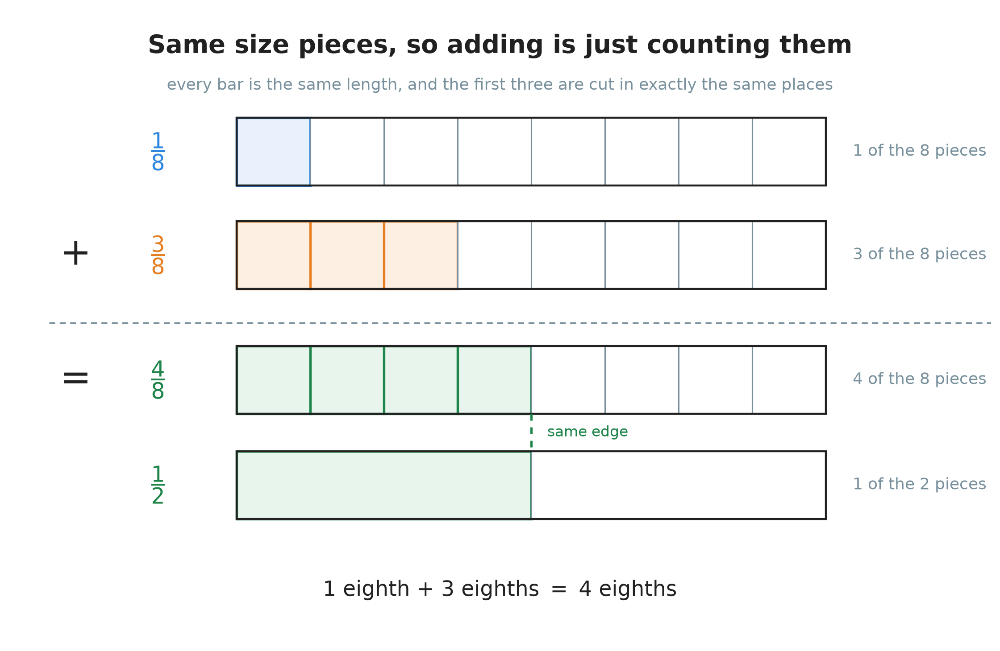
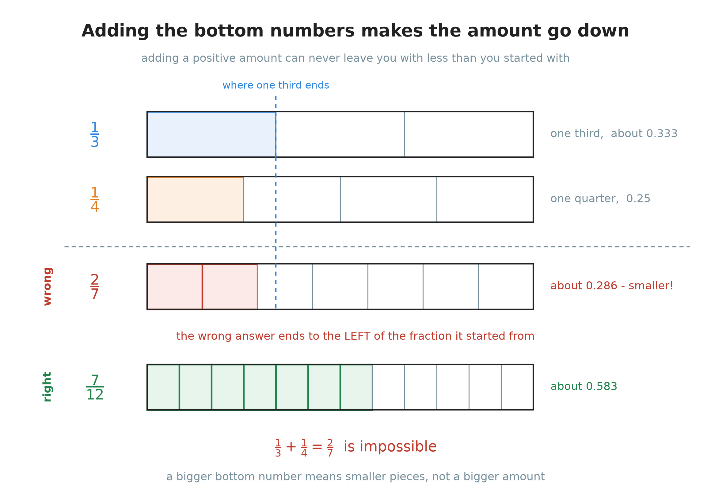
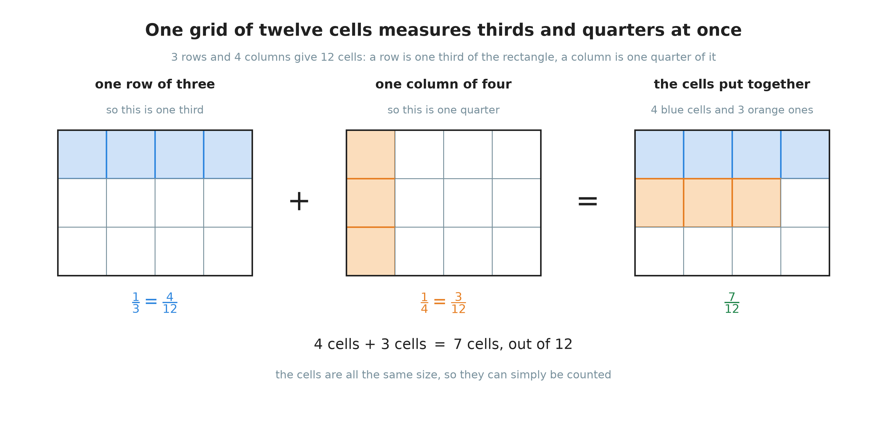
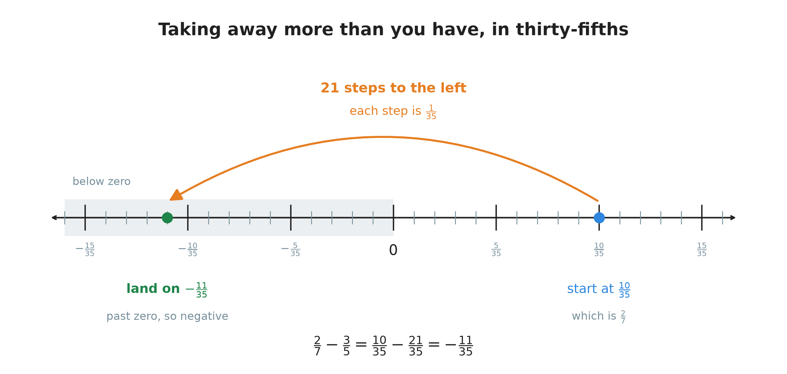
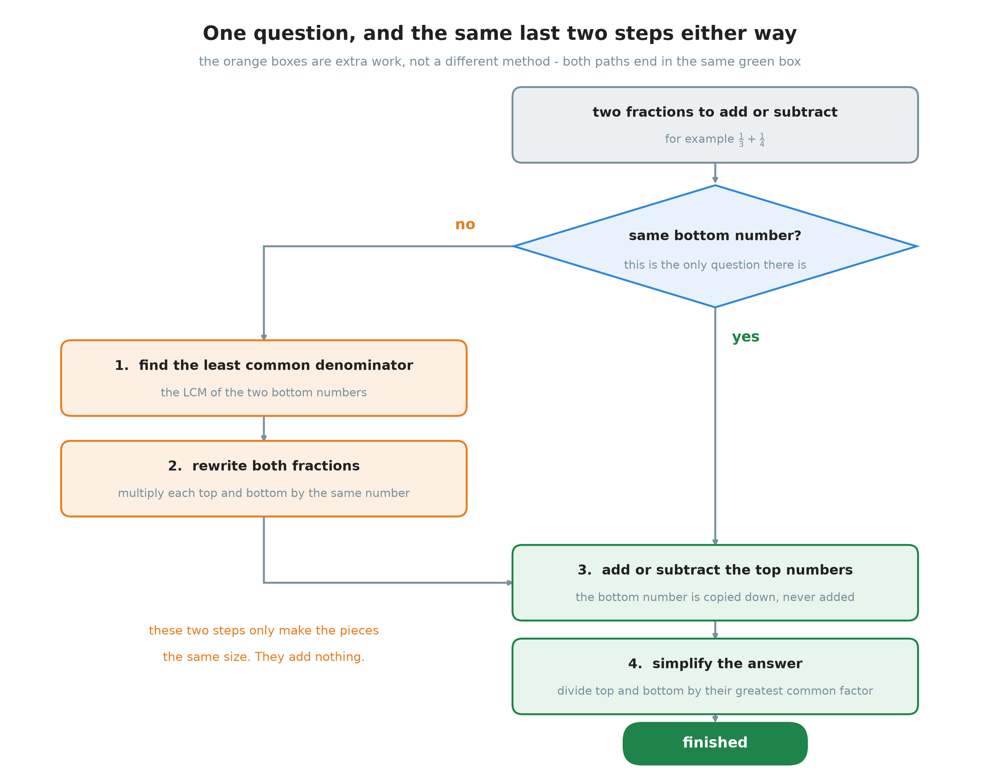

# 15. Adding and subtracting fractions

**What this chapter teaches**
How to add and subtract fractions. What to do when the bottom numbers already match, what
to do when they do not, why the bottom number is never added, and how to finish the answer
properly — including when it drops below zero.

**Before you start**
Read [Chapter 1](./../1_Fractions/1_Fractions.md) first. This chapter uses
[section 2.1](./../1_Fractions/1_Fractions.md#21-one-pizza-eight-slices),
[section 3.2](./../1_Fractions/1_Fractions.md#32-the-rule-do-the-same-thing-to-the-top-and-to-the-bottom)
and [section 3.3](./../1_Fractions/1_Fractions.md#33-simplifying-a-fraction) on almost every
page. You also need
[Chapter 13, section 5](./../13_The_Least_Common_Multiple/13_The_Least_Common_Multiple.md#5-what-the-lcm-is-for-fractions-with-different-bottom-numbers),
which already showed how to give two fractions the same bottom number, and
[Chapter 14, section 5.2](./../14_The_Greatest_Common_Factor/14_The_Greatest_Common_Factor.md#52-simplifying-a-fraction-in-one-step),
which simplifies a fraction in one step. Section 5 uses
[Chapter 9](./../9_Negative_Numbers/9_Negative_Numbers.md).

---

## Table of contents

1. [Why fractions need one extra rule](#1-why-fractions-need-one-extra-rule)
2. [When the bottom numbers already match](#2-when-the-bottom-numbers-already-match)
3. [When the bottom numbers are different](#3-when-the-bottom-numbers-are-different)
4. [Finishing the answer](#4-finishing-the-answer)
5. [When the answer goes below zero](#5-when-the-answer-goes-below-zero)
6. [The whole method in one place](#6-the-whole-method-in-one-place)
7. [Glossary](#7-glossary)
8. [Check your understanding](#8-check-your-understanding)
9. [Important notes](#9-important-notes)

---

## 1. Why fractions need one extra rule

### 1.1 Whole numbers never ask this question

Here is an addition you have known for years:

$$
2 + 3 = 5
$$

Nobody ever asks *two what*. And nobody needs to, because with whole numbers the answer is
always the same. $2$ means two **ones**. $3$ means three **ones**. Ones and ones are the same
size, so putting them together is simply counting.

That is the hidden reason whole-number addition is easy. Every whole number is already
measured in the same unit.

### 1.2 A fraction carries the size of its piece

A fraction is different, because it carries **two** pieces of information.
[Chapter 1, section 2.1](./../1_Fractions/1_Fractions.md#21-one-pizza-eight-slices) named them:

* the **numerator**, on top, says how many pieces you have;
* the **denominator**, on the bottom, says how many equal pieces the whole was cut into.

So $\frac{3}{8}$ is not "three". It is three **eighths**. The $8$ is not something you are
counting. It is the *name of the piece* you are counting.

> **Note.** The bigger the bottom number, the smaller each piece. Cutting a pizza into $8$
> slices gives smaller slices than cutting it into $3$. That is why
> [Chapter 1, section 4.2](./../1_Fractions/1_Fractions.md#42-when-the-numerators-are-the-same)
> found that $\frac{1}{3}$ is bigger than $\frac{1}{8}$.

This gives fractions the one extra rule that whole numbers never needed:

> **Two fractions can only be added or subtracted when their pieces are the same size.**

Everything in this chapter follows from that single sentence.

### 1.3 Two words for the two cases

Because there are two cases, the two cases have names.

> **Definition.** **Like fractions** are fractions that have the **same** bottom number.
> $\frac{1}{8}$ and $\frac{3}{8}$ are like fractions.

> **Definition.** **Unlike fractions** are fractions that have **different** bottom numbers.
> $\frac{1}{3}$ and $\frac{1}{4}$ are unlike fractions.

Like fractions are ready to be added straight away. Unlike fractions need two steps of
preparation first, and then they are added in exactly the same way. That is the whole
chapter in two sentences.

### Summary of section 1

* Whole numbers are all measured in ones, so they can always be counted together.
* A fraction's bottom number is the **name of the piece**, not a quantity.
* Two fractions can only be combined when their pieces are the same size.
* **Like fractions** have the same bottom number; **unlike fractions** do not.

---

## 2. When the bottom numbers already match

### 2.1 Adding is counting pieces

**Work out $\frac{1}{8} + \frac{3}{8}$.**

Both fractions are counted in eighths, so the pieces are already the same size. Read the
question out loud and it answers itself:

> one eighth **plus** three eighths **is** four eighths.

    

**Figure 1 — Every bar is the same length, and the first three are cut in exactly the same
places. So the shaded piece in the first bar is the same size as each shaded piece in the
second. Adding them is nothing but counting: $1$ piece and $3$ pieces make $4$ pieces. The
bottom bar shows that those $4$ pieces reach the same edge as one half.**

In symbols:

$$
\frac{1}{8} + \frac{3}{8} = \frac{1 + 3}{8} = \frac{4}{8}
$$

The $8$ was copied down. It was not added to anything.

### 2.2 Why the bottom number does not move

This is the part worth understanding, because understanding it once removes the commonest
mistake in the topic for good.

Compare the fraction question with a question about apples:

$$
1 \text{ apple} + 3 \text{ apples} = 4 \text{ apples}
$$

Nobody writes $4$ **appleapples**. The word *apple* is a label. It says *what* is being
counted, and it survives the addition unchanged. The $8$ in $\frac{1}{8} + \frac{3}{8}$ is
doing exactly the same job.

> **Explanation.** This is the distributive property from
> [Chapter 6, section 4.3](./../6_The_Distributive_Property/6_The_Distributive_Property.md#43-the-multiplier-can-stand-on-the-right).
> Write $u$ for one eighth. Then $\frac{1}{8}$ is $1 \times u$ and $\frac{3}{8}$ is
> $3 \times u$, and Chapter 6 says what to do with that:
>
> $$
> 1 \times u + 3 \times u = (1 + 3) \times u = 4 \times u
> $$
>
> The common factor $u$ comes outside. It is never touched. That $u$ is the bottom number,
> and this is the reason it stays where it is.

> **Warning.** Never add the bottom numbers. $\frac{1}{8} + \frac{3}{8}$ is not
> $\frac{4}{16}$. Section 3.1 shows what goes wrong when you try.

### 2.3 The rule in symbols

Now the general rule, for any two like fractions.

**Adding:**

$$
\frac{a}{c} + \frac{b}{c} = \frac{a + b}{c}
$$

**Subtracting:**

$$
\frac{a}{c} - \frac{b}{c} = \frac{a - b}{c}
$$

In words: add (or subtract) the top numbers, and copy the bottom number down.

* $a$ — how many pieces the first fraction has.
* $b$ — how many pieces the second fraction has.
* $c$ — how many pieces one whole was cut into. It is the **same** number in both fractions;
  that is what makes this rule usable.

> **Note.** The bottom number can never be $0$. A fraction bar is a division sign
> ([Chapter 1, section 2.2](./../1_Fractions/1_Fractions.md#22-a-fraction-is-a-division)), and
> nothing can be divided by zero. So this rule is written with $c \neq 0$, which is read
> "$c$ is not equal to zero".

### 2.4 A subtraction: $\frac{5}{6} - \frac{1}{6}$

Taking away works the same way, because taking away pieces is also counting pieces.

**Step 1. Check the bottom numbers.** Both are $6$. These are like fractions, so no
preparation is needed.

**Step 2. Subtract the top numbers.**

$$
5 - 1 = 4
$$

**Step 3. Write the answer over the same bottom number.**

$$
\frac{5}{6} - \frac{1}{6} = \frac{5 - 1}{6} = \frac{4}{6}
$$

**Step 4. Simplify.** $4$ and $6$ can both be divided by $2$
([Chapter 1, section 3.3](./../1_Fractions/1_Fractions.md#33-simplifying-a-fraction)):

$$
\frac{4 \div 2}{6 \div 2} = \frac{2}{3}
$$

**Answer:** $\frac{2}{3}$.

### Summary of section 2

* When the bottom numbers match, add or subtract only the top numbers.
* Copy the bottom number down, unchanged.
* The reason is the distributive property: the bottom number is a common factor, so it comes
  outside the bracket and is never touched.
* Adding the bottom numbers is always wrong.

---

## 3. When the bottom numbers are different

### 3.1 What goes wrong if you just add everything

**Work out $\frac{1}{3} + \frac{1}{4}$.**

The tempting thing is to add the tops and add the bottoms:

$$
\frac{1}{3} + \frac{1}{4} = \frac{1 + 1}{3 + 4} = \frac{2}{7} \qquad \text{— wrong}
$$

Here is how to be certain it is wrong, without knowing the right answer yet.
[Chapter 4, section 2](./../4_Converting_Between_Forms/4_Converting_Between_Forms.md#2-from-a-fraction-to-a-decimal)
turns a fraction into a decimal by dividing:

$$
\frac{1}{3} \approx 0.333 \qquad \frac{2}{7} \approx 0.286
$$

So the "answer" is **smaller** than the fraction you started with. You added a positive
amount and ended up with less than you had. That is impossible.

    

**Figure 2 — All four bars are the same length. The dashed blue line marks where one third
ends. The wrong answer, $\frac{2}{7}$, stops to the **left** of that line, so it is smaller
than one of the two fractions being added. The correct answer, $\frac{7}{12}$, reaches well
past it.**

> **Warning.** Adding the bottom numbers does not make the amount bigger. It makes the pieces
> **smaller**, which usually makes the amount smaller. A bottom number is the name of a
> piece, and names are not added.

The real problem is the one from section 1.2. Thirds and quarters are different sizes, so
there is nothing to count. Chapter 13 put it like this: it is like trying to add $3$ boxes to
$4$ bags.

### 3.2 The plan: change the pieces, not the amount

Since the pieces have to be the same size, make them the same size. Cut both wholes into
finer pieces, chosen so that both fractions come out as a whole number of pieces.

Two things from earlier chapters do all the work.

**First, which new bottom number to use.** It has to be a multiple of $3$ and a multiple of
$4$ — a common multiple. The smallest choice is the least common multiple, and
[Chapter 13, section 5.2](./../13_The_Least_Common_Multiple/13_The_Least_Common_Multiple.md#52-the-least-common-denominator)
gave that a name:

> The **least common denominator** (LCD) of two fractions is the least common multiple of
> their bottom numbers.

**Second, how to rewrite a fraction without changing its value.**
[Chapter 1, section 3.2](./../1_Fractions/1_Fractions.md#32-the-rule-do-the-same-thing-to-the-top-and-to-the-bottom):
multiply the top **and** the bottom by the same number.

Neither idea is new. What is new is putting them in front of an addition.

### 3.3 The three steps

1. **Find the LCD** — the least common multiple of the two bottom numbers.
2. **Rewrite each fraction** so that its bottom number is the LCD.
3. **Add or subtract the top numbers**, and copy the LCD down.

Step 3 is section 2 again, word for word. Steps 1 and 2 exist only to make step 3 legal.

### 3.4 A first one: $\frac{1}{3} + \frac{1}{4}$

**Step 1. Find the LCD.** The bottom numbers are $3$ and $4$. They share no factor except
$1$, so the LCM is their product
([Chapter 13, section 4.1](./../13_The_Least_Common_Multiple/13_The_Least_Common_Multiple.md#41-numbers-that-share-nothing)):

$$
\mathrm{LCD} = \mathrm{LCM}(3,\, 4) = 3 \times 4 = 12
$$

**Step 2. Rewrite the first fraction.** To turn $3$ into $12$, multiply by $4$. So multiply
the top by $4$ as well:

$$
\frac{1}{3} = \frac{1 \times 4}{3 \times 4} = \frac{4}{12}
$$

**Step 3. Rewrite the second fraction.** To turn $4$ into $12$, multiply by $3$. So multiply
the top by $3$ as well:

$$
\frac{1}{4} = \frac{1 \times 3}{4 \times 3} = \frac{3}{12}
$$

Both fractions are now counted in twelfths. Look at why twelfths work.

    

**Figure 3 — A rectangle with $3$ rows and $4$ columns has $12$ cells. One **row** is one
third of it, and a row holds $4$ cells. One **column** is one quarter of it, and a column
holds $3$ cells. So the same $12$ cells can measure thirds and quarters at the same time —
and once both amounts are measured in cells, adding them is just counting cells.**

**Step 4. Add the top numbers.** Both are twelfths now, so section 2's rule applies:

$$
\frac{4}{12} + \frac{3}{12} = \frac{4 + 3}{12} = \frac{7}{12}
$$

**Step 5. Check whether it simplifies.** $\mathrm{GCF}(7,\, 12) = 1$, so it does not.

**Answer:** $\frac{7}{12}$.

### 3.5 The same two fractions, subtracted: $\frac{1}{3} - \frac{1}{4}$

Nothing changes except one sign. That is worth seeing, because it is easy to believe
subtraction needs its own method. It does not.

**Step 1.** The LCD is still $12$.

**Step 2.** The rewriting is identical:

$$
\frac{1}{3} = \frac{4}{12} \qquad \frac{1}{4} = \frac{3}{12}
$$

**Step 3.** Subtract the top numbers:

$$
\frac{4}{12} - \frac{3}{12} = \frac{4 - 3}{12} = \frac{1}{12}
$$

**Answer:** $\frac{1}{12}$. And $\mathrm{GCF}(1,\, 12) = 1$, so it is finished.

> **Note.** This answer is a good sanity check on section 3.4. $\frac{1}{3}$ and $\frac{1}{4}$
> are close together, so their difference should be small — and $\frac{1}{12}$ is small. Their
> sum should be a bit more than one half, and $\frac{7}{12}$ is a bit more than
> $\frac{6}{12}$.

### 3.6 The rule in symbols

The general form, for any two fractions.

To work out $\frac{a}{b} + \frac{c}{d}$:

$$
L = \mathrm{LCM}(b,\, d)
$$

$$
\frac{a}{b} + \frac{c}{d} = \frac{a \times (L \div b) \;+\; c \times (L \div d)}{L}
$$

In words: find the least common denominator, work out how many times each old bottom number
fits into it, multiply each top number by that, add the two results, and write the answer
over the least common denominator.

* $a$ and $b$ — the top and bottom of the first fraction.
* $c$ and $d$ — the top and bottom of the second fraction.
* $L$ — the least common denominator, the LCM of $b$ and $d$.
* $L \div b$ — how many times the first fraction's pieces have to be cut to become
  $L$-pieces. It is the number you multiply the first fraction's top and bottom by.
* $L \div d$ — the same number for the second fraction.

Test it on section 3.4, where $a = 1$, $b = 3$, $c = 1$, $d = 4$ and $L = 12$:

$$
L \div b = 12 \div 3 = 4 \qquad L \div d = 12 \div 4 = 3
$$

$$
\frac{1 \times 4 + 1 \times 3}{12} = \frac{4 + 3}{12} = \frac{7}{12}
$$

For a subtraction, the only change is the sign in the middle:

$$
\frac{a}{b} - \frac{c}{d} = \frac{a \times (L \div b) \;-\; c \times (L \div d)}{L}
$$

> **Note.** Both divisions come out exactly, with no remainder. That is guaranteed, because
> $L$ is a common multiple of $b$ and $d$. If one of them does not divide exactly, the $L$ you
> chose was wrong.

### 3.7 When the bottom numbers share nothing: $\frac{1}{5} + \frac{2}{11}$

**Step 1. Find the LCD.** $5$ and $11$ share no factor except $1$ — they are **coprime**
([Chapter 13, section 4.1](./../13_The_Least_Common_Multiple/13_The_Least_Common_Multiple.md#41-numbers-that-share-nothing)).
So the LCM is simply the product:

$$
\mathrm{LCD} = 5 \times 11 = 55
$$

**Step 2. Rewrite the first fraction.** To turn $5$ into $55$, multiply by $11$:

$$
\frac{1}{5} = \frac{1 \times 11}{5 \times 11} = \frac{11}{55}
$$

**Step 3. Rewrite the second fraction.** To turn $11$ into $55$, multiply by $5$:

$$
\frac{2}{11} = \frac{2 \times 5}{11 \times 5} = \frac{10}{55}
$$

**Step 4. Add the top numbers.**

$$
\frac{11}{55} + \frac{10}{55} = \frac{11 + 10}{55} = \frac{21}{55}
$$

**Step 5. Simplify?** $21 = 3 \times 7$ and $55 = 5 \times 11$. They have no prime in common,
so $\mathrm{GCF}(21,\, 55) = 1$ and the fraction is finished.

**Answer:** $\frac{21}{55}$.

> **Warning.** The short cut in step 1 works because $5$ and $11$ are **coprime**, not because
> they are prime. $4$ and $9$ are coprime too, although neither of them is a prime number, and
> $\mathrm{LCM}(4,\, 9) = 36 = 4 \times 9$. But $6$ and $9$ are *not* coprime, and there the
> product $54$ is not the least common denominator — $18$ is.

### 3.8 Three fractions at once: $\frac{1}{2} + \frac{1}{3} - \frac{1}{4}$

Nothing new is needed. One LCD serves all three fractions.

**Step 1. Find the LCD** of $2$, $3$ and $4$:

$$
\mathrm{LCD} = \mathrm{LCM}(2,\, 3,\, 4) = 12
$$

**Step 2. Rewrite all three.**

$$
\frac{1}{2} = \frac{1 \times 6}{2 \times 6} = \frac{6}{12}
$$

$$
\frac{1}{3} = \frac{1 \times 4}{3 \times 4} = \frac{4}{12}
$$

$$
\frac{1}{4} = \frac{1 \times 3}{4 \times 3} = \frac{3}{12}
$$

**Step 3. Work through the top numbers from left to right.** Adding and subtracting sit on the
same level, so they are done in the order they are written
([Chapter 11, section 7.1](./../11_The_Order_Of_Operations/11_The_Order_Of_Operations.md#71-the-same-rule-on-the-bottom-level)):

$$
\frac{6}{12} + \frac{4}{12} - \frac{3}{12} = \frac{6 + 4 - 3}{12}
$$

$$
6 + 4 = 10
$$

$$
10 - 3 = 7
$$

$$
= \frac{7}{12}
$$

**Answer:** $\frac{7}{12}$.

### Summary of section 3

* Unlike fractions cannot be counted together, because their pieces are different sizes.
* Adding the bottom numbers is not a short cut — it gives an answer that is too small.
* Find the **least common denominator**: the LCM of the bottom numbers.
* Rewrite each fraction by multiplying its top **and** bottom by the same number.
* Then add or subtract the top numbers exactly as in section 2.
* Three or more fractions need one LCD, not several.

---

## 4. Finishing the answer

### 4.1 An answer is not finished until it is simplified

Section 2.1 ended at $\frac{4}{8}$. That is a true answer, but it is not the finished one.
Figure 1 already showed why: those four eighths reach exactly the same edge as one half. The
same amount is being written with bigger numbers than it needs.

[Chapter 1, section 3.3](./../1_Fractions/1_Fractions.md#33-simplifying-a-fraction) is the
tool. Divide the top and the bottom by a number that goes into both:

$$
\frac{4 \div 4}{8 \div 4} = \frac{1}{2}
$$

**Finished answer:** $\frac{1}{2}$.

### 4.2 How to know when it is finished

Here is the test, and it is exact.
[Chapter 14, section 5.2](./../14_The_Greatest_Common_Factor/14_The_Greatest_Common_Factor.md#52-simplifying-a-fraction-in-one-step)
proved it:

> A fraction is fully simplified exactly when its top and bottom are **coprime** — when their
> greatest common factor is $1$.

Try it on the answers so far:

| Answer | GCF of top and bottom | Finished? |
| :---: | :---: | :---: |
| $\frac{4}{8}$ | $\mathrm{GCF}(4,\, 8) = 4$ | no — divide by $4$ |
| $\frac{7}{12}$ | $\mathrm{GCF}(7,\, 12) = 1$ | yes |
| $\frac{1}{12}$ | $\mathrm{GCF}(1,\, 12) = 1$ | yes |
| $\frac{21}{55}$ | $\mathrm{GCF}(21,\, 55) = 1$ | yes |
| $\frac{4}{6}$ | $\mathrm{GCF}(4,\, 6) = 2$ | no — divide by $2$ |

> **Warning.** "The top number is prime" is not the test. $\frac{21}{55}$ is finished even
> though neither $21$ nor $55$ is prime, and $\frac{3}{9}$ is not finished even though $3$
> is prime. The test is the greatest common factor, every time.

### 4.3 Doing it in one step

If you divide by the **greatest** common factor rather than any common factor, one division
finishes the job. Take $\frac{4}{8}$:

$$
\mathrm{GCF}(4,\, 8) = 4
$$

$$
\frac{4 \div 4}{8 \div 4} = \frac{1}{2}
$$

Dividing by $2$ instead would give $\frac{2}{4}$, which is true but still not finished, and
you would have to do it again. Chapter 14 explained why the greatest one always works in one
go: whatever is left over after taking out the greatest common factor shares nothing.

### Summary of section 4

* Always check the answer for simplifying — it is part of the question, not an extra.
* Divide the top and the bottom by their greatest common factor.
* The answer is finished exactly when the top and bottom are coprime.
* Being prime has nothing to do with it.

---

## 5. When the answer goes below zero

### 5.1 Nothing new happens

If the fraction being taken away is bigger than the one you started with, the answer is
negative. [Chapter 9, section 1.2](./../9_Negative_Numbers/9_Negative_Numbers.md#12-taking-away-more-than-you-have)
showed that $10 - 15 = -5$, and fractions behave no differently.

The method does not change at all. You still find the LCD, still rewrite both fractions, and
still subtract the top numbers. The only new thing is that the subtraction of the **top
numbers** happens to give a negative number.

### 5.2 A worked one: $\frac{2}{7} - \frac{3}{5}$

**Step 1. Find the LCD.** $7$ and $5$ are coprime, so:

$$
\mathrm{LCD} = 7 \times 5 = 35
$$

**Step 2. Rewrite the first fraction.** To turn $7$ into $35$, multiply by $5$:

$$
\frac{2}{7} = \frac{2 \times 5}{7 \times 5} = \frac{10}{35}
$$

**Step 3. Rewrite the second fraction.** To turn $5$ into $35$, multiply by $7$:

$$
\frac{3}{5} = \frac{3 \times 7}{5 \times 7} = \frac{21}{35}
$$

**Step 4. Look at the two top numbers before subtracting.** $10$ is smaller than $21$, so the
answer will be negative. Knowing that in advance is the cheapest protection against losing the
minus sign.

**Step 5. Subtract the top numbers.**

$$
\frac{10}{35} - \frac{21}{35} = \frac{10 - 21}{35} = \frac{-11}{35}
$$

    

**Figure 4 — Every tick on this line is one thirty-fifth. Once both fractions are written in
thirty-fifths, they are whole numbers of identical steps, and the picture is
[Chapter 9's](./../9_Negative_Numbers/9_Negative_Numbers.md#41-every-calculation-is-a-walk-along-the-line)
walk along the number line. The walk starts $10$ steps right of zero and goes $21$ steps left,
so it passes zero and stops $11$ steps on the other side.**

**Step 6. Write the sign at the front, and check for simplifying.**
$\mathrm{GCF}(11,\, 35) = 1$.

$$
\frac{-11}{35} = -\frac{11}{35}
$$

**Answer:** $-\frac{11}{35}$.

### 5.3 Where the minus sign goes

$\frac{-11}{35}$ and $-\frac{11}{35}$ are the same number.
[Chapter 9, section 6.1](./../9_Negative_Numbers/9_Negative_Numbers.md#61-the-same-rules-for-a-good-reason)
showed that a minus sign on the top of a fraction and a minus sign in front of the whole
fraction mean the same thing. Writing it at the front is the usual choice, because it is
harder to overlook.

> **Warning.** The commonest error here is quietly dropping the sign and writing
> $\frac{11}{35}$. Check the subtraction on its own: $10 - 21 = -11$, not $11$. The answer to
> $\frac{2}{7} - \frac{3}{5}$ must be negative, because $\frac{3}{5}$ is the bigger of the two.

> **Note.** Now that both fractions are written in thirty-fifths, you can tell which is bigger
> just by looking at the top numbers —
> [Chapter 1, section 4.1](./../1_Fractions/1_Fractions.md#41-when-the-denominators-are-the-same).
> That is a free extra result from work you had to do anyway.

### Summary of section 5

* A negative answer needs no new method — only the same subtraction of top numbers.
* Compare the two top numbers **before** subtracting, and you will know the sign in advance.
* $\frac{-a}{b}$ and $-\frac{a}{b}$ are the same number; the sign is usually written in front.
* Losing the minus sign is a real mistake, not a small one.

---

## 6. The whole method in one place

### 6.1 One question, four steps

Everything in this chapter is one question with two answers.

    

**Figure 5 — The orange boxes are extra **work**, not a different **method**. Whichever path
you take, the problem ends in the same green box: add or subtract the top numbers, then
simplify. If the bottom numbers already match, you simply skip the orange part.**

### 6.2 A last example: $\frac{3}{10} + \frac{7}{15}$

**Step 1. Find the LCD.** $10$ and $15$ are not coprime — they share the factor $5$ — so the
product $150$ is **not** the least choice:

$$
\mathrm{LCD} = \mathrm{LCM}(10,\, 15) = 30
$$

**Step 2. Rewrite the first fraction.** To turn $10$ into $30$, multiply by $3$:

$$
\frac{3}{10} = \frac{3 \times 3}{10 \times 3} = \frac{9}{30}
$$

**Step 3. Rewrite the second fraction.** To turn $15$ into $30$, multiply by $2$:

$$
\frac{7}{15} = \frac{7 \times 2}{15 \times 2} = \frac{14}{30}
$$

**Step 4. Add the top numbers.**

$$
\frac{9}{30} + \frac{14}{30} = \frac{9 + 14}{30} = \frac{23}{30}
$$

**Step 5. Simplify?** $\mathrm{GCF}(23,\, 30) = 1$, so it is finished.

**Answer:** $\frac{23}{30}$.

> **Note.** Using $150$ instead would not have given a wrong answer — only a slower one.
> $\frac{3}{10}$ becomes $\frac{45}{150}$, $\frac{7}{15}$ becomes $\frac{70}{150}$, and the sum
> is $\frac{115}{150}$. Then $\mathrm{GCF}(115,\, 150) = 5$ gives
> $\frac{115 \div 5}{150 \div 5} = \frac{23}{30}$ — the same answer, after three larger
> multiplications and one extra division. That is what the word *least* buys you.

### 6.3 Two checks worth doing every time

**Is the size sensible?** If you added two positive fractions, the answer must be bigger than
each of them. If you subtracted, it must be smaller than the one you started with. This is the
check that killed $\frac{2}{7}$ in section 3.1, and it costs a second.

**Is the answer finished?** Work out the greatest common factor of the top and the bottom. If
it is $1$, stop. If it is not, divide by it.

### Summary of section 6

* There is only one question: do the bottom numbers match?
* If they do not, two steps of preparation are added at the front — nothing else changes.
* Every problem ends the same way: combine the top numbers, then simplify.
* Check the size of your answer, and check that it is fully simplified.

---

## 7. Glossary

Only the words that appear for the first time in this chapter. Everything else is linked back
to the chapter that defined it.

* **Like fractions** — fractions with the same bottom number, such as $\frac{1}{8}$ and
  $\frac{3}{8}$. They can be added or subtracted straight away.
* **Unlike fractions** — fractions with different bottom numbers, such as $\frac{1}{3}$ and
  $\frac{1}{4}$. They have to be rewritten with a common bottom number first.

> **Note.** **Fraction**, **numerator**, **denominator**, **equivalent fractions** and
> **simplify** are from [Chapter 1](./../1_Fractions/1_Fractions.md). **Least common multiple**,
> **coprime** and **least common denominator** are from
> [Chapter 13](./../13_The_Least_Common_Multiple/13_The_Least_Common_Multiple.md).
> **Greatest common factor** is from
> [Chapter 3, section 4.2](./../3_Percentages/3_Percentages.md#42-doing-it-in-one-step-the-greatest-common-factor),
> with its notation and its method in
> [Chapter 14](./../14_The_Greatest_Common_Factor/14_The_Greatest_Common_Factor.md).
> **Negative numbers** are from
> [Chapter 9](./../9_Negative_Numbers/9_Negative_Numbers.md), and the **distributive property**
> is from
> [Chapter 6](./../6_The_Distributive_Property/6_The_Distributive_Property.md#2-the-distributive-property).

---

## 8. Check your understanding

**Question 1.** Work out $\frac{2}{9} + \frac{5}{9}$.

Answer

The bottom numbers are both $9$, so these are like fractions. Add the top numbers and copy
the $9$ down:

$$
\frac{2}{9} + \frac{5}{9} = \frac{2 + 5}{9} = \frac{7}{9}
$$

$\mathrm{GCF}(7,\, 9) = 1$, so it is finished.

**Answer:** $\frac{7}{9}$

**Question 2.** Work out $\frac{7}{10} - \frac{3}{10}$.

Answer

Like fractions again. Subtract the top numbers:

$$
\frac{7}{10} - \frac{3}{10} = \frac{7 - 3}{10} = \frac{4}{10}
$$

Now check: $\mathrm{GCF}(4,\, 10) = 2$, so this is not finished.

$$
\frac{4 \div 2}{10 \div 2} = \frac{2}{5}
$$

**Answer:** $\frac{2}{5}$

**Question 3.** Work out $\frac{1}{6} + \frac{3}{8}$.

Answer

**Step 1.** $6 = 2 \times 3$ and $8 = 2^{3}$, so the LCM takes $2^{3}$ and $3$:

$$
\mathrm{LCD} = \mathrm{LCM}(6,\, 8) = 8 \times 3 = 24
$$

Note that $6 \times 8 = 48$ would also work, but $6$ and $8$ share the factor $2$, so it is
not the least.

**Step 2.** $24 \div 6 = 4$:

$$
\frac{1}{6} = \frac{1 \times 4}{6 \times 4} = \frac{4}{24}
$$

**Step 3.** $24 \div 8 = 3$:

$$
\frac{3}{8} = \frac{3 \times 3}{8 \times 3} = \frac{9}{24}
$$

**Step 4.**

$$
\frac{4}{24} + \frac{9}{24} = \frac{4 + 9}{24} = \frac{13}{24}
$$

**Step 5.** $\mathrm{GCF}(13,\, 24) = 1$.

**Answer:** $\frac{13}{24}$

**Question 4.** Work out $\frac{4}{5} - \frac{1}{2}$.

Answer

**Step 1.** $5$ and $2$ are coprime, so $\mathrm{LCD} = 5 \times 2 = 10$.

**Step 2.** $10 \div 5 = 2$:

$$
\frac{4}{5} = \frac{4 \times 2}{5 \times 2} = \frac{8}{10}
$$

**Step 3.** $10 \div 2 = 5$:

$$
\frac{1}{2} = \frac{1 \times 5}{2 \times 5} = \frac{5}{10}
$$

**Step 4.** $8$ is bigger than $5$, so the answer will be positive:

$$
\frac{8}{10} - \frac{5}{10} = \frac{8 - 5}{10} = \frac{3}{10}
$$

**Step 5.** $\mathrm{GCF}(3,\, 10) = 1$.

**Answer:** $\frac{3}{10}$

**Question 5.** Work out $\frac{3}{4} + \frac{2}{7} - \frac{1}{2}$.

Answer

**Step 1.** One LCD for all three. $\mathrm{LCM}(4,\, 7) = 28$ because $4$ and $7$ are
coprime, and $2$ already divides $28$, so:

$$
\mathrm{LCD} = \mathrm{LCM}(4,\, 7,\, 2) = 28
$$

**Step 2.** $28 \div 4 = 7$, $28 \div 7 = 4$, $28 \div 2 = 14$:

$$
\frac{3}{4} = \frac{3 \times 7}{4 \times 7} = \frac{21}{28}
$$

$$
\frac{2}{7} = \frac{2 \times 4}{7 \times 4} = \frac{8}{28}
$$

$$
\frac{1}{2} = \frac{1 \times 14}{2 \times 14} = \frac{14}{28}
$$

**Step 3.** Left to right along the top numbers:

$$
21 + 8 = 29
$$

$$
29 - 14 = 15
$$

$$
\frac{21 + 8 - 14}{28} = \frac{15}{28}
$$

**Step 4.** $15 = 3 \times 5$ and $28 = 2^{2} \times 7$, so $\mathrm{GCF}(15,\, 28) = 1$.

**Answer:** $\frac{15}{28}$

**Question 6.** Work out $\frac{1}{6} - \frac{4}{9}$.

Answer

**Step 1.** $6 = 2 \times 3$ and $9 = 3^{2}$, so the LCM is $2 \times 3^{2} = 18$:

$$
\mathrm{LCD} = \mathrm{LCM}(6,\, 9) = 18
$$

**Step 2.** $18 \div 6 = 3$:

$$
\frac{1}{6} = \frac{1 \times 3}{6 \times 3} = \frac{3}{18}
$$

**Step 3.** $18 \div 9 = 2$:

$$
\frac{4}{9} = \frac{4 \times 2}{9 \times 2} = \frac{8}{18}
$$

**Step 4.** $3$ is smaller than $8$, so the answer will be negative:

$$
\frac{3}{18} - \frac{8}{18} = \frac{3 - 8}{18} = \frac{-5}{18} = -\frac{5}{18}
$$

**Step 5.** $\mathrm{GCF}(5,\, 18) = 1$.

**Answer:** $-\frac{5}{18}$

**Question 7.** A student writes $\frac{1}{3} + \frac{1}{4} = \frac{2}{7}$. Without working
out the correct answer, give one reason this must be wrong.

Answer

$\frac{1}{4}$ is a positive amount, so adding it must make the total **bigger** than
$\frac{1}{3}$. But $\frac{2}{7}$ is smaller than $\frac{1}{3}$:

$$
\frac{1}{3} \approx 0.333 \qquad \frac{2}{7} \approx 0.286
$$

An addition of positive numbers cannot give an answer smaller than what you started with.

The mistake itself is adding the bottom numbers. A bottom number is the name of a piece, not
a count, so it is never added — and making it bigger makes the pieces smaller, which is why
the answer came out too small.

**Question 8.** A different student writes
$\frac{1}{3} + \frac{1}{4} = \frac{1}{12} + \frac{1}{12} = \frac{2}{12}$. What did they do
wrong, and what should the two rewritten fractions have been?

Answer

They found the correct least common denominator, $12$, and then changed only the bottom
number of each fraction. That changes the value.

$\frac{1}{3}$ is four times bigger than $\frac{1}{12}$, so writing $\frac{1}{12}$ throws away
three quarters of it.

The rule is to multiply the top **and** the bottom by the same number, so that you are
multiplying by $1$:

$$
\frac{1}{3} = \frac{1 \times 4}{3 \times 4} = \frac{4}{12} \qquad
\frac{1}{4} = \frac{1 \times 3}{4 \times 3} = \frac{3}{12}
$$

$$
\frac{4}{12} + \frac{3}{12} = \frac{7}{12}
$$

**Question 9.** Is $\frac{6}{15}$ a finished answer? How can you be sure, and what is the
finished form?

Answer

Apply the test from section 4.2: work out the greatest common factor of the top and the
bottom.

$$
6 = 2 \times 3 \qquad 15 = 3 \times 5
$$

The only prime they share is $3$, so $\mathrm{GCF}(6,\, 15) = 3$. That is not $1$, so the
fraction is **not** finished.

$$
\frac{6 \div 3}{15 \div 3} = \frac{2}{5}
$$

$\mathrm{GCF}(2,\, 5) = 1$, so $\frac{2}{5}$ is the finished form.

**Question 10.** Two fractions have the bottom numbers $7$ and $8$. Without listing any
multiples, what is the least common denominator, and why?

Answer

$56$, because $7$ and $8$ are coprime.

$7$ is prime, and $8 = 2^{3}$, so they have no prime factor in common. When two numbers share
nothing, their least common multiple is their product
([Chapter 13, section 4.1](./../13_The_Least_Common_Multiple/13_The_Least_Common_Multiple.md#41-numbers-that-share-nothing)):

$$
\mathrm{LCD} = \mathrm{LCM}(7,\, 8) = 7 \times 8 = 56
$$

Note that this is *not* because $7$ is prime. It is because the two numbers share no factor
except $1$.

---

## 9. Important notes

**The mistakes people actually make.**

* **Adding the bottom numbers.** $\frac{1}{3} + \frac{1}{4} = \frac{2}{7}$ is the single most
  common error in this topic. The bottom number is the name of a piece. Names are not added.
* **Changing the bottom number without changing the top.** Turning $\frac{1}{3}$ into
  $\frac{1}{12}$ does not rewrite the fraction, it shrinks it to a quarter of its size. Both
  numbers get multiplied, or neither does.
* **Forgetting to simplify.** $\frac{4}{8}$ is a true answer and an unfinished one. Working
  out the greatest common factor at the end takes a few seconds.
* **Losing the minus sign.** $10 - 21$ is $-11$. Comparing the two top numbers before
  subtracting tells you the sign in advance, so there is nothing to lose.
* **Using the product of the bottom numbers without thinking.** It always works and it is
  often much bigger than it needs to be. $10$ and $15$ give $150$ instead of $30$ — five times
  the arithmetic, for the same answer.
* **Treating subtraction as a different method.** It is the same four steps. Only one sign
  between the top numbers changes.

**The three ideas to keep.**

* **A bottom number is a unit, not a quantity.** That one sentence explains everything here:
  why like fractions add by counting, why the bottom number is copied down, why unlike
  fractions must be rewritten first, and why adding the bottoms makes the answer too small.
* **Steps 1 and 2 add nothing; they only make the pieces match.** The rewriting does not change
  either fraction's value — it changes how each one is measured. That is why the answer to
  $\frac{1}{3} + \frac{1}{4}$ can be found in twelfths even though nobody mentioned twelfths.
* **Every problem ends in the same two steps.** Combine the top numbers, then simplify. The
  only question that ever gets asked is whether you have to do some work before you get there.

**How this chapter connects to the rest of the book.**
This is the chapter where four earlier chapters do a job together.
[Chapter 1](./../1_Fractions/1_Fractions.md) supplied the meaning of the two numbers in a
fraction, the rule for rewriting one without changing its value, and simplifying.
[Chapter 13](./../13_The_Least_Common_Multiple/13_The_Least_Common_Multiple.md) supplied the
least common denominator; its section 5 used it to *compare* two fractions, and the very same
rewriting is what is used here to *add* them.
[Chapter 14](./../14_The_Greatest_Common_Factor/14_The_Greatest_Common_Factor.md) supplied the
one-step finish, and the test for when a fraction is done.
[Chapter 9](./../9_Negative_Numbers/9_Negative_Numbers.md) supplied section 5 entirely — the
walk along the number line is the same walk, with a smaller step.

The one genuinely new idea belongs to
[Chapter 6](./../6_The_Distributive_Property/6_The_Distributive_Property.md), and it is the
reason the bottom number never moves. Section 2.2 writes $\frac{1}{8} + \frac{3}{8}$ as
$1 \times u + 3 \times u$ and takes the common factor $u$ outside. Chapter 6 called that
distributing a factor; here it is what makes an addition of fractions possible at all.

---

- [Back to the book](./../README.md)
- Previous: [14 The greatest common factor](./../14_The_Greatest_Common_Factor/14_The_Greatest_Common_Factor.md)
- Next: not written yet.
