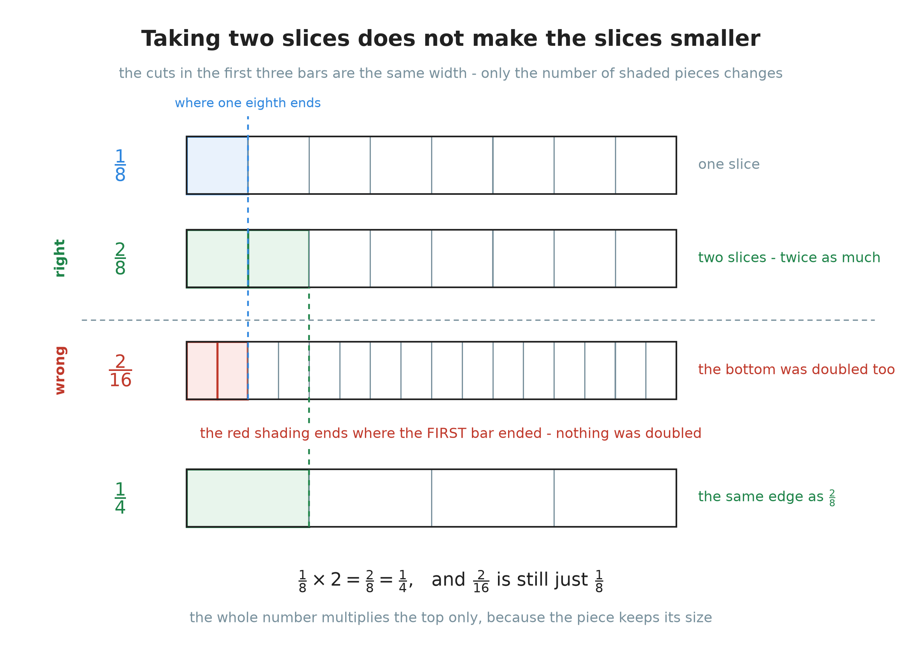
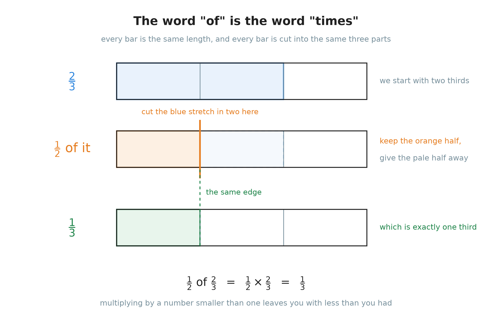
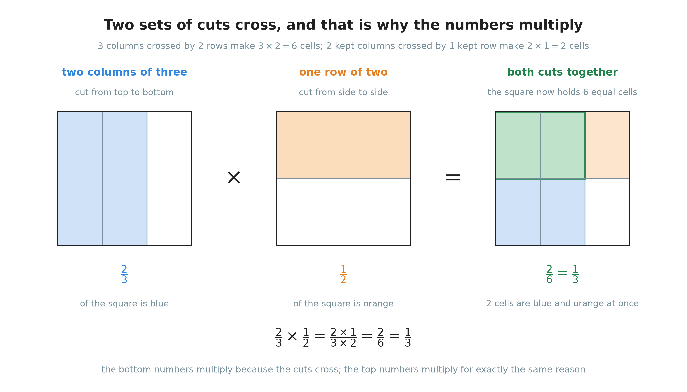
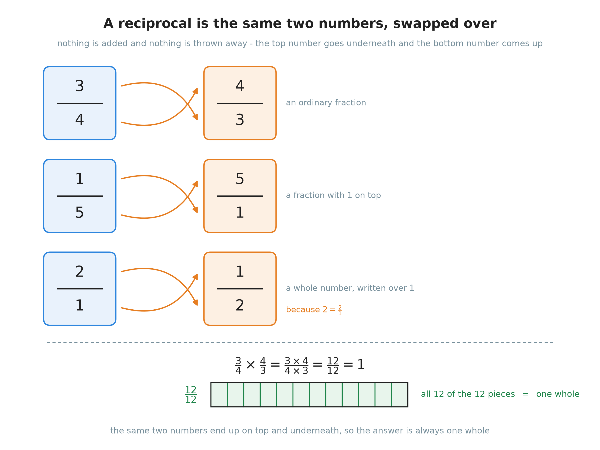
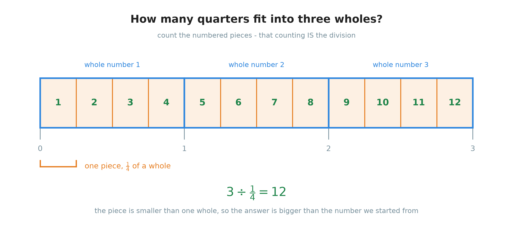
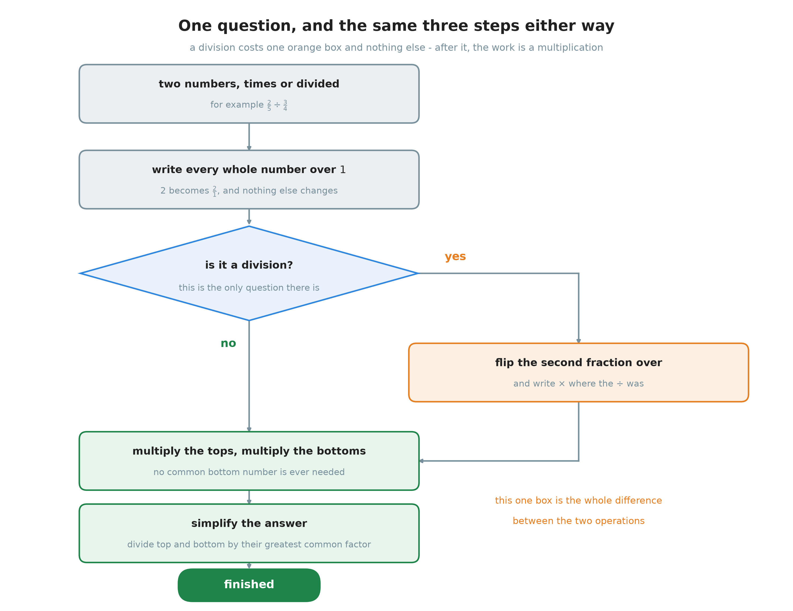

# 16. Multiplying and dividing fractions

**What this chapter teaches**
How to multiply two fractions, and why they never need the same bottom number. What
happens when you turn a fraction upside down. How every division of fractions becomes a
multiplication, and why nothing can ever be divided by zero.

**Before you start**
Read [Chapter 1](./../1_Fractions/1_Fractions.md) first. This chapter leans on
[section 2.2](./../1_Fractions/1_Fractions.md#22-a-fraction-is-a-division),
[section 3.2](./../1_Fractions/1_Fractions.md#32-the-rule-do-the-same-thing-to-the-top-and-to-the-bottom)
and [section 3.3](./../1_Fractions/1_Fractions.md#33-simplifying-a-fraction).
[Chapter 15](./../15_Adding_And_Subtracting_Fractions/15_Adding_And_Subtracting_Fractions.md)
is the other half of this story — it added and subtracted fractions, and section 1 here
begins by asking why this chapter is so much easier. Section 3.2 uses
[Chapter 6, section 3](./../6_The_Distributive_Property/6_The_Distributive_Property.md#3-seeing-the-rule-as-a-rectangle),
and section 4 uses
[Chapter 10, section 7.1](./../10_Exponents/10_Exponents.md#71-one-more-word-first).

---

## Table of contents

1. [A different question](#1-a-different-question)
2. [A fraction times a whole number](#2-a-fraction-times-a-whole-number)
3. [A fraction times a fraction](#3-a-fraction-times-a-fraction)
4. [Turning a fraction upside down](#4-turning-a-fraction-upside-down)
5. [Dividing](#5-dividing)
6. [Dividing by one, and never by zero](#6-dividing-by-one-and-never-by-zero)
7. [The whole method in one place](#7-the-whole-method-in-one-place)
8. [Glossary](#8-glossary)
9. [Check your understanding](#9-check-your-understanding)
10. [Important notes](#10-important-notes)

---

## 1. A different question

### 1.1 Why this chapter does not need a common denominator

[Chapter 15](./../15_Adding_And_Subtracting_Fractions/15_Adding_And_Subtracting_Fractions.md)
was built on one sentence:

> Two fractions can only be added or subtracted when their pieces are the same size.

That is why $\frac{1}{3} + \frac{1}{4}$ could not be answered until both fractions had been
rewritten in twelfths. Thirds and quarters are different sizes, and different sizes cannot
be counted together.

Multiplication never asks that question. Not once in this whole chapter will you look for a
common bottom number. Here is why.

**Adding puts two amounts side by side.** You have some, you get some more, and you count
what you now hold. Counting only works when the things are the same. Three boxes and four
bags are not seven of anything.

**Multiplying does not put two amounts side by side.** The second number does not join the
first one. It *acts on* it. $\frac{1}{2} \times \frac{2}{3}$ does not mean "a half together
with two thirds". It means "take two thirds, and then take half of that". The second
fraction is an instruction, not a quantity waiting to be counted.

Because the second fraction is an instruction, its bottom number never has to agree with
anything. That single difference is why this chapter is shorter than Chapter 15.

> **Warning.** Do not look for a common denominator when you multiply or divide. You do not
> need one. Section 3.6 shows exactly what it costs to look for one anyway.

### 1.2 Every whole number is already a fraction

Before the rules, one small fact that this chapter uses again and again.

Any whole number can be written as a fraction by putting $1$ underneath:

$$
5 = \frac{5}{1} \qquad 2 = \frac{2}{1} \qquad 10 = \frac{10}{1}
$$

**Why that is true.** A fraction bar is a division sign
([Chapter 1, section 2.2](./../1_Fractions/1_Fractions.md#22-a-fraction-is-a-division)). So
$\frac{5}{1}$ means $5 \div 1$ — share five things between one person. That person gets all
five. So $\frac{5}{1}$ is $5$.

You can also read it the way Chapter 1 reads any fraction. The bottom number says how many
equal pieces one whole was cut into. A bottom number of $1$ means the whole was not cut at
all. So $\frac{5}{1}$ is five uncut wholes, which is $5$.

> **Note.** [Chapter 10, section 7.1](./../10_Exponents/10_Exponents.md#71-one-more-word-first)
> used this in one line to turn $4$ into $\frac{4}{1}$. Here it earns a section of its own,
> because it is what lets a single rule cover whole numbers and fractions together.

This is useful because it means **there is only one kind of number in this chapter**. When a
whole number turns up in a multiplication or a division, write it over $1$ and it becomes a
fraction like any other. Nothing special has to be remembered for it.

### Summary of section 1

* Adding needs matching pieces, because adding is counting.
* Multiplying does not, because the second number is an instruction, not an amount.
* So you never need a common bottom number in this chapter.
* Any whole number $n$ can be written as $\frac{n}{1}$, because a bottom number of $1$
  means the whole was never cut.

---

## 2. A fraction times a whole number

### 2.1 Two slices are not smaller slices

**Work out $\frac{1}{8} \times 2$.**

Think of a pizza cut into $8$ equal slices. One slice is $\frac{1}{8}$ of the pizza. Now take
two slices.

The slices did not change. They are still eighths. You simply have two of them instead of
one. So you have $\frac{2}{8}$ of the pizza.

    

**Figure 1 — Look at the first two bars. The cuts are in exactly the same places, so the
shaded pieces are exactly the same size. Only the number of shaded pieces changed. The third
bar shows what happens if you double the bottom number as well: the shading ends at the same
place as in the very first bar, so nothing was doubled at all. The bottom bar shows that
$\frac{2}{8}$ reaches the same edge as $\frac{1}{4}$.**

Now simplify the answer
([Chapter 1, section 3.3](./../1_Fractions/1_Fractions.md#33-simplifying-a-fraction)):

$$
\frac{2}{8} = \frac{2 \div 2}{8 \div 2} = \frac{1}{4}
$$

Two slices out of eight is a quarter of the pizza. That matches the bottom bar of Figure 1.

### 2.2 Why the bottom number does not move

The picture is convincing, but here is the reason, using only rules the book already has.

Multiplying by a whole number is repeated addition
([Chapter 6, section 1.1](./../6_The_Distributive_Property/6_The_Distributive_Property.md#11-multiplication-is-repeated-addition)).
So take $3 \times \frac{2}{7}$ and write it out:

$$
3 \times \frac{2}{7} = \frac{2}{7} + \frac{2}{7} + \frac{2}{7}
$$

Every one of those fractions is counted in sevenths. They are **like fractions**, so
[Chapter 15, section 2](./../15_Adding_And_Subtracting_Fractions/15_Adding_And_Subtracting_Fractions.md#2-when-the-bottom-numbers-already-match)
already tells us what to do: add the top numbers, and copy the bottom number down.

$$
\frac{2}{7} + \frac{2}{7} + \frac{2}{7} = \frac{2 + 2 + 2}{7} = \frac{6}{7}
$$

And $2 + 2 + 2$ is $3 \times 2$. So the whole number multiplied the top number, and the
bottom number never moved, because it never moves in an addition of like fractions either.

> **Warning.** The commonest mistake here is to multiply both numbers:
>
> $$2 \times \frac{1}{3} = \frac{2}{6} \qquad \text{wrong}$$
>
> Look at what that actually does.
> [Chapter 1, section 3.2](./../1_Fractions/1_Fractions.md#32-the-rule-do-the-same-thing-to-the-top-and-to-the-bottom)
> says that multiplying the top *and* the bottom by the same number leaves a fraction
> unchanged. So $\frac{2}{6}$ is still $\frac{1}{3}$. Doubling both numbers multiplies by
> $1$, not by $2$. That is the red bar in Figure 1.

### 2.3 The rule in symbols

$$
n \times \frac{a}{b} = \frac{n \times a}{b}
$$

**In words:** multiply the whole number by the top number, and write the answer over the
same bottom number.

* $n$ — the whole number. It says how many copies of the fraction you take.
* $a$ — the top number: how many pieces there are in one copy.
* $b$ — the bottom number: how many pieces make one whole. It does not move.

Test it on the two examples so far:

$$
3 \times \frac{2}{7} = \frac{3 \times 2}{7} = \frac{6}{7}
\qquad
\frac{1}{8} \times 2 = \frac{1 \times 2}{8} = \frac{2}{8} = \frac{1}{4}
$$

> **Note.** The second one has the whole number on the right, and nothing changed. The order
> of two factors never matters
> ([Chapter 6, section 1.3](./../6_The_Distributive_Property/6_The_Distributive_Property.md#13-the-order-of-the-two-factors-does-not-matter)).

### 2.4 A worked one: $\frac{1}{3} \times 2$

* **Step 1.** Find the whole number and the top number. The whole number is $2$. The top
  number is $1$.
* **Step 2.** Multiply them.

  $$2 \times 1 = 2$$

* **Step 3.** Keep the bottom number, which is $3$.

  $$\frac{1}{3} \times 2 = \frac{2}{3}$$

* **Step 4.** Can it be simplified? The greatest common factor of $2$ and $3$ is $1$, so no.
  The answer is finished.

### Summary of section 2

* A whole number changes **how many** pieces you have, not how big they are.
* So it multiplies the top number and leaves the bottom number alone.
* $n \times \frac{a}{b} = \frac{n \times a}{b}$.
* Multiplying both numbers by $n$ multiplies the fraction by $1$ and changes nothing.
* Always check the answer for simplifying at the end.

---

## 3. A fraction times a fraction

### 3.1 The word "of" is the word "times"

**Work out $\frac{1}{2} \times \frac{2}{3}$.**

Read it out loud in the most natural way: **half of two thirds**.

That is already a question you can answer without any rule at all. Take two thirds of
something and cut it in half.

    

**Figure 2 — The top bar is two thirds. The middle bar is the same two thirds with a cut
down its middle: keep the orange half, give the pale half away. The dashed green line shows
that the orange half ends at exactly the same place as one third on the bottom bar. So half
of two thirds is one third.**

This is worth saying plainly, because it is what makes the rest of the chapter make sense:

> **Definition.** In mathematics, **"of" means "times"**. "Half of two thirds" and
> "$\frac{1}{2} \times \frac{2}{3}$" are the same question written in two ways.

### 3.2 Why the numbers multiply straight across

Now the reason. Draw one square and let it stand for one whole.
[Chapter 6, section 3.1](./../6_The_Distributive_Property/6_The_Distributive_Property.md#31-area-is-just-counting-squares)
showed that the area of a rectangle is found by counting equal squares, and that is all this
picture does.

    

**Figure 3 — The left square is cut from top to bottom into $3$ columns, and $2$ of them are
blue: that is $\frac{2}{3}$. The middle square is cut from side to side into $2$ rows, and
$1$ of them is orange: that is $\frac{1}{2}$. The right square has both sets of cuts. The
cuts cross, so the square now holds $3 \times 2 = 6$ equal cells, and the part that is blue
**and** orange is $2 \times 1 = 2$ of them.**

Follow the third square one step at a time.

1. There are $3$ columns and $2$ rows. Every cell is the same size, and there are
   $3 \times 2 = 6$ of them. So **one cell is $\frac{1}{6}$ of the square**.
2. The blue part keeps $2$ of the $3$ columns. The orange part keeps $1$ of the $2$ rows.
3. The part that is inside both is $2$ columns wide and $1$ row tall, so it is
   $2 \times 1 = 2$ cells.
4. Two cells out of six is $\frac{2}{6}$, and $\frac{2}{6} = \frac{1}{3}$.

That is the same answer Figure 2 gave. But now look at where the numbers came from:

* The **bottom** number of the answer, $6$, is $3 \times 2$ — the two bottom numbers
  multiplied. It is $6$ because the two sets of cuts crossed each other.
* The **top** number of the answer, $2$, is $2 \times 1$ — the two top numbers multiplied.
  It is $2$ for exactly the same reason: the kept columns crossed the kept row.

Nothing about the picture depends on the particular numbers $2$, $3$, $1$ and $2$. Cut a
square into $b$ columns and $d$ rows and it holds $b \times d$ cells. Keep $a$ of the columns
and $c$ of the rows and you are left with $a \times c$ of them. So the rule is not something
to remember. It is what crossing two sets of cuts does.

### 3.3 The rule in symbols

$$
\frac{a}{b} \times \frac{c}{d} = \frac{a \times c}{b \times d}
\qquad (b \neq 0,\ d \neq 0)
$$

**In words:** multiply the two top numbers to get the new top number, multiply the two
bottom numbers to get the new bottom number, and then simplify.

* $a$ and $c$ — the two top numbers: how many pieces each fraction keeps.
* $b$ and $d$ — the two bottom numbers: how many pieces each whole was cut into.
* $b \times d$ — how many cells there are once both sets of cuts have been made.
* $a \times c$ — how many of those cells the answer keeps.
* $b \neq 0$ and $d \neq 0$ are read "$b$ is not zero" and "$d$ is not zero". A fraction bar
  is a division, and nothing can be divided by zero
  ([Chapter 10, section 5.2](./../10_Exponents/10_Exponents.md#52-the-rule)). Section 6.2
  says more about this.

> **Note — section 2 was this rule all along.** Write the whole number over $1$, as
> section 1.2 said you always can:
>
> $$2 \times \frac{1}{3} = \frac{2}{1} \times \frac{1}{3} = \frac{2 \times 1}{1 \times 3} = \frac{2}{3}$$
>
> The bottom number got multiplied by $1$, which is why it did not change. So there are not
> two rules in this chapter. There is one rule, and section 2 is the case where one of the
> bottom numbers happens to be $1$.

### 3.4 A worked one: $\frac{5}{6} \times \frac{3}{4}$

* **Step 1.** Multiply the top numbers.

  $$5 \times 3 = 15$$

* **Step 2.** Multiply the bottom numbers.

  $$6 \times 4 = 24$$

* **Step 3.** Write them as one fraction.

  $$\frac{5}{6} \times \frac{3}{4} = \frac{15}{24}$$

* **Step 4.** Simplify. The greatest common factor of $15$ and $24$ is $3$, because
  $15 = 3 \times 5$ and $24 = 2^{3} \times 3$
  ([Chapter 14, section 3](./../14_The_Greatest_Common_Factor/14_The_Greatest_Common_Factor.md#3-the-second-method-read-it-off-the-primes)).

  $$\frac{15 \div 3}{24 \div 3} = \frac{5}{8}$$

* **Step 5.** Check that it is finished. $\mathrm{GCF}(5,\, 8) = 1$, so it is.

$$
\frac{5}{6} \times \frac{3}{4} = \frac{5}{8}
$$

### 3.5 What multiplying by a fraction actually does

Look again at the rule:

$$
\frac{a}{b} \times \frac{c}{d} = \frac{a \times c}{b \times d}
$$

Two separate things happened.

* The top number was multiplied by $c$. That means **more pieces**.
* The bottom number was multiplied by $d$. A bigger bottom number means the whole was cut
  into more parts, so each piece is **smaller**. That is a division.

So multiplying by $\frac{c}{d}$ is the same as multiplying by $c$ and then dividing by $d$.

That gives you a way to know roughly what size answer to expect, before you work anything
out:

| If the second fraction is | Then the answer is | Example |
| --- | --- | --- |
| smaller than $1$ | **smaller** than the first fraction | $\frac{5}{6} \times \frac{3}{4} = \frac{5}{8}$, and $\frac{5}{8} < \frac{5}{6}$ |
| exactly $1$ | the same as the first fraction | $\frac{5}{6} \times \frac{2}{2} = \frac{5}{6}$ |
| bigger than $1$ | **bigger** than the first fraction | $\frac{5}{6} \times \frac{4}{3} = \frac{20}{18} = \frac{10}{9}$ |

> **Warning.** "Multiplying makes things bigger" is true for whole numbers and false for
> fractions. $\frac{1}{2} \times \frac{2}{3}$ came out smaller than $\frac{2}{3}$, and it had
> to, because taking half of something leaves you with less than you had.

### 3.6 The common denominator you do not need

In Chapter 15 the first move was always to give both fractions the same bottom number. It is
natural to reach for that here too. So what happens if you do?

Take $\frac{2}{3} \times \frac{1}{2}$ and rewrite both fractions over $6$:

$$
\frac{2}{3} = \frac{4}{6} \qquad \frac{1}{2} = \frac{3}{6}
$$

$$
\frac{4}{6} \times \frac{3}{6} = \frac{4 \times 3}{6 \times 6} = \frac{12}{36} = \frac{1}{3}
$$

The answer is $\frac{1}{3}$, which is correct. Rewriting a fraction does not change its
value, so it cannot change the value of the product either.

So this is **not a mistake**. It is a waste. Compare the two roads:

| | Straight across | With a common denominator first |
| --- | --- | --- |
| Preparation | none | find the LCD, rewrite two fractions |
| Numbers multiplied | $2 \times 1$ and $3 \times 2$ | $4 \times 3$ and $6 \times 6$ |
| Fraction to simplify | $\frac{2}{6}$ | $\frac{12}{36}$ |
| Answer | $\frac{1}{3}$ | $\frac{1}{3}$ |

The second road does three extra pieces of work and ends up simplifying a much larger
fraction. Bigger numbers are not harder to be right about, but they are easier to be wrong
about.

### Summary of section 3

* "Of" means "times": $\frac{1}{2}$ of $\frac{2}{3}$ is $\frac{1}{2} \times \frac{2}{3}$.
* Cutting a square both ways gives $b \times d$ cells and keeps $a \times c$ of them. That is
  the whole rule.
* $\frac{a}{b} \times \frac{c}{d} = \frac{a \times c}{b \times d}$, then simplify.
* Section 2's rule is this rule with a bottom number of $1$.
* Multiplying by a fraction smaller than $1$ makes the answer smaller.
* A common denominator gives the right answer here, but it is work you threw away.

---

## 4. Turning a fraction upside down

### 4.1 The reciprocal

Division is going to need one idea, and the book already has it.

> The **reciprocal** of a number is what you get when you turn it upside down. The reciprocal
> of $\frac{a}{b}$ is $\frac{b}{a}$
> ([Chapter 10, section 7.1](./../10_Exponents/10_Exponents.md#71-one-more-word-first)).

Nothing is added and nothing is thrown away. The top number goes underneath, and the bottom
number comes up.

    

**Figure 4 — The crossing arrows are the whole idea: the two numbers swap places. The third
row works because $2$ is $\frac{2}{1}$, so a whole number can be flipped too. The bar at the
bottom is twelve pieces out of twelve, which is one whole — and that is what a fraction
times its own reciprocal always gives.**

A whole number has a reciprocal for exactly the reason section 1.2 gave. $2$ is $\frac{2}{1}$,
so the reciprocal of $2$ is $\frac{1}{2}$.

| Number | Written as a fraction | Its reciprocal |
| --- | --- | --- |
| $\frac{3}{4}$ | $\frac{3}{4}$ | $\frac{4}{3}$ |
| $\frac{1}{5}$ | $\frac{1}{5}$ | $\frac{5}{1} = 5$ |
| $2$ | $\frac{2}{1}$ | $\frac{1}{2}$ |
| $1$ | $\frac{1}{1}$ | $\frac{1}{1} = 1$ |

> **Note.** $1$ is its own reciprocal, and that is the only number that is. You will see why
> it matters in section 6.1.

### 4.2 A fraction times its reciprocal is always $1$

This is the fact that makes division work, and section 3.3 already proves it.

$$
\frac{3}{4} \times \frac{4}{3} = \frac{3 \times 4}{4 \times 3} = \frac{12}{12} = 1
$$

Read the middle step slowly. The top is $3 \times 4$ and the bottom is $4 \times 3$. They are
the same two numbers multiplied in a different order, so they are the same number. And any
number over itself is one whole
([Chapter 1, section 2.3](./../1_Fractions/1_Fractions.md#23-when-the-parts-build-the-whole-back)).

It works the same way with letters, and for the same reason:

$$
\frac{a}{b} \times \frac{b}{a} = \frac{a \times b}{b \times a} = 1
\qquad (a \neq 0,\ b \neq 0)
$$

> **Note.** This is why a reciprocal is also called a **multiplicative inverse**. An inverse
> undoes something ([Chapter 8, section 1.1](./../8_Dividing_Large_Numbers/8_Dividing_Large_Numbers.md#11-small-divisions-are-times-tables-read-backwards)),
> and multiplying by $\frac{b}{a}$ undoes multiplying by $\frac{a}{b}$ — it takes you back to
> where you started, which is $1$ times what you had.

### Summary of section 4

* The reciprocal of $\frac{a}{b}$ is $\frac{b}{a}$: the same two numbers, swapped over.
* A whole number $n$ has the reciprocal $\frac{1}{n}$, because $n$ is $\frac{n}{1}$.
* $\frac{a}{b} \times \frac{b}{a} = 1$, because the top and the bottom end up being the same
  number.
* Zero has no reciprocal, because $\frac{1}{0}$ would be a division by zero.

---

## 5. Dividing

### 5.1 What a division actually asks

A division can be read in two ways, and both readings are useful here.

**Reading one: share it out.** $6 \div 3$ means "share six things between three people; how
many does each get?" That is the reading
[Chapter 1, section 1.1](./../1_Fractions/1_Fractions.md#11-division-means-sharing-into-equal-parts)
started from.

**Reading two: how many fit?** $6 \div 3$ also means "how many threes fit into six?" Both
readings give $2$, and both are correct.

When you divide **by a fraction**, the second reading is the one that makes sense. Nobody
shares something between half a person. But "how many halves fit into this?" is a perfectly
ordinary question.

    

**Figure 5 — Three wholes, each cut into quarters. Count the numbered pieces: there are
$12$. So $3 \div \frac{1}{4} = 12$. The answer came out bigger than $3$ because the piece
being counted is smaller than one whole, so a lot of them fit.**

> **Warning.** "Dividing makes things smaller" is true for whole numbers and false for
> fractions, exactly as section 3.5 found for multiplying. Dividing by a number smaller than
> $1$ makes the answer **bigger**.

> **Note.** Answers bigger than $1$ are normal in this section. $12$ is a whole number, and
> other divisions will give improper fractions such as $\frac{15}{8}$. Chapter 1 already
> covered those: see
> [section 5.1](./../1_Fractions/1_Fractions.md#51-when-the-numerator-is-the-bigger-number)
> for what an improper fraction is, and
> [section 5.3](./../1_Fractions/1_Fractions.md#53-turning-an-improper-fraction-into-a-mixed-number)
> for turning one into a mixed number if the question wants that.

Look again at how $12$ was reached. Each whole holds $4$ quarters, and there are $3$ wholes,
so there are $3 \times 4$ of them. **Dividing by $\frac{1}{4}$ turned into multiplying by
$4$** — and $4$ is the reciprocal of $\frac{1}{4}$. That is the whole of this section, seen
once.

### 5.2 Dividing by a whole number

**Work out $\frac{2}{3} \div 2$.**

In words: you have two thirds of a cake and you share it between two people. How much does
each person get?

You already know the answer. Section 3.1 cut two thirds in half and got one third. Sharing
between two people and taking half are the same thing.

$$
\frac{2}{3} \div 2 = \frac{1}{3}
$$

Now look at what that says:

$$
\frac{2}{3} \div 2 = \frac{2}{3} \times \frac{1}{2}
$$

Dividing by $2$ gave the same answer as multiplying by $\frac{1}{2}$. And $\frac{1}{2}$ is
the reciprocal of $2$. The same thing happened in section 5.1 with $\frac{1}{4}$ and $4$.

### 5.3 Keep, change, flip

That pattern is the rule, and it has a name that is easy to remember.

> **To divide by a fraction: keep, change, flip.**
>
> 1. **Keep** the first fraction exactly as it is.
> 2. **Change** the $\div$ sign into a $\times$ sign.
> 3. **Flip** the second fraction — replace it by its reciprocal.
> 4. Then multiply as usual, and simplify.

Applied to $\frac{2}{3} \div 2$:

* Write the whole number over $1$: $\ \frac{2}{3} \div \frac{2}{1}$.
* **Keep** $\frac{2}{3}$.
* **Change** $\div$ to $\times$.
* **Flip** $\frac{2}{1}$ to $\frac{1}{2}$.

$$
\frac{2}{3} \div 2 = \frac{2}{3} \times \frac{1}{2} = \frac{2 \times 1}{3 \times 2} = \frac{2}{6} = \frac{1}{3}
$$

### 5.4 Why flipping works

"Keep, change, flip" is easy to remember and easy to believe is a trick. It is not a trick.
Here is the reason, using only what the book already has.

A fraction bar **is** a division sign
([Chapter 1, section 2.2](./../1_Fractions/1_Fractions.md#22-a-fraction-is-a-division)). So
the division can be written as one tall fraction, with $\frac{a}{b}$ on top and $\frac{c}{d}$
underneath:

$$
\frac{a}{b} \div \frac{c}{d} \;=\; \frac{\ \dfrac{a}{b}\ }{\ \dfrac{c}{d}\ }
$$

Nothing has happened yet. That is the same division, written in a different shape.

Now use the rule from
[Chapter 1, section 3.2](./../1_Fractions/1_Fractions.md#32-the-rule-do-the-same-thing-to-the-top-and-to-the-bottom):
multiplying the top and the bottom of a fraction by the same number leaves its value alone.
Choose the number that makes the bottom tidy — the reciprocal of $\frac{c}{d}$, which is
$\frac{d}{c}$:

$$
\frac{\ \dfrac{a}{b}\ }{\ \dfrac{c}{d}\ }
= \frac{\ \dfrac{a}{b} \times \dfrac{d}{c}\ }{\ \dfrac{c}{d} \times \dfrac{d}{c}\ }
$$

Look at the bottom. Section 4.2 said that a fraction times its own reciprocal is $1$:

$$
\frac{c}{d} \times \frac{d}{c} = 1
$$

So the bottom is now $1$, and dividing by $1$ changes nothing:

$$
\frac{\ \dfrac{a}{b} \times \dfrac{d}{c}\ }{1} = \frac{a}{b} \times \frac{d}{c}
$$

And that is the rule. The flip is not a short cut that happens to work. It is the one
multiplication that clears the bottom of the fraction, and clearing the bottom is the only
thing standing between you and an ordinary multiplication.

### 5.5 The rule in symbols

$$
\frac{a}{b} \div \frac{c}{d} = \frac{a}{b} \times \frac{d}{c} = \frac{a \times d}{b \times c}
\qquad (b \neq 0,\ c \neq 0,\ d \neq 0)
$$

**In words:** keep the first fraction, turn the second one upside down, and multiply.

* $\frac{a}{b}$ — the fraction being divided. It does not change.
* $\frac{c}{d}$ — the fraction you are dividing by. This is the one that flips.
* $\frac{d}{c}$ — its reciprocal.
* $c \neq 0$ is the new condition, and it is there because $\frac{c}{d}$ becomes the bottom
  of the answer. If $c$ were $0$ there would be nothing to flip to. Section 6.2 is about
  exactly that.

### 5.6 A worked one: $\frac{2}{5} \div \frac{3}{4}$

* **Step 1.** Name the parts. $\frac{2}{5}$ is being divided; $\frac{3}{4}$ is what it is
  being divided by.
* **Step 2.** Find the reciprocal of the **second** fraction.

  $$\text{the reciprocal of } \frac{3}{4} \text{ is } \frac{4}{3}$$

* **Step 3.** Keep, change, flip.

  $$\frac{2}{5} \div \frac{3}{4} = \frac{2}{5} \times \frac{4}{3}$$

* **Step 4.** Multiply the tops.

  $$2 \times 4 = 8$$

* **Step 5.** Multiply the bottoms.

  $$5 \times 3 = 15$$

* **Step 6.** Write the answer and check it is finished. $\mathrm{GCF}(8,\, 15) = 1$, because
  $8 = 2^{3}$ and $15 = 3 \times 5$ share no prime. So it is finished.

$$
\frac{2}{5} \div \frac{3}{4} = \frac{8}{15}
$$

**Is that a sensible size?** We divided by $\frac{3}{4}$, which is smaller than $1$, so the
answer should be **bigger** than $\frac{2}{5}$. And $\frac{2}{5} = 0.4$ while
$\frac{8}{15} \approx 0.533$. It is bigger. Good.

### 5.7 Flip the second one, never the first

This is the mistake to watch for. If you flip the wrong fraction in the example above you get:

$$
\frac{5}{2} \times \frac{3}{4} = \frac{15}{8} \qquad \text{wrong}
$$

$\frac{15}{8}$ is nearly $2$. The question started at $\frac{2}{5}$, which is less than a
half, and divided it by something less than $1$ — that cannot possibly reach $2$.

The reason only the second fraction flips is in section 5.4. The flip was chosen to clear the
**bottom** of the tall fraction, and the bottom is the number you are dividing **by**. The
first fraction was never in the way, so it was never touched.

> **Note.** Subtraction and division do not let you swap the two numbers around
> ([Chapter 6, section 1.5](./../6_The_Distributive_Property/6_The_Distributive_Property.md#15-subtraction-and-division-do-not-follow-these-two-rules)).
> $\frac{2}{5} \div \frac{3}{4}$ and $\frac{3}{4} \div \frac{2}{5}$ are different questions
> with different answers. Which fraction is first matters, and so does which one flips.

### Summary of section 5

* A division asks "how many of these fit into that?", and that reading survives fractions.
* Dividing by a number smaller than $1$ makes the answer bigger.
* **Keep, change, flip:** keep the first fraction, change $\div$ to $\times$, flip the second.
* It works because flipping is the one multiplication that turns the bottom of the division
  into $1$.
* $\frac{a}{b} \div \frac{c}{d} = \frac{a}{b} \times \frac{d}{c}$.
* Only the second fraction flips, because only the second fraction was in the way.

---

## 6. Dividing by one, and never by zero

### 6.1 Dividing by one

Dividing by $1$ leaves a number alone:

$$
\frac{2}{5} \div 1 = \frac{2}{5}
$$

The rule says so too. Write $1$ as $\frac{1}{1}$ and flip it; it is its own reciprocal
(section 4.1), so:

$$
\frac{2}{5} \div \frac{1}{1} = \frac{2}{5} \times \frac{1}{1} = \frac{2 \times 1}{5 \times 1} = \frac{2}{5}
$$

Read it as a question and it is obvious: *how many whole ones fit into two fifths?* Two
fifths of one. Sharing something between one person gives that person all of it.

### 6.2 Why dividing by zero has no answer

Now try the same thing with $0$ instead of $1$.

$$
\frac{3}{4} \div 0 = \text{?}
$$

**The reason there is no answer.** Multiplication and division undo each other
([Chapter 8, section 1.1](./../8_Dividing_Large_Numbers/8_Dividing_Large_Numbers.md#11-small-divisions-are-times-tables-read-backwards)).
That is what a division *means*: if $\frac{3}{4} \div 0$ had an answer, call it $q$, then
multiplying back would have to give the original number:

$$
q \times 0 = \frac{3}{4}
$$

But anything multiplied by zero is zero
([Chapter 9, section 5.2](./../9_Negative_Numbers/9_Negative_Numbers.md#52-a-negative-number-times-a-negative-number)).
So the left-hand side is $0$, whatever $q$ is, and the line says:

$$
0 = \frac{3}{4}
$$

which is false. There is no number $q$ that works. Not a big one, not a small one, not zero
itself. The question has no answer at all.

> **Definition.** An expression that has no answer is called **undefined**. $\frac{3}{4} \div 0$
> is undefined. It is not a hard sum — it is a sum with nothing to find.

**The same thing, said with the method.** Keep, change, flip needs the reciprocal of the
second number. Zero is $\frac{0}{1}$, so flipping it would give $\frac{1}{0}$ — which is a
division by zero all over again. The method has nowhere to go.

> **Warning.** $\frac{3}{4} \div 0$ is **not** $0$, and it is **not** $\frac{3}{4}$. Those are
> the two answers people write, and both are wrong. There is no answer.

> **Note.** You may see it said that dividing by zero gives infinity, because "infinitely many
> empty groups fit into anything". Be careful with that sentence. Read the question honestly:
> *how many groups of size $0$ add up to $\frac{3}{4}$?* A hundred empty groups hold nothing.
> A million empty groups hold nothing. No number of them ever reaches $\frac{3}{4}$, so the
> problem is not that the answer is too big — it is that there is no answer.

> **Note.** This also finishes something the book left open.
> [Chapter 10, section 5.2](./../10_Exponents/10_Exponents.md#52-the-rule) said "nothing can
> be divided by zero" and moved on. This is the reason. It is also why every rule in this
> chapter carries a condition such as $b \neq 0$: a bottom number is a divisor.

### Summary of section 6

* Dividing by $1$ changes nothing, because $1$ is its own reciprocal.
* Dividing by $0$ is **undefined**: no number multiplied by $0$ can give you back what you
  started with.
* Zero has no reciprocal, so there is nothing to flip to.
* $\frac{3}{4} \div 0$ is not $0$ and not $\frac{3}{4}$. It has no answer.

---

## 7. The whole method in one place

### 7.1 One question, and the same last steps

Everything in this chapter is one method with one question in the middle of it.

    

**Figure 6 — Follow the arrows. Whichever way you go, the last two boxes are the same. A
division costs exactly one extra box — flip the second fraction — and after that box it is a
multiplication like any other.**

In words:

1. Write every whole number over $1$.
2. If it is a division, flip the second fraction and change $\div$ to $\times$.
3. Multiply the top numbers. Multiply the bottom numbers.
4. Simplify.

Compare this with Chapter 15's flow and the difference is the point of the chapter. There,
the extra branch was **two** boxes of preparation and it was needed whenever the bottom
numbers disagreed — which is most of the time. Here the extra branch is **one** box, and it
is needed only for division.

### 7.2 A last example: $\frac{7}{12} \div \frac{14}{15}$

* **Step 1.** There are no whole numbers to rewrite.
* **Step 2.** It is a division, so keep, change, flip.

  $$\frac{7}{12} \div \frac{14}{15} = \frac{7}{12} \times \frac{15}{14}$$

* **Step 3.** Multiply the top numbers.

  $$7 \times 15 = 105$$

* **Step 4.** Multiply the bottom numbers.

  $$12 \times 14 = 168$$

* **Step 5.** Write it as one fraction.

  $$\frac{105}{168}$$

* **Step 6.** Simplify. Break both numbers into primes
  ([Chapter 14, section 3](./../14_The_Greatest_Common_Factor/14_The_Greatest_Common_Factor.md#3-the-second-method-read-it-off-the-primes)):

  $$105 = 3 \times 5 \times 7 \qquad 168 = 2^{3} \times 3 \times 7$$

  They share $3$ and $7$, so $\mathrm{GCF}(105,\, 168) = 3 \times 7 = 21$.

  $$\frac{105 \div 21}{168 \div 21} = \frac{5}{8}$$

$$
\frac{7}{12} \div \frac{14}{15} = \frac{5}{8}
$$

### 7.3 Two checks worth doing every time

Chapter 15 ended with two checks
([section 6.3](./../15_Adding_And_Subtracting_Fractions/15_Adding_And_Subtracting_Fractions.md#63-two-checks-worth-doing-every-time)),
and the same two work here, with the size check reading a little differently.

**Check one: is the size sensible?** Use the tables in sections 3.5 and 5.1.

In the example above, we divided by $\frac{14}{15}$, which is just under $1$. So the answer
should be just a little bigger than $\frac{7}{12}$.

$$
\frac{7}{12} \approx 0.583 \qquad \frac{5}{8} = 0.625
$$

It is a little bigger. Good.

**Check two: is the answer finished?** A fraction is finished exactly when its top and
bottom are coprime — when their greatest common factor is $1$
([Chapter 14, section 5.2](./../14_The_Greatest_Common_Factor/14_The_Greatest_Common_Factor.md#52-simplifying-a-fraction-in-one-step)).

$\mathrm{GCF}(5,\, 8) = 1$, so $\frac{5}{8}$ is finished.

> **Warning.** Multiplying two fractions makes the numbers grow fast. $\frac{7}{12}$ and
> $\frac{14}{15}$ are small fractions, and one step later you are simplifying
> $\frac{105}{168}$. Skipping the simplifying step is the easiest way to hand in an answer
> that is true but unfinished.

### Summary of section 7

* Write whole numbers over $1$, flip if it is a division, multiply across, simplify.
* Only one box of the method ever changes, and only for division.
* Check the size: multiplying by less than $1$ shrinks, dividing by less than $1$ grows.
* Check that it is finished: the top and the bottom must share no factor except $1$.

---

## 8. Glossary

**Undefined.** An expression that has no answer, such as any number divided by zero. It is
not a value and it is not zero — there is simply nothing to find (section 6.2).

**Multiplicative inverse.** Another name for the **reciprocal**. It is called an *inverse*
because multiplying by it undoes multiplying by the original number: the two together give
$1$ (section 4.2).

> **Note — everything else in this chapter was defined earlier, and is only linked here.**
> **Fraction**, **numerator**, **denominator**, **dividend**, **divisor**, **quotient** and
> **simplifying** are [Chapter 1](./../1_Fractions/1_Fractions.md). **Factor** and **product**
> are [Chapter 6, section 1.1](./../6_The_Distributive_Property/6_The_Distributive_Property.md#11-multiplication-is-repeated-addition).
> **Inverse operations** are [Chapter 8, section 1.1](./../8_Dividing_Large_Numbers/8_Dividing_Large_Numbers.md#11-small-divisions-are-times-tables-read-backwards).
> **Reciprocal** is [Chapter 10, section 7.1](./../10_Exponents/10_Exponents.md#71-one-more-word-first).
> **Greatest common factor** and **coprime** are
> [Chapter 14](./../14_The_Greatest_Common_Factor/14_The_Greatest_Common_Factor.md).
> **Like fractions** and **least common denominator** are
> [Chapter 15](./../15_Adding_And_Subtracting_Fractions/15_Adding_And_Subtracting_Fractions.md).

---

## 9. Check your understanding

**Question 1.** Work out $\frac{1}{4} \times 3$.

Answer

Write $3$ as $\frac{3}{1}$ and multiply across:

$$
\frac{1}{4} \times \frac{3}{1} = \frac{1 \times 3}{4 \times 1} = \frac{3}{4}
$$

$\mathrm{GCF}(3,\, 4) = 1$, so $\frac{3}{4}$ is finished.

Or use section 2.3 directly: the whole number multiplies the top only, so
$\frac{1 \times 3}{4} = \frac{3}{4}$.

**Question 2.** Work out $\frac{3}{5} \times \frac{1}{2}$.

Answer

$$
\frac{3}{5} \times \frac{1}{2} = \frac{3 \times 1}{5 \times 2} = \frac{3}{10}
$$

$\mathrm{GCF}(3,\, 10) = 1$, so it is finished.

Size check: we multiplied by $\frac{1}{2}$, which is less than $1$, so the answer should be
smaller than $\frac{3}{5}$. It is: $\frac{3}{10} = 0.3$ and $\frac{3}{5} = 0.6$. In fact it
is exactly half of it, which is what $\times \frac{1}{2}$ should do.

**Question 3.** Work out $\frac{4}{7} \times \frac{5}{6}$.

Answer

$$
\frac{4}{7} \times \frac{5}{6} = \frac{4 \times 5}{7 \times 6} = \frac{20}{42}
$$

Now simplify. $20 = 2^{2} \times 5$ and $42 = 2 \times 3 \times 7$, so they share one $2$ and
$\mathrm{GCF}(20,\, 42) = 2$.

$$
\frac{20 \div 2}{42 \div 2} = \frac{10}{21}
$$

$\mathrm{GCF}(10,\, 21) = 1$, so $\frac{10}{21}$ is finished.

**Question 4.** Work out $\frac{3}{4} \div 3$.

Answer

Write $3$ as $\frac{3}{1}$, then keep, change, flip:

$$
\frac{3}{4} \div \frac{3}{1} = \frac{3}{4} \times \frac{1}{3} = \frac{3 \times 1}{4 \times 3} = \frac{3}{12}
$$

$\mathrm{GCF}(3,\, 12) = 3$:

$$
\frac{3 \div 3}{12 \div 3} = \frac{1}{4}
$$

Size check: we divided by $3$, which is bigger than $1$, so the answer should be smaller than
$\frac{3}{4}$. It is — exactly one third of it.

**Question 5.** Work out $\frac{5}{9} \div \frac{2}{3}$.

Answer

Keep $\frac{5}{9}$, change $\div$ to $\times$, flip $\frac{2}{3}$ to $\frac{3}{2}$:

$$
\frac{5}{9} \times \frac{3}{2} = \frac{5 \times 3}{9 \times 2} = \frac{15}{18}
$$

$15 = 3 \times 5$ and $18 = 2 \times 3^{2}$, so $\mathrm{GCF}(15,\, 18) = 3$:

$$
\frac{15 \div 3}{18 \div 3} = \frac{5}{6}
$$

Size check: $\frac{2}{3}$ is less than $1$, so the answer should be bigger than $\frac{5}{9}$.
$\frac{5}{9} \approx 0.556$ and $\frac{5}{6} \approx 0.833$. It is.

**Question 6.** Work out $\frac{7}{12} \div \frac{14}{15}$ without looking back at section 7.2.

Answer

$$
\frac{7}{12} \times \frac{15}{14} = \frac{7 \times 15}{12 \times 14} = \frac{105}{168}
$$

$105 = 3 \times 5 \times 7$ and $168 = 2^{3} \times 3 \times 7$, so the shared primes are $3$
and $7$ and $\mathrm{GCF}(105,\, 168) = 21$.

$$
\frac{105 \div 21}{168 \div 21} = \frac{5}{8}
$$

**Question 7.** Without working it out, is $\frac{7}{8} \times \frac{2}{3}$ bigger or smaller
than $\frac{7}{8}$? How do you know?

Answer

Smaller.

$\frac{2}{3}$ is less than $1$. Multiplying by a number less than $1$ takes a *part* of what
you have, so you end up with less than you started with (section 3.5).

(If you do work it out: $\frac{7}{8} \times \frac{2}{3} = \frac{14}{24} = \frac{7}{12}$, and
$\frac{7}{12} \approx 0.583$ while $\frac{7}{8} = 0.875$.)

**Question 8.** A student works out $\frac{2}{3} \times \frac{1}{2}$ like this:

$$
\frac{2}{3} \times \frac{1}{2} = \frac{4}{6} \times \frac{3}{6} = \frac{12}{36} = \frac{1}{3}
$$

Is the answer wrong? What would you tell them?

Answer

The answer is **right**. $\frac{1}{3}$ is correct.

What they did was rewrite both fractions over a common denominator first, the way Chapter 15
does for addition. Rewriting a fraction does not change its value, so it cannot change the
answer.

But it was wasted work. They found a least common denominator they did not need, rewrote two
fractions they did not need to rewrite, multiplied $4 \times 3$ and $6 \times 6$ instead of
$2 \times 1$ and $3 \times 2$, and then had to simplify $\frac{12}{36}$ instead of
$\frac{2}{6}$.

So: not a wrong method, but three extra steps and much larger numbers for the same answer
(section 3.6). Common denominators belong to addition and subtraction only.

**Question 9.** Another student works out $\frac{2}{5} \div \frac{3}{4}$ and gets
$\frac{15}{8}$. What did they do, and how could they have caught it without redoing the sum?

Answer

They flipped the **first** fraction instead of the second:

$$
\frac{5}{2} \times \frac{3}{4} = \frac{15}{8}
$$

The correct work flips the second one: $\frac{2}{5} \times \frac{4}{3} = \frac{8}{15}$.

They could have caught it with a size check. $\frac{2}{5}$ is $0.4$, and they divided it by
$\frac{3}{4}$, which is less than $1$. So the answer should be a bit bigger than $0.4$ — not
$\frac{15}{8}$, which is $1.875$, nearly five times as large.

**Question 10.** Why is $\frac{3}{4} \div 0$ undefined rather than $0$?

Answer

Because a division has to be undone by a multiplication. If the answer were some number $q$,
then $q \times 0$ would have to give back $\frac{3}{4}$:

$$
q \times 0 = \frac{3}{4}
$$

Anything times zero is zero, so the left side is $0$ no matter what $q$ is. That would mean
$0 = \frac{3}{4}$, which is false. No number works, so there is no answer.

Saying the answer is $0$ would mean $0 \times 0 = \frac{3}{4}$, which is plainly untrue.

The same thing shows up in the method: zero is $\frac{0}{1}$, and flipping it gives
$\frac{1}{0}$, which is another division by zero. There is nothing to flip to.

---

## 10. Important notes

**The mistakes people actually make.**

* **Looking for a common denominator.** It is not needed for multiplying or dividing. It does
  not give a wrong answer — it gives the right answer after three pieces of unnecessary work
  with much larger numbers.
* **Multiplying the bottom number by the whole number.** $2 \times \frac{1}{3}$ is
  $\frac{2}{3}$, not $\frac{2}{6}$. Doubling both numbers multiplies the fraction by $1$ and
  changes nothing at all.
* **Flipping the first fraction.** Only the second one flips, because only the second one was
  in the bottom of the division. A size check catches this every time.
* **Forgetting to simplify.** Multiplying makes numbers grow quickly.
  $\frac{7}{12} \div \frac{14}{15}$ passes through $\frac{105}{168}$ on the way to
  $\frac{5}{8}$.
* **Expecting multiplying to make things bigger and dividing to make them smaller.** With
  fractions it is the other way round whenever the second number is less than $1$.
* **Treating division by zero as $0$.** It has no answer at all. Writing $0$ claims that
  $0 \times 0 = \frac{3}{4}$.

**The three ideas to keep.**

* **The second number is an instruction, not an amount.** That is why no common denominator
  is ever needed here, and it is the one sentence that separates this chapter from
  Chapter 15. Adding combines two quantities; multiplying tells you what to do to one.
* **The rule is a picture of crossing cuts.** Cut a square into $b$ columns and $d$ rows and
  it holds $b \times d$ cells. That is the whole of
  $\frac{a}{b} \times \frac{c}{d} = \frac{a \times c}{b \times d}$, and knowing it means you
  can rebuild the rule instead of trying to remember it.
* **Division is multiplication with one extra move.** Flipping the second fraction is the one
  multiplication that turns the bottom of a division into $1$. After that, there is no such
  thing as dividing fractions — only multiplying them.

**How this chapter connects to the rest of the book.**
This is the chapter where fractions stop being a special case.
[Chapter 1](./../1_Fractions/1_Fractions.md) supplied almost all of the machinery: a fraction
bar is a division (section 5.4 is built entirely on that), the rule for rewriting a fraction
without changing its value (section 5.4 again), any number over itself is $1$ (section 4.2),
and simplifying (every worked example).
[Chapter 6](./../6_The_Distributive_Property/6_The_Distributive_Property.md) supplied two
things: multiplication as repeated addition, which is why the bottom number does not move in
section 2.2, and the rectangle, which is why the numbers multiply straight across in
section 3.2. [Chapter 10](./../10_Exponents/10_Exponents.md) supplied the reciprocal.
[Chapter 14](./../14_The_Greatest_Common_Factor/14_The_Greatest_Common_Factor.md) supplied the
one-step finish that every answer ends with.

Two loose ends are tied off here. Chapter 10 said in passing that nothing can be divided by
zero; section 6.2 gives the reason, and it turns out to be Chapter 8's inverse operations plus
Chapter 9's "anything times zero is zero". And Chapter 10 wrote $4$ as $\frac{4}{1}$ in one
line; section 1.2 explains why that is allowed, which is what lets one rule cover fractions
and whole numbers together.

Read next to
[Chapter 15](./../15_Adding_And_Subtracting_Fractions/15_Adding_And_Subtracting_Fractions.md),
the pair of chapters says something worth noticing. The operation that *feels* simpler —
adding — needs the most preparation. The operation that feels harder — dividing — needs one
flip and nothing else. Difficulty and the number of steps are not the same thing.

---

- [Back to the book](./../README.md)
- Previous: [15 Adding and subtracting fractions](./../15_Adding_And_Subtracting_Fractions/15_Adding_And_Subtracting_Fractions.md)
- Next: not written yet.
