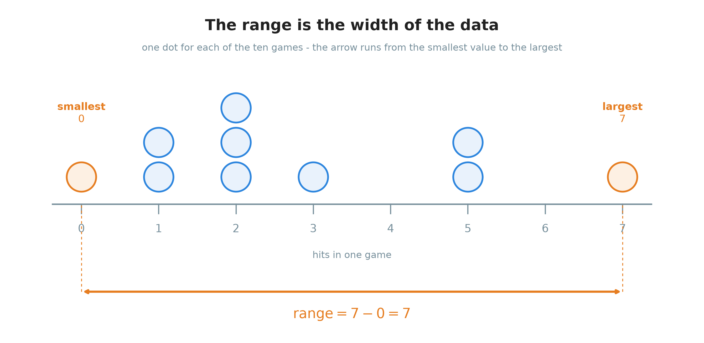
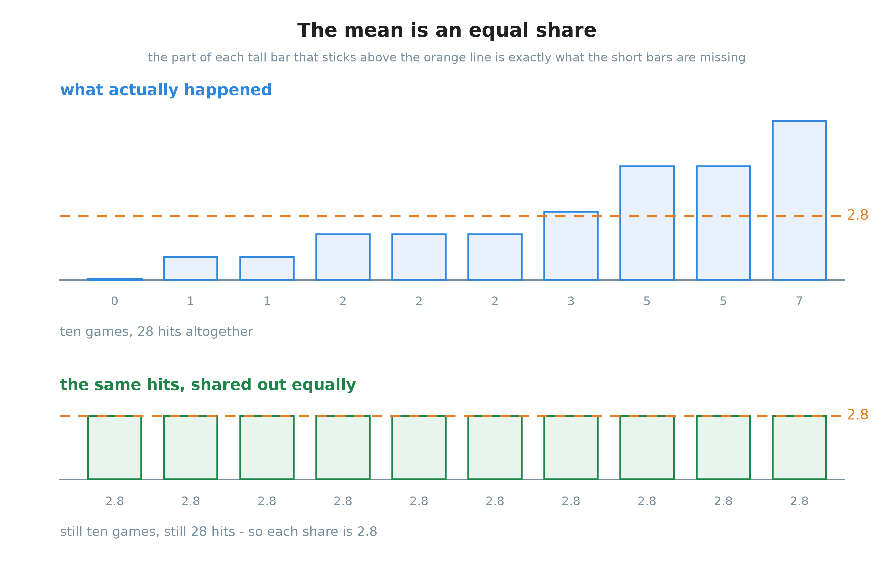
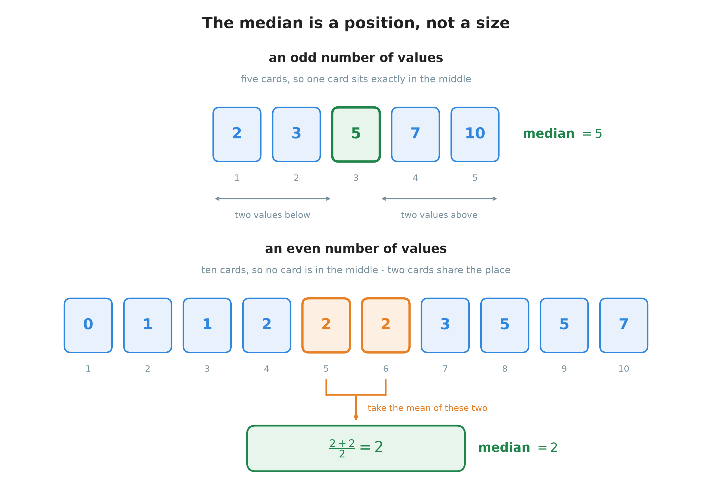
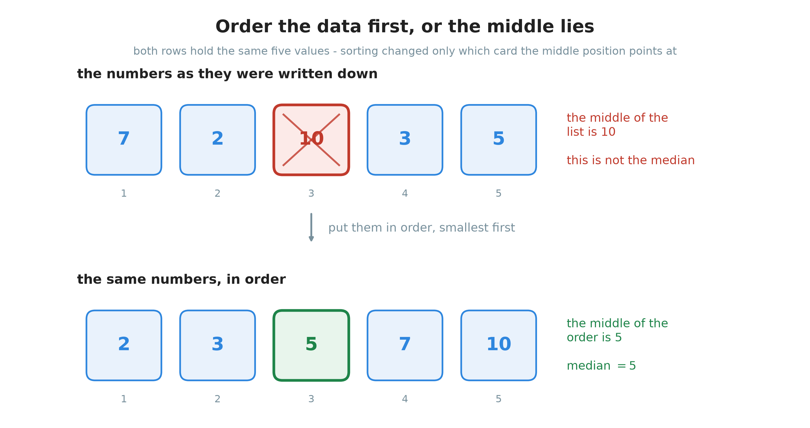
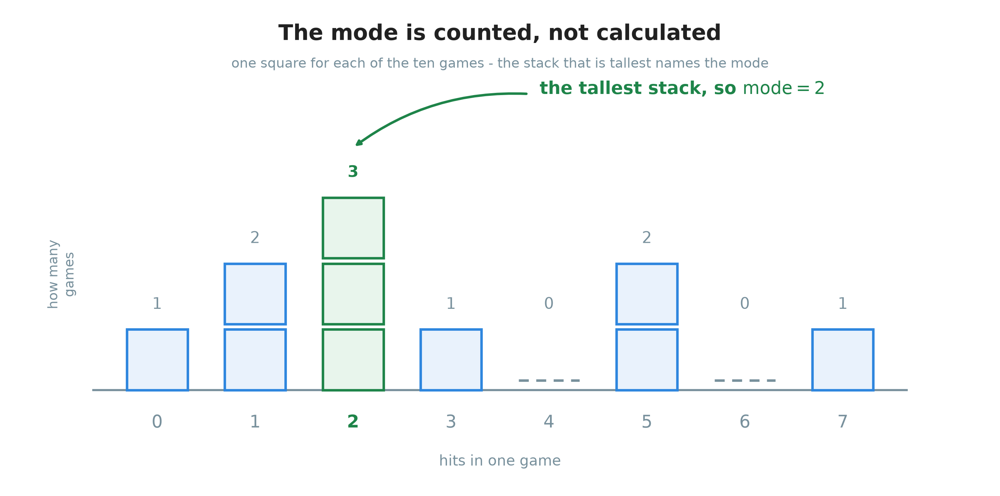
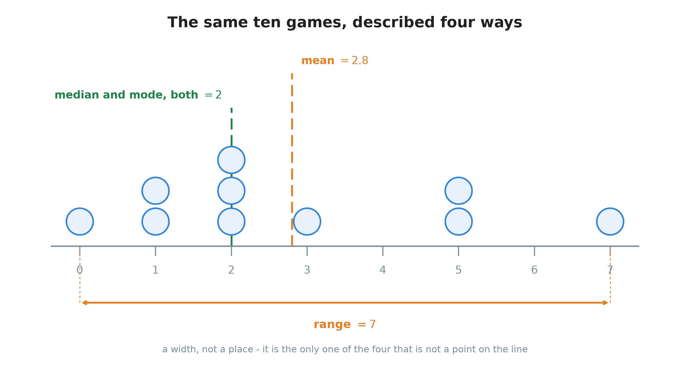
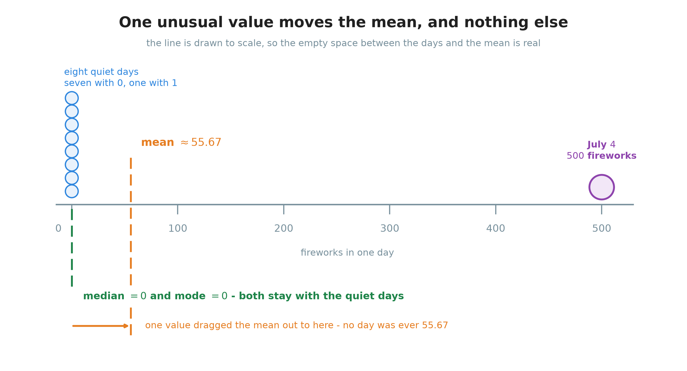
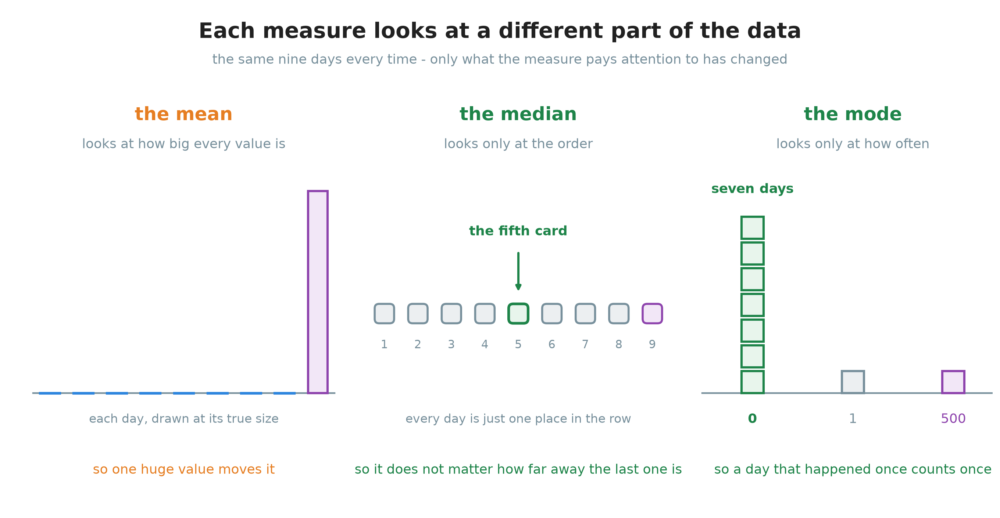

# 17. Averages and range

**What this chapter teaches**
How to describe a whole list of numbers with a few short answers: how wide the list is, and
three different ways of saying where its middle is. It also teaches why those three middles
disagree with each other, and how to choose between them.

**Before you start**
This chapter needs no new arithmetic, only arithmetic you already have. It uses sharing and
division from [Chapter 1, section 1.1](./../1_Fractions/1_Fractions.md#11-division-means-sharing-into-equal-parts),
subtraction from [Chapter 5, section 6](./../5_Adding_And_Subtracting_Large_Numbers/5_Adding_And_Subtracting_Large_Numbers.md#61-two-more-words-and-one-warning),
division that carries on past the point from
[Chapter 8, section 7](./../8_Dividing_Large_Numbers/8_Dividing_Large_Numbers.md#7-going-past-the-point-a-decimal-answer),
putting numbers in order from
[Chapter 9, section 3](./../9_Negative_Numbers/9_Negative_Numbers.md#3-which-of-two-numbers-is-bigger),
and the words *odd* and *even* from
[Chapter 12, section 1.4](./../12_Divisibility_And_Prime_Numbers/12_Divisibility_And_Prime_Numbers.md#14-even-and-odd).

---

## Table of contents

1. [Describing many numbers with a few](#1-describing-many-numbers-with-a-few)
2. [The range, or how wide the data is](#2-the-range-or-how-wide-the-data-is)
3. [The mean, or sharing the total equally](#3-the-mean-or-sharing-the-total-equally)
4. [The median, or the value in the middle](#4-the-median-or-the-value-in-the-middle)
5. [The mode, or the value that happens most](#5-the-mode-or-the-value-that-happens-most)
6. [The four measures on one data set](#6-the-four-measures-on-one-data-set)
7. [When one value is far from the rest](#7-when-one-value-is-far-from-the-rest)
8. [Choosing a measure](#8-choosing-a-measure)
9. [Glossary](#9-glossary)
10. [Check your understanding](#10-check-your-understanding)
11. [Important notes](#11-important-notes)

---

## 1. Describing many numbers with a few

### 1.1 Ten numbers, one question

You play ten games of baseball. After each game you write down how many hits you got:

$$
0, \quad 1, \quad 1, \quad 2, \quad 2, \quad 2, \quad 3, \quad 5, \quad 5, \quad 7
$$

Now a friend asks one question: **"How well do you hit?"**

You cannot answer by reading the ten numbers out loud. Ten numbers is already too many for
anyone to hold in their head. And this is a small list. A shop has thousands of sales. A
country has millions of salaries. Nobody reads those lists either.

So we do something else. We replace the whole list with a few short numbers that describe
it. That is what this chapter is about.

Four short numbers are taught here. Three of them try to say **where the middle of the data
is**. The fourth says **how spread out the data is**.

### 1.2 What a data set is

> **Definition — data set.** A **data set** is a collection of values that belong together,
> because they all measure the same thing.

The ten numbers above are a data set. They belong together because every one of them is
"hits in one game".

> **Definition — value.** One **value** is one number in the data set. The baseball data set
> has ten values.

A data set can hold the same number more than once. In the list above, the number $2$
appears three times. Those are three separate values, not one. You played three different
games, and in each of them you got $2$ hits.

> **Note.** The order in which you write a data set down does not change the data set. The
> ten games happened in some order, but for this chapter it does not matter which game came
> first. What matters is which numbers are in the list, and how many times each one appears.

### 1.3 The four measures, and the word "average"

Here are the four short numbers this chapter teaches, one line each.

| Measure | The question it answers |
| --- | --- |
| **Range** | How wide is the data — how far is it from the smallest value to the largest? |
| **Mean** | If the total were shared out equally, how much would each one get? |
| **Median** | Which value sits in the middle, when they are lined up in order? |
| **Mode** | Which value happens most often? |

The word **average** needs care, because people use it in two different ways.

In everyday English, "average" almost always means the **mean**. If somebody says "the
average price", they usually mean: add up the prices and divide.

In mathematics the word is wider. An **average** is any single value chosen to stand for a
whole data set. By that meaning the mean, the median and the mode are all averages. They are
three different answers to the same question: *where is the middle?*

> **Definition — measure of central tendency.** A **measure of central tendency** is a value
> that says where the middle of a data set is. The mean, the median and the mode are the
> three measures of central tendency in this chapter.

The range is **not** one of them. It does not say where the middle is. It says how far apart
the two ends are. That is a different kind of question, and section 2.4 shows why keeping
the two kinds apart matters.

### Summary of section 1

* A **data set** is a collection of values that all measure the same thing.
* The same number can appear several times, and each appearance is a separate value.
* We describe a long data set with a few short numbers, because nobody can read a long list.
* The **mean**, the **median** and the **mode** all try to say where the middle is. The
  **range** says how wide the data is.
* In everyday English "average" usually means the mean. In mathematics it can mean any of
  the three middles.

---

## 2. The range, or how wide the data is

### 2.1 The largest and the smallest

Before anything else, find the two ends of the data.

> **Definition — maximum and minimum.** The **maximum** is the largest value in the data
> set. The **minimum** is the smallest value in the data set.

In the baseball data:

$$
0, \quad 1, \quad 1, \quad 2, \quad 2, \quad 2, \quad 3, \quad 5, \quad 5, \quad 7
$$

the maximum is $7$ and the minimum is $0$.

### 2.2 The rule, with numbers first

The range is how far it is from one end of the data to the other. A distance along a number
line is always found by subtracting: you take away where you started from where you finished.

Look at the picture. The two orange dots are the minimum and the maximum, and the orange
arrow is the distance between them.

    

**Figure 1 — Each dot is one game. Where two or three games gave the same number of hits, the
dots are stacked on top of each other. The orange arrow starts at the smallest value and
ends at the largest, and the length of that arrow is the range.**

So for this data set:

$$
\text{range} = 7 - 0
$$

$$
\text{range} = 7
$$

### 2.3 The formula

$$
\text{range} = \text{maximum} - \text{minimum}
$$

In words: take the largest value, take away the smallest value, and what is left is the
range.

The symbols:

* $\text{maximum}$ — the largest value in the data set.
* $\text{minimum}$ — the smallest value in the data set.

The three steps, every time:

1. Find the largest value.
2. Find the smallest value.
3. Subtract the smallest from the largest.

> **Warning — subtract, never add.** The range is a distance, and a distance is a
> subtraction. In the baseball data $7 - 0 = 7$, and $7 + 0 = 7$ as well, so here adding
> happens to give the right answer. Do not learn anything from that. It worked only because
> the minimum was $0$. Take a set of test scores instead:
>
> $$
> 72, \quad 75, \quad 76, \quad 78, \quad 79, \quad 80, \quad 81, \quad 95
> $$
>
> Now $95 - 72 = 23$, which is the range. But $95 + 72 = 167$, which is not a distance
> between anything. It is bigger than every value in the data set.

### 2.4 What the range does not tell you

The range tells you one thing well: **how much room the data takes up**. A larger range means
the values are spread over a wider stretch of the number line. A range of $0$ means every
value is the same number.

But the range only ever looks at two values — the largest and the smallest. It never looks at
any value in between. So it cannot tell you where the data piles up.

Here are two data sets with the same range:

$$
0, \quad 1, \quad 1, \quad 2, \quad 2, \quad 2, \quad 3, \quad 5, \quad 5, \quad 7
$$

$$
0, \quad 0, \quad 0, \quad 0, \quad 0, \quad 7, \quad 7, \quad 7, \quad 7, \quad 7
$$

Both have a maximum of $7$ and a minimum of $0$, so both have a range of $7$. But the second
data set has nothing in the middle at all. The range cannot see that difference, because the
range never looked at the eight values between the two ends.

> **Note.** That is why the range is not a measure of central tendency. It describes the
> **spread** of the data, not its centre. Everything from here to the end of the chapter is
> about the centre.

### Summary of section 2

* The **maximum** is the largest value; the **minimum** is the smallest.
* $\text{range} = \text{maximum} - \text{minimum}$.
* The range is a distance, so it is always a subtraction, never an addition.
* A bigger range means the values are spread over a wider stretch.
* The range looks only at the two end values, so it says nothing about the middle.

---

## 3. The mean, or sharing the total equally

### 3.1 What the mean really does

The **mean** is the average most people think of. Here is what it actually is.

> **The mean is what each one would get if the total were shared out equally.**

Go back to the ten games. Altogether you got $28$ hits. They did not arrive evenly — one
game gave you $7$, another gave you none at all. But now imagine collecting all $28$ hits
into one pile and handing them back out, the same number to every game.

That is exactly the sharing of
[Chapter 1, section 1.1](./../1_Fractions/1_Fractions.md#11-division-means-sharing-into-equal-parts):
one pile, shared into equal parts. And it is why the rule has two steps. **Adding collects
the pile. Dividing shares it out.**

    

**Figure 2 — The upper row is what really happened. The lower row is the same $28$ hits
handed out again, evenly. Look at the orange line in the upper row: the pieces of the tall
bars that stick up above it are exactly the pieces the short bars are missing. Nothing was
added and nothing was thrown away — the hits were only moved around.**

### 3.2 The smallest possible example

Find the mean of these two values:

$$
1, \quad 2
$$

**Step 1 — add them.**

$$
1 + 2 = 3
$$

**Step 2 — there are $2$ values, so divide by $2$.**

$$
\frac{3}{2} = 1.5
$$

So the mean is $1.5$.

That answer makes sense. $1.5$ is exactly halfway between $1$ and $2$. If you had $3$ sweets
and two children, each child would get one and a half.

> **Note.** The line in $\frac{3}{2}$ is a division sign, as it always is
> ([Chapter 1, section 2.2](./../1_Fractions/1_Fractions.md#22-a-fraction-is-a-division)).
> Writing $3 \div 2$ would mean the same thing.

### 3.3 The baseball mean, step by step

Now the ten games:

$$
0, \quad 1, \quad 1, \quad 2, \quad 2, \quad 2, \quad 3, \quad 5, \quad 5, \quad 7
$$

**Step 1 — add every value.** Take them one at a time and keep a running total:

$$
0 + 1 = 1
$$

$$
1 + 1 = 2
$$

$$
2 + 2 = 4
$$

$$
4 + 2 = 6
$$

$$
6 + 2 = 8
$$

$$
8 + 3 = 11
$$

$$
11 + 5 = 16
$$

$$
16 + 5 = 21
$$

$$
21 + 7 = 28
$$

The total is $28$.

**Step 2 — count the values.** There are $10$ of them, one per game.

**Step 3 — divide.**

$$
\frac{28}{10} = 2.8
$$

So the mean is $2.8$ hits per game.

> **Note.** $28 \div 10$ does not come out as a whole number, so the answer carries on past
> the decimal point
> ([Chapter 8, section 7](./../8_Dividing_Large_Numbers/8_Dividing_Large_Numbers.md#7-going-past-the-point-a-decimal-answer)).
> That is normal for a mean, and section 3.5 says why.

**The check.** A mean can always be checked by sharing the answer back out. If every game had
given $2.8$ hits, the ten games together would have given

$$
2.8 \times 10 = 28
$$

hits — and $28$ is the total we started from. The check works because multiplication is
repeated addition
([Chapter 6, section 1.1](./../6_The_Distributive_Property/6_The_Distributive_Property.md#11-multiplication-is-repeated-addition)):
ten equal shares of $2.8$ added together must rebuild the pile.

### 3.4 The formula

When a data set has many values, we cannot keep writing them all out. So we give them names.
Call the first value $x_{1}$, the second $x_{2}$, and so on, up to the last one $x_{n}$.

$$
\bar{x} = \frac{x_{1} + x_{2} + \cdots + x_{n}}{n}
$$

In words: add every value together, then divide by how many values there were.

The symbols:

* $n$ — how many values are in the data set.
* $x_{1}$ — the first value, $x_{2}$ the second value, and so on.
* $x_{n}$ — the last value. The small number below is the **position** in the list, not a
  multiplication and not a power. Chapter 12 used the same idea when it wrote the primes of a
  number as $p_{1}$, $p_{2}$ and so on.
* $\cdots$ — three dots meaning "carry on in the same way". They stand for all the values
  between $x_{2}$ and $x_{n}$, which we did not want to write out.
* $\bar{x}$ — the mean. It is read "x bar". The small bar drawn over the letter is what makes
  it the mean: the letter $x$ on its own is just a value, and $\bar{x}$ is the average of all
  of them.

For the baseball data, $n = 10$, the top of the fraction adds up to $28$, and $\bar{x} = 2.8$.

### 3.5 The mean does not have to be one of the values

$2.8$ is a strange-looking answer. You cannot get $2.8$ hits in a game. You get $0$ hits, or
$1$, or $2$ — never a piece of one.

That is fine. **The mean is not a value from the data set. It is a description of the data
set.** It answers "what would each one get if we shared the total equally?", and that share
can easily land between two whole numbers. The mean of $1$ and $2$ was $1.5$, and neither $1$
nor $2$ is $1.5$.

So two things are completely normal:

* The mean can be a number that appears nowhere in the data set.
* The mean can have a decimal point even when every value is a whole number.

> **Warning.** Do not "fix" a mean by rounding it to a value that is in the data set. Writing
> $3$ instead of $2.8$ throws away the answer you just worked out. If you do need to round —
> because $\frac{501}{9}$ never stops, say — round only at the very end, and use the rule
> from [Chapter 4, section 6.3](./../4_Converting_Between_Forms/4_Converting_Between_Forms.md#63-rounding-to-the-nearest-cent).

### 3.6 The two ways people get the mean wrong

**Mistake 1 — adding but forgetting to divide.** Take the data set $2$, $4$, $6$. The total is

$$
2 + 4 + 6 = 12
$$

but $12$ is not the mean. It is not even close: it is bigger than every value in the set.
There are three values, so:

$$
\frac{12}{3} = 4
$$

The mean is $4$. A total is not an average until it has been shared out.

**Mistake 2 — dividing by the wrong number.** Take the data set $2$, $4$, $6$, $8$. You must
divide by **how many values there are**, which is $4$:

$$
\bar{x} = \frac{2 + 4 + 6 + 8}{4} = \frac{20}{4} = 5
$$

Not by the largest value, and not by the last value. Both of those happen to be $8$ here, and
$\frac{20}{8} = 2.5$, which is wrong.

> **Note — a free check.** The mean must always land between the minimum and the maximum. It
> cannot be smaller than the smallest value, and it cannot be bigger than the largest one:
> an equal share of the pile cannot be less than the smallest amount anybody already had, nor
> more than the largest. For the baseball data the mean must lie between $0$ and $7$, and
> $2.8$ does. Both mistakes above break this check straight away.

### Summary of section 3

* The **mean** is what each one would get if the total were shared out equally.
* Add every value, then divide by how many values there are.
* $\bar{x} = \frac{x_{1} + x_{2} + \cdots + x_{n}}{n}$, where $n$ is how many values there are.
* The mean does not have to be a value from the data set, and often is not.
* Check it: the mean always lies between the minimum and the maximum.

---

## 4. The median, or the value in the middle

The mean had to do arithmetic with every value. The **median** does almost no arithmetic at
all. It just lines the values up and points at the one in the middle.

> **Definition — median.** The **median** is the value in the middle of the data set, once
> the values have been put in order from smallest to largest.

Two words in that definition are doing real work. *In order* is section 4.4. *The middle*
depends on whether there is an odd or an even number of values, and that is sections 4.1 and
4.2.

### 4.1 An odd number of values

If the number of values is **odd**
([Chapter 12, section 1.4](./../12_Divisibility_And_Prime_Numbers/12_Divisibility_And_Prime_Numbers.md#14-even-and-odd)),
there is exactly one value in the middle, and that value is the median.

Start with three values:

$$
1, \quad 4, \quad 8
$$

They are already in order. One value sits to the left of $4$ and one sits to the right of it,
so $4$ is in the middle. The median is $4$.

Now five values:

$$
2, \quad 3, \quad 5, \quad 7, \quad 10
$$

The third value is $5$. Two values sit below it and two sit above it, so it is the middle
one. The median is $5$.

    

**Figure 3 — In the upper row the middle card is green: it is the median. Look at the two
grey arrows under it — the same number of cards lies on each side. In the lower row no single
card can do that, so two cards share the middle place.**

### 4.2 An even number of values

If the number of values is **even**, no single value is in the middle. Two of them share the
place. When that happens, **take the mean of those two middle values**.

Here is the baseball data, in order:

$$
0, \quad 1, \quad 1, \quad 2, \quad \mathbf{2}, \quad \mathbf{2}, \quad 3, \quad 5, \quad 5, \quad 7
$$

There are ten values, so the two middle ones are the fifth and the sixth. Both of them are
$2$. Take their mean, using section 3:

$$
\frac{2 + 2}{2} = \frac{4}{2} = 2
$$

The median is $2$.

**What if the two middle values are different?** Then the median lands between them. Suppose
the two middle values had been $2$ and $3$:

$$
\frac{2 + 3}{2} = \frac{5}{2} = 2.5
$$

The median would be $2.5$.

So the rule for an even number of values is:

$$
\text{median} = \frac{\text{first middle value} + \text{second middle value}}{2}
$$

In words: add the two middle values together and divide by two.

> **Note.** This is why the median, like the mean, does not have to be a value from the data
> set. With an even count it often is not.

### 4.3 Which position is the middle

With five or ten values you can find the middle by counting inwards from both ends. With
$81$ values that becomes slow and easy to get wrong. So it is worth knowing which **position**
to go to directly.

Write $n$ for how many values there are.

**When $n$ is odd,** the middle position is

$$
\frac{n + 1}{2}
$$

Check it on the five values $2, 3, 5, 7, 10$: here $n = 5$, so

$$
\frac{5 + 1}{2} = \frac{6}{2} = 3
$$

Position $3$ holds the value $5$, and $5$ is the median. Correct.

**When $n$ is even,** the two middle positions are

$$
\frac{n}{2} \qquad \text{and} \qquad \frac{n}{2} + 1
$$

Check it on the ten baseball values: here $n = 10$, so

$$
\frac{10}{2} = 5 \qquad \text{and} \qquad 5 + 1 = 6
$$

Positions $5$ and $6$, which is exactly the pair we used in section 4.2. Correct.

> **Warning — a position is not a value.** $\frac{n+1}{2}$ tells you **where to look**, not
> what you will find. For the five values above the answer was $3$, meaning "the third card".
> The median is the number written on that card, which was $5$. Mixing these two up is the
> commonest slip in this section.

### 4.4 Order the data first

Everything above assumed the values were already lined up smallest to largest. If they are
not, you must put them in order before you look for a middle. This is not a tidying habit; it
changes the answer.

Take these five numbers, written in the order they happened:

$$
7, \quad 2, \quad 10, \quad 3, \quad 5
$$

The third number in that list is $10$. But $10$ is the largest value in the whole set — it
cannot possibly be in the middle of anything. It is only sitting in the middle of the *page*.

Put the values in order first:

$$
2, \quad 3, \quad 5, \quad 7, \quad 10
$$

Now the third value is $5$, and the median is $5$.

    

**Figure 4 — Both rows hold the same five numbers. Sorting did not change the data at all. It
changed which card the middle position points at, and that is the whole reason the rule says
"order first".**

> **Warning.** Sorting matters even when it looks as if it will not. Take
> $0$, $0$, $1$, $0$, $2$, $0$, $100$. Somebody in a hurry might say "seven values, so the
> fourth one is the median", read off the fourth number as written, and get $0$. The answer
> $0$ happens to be right — but the method was wrong, and it was right by luck. In order the
> data is $0, 0, 0, 0, 1, 2, 100$, and the fourth value there is a different $0$. Change the
> $100$ to sit somewhere else in the list and the shortcut gives the wrong number. Always
> sort.

### Summary of section 4

* The **median** is the middle value of the data, **after** the data has been put in order.
* With an odd number of values there is one middle value, at position $\frac{n+1}{2}$.
* With an even number of values, take the mean of the two middle values, at positions
  $\frac{n}{2}$ and $\frac{n}{2} + 1$.
* A position tells you where to look; the median is the value you find there.
* Sorting first is part of the method, not a tidying step.

---

## 5. The mode, or the value that happens most

### 5.1 Counting how often

> **Definition — mode.** The **mode** is the value that appears most often in the data set.

The mean was worked out. The median was found by position. The mode is neither: it is simply
**counted**.

> **Definition — frequency.** The **frequency** of a value is how many times that value
> appears in the data set.

Take the baseball data again and count each value:

$$
0, \quad 1, \quad 1, \quad 2, \quad 2, \quad 2, \quad 3, \quad 5, \quad 5, \quad 7
$$

| Value | Frequency |
| ---: | ---: |
| $0$ | $1$ |
| $1$ | $2$ |
| $2$ | $3$ |
| $3$ | $1$ |
| $5$ | $2$ |
| $7$ | $1$ |

The frequencies add up to $10$, which is how many games there were. That is a useful check:
if your frequencies do not add up to the number of values, you have miscounted.

The value $2$ has a frequency of $3$, and no other value comes close. So the mode is $2$.

    

**Figure 5 — One square for one game. The height of a stack is that value's frequency, so the
mode is simply the tallest stack. The values $4$ and $6$ keep their place on the axis with a
dash, because "it never happened" is different from "it cannot happen".**

### 5.2 The mode is not the largest value

This is worth saying plainly, because the two get confused.

The mode is the value that happens **most often**. It has nothing to do with the value that is
**biggest**.

Take:

$$
1, \quad 2, \quad 2, \quad 3, \quad 10
$$

The largest value is $10$. The mode is $2$, because $2$ appears twice and everything else
appears once. $10$ appears once, like most of the others, so being large earns it nothing.

> **Warning.** "Most" in "the value that appears most often" counts appearances, not size.
> When you look for the mode you are counting, never comparing.

### 5.3 When there is no mode

Sometimes every value appears the same number of times. Then no value happens more often than
the others, and **there is no mode**.

Here are eight test scores:

$$
72, \quad 75, \quad 76, \quad 78, \quad 79, \quad 80, \quad 81, \quad 95
$$

Every one of them appears exactly once. There is no tallest stack, so this data set has no
mode.

> **Note.** "No mode" is a complete and correct answer. It is not the same as a mode of $0$.
> A mode of $0$ would mean the value $0$ was the most common one, and $0$ does not appear in
> this data set at all.

### 5.4 The mode works on words too

The mean and the median both need numbers. You cannot add up colours, and you cannot put
flavours in order from smallest to largest.

The mode can be found for anything you can count. Ask six people for their favourite colour:

$$
\text{blue}, \quad \text{red}, \quad \text{blue}, \quad \text{green}, \quad \text{blue}, \quad \text{red}
$$

Count them: blue three times, red twice, green once. The mode is **blue**.

There is no mean colour and no median colour. Those questions have no answer. But "which
colour came up most?" always has one, and that makes the mode the only average that works
here.

### Summary of section 5

* The **frequency** of a value is how many times it appears.
* The **mode** is the value with the highest frequency — the tallest stack.
* Check your counting: the frequencies must add up to the number of values.
* The mode is about how often, never about how big.
* If every value appears the same number of times, there is **no mode**.
* The mode is the only one of the three that works on things that are not numbers.

---

## 6. The four measures on one data set

### 6.1 All four at once

Everything so far has been worked out on the same ten games:

$$
0, \quad 1, \quad 1, \quad 2, \quad 2, \quad 2, \quad 3, \quad 5, \quad 5, \quad 7
$$

**Range.** Largest minus smallest:

$$
7 - 0 = 7
$$

**Mean.** Total divided by how many:

$$
\frac{28}{10} = 2.8
$$

**Median.** Ten values, so the mean of the fifth and sixth:

$$
\frac{2 + 2}{2} = 2
$$

**Mode.** The most frequent value, which appeared three times:

$$
\text{mode} = 2
$$

    

**Figure 6 — The three middles are drawn as lines through the data, because each of them is a
place on the number line. The range is drawn as an arrow, because it is a width and not a
place. Notice how close the three middles are to each other here. Section 7 shows what pulls
them apart.**

### 6.2 The summary table

| Measure | Value | What it means here |
| --- | ---: | --- |
| Range | $7$ | The best game and the worst game were $7$ hits apart. |
| Mean | $2.8$ | Sharing the $28$ hits over ten games gives $2.8$ each. |
| Median | $2$ | Half the games were at or below $2$ hits, half at or above. |
| Mode | $2$ | More games gave $2$ hits than gave any other number. |

Read that table again and notice something: **all four numbers are true at the same time**.
They do not disagree, and none of them is more correct than the others. They answer four
different questions about one data set.

Here the median and the mode came out the same, and the mean came out close to both. That
happens when the data has no unusual values in it. It is not a rule, and section 7 is what
happens when it fails.

### Summary of section 6

* The four measures describe one data set from four directions, and all of them are true.
* For the baseball data: range $7$, mean $2.8$, median $2$, mode $2$.
* The three middles are places on the number line; the range is a width.
* When the data holds nothing unusual, the three middles land close together.

---

## 7. When one value is far from the rest

### 7.1 The fireworks

A town counts how many fireworks go off each day. Most days the answer is $0$. On July $4$
there are hundreds.

Here are nine days of counts, written in the order they happened:

$$
0, \quad 0, \quad 0, \quad 0, \quad 1, \quad 0, \quad 0, \quad 0, \quad 500
$$

Eight quiet days, and one day that is nothing like the others.

Now work out all three middles, and watch them disagree.

### 7.2 The mean

**Step 1 — add the values.** Seven of them are $0$ and add nothing, so the total is

$$
0 + 1 + 500 = 501
$$

**Step 2 — divide by how many values there are,** which is $9$:

$$
\frac{501}{9} = 55.666\ldots
$$

This division never stops — the $6$ repeats for ever
([Chapter 4, section 2.4](./../4_Converting_Between_Forms/4_Converting_Between_Forms.md#24-when-the-division-never-stops)).
Rounded to two decimal places:

$$
\bar{x} \approx 55.67
$$

> **Note — the symbol $\approx$.** It means "is approximately equal to". Use it instead of
> $=$ whenever you have rounded, because $55.67$ is not exactly $\frac{501}{9}$. The book has
> used this symbol before; this is the first chapter that needs it often.

Now ask the honest question. **Does $55.67$ describe a typical day in this town?**

No. On eight of the nine days there were no fireworks at all. Not one day came anywhere near
$55$. The mean is a true number — the total really would share out at about $55.67$ a day —
but as a description of a normal day it is badly wrong.

### 7.3 The median and the mode

**The median.** Put the nine values in order first:

$$
0, \quad 0, \quad 0, \quad 0, \quad \mathbf{0}, \quad 0, \quad 0, \quad 1, \quad 500
$$

Nine values is odd, so there is one middle position:

$$
\frac{9 + 1}{2} = 5
$$

The fifth value is $0$. The median is $0$.

**The mode.** Count the frequencies: $0$ appears seven times, $1$ appears once, $500$ appears
once. The tallest stack is $0$, so the mode is $0$.

Both of them say the same thing: a normal day in this town has no fireworks. That is a good
description, and it is the description the mean failed to give.

    

**Figure 7 — The line is drawn to scale, so the big empty gap is real. The eight quiet days
are squeezed against the left edge and the median and the mode stay there with them. The mean
has been dragged out into the middle of nowhere, to a number that no day ever was.**

### 7.4 Why they behave differently

It would be easy to learn "the mean is affected by big values, the median is not" as a fact to
remember. It is much better to see why, because then you never need to remember it.

**Each measure only looks at part of the data. A measure can only be moved by the part it
looks at.**

    

**Figure 8 — The same nine days, three times. Only what the measure pays attention to has
changed. Compare the first panel with the second: in the first, one day fills the whole
picture; in the second, that same day is just the card on the end.**

* **The mean looks at the size of every value.** It has to, because every value goes into the
  addition. A value of $500$ contributes $500$ to the total, and that is $500$ more than a
  quiet day contributes. So the mean moves a long way.
* **The median looks only at the order.** It asks which value is in the middle position, and
  nothing else. Change the $500$ to $5000$ and the median does not move at all — $5000$ is
  still the last value, so the middle position still points at the same card.
* **The mode looks only at the frequencies.** The $500$ happened once. One is not many, so it
  cannot be the tallest stack. It would have to happen more often than $0$ does before the
  mode noticed it at all.

So the three measures are not being stubborn or clever. They simply cannot see the same
things.

### 7.5 What to call a value like that

> **Definition — outlier.** An **outlier** is a value that sits far away from the rest of the
> data. The $500$ is an outlier.

An outlier is not a mistake. Nobody wrote the number down wrongly. There really were $500$
fireworks on July $4$. The value is correct — it is just unusual, and unusual values are
exactly what the mean is sensitive to.

> **Warning.** Never delete an outlier just because it spoils a neat answer. It is real data.
> If it makes the mean a poor description, the right response is to report the median as well,
> not to hide the value.

### Summary of section 7

* An **outlier** is a value far away from all the others. It is unusual, not wrong.
* One large outlier pulls the mean a long way towards itself.
* The median and the mode barely move, because neither of them looks at how big a value is.
* The mean looks at sizes, the median looks at order, the mode looks at frequencies.
* A measure can only be moved by the part of the data it looks at.

---

## 8. Choosing a measure

Section 7 showed that the three middles can disagree. So which one should you report? It
depends on the question you are actually asking.

### 8.1 When the mean is a good description

Use the mean when you want the true mathematical average of everything, and the data holds no
outlier to drag it away.

$$
10, \quad 11, \quad 12, \quad 13, \quad 14
$$

These five values sit close together. Nothing is far from anything else. The mean is

$$
\frac{10 + 11 + 12 + 13 + 14}{5} = \frac{60}{5} = 12
$$

and $12$ describes this data set very well. The median is also $12$, which is a good sign:
when the mean and the median agree, there is usually no outlier pulling things about.

The mean is also the right choice whenever the **total** is what really matters — money
collected, distance travelled, hits over a season. The mean is the only one of the three
that remembers the total, because the mean is the only one built from it.

### 8.2 When the median is a better description

Use the median when the data contains outliers, or when you want to describe a **typical**
one rather than an equal share.

The usual real example is income. In most countries a small number of people earn enormous
amounts. Those values are genuine, and they pull the mean upwards, exactly as the $500$ did
in section 7. The mean income can end up above what almost everybody actually earns.

The median income does not do that. It is the amount where half the people earn less and half
earn more. However large the largest incomes are, the middle person stays the middle person.
That is why "the median income" is the number normally reported.

### 8.3 When the mode is the right question

Use the mode when you want to know which value comes up most often, rather than where the
middle is.

A shoe shop does not care about the mean shoe size, and it is not helped much by the median
either. It cares which size sells most, because that is the size to order more of. That is
the mode.

And as section 5.4 showed, the mode is the **only** one of the three that works when the data
is not numbers at all. Favourite colours, most common answer, most popular day — all of these
have a mode and none of them has a mean.

### 8.4 Four measures, four questions

| Measure | What it tells you | How you get it | Weak when |
| --- | --- | --- | --- |
| **Range** | How wide the data is | Largest minus smallest | You want to know about the middle |
| **Mean** | The equal share of the total | Add all, divide by how many | The data holds an outlier |
| **Median** | The typical one, by position | Sort, then take the middle | You need the total to be respected |
| **Mode** | The most common one | Count how often each value appears | Every value appears once |

> **Note.** There is no measure that is always best, and the four are not in competition.
> Reporting more than one is usually the most honest thing to do. "The mean is $55.67$ but the
> median is $0$" tells you far more about that town than either number alone: it says there
> was one enormous day, and that every other day was quiet.

### Summary of section 8

* Use the **mean** when the values are close together, or when the total matters.
* Use the **median** when there are outliers, or when you want a typical one.
* Use the **mode** when you want the most common one, or when the data is not numbers.
* The range answers a different question from all three: how spread out, not where the middle.
* No measure is always best. Reporting two of them often says more than reporting one.

---

## 9. Glossary

**Data set.** A collection of values that belong together because they all measure the same
thing (section 1.2).

**Value.** One number in a data set. The same number can appear as several separate values
(section 1.2).

**Average.** Any single value chosen to stand for a whole data set. In everyday English it
usually means the mean; in mathematics the median and the mode are averages too (section 1.3).

**Measure of central tendency.** A value that says where the middle of a data set is. The
mean, the median and the mode are the three (section 1.3).

**Spread.** How widely the values are scattered, as opposed to where their middle is. The
range measures spread (section 2.4).

**Maximum.** The largest value in a data set (section 2.1).

**Minimum.** The smallest value in a data set (section 2.1).

**Range.** The distance from the minimum to the maximum:
$\text{range} = \text{maximum} - \text{minimum}$ (section 2.3).

**Mean.** What each one would get if the total were shared out equally. Add every value and
divide by how many there are (section 3.1).

**Median.** The value in the middle position once the data has been sorted. With an even
number of values, the mean of the two middle ones (section 4).

**Mode.** The value that appears most often (section 5.1).

**Frequency.** How many times a particular value appears in a data set (section 5.1).

**Outlier.** A value that sits far away from all the others. Unusual, not wrong (section 7.5).

> **Note — everything else in this chapter was defined earlier, and is only linked here.**
> **Division as sharing** is
> [Chapter 1, section 1.1](./../1_Fractions/1_Fractions.md#11-division-means-sharing-into-equal-parts),
> and **dividend, divisor and quotient** are
> [Chapter 1, section 1.2](./../1_Fractions/1_Fractions.md#12-the-three-names).
> **The fraction bar as a division sign** is
> [Chapter 1, section 2.2](./../1_Fractions/1_Fractions.md#22-a-fraction-is-a-division).
> **Difference** is
> [Chapter 5, section 6.1](./../5_Adding_And_Subtracting_Large_Numbers/5_Adding_And_Subtracting_Large_Numbers.md#61-two-more-words-and-one-warning).
> **Repeating decimals** are
> [Chapter 4, section 2.4](./../4_Converting_Between_Forms/4_Converting_Between_Forms.md#24-when-the-division-never-stops)
> and **rounding** is
> [Chapter 4, section 6.3](./../4_Converting_Between_Forms/4_Converting_Between_Forms.md#63-rounding-to-the-nearest-cent).
> **Odd and even** are
> [Chapter 12, section 1.4](./../12_Divisibility_And_Prime_Numbers/12_Divisibility_And_Prime_Numbers.md#14-even-and-odd).

---

## 10. Check your understanding

**Question 1.** Find the range, the mean, the median and the mode of

$$
2, \quad 3, \quad 3, \quad 4, \quad 5
$$

Answer

The data is already in order, which makes the median easy.

**Range.** The maximum is $5$ and the minimum is $2$:

$$
5 - 2 = 3
$$

**Mean.** Add them:

$$
2 + 3 = 5
$$

$$
5 + 3 = 8
$$

$$
8 + 4 = 12
$$

$$
12 + 5 = 17
$$

There are $5$ values:

$$
\bar{x} = \frac{17}{5} = 3.4
$$

The check: $3.4$ lies between $2$ and $5$. Good.

**Median.** Here $n = 5$, which is odd, so the middle position is $\frac{5+1}{2} = 3$. The
third value is $3$, so the median is $3$.

**Mode.** The value $3$ appears twice; every other value appears once. The mode is $3$.

**Question 2.** Find the mean of

$$
6, \quad 8, \quad 10
$$

Answer

$$
6 + 8 = 14
$$

$$
14 + 10 = 24
$$

There are $3$ values:

$$
\bar{x} = \frac{24}{3} = 8
$$

The mean is $8$.

**Question 3.** Find the median of

$$
1, \quad 4, \quad 7, \quad 9, \quad 12
$$

Answer

The values are already in order. There are $5$ of them, and $5$ is odd, so the middle
position is

$$
\frac{5 + 1}{2} = 3
$$

The third value is $7$. The median is $7$.

Notice that no adding and no dividing was needed. The median only asks where to look.

**Question 4.** Find the range, the mean, the median and the mode of

$$
1, \quad 2, \quad 2, \quad 4, \quad 5, \quad 6, \quad 6, \quad 6
$$

Answer

**Range.**

$$
6 - 1 = 5
$$

**Mean.** Add them:

$$
1 + 2 = 3
$$

$$
3 + 2 = 5
$$

$$
5 + 4 = 9
$$

$$
9 + 5 = 14
$$

$$
14 + 6 = 20
$$

$$
20 + 6 = 26
$$

$$
26 + 6 = 32
$$

There are $8$ values:

$$
\bar{x} = \frac{32}{8} = 4
$$

**Median.** Here $n = 8$, which is even, so two values share the middle. The positions are
$\frac{8}{2} = 4$ and $4 + 1 = 5$. The fourth value is $4$ and the fifth is $5$:

$$
\frac{4 + 5}{2} = \frac{9}{2} = 4.5
$$

The median is $4.5$ — a number that is not in the data set, which is perfectly normal for an
even count.

**Mode.** The value $6$ appears three times, more than any other. The mode is $6$.

**Question 5.** Find the median of

$$
3, \quad 8, \quad 1, \quad 9, \quad 4, \quad 7
$$

Answer

This data is **not** in order, so sort it first:

$$
1, \quad 3, \quad 4, \quad 7, \quad 8, \quad 9
$$

There are $6$ values, and $6$ is even, so the middle positions are $\frac{6}{2} = 3$ and
$3 + 1 = 4$. The third value is $4$ and the fourth is $7$:

$$
\frac{4 + 7}{2} = \frac{11}{2} = 5.5
$$

The median is $5.5$.

If you had skipped the sorting and taken positions $3$ and $4$ of the original list, you
would have used $1$ and $9$ and got $5$ — a different, wrong answer.

**Question 6.** A student has these eight test scores:

$$
72, \quad 75, \quad 76, \quad 78, \quad 79, \quad 80, \quad 81, \quad 95
$$

Find the range, the mean, the median and the mode. Then say which measure describes the
student better, if the $95$ was a one-off.

Answer

**Range.**

$$
95 - 72 = 23
$$

**Mean.** Add them with a running total:

$$
72 + 75 = 147
$$

$$
147 + 76 = 223
$$

$$
223 + 78 = 301
$$

$$
301 + 79 = 380
$$

$$
380 + 80 = 460
$$

$$
460 + 81 = 541
$$

$$
541 + 95 = 636
$$

There are $8$ values:

$$
\bar{x} = \frac{636}{8} = 79.5
$$

**Median.** Here $n = 8$, so the middle positions are $4$ and $5$, holding $78$ and $79$:

$$
\frac{78 + 79}{2} = \frac{157}{2} = 78.5
$$

**Mode.** Every score appears exactly once, so there is **no mode**.

**Which one describes the student better?** The $95$ is an outlier: the other seven scores sit
between $72$ and $81$, and $95$ is well above all of them. It pulls the mean up. The median
is $78.5$, which sits right among the ordinary scores, while the mean is $79.5$ — a whole
point higher, because of one test.

So if the $95$ really was unusual, the **median** is the better description of how this
student normally does. If instead the student is improving and $95$ is the shape of things to
come, neither number is the interesting one — the trend is.

**Question 7.** Find the mean, the median and the mode of

$$
0, \quad 0, \quad 1, \quad 0, \quad 2, \quad 0, \quad 100
$$

Then say what the $100$ does to each of them.

Answer

**Mean.** Add them — the four zeros add nothing:

$$
1 + 2 = 3
$$

$$
3 + 100 = 103
$$

There are $7$ values:

$$
\bar{x} = \frac{103}{7} = 14.7142\ldots \approx 14.71
$$

**Median.** Sort first. The data as written is **not** in order:

$$
0, \quad 0, \quad 0, \quad \mathbf{0}, \quad 1, \quad 2, \quad 100
$$

There are $7$ values, and $7$ is odd, so the middle position is $\frac{7+1}{2} = 4$. The
fourth value is $0$, so the median is $0$.

**Mode.** The value $0$ appears four times, more than any other. The mode is $0$.

**What the $100$ does.** It drags the mean up to about $14.71$, which is larger than six of
the seven values. It does nothing at all to the median, because sorted or not, $100$ is the
last value and the middle position still lands on a $0$. It does nothing to the mode either,
because it happened only once.

**Question 8.** A data set has a range of $0$. What can you say about its values, its mean,
its median and its mode?

Answer

A range of $0$ means $\text{maximum} - \text{minimum} = 0$, so the largest and the smallest
value are the same number. If the largest and smallest are equal then every value in between
must be that number too. So **all the values are identical**.

Call that number $v$. Then:

* the mean is $v$, because sharing out $n$ copies of $v$ between $n$ of them gives $v$ each;
* the median is $v$, because whichever position you point at, you find $v$;
* the mode is $v$, because $v$ is the only value there is.

All three middles agree, which makes sense: with no spread at all, there is nothing for them
to disagree about.

**Question 9.** Two students each find the median of

$$
8, \quad 2, \quad 5, \quad 1, \quad 4
$$

Ana sorts the numbers and takes the middle one. Ben says "five values, so it is the third
one", and reads the third number straight from the list. Who is right, and what does the other
one get?

Answer

Ana is right. Sorted, the data is

$$
1, \quad 2, \quad 4, \quad 5, \quad 8
$$

and the third value is $4$. The median is $4$.

Ben reads the third number of the original list, which is $5$, and gets the wrong answer.

Ben's mistake is not the position — $\frac{5+1}{2} = 3$ is correct, and Ana used the same
position. His mistake is applying it before sorting. The position rule and the sorting rule
are one method, not two, and the sorting comes first.

**Question 10.** A small company has ten workers. Nine of them earn $20\,000$ a year and the
owner earns $920\,000$. Work out the mean and the median salary. Which number would you use
in an advertisement for a job there, and which one is honest?

Answer

**Mean.** The nine workers together earn

$$
9 \times 20\,000 = 180\,000
$$

and with the owner the total is

$$
180\,000 + 920\,000 = 1\,100\,000
$$

There are $10$ people:

$$
\bar{x} = \frac{1\,100\,000}{10} = 110\,000
$$

**Median.** Sorted, the first nine values are all $20\,000$ and the tenth is $920\,000$.
There are $10$ values, so the middle positions are $5$ and $6$. Both hold $20\,000$:

$$
\frac{20\,000 + 20\,000}{2} = 20\,000
$$

The median is $20\,000$.

**Which one is honest?** An advertisement would love the mean: "average salary $110\,000$".
It is a true calculation, and it is deeply misleading — nobody in the company earns anything
near it. Nine of the ten earn $20\,000$.

The median, $20\,000$, is what a new worker would actually get. This is the income example of
section 8.2 in miniature, and it is why the median is the number usually reported for pay.

---

## 11. Important notes

**The mistakes people actually make.**

* **Adding the maximum and the minimum instead of subtracting.** The range is a distance. If
  the minimum is $0$ the mistake hides, because adding $0$ and subtracting $0$ give the same
  answer. Test yourself on data that does not start at $0$.
* **Forgetting to divide when finding the mean.** A total is not an average. The check in
  section 3.6 catches this instantly: a mean can never be larger than the largest value, and
  a forgotten division almost always is.
* **Dividing by the wrong number.** The mean divides by **how many values there are**, not by
  the largest value and not by the last one.
* **Looking for the median before sorting.** This is the commonest error in the whole chapter,
  and the most dangerous, because sometimes it gives the right answer by accident — as it does
  for $0, 0, 1, 0, 2, 0, 100$. An accident is not a method.
* **Confusing the position with the value.** $\frac{n+1}{2}$ says which card to turn over. The
  median is the number written on it.
* **Choosing the largest value as the mode.** The mode counts appearances. A huge number that
  happens once is not the mode of anything.
* **Answering "the mode is $0$" when there is no mode.** Those are different statements. No
  mode means no value stood out. A mode of $0$ means the value $0$ was the commonest.
* **Expecting the mean to be one of the values.** $2.8$ hits is not a possible score in a game,
  and it is still the correct mean.

**The three ideas to keep.**

* **The mean is an equal share.** That one sentence generates the whole rule: adding collects
  the pile, dividing hands it out. It also explains why the mean must sit between the minimum
  and the maximum, why $2.8$ can be an answer when no game gave $2.8$ hits, and why the mean
  is the only middle that remembers the total.
* **The median is a position, and the mode is a count.** Neither of them ever asks how big a
  value is. That single fact is the whole of section 7: an outlier is enormous, and being
  enormous is precisely the property those two measures cannot see.
* **Nothing here is a competition.** The range, the mean, the median and the mode are four
  true answers to four different questions. Choosing between them is choosing a question, not
  choosing who is right. When two of them disagree loudly — mean $55.67$, median $0$ — the
  disagreement is itself the most informative thing you have found.

**How this chapter connects to the rest of the book.**
This is the first chapter about **data** rather than about numbers on their own, and it is
built almost entirely from tools the earlier chapters already supplied.
[Chapter 1](./../1_Fractions/1_Fractions.md) gave division as equal sharing, which is not just
how you calculate a mean — it is what a mean *is*. It also gave the fraction bar as a division
sign, which is why $\frac{28}{10}$ and $\frac{2+2}{2}$ can be written that way at all.
[Chapter 5](./../5_Adding_And_Subtracting_Large_Numbers/5_Adding_And_Subtracting_Large_Numbers.md)
gave the addition and the subtraction. [Chapter 8](./../8_Dividing_Large_Numbers/8_Dividing_Large_Numbers.md)
and [Chapter 4](./../4_Converting_Between_Forms/4_Converting_Between_Forms.md) gave divisions
that run past the decimal point, which is why $\frac{28}{10} = 2.8$ and
$\frac{501}{9} \approx 55.67$ are answers and not problems.
[Chapter 9](./../9_Negative_Numbers/9_Negative_Numbers.md) gave the number line and the rule
for which of two numbers is bigger, which is what sorting a data set means.
[Chapter 12](./../12_Divisibility_And_Prime_Numbers/12_Divisibility_And_Prime_Numbers.md) gave
*odd* and *even*, and the median needs that word to choose between its two cases.

Something else is worth noticing about this chapter. Everywhere before it, a question had one
right answer. $\frac{2}{5} \div \frac{3}{4}$ is $\frac{8}{15}$, and no other answer is
acceptable. Here, "what is the middle of this data?" has three correct answers that can be far
apart, and picking one is a judgement rather than a calculation. The arithmetic is the easiest
in the book so far; the thinking is new.

---

- [Back to the book](./../README.md)
- Previous: [16 Multiplying and dividing fractions](./../16_Multiplying_And_Dividing_Fractions/16_Multiplying_And_Dividing_Fractions.md)
- Next: [18 Introduction to algebra: using variables](./../18_Introduction_To_Algebra_Variables/18_Introduction_To_Algebra_Variables.md)
