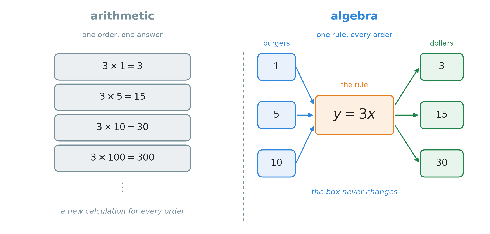
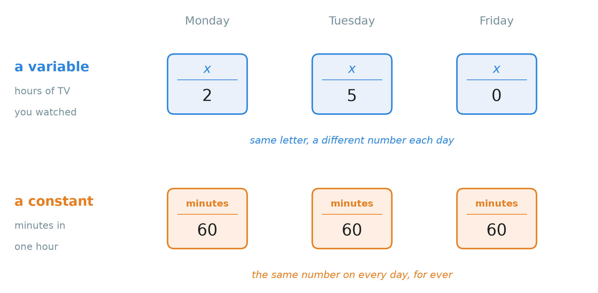
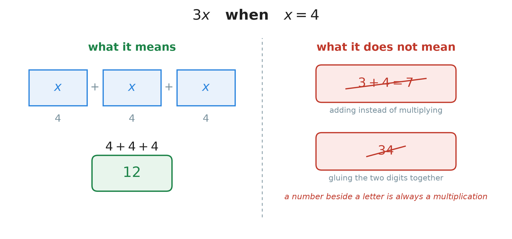
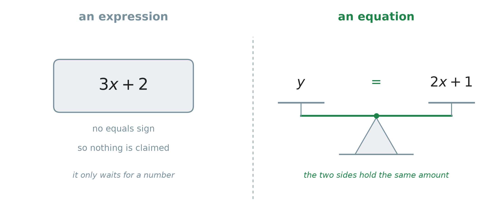
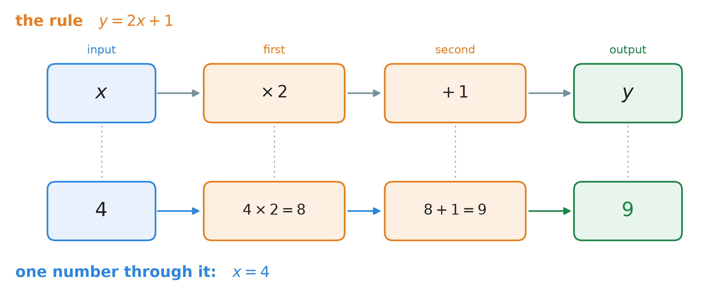
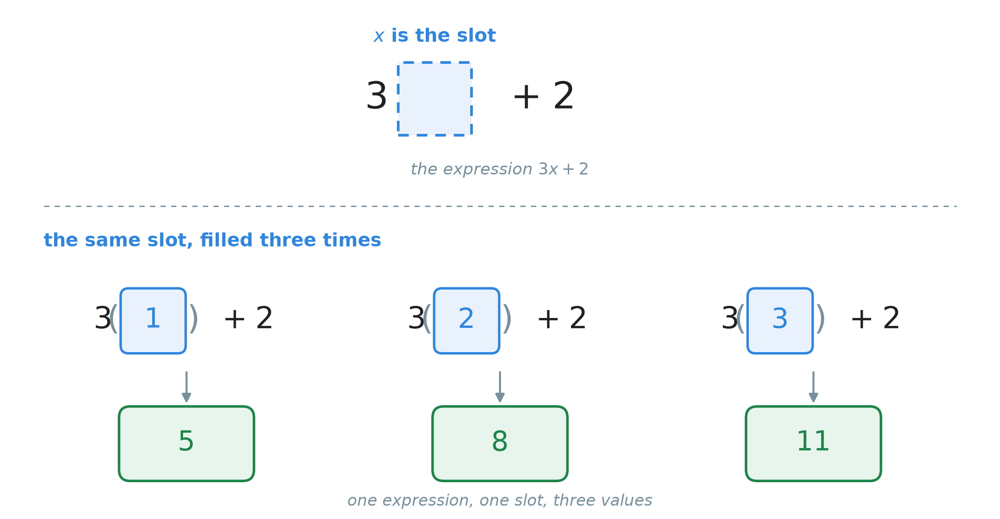
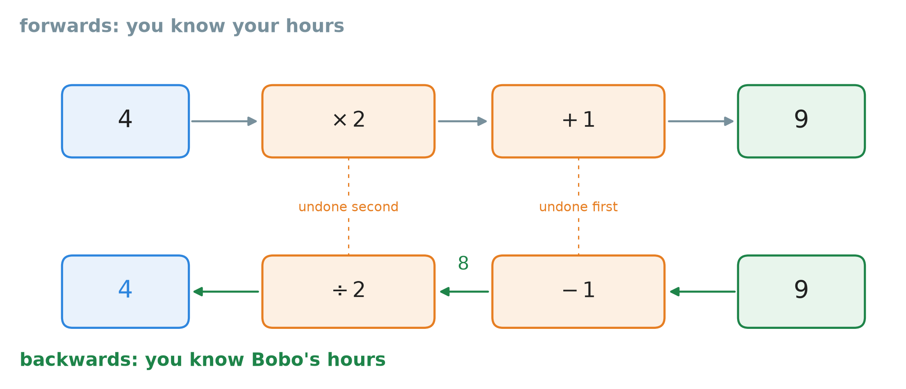
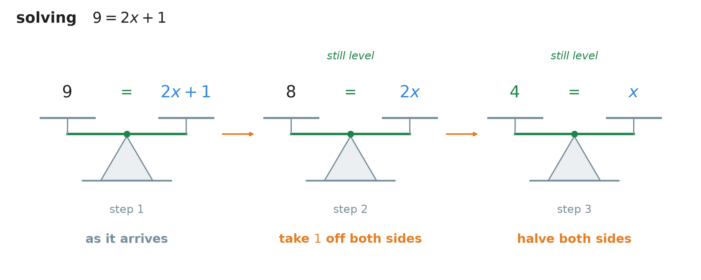

# 18. Introduction to algebra: using variables

**What this chapter teaches**
What a letter is for in mathematics. How to write one rule with letters instead of a new
calculation for every number, how to put a number back into that rule, and how to read the
rule backwards when you know the answer but not the number you started from.

**Before you start**
This chapter needs no new arithmetic. It uses multiplication as repeated addition from
[Chapter 6, section 1.1](./../6_The_Distributive_Property/6_The_Distributive_Property.md#11-multiplication-is-repeated-addition),
the idea of a rule written in symbols from
[Chapter 6, section 2.4](./../6_The_Distributive_Property/6_The_Distributive_Property.md#24-the-rule-in-symbols)
and
[Chapter 10, section 2.5](./../10_Exponents/10_Exponents.md#25-why-the-rules-are-written-with-letters),
the order of operations from
[Chapter 11, section 2](./../11_The_Order_Of_Operations/11_The_Order_Of_Operations.md#2-the-agreed-order),
inverse operations from
[Chapter 8, section 1.1](./../8_Dividing_Large_Numbers/8_Dividing_Large_Numbers.md#11-small-divisions-are-times-tables-read-backwards),
and the fraction bar as a division sign from
[Chapter 1, section 2.2](./../1_Fractions/1_Fractions.md#22-a-fraction-is-a-division).

---

## Table of contents

1. [From arithmetic to algebra](#1-from-arithmetic-to-algebra)
2. [Variables and constants](#2-variables-and-constants)
3. [How multiplication is written in algebra](#3-how-multiplication-is-written-in-algebra)
4. [Expressions and equations](#4-expressions-and-equations)
5. [Turning a real situation into an equation](#5-turning-a-real-situation-into-an-equation)
6. [Evaluating an expression](#6-evaluating-an-expression)
7. [Reading a rule backwards](#7-reading-a-rule-backwards)
8. [Glossary](#8-glossary)
9. [Check your understanding](#9-check-your-understanding)
10. [Important notes](#10-important-notes)

---

## 1. From arithmetic to algebra

### 1.1 What the book has done so far

Every chapter until now worked with numbers you could see. You added them, you subtracted
them, you multiplied them, you divided them. That part of mathematics has a name.

> **Definition — arithmetic.** **Arithmetic** is calculating with numbers you already know.
> Each question has fixed numbers in it, and each question has one answer.

$17 + 25$ is arithmetic. $\frac{2}{3} \times \frac{3}{4}$ is arithmetic. Finding the mean of
ten baseball scores is arithmetic.

Now letters arrive, and the subject gets a new name.

> **Definition — algebra.** **Algebra** is mathematics in which letters stand in for numbers.
> The letters let you write one rule that works for every number, instead of one calculation
> that works for one number.

Many people hear "algebra" and expect something much harder than arithmetic. It is not. It is
the same four operations. The only new thing is that some of the numbers are written as
letters.

### 1.2 One price, and a shop full of customers

A cheeseburger costs $3$ dollars. A customer buys $5$ of them. How much do they pay?

$$
3 \times 5 = 15
$$

The bill is $15$ dollars. That is arithmetic, and it is finished. But it answers one question
only: *five* burgers. The next customer wants $2$, and the calculation has to be written again:

$$
3 \times 2 = 6
$$

And again for $10$ burgers, and again for $100$. The shop serves people all day, so this list
never ends.

Notice what stays the same in every line of that list, and what changes. The price of $3$
dollars never changes. The number of burgers changes with every customer.

So write down the part that changes as a letter:

$$
y = 3x
$$

In words: the total cost is three times the number of burgers. Here $x$ is the number of
burgers and $y$ is the total cost in dollars.

    

**Figure 1 — Look at the shape of the two sides. On the left, every new customer needs a new
line, and the list never ends. On the right there is one box. The numbers going in change, the
prices coming out change, and the box in the middle stays exactly the same.**

That one box is what algebra buys you. You write the rule once, and it answers every question
of that kind for ever.

### 1.3 Letters are not new in this book

This book has used letters before. When
[Chapter 6, section 2.4](./../6_The_Distributive_Property/6_The_Distributive_Property.md#24-the-rule-in-symbols)
wrote the distributive property as

$$
a \times (b + c) = (a \times b) + (a \times c)
$$

the letters $a$, $b$ and $c$ stood for any numbers at all. That is exactly why one line could
replace an infinite number of examples.
[Chapter 10, section 2.5](./../10_Exponents/10_Exponents.md#25-why-the-rules-are-written-with-letters)
said the same thing about the exponent rules, and
[Chapter 14, section 5.3](./../14_The_Greatest_Common_Factor/14_The_Greatest_Common_Factor.md#53-taking-a-common-factor-outside-a-bracket)
wrote $12x + 18 = 6(2x + 3)$ without any trouble.

So the letter itself is old. Two things about it are new from this chapter onwards.

* Until now, a letter belonged to a **rule about arithmetic**. From now on a letter can belong
  to a **real situation** — burgers, weeks, hours of television, dollars.
* Until now, you never had to find out *which* number a letter was. From now on you often do.
  Section 7 asks that question for the first time.

### 1.4 Three things algebra lets you do

There are three of them, and together they are the reason the rest of mathematics is written
this way.

1. **Describe a real situation with a rule.** $y = 3x$ is a small description of the whole
   burger shop.
2. **Find a number you do not know.** If you know the bill was $15$ dollars, algebra can work
   backwards to the number of burgers.
3. **Say how one quantity changes with another.** The rule $y = 3x$ says that one more burger
   always costs $3$ dollars more, whoever is buying.

### Summary of section 1

* **Arithmetic** calculates with numbers you can see. Each question has one answer.
* **Algebra** puts letters where numbers would be, so one rule covers every number.
* A fixed calculation such as $3 \times 5 = 15$ answers one question. The rule $y = 3x$ answers
  all of them.
* Letters in rules are not new — Chapters 6, 10 and 14 used them. What is new is that a letter
  can now stand for a real quantity, and that you may have to find its value.
* Algebra lets you describe a situation, find an unknown number, and say how two quantities
  change together.

---

## 2. Variables and constants

Every letter and every number in an algebraic rule is one of two kinds of thing. Telling them
apart is the first skill of the chapter.

### 2.1 A variable is a quantity that can change

> **Definition — variable.** A **variable** is a letter that stands for a quantity that can
> change, or a quantity you do not know yet. $x$, $y$ and $n$ are the usual letters.

The word says what it does: the quantity **varies**. Here are quantities that vary.

| The quantity | Why it is a variable |
| --- | --- |
| The rain that falls in a month | More in one month, less in the next |
| The price of petrol | It is different this week from last week |
| The speed of an aeroplane | It changes during the flight |
| The hours of television you watch | Two hours on Monday, five on Tuesday |
| The number of burgers a customer orders | Every customer orders a different number |

None of these has one fixed value, so none of them can be written as one fixed number.

### 2.2 A constant does not change

> **Definition — constant.** A **constant** is a value that stays the same. Every plain number
> is a constant.

The number $5$ is a constant: it is $5$ today and it will be $5$ next year. The number of
minutes in one hour is a constant, $60$. The price of a cheeseburger is treated as a constant
in section 1.2, because the shop charges $3$ dollars for every burger it sells.

    

**Figure 2 — The two rows are drawn the same way on purpose, so that the only difference you
see is the numbers. In the blue row the number is different on every day, and the letter $x$ is
the name of whatever it happens to be that day. In the orange row the number is $60$ on every
day, so there is nothing to give a letter to.**

**Note.** A constant can be hidden inside a name. "The entrance fee is $10$ dollars" is a
constant even before anyone writes the $10$ down, because it is the same $10$ dollars for
everybody.

### 2.3 One letter keeps one value at a time

A variable can hold different numbers on different days, but **inside one calculation it holds
one number and keeps it**. If $x$ is $4$ on the first line, it is still $4$ four lines later.
This was already said in
[Chapter 10, section 2.5](./../10_Exponents/10_Exponents.md#25-why-the-rules-are-written-with-letters),
and it matters more now than it did there.

Different letters may stand for different numbers. They do not have to: $x$ and $y$ could both
be $6$ at the same time. Two different letters simply do not *promise* to be equal.

**Note — which letter to choose.** Any letter works. $x$ and $y$ are the usual first choices,
and $n$ is common for a count of things. It is often kinder to yourself to pick a letter that
reminds you of the quantity: $w$ for a number of weeks, $S$ for savings. The letter is a name,
and a good name is easier to read three lines later.

### Summary of section 2

* A **variable** is a letter standing for a quantity that changes, or one you do not know yet.
* A **constant** is a value that stays the same. Every plain number is a constant.
* Rain, prices, speeds and hours of television are variables. Five, sixty and a fixed entrance
  fee are constants.
* Inside one calculation, one letter holds one value from the first line to the last.
* Two different letters may hold the same number, but they are not promised to.

---

## 3. How multiplication is written in algebra

### 3.1 The times sign gets in the way

In arithmetic, multiplication is written with a cross:

$$
3 \times 4 = 12
$$

In algebra that cross is a problem, because $\times$ and the letter $x$ look almost the same.
An expression like $3 \times x$ is hard to read and easy to copy down wrongly.

So algebra writes multiplication in three other ways. All three mean the same thing.

| How it is written | Read it as |
| --- | --- |
| $3 \cdot x$ | a raised dot is a times sign |
| $3(x)$ | a number touching a bracket is a multiplication |
| $3x$ | nothing at all between them is also a multiplication |

The third one is the one you will see most:

$$
3x = 3 \times x
$$

**Note.** This shorthand has appeared once before, in
[Chapter 10, section 8.4](./../10_Exponents/10_Exponents.md#84-when-there-is-more-than-one-thing-inside-the-bracket),
where $2x^{3}y^{2}$ was short for $2 \times x^{3} \times y^{2}$. It is the same convention, and
from here on the book uses it everywhere.

It works between two letters as well. Written as a rule:

$$
a \cdot b = ab
$$

In words: writing two things side by side, with no sign between them, means multiply them.

* $a$ — any number.
* $b$ — any number.

### 3.2 What $3x$ actually means

[Chapter 6, section 1.1](./../6_The_Distributive_Property/6_The_Distributive_Property.md#11-multiplication-is-repeated-addition)
showed that multiplication is repeated addition. So $3x$ is three copies of $x$ added together:

$$
3x = x + x + x
$$

Take $x = 4$ and count it out. Three copies of $4$:

$$
4 + 4 + 4
$$

$$
= 8 + 4
$$

$$
= 12
$$

    

**Figure 3 — On the green side, $3x$ is three boxes of the same size, so with $x = 4$ it is
$12$. On the red side are the two readings people invent. Neither of them is a multiplication,
and neither of them gives $12$.**

> **Warning.** $3x$ is **not** $3 + x$. When $x = 4$, $3x$ is $12$, while $3 + 4$ is only $7$.
> A number written beside a letter is always a multiplication, never an addition.

> **Warning.** $3x$ is **not** the two digits pushed together. When $x = 4$, $3x$ is $12$, not
> thirty-four. The $3$ and the $x$ are two separate things being multiplied, not two digits of
> one number. Section 6.4 gives the writing habit that prevents this mistake completely.

### 3.3 The number in front has a name

In $3x$, the $3$ and the $x$ do two different jobs, so they have two different names.

> **Definition — coefficient.** The **coefficient** is the number that a variable is multiplied
> by. In $3x$ the coefficient is $3$. In $8n$ it is $8$.

Take the expression $7y + 5$ apart:

| The part | What it is |
| --- | --- |
| $y$ | the variable — the quantity that can change |
| $7$ | the coefficient — what $y$ is multiplied by |
| $5$ | a constant — it is not multiplied by anything |

**Note.** A coefficient is a constant too, because $7$ never changes. "Coefficient" says
*where* the constant sits: right in front of a variable, multiplying it.

### 3.4 Only multiplication can be left invisible

The shorthand works for multiplication and for nothing else. An addition or a subtraction must
always show its sign.

* $3x$ means $3 \times x$. Correct.
* $3 + x$ stays $3 + x$. There is no shorter way to write it.
* $x - 7$ stays $x - 7$.

So when two things are written side by side with no sign, there is exactly one thing it can
mean: multiply.

### Summary of section 3

* $\times$ looks too much like the letter $x$, so algebra avoids it.
* $3 \cdot x$, $3(x)$ and $3x$ all mean $3 \times x$.
* Two things side by side with nothing between them are multiplied: $ab = a \times b$.
* $3x$ is $x + x + x$, so with $x = 4$ it is $12$ — not $7$, and not $34$.
* The **coefficient** is the number multiplying the variable. In $7y + 5$ the coefficient is
  $7$ and the constant is $5$.
* Addition and subtraction always keep their signs. Only multiplication may be left invisible.

---

## 4. Expressions and equations

These two words are used constantly, and they are not the same thing. One sign tells them
apart.

### 4.1 An expression is a phrase

[Chapter 11, section 1.3](./../11_The_Order_Of_Operations/11_The_Order_Of_Operations.md#13-so-somebody-had-to-decide)
already defined an **expression**: a line of mathematics with no equals sign in it, such as
$15 + 3^{2} - 4$. When an expression contains a variable, it gets a longer name.

> **Definition — algebraic expression.** An **algebraic expression** is an expression that
> contains at least one variable. It has numbers, variables and operation signs, and **no
> equals sign**.

These are algebraic expressions:

$$
3x + 2 \qquad 8n \qquad 2a + 3b \qquad 5w + 10
$$

An expression on its own is like a phrase in English — "three times the number of burgers".
It is not right or wrong. There is nothing to check. It is a recipe waiting for a number.

### 4.2 An equation is a sentence

> **Definition — equation.** An **equation** is two expressions with an equals sign between
> them. It says that the left side and the right side are the same amount.

These are equations:

$$
y = 3x \qquad y = 2x + 1 \qquad 9 = 2x + 1
$$

An equation is a full sentence, and a sentence makes a claim. That claim can be checked, and
that is the whole difference. $3x + 2$ asks nothing of you. $y = 3x$ tells you something.

### 4.3 The equals sign is a balance, not an arrow

Everywhere in this book so far, the equals sign has arrived at the end of a calculation and
meant "here comes the answer". In $28 \div 10 = 2.8$ it points forwards, from the work to the
result.

In algebra it means something wider and more useful:

> **the two sides of me are the same size.**

    

**Figure 4 — An expression is a card with a recipe on it. An equation is a pair of scales that
balance. The equals sign is the pivot in the middle, and the whole claim of the equation is
that the beam is level.**

This picture is not decoration. In section 7 we change an equation on purpose, and the only
rule we will need is the one the picture makes obvious: whatever you take off one pan, you must
take off the other, or the beam tips and the sentence stops being true.

### Summary of section 4

* An **algebraic expression** has numbers, variables and operation signs, and no equals sign.
* An **equation** has an equals sign, so it claims that its two sides are equal.
* $3x + 2$ is an expression. $y = 3x$ is an equation.
* An expression is a phrase: nothing to check. An equation is a sentence: it can be checked.
* In algebra the equals sign means "both sides are the same size", not "the answer follows".

---

## 5. Turning a real situation into an equation

This is the part that makes algebra worth learning. A situation is described in words, and you
have to write it as a rule.

### 5.1 Name the quantities first, then write the rule

Back to the shop. A cheeseburger costs $3$ dollars. Write a rule for the total cost of any
number of burgers, and use it to find the cost of $5$.

**Step 1 — find what changes, and give each one a letter.**

* $x$ — the number of burgers.
* $y$ — the total cost, in dollars.

**Step 2 — find what does not change.** The price, $3$ dollars per burger. That is a constant.

**Step 3 — write the rule.** Each burger costs $3$ dollars, so the cost is $3$ taken $x$ times:

$$
y = 3x
$$

**Step 4 — use it.** For $5$ burgers, put $5$ where the $x$ is:

$$
y = 3(5)
$$

$$
y = 15
$$

The bill is $15$ dollars — the same answer as the arithmetic in section 1.2, which is exactly
what should happen. The difference is that the rule is still there afterwards, ready for the next
customer.

**Note.** Step 1 is the step people skip, and skipping it is what makes word problems feel
impossible. Writing "$x$ — the number of burgers" costs five seconds and tells you what the
rule is allowed to say.

### 5.2 One letter goes in, the other comes out

In $y = 3x$ the two letters do not have equal jobs.

You choose $x$. Nobody chooses $y$ — it is whatever the rule makes it.

> **Definition — input, or independent variable.** The **input** is the variable you choose a
> value for. It is also called the **independent** variable, because its value does not depend
> on anything else in the rule.

> **Definition — output, or dependent variable.** The **output** is the variable the rule gives
> you. It is also called the **dependent** variable, because its value depends on the input.

In the shop, the customer decides how many burgers, so $x$ is the input. The till decides
nothing — it just multiplies — so $y$ is the output.

### 5.3 A rule works like a machine

Here is a second situation. You and your friend Bobo both watch television.
Bobo always watches twice as many hours as you, and then one hour more.

Call your hours $x$ and Bobo's hours $y$. The rule turns out to be $y = 2x + 1$, and section 5.4
builds it. First look at what that rule *does*.

    

**Figure 5 — The upper lane is the rule, cut into the two things it really does. The lower lane
is the number $4$ walking through the same two boxes. Each orange box in the rule has exactly
one calculation underneath it.**

The order of the boxes is not a choice. It is the order of operations from
[Chapter 11](./../11_The_Order_Of_Operations/11_The_Order_Of_Operations.md): in $2x + 1$ the
multiplication happens before the addition, so the machine doubles first and adds afterwards.

### 5.4 From words to symbols, one phrase at a time

Here is the same sentence again: *Bobo watches twice as many hours as you, plus one more hour.*
Translate it in pieces.

| The words | The symbols | Why |
| --- | --- | --- |
| the hours you watch | $x$ | this is the quantity that changes, and everything else follows from it |
| twice as many as you | $2x$ | "twice" means multiply by $2$ |
| plus one additional hour | $+ 1$ | one more hour, every time |
| the hours Bobo watches | $y$ | this is what the rule produces |

Put the pieces together:

$$
y = 2x + 1
$$

In words: take your hours, double them, then add one hour. That is Bobo's evening.

* $x$ — the hours of television you watch.
* $y$ — the hours of television Bobo watches.
* $2$ — the coefficient, because Bobo watches twice as much.
* $1$ — a constant, the one extra hour.

**Use it.** You watched $4$ hours. How many did Bobo watch?

$$
y = 2(4) + 1
$$

$$
y = 8 + 1
$$

$$
y = 9
$$

Bobo watched $9$ hours.

### 5.5 Both rules have the same shape

Put the two rules side by side:

$$
y = 3x \qquad \text{and} \qquad y = 2x + 1
$$

They are the same shape. Something is multiplied by the input, and something fixed may be
added. Written in the most general way:

$$
y = mx + b
$$

In words: take the input, multiply it by a fixed number, then add another fixed number.

* $y$ — the output, the number the rule gives you.
* $x$ — the input, the number you choose.
* $m$ — the number $x$ is multiplied by. It says how much $y$ changes when $x$ goes up by one.
* $b$ — the fixed amount that is added whatever the input is. It is the value of $y$ when $x$
  is $0$.

Now read the two rules through that shape:

| The rule | $m$ | $b$ | In plain words |
| --- | --- | --- | --- |
| $y = 3x$ | $3$ | $0$ | each burger adds $3$ dollars; nothing is charged for buying nothing |
| $y = 2x + 1$ | $2$ | $1$ | each hour you watch adds two of Bobo's; he watches $1$ hour even if you watch none |

**Note.** $y = 3x$ has no "$+$" in it, so it looks like a different shape. It is not: $b$ is
simply $0$, and nobody writes "$+ 0$". A rule of this shape is called a **linear
relationship**.

### Summary of section 5

* Write down what each letter means **before** writing the rule.
* Find the quantity that changes (the variable) and the quantity that does not (the constant).
* The **input** is the variable you choose; the **output** is the one the rule produces.
* A rule works like a machine, and the order of its steps is the order of operations.
* Translate a word problem one phrase at a time: "twice as many" becomes $2x$, "one more"
  becomes $+ 1$.
* Both examples have the shape $y = mx + b$, where $m$ multiplies the input and $b$ is added
  whatever happens.

---

## 6. Evaluating an expression

### 6.1 The three steps

> **Definition — evaluating an expression.** **Evaluating** an expression means replacing every
> variable with a given number and working the arithmetic out, so that the answer is a single
> number.

> **Definition — substituting.** **Substituting** is the act of writing the number where the
> letter was.

The steps never change.

1. Find the value you have been given for the variable.
2. Substitute: write that number where the letter was, inside brackets.
3. Work out the arithmetic, following the order of operations.

Step 2 is easier to see than to say, so look at it first.

    

**Figure 6 — A variable is a slot in the expression, not a puzzle. The top line shows the hole
where the letter $x$ sits. Underneath, the same hole is filled three times, and every value you
drop in produces its own answer. The expression itself never changes.**

### 6.2 Evaluate $3x + 2$ when $x = 1$

**Step 1 — the given value.** $x = 1$.

**Step 2 — substitute.** Write $1$ where $x$ was, in brackets:

$$
3(1) + 2
$$

**Step 3 — the arithmetic.** There is a multiplication and an addition, so the multiplication
goes first:

$$
3(1) + 2 = 3 + 2
$$

$$
= 5
$$

So when $x = 1$, the expression $3x + 2$ is worth $5$.

### 6.3 The same expression at other values

**When $x = 2$:**

$$
3(2) + 2 = 6 + 2
$$

$$
= 8
$$

**When $x = 3$:**

$$
3(3) + 2 = 9 + 2
$$

$$
= 11
$$

A table is the clearest way to hold several values at once.

| $x$ | Substitute | Multiply first | Value of $3x + 2$ |
| :---: | :---: | :---: | :---: |
| $1$ | $3(1) + 2$ | $3 + 2$ | $5$ |
| $2$ | $3(2) + 2$ | $6 + 2$ | $8$ |
| $3$ | $3(3) + 2$ | $9 + 2$ | $11$ |
| $4$ | $3(4) + 2$ | $12 + 2$ | $14$ |
| $5$ | $3(5) + 2$ | $15 + 2$ | $17$ |

Read down the last column: $5$, $8$, $11$, $14$, $17$. Every time $x$ goes up by $1$, the value
goes up by $3$. That is the coefficient $3$ doing its job, and it is what $m$ measures in
$y = mx + b$.

### 6.4 Two habits that prevent almost every mistake

> **Warning — always write the brackets.** When you substitute, write $3(4)$, never $34$.
> Without the brackets, the $3$ and the $4$ sit next to each other like the two digits of
> thirty-four, and that is exactly the wrong reading warned about in section 3.2. The brackets
> keep the multiplication visible.

> **Warning — substituting does not change the order of operations.** Evaluating $3x + 2$ at
> $x = 2$ is not $3 \times (2 + 2)$. Those brackets were never in the expression. The
> expression is $3x + 2$, so the $3$ multiplies **only** the $x$:
>
> $$3(2) + 2 = 6 + 2 = 8$$
>
> not $12$. Putting a bracket where the expression has none is the same invented-bracket
> mistake as
> [Chapter 11, section 6.2](./../11_The_Order_Of_Operations/11_The_Order_Of_Operations.md#62-doing-the-right-one-first-is-the-same-as-inventing-a-bracket).

### 6.5 More than one variable

An expression can hold two variables, and then you are given a value for each one. Nothing else
about the method changes.

Evaluate $2a + 3b$ when $a = 3$ and $b = 2$.

**Step 1 — the given values.** $a = 3$ and $b = 2$.

**Step 2 — substitute both of them.**

$$
2(3) + 3(2)
$$

**Step 3 — the arithmetic.** Both multiplications happen before the addition:

$$
2(3) + 3(2) = 6 + 6
$$

$$
= 12
$$

**Warning.** Substitute each letter with **its own** value. The $a$ becomes $3$ and the $b$
becomes $2$; they do not share a number, and they do not swap.

### Summary of section 6

* To **evaluate** an expression, put the given number in place of the letter and work it out.
* Always write the substituted number in brackets: $3(4)$, not $34$.
* Then follow the order of operations. Multiplication before addition, as always.
* The same expression gives a different value for every value of the variable.
* When $x$ rises by $1$, the value of $3x + 2$ rises by $3$ — the coefficient controls that.
* With two variables, substitute each letter with its own value.

---

## 7. Reading a rule backwards

### 7.1 The question the other way round

Everything so far went forwards: you knew the input, and you wanted the output. Real questions
often arrive the other way round.

Bobo's rule is $y = 2x + 1$. Tonight you know that **Bobo watched $9$ hours**, and you want to
know how many hours **you** watched.

Now the unknown is the input. Written as an equation, the question is

$$
9 = 2x + 1
$$

and what you want is the value of $x$.

### 7.2 Undo the steps, last one first

The machine picture of section 5.3 answers this almost on its own. Walk through it from the
right-hand end, and undo each box as you pass it.

Undoing is not a new idea. It is **inverse operations** from
[Chapter 8, section 1.1](./../8_Dividing_Large_Numbers/8_Dividing_Large_Numbers.md#11-small-divisions-are-times-tables-read-backwards):
subtraction undoes addition, and division undoes multiplication.

    

**Figure 7 — The same machine, walked the other way. The arrows are reversed and every
operation is replaced by its opposite. Look at the order: the $+ 1$ was the last thing the rule
did, so the $- 1$ is the first thing you undo.**

The order matters as much as the operations do. The rule doubled and then added. Going back, you
subtract and then halve.

### 7.3 Doing the same thing to both sides

Undoing the machine is the picture. Here is what you actually write down, and the one rule that
makes it legal.

Section 4.3 said an equation is a pair of scales that balance. If you take one hour off the
left pan only, the beam tips and the equation becomes false. So:

> **the rule of both sides.** You may do anything to an equation as long as you do exactly the
> same thing to **both** of its sides. The two sides stay equal, so the equation stays true.

    

**Figure 8 — Three balances, which are the three lines of the solution below. Each step is done
to both pans at once, so the beam is still level in every picture. By the third one the right
pan holds a single $x$, and the left pan is the answer.**

Now write it out.

**The equation.**

$$
9 = 2x + 1
$$

**Step 1 — take $1$ off both sides.** That removes the $+1$:

$$
9 - 1 = 2x + 1 - 1
$$

$$
8 = 2x
$$

**Step 2 — divide both sides by $2$.** That removes the doubling:

$$
\frac{8}{2} = \frac{2x}{2}
$$

$$
4 = x
$$

You watched $4$ hours of television.

**Note.** $4 = x$ and $x = 4$ say the same thing. An equation may be read from either end,
because "the same size" does not care which side you start on.

### 7.4 Always check by going forwards again

A backwards answer can be checked completely, for free. Put it into the original rule and see
whether the known number comes out.

Claim: $x = 4$. Original rule: $y = 2x + 1$.

$$
y = 2(4) + 1
$$

$$
y = 8 + 1
$$

$$
y = 9
$$

That is Bobo's $9$ hours, so $x = 4$ is right.

This check is the same habit as multiplying a division back to front in
[Chapter 8, section 1.1](./../8_Dividing_Large_Numbers/8_Dividing_Large_Numbers.md#11-small-divisions-are-times-tables-read-backwards).
It costs two lines and it catches nearly every slip.

**Note.** This section handles rules of one shape only — one variable, multiplied by something,
with something added. That is enough for every equation in this chapter, and it is the first
half of the idea. Finding unknowns in harder equations is its own subject.

### Summary of section 7

* A backwards question gives you the output and asks for the input.
* The machine tells you what to do: reverse the arrows and replace each operation by its
  opposite.
* Undo the **last** step first. The rule multiplied then added, so you subtract then divide.
* Whatever you do to one side of an equation, do to the other, and the equation stays true.
* $9 = 2x + 1$ becomes $8 = 2x$, then $4 = x$.
* Check the answer by substituting it forwards into the original rule.

---

## 8. Glossary

**Arithmetic.** Calculating with numbers you already know. Each question has fixed numbers and
one answer (section 1.1).

**Algebra.** Mathematics in which letters stand in for numbers, so one rule can cover every
number (section 1.1).

**Variable.** A letter standing for a quantity that can change, or one you do not know yet
(section 2.1).

**Constant.** A value that stays the same. Every plain number is a constant (section 2.2).

**Coefficient.** The number that a variable is multiplied by. In $3x$ it is $3$ (section 3.3).

**Algebraic expression.** An expression that contains at least one variable, and no equals sign
(section 4.1).

**Equation.** Two expressions with an equals sign between them, claiming that both sides are
the same amount (section 4.2).

**Input, or independent variable.** The variable you choose a value for (section 5.2).

**Output, or dependent variable.** The variable the rule produces, whose value depends on the
input (section 5.2).

**Linear relationship.** A rule of the shape $y = mx + b$: multiply the input by a fixed
number, then add a fixed number (section 5.5).

**Evaluating an expression.** Replacing every variable with a given number and working the
arithmetic out to a single number (section 6.1).

**Substituting.** Writing the given number in the place where the letter was (section 6.1).

> **Note — everything else in this chapter was defined earlier, and is only linked here.**
> **Expression** is
> [Chapter 11, section 1.3](./../11_The_Order_Of_Operations/11_The_Order_Of_Operations.md#13-so-somebody-had-to-decide).
> **Term** and **multiplication as repeated addition** are
> [Chapter 6, section 2.1](./../6_The_Distributive_Property/6_The_Distributive_Property.md#21-two-more-words-term-and-distribute)
> and
> [Chapter 6, section 1.1](./../6_The_Distributive_Property/6_The_Distributive_Property.md#11-multiplication-is-repeated-addition).
> **The order of operations** is
> [Chapter 11, section 2](./../11_The_Order_Of_Operations/11_The_Order_Of_Operations.md#2-the-agreed-order).
> **Inverse operations** are
> [Chapter 8, section 1.1](./../8_Dividing_Large_Numbers/8_Dividing_Large_Numbers.md#11-small-divisions-are-times-tables-read-backwards).
> **What a letter in a rule stands for** is
> [Chapter 10, section 2.5](./../10_Exponents/10_Exponents.md#25-why-the-rules-are-written-with-letters).

---

## 9. Check your understanding

**Question 1.** Evaluate $4x - 1$ when $x = 3$.

Answer

**Step 1 — the given value.** $x = 3$.

**Step 2 — substitute, with brackets.**

$$
4(3) - 1
$$

**Step 3 — multiply before subtracting.**

$$
4(3) - 1 = 12 - 1
$$

$$
= 11
$$

The value is $11$.

**Question 2.** In the expression $7y + 5$, name the variable, the coefficient and the
constant.

Answer

* **Variable:** $y$. It is the letter, and its value can change.
* **Coefficient:** $7$. It is the number multiplying $y$.
* **Constant:** $5$. It is a fixed number, multiplied by nothing.

The $7$ is a fixed number too. "Coefficient" is the name for a constant standing in front of a
variable and multiplying it (section 3.3).

**Question 3.** A cinema ticket costs $8$ dollars. Write an expression for the cost of $n$
tickets, then find the cost of $4$ tickets.

Answer

**The expression.** Each ticket costs $8$ dollars, so $n$ tickets cost $8$ taken $n$ times:

$$
8n
$$

**For $4$ tickets.** Substitute $n = 4$:

$$
8(4) = 32
$$

Four tickets cost $32$ dollars.

Note that $8n$ is an *expression*, not an equation — the question asked only for the recipe. If
you also give the total a name, say $C$, then $C = 8n$ is an equation.

**Question 4.** Evaluate $2a + 3b$ when $a = 4$ and $b = 5$.

Answer

**Substitute both letters with their own values.**

$$
2(4) + 3(5)
$$

**Both multiplications first.**

$$
2(4) + 3(5) = 8 + 15
$$

$$
= 23
$$

The value is $23$.

**Question 5.** Maria has $10$ dollars now, and she saves $5$ dollars every week. Write an
equation for her total savings $S$ after $w$ weeks, and work out her savings after $6$ weeks.

Answer

**Step 1 — name the quantities.**

* $w$ — the number of weeks. This is the input; Maria's saving goes on week after week.
* $S$ — her total savings in dollars. This is the output.

**Step 2 — what changes and what does not.** The $5$ dollars a week arrives once per week, so
it is multiplied by $w$. The $10$ dollars is there from the start and does not depend on the
weeks at all, so it is a constant that is simply added.

**Step 3 — the equation.**

$$
S = 5w + 10
$$

**Step 4 — after $6$ weeks.**

$$
S = 5(6) + 10
$$

$$
S = 30 + 10
$$

$$
S = 40
$$

Maria has $40$ dollars.

This rule has the shape $y = mx + b$ with $m = 5$ and $b = 10$: she gains $5$ dollars per week,
and she started with $10$ dollars.

**Question 6.** Alex played $x$ video game matches. Sam played three times as many as Alex,
minus $2$, so $y = 3x - 2$. Sam played $13$ matches. How many did Alex play?

Answer

This is a backwards question: the output is known, the input is not.

**The equation.** Put $13$ where $y$ is:

$$
13 = 3x - 2
$$

**Step 1 — undo the last step first.** The rule subtracted $2$ at the end, so add $2$ to both
sides:

$$
13 + 2 = 3x - 2 + 2
$$

$$
15 = 3x
$$

**Step 2 — undo the multiplication.** Divide both sides by $3$:

$$
\frac{15}{3} = \frac{3x}{3}
$$

$$
5 = x
$$

Alex played $5$ matches.

**Check, forwards.**

$$
y = 3(5) - 2 = 15 - 2 = 13
$$

That is Sam's $13$ matches, so the answer is right.

**Question 7.** Which of these is an expression, and which is an equation?
$5n - 2$, and $P = 5n - 2$.

Answer

$5n - 2$ is an **algebraic expression**. It has a variable, numbers and operation signs, and no
equals sign. It claims nothing.

$P = 5n - 2$ is an **equation**. The equals sign turns it into a sentence: it says that the
quantity called $P$ is the same amount as $5n - 2$.

The expression is the recipe. The equation gives the result of the recipe a name.

**Question 8.** Amir says that when $x = 5$, the value of $4x$ is $45$. What did he do, and what
is the right answer?

Answer

Amir pushed the two digits together and read $4x$ as forty-five. But $4$ and $x$ are two
separate things being multiplied, not two digits of one number.

$$
4x = 4 \times x = 4(5) = 20
$$

The answer is $20$.

The habit that prevents this is the brackets from section 6.4. Writing $4(5)$ makes the
multiplication impossible to miss; writing $45$ hides it.

**Question 9.** Evaluate $2x + 5$ when $x = 0$. What does your answer tell you about $b$ in
$y = mx + b$?

Answer

**Substitute $x = 0$.**

$$
2(0) + 5 = 0 + 5
$$

$$
= 5
$$

The value is $5$, which is exactly the $b$ of this rule.

That is what $b$ always is: the value of the output when the input is $0$. Multiplying $m$ by
zero wipes out the $mx$ part and leaves $b$ on its own. In Maria's savings, $S = 5w + 10$, this
is the $10$ dollars she had before she saved anything.

**Question 10.** Bobo's rule is $y = 2x + 1$. On Sunday you watched $3$ hours and Bobo watched
$7$. Does the rule fit?

Answer

Substitute your hours, $x = 3$, and see what the rule predicts for Bobo:

$$
y = 2(3) + 1
$$

$$
y = 6 + 1
$$

$$
y = 7
$$

The rule predicts $7$ hours, and Bobo watched $7$ hours. The rule fits.

This is the check of section 7.4 used as a test of the rule instead of as a test of an answer.
Substituting is the only way to find out whether a rule describes a real situation, and the
same two lines of work does both jobs.

---

## 10. Important notes

**The mistakes people actually make.**

* **Reading $3x$ as an addition.** It is a multiplication. With $x = 4$ the value is $12$, not
  $7$.
* **Reading $3x$ as two digits.** With $x = 4$, $3x$ is $12$, not thirty-four. Write the
  brackets when you substitute and this mistake cannot happen.
* **Inventing a bracket that is not there.** $3x + 2$ at $x = 2$ is $3(2) + 2 = 8$. It is not
  $3 \times (2 + 2) = 12$. The coefficient multiplies the variable only, never the whole line.
* **Giving two different letters the same value.** In $2a + 3b$, the $a$ gets its number and
  the $b$ gets its own.
* **Changing one side of an equation only.** Take $1$ off the left pan and the beam tips. Every
  step happens to both sides.
* **Undoing the steps in the wrong order.** The rule doubled and then added, so going back you
  subtract and then halve. Halving $9$ first gives nonsense.
* **Writing the rule before naming the letters.** Five seconds spent writing "$x$ — the number
  of burgers" saves the whole problem.
* **Expecting a variable to be one secret number.** In $y = 3x$, the letter $x$ is not hiding a
  particular value. It is a slot, and any number may go in it.

**The three ideas to keep.**

* **A letter is a slot, not a mystery.** That is the whole content of figure 6. An expression
  with a letter in it is an expression with a hole in it, and evaluating is filling the hole.
  Once a letter stops feeling like a secret, algebra stops being frightening.
* **A rule replaces a list.** Arithmetic answers the question in front of you. Algebra answers
  every question of that shape at once, which is why the burger shop needs one line instead of
  a page. This is the same trick Chapters 6, 10 and 14 used to state their rules — this chapter
  just turns it on real situations instead of on arithmetic.
* **The equals sign means "the same size".** Reading it as "here comes the answer" works in
  arithmetic and fails immediately in algebra. Read it as a level balance and the rule of both
  sides is not something to memorise; it is the only thing you *could* do.

**How this chapter connects to the rest of the book.**
Almost nothing here is new arithmetic, and that is the point.
[Chapter 6](./../6_The_Distributive_Property/6_The_Distributive_Property.md) gave
multiplication as repeated addition, which is what $3x = x + x + x$ rests on, and it wrote the
first rule in this book with letters in it.
[Chapter 8](./../8_Dividing_Large_Numbers/8_Dividing_Large_Numbers.md) gave inverse operations,
which is the whole of section 7.
[Chapter 10](./../10_Exponents/10_Exponents.md) said plainly that a letter in a rule stands for
any number, and section 8.4 there quietly used $2x^{3}y^{2}$ for a product — the same shorthand
section 3.1 explains here.
[Chapter 11](./../11_The_Order_Of_Operations/11_The_Order_Of_Operations.md) decided which
operation happens first, and that decision is what fixes the order of the boxes in the machine.
[Chapter 14, section 5.3](./../14_The_Greatest_Common_Factor/14_The_Greatest_Common_Factor.md#53-taking-a-common-factor-outside-a-bracket)
already factorised $12x + 18$, so the reader has met an algebraic expression before without the
word being used.

There is a change of direction worth noticing. Until now, mathematics in this book answered
questions. From here on it also *describes* things: a shop, a friend's television habit, a
savings account. The arithmetic stays as easy as it was in Chapter 6. The new work is deciding
what to call things, and reading a sentence closely enough to turn it into symbols.

---

- [Back to the book](./../README.md)
- Previous: [17 Averages and range](./../17_Averages_And_Range/17_Averages_And_Range.md)
- Next: [19 The number properties of algebra](./../19_The_Number_Properties_Of_Algebra/19_The_Number_Properties_Of_Algebra.md)
