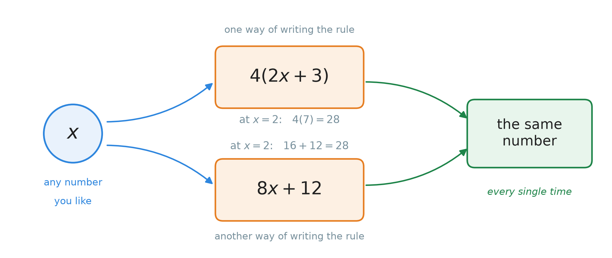
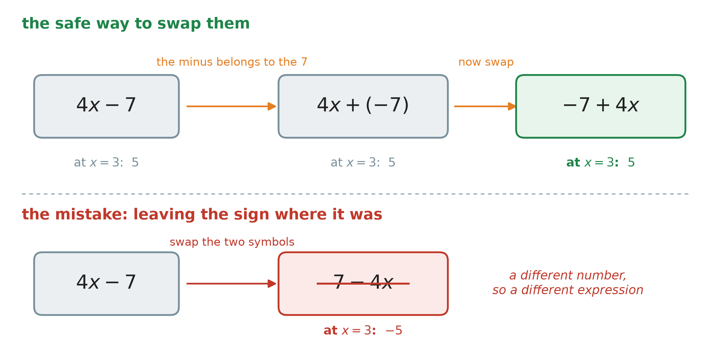
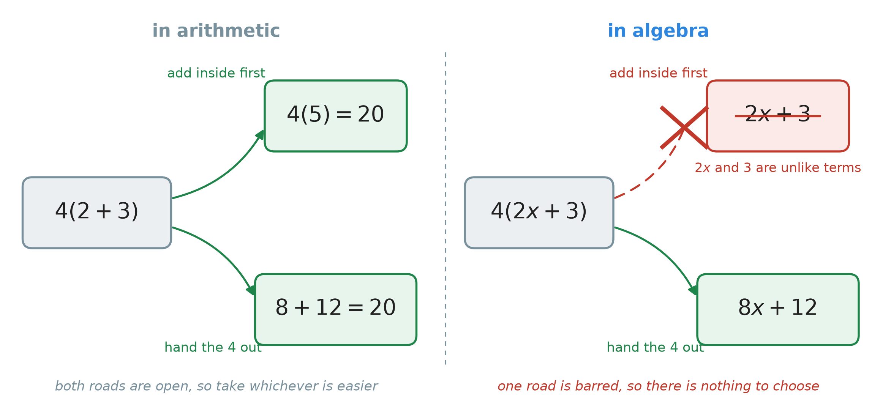
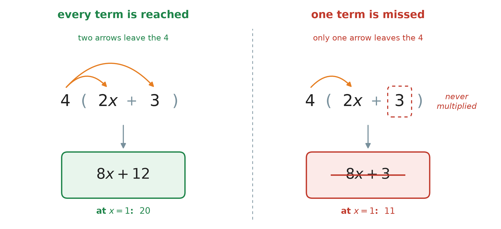
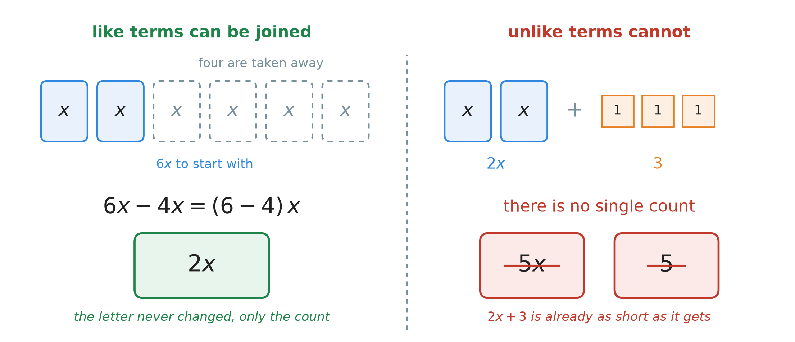
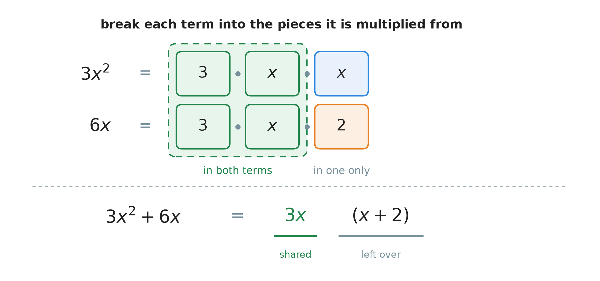
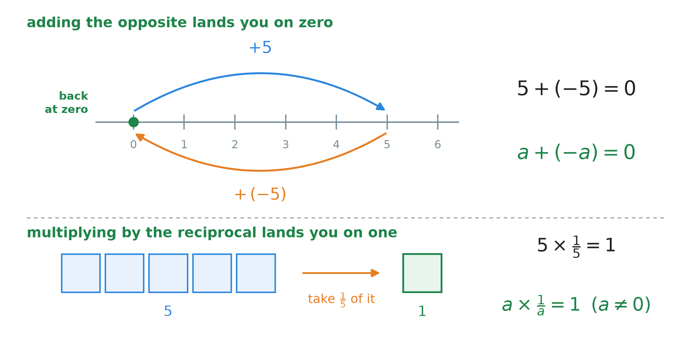
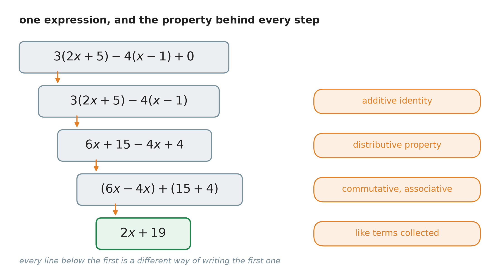

# 19. The number properties of algebra

**What this chapter teaches**
Which rewrites of an algebraic expression are allowed, and why. You will learn the five
number properties, how to hand a multiplier out across a bracket, how to collect terms that
count the same thing, and how to take a common factor back out again.

**Before you start**
This chapter continues
[Chapter 18](./../18_Introduction_To_Algebra_Variables/18_Introduction_To_Algebra_Variables.md),
and you should read that one first. It also uses the distributive property from
[Chapter 6, sections 2 to 4](./../6_The_Distributive_Property/6_The_Distributive_Property.md#2-the-distributive-property),
the sign rules from
[Chapter 9, section 5](./../9_Negative_Numbers/9_Negative_Numbers.md#5-multiplying),
the product rule for powers from
[Chapter 10, section 4](./../10_Exponents/10_Exponents.md#4-rule-1-multiplying-powers-with-the-same-base),
the order of operations from
[Chapter 11, section 2](./../11_The_Order_Of_Operations/11_The_Order_Of_Operations.md#2-the-agreed-order),
the greatest common factor from
[Chapter 14](./../14_The_Greatest_Common_Factor/14_The_Greatest_Common_Factor.md),
and the reciprocal from
[Chapter 16, section 4](./../16_Multiplying_And_Dividing_Fractions/16_Multiplying_And_Dividing_Fractions.md#4-turning-a-fraction-upside-down).

---

## Table of contents

1. [Why algebra needs rules for rewriting](#1-why-algebra-needs-rules-for-rewriting)
2. [Order and grouping: two rules you already have](#2-order-and-grouping-two-rules-you-already-have)
3. [Handing the multiplier out](#3-handing-the-multiplier-out)
4. [Collecting like terms](#4-collecting-like-terms)
5. [Taking the common factor out](#5-taking-the-common-factor-out)
6. [The two numbers that change nothing](#6-the-two-numbers-that-change-nothing)
7. [The two ways of cancelling](#7-the-two-ways-of-cancelling)
8. [Several properties in one line](#8-several-properties-in-one-line)
9. [Glossary](#9-glossary)
10. [Check your understanding](#10-check-your-understanding)
11. [Important notes](#11-important-notes)

---

## 1. Why algebra needs rules for rewriting

### 1.1 Arithmetic always finishes; algebra does not

In arithmetic every question closes. You are given numbers, you do the work, and one number
comes out:

$$
2 + 3 = 5
$$

$$
4 \times 5 = 20
$$

Now put a letter in the first one:

$$
2x + 3
$$

This will not close. You cannot add $2x$ and $3$ and get one number, because you do not know
what $x$ is. If $x$ is $1$, then $2x$ is $2$ and the answer is $5$. If $x$ is $10$, then $2x$
is $20$ and the answer is $23$. The expression has no single value until somebody chooses $x$.

So an algebraic expression usually stays as an expression. There is no number at the end of it.

### 1.2 So the word "simplify" changes its meaning

In arithmetic, *simplify* means "work it out and write the number". In algebra it cannot mean
that, because there is no number to write.

> **Definition — simplifying in algebra.** To **simplify** an algebraic expression is to write
> the same expression in a shorter, tidier form. The **value** does not change. Only the
> writing changes.

$4(2x + 3)$ and $8x + 12$ are the same thing written two ways. The second is tidier, because
there is no bracket in it and no multiplication waiting to be done.

This raises the question the whole chapter answers: **which rewrites are allowed?** You may not
simply move symbols around because the new line looks nicer. Some moves keep the value and some
destroy it.

### 1.3 Two expressions that are really one

    

**Figure 1 — Put any number you like into the circle on the left. It travels down two different
roads, one through each box. The two roads always meet at the same answer. That is what makes
the two boxes two ways of writing one rule.**

> **Definition — equivalent expressions.** Two expressions are **equivalent** when they give the
> same value for **every** number you put in.

You can test it. Choose values for $x$, put each one into both expressions, and compare. This is
the evaluating of
[Chapter 18, section 6.1](./../18_Introduction_To_Algebra_Variables/18_Introduction_To_Algebra_Variables.md#61-the-three-steps),
done twice.

| $x$ | $4(2x + 3)$ | $8x + 12$ |
| --- | --- | --- |
| $0$ | $4(3) = 12$ | $0 + 12 = 12$ |
| $1$ | $4(5) = 20$ | $8 + 12 = 20$ |
| $2$ | $4(7) = 28$ | $16 + 12 = 28$ |
| $3$ | $4(9) = 36$ | $24 + 12 = 36$ |

Four agreements in a row. That is not a proof, but it is a very good sign, and it is the fastest
check you own.

> **Warning — one agreement proves nothing.** Look at $2x$ and $x + 2$. When $x = 2$ they both
> give $4$, so a single test would pass them. But when $x = 3$ they give $6$ and $5$. They are
> not equivalent, and the one lucky test hid it. **Putting a number in can catch a mistake. It
> can never prove two expressions equal.**

### 1.4 A property is a permitted move

> **Definition — number property.** A **number property** is a rule that says one way of writing
> an expression may be exchanged for another, with no change to the value.

Each property is a move you are allowed to make. There are five of them, and this chapter takes
them one at a time.

| The property | What it lets you change |
| --- | --- |
| Commutative | the **order** of two terms |
| Associative | the **grouping** of three terms |
| Distributive | a bracket into separate products, or back again |
| Identity | lets you drop a $+\,0$ or a $\times 1$ |
| Inverse | lets you cancel a term down to $0$ or to $1$ |

**Note.** None of these is a new fact about numbers. They were all true in Chapter 1. They only
become *interesting* now, because in arithmetic you could always finish the sum instead, and in
algebra you cannot.

### Summary of section 1

* In arithmetic a question ends in one number. In algebra it usually ends in an expression.
* To **simplify** in algebra means to rewrite the same thing more tidily, not to find a number.
* Two expressions are **equivalent** when they agree for every value of the letter.
* Putting a number in and comparing is a quick way to catch a mistake, but it cannot prove two
  expressions equal.
* A **number property** is a rewrite you are allowed to make. There are five of them.

---

## 2. Order and grouping: two rules you already have

Two of the five properties are already in the book. This section says what they look like when a
letter is in the way, and nothing more.

### 2.1 Changing the order

The **commutative property** was explained in
[Chapter 6, section 1.3](./../6_The_Distributive_Property/6_The_Distributive_Property.md#13-the-order-of-the-two-factors-does-not-matter).
In symbols:

$$
a + b = b + a
$$

$$
a \times b = b \times a
$$

* $a$, $b$ — any two numbers.

A letter is a number whose name you do not know yet, so the rule applies to a letter too:

$$
2x + 3 = 3 + 2x
$$

$$
2x \cdot 3 = 3 \cdot 2x = 6x
$$

**Explanation — what this buys you in algebra.** In arithmetic the commutative property was a
small convenience: it let you add two numbers in the easier order. In algebra it does a real
job. Terms that belong together often sit far apart on the line, and this is the rule that lets
you walk them next to each other. Section 4.3 uses it for exactly that.

### 2.2 Changing the grouping

The **associative property** was explained in
[Chapter 6, section 1.4](./../6_The_Distributive_Property/6_The_Distributive_Property.md#14-the-grouping-does-not-matter-either).
In symbols:

$$
(a + b) + c = a + (b + c)
$$

$$
(a \times b) \times c = a \times (b \times c)
$$

Here it is with a letter in the first place:

$$
(x + 2) + 3 = x + (2 + 3) = x + 5
$$

Read that from left to right. On the left the $2$ and the $3$ are in different groups, so
neither can reach the other. Moving the brackets puts them together, and then they add. The $x$
was never touched.

That is the point of the rule in algebra: **it lets you do the arithmetic you can do, and leave
the letter alone.** The two together work the same way:

$$
(2 \cdot x) \cdot 3 = 2 \cdot (x \cdot 3) = 2 \cdot (3 \cdot x) = (2 \cdot 3) \cdot x = 6x
$$

The middle step swapped $x$ and $3$, which is section 2.1. The rest is regrouping.

### 2.3 Subtraction and division still refuse

[Chapter 6, section 1.5](./../6_The_Distributive_Property/6_The_Distributive_Property.md#15-subtraction-and-division-do-not-follow-these-two-rules)
showed with numbers that neither rule holds for subtraction or division. The counter-examples
have not changed:

| The claim | What actually happens |
| --- | --- |
| $5 - 2 = 2 - 5$ | $3$ against $-3$ |
| $6 \div 2 = 2 \div 6$ | $3$ against $\frac{1}{3}$ |
| $(8 - 4) - 2 = 8 - (4 - 2)$ | $2$ against $6$ |

> **Warning.** $4x - 7$ is **not** $7 - 4x$. Put $x = 3$ into both. The first gives
> $12 - 7 = 5$. The second gives $7 - 12 = -5$. Two different numbers, so two different
> expressions.

### 2.4 The safe way to move a subtraction

There is still a way to swap the two parts of $4x - 7$, and it takes one extra step.

    

**Figure 2 — In the top row the minus sign is first attached to the $7$, and only then do the
two terms change places. All three cards give $5$ when $x = 3$. In the bottom row the symbols
were swapped and the minus sign was left where it was, and the value changed.**

The extra step is
[Chapter 9, section 4.3](./../9_Negative_Numbers/9_Negative_Numbers.md#43-adding-a-negative-number-is-the-same-as-subtracting):
subtracting a number is the same as adding its opposite.

**Step 1.** Rewrite the subtraction as an addition.

$$
4x - 7 = 4x + (-7)
$$

**Step 2.** Now it *is* an addition, so section 2.1 applies and the two terms may swap.

$$
4x + (-7) = -7 + 4x
$$

**The sentence to remember:** the minus sign belongs to the number that follows it, and it
travels with that number. Once you read $4x - 7$ as $4x$ **and** $-7$, moving them around is
safe.

### Summary of section 2

* The **commutative property** lets you change the order of two terms: $a + b = b + a$ and
  $a \times b = b \times a$.
* The **associative property** lets you change the grouping: $(a + b) + c = a + (b + c)$.
* In algebra these two rules let you bring numbers together and do them, leaving the letters
  alone.
* Neither rule holds for subtraction or division.
* To move the parts of a subtraction, first write it as an addition: $4x - 7 = 4x + (-7)$. Then
  the sign travels with its number.

---

## 3. Handing the multiplier out

### 3.1 In arithmetic you had a choice; here you do not

[Chapter 6](./../6_The_Distributive_Property/6_The_Distributive_Property.md) called the two ways
of working out $4 \times (2 + 3)$ "two roads". You could add inside the bracket first, or you
could hand the $4$ out to both numbers. Both roads ended at $20$, so you picked whichever was
easier.

    

**Figure 3 — On the left both roads are open, so you choose. On the right the upper road is
barred: $2x$ and $3$ cannot be added into one term, so there is nothing to add inside the
bracket. Only one road is left.**

That is the whole change. In arithmetic the distributive property was a convenience. In algebra
it is **the** method, because the other road no longer exists.

### 3.2 The rule, with a letter inside the bracket

The rule itself is unchanged from
[Chapter 6, section 2.4](./../6_The_Distributive_Property/6_The_Distributive_Property.md#24-the-rule-in-symbols):

$$
a(b + c) = ab + ac
$$

* $a$ — the multiplier standing outside the bracket.
* $b$, $c$ — the terms inside the bracket.
* $ab$ — the product of $a$ and $b$, written in the shorthand of
  [Chapter 18, section 3.1](./../18_Introduction_To_Algebra_Variables/18_Introduction_To_Algebra_Variables.md#31-the-times-sign-gets-in-the-way).

And with subtraction inside the bracket, which is
[Chapter 6, section 4.1](./../6_The_Distributive_Property/6_The_Distributive_Property.md#41-a-subtraction-inside-the-bracket):

$$
a(b - c) = ab - ac
$$

Now $b$ is allowed to carry a letter. Take $4(2x + 3)$.

**Step 1.** Multiply the outside number by the first term.

$$
4 \cdot 2x = 8x
$$

**Step 2.** Multiply the outside number by the second term.

$$
4 \cdot 3 = 12
$$

**Step 3.** Write the two products, joined by the sign that was inside the bracket.

$$
4(2x + 3) = 8x + 12
$$

**Note — why $4 \cdot 2x$ is $8x$.** The term $2x$ means $2 \times x$, so
$4 \cdot 2x$ is $4 \times 2 \times x$. Section 2.2 lets you group the two numbers together:
$(4 \times 2) \times x = 8x$. The rule of section 2.2 is doing quiet work on every line of this
chapter.

**A second one.** Simplify $5(3x + 4)$.

$$
5 \cdot 3x = 15x
$$

$$
5 \cdot 4 = 20
$$

$$
5(3x + 4) = 15x + 20
$$

Check it with $x = 2$. On the left, $3(2) + 4 = 6 + 4 = 10$, and $5(10) = 50$. On the right,
$15(2) + 20 = 30 + 20 = 50$. The two agree.

### 3.3 Every term inside must be reached

    

**Figure 4 — Count the arrows. There must be one arrow for every term inside the bracket. On
the right the $3$ was never multiplied, so it left the bracket unchanged, and the answer is
wrong by $9$ when $x = 1$.**

> **Warning — the commonest mistake in this chapter.** $4(x + 3)$ is **not** $4x + 3$. The
> multiplier outside a bracket multiplies **every** term inside it. Test it with $x = 1$:
> $4(1 + 3) = 4(4) = 16$, but $4(1) + 3 = 7$.

[Chapter 6, section 3.3](./../6_The_Distributive_Property/6_The_Distributive_Property.md#33-why-the-picture-is-a-proof)
showed with a rectangle why this must be so. Cutting a rectangle in two cannot lose any squares,
so every piece has to be counted.

### 3.4 The multiplier can carry a letter too

Nothing in the rule says $a$ must be a plain number. Take $-2x(4x - 5)$.

**Step 1.** Multiply $-2x$ by the first term, $4x$.

The sizes first, then the sign, as in
[Chapter 9, section 5.3](./../9_Negative_Numbers/9_Negative_Numbers.md#53-the-method-numbers-first-sign-last):

$$
2 \times 4 = 8
$$

$$
x \cdot x = x^{2}
$$

The second line is the product rule from
[Chapter 10, section 4](./../10_Exponents/10_Exponents.md#4-rule-1-multiplying-powers-with-the-same-base):
one $x$ times one $x$ is two $x$'s multiplied together. There is one minus sign in the
multiplication, so the answer is negative:

$$
(-2x)(4x) = -8x^{2}
$$

**Step 2.** Multiply $-2x$ by the second term, $-5$.

$$
2 \times 5 = 10
$$

There are two minus signs now, so the answer is positive:

$$
(-2x)(-5) = +10x
$$

**Step 3.** Write the two products.

$$
-2x(4x - 5) = -8x^{2} + 10x
$$

Check it with $x = 2$. On the left, $4(2) - 5 = 8 - 5 = 3$, and $-2(2) = -4$, so the value is
$-4 \times 3 = -12$. On the right, $-8(4) + 10(2) = -32 + 20 = -12$. The two agree.

### 3.5 A negative multiplier keeps its sign all the way

Simplify $-3(x - 4)$.

The multiplier is $-3$, **including the minus**. Both terms inside get multiplied by $-3$, not
by $3$.

$$
(-3)(x) = -3x
$$

$$
(-3)(-4) = +12
$$

$$
-3(x - 4) = -3x + 12
$$

> **Warning.** The answer is **not** $-3x - 12$. The second term inside the bracket is $-4$, and
> a negative times a negative is positive
> ([Chapter 9, section 5.2](./../9_Negative_Numbers/9_Negative_Numbers.md#52-a-negative-number-times-a-negative-number)).
> Test it with $x = 1$: $-3(1 - 4) = -3(-3) = 9$, and $-3(1) + 12 = 9$. The wrong version gives
> $-15$.

The habit that prevents this: before you multiply anything, read each term **with its sign
attached**. The bracket $(x - 4)$ holds the two terms $x$ and $-4$, and the multiplier is $-3$.
Once the three signs are written down, the arithmetic is ordinary.

### Summary of section 3

* In arithmetic you could add inside a bracket instead of distributing. In algebra you usually
  cannot, so distributing is the only way to remove the bracket.
* The rule is unchanged: $a(b + c) = ab + ac$ and $a(b - c) = ab - ac$.
* The multiplier must reach **every** term inside. $4(x + 3) = 4x + 12$, never $4x + 3$.
* The multiplier may carry a letter. Then $x \cdot x = x^{2}$, by the product rule of Chapter 10.
* A minus sign in front of the multiplier is part of the multiplier, and a minus sign inside the
  bracket is part of its term. Read both before you start.

---

## 4. Collecting like terms

After a bracket is opened, a line often holds several terms. Some of them can be joined together
and some cannot. This section says which.

### 4.1 Which terms can be joined

    

**Figure 5 — On the left every block is the same object, so counting them makes sense: six of
them less four of them is two of them. On the right the blocks and the small squares are
different objects, so there is no single count to write down.**

> **Definition — like terms.** Two terms are **like terms** when they carry exactly the same
> letters, each raised to exactly the same power. Only the number in front may differ.

The number in front is the **coefficient**, defined in
[Chapter 18, section 3.3](./../18_Introduction_To_Algebra_Variables/18_Introduction_To_Algebra_Variables.md#33-the-number-in-front-has-a-name).
So: like terms have the same letter part, and may have different coefficients.

| The pair | Like or not | Why |
| --- | --- | --- |
| $6x$ and $4x$ | like | both carry $x$ |
| $3y$ and $-12y$ | like | both carry $y$ |
| $2x$ and $3$ | not like | one carries $x$, the other carries no letter |
| $x^{2}$ and $x$ | not like | the powers differ |
| $5a$ and $5b$ | not like | different letters |
| $7$ and $-2$ | like | plain numbers are all alike |

### 4.2 Why joining is allowed

This is not a new rule. It is section 3 read from right to left.

Start with $6x - 4x$. Both terms are something times $x$, so the distributive property in the
form of
[Chapter 6, section 4.3](./../6_The_Distributive_Property/6_The_Distributive_Property.md#43-the-multiplier-can-stand-on-the-right)
applies, with the shared factor $x$ standing on the right:

$$
6x - 4x = (6 - 4)\,x
$$

$$
= 2x
$$

**In words:** six lots of $x$ take away four lots of $x$ leaves two lots of $x$. The subtraction
$6 - 4$ happened in the coefficients. **The letter part never changed.**

That is why nobody has to know what $x$ is. Whatever number $x$ turns out to be, six of it minus
four of it is two of it.

And it is also why unlike terms are stuck. In $2x + 3$ there is no shared factor to pull out, so
there is nothing to write in front of a bracket.

> **Definition — collecting like terms.** To **collect like terms** is to replace a group of
> like terms by one term, by adding or subtracting their coefficients.

### 4.3 The method, with the commutative property doing its job

Simplify $-4(3y - 2) + 10y$.

**Step 1.** Open the bracket (section 3.5). The multiplier is $-4$.

$$
(-4)(3y) = -12y
$$

$$
(-4)(-2) = +8
$$

$$
-4(3y - 2) + 10y = -12y + 8 + 10y
$$

**Step 2.** The two $y$ terms are like terms, but they are not next to each other. Use the
commutative property (section 2.1) to walk them together.

$$
= (-12y + 10y) + 8
$$

**Step 3.** Collect them.

$$
-12 + 10 = -2
$$

$$
= -2y + 8
$$

Check it with $y = 3$. On the left, $3(3) - 2 = 9 - 2 = 7$, and $-4(7) = -28$, and
$-28 + 10(3) = -28 + 30 = 2$. On the right, $-2(3) + 8 = -6 + 8 = 2$. The two agree.

### 4.4 Two things that go wrong

> **Warning — the letter does not grow.** $3x + 5x = 8x$. It is **not** $8x^{2}$. Only the
> coefficients were added; the letter part was copied down unchanged. Test it with $x = 5$:
> $15 + 25 = 40$, and $8(5) = 40$, while $8x^{2}$ would be $200$.

> **Warning — a power is a different object.** $x^{2}$ and $x$ are not like terms, so
> $x^{2} + x$ cannot be shortened at all. Test it with $x = 3$: $9 + 3 = 12$, which is neither
> $2x^{2}$ ($18$) nor $2x$ ($6$).

The second warning is the same idea as
[Chapter 10, section 9.2](./../10_Exponents/10_Exponents.md#92-the-rule-that-does-not-exist),
where adding two powers turned out to have no rule at all.

### Summary of section 4

* **Like terms** carry exactly the same letters raised to the same powers. Only their
  coefficients may differ.
* Like terms may be joined; unlike terms may not.
* Joining them is the distributive property backwards: $6x - 4x = (6 - 4)x = 2x$.
* Add or subtract the **coefficients** and copy the letter part down unchanged.
* Use the commutative property to bring like terms next to each other first.
* $3x + 5x$ is $8x$, not $8x^{2}$. And $x^{2} + x$ cannot be shortened.

---

## 5. Taking the common factor out

### 5.1 The rule read from right to left

[Chapter 14, section 5.3](./../14_The_Greatest_Common_Factor/14_The_Greatest_Common_Factor.md#53-taking-a-common-factor-outside-a-bracket)
already did this once, with a number as the common factor:

$$
12x + 18 = 6(2x + 3)
$$

> **Definition — factoring.** To **factor** an expression is to write it as a product: one
> common factor outside a bracket, and what is left inside. It is the distributive property used
> backwards.

Section 4.2 was a small example of this, where the common factor was a single letter. This
section does the general case, where the common factor carries **both** a number and a letter.

### 5.2 The greatest common factor of two terms

    

**Figure 6 — Each term is broken into the pieces it is multiplied from, with the shared pieces
drawn first so they line up. The two green columns are what both terms own, and they make the
greatest common factor $3x$. The last column is what is left over, and it goes inside the
bracket.**

The picture is
[Chapter 14, section 3.3](./../14_The_Greatest_Common_Factor/14_The_Greatest_Common_Factor.md#33-18-and-24-from-the-primes)'s
bricks with letters added to them. It works the same way, in two halves.

**The number half.** Find the greatest common factor of the coefficients, exactly as Chapter 14
does. For $3$ and $6$ it is $3$.

**The letter half.** For each letter, take it as many times as the term that has it **least**.
The first term, $3x^{2}$, has two $x$'s. The second, $6x$, has one. The smaller count is one, so
the common factor gets one $x$.

That is
[Chapter 14, section 3.1](./../14_The_Greatest_Common_Factor/14_The_Greatest_Common_Factor.md#31-what-a-common-factor-may-contain)
again, word for word: a common factor may hold each piece at most as often as the number that
holds it least. A letter behaves exactly like one of Chapter 12's primes.

$$
\text{GCF}(3x^{2},\, 6x) = 3x
$$

### 5.3 The four steps, worked on $3x^{2} + 6x$

**Step 1.** Break each term into the pieces it is multiplied from.

$$
3x^{2} = 3 \cdot x \cdot x
$$

$$
6x = 2 \cdot 3 \cdot x
$$

**Step 2.** Find the greatest common factor. Both terms hold a $3$ and at least one $x$, and
nothing more is shared.

$$
\text{GCF} = 3x
$$

**Step 3.** Divide each term by the greatest common factor. What comes out goes inside the
bracket.

$$
\frac{3x^{2}}{3x} = x
$$

$$
\frac{6x}{3x} = 2
$$

**Step 4.** Write the factor outside and the two answers inside, joined by the sign from the
original line.

$$
3x^{2} + 6x = 3x(x + 2)
$$

**Check it by distributing back.** This costs two lines and tests the whole thing:

$$
3x \cdot x = 3x^{2}
$$

$$
3x \cdot 2 = 6x
$$

The two products are the expression you started from, so the factoring is right. You can also
put a number in: with $x = 2$, the left side is $3(4) + 6(2) = 12 + 12 = 24$, and the right side
is $3(2)(2 + 2) = 6 \times 4 = 24$.

### 5.4 A longer one: $4y^{3} + 12y^{2} - 8y$

**Step 1 — the numbers.** The coefficients are $4$, $12$ and $8$.

| Number | Its factors |
| --- | --- |
| $4$ | $1, 2, 4$ |
| $12$ | $1, 2, 3, 4, 6, 12$ |
| $8$ | $1, 2, 4, 8$ |

The greatest one shared by all three is $4$.

**Step 2 — the letter.** The three terms hold three $y$'s, two $y$'s and one $y$. The smallest
count is one, so the common factor gets one $y$.

$$
\text{GCF} = 4y
$$

**Step 3 — divide each term.**

$$
\frac{4y^{3}}{4y} = y^{2}
$$

$$
\frac{12y^{2}}{4y} = 3y
$$

$$
\frac{-8y}{4y} = -2
$$

The last one keeps its minus sign, because the term was being subtracted.

**Step 4 — write it down.**

$$
4y^{3} + 12y^{2} - 8y = 4y(y^{2} + 3y - 2)
$$

Check with $y = 2$. On the left, $4(8) + 12(4) - 8(2) = 32 + 48 - 16 = 64$. On the right,
$4(2) = 8$ and $4 + 6 - 2 = 8$, so $8 \times 8 = 64$. The two agree.

### 5.5 Take the greatest, or you have not finished

Somebody might write:

$$
3x^{2} + 6x = 3(x^{2} + 2x)
$$

This is **true**. Distribute the $3$ back and you get the original line. But it is not finished,
because the bracket still holds a common factor: both $x^{2}$ and $2x$ carry an $x$.

> **Warning.** A factoring is finished only when the terms left inside the bracket share nothing
> except $1$. In $3x(x + 2)$ the terms $x$ and $2$ share nothing, so that one is finished.

This is the same test Chapter 14 used on fractions: you have taken the greatest common factor
exactly when what is left over is coprime. The word **coprime** is
[Chapter 13, section 4.1](./../13_The_Least_Common_Multiple/13_The_Least_Common_Multiple.md#41-numbers-that-share-nothing).

### Summary of section 5

* **Factoring** writes an expression as a common factor times a bracket. It is the distributive
  property backwards.
* Find the greatest common factor in two halves: the coefficients by Chapter 14, and each letter
  taken as often as the term that has it least.
* Divide every term by that factor to find what goes inside the bracket, keeping each sign.
* Always check by distributing back. It costs two lines.
* If the terms inside the bracket still share something, you did not take the greatest factor.

---

## 6. The two numbers that change nothing

Two numbers are special, because adding one of them or multiplying by the other leaves an
expression exactly as it was.

### 6.1 Adding zero

$$
a + 0 = a
$$

* $a$ — any number, or any term.

**In words:** adding nothing changes nothing.

[Chapter 9, section 4.1](./../9_Negative_Numbers/9_Negative_Numbers.md#41-every-calculation-is-a-walk-along-the-line)
gives the reason in a picture. Every addition is a walk along the number line, and the number
you add says how far to walk. Adding $0$ is a walk of no steps, so you finish where you started.

$$
5 + 0 = 5
$$

$$
9x + 0 = 9x
$$

**Note — subtracting zero is the same fact.** Section 2.4 said that subtracting a number is
adding its opposite. The opposite of $0$ is $0$, so $3x - 0$ is $3x + 0$, which is $3x$. There
is one rule here, not two.

### 6.2 Multiplying by one

$$
a \times 1 = a
$$

**In words:** one lot of something is that something.

[Chapter 6, section 1.1](./../6_The_Distributive_Property/6_The_Distributive_Property.md#11-multiplication-is-repeated-addition)
gives the reason. A multiplication is repeated addition, and $a \times 1$ says "write $a$ down
once". Writing it down once is just writing it down.

$$
7 \times 1 = 7
$$

$$
4x \cdot 1 = 4x
$$

**Note — dividing by one is the same fact.** Dividing by $1$ changes nothing either, and
[Chapter 16, section 6.1](./../16_Multiplying_And_Dividing_Fractions/16_Multiplying_And_Dividing_Fractions.md#61-dividing-by-one)
already explained why: the reciprocal of $1$ is $1$, so dividing by $1$ *is* multiplying by $1$.

**Note — this is why $x$ and $1x$ are the same.** A term with no number written in front of it
has a coefficient of $1$, because $x$ is $1 \cdot x$. That matters when you collect like terms:

$$
x + 3x = 1x + 3x = (1 + 3)x = 4x
$$

With $x = 5$ this reads $5 + 15 = 20$, and $4(5) = 20$.

> **Definition — identity element.** An **identity element** is the number that leaves everything
> unchanged under one operation. For addition it is $0$, and the rule is called the **additive
> identity**. For multiplication it is $1$, and the rule is called the **multiplicative
> identity**.

### 6.3 Where a $+\,0$ or a $\times 1$ actually turns up

Nobody writes $+\,0$ on purpose. These two properties matter because zeros and ones **appear in
the middle of work** and have to be recognised and dropped.

They turn up in three ways:

* at the end of a step, when two terms cancel and leave $0$ behind;
* inside a question that is testing whether you notice, as in $9x + 0$;
* hidden, as the invisible coefficient $1$ of section 6.2.

Section 8.2 opens with a line that ends in $+\,0$, and the first move is to drop it.

### Summary of section 6

* $a + 0 = a$ — the **additive identity**. Adding nothing is a walk of no steps.
* $a \times 1 = a$ — the **multiplicative identity**. One lot of something is that something.
* Subtracting $0$ and dividing by $1$ are the same two facts, not two more.
* A term written without a number in front has a coefficient of $1$: $x$ means $1x$.
* You will meet a $+\,0$ or a $\times 1$ in the middle of work far more often than at the start.

---

## 7. The two ways of cancelling

An identity leaves a term alone. An **inverse** does the opposite: it wipes a term out, down to
the identity element.

    

**Figure 7 — Two pictures of cancelling. Above, walking five steps out and five steps back
leaves you standing on zero. Below, one fifth of five squares is one square. Zero and one are
where the two cancellings land, and they are exactly the two identity elements of section 6.**

### 7.1 Adding the opposite

$$
a + (-a) = 0
$$

* $a$ — any number, or any term.
* $-a$ — its **opposite**, defined in
  [Chapter 9, section 2.2](./../9_Negative_Numbers/9_Negative_Numbers.md#22-every-number-has-an-opposite).

**In words:** a number plus its opposite is nothing at all.

$$
5 + (-5) = 0
$$

$$
x + (-x) = 0
$$

$$
5x + (-5x) = 0
$$

> **Definition — additive inverse.** The **additive inverse** of a term is its opposite: the same
> term with the opposite sign. Adding a term to its additive inverse always gives $0$.

Chapter 9 already had this number and called it the *opposite*. All that is new here is the
second name, and the fact that a whole term has one, not only a plain number.

### 7.2 Multiplying by the reciprocal

$$
a \times \frac{1}{a} = 1 \qquad (a \neq 0)
$$

* $\frac{1}{a}$ — the **reciprocal** of $a$, defined in
  [Chapter 16, section 4.1](./../16_Multiplying_And_Dividing_Fractions/16_Multiplying_And_Dividing_Fractions.md#41-the-reciprocal).

**In words:** a number times its reciprocal is one.

$$
5 \times \frac{1}{5} = 1
$$

$$
x \times \frac{1}{x} = 1 \qquad (x \neq 0)
$$

> **Definition — multiplicative inverse.** The **multiplicative inverse** of a term is its
> reciprocal. Multiplying a term by its multiplicative inverse always gives $1$.

[Chapter 16, section 4.2](./../16_Multiplying_And_Dividing_Fractions/16_Multiplying_And_Dividing_Fractions.md#42-a-fraction-times-its-reciprocal-is-always-1)
already proved this and already gave the name. What is new is the condition, now that a letter
is involved.

> **Warning — why $a \neq 0$.** Zero has no reciprocal, because $\frac{1}{0}$ would be a division
> by zero, and
> [Chapter 16, section 6.2](./../16_Multiplying_And_Dividing_Fractions/16_Multiplying_And_Dividing_Fractions.md#62-why-dividing-by-zero-has-no-answer)
> showed that has no answer. So when you write $x \times \frac{1}{x} = 1$, you must say that $x$
> is not $0$. Every other number has a reciprocal.

### 7.3 Do not mix the two up

The two inverses of the same term look nothing alike, and they land in different places.

| The term | Its additive inverse | Its multiplicative inverse |
| --- | --- | --- |
| $5x$ | $-5x$, because $5x + (-5x) = 0$ | $\frac{1}{5x}$, because $5x \times \frac{1}{5x} = 1$ |
| $x$ | $-x$ | $\frac{1}{x}$ |
| $\frac{2}{3}$ | $-\frac{2}{3}$ | $\frac{3}{2}$ |

The way to keep them apart is to ask **where you want to land**. If you want $0$, use the
opposite. If you want $1$, use the reciprocal.

### 7.4 What the inverses are actually for

[Chapter 18, section 7.3](./../18_Introduction_To_Algebra_Variables/18_Introduction_To_Algebra_Variables.md#73-doing-the-same-thing-to-both-sides)
solved $9 = 2x + 1$ by taking $1$ off both sides and then halving both sides. The inverses say
**why those two moves were the right ones.**

$$
9 = 2x + 1
$$

The rule adds $1$, so to remove it you add $-1$, the additive inverse of $1$. What is left on
that side is $2x + 0$, and section 6.1 drops the zero:

$$
8 = 2x
$$

The rule multiplies by $2$, so to remove that you multiply by $\frac{1}{2}$, the multiplicative
inverse of $2$. What is left on that side is $1 \cdot x$, and section 6.2 drops the one:

$$
4 = x
$$

**That is the pattern of every equation you will ever solve.** An inverse turns an unwanted
operation into an identity element, and the identity element then disappears. The two properties
of section 6 and the two of section 7 are a pair, and they only do their job together.

### Summary of section 7

* $a + (-a) = 0$ — the **additive inverse** is the opposite, and it cancels down to zero.
* $a \times \frac{1}{a} = 1$ — the **multiplicative inverse** is the reciprocal, and it cancels
  down to one. It needs $a \neq 0$.
* The additive inverse of $5x$ is $-5x$; its multiplicative inverse is $\frac{1}{5x}$.
* To choose between them, ask whether you want to land on $0$ or on $1$.
* Solving an equation is inverses and identities working as a pair: the inverse removes the
  operation, the identity removes what it left behind.

---

## 8. Several properties in one line

### 8.1 The five properties in one table

| Property | With addition | With multiplication | Holds for subtraction and division? |
| --- | --- | --- | --- |
| **Commutative** | $a + b = b + a$ | $ab = ba$ | **No** |
| **Associative** | $(a + b) + c = a + (b + c)$ | $(ab)c = a(bc)$ | **No** |
| **Distributive** | — | $a(b + c) = ab + ac$ | Yes: $a(b - c) = ab - ac$ |
| **Identity** | $a + 0 = a$ | $a \times 1 = a$ | Yes: $a - 0 = a$ and $a \div 1 = a$ |
| **Inverse** | $a + (-a) = 0$ | $a \times \frac{1}{a} = 1$, $a \neq 0$ | — |

### 8.2 A line that uses four of them

Simplify $3(2x + 5) - 4(x - 1) + 0$.

    

**Figure 8 — Five lines, four moves. Each card is shorter than the one above it, and the orange
label says which property allowed the step. The green card at the bottom is the same expression
as the grey one at the top.**

**Step 1 — drop the zero.** Adding $0$ changes nothing (section 6.1).

$$
3(2x + 5) - 4(x - 1)
$$

**Step 2 — open the first bracket** (section 3.2).

$$
3 \cdot 2x = 6x
$$

$$
3 \cdot 5 = 15
$$

**Step 3 — open the second bracket.** The multiplier is $-4$, including its sign (section 3.5).

$$
(-4)(x) = -4x
$$

$$
(-4)(-1) = +4
$$

Now the whole line has no brackets in it:

$$
6x + 15 - 4x + 4
$$

**Step 4 — bring the like terms together** (sections 2.1 and 2.2).

$$
(6x - 4x) + (15 + 4)
$$

**Step 5 — collect them** (section 4.2).

$$
6 - 4 = 2
$$

$$
15 + 4 = 19
$$

$$
3(2x + 5) - 4(x - 1) + 0 = 2x + 19
$$

Check with $x = 2$. On the left, $3(4 + 5) = 3(9) = 27$, and $-4(2 - 1) = -4(1) = -4$, so the
value is $27 - 4 = 23$. On the right, $2(2) + 19 = 4 + 19 = 23$. The two agree.

### 8.3 The habit that catches everything

Two habits carry the whole chapter, and both are already in the book.

**Rewrite the whole line after every step.** This is
[Chapter 11, section 8.1](./../11_The_Order_Of_Operations/11_The_Order_Of_Operations.md#81-the-habit-that-prevents-nearly-every-mistake).
Do one property per line, and write the rest of the line out again underneath. A term that gets
left behind in the middle of a long line is the hardest mistake of all to find later.

**Put a number in at the end.** This is
[Chapter 18, section 7.4](./../18_Introduction_To_Algebra_Variables/18_Introduction_To_Algebra_Variables.md#74-always-check-by-going-forwards-again).
Choose a small value for the letter, work out the line you started with, work out the line you
finished with, and compare. Section 1.3 said what this can and cannot do: it will not prove you
right, but it catches almost every real mistake, and it costs four lines.

**Note — which number to choose.** Avoid $0$ and $1$. Too many wrong answers happen to agree
with the right one at $0$, because everything multiplied by $0$ vanishes, and at $1$, because
$1^{2}$ is $1$. Values like $2$ and $3$ are far better at catching errors.

### Summary of section 8

* A real simplification uses several properties, one after another.
* A good order: drop any identity, open every bracket, bring like terms together, collect them.
* Name the property you used on each step until naming it feels unnecessary.
* Write the whole line out again after every step.
* Check by substituting a small number that is neither $0$ nor $1$.

---

## 9. Glossary

**Simplifying (in algebra).** Rewriting an expression in a shorter, tidier form, without
changing its value.

**Equivalent expressions.** Two expressions that give the same value for every number you put
in. $4(2x + 3)$ and $8x + 12$ are equivalent.

**Number property.** A rule saying that one way of writing an expression may be exchanged for
another, with no change to the value.

**Like terms.** Terms carrying exactly the same letters raised to exactly the same powers. Only
the coefficient may differ. $6x$ and $4x$ are like terms; $x^{2}$ and $x$ are not.

**Collecting like terms.** Replacing a group of like terms by one term, by adding or subtracting
their coefficients.

**Factoring.** Writing an expression as a common factor outside a bracket, times what is left
inside. It is the distributive property used backwards.

**Identity element.** The number that leaves everything unchanged under one operation: $0$ for
addition, $1$ for multiplication.

**Additive identity.** The rule $a + 0 = a$.

**Multiplicative identity.** The rule $a \times 1 = a$.

**Additive inverse.** The opposite of a term — the same term with the opposite sign. A term plus
its additive inverse gives $0$. The additive inverse of $5x$ is $-5x$.

**Multiplicative inverse.** The reciprocal of a term. A term times its multiplicative inverse
gives $1$, as long as the term is not $0$. The multiplicative inverse of $5x$ is $\frac{1}{5x}$.

**Note — the words this chapter does not define, because the book already has them.**
**Commutative property**, **associative property**, **distributive property**, **term**,
**factor** and **distribute** are
[Chapter 6](./../6_The_Distributive_Property/6_The_Distributive_Property.md).
**Opposite** and the **sign rules** are
[Chapter 9](./../9_Negative_Numbers/9_Negative_Numbers.md).
The **product rule for powers** is
[Chapter 10, section 4](./../10_Exponents/10_Exponents.md#4-rule-1-multiplying-powers-with-the-same-base),
and the **reciprocal** first appears in
[Chapter 10, section 7.1](./../10_Exponents/10_Exponents.md#71-one-more-word-first).
The **order of operations** is
[Chapter 11](./../11_The_Order_Of_Operations/11_The_Order_Of_Operations.md).
The **greatest common factor** and **coprime** are Chapters
[13](./../13_The_Least_Common_Multiple/13_The_Least_Common_Multiple.md) and
[14](./../14_The_Greatest_Common_Factor/14_The_Greatest_Common_Factor.md).
**Variable**, **constant**, **coefficient**, **algebraic expression**, **equation**,
**evaluating** and **substituting** are
[Chapter 18](./../18_Introduction_To_Algebra_Variables/18_Introduction_To_Algebra_Variables.md).

---

## 10. Check your understanding

**Question 1.** Simplify $7(2x + 5)$.

Answer

Multiply the $7$ by each term inside the bracket.

$$
7 \cdot 2x = 14x
$$

$$
7 \cdot 5 = 35
$$

$$
7(2x + 5) = 14x + 35
$$

Check with $x = 2$: on the left $7(4 + 5) = 7(9) = 63$, and on the right $14(2) + 35 = 63$.

**Question 2.** Which property is this line using?

$$
9x + 0 = 9x
$$

Answer

The **additive identity**. Adding $0$ leaves the term exactly as it was.

The multiplicative identity would be $9x \times 1 = 9x$. The test for telling them apart is
which number is in the line: a $0$ being added, or a $1$ being multiplied.

**Question 3.** Simplify $-4(3y - 2) + 10y$ — and say which property you used at each step.

Answer

**Distributive property**, with the multiplier $-4$:

$$
(-4)(3y) = -12y \qquad (-4)(-2) = +8
$$

$$
-12y + 8 + 10y
$$

**Commutative property**, to walk the two $y$ terms together:

$$
(-12y + 10y) + 8
$$

**Collecting like terms:**

$$
-2y + 8
$$

Check with $y = 3$: $-4(9 - 2) + 30 = -28 + 30 = 2$, and $-2(3) + 8 = 2$.

**Question 4.** Factor $15x^{2} - 10x$.

Answer

**The numbers.** The greatest common factor of $15$ and $10$ is $5$.

**The letter.** The first term has two $x$'s, the second has one. The smaller count is one, so
take one $x$.

$$
\text{GCF} = 5x
$$

**Divide each term:**

$$
\frac{15x^{2}}{5x} = 3x \qquad \frac{-10x}{5x} = -2
$$

$$
15x^{2} - 10x = 5x(3x - 2)
$$

Check by distributing back: $5x \cdot 3x = 15x^{2}$ and $5x \cdot (-2) = -10x$. Correct.

**Question 5.** Simplify $2(4x^{2} - 3x + 1) - 3(x^{2} + 2x - 4)$.

Answer

**Open the first bracket.** The multiplier is $2$, and there are three terms inside, which is
[Chapter 6, section 4.2](./../6_The_Distributive_Property/6_The_Distributive_Property.md#42-more-than-two-terms-inside-the-bracket):

$$
2 \cdot 4x^{2} = 8x^{2} \qquad 2 \cdot (-3x) = -6x \qquad 2 \cdot 1 = 2
$$

**Open the second bracket.** The multiplier is $-3$, including its sign:

$$
(-3)(x^{2}) = -3x^{2} \qquad (-3)(2x) = -6x \qquad (-3)(-4) = +12
$$

**Write the whole line out:**

$$
8x^{2} - 6x + 2 - 3x^{2} - 6x + 12
$$

**Group the like terms.** There are three groups here, not two — the $x^{2}$ terms, the $x$
terms, and the plain numbers:

$$
(8x^{2} - 3x^{2}) + (-6x - 6x) + (2 + 12)
$$

**Collect each group:**

$$
5x^{2} - 12x + 14
$$

Check with $x = 2$: on the left, $2(16 - 6 + 1) - 3(4 + 4 - 4) = 2(11) - 3(4) = 22 - 12 = 10$;
on the right, $5(4) - 12(2) + 14 = 20 - 24 + 14 = 10$.

**Question 6.** Factor $6a^{3}b^{2} + 12a^{2}b^{3} - 18a^{2}b^{2}$ completely.

Answer

There are two letters now, so the letter half of the work is done twice — once for each letter.

**The numbers.** The greatest common factor of $6$, $12$ and $18$ is $6$.

**The letter $a$.** The three terms hold three, two and two $a$'s. The smallest count is two, so
take $a^{2}$.

**The letter $b$.** The three terms hold two, three and two $b$'s. The smallest count is two, so
take $b^{2}$.

$$
\text{GCF} = 6a^{2}b^{2}
$$

**Divide each term:**

$$
\frac{6a^{3}b^{2}}{6a^{2}b^{2}} = a \qquad
\frac{12a^{2}b^{3}}{6a^{2}b^{2}} = 2b \qquad
\frac{-18a^{2}b^{2}}{6a^{2}b^{2}} = -3
$$

$$
6a^{3}b^{2} + 12a^{2}b^{3} - 18a^{2}b^{2} = 6a^{2}b^{2}(a + 2b - 3)
$$

Check with $a = 2$ and $b = 1$: on the left, $6(8)(1) + 12(4)(1) - 18(4)(1) = 48 + 48 - 72 = 24$;
on the right, $6(4)(1) \times (2 + 2 - 3) = 24 \times 1 = 24$.

**Question 7.** Elena writes $4x - 7 = 7 - 4x$, and explains that "addition is commutative, so
the order does not matter". What has gone wrong, and what is the correct rearrangement?

Answer

The operation in that line is a **subtraction**, and subtraction is not commutative. Section 2.3
has the counter-examples.

Elena's mistake was to swap the two symbols and leave the minus sign standing where it was. The
sign belongs to the $7$, so it has to travel with the $7$:

$$
4x - 7 = 4x + (-7) = -7 + 4x
$$

Check with $x = 3$: $4x - 7$ gives $5$, and $-7 + 4x$ gives $5$. Elena's version gives $-5$.

**Question 8.** Sam factors $3x^{2} + 6x$ and writes $3(x^{2} + 2x)$. Is this wrong?

Answer

It is not wrong — it is **unfinished**.

Distribute the $3$ back: $3 \cdot x^{2} = 3x^{2}$ and $3 \cdot 2x = 6x$. That is the original
expression, so every step Sam took was legal.

But look inside the bracket. Both $x^{2}$ and $2x$ carry an $x$, so there is still a common
factor sitting in there. Sam found *a* common factor, not the *greatest* one:

$$
3x^{2} + 6x = 3x(x + 2)
$$

Now the terms inside are $x$ and $2$, which share nothing. That one is finished.

**Question 9.** Is $4(x + 3)$ equivalent to $4x + 3$? Show how you know, without doing any
algebra at all.

Answer

Put a number in — the test of section 1.3.

Take $x = 1$:

$$
4(1 + 3) = 4(4) = 16
$$

$$
4(1) + 3 = 4 + 3 = 7
$$

$16$ and $7$ are different, so the two expressions are **not** equivalent. One disagreement is
enough to settle it forever.

The algebra says the same thing: the $4$ must reach both terms, so $4(x + 3) = 4x + 12$.

Notice how the two questions are not the same. Showing that two expressions **differ** takes one
number. Showing that they **agree** takes the algebra, because no number of tests can cover every
value of $x$. That is section 1.3's warning, seen from the useful side.

**Question 10.** Nobody knows what $x$ is. So how can anyone be sure that $6x - 4x = 2x$?

Answer

Because the answer does not depend on knowing $x$.

Both terms are a number of $x$'s, so the distributive property can be read backwards, with the
shared $x$ pulled out to the right:

$$
6x - 4x = (6 - 4)\,x = 2x
$$

The subtraction happened in the **coefficients**, which are ordinary numbers. The letter part
was copied straight down.

Said in words: whatever number $x$ turns out to be, six of that number minus four of that number
is two of that number. That is true for every $x$ at once, which is exactly what "equivalent"
means.

Compare it with $2x + 3$. There is no shared factor there, so there is nothing to pull out, and
the expression cannot be shortened at all.

---

## 11. Important notes

**The mistakes people actually make.**

* **Multiplying only the first term.** $4(x + 3)$ is $4x + 12$. The multiplier has to reach every
  term inside the bracket, and figure 4 says to count the arrows.
* **Losing a minus sign while distributing.** In $-3(x - 4)$ the multiplier is $-3$ and the
  second term is $-4$, so their product is $+12$. Write every sign down before you multiply
  anything.
* **Swapping the two parts of a subtraction.** $4x - 7$ is $-7 + 4x$, not $7 - 4x$. Turn the
  subtraction into an addition first, and the sign travels with its number.
* **Adding unlike terms.** $2x + 3$ is already finished. It is not $5x$ and it is not $5$.
* **Growing the letter when collecting.** $3x + 5x = 8x$, not $8x^{2}$. Only the coefficients
  were added.
* **Stopping halfway through a factoring.** $3(x^{2} + 2x)$ is true but unfinished, because the
  bracket still holds an $x$. You have finished when what is inside shares nothing.
* **Confusing the two inverses.** The additive inverse of $5x$ is $-5x$ and lands on $0$. The
  multiplicative inverse is $\frac{1}{5x}$ and lands on $1$.
* **Forgetting that $x$ carries a coefficient of $1$.** In $x + 3x$ the first term counts once,
  so the answer is $4x$, not $3x$.

**The three ideas to keep.**

* **Simplifying is rewriting, not calculating.** This is the shift that makes algebra feel
  strange at first. An expression with a letter in it has no number at the end of it, so the
  goal changes: you are looking for the tidiest of many equal ways to write one thing. Once that
  lands, the whole chapter becomes a list of permitted moves rather than a list of tricks.
* **Every property has a reason, and you have already seen it.** The distributive property is
  Chapter 6's rectangle. Collecting like terms is that same rectangle read backwards. The
  additive inverse is Chapter 9's walk out and back. The multiplicative inverse is Chapter 16's
  reciprocal. Nothing here had to be invented for algebra — algebra just finally needs it.
* **Identities and inverses work as a pair.** An inverse removes an unwanted operation by turning
  it into $0$ or $1$; an identity then makes that $0$ or $1$ disappear. Section 7.4 shows the two
  of them solving an equation together, and that is the shape of every equation you will meet.

**How this chapter connects to the rest of the book.**
[Chapter 6](./../6_The_Distributive_Property/6_The_Distributive_Property.md) supplied three of
the five properties and the rectangle that proves the biggest one. Its closing section already
said that a rule written with letters is a rule written once for every number. This chapter is
the first time a letter goes *inside* the bracket.
[Chapter 9](./../9_Negative_Numbers/9_Negative_Numbers.md) supplied the opposite of a number,
which becomes the additive inverse here, and the sign rules that every distribution with a minus
in it depends on.
[Chapter 10](./../10_Exponents/10_Exponents.md) supplied $x \cdot x = x^{2}$, without which
section 3.4 could not finish a single line.
[Chapter 14](./../14_The_Greatest_Common_Factor/14_The_Greatest_Common_Factor.md) supplied the
greatest common factor and, more importantly, the *reason* it takes the smallest count of each
piece — a rule that turns out to work for letters exactly as it worked for primes.
[Chapter 16](./../16_Multiplying_And_Dividing_Fractions/16_Multiplying_And_Dividing_Fractions.md)
supplied the reciprocal and the proof that a number times its reciprocal is $1$.
[Chapter 18](./../18_Introduction_To_Algebra_Variables/18_Introduction_To_Algebra_Variables.md)
supplied the letters themselves, and the habit of testing an answer by putting a number in.

Chapter 18 could write a rule down and read it forwards and backwards. This chapter can now
**change** a rule without breaking it. That is what makes the next step possible: an equation
with brackets in it, or with the letter on both sides, cannot be solved until the two sides can
be tidied first.

---

- [Back to the book](./../README.md)
- Previous: [18 Introduction to algebra: using variables](./../18_Introduction_To_Algebra_Variables/18_Introduction_To_Algebra_Variables.md)
- Next: not written yet.
