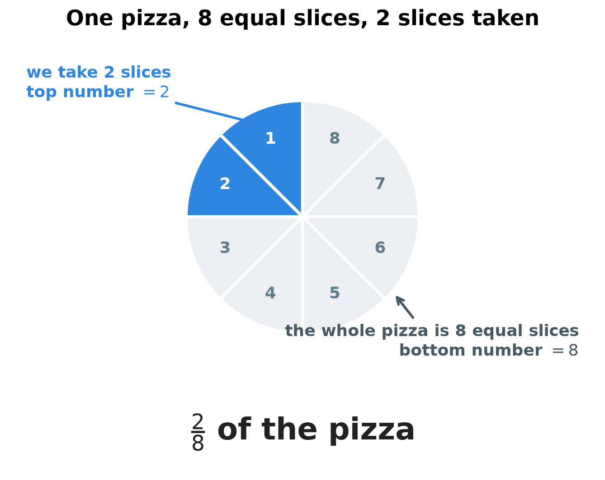
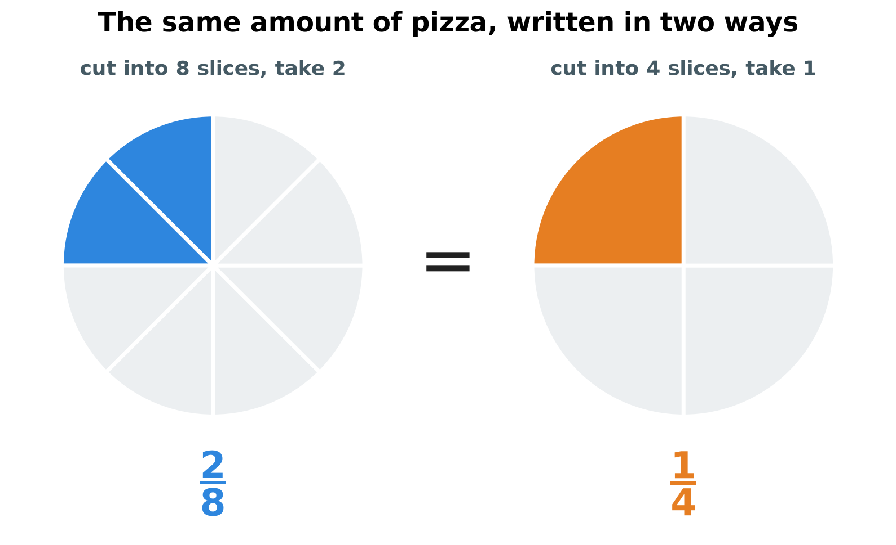
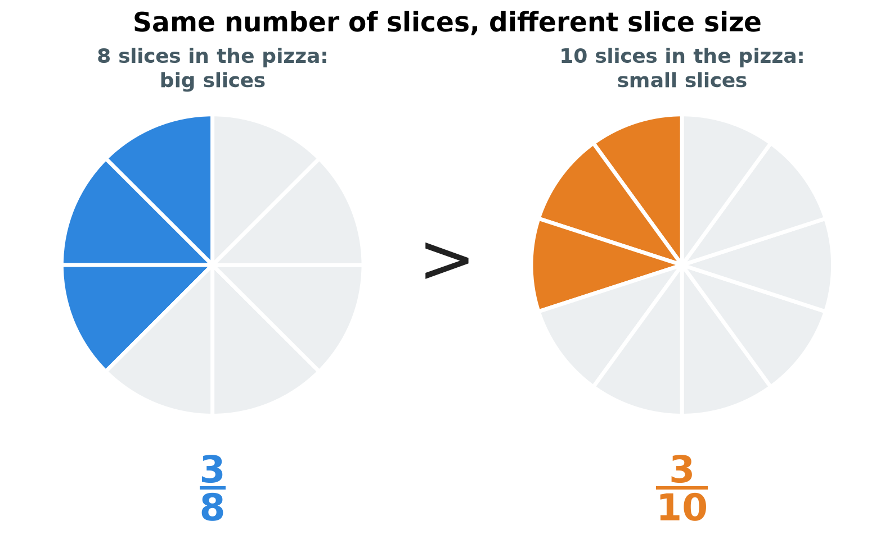
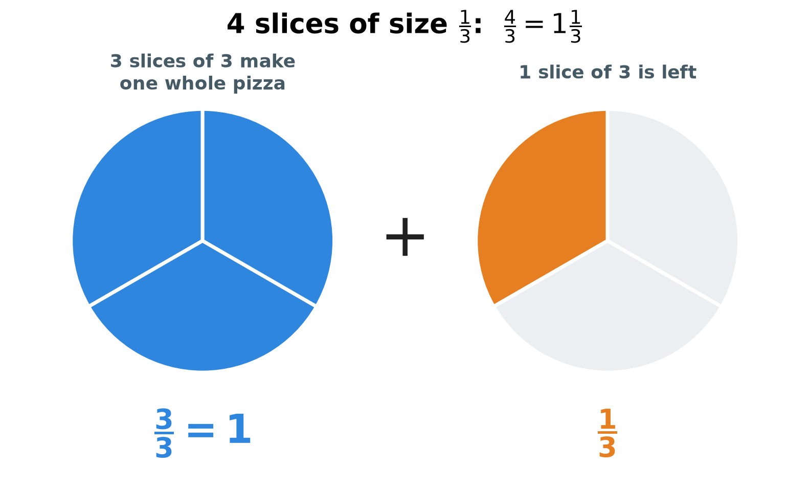
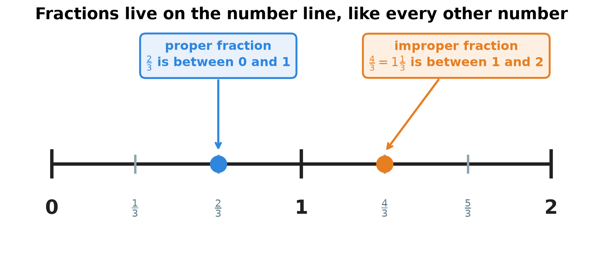
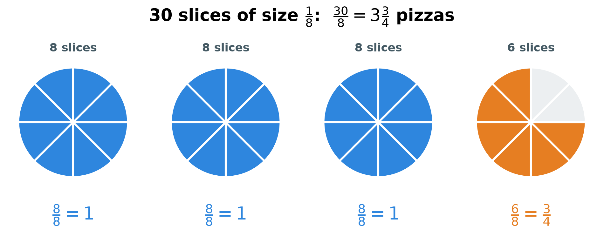

# 1. Fractions

**What this chapter teaches**
How a division turns into a fraction, what the two numbers in a fraction mean, how to write
the same amount in different ways, how to compare two fractions, and how to move between
improper fractions and mixed numbers.

**Before you start**
This is the first chapter of the book. You need nothing except adding, subtracting,
multiplying and dividing whole numbers.

---

## Table of contents

1. [Division and its three names](#1-division-and-its-three-names)
2. [What a fraction is](#2-what-a-fraction-is)
3. [The same amount, written in different ways](#3-the-same-amount-written-in-different-ways)
4. [Comparing two fractions](#4-comparing-two-fractions)
5. [Improper fractions and mixed numbers](#5-improper-fractions-and-mixed-numbers)
6. [A full example: the pizza party](#6-a-full-example-the-pizza-party)
7. [Glossary](#7-glossary)
8. [Check your understanding](#8-check-your-understanding)
9. [Important notes](#9-important-notes)

---

## 1. Division and its three names

### 1.1 Division means sharing into equal parts

Division splits a total into **equal** parts. That is the whole idea.

You have $15$ sweets. You share them between $5$ children. Every child gets the same number
of sweets. Each child gets $3$:

$$
15 \div 5 = 3
$$

We can check the answer by multiplying back. If $5$ children get $3$ sweets each, that is
$5 \times 3 = 15$ sweets. The total is correct.

### 1.2 The three names

Every division has three numbers, and each one has a name.

**Definition.** In $15 \div 5 = 3$:

* $15$ is the **dividend** — the total that we split.
* $5$ is the **divisor** — how many equal parts we make.
* $3$ is the **quotient** — the answer, the size of one part.

Learn these three words now. We use them in every later section of this chapter.

### 1.3 What happens when the divisor is bigger

In the example above the answer was a whole number. That does not always happen.

Now you have $1$ pizza and $8$ hungry friends. You still want equal parts:

$$
1 \div 8 = \;?
$$

Nobody can get a whole pizza, because there is only one pizza and there are eight people.
So the answer must be **smaller than $1$**. It cannot be $0$ either, because everybody does
get some pizza.

The answer is a number between $0$ and $1$. Whole numbers cannot say this. We need a new
kind of number. That number is a **fraction**.

**Note.** A fraction is not a new operation. It is the *answer* to a division that does not
come out even.

### Summary of section 1

* Division splits a total into equal parts.
* The **dividend** is the total, the **divisor** is the number of parts, the **quotient** is
  the answer.
* When the divisor is bigger than the dividend, the answer is smaller than $1$.
* A number smaller than $1$ but bigger than $0$ is written as a fraction.

---

## 2. What a fraction is

### 2.1 One pizza, eight slices

Cut one pizza into $8$ equal slices. Now take $2$ of them.

    

**Figure 1 — The whole pizza is cut into $8$ equal slices, so $8$ is the bottom number. We
took $2$ slices, so $2$ is the top number. Together they say $\frac{2}{8}$.**

The picture shows both numbers of a fraction:

* the pizza is cut into $8$ equal slices — this is the number **under** the line;
* you took $2$ slices — this is the number **above** the line.

We write it like this:

$$
\frac{2}{8}
$$

**Definition.** The number above the line is the **numerator**. It counts how many parts you
take.

**Definition.** The number under the line is the **denominator**. It says into how many equal
parts one whole was cut.

The general form of a fraction is:

$$
\frac{a}{b}
$$

* $a$ — the numerator, how many parts you take.
* $b$ — the denominator, how many equal parts make one whole.
* The line between them means "divided by".

**Warning.** The parts must be **equal**. If you cut a pizza into one huge piece and seven
tiny ones, you cannot call one tiny piece $\frac{1}{8}$ of the pizza.

### 2.2 A fraction is a division

Look again at the question from section 1.3: one pizza shared between eight friends.

Each friend gets one slice out of eight, which is $\frac{1}{8}$ of the pizza. So the answer
to $1 \div 8$ is $\frac{1}{8}$.

This is the most useful thing to remember about fractions:

$$
a \div b = \frac{a}{b}
$$

In words: the fraction bar *is* a division sign. The dividend goes on top. The divisor goes
below.

### 2.3 When the parts build the whole back

If you eat all $8$ slices, you ate $\frac{8}{8}$ of the pizza. But all eight slices together
are exactly one pizza. So:

$$
\frac{8}{8} = 1
$$

This works for any denominator. Three thirds are one whole. Ten tenths are one whole:

$$
\frac{3}{3} = 1 \qquad \frac{10}{10} = 1
$$

**Explanation.** Why is this true? Because $\frac{8}{8}$ means $8 \div 8$, and any number
divided by itself is $1$. The picture and the arithmetic agree.

### 2.4 Proper fractions

**Definition.** A **proper fraction** is a fraction where the numerator is smaller than the
denominator. For example $\frac{1}{8}$, $\frac{2}{8}$ and $\frac{3}{4}$.

A proper fraction is always more than $0$ and less than $1$. The reason is simple: you take
fewer parts than the whole has, so you do not have the whole.

### Summary of section 2

* A fraction says how many equal parts of one whole you have.
* The **numerator** (top) counts the parts you take.
* The **denominator** (bottom) counts the equal parts in one whole.
* The fraction bar means division: $\frac{a}{b}$ is the same as $a \div b$.
* When the top and the bottom are the same number, the fraction equals $1$.
* A **proper fraction** has a smaller top than bottom, so its value is between $0$ and $1$.

---

## 3. The same amount, written in different ways

### 3.1 Two fractions, one amount

Take two pizzas of the same size. Cut the first one into $8$ slices and take $2$ slices.
Cut the second one into $4$ slices and take $1$ slice.

    

*Figure 2 — The blue area and the orange area cover the same part of the pizza. Two small
slices are exactly as much food as one big slice.*

You hold the same amount of pizza in both hands. So the two fractions are the same number:

$$
\frac{2}{8} = \frac{1}{4}
$$

**Definition.** **Equivalent fractions** are fractions that look different but have the same
value.

### 3.2 The rule: do the same thing to the top and to the bottom

Why did $\frac{2}{8}$ and $\frac{1}{4}$ come out equal? Look at what changed. The number of
slices in the pizza went from $8$ down to $4$ — half as many. The number of slices you took
went from $2$ down to $1$ — also half as many. Both numbers were divided by $2$.

That is the rule for the whole section:

$$
\frac{a}{b} = \frac{a \times c}{b \times c} = \frac{a \div c}{b \div c}
$$

* $a$ — the numerator you start with.
* $b$ — the denominator you start with.
* $c$ — any number you choose, but not $0$.
* $\times$ means multiply, $\div$ means divide.

In words: if you multiply the top and the bottom by the same number, the value does not
change. If you divide the top and the bottom by the same number, the value does not change
either.

**Explanation.** Multiplying the denominator by $c$ cuts every slice into $c$ smaller pieces,
so the pieces get smaller. Multiplying the numerator by $c$ gives you $c$ times as many of
those small pieces. The two changes cancel each other, and the amount of food stays the same.

### 3.3 Simplifying a fraction

**Definition.** To **simplify** a fraction (also called *reducing* it) means to write it with
the smallest possible numbers, without changing its value.

Here are the steps.

1. Find a number that divides the numerator and the denominator evenly.
2. Divide both of them by that number.
3. Repeat until only $1$ divides both numbers evenly.

**Example.** Simplify $\frac{2}{8}$.

Both $2$ and $8$ can be divided by $2$:

$$
\frac{2}{8} = \frac{2 \div 2}{8 \div 2} = \frac{1}{4}
$$

Now only $1$ divides both $1$ and $4$. We are finished. The simplest form is $\frac{1}{4}$.

**Example.** Simplify $\frac{6}{8}$.

Both $6$ and $8$ can be divided by $2$:

$$
\frac{6}{8} = \frac{6 \div 2}{8 \div 2} = \frac{3}{4}
$$

Only $1$ divides both $3$ and $4$, so $\frac{3}{4}$ is the answer.

**Warning.** The number you choose must divide **both** numbers with nothing left over. You
cannot simplify $\frac{3}{4}$ with $2$, because $3 \div 2$ is not a whole number.

**Note.** Simplifying never changes the amount. $\frac{6}{8}$ and $\frac{3}{4}$ are the same
quantity of pizza. Small numbers are only easier to read and to work with.

### Summary of section 3

* Different fractions can have the same value. These are **equivalent fractions**.
* Multiply the top and the bottom by the same number, and the value stays the same.
* Divide the top and the bottom by the same number, and the value stays the same.
* **Simplifying** means dividing both numbers until nothing but $1$ divides them.
* $\frac{2}{8} = \frac{1}{4}$ and $\frac{6}{8} = \frac{3}{4}$.

---

## 4. Comparing two fractions

### 4.1 When the denominators are the same

This case is easy. The denominators are the same, so all the slices have the same size. Then
more slices simply means more food.

Compare $\frac{5}{12}$ and $\frac{7}{12}$. Both pizzas were cut into $12$ equal slices. One
plate holds $5$ slices, the other holds $7$. So:

$$
\frac{5}{12} < \frac{7}{12}
$$

**Note.** The symbol $<$ means "is smaller than". The symbol $>$ means "is bigger than". The
open side always points to the bigger number.

### 4.2 When the numerators are the same

This case surprises many people. Compare $\frac{3}{8}$ and $\frac{3}{10}$. Both plates hold
$3$ slices. But the slices are not the same size.

*Figure 3 — Both plates hold $3$ slices. The left pizza was cut into $8$ slices, so its
slices are big. The right pizza was cut into $10$ slices, so its slices are small. Three big
slices are more food than three small slices.*

The pizza on the left was cut into fewer parts, so each part is bigger:

$$
\frac{3}{8} > \frac{3}{10}
$$

**Explanation.** The denominator says into how many parts one whole was cut. Cut a pizza into
more parts and every part becomes smaller. So a **bigger denominator makes smaller slices**.
When the number of slices is the same, the fraction with the smaller denominator wins.

**Warning.** Do not think "$10$ is bigger than $8$, so $\frac{3}{10}$ is bigger". The
denominator counts pieces, not food. More pieces means each piece is smaller.

### Summary of section 4

* Same denominator: the fraction with the bigger numerator is bigger.
* Same numerator: the fraction with the **smaller** denominator is bigger.
* A bigger denominator always means smaller parts.
* $\frac{5}{12} < \frac{7}{12}$ and $\frac{3}{8} > \frac{3}{10}$.

---

## 5. Improper fractions and mixed numbers

### 5.1 When the numerator is the bigger number

Until now the numerator was smaller than the denominator, and we always stayed inside one
pizza. Now let us break that limit.

Cut pizzas into $3$ equal slices each. Collect $4$ slices. Every slice is $\frac{1}{3}$ of a
pizza, so you hold $\frac{4}{3}$ of a pizza.

*Figure 4 — Three of the four slices build one complete pizza. The fourth slice is left over.
So $\frac{4}{3}$ is one whole pizza and one third more.*

We know from section 2.3 that $\frac{3}{3} = 1$. Three of your four slices make one whole
pizza. One slice is still in your hand. So you have more than one pizza and less than two.

**Definition.** An **improper fraction** is a fraction where the numerator is bigger than the
denominator, or equal to it. For example $\frac{4}{3}$, $\frac{30}{8}$ and $\frac{8}{8}$. Its
value is always $1$ or more.

**Definition.** A **mixed number** is a whole number written together with a proper fraction.
For example $1\frac{1}{3}$. We read it as "one and one third".

The same amount, in the two ways of writing it:

$$
\frac{4}{3} = 1\frac{1}{3}
$$

**Note.** There is no hidden multiplication in $1\frac{1}{3}$. The whole number and the
fraction are **added**: $1\frac{1}{3}$ means $1 + \frac{1}{3}$.

### 5.2 Both kinds of fraction on the number line

A fraction is a number, so it has its own place on the number line, exactly like $1$ or $2$.

*Figure 5 — Each step between two ticks is $\frac{1}{3}$. The proper fraction $\frac{2}{3}$
sits before $1$. The improper fraction $\frac{4}{3}$ sits after $1$, one third past it.*

The picture makes the difference easy to see:

* a **proper fraction** always sits between $0$ and $1$;
* an **improper fraction** sits at $1$ or after it;
* a **mixed number** is only another name for a point after $1$: $\frac{4}{3}$ and
  $1\frac{1}{3}$ are the same point on the line.

### 5.3 Turning an improper fraction into a mixed number

The question behind this is always the same: **how many whole pizzas can I build, and what is
left over?** Division answers that question.

Here are the steps.

1. Divide the numerator by the denominator.
2. The whole-number part of the answer becomes the whole number of the mixed number.
3. What is left over — the **remainder** — becomes the new numerator.
4. The denominator does not change.
5. Simplify the fraction part if you can.

As a formula:

$$
\frac{N}{D} = W\frac{R}{D} \qquad \text{where} \qquad N = (W \times D) + R
$$

* $N$ — the numerator you start with (all your slices).
* $D$ — the denominator (slices in one whole pizza).
* $W$ — the whole number, how many complete pizzas you can build.
* $R$ — the remainder, the slices that are left over.

**Example.** Turn $\frac{30}{8}$ into a mixed number.

You have $30$ slices, and $8$ slices make one pizza.

Step 1 — divide $30$ by $8$. It goes in $3$ times, because $3 \times 8 = 24$, and
$4 \times 8 = 32$ is already too much.

Step 2 — the whole number is $3$.

Step 3 — find the remainder:

$$
30 - 24 = 6
$$

So $6$ slices are left over, and the mixed number so far is $3\frac{6}{8}$.

Step 4 — simplify the fraction part. Both $6$ and $8$ divide by $2$:

$$
\frac{6}{8} = \frac{6 \div 2}{8 \div 2} = \frac{3}{4}
$$

The answer:

$$
\frac{30}{8} = 3\frac{3}{4}
$$

### 5.4 Turning a mixed number into an improper fraction

Now we go the other way. The question is: **how many slices do I have in total?**

Here are the steps.

1. Multiply the whole number by the denominator. This counts the slices inside the whole
   pizzas.
2. Add the numerator. These are the extra slices.
3. Write the total over the same denominator.

As a formula:

$$
W\frac{N}{D} = \frac{(W \times D) + N}{D}
$$

* $W$ — the whole number.
* $N$ — the numerator of the fraction part.
* $D$ — the denominator; it stays the same all the way through.

**Example.** Turn $4\frac{3}{8}$ into an improper fraction.

Step 1 — four whole pizzas, $8$ slices in each:

$$
4 \times 8 = 32
$$

Step 2 — add the $3$ extra slices:

$$
32 + 3 = 35
$$

Step 3 — write the total over $8$:

$$
4\frac{3}{8} = \frac{35}{8}
$$

**Warning.** Multiply first, then add. If you add $4 + 3$ first, the answer is wrong, because
$4$ counts whole pizzas and $3$ counts single slices. They are different sizes, so they
cannot be added directly.

### Summary of section 5

* An **improper fraction** has a numerator bigger than the denominator, or equal to it. Its
  value is $1$ or more.
* A **mixed number** is a whole number plus a proper fraction, like $1\frac{1}{3}$.
* Improper fraction to mixed number: divide, keep the whole part, put the remainder on top.
* Mixed number to improper fraction: multiply the whole number by the denominator, then add
  the numerator.
* The two forms are the same number, in the same place on the number line.

---

## 6. A full example: the pizza party

This example uses everything from the chapter at once.

**The problem.** You invite $10$ friends. Each friend wants $3$ slices of pizza. The pizza
shop cuts every pizza into $8$ slices. How many pizzas do you order?

**Step 1 — count the slices you need.**

$$
10 \times 3 = 30
$$

You need $30$ slices.

**Step 2 — write the slices as a fraction of a pizza.**

One slice is $\frac{1}{8}$ of a pizza, so $30$ slices are:

$$
\frac{30}{8}
$$

**Step 3 — turn the improper fraction into a mixed number.**

This is exactly the example from section 5.3:

$$
\frac{30}{8} = 3\frac{3}{4}
$$

*Figure 6 — The $30$ slices fill three pizzas completely and leave $6$ slices on the fourth
one. Six slices out of eight are $\frac{3}{4}$ of a pizza.*

**Step 4 — decide what to order.**

The shop sells whole pizzas, not $\frac{3}{4}$ of a pizza. You need more than $3$ pizzas, so
$3$ is not enough. You order $4$ pizzas.

**Step 5 — check the leftovers.**

Four pizzas hold:

$$
4 \times 8 = 32
$$

Your friends eat $30$ slices:

$$
32 - 30 = 2
$$

Two slices are left over. That is $\frac{2}{8}$ of a pizza, which simplifies to $\frac{1}{4}$.

**Note.** See why the mixed number was the useful form here. The improper fraction
$\frac{30}{8}$ is correct, but $3\frac{3}{4}$ tells you at once that three pizzas are not
enough and four are.

### Summary of section 6

* Real problems often end in an improper fraction.
* The mixed number shows the answer as whole things plus a rest.
* When you can only buy whole items, you go up to the next whole number.
* $30$ slices are $\frac{30}{8} = 3\frac{3}{4}$ pizzas, so you order $4$ and $2$ slices stay.

---

## 7. Glossary

* **Dividend** — the total amount that you divide.
* **Divisor** — the number of equal parts you divide the total into.
* **Quotient** — the answer of a division.
* **Fraction** — a number written as one whole number over another, like $\frac{a}{b}$. It
  means $a \div b$, and it counts equal parts of one whole.
* **Numerator** — the top number of a fraction; how many parts you take.
* **Denominator** — the bottom number of a fraction; how many equal parts make one whole.
* **Proper fraction** — a fraction with a numerator smaller than the denominator; its value
  is between $0$ and $1$.
* **Improper fraction** — a fraction with a numerator bigger than the denominator or equal to
  it; its value is $1$ or more.
* **Mixed number** — a whole number written together with a proper fraction, like
  $1\frac{1}{3}$; the two are added.
* **Equivalent fractions** — fractions that look different but have the same value, like
  $\frac{2}{8}$ and $\frac{1}{4}$.
* **Simplify (reduce)** — to divide the numerator and the denominator by the same number
  until only $1$ divides both.
* **Remainder** — what is left over after a division, when the division does not come out
  even.

---

## 8. Check your understanding

Try each question before you open the answer.

**Question 1.** Say whether each one is a proper fraction, an improper fraction or a mixed
number: $\frac{7}{10}$, $\frac{11}{4}$, $2\frac{3}{5}$.

Answer

* $\frac{7}{10}$ — a **proper fraction**, because $7$ is smaller than $10$. Its value is
  between $0$ and $1$.
* $\frac{11}{4}$ — an **improper fraction**, because $11$ is bigger than $4$. Its value is
  more than $1$.
* $2\frac{3}{5}$ — a **mixed number**: the whole number $2$ together with the proper fraction
  $\frac{3}{5}$.

**Question 2.** Simplify $\frac{4}{12}$ and $\frac{10}{15}$.

Answer

For $\frac{4}{12}$, both numbers divide by $4$:

$$
\frac{4}{12} = \frac{4 \div 4}{12 \div 4} = \frac{1}{3}
$$

For $\frac{10}{15}$, both numbers divide by $5$:

$$
\frac{10}{15} = \frac{10 \div 5}{15 \div 5} = \frac{2}{3}
$$

**Question 3.** Put $<$, $>$ or $=$ between each pair: $\frac{4}{9}$ and $\frac{4}{7}$; then
$\frac{5}{12}$ and $\frac{7}{12}$.

Answer

$$
\frac{4}{9} < \frac{4}{7}
$$

Both fractions take $4$ parts. The pizza cut into $7$ parts has bigger parts than the pizza
cut into $9$ parts, so $\frac{4}{7}$ is more (section 4.2).

$$
\frac{5}{12} < \frac{7}{12}
$$

Here the parts have the same size, so $7$ parts are more than $5$ parts (section 4.1).

**Question 4.** Write $\frac{14}{5}$ and $\frac{18}{4}$ as mixed numbers.

Answer

For $\frac{14}{5}$: five goes into fourteen $2$ times, because $2 \times 5 = 10$. The
remainder is $14 - 10 = 4$. So:

$$
\frac{14}{5} = 2\frac{4}{5}
$$

Nothing but $1$ divides both $4$ and $5$, so this is finished.

For $\frac{18}{4}$: four goes into eighteen $4$ times, because $4 \times 4 = 16$. The
remainder is $18 - 16 = 2$. So we get $4\frac{2}{4}$. Now simplify the fraction part, because
both $2$ and $4$ divide by $2$:

$$
\frac{2}{4} = \frac{2 \div 2}{4 \div 2} = \frac{1}{2}
$$

$$
\frac{18}{4} = 4\frac{1}{2}
$$

**Question 5.** Write $3\frac{2}{7}$ and $5\frac{1}{2}$ as improper fractions.

Answer

For $3\frac{2}{7}$: multiply first, $3 \times 7 = 21$. Then add the numerator,
$21 + 2 = 23$. Keep the denominator:

$$
3\frac{2}{7} = \frac{23}{7}
$$

For $5\frac{1}{2}$: multiply first, $5 \times 2 = 10$. Then add, $10 + 1 = 11$:

$$
5\frac{1}{2} = \frac{11}{2}
$$

**Question 6.** You cut a cake into $8$ equal pieces and eat $2$ of them. Your friend cuts a
cake of the same size into $4$ equal pieces and eats $1$. Who ate more?

Answer

Nobody. You ate $\frac{2}{8}$ and your friend ate $\frac{1}{4}$. These are equivalent
fractions, because dividing the top and the bottom of $\frac{2}{8}$ by $2$ gives
$\frac{1}{4}$ (section 3.1). You both ate the same amount.

---

## 9. Important notes

**The three mistakes that cost the most marks.**

* **"A bigger denominator means a bigger fraction."** It means the opposite. The denominator
  cuts the whole into parts, so a bigger denominator makes each part smaller. That is why
  $\frac{3}{8}$ is more than $\frac{3}{10}$.
* **Adding instead of multiplying in a mixed number.** In $4\frac{3}{8}$ the $4$ counts whole
  pizzas and the $3$ counts single slices. Change the pizzas into slices first
  ($4 \times 8 = 32$), and only then add the $3$.
* **Forgetting to simplify.** $3\frac{6}{8}$ is not a wrong answer, but it is not finished.
  Always check whether one number divides both the top and the bottom.

**The two ideas to keep.**

* The fraction bar is a division sign. Everything else in this chapter follows from that.
* Whatever you do to the top, do to the bottom. This one rule gives you equivalent fractions
  and simplifying at the same time.

**How this chapter connects to the rest of the book.**
This is the first chapter, so there is nothing behind it yet. It is the base for everything
that comes after it: fractions come back in every later part of mathematics.

---

- [Back to the book](./../README.md)
- Previous: this is the first chapter.
- Next: not written yet.
