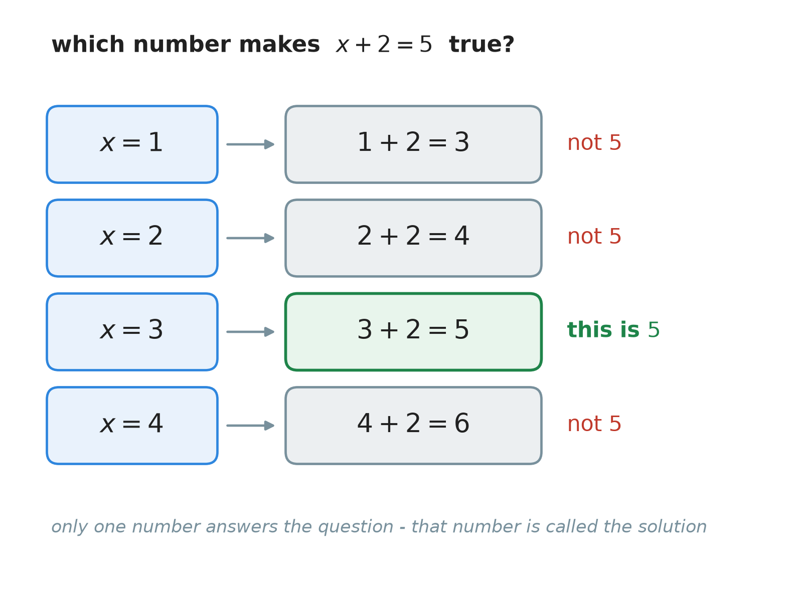
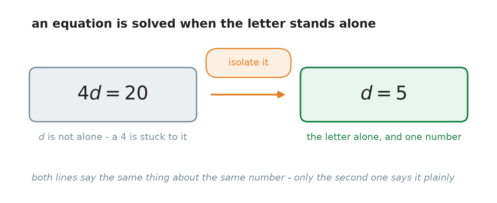
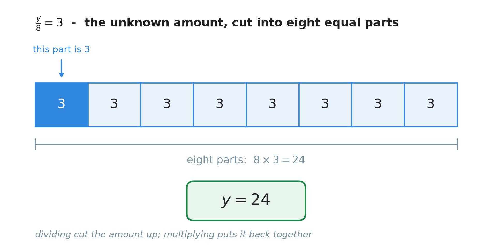
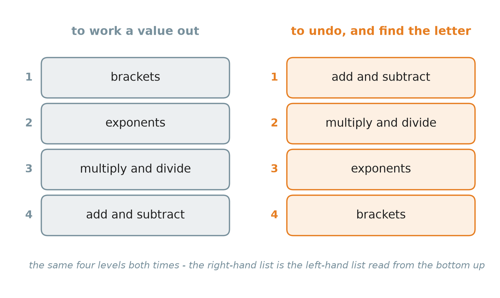
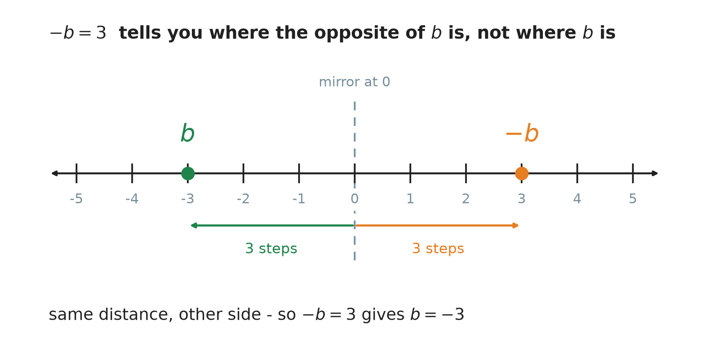
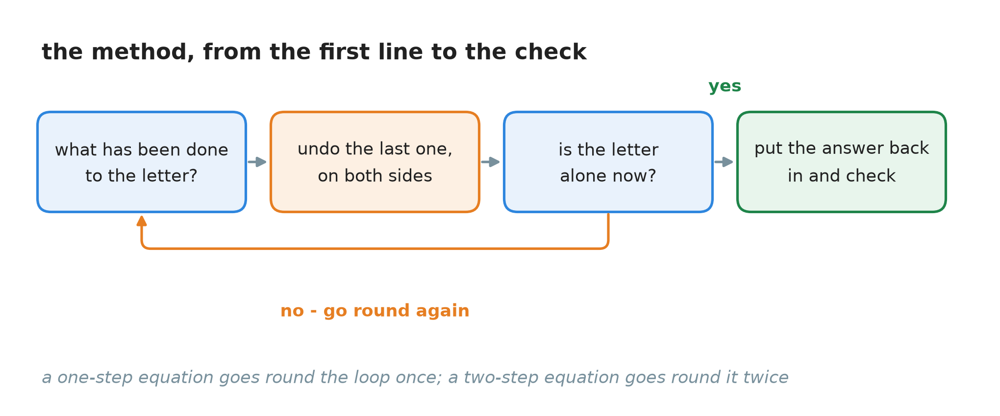

# 20. Solving equations

**What this chapter teaches**
How to find the number that a letter stands for. You will learn what a solution is, the four
moves that keep an equation true, how to undo each of the four operations, and what to do when
the letter is left with a minus sign in front of it.

**Before you start**
This chapter continues
[Chapter 18, section 7](./../18_Introduction_To_Algebra_Variables/18_Introduction_To_Algebra_Variables.md#7-reading-a-rule-backwards),
which solved its first equation, and
[Chapter 19, section 7](./../19_The_Number_Properties_Of_Algebra/19_The_Number_Properties_Of_Algebra.md#7-the-two-ways-of-cancelling),
which explained why that worked. It also uses inverse operations from
[Chapter 8, section 1.1](./../8_Dividing_Large_Numbers/8_Dividing_Large_Numbers.md#11-small-divisions-are-times-tables-read-backwards),
negative numbers from
[Chapter 9](./../9_Negative_Numbers/9_Negative_Numbers.md),
and the order of operations from
[Chapter 11, section 2](./../11_The_Order_Of_Operations/11_The_Order_Of_Operations.md#2-the-agreed-order).

---

## Table of contents

1. [What an equation asks](#1-what-an-equation-asks)
2. [The rule that keeps an equation true](#2-the-rule-that-keeps-an-equation-true)
3. [Undoing what was done to the letter](#3-undoing-what-was-done-to-the-letter)
4. [The four one-step equations](#4-the-four-one-step-equations)
5. [More than one step](#5-more-than-one-step)
6. [When the letter is left negative](#6-when-the-letter-is-left-negative)
7. [The method in one place](#7-the-method-in-one-place)
8. [Glossary](#8-glossary)
9. [Check your understanding](#9-check-your-understanding)
10. [Important notes](#10-important-notes)

---

## 1. What an equation asks

### 1.1 An equation is a question

[Chapter 18, section 4.2](./../18_Introduction_To_Algebra_Variables/18_Introduction_To_Algebra_Variables.md#42-an-equation-is-a-sentence)
said that an equation is two expressions with an equals sign between them. Here is one:

$$
x + 2 = 5
$$

Read as a statement it says: some number, plus $2$, is $5$.

Read as a question it says: **which number?**

That is the difference between an expression and an equation. You cannot be right or wrong about
$x + 2$ — it is only a phrase, and it waits for a value. But $x + 2 = 5$ makes a claim, and a
claim can be true or false. Put a number in and find out.

    

**Figure 1 — Four numbers tried, one at a time. Three of them make the left side something
other than $5$, so the equation is false for those three. Only $x = 3$ makes both sides $5$.**

### 1.2 The number that makes it true

> **Definition — solution.** The **solution** of an equation is a value for the letter that makes
> the two sides equal. Put it in, and the equation becomes a true statement.

> **Definition — solving an equation.** To **solve** an equation is to find its solution.

**Note — the solution is already there.** This is worth sitting with for a moment. The equation
$x + 2 = 5$ is *about* one particular number from the first moment you write it down. Nothing you
do afterwards creates that number or changes it. Your steps only change the way it is written,
until it is written plainly.

So these two lines are about the same number:

$$
x + 2 = 5
$$

$$
x = 3
$$

The first one describes it in a roundabout way. The second one says it. That is exactly the shift
[Chapter 19, section 1.2](./../19_The_Number_Properties_Of_Algebra/19_The_Number_Properties_Of_Algebra.md#12-so-the-word-simplify-changes-its-meaning)
described for expressions: the value stays, the writing changes. Solving is that same idea
applied to a whole equation.

### 1.3 Why guessing is not a method

You can find $x + 2 = 5$ in your head. You probably did, before figure 1 finished.

Now try these three:

$$
\frac{y}{8} = 3
$$

$$
4 - b = 7
$$

$$
7x - 43 = 1000
$$

The first is slower. The second catches most people out. On the third you would be guessing all
afternoon, and the answer is $x = 149$.

There is nothing wrong with seeing an easy answer. But you cannot build on it, because it stops
working exactly when the problem gets interesting. So this chapter builds a method that never
looks at the answer — it works with what has been *done* to the letter. Practise it on the easy
equations, where you can already see the answer, and it will be ready for the hard ones.

### Summary of section 1

* An expression waits. An equation makes a claim, so it asks a question.
* The **solution** is the value of the letter that makes both sides equal.
* **Solving** means finding it.
* The solution does not change while you work. Only the way it is written changes.
* Guessing works on small equations and stops working on everything else.

---

## 2. The rule that keeps an equation true

### 2.1 One rule, which you already have

[Chapter 18, section 4.3](./../18_Introduction_To_Algebra_Variables/18_Introduction_To_Algebra_Variables.md#43-the-equals-sign-is-a-balance-not-an-arrow)
drew the equals sign as a pair of scales, and
[section 7.3](./../18_Introduction_To_Algebra_Variables/18_Introduction_To_Algebra_Variables.md#73-doing-the-same-thing-to-both-sides)
turned that picture into the rule this whole chapter runs on:

> **the rule of both sides.** You may do anything to an equation as long as you do exactly the
> same thing to **both** of its sides.

Take weight off one pan and the beam tips. Take the same weight off both pans and it stays level.

What is new here is not the rule. It is that the rule has four named forms, one for each of the
four operations, and knowing the names makes it possible to say *which* move you just made.

### 2.2 The four properties of equality

> **Definition — the properties of equality.** Four rules saying which moves keep an equation
> true. They are the rule of both sides, written out one operation at a time.

Suppose you have an equation. Call whatever is on the left $A$, and whatever is on the right $B$.
So $A = B$. Now choose any number $c$. Then all four of these are still true:

$$
A + c = B + c
$$

$$
A - c = B - c
$$

$$
A \times c = B \times c
$$

$$
\frac{A}{c} = \frac{B}{c}
$$

* $A$ — everything on the left of the equals sign.
* $B$ — everything on the right of the equals sign.
* $c$ — any number you like to choose. You pick it; nobody gives it to you.

In words: if two things are the same size, then adding the same amount to both keeps them the
same size. So does taking the same amount off both, doubling both, or halving both.

Here it is with real numbers, starting from something obviously true:

$$
7 = 7
$$

$$
7 + 3 = 7 + 3 \quad \text{gives} \quad 10 = 10
$$

$$
7 \times 3 = 7 \times 3 \quad \text{gives} \quad 21 = 21
$$

Both lines are still true. That is all the properties of equality say.

| The property | What it lets you do |
| --- | --- |
| Addition property of equality | add the same number to both sides |
| Subtraction property of equality | subtract the same number from both sides |
| Multiplication property of equality | multiply both sides by the same number |
| Division property of equality | divide both sides by the same number, as long as it is not $0$ |

> **Warning — never divide by $0$.** The division property carries the condition $c \neq 0$
> because dividing by zero has no answer at all, for the reason given in
> [Chapter 16, section 6.2](./../16_Multiplying_And_Dividing_Fractions/16_Multiplying_And_Dividing_Fractions.md#62-why-dividing-by-zero-has-no-answer).

**Note — and never multiply by $0$ either.** Multiplying both sides by $0$ is allowed: it turns
any equation into $0 = 0$, which is perfectly true. It is just useless. Every trace of the letter
is gone, and with it the question. A legal move is not always a helpful one.

### 2.3 Permission is not the same as purpose

The properties of equality tell you what you are *allowed* to do. They do not tell you what is
*worth* doing. You could add $1000$ to both sides of every equation you meet and stay perfectly
correct for ever, without ever finding the letter.

[Chapter 19, section 7.4](./../19_The_Number_Properties_Of_Algebra/19_The_Number_Properties_Of_Algebra.md#74-what-the-inverses-are-actually-for)
gave the other half. You choose $c$ so that the unwanted operation turns into $0$ or into $1$ —
and then that $0$ or $1$ disappears, because adding $0$ and multiplying by $1$ change nothing.

So every step in this chapter has two reasons behind it, and they answer two different questions:

| Question | Answered by |
| --- | --- |
| May I do this? | a property of equality (this chapter) |
| Why is it worth doing? | an inverse making an identity element (Chapter 19) |

You will see both at work in every example in section 4.

### Summary of section 2

* You may do anything to an equation if you do the same thing to both sides.
* The four **properties of equality** are that one rule, written once per operation.
* $c$ is yours to choose. Choosing it well is the whole skill.
* Never divide both sides by $0$, and never multiply both sides by $0$.
* A property says a move is legal. An inverse says why the move helps.

---

## 3. Undoing what was done to the letter

### 3.1 Two pairs, and each one undoes the other

[Chapter 8, section 1.1](./../8_Dividing_Large_Numbers/8_Dividing_Large_Numbers.md#11-small-divisions-are-times-tables-read-backwards)
defined **inverse operations**: two operations are inverse when each one undoes the other, and it
showed the pair multiplication and division. Addition and subtraction are the other pair. Walk
three steps forward and three steps back, and you are where you started — which is
[Chapter 9, section 4.1](./../9_Negative_Numbers/9_Negative_Numbers.md#41-every-calculation-is-a-walk-along-the-line)'s
walk along the number line.

That is the whole toolbox:

| What was done to the letter | What undoes it |
| --- | --- |
| $a$ was added | subtract $a$ |
| $a$ was subtracted | add $a$ |
| it was multiplied by $a$ | divide by $a$ |
| it was divided by $a$ | multiply by $a$ |

> **Warning — the inverse, not the same one again.** If the equation says $n - 4 = 17$, the $4$
> was **subtracted**, so you **add** $4$. Subtracting $4$ a second time takes you further away,
> not closer. This is the single commonest mistake in the whole subject, and section 9, question
> 7 is built on it.

### 3.2 What you are aiming at

Every undoing has the same target.

> **Definition — isolating the variable.** To **isolate** the variable is to get the letter
> standing alone on one side of the equals sign, with a single number on the other side. When the
> letter is isolated, the equation is solved, because it now reads as the answer.

    

**Figure 2 — The card on the left is true. It is simply not an answer yet, because $d$ still has
a $4$ attached to it. The card on the right says the same thing about the same number, and this
time it says it plainly. Everything in this chapter is the orange arrow.**

**Note — either side is fine.** $d = 5$ and $5 = d$ say exactly the same thing, as
[Chapter 18, section 7.3](./../18_Introduction_To_Algebra_Variables/18_Introduction_To_Algebra_Variables.md#73-doing-the-same-thing-to-both-sides)
noted. "The same size" does not care which end you read from.

### Summary of section 3

* Addition and subtraction undo each other. So do multiplication and division.
* Look at the letter, ask what was done to it, and apply the **inverse** of that.
* Applying the same operation again is the commonest mistake there is.
* The goal is always the same: the letter alone on one side.

---

## 4. The four one-step equations

> **Definition — one-step equation.** An equation in which exactly one thing has been done to
> the letter, so exactly one move solves it.

There are four of them, because there are four operations. Each one is worked below in the same
four steps, so that the pattern is easier to see than the arithmetic.

### 4.1 Something was added: $x + 2 = 5$

**The equation.**

$$
x + 2 = 5
$$

**Step 1 — what has been done to $x$?** A $2$ has been **added** to it.

**Step 2 — undo it on both sides.** The inverse of adding $2$ is subtracting $2$. The subtraction
property of equality says this is allowed:

$$
x + 2 - 2 = 5 - 2
$$

**Step 3 — tidy each side.** On the left, $+2 - 2$ is $0$, and adding $0$ changes nothing:

$$
x + 0 = 3
$$

$$
x = 3
$$

**Step 4 — check.** Put $3$ back into the original equation:

$$
3 + 2 = 5
$$

The left side is $5$ and the right side is $5$. The solution is $x = 3$.

**Note.** Step 3 is
[Chapter 19, section 7](./../19_The_Number_Properties_Of_Algebra/19_The_Number_Properties_Of_Algebra.md#7-the-two-ways-of-cancelling)
happening in front of you. The $-2$ is the additive inverse of the $+2$, so together they make
$0$; and $0$ is the additive identity, so it then vanishes. Every example below does the same
thing, and this is the last time it will be spelled out.

### 4.2 Something was subtracted: $n - 4 = 17$

**The equation.**

$$
n - 4 = 17
$$

**Step 1 — what has been done to $n$?** A $4$ has been **subtracted** from it.

**Step 2 — undo it on both sides.** The inverse of subtracting $4$ is adding $4$, by the addition
property of equality:

$$
n - 4 + 4 = 17 + 4
$$

**Step 3 — tidy each side.** On the left, $-4 + 4$ is $0$. On the right, $17 + 4 = 21$:

$$
n = 21
$$

**Step 4 — check.**

$$
21 - 4 = 17
$$

Both sides are $17$. The solution is $n = 21$.

### 4.3 The letter was multiplied: $4d = 20$

**The equation.**

$$
4d = 20
$$

**Step 1 — what has been done to $d$?** It has been **multiplied** by $4$. Remember from
[Chapter 18, section 3.1](./../18_Introduction_To_Algebra_Variables/18_Introduction_To_Algebra_Variables.md#31-the-times-sign-gets-in-the-way)
that $4d$ means $4 \times d$ — the multiplication sign is simply left out.

**Step 2 — undo it on both sides.** The inverse of multiplying by $4$ is dividing by $4$, by the
division property of equality:

$$
\frac{4d}{4} = \frac{20}{4}
$$

**Step 3 — tidy each side.** On the left, $\frac{4}{4} = 1$, which leaves $1d$, and $1d$ is just
$d$. On the right, $\frac{20}{4} = 5$:

$$
1d = 5
$$

$$
d = 5
$$

**Step 4 — check.**

$$
4 \times 5 = 20
$$

Both sides are $20$. The solution is $d = 5$.

### 4.4 The letter was divided: $\frac{y}{8} = 3$

This is the shape that people find hardest, so look at it before doing anything to it.

$$
\frac{y}{8} = 3
$$

The fraction bar is a division sign, as
[Chapter 1, section 2.2](./../1_Fractions/1_Fractions.md#22-a-fraction-is-a-division)
said, so $\frac{y}{8}$ means $y \div 8$. The equation says: **some amount was cut into eight
equal parts, and one of those parts is $3$.**

    

**Figure 3 — The equation only told you about the dark part on the left. But all eight parts are
equal, so every one of them is $3$. Count them back up and you have the whole amount.**

The picture answers it: eight parts of $3$ each is $8 \times 3 = 24$. Now the same thing in
writing.

**Step 1 — what has been done to $y$?** It has been **divided** by $8$.

**Step 2 — undo it on both sides.** The inverse of dividing by $8$ is multiplying by $8$, by the
multiplication property of equality:

$$
\frac{y}{8} \times 8 = 3 \times 8
$$

**Step 3 — tidy each side.** On the left, cutting into $8$ parts and then taking $8$ of them
brings back what you started with. On the right, $3 \times 8 = 24$:

$$
y = 24
$$

**Step 4 — check.**

$$
\frac{24}{8} = 3
$$

Both sides are $3$. The solution is $y = 24$.

**Note — the answer got bigger, and that is correct.** It surprises people that undoing a
division makes the number grow. But $y$ was the *whole* amount and $3$ was only one eighth of it,
so of course the whole is larger. Figure 3 makes that impossible to doubt.

### 4.5 The check, every time

[Chapter 18, section 7.4](./../18_Introduction_To_Algebra_Variables/18_Introduction_To_Algebra_Variables.md#74-always-check-by-going-forwards-again)
introduced this habit for a rule. For an equation it works like this:

1. Take the **original** equation, not any of your working lines.
2. Substitute your answer everywhere the letter appears.
3. Work out the left side and the right side **separately**.
4. They must land on the same number.

**Note — why it has to be the original.** If you copied something down wrongly in line two, then
checking against line two will happily agree with your mistake. Only the first line is known to
be the real question.

This check is not a hint that you are probably right. It is the definition of a solution, done
one last time. If both sides agree, the answer *is* the solution, whatever route you took to get
there.

### 4.6 The four shapes in one table

| What the equation looks like | What was done to the letter | The move | Worked example | Answer |
| --- | --- | --- | --- | --- |
| $x + a = b$ | $a$ added | subtract $a$ from both sides | $x + 2 = 5$ | $x = 3$ |
| $x - a = b$ | $a$ subtracted | add $a$ to both sides | $n - 4 = 17$ | $n = 21$ |
| $ax = b$ | multiplied by $a$ | divide both sides by $a$ | $4d = 20$ | $d = 5$ |
| $\frac{x}{a} = b$ | divided by $a$ | multiply both sides by $a$ | $\frac{y}{8} = 3$ | $y = 24$ |

Four shapes, four moves, and the move is always the inverse of what you see.

### Summary of section 4

* A **one-step equation** has had exactly one thing done to the letter.
* The method never changes: name what was done, undo it on both sides, tidy up, check.
* $x + 2 = 5$ gives $x = 3$; $n - 4 = 17$ gives $n = 21$; $4d = 20$ gives $d = 5$;
  $\frac{y}{8} = 3$ gives $y = 24$.
* Undoing a division makes the number bigger, and that is right, not a slip.
* Always check against the **original** equation.

---

## 5. More than one step

### 5.1 Which one to undo first

When two things have been done to the letter, you have to choose which to undo first, and the
choice is not free.

[Chapter 18, section 7.2](./../18_Introduction_To_Algebra_Variables/18_Introduction_To_Algebra_Variables.md#72-undo-the-steps-last-one-first)
gave the rule with its machine picture: **undo the last step first.**

Think about getting dressed. Socks first, then shoes. To undo it you take the shoes off first,
because they went on last and they are on the outside. Nobody tries to pull a sock off through a
shoe.

The letter works the same way. The operation done **last** is the one sitting on the outside, and
it is the one you can reach.

### 5.2 The order of operations, turned round

How do you know which operation was done last? You already have the list.
[Chapter 11](./../11_The_Order_Of_Operations/11_The_Order_Of_Operations.md)
fixed the order in which a value is worked out: brackets, then exponents, then multiply and
divide, then add and subtract. So the operation done last is the one lowest on that list.

Which means the order for undoing is that same list, read from the bottom up.

    

**Figure 4 — The same four levels twice. On the left is the order you follow to work a value
out. On the right is the order you follow to undo one. It is not a second list to learn — it is
the first list, read from the bottom up.**

So when you solve an equation:

1. undo **adding and subtracting** first,
2. then **multiplying and dividing**,
3. then **exponents**,
4. then **brackets**.

**Note — you need the top two rows, for now.** Every equation in this chapter is built from
adding, subtracting, multiplying and dividing, so rows 1 and 2 are the ones you will actually
use. Equations with a power on the letter, or with a bracket that has to be opened first, are a
later chapter.

### 5.3 A two-step equation: $5x - 3 = 12$

**The equation.**

$$
5x - 3 = 12
$$

**Step 1 — what has been done to $x$?** Two things. It was multiplied by $5$, and then $3$ was
subtracted. The subtraction came last.

**Step 2 — undo the subtraction, on both sides.**

$$
5x - 3 + 3 = 12 + 3
$$

$$
5x = 15
$$

**Step 3 — now $x$ has only one thing left on it.** It is multiplied by $5$, so divide both sides
by $5$:

$$
\frac{5x}{5} = \frac{15}{5}
$$

$$
x = 3
$$

**Step 4 — check, in the original equation.**

$$
5(3) - 3 = 15 - 3 = 12
$$

Both sides are $12$. The solution is $x = 3$.

> **Warning — do not divide part of a side.** The tempting first move is to divide by $5$
> straight away, and then to write $x - 3 = \frac{12}{5}$. That line is **wrong**, and it gives
> $x = \frac{27}{5}$, which is $5.4$, not $3$. The division has to reach the $-3$ as well, not
> only the $5x$. A side of an equation is one thing, and whatever you do, you do to all of it.

**Note — dividing first is legal, just harder.** If you divide the whole of both sides by $5$,
you get $x - \frac{3}{5} = \frac{12}{5}$, and that is perfectly true: at $x = 3$ both sides come
to $\frac{12}{5}$. You would still reach $x = 3$ in the end. It is not an error — it is simply a
longer road with fractions on it. Undoing the addition and subtraction first is what keeps the
numbers whole.

### Summary of section 5

* When two things were done to the letter, undo the **last** one first.
* Shoes come off before socks.
* The undoing order is Chapter 11's order read from the bottom up: add and subtract, then
  multiply and divide, then exponents, then brackets.
* $5x - 3 = 12$ becomes $5x = 15$, then $x = 3$.
* Whatever you do to a side, you do to **all** of that side.

---

## 6. When the letter is left negative

### 6.1 An equation that fights back

**The equation.**

$$
4 - b = 7
$$

**Step 1 — what has been done to $b$?** Look carefully, because this one is easy to misread.
Using
[Chapter 19, section 2.4](./../19_The_Number_Properties_Of_Algebra/19_The_Number_Properties_Of_Algebra.md#24-the-safe-way-to-move-a-subtraction)'s
safe rewrite, the minus sign belongs to the $b$:

$$
4 - b = 4 + (-b) = -b + 4
$$

So two things happened: $b$ was turned into its opposite, and then $4$ was added. The addition
came last.

**Step 2 — undo the addition, on both sides.**

$$
4 - b - 4 = 7 - 4
$$

$$
-b = 3
$$

And here most people stop and write $b = 3$. That is wrong, and the check would catch it at once:
$4 - 3$ is $1$, not $7$.

### 6.2 $-b$ is not $b$

The line $-b = 3$ does not say that $b$ is $3$. It says that **the opposite of $b$** is $3$.

[Chapter 9, section 2.2](./../9_Negative_Numbers/9_Negative_Numbers.md#22-every-number-has-an-opposite)
showed what an opposite is: the same distance from $0$, on the other side of it. So if the
opposite of $b$ has landed on $3$, then $b$ itself is sitting three steps the other way.

    

**Figure 5 — The equation tells you where $-b$ is, not where $b$ is. The two of them are mirror
images across $0$: three steps to the right, three steps to the left. So $b = -3$.**

### 6.3 The same move, done with the properties

The picture gives the answer. The written method has to give it too, so that it still works when
there is no picture.

Remember from
[Chapter 19, section 6.2](./../19_The_Number_Properties_Of_Algebra/19_The_Number_Properties_Of_Algebra.md#62-multiplying-by-one)
that a letter standing on its own carries an invisible $1$. So $-b$ means $-1 \times b$. The
letter has been multiplied by $-1$, and the inverse of multiplying is dividing:

$$
\frac{-b}{-1} = \frac{3}{-1}
$$

On the left, a negative divided by a negative is positive
([Chapter 9, section 6.1](./../9_Negative_Numbers/9_Negative_Numbers.md#61-the-same-rules-for-a-good-reason)),
so $\frac{-1b}{-1} = 1b = b$. On the right, $\frac{3}{-1} = -3$:

$$
b = -3
$$

**Step 4 — check, in the original equation.** Substituting a negative number needs brackets:

$$
4 - (-3)
$$

Subtracting a negative is the same as adding
([Chapter 9, section 4.4](./../9_Negative_Numbers/9_Negative_Numbers.md#44-subtracting-a-negative-number-is-the-same-as-adding)):

$$
4 + 3 = 7
$$

Both sides are $7$. The solution is $b = -3$.

**The rule, once and for all:**

$$
\text{if} \quad -x = c \quad \text{then} \quad x = -c
$$

* $x$ — the letter you are looking for.
* $c$ — whatever number is left on the other side.

In words: if the opposite of your letter is some number, then your letter is the opposite of that
number. You may reach it by dividing both sides by $-1$ or by multiplying both sides by $-1$ —
they do the same job here.

> **Warning — $-b = 3$ is not an answer.** The letter is not isolated while a minus sign is stuck
> to it. One move is still owed. Section 3.2 said the goal is the letter **alone**, and $-b$ is
> not alone.

### Summary of section 6

* In $4 - b$, the minus sign belongs to the $b$.
* Undo the $+4$ first, which leaves $-b = 3$.
* $-b = 3$ says where the **opposite** of $b$ is, not where $b$ is.
* Divide both sides by $-1$ to finish: $b = -3$.
* In general, if $-x = c$ then $x = -c$.
* Check by substituting, and remember that $4 - (-3)$ is $4 + 3$.

---

## 7. The method in one place

### 7.1 Four steps, and a loop

    

**Figure 6 — The orange arrow is the part a plain list cannot show. You ask the same question
again after every move, and you only go on to the check once the letter is standing alone.**

1. **Look at the letter and ask what has been done to it.** Name the operations, and notice which
   one was done last.
2. **Undo that last one, on both sides.** Use the inverse operation, and use the matching property
   of equality to be sure the move is legal.
3. **Is the letter alone now?** If not, go back to step 1. If a minus sign is still attached to
   it, it is not alone.
4. **Put your answer into the original equation and check.** Work out each side separately; they
   must agree.

A one-step equation goes round the loop once. A two-step equation goes round it twice. Nothing
else changes.

### 7.2 Two habits worth building

**Write the whole line, every time.**
[Chapter 11, section 8.1](./../11_The_Order_Of_Operations/11_The_Order_Of_Operations.md#81-the-habit-that-prevents-nearly-every-mistake)
made this the habit that prevents nearly every mistake, and for equations it has a particular
shape: copy out **both** sides on every new line, and put each equals sign directly under the one
above. When both sides are in front of you, it is much harder to change one and forget the other.
Never do two moves in one line.

**Check, even when you are sure.** It costs two lines. It uses only arithmetic you already have.
And unlike most checks in mathematics, it is complete: if both sides agree, you are finished, and
no further doubt is possible.

### Summary of section 7

* Ask what was done, undo the last one on both sides, repeat, then check.
* Step 3 is a loop, not a step — you keep asking until the letter is alone.
* Write both sides on every line, with the equals signs underneath each other.
* One move per line.
* The check is cheap, and it is proof rather than reassurance.

---

## 8. Glossary

**Solution.** A value for the letter that makes the two sides of an equation equal. The solution
of $x + 2 = 5$ is $3$.

**Solving an equation.** Finding the solution — that is, rewriting the equation until it says
what the letter is.

**Isolating the variable.** Getting the letter to stand alone on one side of the equals sign,
with a single number on the other side. This is what solving looks like when it is finished.

**The properties of equality.** Four rules saying that an equation stays true if you add the same
number to both sides, subtract the same number from both sides, multiply both sides by the same
number, or divide both sides by the same number (not $0$).

**One-step equation.** An equation in which exactly one thing has been done to the letter, so one
move solves it.

**Two-step equation.** An equation in which two things have been done to the letter, so two moves
solve it. Undo the second one first.

**Note — the words this chapter does not define, because the book already has them.**
**Inverse operations** are
[Chapter 8, section 1.1](./../8_Dividing_Large_Numbers/8_Dividing_Large_Numbers.md#11-small-divisions-are-times-tables-read-backwards).
The **opposite** of a number and the **sign rules** are
[Chapter 9](./../9_Negative_Numbers/9_Negative_Numbers.md).
The **order of operations** and **PEMDAS** are
[Chapter 11](./../11_The_Order_Of_Operations/11_The_Order_Of_Operations.md).
**Variable**, **constant**, **coefficient**, **algebraic expression**, **equation**,
**evaluating**, **substituting** and the **rule of both sides** are
[Chapter 18](./../18_Introduction_To_Algebra_Variables/18_Introduction_To_Algebra_Variables.md).
**Simplifying**, **equivalent expressions**, **like terms**, **identity element**, **additive
inverse** and **multiplicative inverse** are
[Chapter 19](./../19_The_Number_Properties_Of_Algebra/19_The_Number_Properties_Of_Algebra.md).

---

## 9. Check your understanding

Try each one before opening the answer. Solve, then check.

**Question 1.** Solve for $a$: $a + 7 = 12$.

Answer

A $7$ has been added to $a$, so subtract $7$ from both sides.

$$
a + 7 - 7 = 12 - 7
$$

$$
a = 5
$$

Check: $5 + 7 = 12$. Both sides are $12$.

**Question 2.** Solve for $k$: $k - 9 = 5$.

Answer

A $9$ has been subtracted from $k$, so **add** $9$ to both sides. Adding is the inverse of
subtracting.

$$
k - 9 + 9 = 5 + 9
$$

$$
k = 14
$$

Check: $14 - 9 = 5$. Both sides are $5$.

**Question 3.** Solve for $m$: $6m = 42$.

Answer

$m$ has been multiplied by $6$, so divide both sides by $6$.

$$
\frac{6m}{6} = \frac{42}{6}
$$

$$
m = 7
$$

Check: $6 \times 7 = 42$. Both sides are $42$.

**Question 4.** Solve for $p$: $\frac{p}{5} = 6$.

Answer

$p$ has been divided by $5$, so multiply both sides by $5$.

$$
\frac{p}{5} \times 5 = 6 \times 5
$$

$$
p = 30
$$

Check: $\frac{30}{5} = 6$. Both sides are $6$.

The answer is bigger than $6$, which is right: $6$ was only one fifth of $p$.

**Question 5.** Solve for $w$: $10 - w = 15$.

Answer

The minus sign belongs to $w$, so the equation is $-w + 10 = 15$. The $+10$ came last, so undo it
first.

$$
10 - w - 10 = 15 - 10
$$

$$
-w = 5
$$

That is not the answer. It says the opposite of $w$ is $5$, so divide both sides by $-1$:

$$
\frac{-w}{-1} = \frac{5}{-1}
$$

$$
w = -5
$$

Check: $10 - (-5) = 10 + 5 = 15$. Both sides are $15$.

**Question 6.** Solve for $x$: $\frac{x}{3} + 2 = 6$. Which operation do you undo first, and why?

Answer

Two things were done to $x$: it was divided by $3$, and then $2$ was added. The **addition** came
last, so it is undone first — section 5.2's order.

$$
\frac{x}{3} + 2 - 2 = 6 - 2
$$

$$
\frac{x}{3} = 4
$$

Now only the division is left, so multiply both sides by $3$:

$$
\frac{x}{3} \times 3 = 4 \times 3
$$

$$
x = 12
$$

Check: $\frac{12}{3} + 2 = 4 + 2 = 6$. Both sides are $6$.

Notice the reason for the order. While the $+2$ is there, the left side is not simply "$x$
divided by something", so there is nothing clean to multiply back up. Removing the $+2$ is what
makes the division stand alone.

**Question 7.** Maya solves $n - 4 = 17$ like this: "there is a $4$, so I take $4$ off both
sides", and writes $n = 13$. What has gone wrong?

Answer

She used the **same** operation instead of the **inverse** one.

The equation says $4$ was taken away from $n$. Taking another $4$ away moves in the wrong
direction — it makes the gap bigger, not smaller. The inverse of subtracting is adding, so the
correct move is $+4$ on both sides, giving $n = 21$.

The check finds it in one line, which is the point of checking:

$$
13 - 4 = 9
$$

$9$ is not $17$, so $13$ is not the solution.

**Question 8.** Solve for $x$: $-x = 8$.

Answer

There is nothing to undo except the minus sign, so this is a one-move equation. $-x$ means
$-1 \times x$, so divide both sides by $-1$:

$$
\frac{-x}{-1} = \frac{8}{-1}
$$

$$
x = -8
$$

Check: if $x = -8$, then $-x$ is the opposite of $-8$, which is $8$. Both sides are $8$.

Said in words: the opposite of $x$ is $8$, so $x$ is the opposite of $8$.

**Question 9.** Ravi solves $x + 2 = 5$ by taking $2$ off the left side only. He gets $x = 5$.
Show that he is wrong using one number and no algebra.

Answer

Put his answer into the original equation:

$$
5 + 2 = 7
$$

The right side is $5$, and $7$ is not $5$. So $x = 5$ is not the solution.

What went wrong is the rule of both sides. Taking $2$ off the left only made the left side
smaller than the right, so the equation he wrote down on line two was no longer the equation he
was asked about. Every line after that answered a different question.

**Question 10.** Someone says: "When you solve an equation, you change it until the answer comes
out." Is that a good description?

Answer

No — and the difference matters.

The number never changes. $x + 2 = 5$ is already about $3$, before you write anything. What
changes is how the equation is **written**: every line says the same thing about the same number,
and the last line says it plainly.

That is why the check works at all. If the steps really made a new number, there would be no
reason for it to fit back into the first line. It fits because it was that line's number the
whole time.

It is also why the rule of both sides matters so much. Doing the same thing to both sides is
precisely what keeps each new line about the same number as the old one. Do something to one side
only, as in question 9, and you have genuinely changed the question.

---

## 10. Important notes

**The mistakes people actually make.**

* **Doing the move on one side only.** This is not a small slip: it replaces the question with a
  different question, and every line after it is answering the wrong thing.
* **Using the same operation instead of the inverse.** For $n - 4 = 17$ you add $4$. Subtracting
  again takes you further from the answer.
* **Stopping at $-b = 3$.** A letter with a minus sign in front of it is not isolated. One move
  is still owed, and the answer is negative.
* **Undoing in the wrong order.** Undo adding and subtracting before multiplying and dividing.
  Shoes before socks.
* **Dividing only part of a side.** In $5x - 3 = 12$ the $-3$ must be divided too. A side of an
  equation is one thing.
* **Checking against your own working.** Substitute into the **original** equation. Checking
  against line three will agree with a mistake made in line two.
* **Thinking the answer must be positive, or whole.** $b = -3$ is a perfectly ordinary solution.
* **Doing two moves in one line.** It saves five seconds and hides every error you make.

**The three ideas to keep.**

* **The solution is already there.** An equation is a description of one particular number, from
  the moment it is written. Your steps do not produce that number; they undress it. This is the
  idea that makes solving feel calm instead of magical, and it is the reason the check works.
* **Ask what was done, then undo it, last thing first.** You never have to be clever, and you
  never have to see the answer coming. Naming the operations is the real work; the arithmetic
  afterwards is the easy part.
* **Legal and useful are two different questions.** The properties of equality say what you may
  do. The inverses of Chapter 19 say what is worth doing. Knowing both is what turns a list of
  permitted moves into a method.

**How this chapter connects to the rest of the book.**
[Chapter 8](./../8_Dividing_Large_Numbers/8_Dividing_Large_Numbers.md) supplied inverse
operations, and the habit of checking an answer by working backwards — both of which are now the
whole engine rather than a convenience.
[Chapter 9](./../9_Negative_Numbers/9_Negative_Numbers.md) supplied the opposite of a number, the
sign rules, and $4 - (-3) = 7$. Without Chapter 9, section 6 of this chapter could not exist:
$4 - b = 7$ simply would not have an answer.
[Chapter 11](./../11_The_Order_Of_Operations/11_The_Order_Of_Operations.md) supplied the order of
operations, and section 5.2 turns it upside down to get the order of undoing. That is the same
list doing a second job.
[Chapter 18](./../18_Introduction_To_Algebra_Variables/18_Introduction_To_Algebra_Variables.md)
supplied the balance, the machine run backwards, and the first solved equation.
[Chapter 19](./../19_The_Number_Properties_Of_Algebra/19_The_Number_Properties_Of_Algebra.md)
supplied the reason each step works: an inverse makes an identity element, and the identity
element disappears.

Chapter 18 could solve an equation when it knew where the equation came from. This chapter can
solve one that simply appears on the page, in any of four shapes, and can say why each move is
allowed. What it cannot do yet is handle an equation with a bracket that has to be opened first,
or one with the letter on **both** sides. Chapter 19 built the tools for both of those — it can
distribute, and it can collect like terms. They are waiting.

---

- [Back to the book](./../README.md)
- Previous: [19 The number properties of algebra](./../19_The_Number_Properties_Of_Algebra/19_The_Number_Properties_Of_Algebra.md)
- Next: not written yet.
