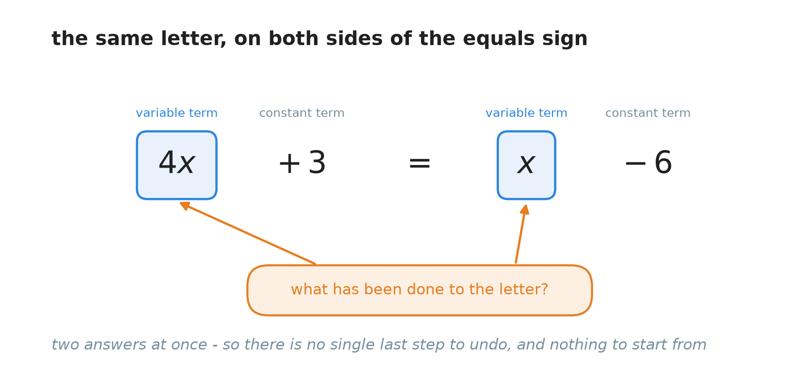
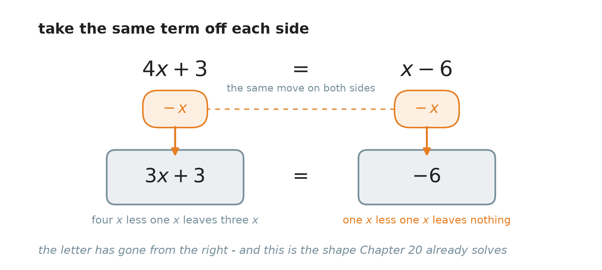
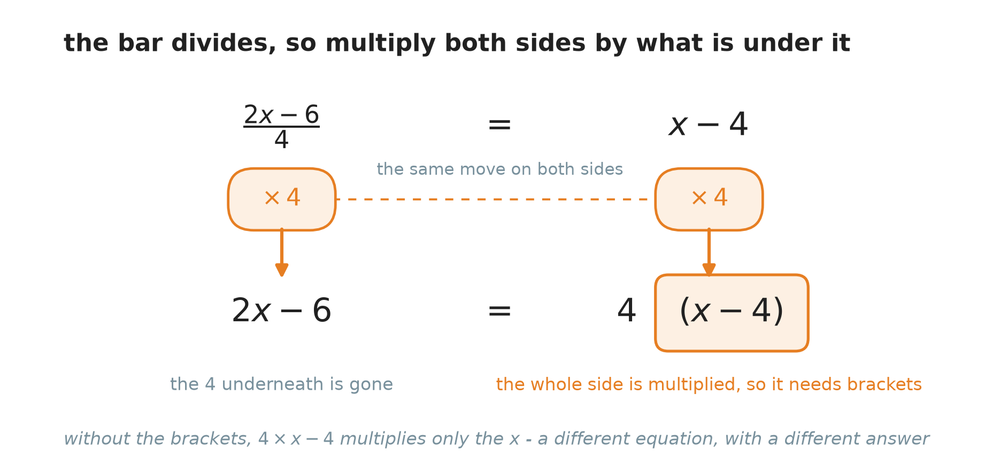
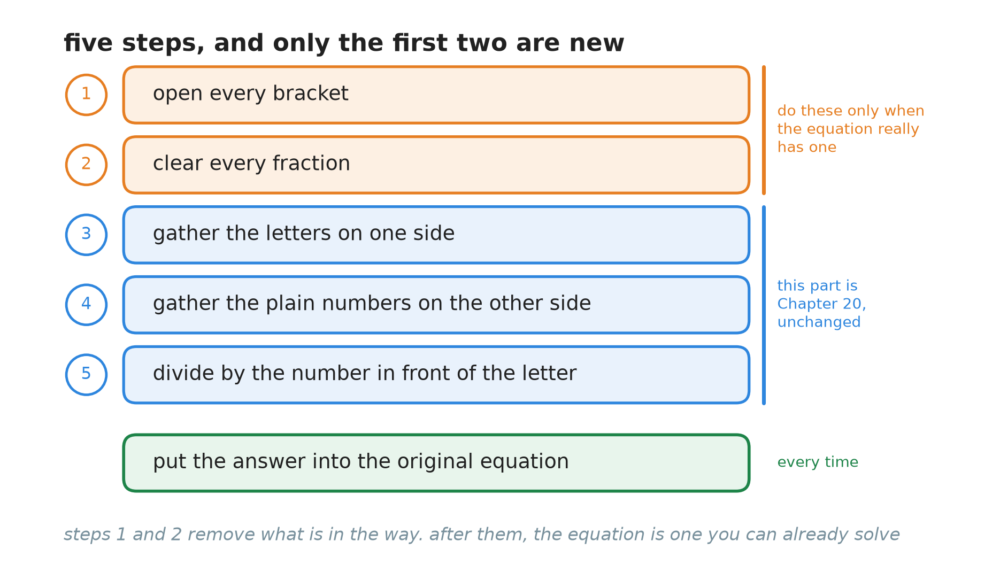
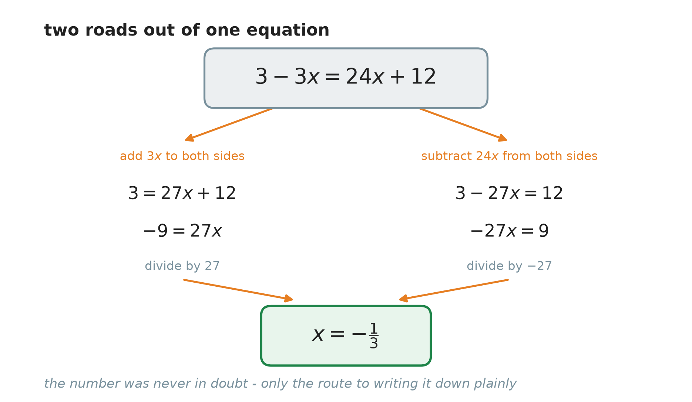

# 21. Equations with the letter on both sides

**What this chapter teaches**
How to solve an equation when the letter stands on both sides of the equals sign, and what to
clear out of the way first when the equation also has a bracket or a fraction in it. It is also
where the book meets its first answers that are not whole numbers.

**Before you start**
This chapter is the direct continuation of
[Chapter 20](./../20_Solving_Equations/20_Solving_Equations.md),
and it assumes the whole of it. It also needs two tools from
[Chapter 19](./../19_The_Number_Properties_Of_Algebra/19_The_Number_Properties_Of_Algebra.md):
handing a multiplier out of a bracket
([section 3](./../19_The_Number_Properties_Of_Algebra/19_The_Number_Properties_Of_Algebra.md#3-handing-the-multiplier-out))
and collecting like terms
([section 4](./../19_The_Number_Properties_Of_Algebra/19_The_Number_Properties_Of_Algebra.md#4-collecting-like-terms)).
Near the end it uses fractions from
[Chapter 15](./../15_Adding_And_Subtracting_Fractions/15_Adding_And_Subtracting_Fractions.md)
and
[Chapter 16](./../16_Multiplying_And_Dividing_Fractions/16_Multiplying_And_Dividing_Fractions.md),
and sign rules from
[Chapter 9](./../9_Negative_Numbers/9_Negative_Numbers.md).

---

## Table of contents

1. [When the letter appears twice](#1-when-the-letter-appears-twice)
2. [Moving a whole term across](#2-moving-a-whole-term-across)
3. [When there is a bracket in the way](#3-when-there-is-a-bracket-in-the-way)
4. [When there is a fraction in the way](#4-when-there-is-a-fraction-in-the-way)
5. [The five steps in one place](#5-the-five-steps-in-one-place)
6. [Glossary](#6-glossary)
7. [Check your understanding](#7-check-your-understanding)
8. [Important notes](#8-important-notes)

---

## 1. When the letter appears twice

### 1.1 The method runs out of road

Every solution in
[Chapter 20](./../20_Solving_Equations/20_Solving_Equations.md#71-four-steps-and-a-loop)
began with the same question: **what has been done to the letter?** Here is an equation where
that question has two answers at the same time.

$$
4x + 3 = x - 6
$$

On the left, the letter was multiplied by $4$, and then $3$ was added.

On the right, $6$ was subtracted from the letter.

Both of those are true. Neither of them is "the last thing done", because they happened in two
different places. There is no outermost operation to peel off, so there is nothing to undo.

    

**Figure 1 — Count the arrows. Chapter 20's opening question expects one answer, and this
equation hands it two. Until the letter is in one place only, the method cannot start.**

**Note — the goal has not changed.** You still want the letter standing alone with one number
opposite it, exactly as
[Chapter 20, section 3.2](./../20_Solving_Equations/20_Solving_Equations.md#32-what-you-are-aiming-at)
described. What has changed is that you cannot begin yet. This chapter is about the work that
comes *before* the work you already know.

### 1.2 The two kinds of piece

To talk about the fix, the pieces of an equation need names.

> **Definition — term.** A **term** is one piece of an expression: the parts that are added to
> or subtracted from each other. In $4x + 3$ there are two terms, $4x$ and $+3$.

> **Definition — variable term.** A **variable term** is a term that carries a letter. $4x$,
> $x$ and $-5y$ are variable terms.

> **Definition — constant term.** A **constant term** is a term that is only a number, with no
> letter attached. $+3$, $-6$ and $12$ are constant terms.

So the equation splits into four pieces:

| The equation | Variable terms | Constant terms |
| --- | --- | --- |
| $4x + 3 = x - 6$ | $4x$ and $x$ | $+3$ and $-6$ |

**Note — the sign belongs to the term in front of it.** In $x - 6$ the constant term is $-6$,
not $6$. Reading a subtraction as "adding a negative" is
[Chapter 19, section 2.4](./../19_The_Number_Properties_Of_Algebra/19_The_Number_Properties_Of_Algebra.md#24-the-safe-way-to-move-a-subtraction)'s
habit, and it matters here: when you move a term about, you move its sign with it.

### 1.3 The plan, in one sentence

**Get every variable term onto one side, and every constant term onto the other.**

Once that is done, one side holds a single variable term and the other holds a single number.
That is exactly the shape
[Chapter 20, section 5](./../20_Solving_Equations/20_Solving_Equations.md#5-more-than-one-step)
already solves. The whole of this chapter is the work of reaching that shape.

### Summary of section 1

* When the letter is on both sides, "what has been done to the letter?" has two answers, so
  Chapter 20's method cannot start.
* A **term** is one added or subtracted piece of an expression.
* A **variable term** carries a letter; a **constant term** is just a number.
* The sign in front of a term is part of that term.
* The plan: letters onto one side, numbers onto the other, and then solve as before.

---

## 2. Moving a whole term across

### 2.1 May you subtract a letter?

The move that fixes everything is this: **subtract $x$ from both sides.** Before doing it, it is
worth asking whether you are allowed to.

[Chapter 20, section 2.2](./../20_Solving_Equations/20_Solving_Equations.md#22-the-four-properties-of-equality)
gave the subtraction property of equality:

$$
\text{if } A = B \text{, then } A - c = B - c
$$

There, $c$ was a number. Now you want $c$ to be $x$ — a letter. Is that still the same rule?

It is, and the reason is the definition of a variable from
[Chapter 18, section 2.1](./../18_Introduction_To_Algebra_Variables/18_Introduction_To_Algebra_Variables.md#21-a-variable-is-a-quantity-that-can-change):
**a letter stands for a number.** You do not know which number $x$ is. But whatever it is, it is
one fixed number, and it is the same number on both sides of the equals sign — that is what
[Chapter 18, section 2.3](./../18_Introduction_To_Algebra_Variables/18_Introduction_To_Algebra_Variables.md#23-one-letter-keeps-one-value-at-a-time)
insisted on. So taking $x$ off the left and $x$ off the right is taking **the same amount** off
both sides.

> **Explanation — you never need to know the value.** Think of the balance from
> [Chapter 18, section 4.3](./../18_Introduction_To_Algebra_Variables/18_Introduction_To_Algebra_Variables.md#43-the-equals-sign-is-a-balance-not-an-arrow).
> Put a sealed box on each pan. You have no idea what is inside, but you know both boxes are the
> same. Take one box off each pan. The pans stay level. You never opened a box, and you never
> needed to.

**Note — this works for any term.** Nothing in the argument used the fact that the term was a
plain $x$. You may add $3x$ to both sides, subtract $24x$ from both sides, or subtract $2y$ from
both sides. Every one of those is "the same amount on both sides", because every one of them is
one number in disguise.

### 2.2 Which of the two to move

There are two variable terms, so there are two choices: remove the left one, or remove the right
one. Both are legal. One is usually easier.

**Move the smaller one.** Subtract the variable term with the smaller number in front, so that
the letter survives where its number was bigger. Then the number left in front of the letter is
positive, and the last step is a division by a positive number.

In $4x + 3 = x - 6$ the two coefficients are $4$ and $1$. The smaller is the $x$ on the right, so
subtract $x$ from both sides and keep the letter on the left.

**Note — the other choice is not wrong.** Subtracting $4x$ instead would leave $-3x$ on the
right, and you would finish with a division by $-3$. That works, and
[Chapter 20, section 6](./../20_Solving_Equations/20_Solving_Equations.md#6-when-the-letter-is-left-negative)
taught you how. It is just more chances to lose a minus sign. Section 5.3 shows both roads
arriving at the same answer.

### 2.3 Worked: $4x + 3 = x - 6$

**The equation.**

$$
4x + 3 = x - 6
$$

**Step 1 — name the pieces.** Variable terms $4x$ and $x$; constant terms $+3$ and $-6$. The
smaller variable term is $x$, on the right.

**Step 2 — subtract $x$ from both sides.**

$$
4x + 3 - x = x - 6 - x
$$

On the left, $4x$ and $x$ are like terms, so they join
([Chapter 19, section 4.2](./../19_The_Number_Properties_Of_Algebra/19_The_Number_Properties_Of_Algebra.md#42-why-joining-is-allowed)):
$4x - x = 3x$. The $+3$ is not a like term and does not move.

On the right, $x - x = 0$, and the letter is gone.

$$
3x + 3 = -6
$$

    

**Figure 2 — One move, done identically on both sides. The left side loses one $x$ out of four
and keeps three. The right side loses its only $x$ and keeps none. The bottom line is grey, not
green: it is true, but it is not an answer yet.**

> **Warning — $4x - x$ is $3x$, not $3$.** The letter does not disappear when the numbers in
> front of it are subtracted. Remember from
> [Chapter 19, section 6.2](./../19_The_Number_Properties_Of_Algebra/19_The_Number_Properties_Of_Algebra.md#62-multiplying-by-one)
> that $x$ on its own means $1x$. So $4x - 1x = (4 - 1)x = 3x$. Four apples take away one apple
> is three apples, not three.

**Step 3 — now it is an ordinary two-step equation.** The letter is on the left only, so
Chapter 20 takes over. A $3$ has been added, so subtract $3$ from both sides.

$$
3x + 3 - 3 = -6 - 3
$$

$$
3x = -9
$$

Take care with that right-hand number: $-6 - 3 = -9$. Starting below zero and going down again
takes you further down, as
[Chapter 9, section 4.1](./../9_Negative_Numbers/9_Negative_Numbers.md#41-every-calculation-is-a-walk-along-the-line)'s
walk shows.

**Step 4 — divide both sides by $3$.**

$$
\frac{3x}{3} = \frac{-9}{3}
$$

$$
x = -3
$$

**Step 5 — check, in the original equation.** Work each side out separately.

Left side: $4(-3) + 3 = -12 + 3 = -9$.

Right side: $-3 - 6 = -9$.

Both sides are $-9$. The solution is $x = -3$.

### 2.4 An equation reads the same in both directions

Sometimes the tidy choice leaves the letter on the **right**, and you end up with a line like
this:

$$
-9 = 27x
$$

That is a finished piece of work, not a problem.
[Chapter 20, section 3.2](./../20_Solving_Equations/20_Solving_Equations.md#32-what-you-are-aiming-at)
already noted that $d = 5$ and $5 = d$ say the same thing. The rule has a name:

> **Definition — the symmetric property of equality.** If $A = B$, then $B = A$. An equation may
> be written the other way round without changing what it says.

* $A$ — whatever stands on the left of the equals sign.
* $B$ — whatever stands on the right.

In words: **an equals sign has no direction.** It says the two sides are the same size, and
"the same size" reads identically from either end.

So you may rewrite $-9 = 27x$ as $27x = -9$ and carry on. This is a convenience for the eye, not
a step you are obliged to take.

### Summary of section 2

* Subtracting a term with a letter in it is legal, because a letter stands for one number, and
  it is the same number on both sides.
* You never need to know that number. The sealed boxes come off the pans unopened.
* Move the variable term with the **smaller** number in front, so the letter is left with a
  positive number in front of it.
* $4x + 3 = x - 6$ becomes $3x + 3 = -6$, then $3x = -9$, then $x = -3$.
* $4x - x = 3x$, because $x$ means $1x$.
* By the **symmetric property**, $-9 = 27x$ may be rewritten as $27x = -9$.

---

## 3. When there is a bracket in the way

### 3.1 A bracket hides what was done to the letter

$$
2(x + 4) = 5x - 1
$$

Look at the left side and try to say what was done to the letter. You cannot, cleanly. The $2$
does not multiply the letter — it multiplies a whole phrase, $x + 4$, which has the letter buried
inside it. The bracket is a lid.

So take the lid off first. That is
[Chapter 19, section 3.2](./../19_The_Number_Properties_Of_Algebra/19_The_Number_Properties_Of_Algebra.md#32-the-rule-with-a-letter-inside-the-bracket)'s
rule, unchanged:

$$
a(b + c) = ab + ac
$$

$$
2(x + 4) = 2 \times x + 2 \times 4 = 2x + 8
$$

> **Warning — the multiplier must reach every term.** $2(x + 4)$ is $2x + 8$, never $2x + 4$.
> [Chapter 19, section 3.3](./../19_The_Number_Properties_Of_Algebra/19_The_Number_Properties_Of_Algebra.md#33-every-term-inside-must-be-reached)
> has the picture and the test for it. In an equation this mistake is especially expensive,
> because the line you write is a *different equation*, and every line after it answers a
> different question.

If the multiplier is negative, its sign travels to every term as well —
[Chapter 19, section 3.5](./../19_The_Number_Properties_Of_Algebra/19_The_Number_Properties_Of_Algebra.md#35-a-negative-multiplier-keeps-its-sign-all-the-way)
works that through.

### 3.2 Worked: $2(x + 4) = 5x - 1$

**Step 1 — open the bracket.**

$$
2x + 8 = 5x - 1
$$

**Step 2 — gather the letters.** The coefficients are $2$ and $5$. The smaller is $2x$, so
subtract $2x$ from both sides.

$$
2x + 8 - 2x = 5x - 1 - 2x
$$

$$
8 = 3x - 1
$$

**Step 3 — gather the numbers.** A $1$ is being subtracted on the right, so add $1$ to both
sides.

$$
8 + 1 = 3x - 1 + 1
$$

$$
9 = 3x
$$

**Step 4 — turn it round.** By the symmetric property, write it the readable way.

$$
3x = 9
$$

**Step 5 — divide both sides by $3$.**

$$
\frac{3x}{3} = \frac{9}{3}
$$

$$
x = 3
$$

**Step 6 — check, in the original equation.**

Left side: $2(3 + 4) = 2 \times 7 = 14$.

Right side: $5 \times 3 - 1 = 15 - 1 = 14$.

Both sides are $14$. The solution is $x = 3$.

**Note — open the bracket before you gather.** It is tempting to look at $2(x + 4) = 5x - 1$,
see an $x$ inside the bracket, and try to subtract it from both sides straight away. That $x$ is
not loose — it is inside something that is being multiplied, and it cannot be moved until the
bracket is gone.

### Summary of section 3

* A bracket hides the letter inside a phrase, so you cannot say what was done to it.
* Open every bracket first, using the rule from Chapter 19, section 3.
* The multiplier must reach **every** term inside: $2(x + 4) = 2x + 8$.
* Only then gather the letters.
* $2(x + 4) = 5x - 1$ gives $x = 3$.

---

## 4. When there is a fraction in the way

### 4.1 A whole side written over a number

$$
\frac{2x - 6}{4} = x - 4
$$

The bar is a division sign —
[Chapter 1, section 2.2](./../1_Fractions/1_Fractions.md#22-a-fraction-is-a-division)
established that at the very start of the book. And notice **what** is being divided: everything
written above the bar. The bar behaves like a pair of brackets that nobody has to write. Here the
whole expression $2x - 6$ is divided by $4$.

### 4.2 Multiply both sides by the number underneath

Divided by $4$ is undone by multiplied by $4$ —
[Chapter 20, section 3.1](./../20_Solving_Equations/20_Solving_Equations.md#31-two-pairs-and-each-one-undoes-the-other)'s
toolbox. And multiplying both sides by the same number is allowed, by the multiplication property
of equality.

$$
\frac{2x - 6}{4} \times 4 = (x - 4) \times 4
$$

On the left, multiplying by $4$ undoes dividing by $4$, and $2x - 6$ is left standing.

On the right, the multiplication has to reach the **whole** side, because a side of an equation
is one thing. The only way to write "four lots of all of this" is with a bracket.

$$
2x - 6 = 4(x - 4)
$$

    

**Figure 3 — The fraction bar goes, and a bracket arrives. The bracket is not decoration: it is
the only thing recording that the $4$ multiplies the whole of the other side.**

> **Warning — the bracket is not optional.** Writing $2x - 6 = 4 \times x - 4$ multiplies only
> the $x$ and leaves the $-4$ untouched. That line is a different equation, and it gives
> $x = -1$. Put $-1$ back into the original: the left side is $\frac{2(-1) - 6}{4} =
> \frac{-8}{4} = -2$, and the right side is $-1 - 4 = -5$. They do not agree, so $-1$ is not a
> solution of anything you were asked.

### 4.3 The short way to write it

Once you trust the move, you can write it in one line instead of three. Take the number from
under the bar on one side, and make it multiply the whole of the other side:

$$
\frac{A}{B} = C \quad \Longrightarrow \quad A = B \times C
$$

* $A$ — everything above the bar.
* $B$ — the number below the bar. It cannot be $0$.
* $C$ — the whole of the other side, which is why it needs a bracket round it.

In words: **what was being divided now stands on its own, and what it was divided by now
multiplies the other side.**

**Note — this is not a new rule.** It is the multiplication property of equality with the middle
line left out. The arrow is a shortcut for writing, not for thinking. $B$ may not be $0$ for the
same reason it never may —
[Chapter 16, section 6.2](./../16_Multiplying_And_Dividing_Fractions/16_Multiplying_And_Dividing_Fractions.md#62-why-dividing-by-zero-has-no-answer)
explains it.

### 4.4 Worked: $\frac{2x - 6}{4} = x - 4$

**Step 1 — clear the fraction.**

$$
2x - 6 = 4(x - 4)
$$

**Step 2 — open the new bracket.**

$$
2x - 6 = 4x - 16
$$

**Step 3 — gather the letters.** The coefficients are $2$ and $4$; subtract the smaller, $2x$.

$$
2x - 6 - 2x = 4x - 16 - 2x
$$

$$
-6 = 2x - 16
$$

**Step 4 — gather the numbers.** A $16$ is being subtracted, so add $16$ to both sides.

$$
-6 + 16 = 2x - 16 + 16
$$

$$
10 = 2x
$$

**Step 5 — turn it round and divide by $2$.**

$$
2x = 10
$$

$$
\frac{2x}{2} = \frac{10}{2}
$$

$$
x = 5
$$

**Step 6 — check, in the original equation.**

Left side: $\frac{2 \times 5 - 6}{4} = \frac{10 - 6}{4} = \frac{4}{4} = 1$.

Right side: $5 - 4 = 1$.

Both sides are $1$. The solution is $x = 5$.

### Summary of section 4

* The fraction bar divides **everything** above it, as though there were brackets round it.
* Multiply both sides by the number under the bar, and the fraction is gone.
* The other side must be put in brackets, because the whole of it gets multiplied.
* Written short: $\frac{A}{B} = C$ gives $A = B \times C$, with $B$ not $0$.
* $\frac{2x - 6}{4} = x - 4$ gives $x = 5$.

---

## 5. The five steps in one place

### 5.1 The list

Put sections 2, 3 and 4 together and you have a method that handles every equation in this
chapter.

    

**Figure 4 — Only the orange boxes are new. The blue ones are Chapter 20's method, and the green
one is Chapter 20's check. Steps 1 and 2 exist to turn a strange-looking equation into an
ordinary one.**

1. **Open every bracket.** Section 3.
2. **Clear every fraction.** Multiply both sides by the number under the bar. Section 4.
3. **Gather the variable terms on one side.** Add or subtract a whole term. Section 2.
4. **Gather the constant terms on the other side.** Add or subtract a number, as in Chapter 20.
5. **Divide both sides by the number in front of the letter.**

Then check, in the original equation, always.

**Note — skip what is not there.** Steps 1 and 2 are done only when the equation actually has a
bracket or a fraction. If it has neither, you start at step 3. Section 2.3's equation needed
steps 3, 4 and 5 only.

**Note — why brackets before fractions.** Opening a bracket can change what is sitting over the
bar, and it can turn two terms into one. Doing it first means you clear the fraction once,
looking at its final contents, rather than twice.

### 5.2 A full example: $\frac{3 - 3x}{4} = 3(2x + 1)$

This one uses all five steps.

**The equation.**

$$
\frac{3 - 3x}{4} = 3(2x + 1)
$$

**Step 1 — open the bracket on the right.**

$$
3(2x + 1) = 3 \times 2x + 3 \times 1 = 6x + 3
$$

$$
\frac{3 - 3x}{4} = 6x + 3
$$

**Step 2 — clear the fraction.** Multiply both sides by $4$, and put the right side in brackets.

$$
3 - 3x = 4(6x + 3)
$$

Open that bracket too:

$$
4 \times 6x = 24x \qquad 4 \times 3 = 12
$$

$$
3 - 3x = 24x + 12
$$

**Step 3 — gather the letters.** The two variable terms are $-3x$ and $24x$. The smaller is
$-3x$, so remove it: the opposite of subtracting $3x$ is **adding** $3x$, so add $3x$ to both
sides.

$$
3 - 3x + 3x = 24x + 12 + 3x
$$

On the left, $-3x + 3x = 0$. On the right, $24x + 3x = 27x$.

$$
3 = 27x + 12
$$

**Step 4 — gather the numbers.** Subtract $12$ from both sides.

$$
3 - 12 = 27x + 12 - 12
$$

$$
-9 = 27x
$$

Turn it round, by the symmetric property:

$$
27x = -9
$$

**Step 5 — divide both sides by $27$.**

$$
\frac{27x}{27} = \frac{-9}{27}
$$

$$
x = \frac{-9}{27}
$$

That fraction is not in its simplest form. The greatest common factor of $9$ and $27$ is $9$, so
divide top and bottom by $9$
([Chapter 14, section 5.2](./../14_The_Greatest_Common_Factor/14_The_Greatest_Common_Factor.md#52-simplifying-a-fraction-in-one-step)):

$$
-9 \div 9 = -1 \qquad 27 \div 9 = 3
$$

$$
x = -\frac{1}{3}
$$

**Note — an answer does not have to be a whole number.** Every solution in Chapter 20 came out
whole, and that was luck of the examples, not a rule. A solution is any value that makes the two
sides equal, and $-\frac{1}{3}$ is a value like any other. Always simplify it before you write it
down.

**Step 6 — check, in the original equation.** This check uses fractions, so take it slowly and do
each side on its own.

*Left side,* $\dfrac{3 - 3x}{4}$:

$$
3x = 3 \times \left(-\frac{1}{3}\right) = -1
$$

$$
3 - 3x = 3 - (-1) = 3 + 1 = 4
$$

$$
\frac{4}{4} = 1
$$

Subtracting a negative number turned into adding, as
[Chapter 9, section 4.4](./../9_Negative_Numbers/9_Negative_Numbers.md#44-subtracting-a-negative-number-is-the-same-as-adding)
showed.

*Right side,* $3(2x + 1)$:

$$
2x = 2 \times \left(-\frac{1}{3}\right) = -\frac{2}{3}
$$

$$
-\frac{2}{3} + 1 = -\frac{2}{3} + \frac{3}{3} = \frac{1}{3}
$$

$$
3 \times \frac{1}{3} = \frac{3}{3} = 1
$$

Both sides are $1$. The solution is $x = -\frac{1}{3}$.

### 5.3 The other road reaches the same place

At step 3 above, a choice was made. Go back to that line:

$$
3 - 3x = 24x + 12
$$

Instead of adding $3x$, you could subtract $24x$ from both sides and keep the letter on the left.

$$
3 - 3x - 24x = 24x + 12 - 24x
$$

$$
3 - 27x = 12
$$

Subtract $3$ from both sides:

$$
3 - 27x - 3 = 12 - 3
$$

$$
-27x = 9
$$

Divide both sides by $-27$. A positive number divided by a negative number is negative
([Chapter 9, section 6.1](./../9_Negative_Numbers/9_Negative_Numbers.md#61-the-same-rules-for-a-good-reason)):

$$
x = \frac{9}{-27} = -\frac{1}{3}
$$

The same answer.

    

**Figure 5 — Two different roads, three lines each, and one destination. Which side you gather
on changes the writing and nothing else.**

This is
[Chapter 20, section 1.2](./../20_Solving_Equations/20_Solving_Equations.md#12-the-number-that-makes-it-true)'s
idea seen from a new angle. The solution was $-\frac{1}{3}$ before either road was chosen. Your
steps never decide what the number is — they only uncover it. That is also why the choice in
section 2.2 is about convenience and never about correctness.

### Summary of section 5

* Five steps: open brackets, clear fractions, gather letters, gather numbers, divide.
* Skip steps 1 and 2 when there is nothing to open or clear.
* Only the first two steps are new; the rest is Chapter 20.
* $\frac{3 - 3x}{4} = 3(2x + 1)$ gives $x = -\frac{1}{3}$.
* An answer may be a fraction. Simplify it before writing it down.
* Gathering on the other side gives the same answer by a longer road.

---

## 6. Glossary

**Term.** One added or subtracted piece of an expression. $4x + 3$ has two terms, $4x$ and $+3$.
The sign in front of a term belongs to it.

**Variable term.** A term that carries a letter, such as $4x$, $x$ or $-27x$.

**Constant term.** A term that is only a number, such as $+3$, $-6$ or $12$.

**The symmetric property of equality.** If $A = B$, then $B = A$. An equation may be written the
other way round without changing what it says, so $-9 = 27x$ and $27x = -9$ are the same line.

**Note — the words this chapter does not define, because the book already has them.**
**Fraction** and the **fraction bar as a division** are
[Chapter 1](./../1_Fractions/1_Fractions.md).
**Simplifying a fraction** with the greatest common factor is
[Chapter 14, section 5.2](./../14_The_Greatest_Common_Factor/14_The_Greatest_Common_Factor.md#52-simplifying-a-fraction-in-one-step).
The **sign rules** are
[Chapter 9](./../9_Negative_Numbers/9_Negative_Numbers.md).
**Variable**, **constant**, **coefficient** and **equation** are
[Chapter 18](./../18_Introduction_To_Algebra_Variables/18_Introduction_To_Algebra_Variables.md).
**The distributive property**, **like terms** and **collecting like terms** are
[Chapter 19](./../19_The_Number_Properties_Of_Algebra/19_The_Number_Properties_Of_Algebra.md).
**Solution**, **solving**, **isolating the variable**, **the properties of equality**, **inverse
operations**, **one-step** and **two-step equations** are
[Chapter 20](./../20_Solving_Equations/20_Solving_Equations.md).

---

## 7. Check your understanding

Try each one before opening the answer. Solve, then check.

**Question 1.** Solve for $x$: $5x - 4 = 2x + 5$.

Answer

No brackets, no fractions, so start at step 3. The coefficients are $5$ and $2$; subtract the
smaller, $2x$.

$$
5x - 4 - 2x = 2x + 5 - 2x
$$

$$
3x - 4 = 5
$$

Add $4$ to both sides:

$$
3x = 9
$$

Divide both sides by $3$:

$$
x = 3
$$

Check: left side $5 \times 3 - 4 = 15 - 4 = 11$; right side $2 \times 3 + 5 = 6 + 5 = 11$.

**Question 2.** Solve for $x$: $7x + 2 = 3x - 14$.

Answer

Subtract the smaller variable term, $3x$, from both sides.

$$
7x + 2 - 3x = 3x - 14 - 3x
$$

$$
4x + 2 = -14
$$

Subtract $2$ from both sides. Note that $-14 - 2 = -16$.

$$
4x = -16
$$

Divide both sides by $4$:

$$
x = -4
$$

Check: left side $7(-4) + 2 = -28 + 2 = -26$; right side $3(-4) - 14 = -12 - 14 = -26$.

**Question 3.** Solve for $x$: $3(x - 2) = 2x + 4$.

Answer

Step 1 — open the bracket. The $3$ multiplies both terms inside, and the second one is negative:

$$
3(x - 2) = 3x - 6
$$

$$
3x - 6 = 2x + 4
$$

Subtract $2x$ from both sides:

$$
x - 6 = 4
$$

Add $6$ to both sides:

$$
x = 10
$$

There is no step 5 here: the number in front of the letter is already $1$.

Check: left side $3(10 - 2) = 3 \times 8 = 24$; right side $2 \times 10 + 4 = 20 + 4 = 24$.

**Question 4.** Solve for $x$: $\dfrac{5 - 2x}{3} = 2(x + 3)$.

Answer

Step 1 — open the bracket:

$$
\frac{5 - 2x}{3} = 2x + 6
$$

Step 2 — multiply both sides by $3$, with brackets on the right:

$$
5 - 2x = 3(2x + 6)
$$

$$
5 - 2x = 6x + 18
$$

Step 3 — the variable terms are $-2x$ and $6x$. Add $2x$ to both sides:

$$
5 = 8x + 18
$$

Step 4 — subtract $18$ from both sides. Note that $5 - 18 = -13$.

$$
-13 = 8x
$$

$$
8x = -13
$$

Step 5 — divide both sides by $8$:

$$
x = -\frac{13}{8}
$$

The greatest common factor of $13$ and $8$ is $1$, so it will not simplify.

Check. Left side: $2x = 2 \times \left(-\frac{13}{8}\right) = -\frac{13}{4}$, so
$5 - 2x = 5 + \frac{13}{4} = \frac{20}{4} + \frac{13}{4} = \frac{33}{4}$, and
$\frac{33}{4} \div 3 = \frac{33}{12} = \frac{11}{4}$.
Right side: $-\frac{13}{8} + 3 = -\frac{13}{8} + \frac{24}{8} = \frac{11}{8}$, and
$2 \times \frac{11}{8} = \frac{22}{8} = \frac{11}{4}$. Both sides are $\frac{11}{4}$.

**Question 5.** Solve for $x$: $4(2x - 1) - 3x = 2(x + 6)$.

Answer

Step 1 — open both brackets:

$$
4(2x - 1) = 8x - 4 \qquad 2(x + 6) = 2x + 12
$$

$$
8x - 4 - 3x = 2x + 12
$$

The left side now has two like terms, so collect them
([Chapter 19, section 4.3](./../19_The_Number_Properties_Of_Algebra/19_The_Number_Properties_Of_Algebra.md#43-the-method-with-the-commutative-property-doing-its-job)):
$8x - 3x = 5x$.

$$
5x - 4 = 2x + 12
$$

Subtract $2x$ from both sides:

$$
3x - 4 = 12
$$

Add $4$ to both sides:

$$
3x = 16
$$

Divide both sides by $3$:

$$
x = \frac{16}{3}
$$

Check. Left side: $2x = \frac{32}{3}$, so $2x - 1 = \frac{32}{3} - \frac{3}{3} = \frac{29}{3}$,
and $4 \times \frac{29}{3} = \frac{116}{3}$. Then $3x = 16 = \frac{48}{3}$, so
$\frac{116}{3} - \frac{48}{3} = \frac{68}{3}$.
Right side: $\frac{16}{3} + 6 = \frac{16}{3} + \frac{18}{3} = \frac{34}{3}$, and
$2 \times \frac{34}{3} = \frac{68}{3}$. Both sides are $\frac{68}{3}$.

**Question 6.** You do not know what number $x$ is. So how can you be sure that subtracting $x$
from both sides keeps an equation true?

Answer

Because $x$ stands for **one** number, and it is the same number wherever it appears in that
equation. So "subtract $x$ from the left and $x$ from the right" is "subtract the same amount
from both sides", which is exactly what the subtraction property of equality allows.

Knowing the value is not part of the condition. The condition is only that the two amounts are
equal to each other — and two copies of the same letter always are. The sealed boxes in section
2.1 come off the pans without ever being opened.

**Question 7.** A student is solving $\frac{3 - 3x}{4} = 6x + 3$ and writes the next line as
$3 - 3x = 4 \times 6x + 3$. What went wrong, and what does it cost?

Answer

The brackets are missing. Multiplying both sides by $4$ multiplies the **whole** right side, so
the line should be $3 - 3x = 4(6x + 3)$, which opens out to $3 - 3x = 24x + 12$.

What the student wrote multiplies only the $6x$ and leaves the $+3$ alone, giving
$3 - 3x = 24x + 3$. That is a different equation. Solving it gives $x = 0$, and putting $0$ into
the original shows it fails: the left side is $\frac{3 - 0}{4} = \frac{3}{4}$, while the right
side is $6 \times 0 + 3 = 3$.

The cost is the whole problem. Every line after a wrong line is a correct answer to the wrong
question.

**Question 8.** In $4x + 3 = x - 6$, a student subtracts $x$ from both sides and writes
$3 + 3 = -6$. What did they do, and why is it wrong?

Answer

They treated $4x - x$ as $4 - 1 = 3$ and let the letter vanish.

The letter does not vanish. $x$ means $1x$, so $4x - 1x = (4 - 1)x = 3x$. Four of something take
away one of that same something leaves three of it — not three of nothing.

The correct line is $3x + 3 = -6$, which gives $x = -3$. The student's line gives $6 = -6$, which
is not even true, and that is the clue that something has gone wrong: a legal move can never turn
a true equation into a false one.

**Question 9.** In $3(x - 2) = 2x + 4$, a student writes $3x - 2 = 2x + 4$. Find the mistake, and
show that the answer it produces is wrong.

Answer

The $3$ was multiplied into the $x$ but not into the $-2$. It must reach both terms:
$3(x - 2) = 3x - 6$.

The student's line gives $3x - 2 = 2x + 4$, then $x - 2 = 4$, then $x = 6$.

Put $6$ into the **original** equation: the left side is $3(6 - 2) = 3 \times 4 = 12$, and the
right side is $2 \times 6 + 4 = 16$. They do not agree, so $6$ is not the solution. The correct
answer is $10$, from question 3.

This is why the check is worth two lines: it catches a mistake made four lines earlier.

**Question 10.** Two students solve $3 - 3x = 24x + 12$. One gathers the letters on the right,
the other on the left. Before either of them finishes, can you say whether their answers will
agree? Why?

Answer

Yes — they must agree, and you can say so without doing any of the working.

The equation is a description of one particular number, from the moment it is written down. Every
legal move rewrites the description without changing the number being described. So both students
are uncovering the same number, and they will both arrive at $-\frac{1}{3}$.

What differs is only the route, as figure 5 shows. One of them will divide by $27$ and the other
by $-27$, and one will have a few more minus signs to keep track of. Neither of those facts
touches the answer.

---

## 8. Important notes

**The mistakes people actually make.**

* **Losing the letter when terms are joined.** $4x - x$ is $3x$. Writing $3$ throws away the
  thing you are solving for, and usually produces a line that is plainly false.
* **Forgetting the brackets after clearing a fraction.** Multiplying both sides by $4$ multiplies
  *all* of the other side. Without the bracket you have silently changed the equation.
* **Distributing into the first term only.** $3(x - 2)$ is $3x - 6$. This and the previous
  mistake are the same mistake in two costumes: something that should have reached every term
  reached one.
* **Trying to move a letter that is still inside a bracket.** Open the bracket first. Until it is
  open, that $x$ is part of a product, not a loose term.
* **Sign slips when gathering.** $-6 - 3 = -9$, $5 - 18 = -13$, $-14 - 2 = -16$. Most wrong
  answers in this chapter are one of these, not a wrong method.
* **Moving the larger variable term and then mishandling the minus.** It is legal, and it
  finishes correctly if you are careful. It is simply the harder of the two roads.
* **Stopping at $\frac{-9}{27}$.** That is a true statement about $x$, but it is not simplified.
  Finish it: $-\frac{1}{3}$.
* **Expecting a whole-number answer.** $-\frac{1}{3}$, $-\frac{13}{8}$ and $\frac{16}{3}$ are
  perfectly ordinary solutions. A fraction is not a sign that you went wrong.
* **Checking against your own working instead of the original equation.** If the mistake is in
  line two, line three will happily agree with it.

**The three ideas to keep.**

* **A letter can be moved like a number, because it is a number.** This is the whole chapter in
  one sentence. Once you accept that $x$ is a single fixed value, subtracting $x$ from both sides
  stops looking strange and becomes just another use of a rule you already had. Nothing new was
  needed — only a wider reading of something old.
* **Clearing is not solving.** Steps 1 and 2 do not get you closer to the answer in any obvious
  way; they only make the equation an ordinary one. That is a useful way to think about a lot of
  mathematics: much of the work is turning an unfamiliar problem into a familiar one, and only
  then solving it.
* **The road is a choice; the destination is not.** Two people can gather on opposite sides, write
  completely different lines, and land on the same number. The equation decided that number before
  either of them picked up a pen.

**How this chapter connects to the rest of the book.**
[Chapter 19](./../19_The_Number_Properties_Of_Algebra/19_The_Number_Properties_Of_Algebra.md)
built two tools and, at the time, had only expressions to use them on. Both are now doing real
work: section 3 of that chapter opens every bracket here, and section 4 joins the terms after
every gathering move. A tool built in one chapter and used in another is what makes this a book
rather than a set of lessons.
[Chapter 20](./../20_Solving_Equations/20_Solving_Equations.md)
supplied everything else — the properties of equality, the inverse operations, the check, and the
idea that the solution is already there before you start. Steps 3, 4 and 5 are its method,
unchanged.
[Chapters 14](./../14_The_Greatest_Common_Factor/14_The_Greatest_Common_Factor.md),
[15](./../15_Adding_And_Subtracting_Fractions/15_Adding_And_Subtracting_Fractions.md) and
[16](./../16_Multiplying_And_Dividing_Fractions/16_Multiplying_And_Dividing_Fractions.md)
were about numbers, and they arrive here as the tools that let an answer be $-\frac{1}{3}$ and
still be checked properly.
[Chapter 9](./../9_Negative_Numbers/9_Negative_Numbers.md)
is present in almost every line, quietly.

What this chapter still cannot do: solve an equation with a power on the letter, such as
$x^{2} = 9$; open two brackets multiplied together; or deal with an equation that has no solution
at all, or one where every number is a solution. It also does not yet turn a story told in words
into an equation — so far, the equation has always been handed to you already written.

---

- [Back to the book](./../README.md)
- Previous: [20 Solving equations](./../20_Solving_Equations/20_Solving_Equations.md)
- Next: not written yet.
