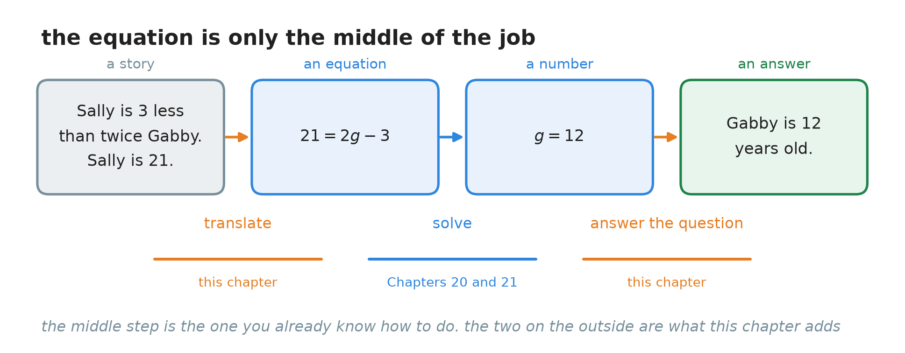
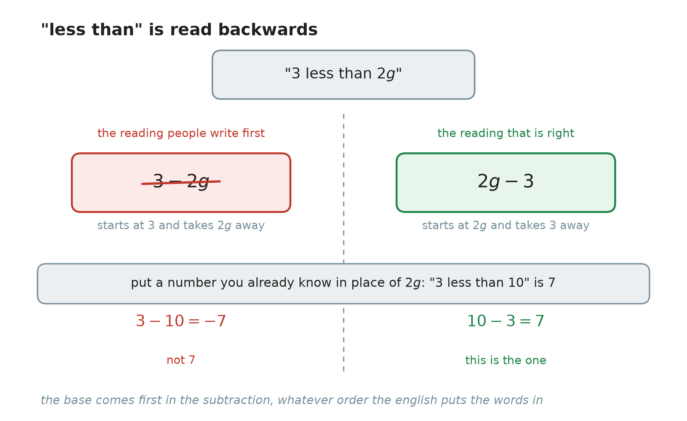
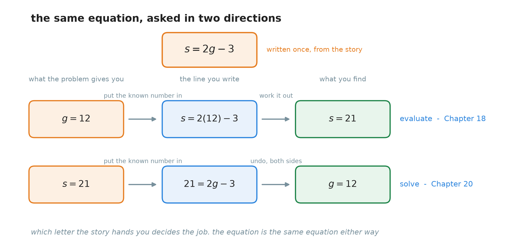
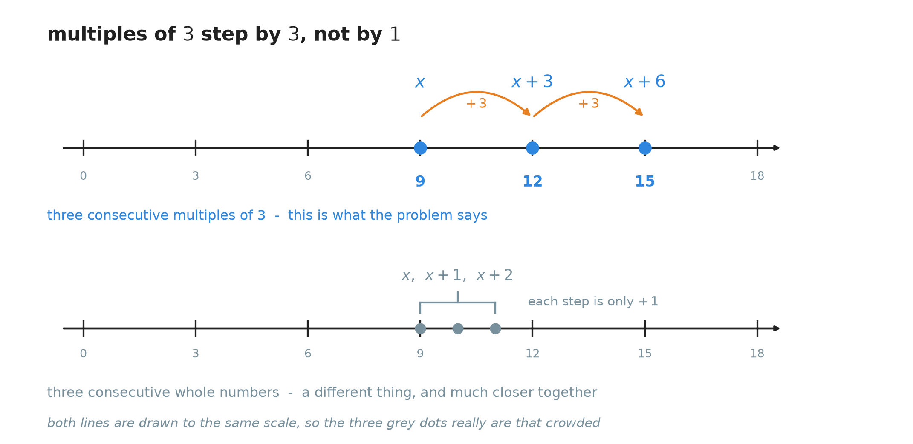
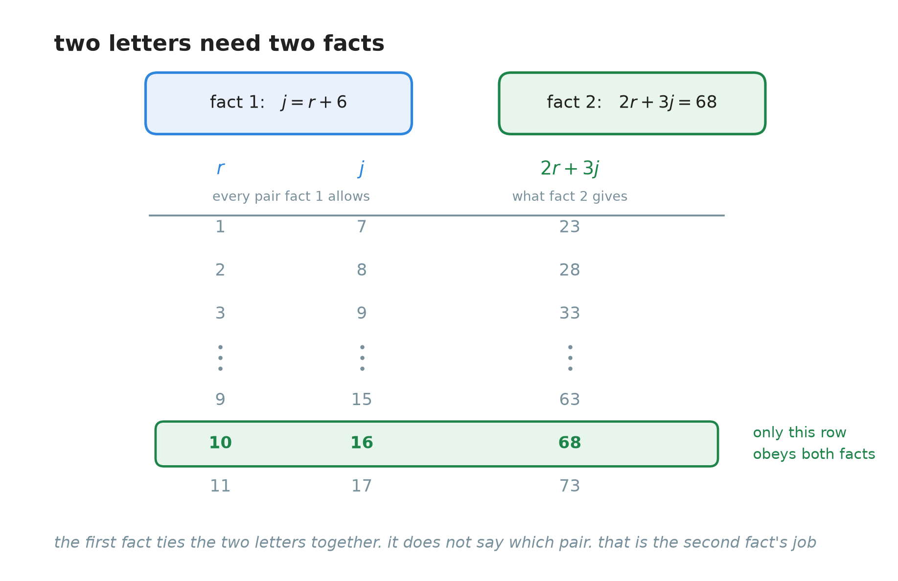
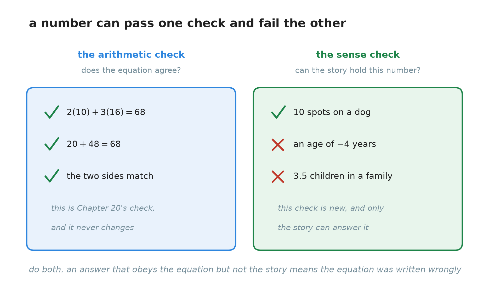

# 22. Word problems: turning a story into an equation

**What this chapter teaches**
How to take a problem written in ordinary words and turn it into an equation you can solve. It
covers the phrases that people translate backwards, how to describe several unknown quantities
with a single letter, and what to do when a story hands you two letters instead of one.

**Before you start**
This chapter uses the whole of
[Chapter 20](./../20_Solving_Equations/20_Solving_Equations.md)
and
[Chapter 21](./../21_Equations_With_The_Letter_On_Both_Sides/21_Equations_With_The_Letter_On_Both_Sides.md)
to solve its equations, and it continues
[Chapter 18, section 5](./../18_Introduction_To_Algebra_Variables/18_Introduction_To_Algebra_Variables.md#5-turning-a-real-situation-into-an-equation),
which first turned a situation into a rule. It needs the distributive property from
[Chapter 19, section 3](./../19_The_Number_Properties_Of_Algebra/19_The_Number_Properties_Of_Algebra.md#3-handing-the-multiplier-out)
and collecting like terms from
[Chapter 19, section 4](./../19_The_Number_Properties_Of_Algebra/19_The_Number_Properties_Of_Algebra.md#4-collecting-like-terms).
In section 5 it uses **multiples** from
[Chapter 12](./../12_Divisibility_And_Prime_Numbers/12_Divisibility_And_Prime_Numbers.md#13-one-fact-said-in-three-ways).

---

## Table of contents

1. [The part of the work that is not algebra](#1-the-part-of-the-work-that-is-not-algebra)
2. [Naming the unknowns](#2-naming-the-unknowns)
3. [Translating the words](#3-translating-the-words)
4. [A first problem, and the same problem turned round](#4-a-first-problem-and-the-same-problem-turned-round)
5. [Several unknowns, one letter](#5-several-unknowns-one-letter)
6. [When the story gives you two letters](#6-when-the-story-gives-you-two-letters)
7. [Answering the question, and checking the answer](#7-answering-the-question-and-checking-the-answer)
8. [Glossary](#8-glossary)
9. [Check your understanding](#9-check-your-understanding)
10. [Important notes](#10-important-notes)

---

## 1. The part of the work that is not algebra

### 1.1 Where the equations have been coming from

Chapters 20 and 21 taught you to solve equations. Every one of those equations arrived already
written. Somebody had put $5x - 3 = 12$ on the page, and your job started there.

Outside a textbook, nobody hands you an equation. You get a story:

> Sally is $3$ years younger than twice the age of her sister Gabby. Sally is $21$. How old is
> Gabby?

There is no equals sign anywhere in that. Before Chapter 20 can help you, somebody has to turn
those words into $21 = 2g - 3$. That somebody is you, and that is what this chapter teaches.

    

**Figure 1 — Look at the two orange arrows. Everything between them is work you can already do.
This chapter adds the step before it and the step after it.**

**Definition — word problem.** A **word problem** is a question about a real situation, written
in ordinary words instead of symbols. You have to write the equation yourself before you can
solve it.

### 1.2 What is new here, and what is not

[Chapter 18, section 5](./../18_Introduction_To_Algebra_Variables/18_Introduction_To_Algebra_Variables.md#5-turning-a-real-situation-into-an-equation)
already turned a situation into symbols once: a burger costs $3$ dollars, so $y = 3x$. So what is
different now?

In Chapter 18 the thing you did not know was the **output**. You chose the input, put it into the
rule, and worked forwards. That is evaluating.

Here the thing you do not know is hidden **inside** the sentence. The story tells you the answer
that came out and asks you which number went in. You cannot work forwards, so you have to solve.

| | Chapter 18, section 5 | This chapter |
| --- | --- | --- |
| What the story gives you | the input | a fact about the unknown |
| What you write | a rule | an equation |
| What you do next | evaluate it | solve it |
| Which chapter does that | Chapter 18, section 6 | Chapters 20 and 21 |

**Note.** The translating itself is the same skill in both cases, and Chapter 18 started it. What
this chapter adds is a longer list of phrases, two situations that are genuinely harder, and the
habit of finishing properly.

### 1.3 Four steps

Every problem in this chapter is done in the same four steps.

1. **Name the unknowns.** Give each unknown quantity a letter, and write down what it measures.
2. **Translate the story into an equation.** Take the sentence in pieces, not all at once.
3. **Solve the equation.** This is Chapter 20 and Chapter 21, unchanged.
4. **Answer the question that was asked**, and check the answer against the story.

Steps 1, 2 and 4 are this chapter. Step 3 you already own.

**Warning.** Step 1 is the step people skip, exactly as
[Chapter 18, section 5.1](./../18_Introduction_To_Algebra_Variables/18_Introduction_To_Algebra_Variables.md#51-name-the-quantities-first-then-write-the-rule)
warned. Skipping it is why word problems feel impossible. Writing one line — "$g$ is Gabby's age
in years" — costs five seconds and makes the rest of the work obvious.

### Summary of section 1

* A **word problem** is a question written in words, with no equation given.
* Chapters 20 and 21 start at the equation. A real problem starts one step earlier.
* Chapter 18 turned words into a rule and worked forwards. Here the unknown is inside the story,
  so you must solve instead.
* The four steps: name the unknowns, translate, solve, answer the question.
* Only steps 1, 2 and 4 are new. Step 3 is work you have already done.

---

## 2. Naming the unknowns

### 2.1 Choose a letter that says what it is

You may use any letter you like. $x$ always works. But a letter that reminds you of the quantity
is easier to keep track of:

* $g$ for Gabby's age,
* $r$ for Rover's spots,
* $s$ for the items in a small box.

When a problem has three or four unknowns, this stops mattering a little and starts mattering a
lot. A line that reads $2r + 3j = 68$ is readable a week later. The same line written
$2a + 3b = 68$ is not.

### 2.2 Write down what the letter measures

This is the part that is worth being fussy about.

A letter never stands for a **person** or a **thing**. It stands for a **number**. So do not
write "$g$ is Gabby". Write:

> $g$ — Gabby's age, in years.

The reason is not tidiness. It is that
[Chapter 18, section 2.1](./../18_Introduction_To_Algebra_Variables/18_Introduction_To_Algebra_Variables.md#21-a-variable-is-a-quantity-that-can-change)
defined a variable as a **quantity**, and a quantity has a unit. Once you have written "in
years", the equation $g = 12$ reads back into the story by itself: Gabby is $12$ years old. If
you had written "$g$ is Gabby", then $g = 12$ says "Gabby is $12$", which is not a sentence about
anything in particular.

**Note.** The unit also catches mistakes. If your working ever produces "$g$ years $=$ $5$
spots", something has gone wrong several lines earlier.

### 2.3 Which quantity should get the letter

When one quantity is described **using** another, give the letter to the one that is being
described **from**.

Read the sentence again: *Sally is $3$ years younger than twice the age of Gabby.*

Sally's age is built out of Gabby's age. Gabby's age is not built out of anything. So Gabby's age
is the natural starting point, and everything else is written in terms of it:

* $g$ — Gabby's age, in years.
* Sally's age — $2g - 3$.

You could work the other way round, but then you would have to untangle Gabby's age out of
Sally's before you could write anything down. Choosing the base quantity is a choice about how
much work you want to do, not about right and wrong.

### Summary of section 2

* Use a letter that reminds you of the quantity: $g$ for Gabby, $r$ for Rover.
* A letter stands for a **number**, never for a person or an object.
* Write down what the letter measures, including its unit: "$g$ — Gabby's age, in years".
* When one quantity is described from another, give the letter to the one doing the describing.

---

## 3. Translating the words

### 3.1 Take the sentence in pieces

Nobody can translate a whole sentence in one go. Cut it into phrases and translate each phrase on
its own, exactly as
[Chapter 18, section 5.4](./../18_Introduction_To_Algebra_Variables/18_Introduction_To_Algebra_Variables.md#54-from-words-to-symbols-one-phrase-at-a-time)
did with Bobo's television.

### 3.2 The phrases and what they mean

Here are the phrases used in this chapter, with what each one becomes.

| The words | The symbols | An example |
| --- | --- | --- |
| is, equals, is equal to | $=$ | Sally **is** $21$ $\to$ $s = 21$ |
| the sum of $A$ and $B$ | $A + B$ | the sum of three ages $\to$ $a + b + c$ |
| $6$ more than $B$ | $B + 6$ | $6$ more spots than Rover $\to$ $r + 6$ |
| $3$ less than $B$ | $B - 3$ | $3$ less than twice Gabby $\to$ $2g - 3$ |
| $3$ younger than $B$ | $B - 3$ | $3$ years younger than Gabby $\to$ $g - 3$ |
| twice $B$, double $B$ | $2B$ | twice Gabby's age $\to$ $2g$ |
| three times $B$ | $3B$ | three times Jasper's spots $\to$ $3j$ |
| a total of | $=$ | a total of $43$ items $\to$ $\ldots = 43$ |

**Note.** "Is" is the word that becomes the equals sign. If a sentence has no word like *is*,
*equals* or *a total of* in it, it is probably not an equation yet — it is only a phrase, and
[Chapter 18, section 4.2](./../18_Introduction_To_Algebra_Variables/18_Introduction_To_Algebra_Variables.md#42-an-equation-is-a-sentence)
explains why that matters.

### 3.3 "Less than" is read backwards

This is the single most common mistake in word problems, and it is worth a whole subsection.

The phrase is "$3$ less than $2g$". The words arrive in the order *three*, then *two g*. It feels
natural to write them down in that order, as $3 - 2g$. **That is wrong.**

    

**Figure 2 — The phrase says "start at $2g$ and go down by $3$". Test it with a number you
already know: "$3$ less than $10$" is $7$, and only $10 - 3$ gives $7$.**

The reason is what the phrase actually says. "$3$ less than $2g$" describes a number that sits
$3$ below $2g$. So $2g$ is where you start, and $3$ is what you take away:

$$
2g - 3
$$

**Explanation — the test that always settles it.** If you are not sure which way round a phrase
goes, put in a number you can check in your head. "$3$ less than $10$" is obviously $7$. Now try
both readings:

$$
10 - 3 = 7
$$

$$
3 - 10 = -7
$$

The first one gives $7$, so the base goes first. This test takes five seconds and never fails.

**Warning.** "Younger than", "fewer than", "smaller than" and "below" all behave the same way.
*Maya is $5$ years younger than Kevin* means $k - 5$, not $5 - k$.

### 3.4 Why "more than" seems not to turn round

Here is a fair question. "$3$ less than $2g$" turns round, but "$6$ more than $r$" does not seem
to — people write $r + 6$ and nobody ever complains.

In fact "more than" turns round too. "$6$ more than $r$" starts at $r$ and goes up by $6$, so the
base goes first there as well: $r + 6$.

The difference is that it does not matter. Addition can be done in either order, which is the
commutative property from
[Chapter 19, section 2.1](./../19_The_Number_Properties_Of_Algebra/19_The_Number_Properties_Of_Algebra.md#21-changing-the-order):

$$
r + 6 = 6 + r
$$

Both orders give the same number, so writing the wrong one costs you nothing.

Subtraction refuses to do this, and
[Chapter 19, section 2.3](./../19_The_Number_Properties_Of_Algebra/19_The_Number_Properties_Of_Algebra.md#23-subtraction-and-division-still-refuse)
said so plainly:

$$
10 - 3 \neq 3 - 10
$$

So with subtraction the order is the whole of the meaning, and getting it backwards changes the
answer. That is the real reason "less than" is dangerous and "more than" is not. It is not a
special rule about English. It is one property that addition has and subtraction does not.

### 3.5 One sentence, translated in pieces

*Sally is $3$ years younger than twice the age of Gabby.*

| The words | The symbols | Why |
| --- | --- | --- |
| Gabby's age | $g$ | the quantity everything else is described from |
| twice the age of Gabby | $2g$ | "twice" means multiply by $2$ |
| $3$ years younger than $2g$ | $2g - 3$ | start at $2g$, go down by $3$ |
| Sally is | $s =$ | "is" becomes the equals sign |

Put the pieces together:

$$
s = 2g - 3
$$

In words: take Gabby's age, double it, then take $3$ away. That is Sally's age.

* $s$ — Sally's age, in years.
* $g$ — Gabby's age, in years.
* $2$ — the coefficient, because Sally's age is built from *twice* Gabby's.
* $3$ — a constant, the number of years Sally falls short of that.

### Summary of section 3

* Translate one phrase at a time, never a whole sentence at once.
* "Is", "equals" and "a total of" become the equals sign $=$.
* "$A$ less than $B$" is $B - A$. The base comes first.
* Test a doubtful phrase with a number you know: "$3$ less than $10$" is $7$.
* "More than" turns round too, but addition is commutative, so nobody notices.
* Subtraction is not commutative, which is exactly why "less than" catches people out.

---

## 4. A first problem, and the same problem turned round

### 4.1 When the unknown is already alone

> **Example.** Sally is $3$ years younger than twice the age of Gabby. Gabby is $12$ years old.
> How old is Sally?

Section 3.5 already did the translating:

$$
s = 2g - 3
$$

The story then tells you $g = 12$. The letter you want, $s$, is already alone on the left. So
there is nothing to solve — you only have to put $12$ in place of $g$ and work it out. That is
evaluating, from
[Chapter 18, section 6](./../18_Introduction_To_Algebra_Variables/18_Introduction_To_Algebra_Variables.md#6-evaluating-an-expression):

$$
s = 2(12) - 3
$$

$$
s = 24 - 3
$$

$$
s = 21
$$

**Sally is $21$ years old.**

### 4.2 The same story, asked the other way

Now change one word in the question.

> **Example.** Sally is $3$ years younger than twice the age of Gabby. Sally is $21$ years old.
> How old is Gabby?

The story is the same story, so the equation is the same equation:

$$
s = 2g - 3
$$

But this time the number you are given is $s$, and the letter you want is $g$ — and $g$ is
buried inside the right-hand side. Put in what you know:

$$
21 = 2g - 3
$$

This is a two-step equation, the shape of
[Chapter 20, section 5](./../20_Solving_Equations/20_Solving_Equations.md#5-more-than-one-step).
Add $3$ to both sides:

$$
21 + 3 = 2g - 3 + 3
$$

$$
24 = 2g
$$

Divide both sides by $2$:

$$
\frac{24}{2} = \frac{2g}{2}
$$

$$
12 = g
$$

**Check.** Put $12$ back into the original equation. The right side is $2(12) - 3 = 24 - 3 = 21$,
and the left side is $21$. They agree.

**Gabby is $12$ years old.**

### 4.3 One equation, two jobs

Look at what just happened. One story, one equation, and two completely different pieces of work.

    

**Figure 3 — The orange card is written once, from the story. Which letter the question hands you
decides whether you go along the upper lane or the lower one.**

**Note.** This is why section 2 insists on writing the equation from the story **before** looking
at which numbers you were given. The equation describes the situation. It does not care which end
of it you happen to know.

### Summary of section 4

* If the unknown is already alone on one side, you only have to evaluate.
* If the unknown is buried inside the other side, you have to solve.
* The same story gives the same equation either way.
* Which letter the question gives you decides which of the two jobs you do.
* Always check by putting your answer into the original equation.

---

## 5. Several unknowns, one letter

### 5.1 When the quantities are tied together

> **Example.** Three brothers — Huey, Louie and Dewey — have ages that are three consecutive
> multiples of $3$. The sum of their ages is $36$. How old is each brother?

Three unknowns, and not one of them is given. That looks much worse than section 4. It is not,
because the three ages are not free to be anything. They are tied to each other, and one letter
is enough to describe all three.

### 5.2 Consecutive multiples

> **Definition — consecutive multiples.** **Consecutive multiples** of a number $n$ are multiples
> of $n$ that follow each other with none missed out. The multiples of $3$ are
> $3, 6, 9, 12, 15, \ldots$, so $9$, $12$ and $15$ are three consecutive multiples of $3$.

**Multiple** is from
[Chapter 12, section 1.3](./../12_Divisibility_And_Prime_Numbers/12_Divisibility_And_Prime_Numbers.md#13-one-fact-said-in-three-ways).
The new word is **consecutive**, and it just means "one after another, with no gaps".

The useful fact is how far apart they are. To get from one multiple of $3$ to the next one, you
add $3$. So if the youngest brother's age is $x$:

* Huey — $x$
* Louie — $x + 3$
* Dewey — $x + 3 + 3$, which is $x + 6$

    

**Figure 4 — Each orange hop on the upper line is $+3$, so the three ages are $x$, $x + 3$ and
$x + 6$. The grey dots below show how much closer together three consecutive **whole numbers**
would be. Both lines are drawn to the same scale.**

**Warning — this is where the mistake happens.** Three consecutive **whole numbers** go up by $1$
each time: $x$, $x + 1$, $x + 2$. Three consecutive **multiples of $3$** go up by $3$ each time:
$x$, $x + 3$, $x + 6$. In general, consecutive multiples of $n$ go up by $n$: $x$, $x + n$,
$x + 2n$. Using $+1$ when the problem says multiples of $3$ gives an answer that is wrong even
though the arithmetic is perfect — question 7 shows exactly how that goes.

### 5.3 Writing and solving the equation

The story says the three ages add up to $36$:

$$
x + (x + 3) + (x + 6) = 36
$$

The brackets are only there to show which age is which. Collect the like terms, using
[Chapter 19, section 4](./../19_The_Number_Properties_Of_Algebra/19_The_Number_Properties_Of_Algebra.md#4-collecting-like-terms).
There are three $x$ terms and two plain numbers:

$$
x + x + x = 3x
$$

$$
3 + 6 = 9
$$

So the equation becomes:

$$
3x + 9 = 36
$$

Subtract $9$ from both sides:

$$
3x + 9 - 9 = 36 - 9
$$

$$
3x = 27
$$

Divide both sides by $3$:

$$
\frac{3x}{3} = \frac{27}{3}
$$

$$
x = 9
$$

### 5.4 $x = 9$ is not the answer

The question asked how old **each brother** is. It did not ask for $x$. So go back to the three
expressions and work each one out:

* Huey — $x = 9$
* Louie — $x + 3 = 9 + 3 = 12$
* Dewey — $x + 6 = 9 + 6 = 15$

**Check.** $9 + 12 + 15$. Take it in two steps: $9 + 12 = 21$, and $21 + 15 = 36$. That is the
total the story gave.

**Huey is $9$, Louie is $12$ and Dewey is $15$.**

**Warning.** Stopping at $x = 9$ is the commonest way to lose marks on a problem you have
actually solved. The letter was a tool for finding the ages. It was never the thing being asked
for. Read the question again before you write your final line — section 7.1 makes this a habit.

### Summary of section 5

* Several unknowns can share one letter when the story ties them together.
* **Consecutive multiples** of $n$ are multiples of $n$ with none missed out.
* They go up by $n$ each time: $x$, $x + n$, $x + 2n$.
* Consecutive whole numbers go up by $1$. That is a different thing.
* Collect like terms, then solve as usual.
* Finding $x$ is not finishing. Put $x$ back into each expression and answer what was asked.

---

## 6. When the story gives you two letters

### 6.1 Why one fact is not enough

> **Example.** Rover and Jasper are dogs with spots. Jasper has $6$ more spots than Rover. Twice
> Rover's spots plus three times Jasper's spots is $68$. How many spots does each dog have?

Name the unknowns first:

* $r$ — the number of spots Rover has.
* $j$ — the number of spots Jasper has.

Now translate, one sentence at a time. *Jasper has $6$ more spots than Rover:*

$$
j = r + 6
$$

*Twice Rover's spots plus three times Jasper's spots is $68$:*

$$
2r + 3j = 68
$$

Two letters, and this time they cannot be squeezed into one the way the brothers' ages were —
because $j = r + 6$ does not say what $r$ is. It only says how $j$ relates to $r$. Rover could
have $1$ spot and Jasper $7$. Rover could have $2$ and Jasper $8$. The first fact allows an
endless list of pairs.

    

**Figure 5 — Every row obeys the first fact. Only one row also obeys the second. That is why a
problem with two letters needs two facts.**

**Note — a rule worth remembering.** Two unknowns need two separate facts. Three unknowns need
three. If a problem seems impossible, count the letters and count the facts before you decide it
is your fault.

### 6.2 Substitution

You are not going to test rows one at a time. There is a much better move.

The first fact says $j = r + 6$. Read that carefully: it says the number $j$ **is** the number
$r + 6$. They are two names for one number. So anywhere the letter $j$ appears, you may write
$r + 6$ instead, and nothing changes.

> **Definition — substitution.** **Substitution** means replacing a letter with an expression
> that is equal to it. The equation you get says exactly the same thing as the one you started
> with.

**Explanation — why this is allowed.**
[Chapter 18, section 2.3](./../18_Introduction_To_Algebra_Variables/18_Introduction_To_Algebra_Variables.md#23-one-letter-keeps-one-value-at-a-time)
said that a letter holds one value at a time, and holds that same value everywhere in one
calculation. So $j$ is a particular number, and $r + 6$ is that same particular number written a
longer way. Swapping one for the other is like paying with two coins of $5$ instead of one coin
of $10$. The amount does not change.

This is the same idea
[Chapter 21, section 2.1](./../21_Equations_With_The_Letter_On_Both_Sides/21_Equations_With_The_Letter_On_Both_Sides.md#2-moving-a-whole-term-across)
used when it subtracted a whole term with a letter in it from both sides. A letter behaves like a
number because it **is** a number.

### 6.3 Doing it

Start from the second fact, and write $(r + 6)$ wherever $j$ stood:

$$
2r + 3j = 68
$$

$$
2r + 3(r + 6) = 68
$$

The two letters have become one. Now open the bracket, using
[Chapter 19, section 3.2](./../19_The_Number_Properties_Of_Algebra/19_The_Number_Properties_Of_Algebra.md#32-the-rule-with-a-letter-inside-the-bracket).
The $3$ must reach **both** things inside:

$$
3 \times r = 3r
$$

$$
3 \times 6 = 18
$$

$$
2r + 3r + 18 = 68
$$

Collect the like terms, $2r + 3r = 5r$:

$$
5r + 18 = 68
$$

Subtract $18$ from both sides:

$$
5r + 18 - 18 = 68 - 18
$$

$$
5r = 50
$$

Divide both sides by $5$:

$$
\frac{5r}{5} = \frac{50}{5}
$$

$$
r = 10
$$

Rover has $10$ spots. Now find $j$, using the fact that is already in the right shape:

$$
j = r + 6
$$

$$
j = 10 + 6
$$

$$
j = 16
$$

**Check, in the second fact** — the one that was not used to find $j$:

$$
2(10) + 3(16) = 20 + 48 = 68
$$

That is the total the story gave.

**Rover has $10$ spots and Jasper has $16$ spots.**

### 6.4 Which letter to substitute

Look for a fact that already has a single letter alone on one side. Here $j = r + 6$ is exactly
that, so $j$ is the one to replace.

If neither fact is in that shape, rearrange the easier of the two first. For example
$j - r = 6$ becomes $j = r + 6$ by adding $r$ to both sides, and then you are back to the case
above.

**Warning.** Substitute into the **other** equation, not the one you took the expression from.
Putting $r + 6$ into $j = r + 6$ gives $r + 6 = r + 6$, which is true, useless and tells you
nothing. You need the second fact to do any work.

### Summary of section 6

* Two unknowns need two separate facts.
* One fact on its own allows an endless list of pairs.
* **Substitution** replaces a letter with an expression equal to it.
* It is allowed because a letter is one number, and the expression is that same number.
* Substitute into the *other* equation, then solve the one letter that is left.
* Finish by finding the second letter too, and check in the fact you did not use.

---

## 7. Answering the question, and checking the answer

### 7.1 Read the question again

Before writing your final line, go back and read the question one more time. Ask two things:

* **What was actually asked?** The brothers' problem asked for three ages, not for $x$. The dogs'
  problem asked for two numbers of spots, not one.
* **In what form?** "How old is Gabby?" wants a sentence with a unit in it — "Gabby is $12$ years
  old" — not the bare symbol $g = 12$.

This sounds obvious. It is still the most common reason a correct piece of algebra scores no
marks.

### 7.2 Two different checks

Chapter 20 taught one check, and it is still the first thing to do.

> **Definition — the arithmetic check.** Put your number back into the **original** equation and
> work out both sides separately. If they come out the same, the number satisfies the equation.

That is
[Chapter 20, section 4.5](./../20_Solving_Equations/20_Solving_Equations.md#45-the-check-every-time),
unchanged. Every worked example in this chapter has done it.

A word problem needs a second check as well, because the equation might not be the right
equation.

> **Definition — the sense check.** Read the number back into the story and ask whether the story
> can hold it. A length cannot be negative. A number of children cannot be $3.5$. An age of $-4$
> years is not an age.

    

**Figure 6 — The left check asks whether your number obeys the equation. The right check asks
whether the story can hold it. They are different questions, and a number can pass one and fail
the other.**

**Explanation — why the second check catches real mistakes.** Your solving can be perfect and
your answer can still be wrong, because the mistake happened in step 2, when you wrote the
equation. A wrong equation is still an equation. It has a solution, and the arithmetic check will
happily confirm that solution — of the wrong equation.

The sense check is the only check that looks at the story. If your answer says a dog has $-4$
spots, the arithmetic is not the problem. Go back and read the translation again.

### 7.3 The four steps in one place

1. **Name the unknowns.** One letter each, with what it measures and its unit.
2. **Translate.** Phrase by phrase. Watch for "less than". Count the facts against the letters.
3. **Solve.** Chapter 20 for one letter, Chapter 21 when the letter lands on both sides,
   substitution when there are two letters.
4. **Answer and check.** Work out every quantity that was asked for, write a sentence with units,
   then do both checks.

### Summary of section 7

* Read the question again before writing your last line.
* Answer everything that was asked, in a sentence, with units.
* The **arithmetic check** asks whether your number obeys the equation.
* The **sense check** asks whether the story can hold your number.
* A perfect solution of a wrongly written equation passes the first check and fails the second.

---

## 8. Glossary

* **Word problem** — a question about a real situation, written in ordinary words. You have to
  write the equation yourself before you can solve it.
* **Consecutive multiples** — multiples of a number that follow each other with none missed out.
  Consecutive multiples of $n$ go up by $n$ each time: $x$, $x + n$, $x + 2n$.
* **Substitution** — replacing a letter with an expression that is equal to it, so that two
  letters become one.
* **The arithmetic check** — putting your answer back into the original equation and seeing
  whether both sides agree.
* **The sense check** — reading your answer back into the story and asking whether the story can
  hold that number.

**Note.** Every other term in this chapter was defined earlier in the book and is not defined
again here. **Variable**, **constant**, **coefficient**, **equation**, **input** and **output**
are
[Chapter 18](./../18_Introduction_To_Algebra_Variables/18_Introduction_To_Algebra_Variables.md#8-glossary);
**evaluating** and **substituting a number** are
[Chapter 18, section 6](./../18_Introduction_To_Algebra_Variables/18_Introduction_To_Algebra_Variables.md#6-evaluating-an-expression);
**the commutative property**, **the distributive property** and **like terms** are
[Chapter 19](./../19_The_Number_Properties_Of_Algebra/19_The_Number_Properties_Of_Algebra.md#9-glossary);
**solution**, **solving**, **isolating the variable** and **the properties of equality** are
[Chapter 20](./../20_Solving_Equations/20_Solving_Equations.md#8-glossary);
**term**, **variable term** and **constant term** are
[Chapter 21](./../21_Equations_With_The_Letter_On_Both_Sides/21_Equations_With_The_Letter_On_Both_Sides.md#6-glossary);
**multiple** is
[Chapter 12](./../12_Divisibility_And_Prime_Numbers/12_Divisibility_And_Prime_Numbers.md#13-one-fact-said-in-three-ways).

---

## 9. Check your understanding

**Question 1.** Maya is $5$ years younger than $3$ times the age of her cousin Kevin. Kevin is
$10$ years old. How old is Maya?

Answer

**Name the unknowns.** $k$ — Kevin's age in years. $m$ — Maya's age in years.

**Translate.** "$3$ times the age of Kevin" is $3k$. "$5$ years younger than $3k$" starts at $3k$
and goes down by $5$, so it is $3k - 5$. "Maya is" gives the equals sign:

$$
m = 3k - 5
$$

**Solve.** $m$ is already alone, and $k = 10$ is given, so evaluate:

$$
m = 3(10) - 5
$$

$$
m = 30 - 5
$$

$$
m = 25
$$

**Answer.** Maya is $25$ years old. The sense check passes — $25$ is a possible age.

**Question 2.** The sum of three consecutive multiples of $4$ is $60$. What are the three
numbers?

Answer

**Name the unknown.** $x$ — the smallest of the three numbers.

Consecutive multiples of $4$ go up by $4$, so the three numbers are $x$, $x + 4$ and $x + 8$.

**Translate.** "The sum ... is $60$":

$$
x + (x + 4) + (x + 8) = 60
$$

**Solve.** Collect like terms: $x + x + x = 3x$, and $4 + 8 = 12$.

$$
3x + 12 = 60
$$

$$
3x = 60 - 12
$$

$$
3x = 48
$$

$$
x = \frac{48}{3} = 16
$$

**Answer the question.** It asked for three numbers, not for $x$:

* first — $x = 16$
* second — $x + 4 = 16 + 4 = 20$
* third — $x + 8 = 16 + 8 = 24$

**Check.** $16 + 20 = 36$, and $36 + 24 = 60$. And each one is a multiple of $4$:
$16 = 4 \times 4$, $20 = 4 \times 5$, $24 = 4 \times 6$. They are consecutive, because $4$, $5$
and $6$ follow each other.

**The three numbers are $16$, $20$ and $24$.**

**Question 3.** A shop sells small boxes and large boxes. A large box holds $4$ more items than a
small box. Three small boxes and two large boxes hold $43$ items in total. How many items does
each kind of box hold?

Answer

**Name the unknowns.** $s$ — the number of items in a small box. $l$ — the number of items in a
large box.

**Translate.** Two sentences, two facts:

$$
l = s + 4
$$

$$
3s + 2l = 43
$$

**Solve by substitution.** The first fact has $l$ alone, so write $(s + 4)$ in place of $l$ in
the second:

$$
3s + 2(s + 4) = 43
$$

Open the bracket — the $2$ reaches both terms: $2 \times s = 2s$ and $2 \times 4 = 8$.

$$
3s + 2s + 8 = 43
$$

$$
5s + 8 = 43
$$

$$
5s = 43 - 8 = 35
$$

$$
s = \frac{35}{5} = 7
$$

Now find $l$:

$$
l = 7 + 4 = 11
$$

**Check in the second fact.** $3(7) + 2(11) = 21 + 22 = 43$.

**A small box holds $7$ items and a large box holds $11$ items.** Both are whole numbers, so the
sense check passes.

**Question 4.** Write each of these in symbols, using $n$ for the number.

(a) $7$ less than $n$  (b) $7$ more than $n$  (c) twice $n$, then $5$ less  (d) $n$ less than $7$

Answer

(a) $n - 7$. The base $n$ comes first.

(b) $n + 7$. Also base first — although $7 + n$ is the same number, because addition is
commutative.

(c) $2n - 5$. Double it first, then take $5$ from the doubled amount.

(d) $7 - n$. This one is the reverse of (a), and the words tell you so: here $7$ is the base and
$n$ is what gets taken away.

Compare (a) and (d) carefully. The words are made of the same two pieces in a different order,
and they mean different things. That is subtraction not being commutative, from
[Chapter 19, section 2.3](./../19_The_Number_Properties_Of_Algebra/19_The_Number_Properties_Of_Algebra.md#23-subtraction-and-division-still-refuse).

**Question 5.** Sally is $3$ years younger than twice Gabby's age. This year Sally is $15$. How
old is Gabby?

Answer

The equation is the one from section 3.5, because the story has not changed:

$$
s = 2g - 3
$$

Put in $s = 15$:

$$
15 = 2g - 3
$$

Add $3$ to both sides:

$$
18 = 2g
$$

Divide both sides by $2$:

$$
9 = g
$$

**Check.** $2(9) - 3 = 18 - 3 = 15$. Correct.

**Gabby is $9$ years old.** Notice that this is the lower lane of figure 3, with a different
number in it.

**Question 6.** Why does it not matter whether you write "$6$ more than $r$" as $r + 6$ or
$6 + r$, when it matters very much whether you write "$6$ less than $r$" as $r - 6$ or $6 - r$?

Answer

Because addition is commutative and subtraction is not.

$r + 6$ and $6 + r$ are the same number for every value of $r$. That is the commutative property
of addition, from
[Chapter 19, section 2.1](./../19_The_Number_Properties_Of_Algebra/19_The_Number_Properties_Of_Algebra.md#21-changing-the-order).
So the wrong order is not really wrong — it is the same thing.

$r - 6$ and $6 - r$ are not the same number. Try $r = 10$: one gives $4$, the other gives $-4$.
Swapping them changes the answer.

Both phrases really do put the base first. It is only visible in the subtraction, because only
subtraction cares about the order.

**Question 7.** A student solves the brothers' problem, but writes the three ages as $x$, $x + 1$
and $x + 2$. Their arithmetic is perfect. What answer do they get, and how would you know it is
wrong without being told?

Answer

Their equation is:

$$
x + (x + 1) + (x + 2) = 36
$$

$$
3x + 3 = 36
$$

$$
3x = 33
$$

$$
x = 11
$$

So they say the ages are $11$, $12$ and $13$.

Now the interesting part. The **arithmetic check passes**: $11 + 12 = 23$, and $23 + 13 = 36$.
The three ages really do add up to $36$.

The **sense check fails**. The story said the ages are consecutive multiples of $3$, and $11$ is
not a multiple of $3$ at all — $11 \div 3$ leaves a remainder of $2$. Neither is $13$.

This is exactly the case figure 6 is about. The student solved their equation perfectly. Their
equation was the wrong equation, because $x + 1$ and $x + 2$ describe consecutive whole numbers,
not consecutive multiples of $3$. Only a check against the story finds a mistake like this.

**Question 8.** Jasper has $6$ more spots than Rover. Give three different pairs of numbers that
fit this fact. What does that tell you about solving for two letters?

Answer

The fact is $j = r + 6$. Three pairs that fit it:

* $r = 1$, $j = 7$
* $r = 4$, $j = 10$
* $r = 20$, $j = 26$

There are endlessly many more. One fact about two letters does not pin either of them down — it
only says how far apart they are.

So a problem with two unknowns needs two facts. The first ties the letters together; the second
picks out which pair is the answer. Figure 5 shows this as a list of pairs with one row
highlighted.

**Question 9.** A student solves the brothers' problem correctly and writes "$x = 9$" as their
final answer. What is missing, and why does it matter?

Answer

The question asked how old **each brother** is. It asked for three numbers, and $x$ was never one
of the things asked about — it was a tool for finding them.

The finished answer puts $9$ back into each expression:

* Huey — $x = 9$
* Louie — $x + 3 = 12$
* Dewey — $x + 6 = 15$

and then says it in words: Huey is $9$, Louie is $12$ and Dewey is $15$.

It matters because the person reading the answer asked a question about three brothers and has
been handed a letter. Step 4 of the method exists for exactly this.

**Question 10.** A family problem leads to the equation $2n + 5 = 12$, where $n$ is the number of
children in the family. Solve it. What should you say about the answer?

Answer

Solve it first. Subtract $5$ from both sides:

$$
2n = 12 - 5
$$

$$
2n = 7
$$

Divide both sides by $2$:

$$
n = \frac{7}{2} = 3.5
$$

The arithmetic check passes: $2(3.5) + 5 = 7 + 5 = 12$.

The sense check does not. A family cannot have $3.5$ children. The number of children is a
counting number, so $n$ has to be a whole number, and $3.5$ is not one.

So the honest answer is: this equation has a solution, but the **story** does not. Either the
numbers in the story are impossible, or the equation was translated wrongly and should be
written again. What you must not do is round $3.5$ to $4$ and carry on — $4$ does not satisfy the
equation, and inventing an answer that fits neither check is worse than saying something is
wrong.

---

## 10. Important notes

**The mistakes people actually make.**

* **Writing "less than" in the order the words arrive.** "$3$ less than $2g$" is $2g - 3$. This
  is the mistake, ahead of everything else on this list. When in doubt, test the phrase with a
  number you know.
* **Skipping step 1.** Starting to write symbols before deciding what each letter measures. Every
  later line then depends on something you never wrote down.
* **Saying "$g$ is Gabby" instead of "$g$ is Gabby's age in years".** A letter is a number. If it
  has no unit, your answer will not have one either.
* **Using $x$, $x + 1$, $x + 2$ for consecutive multiples.** That describes consecutive whole
  numbers. Multiples of $n$ step by $n$.
* **Distributing into the first term only.** $3(r + 6)$ is $3r + 18$, not $3r + 6$. This is
  [Chapter 19, section 3.3](./../19_The_Number_Properties_Of_Algebra/19_The_Number_Properties_Of_Algebra.md#33-every-term-inside-must-be-reached)'s
  warning, and substitution creates a bracket almost every time, so it comes up constantly here.
* **Stopping at $x$.** $x = 9$ answers no question anybody asked. Work out every quantity the
  problem wanted.
* **Substituting into the equation you took the expression from.** It gives a line that is true
  and empty, like $r + 6 = r + 6$.
* **Checking only the arithmetic.** It cannot tell you that the equation itself was written
  wrongly. Only the story can do that.
* **Forcing an answer that the story rejects.** If the number makes no sense in the situation,
  say so. Do not round it until it looks reasonable.

**The three ideas to keep.**

* **Translating is a separate skill from solving, and it is the harder one.** Once the equation is
  written, the rest is Chapters 20 and 21, and those chapters are finished work. Almost every
  wrong answer to a word problem comes from step 2, not step 3. That is why this chapter spends a
  whole section on a handful of English phrases.
* **One letter can carry several unknowns, if the story ties them together.** The three brothers
  looked like three unknowns and turned out to be one. Before reaching for a second letter, ask
  whether the second quantity can be written using the first. This is the difference between an
  easy problem and a hard one, and it is usually a choice you make, not a fact about the problem.
* **An answer has to survive two different tests.** The equation test and the story test. They can
  disagree, and when they do, the story wins — because the story is the thing you were actually
  asked about. The equation was only ever your description of it.

**How this chapter connects to the rest of the book.**
[Chapter 18](./../18_Introduction_To_Algebra_Variables/18_Introduction_To_Algebra_Variables.md)
began this work and could only finish half of it: it turned words into a rule and then went
forwards. The tools for going backwards did not exist yet. They do now, so this chapter completes
what section 5 of that chapter started.
[Chapter 19](./../19_The_Number_Properties_Of_Algebra/19_The_Number_Properties_Of_Algebra.md)
turns up twice and in two quite different ways: its distributive property opens the bracket that
substitution creates, and its commutative property explains why "less than" is dangerous while
"more than" is not. A property that looked like bookkeeping in Chapter 19 is doing real work here.
[Chapters 20](./../20_Solving_Equations/20_Solving_Equations.md) and
[21](./../21_Equations_With_The_Letter_On_Both_Sides/21_Equations_With_The_Letter_On_Both_Sides.md)
are used exactly as they were written, and nothing in them had to change.
[Chapter 12](./../12_Divisibility_And_Prime_Numbers/12_Divisibility_And_Prime_Numbers.md)
supplies **multiple**, which is what makes the brothers' problem work at all.

What this chapter still cannot do: solve two equations when neither of them has a letter alone on
one side, which needs a method other than substitution; handle a story that leads to an equation
with a power on the letter; or deal with a situation described by an inequality — "at least $20$
items", "no more than $5$ hours" — rather than by an exact equality. Those are all stories you can
already tell in words, and none of them fits into the four steps as they stand.

---

- [Back to the book](./../README.md)
- Previous: [21 Equations with the letter on both sides](./../21_Equations_With_The_Letter_On_Both_Sides/21_Equations_With_The_Letter_On_Both_Sides.md)
- Next: [23 Solving inequalities](./../23_Solving_Inequalities/23_Solving_Inequalities.md)
