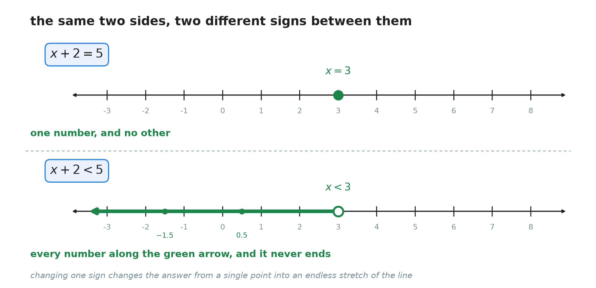
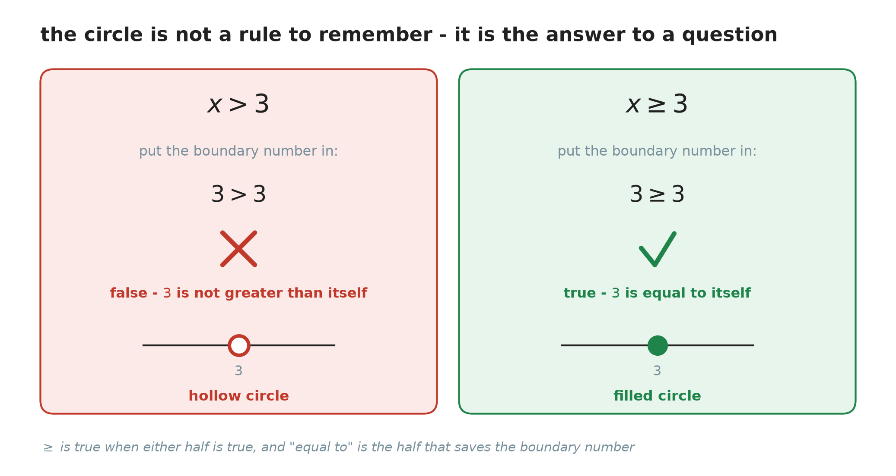
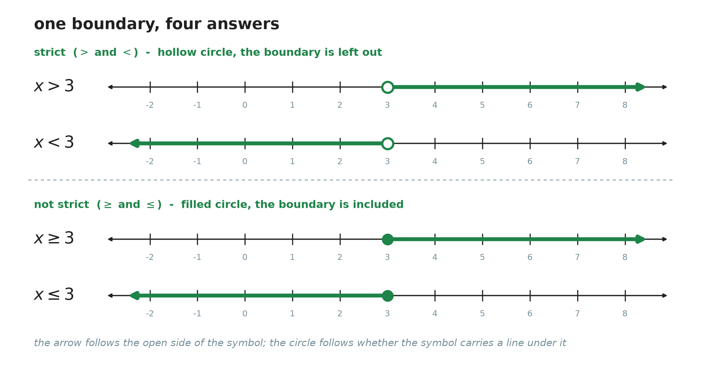
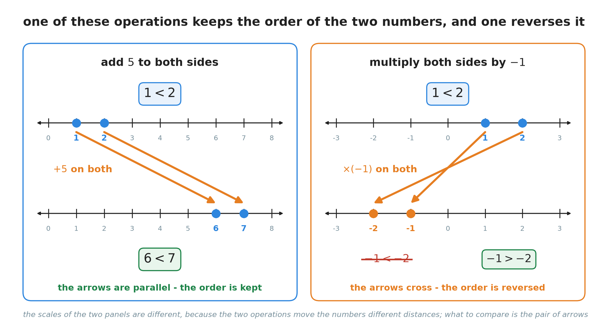
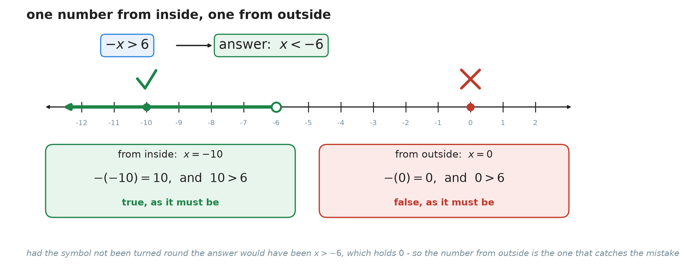
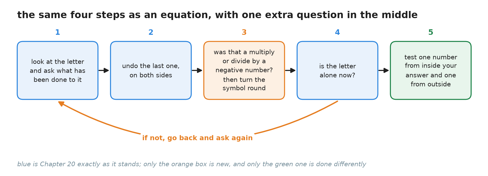

# 23. Solving inequalities

**What this chapter teaches**
How to solve a statement that uses $>$, $<$, $\geq$ or $\leq$ instead of $=$, and how to draw
the answer on a number line. The method is Chapter 20's, with one new rule that applies when you
multiply or divide by a negative number.

**Before you start**
This chapter is Chapter 20 with one symbol changed, so you need the whole of
[Chapter 20](./../20_Solving_Equations/20_Solving_Equations.md):
the properties of equality, isolating the letter, and the four one-step shapes. It leans hard on
[Chapter 9, section 3](./../9_Negative_Numbers/9_Negative_Numbers.md#3-which-of-two-numbers-is-bigger),
which taught you which of two numbers is bigger, and on
[Chapter 9, section 5](./../9_Negative_Numbers/9_Negative_Numbers.md#5-multiplying),
which taught you what multiplying by a negative number does. From
[Chapter 18](./../18_Introduction_To_Algebra_Variables/18_Introduction_To_Algebra_Variables.md)
it needs **variable** and **coefficient**.

---

## Table of contents

1. [When one number is not the answer](#1-when-one-number-is-not-the-answer)
2. [Drawing the answer on a number line](#2-drawing-the-answer-on-a-number-line)
3. [Solving an inequality is almost the same work](#3-solving-an-inequality-is-almost-the-same-work)
4. [The one rule that is different](#4-the-one-rule-that-is-different)
5. [The method in one place](#5-the-method-in-one-place)
6. [Glossary](#6-glossary)
7. [Check your understanding](#7-check-your-understanding)
8. [Important notes](#8-important-notes)

---

## 1. When one number is not the answer

### 1.1 Not everything in the world is exactly equal

Every chapter since Chapter 18 has been about the equals sign. An equation says that two things
are **the same size**, and you have learned to find the one number that makes that true.

But most real situations do not name an exact number. They name a **limit**:

* A lift can carry **no more than** $400$ kilograms.
* You have $50$ dollars, so your shopping must cost **less than** that.
* The speed limit is $90$, so your speed must **not go above** $90$.

None of these says "equals". Each one draws a line and says which side of it you must stay on. A
statement of that kind is called an **inequality**, and this chapter is about solving them.

**Definition — inequality.** An **inequality** is a mathematical sentence that compares two
things which are **not** stated to be equal. Instead of $=$ it uses one of four symbols:
$>$, $<$, $\geq$ or $\leq$.

### 1.2 The four symbols, and how to read them

| Symbol | Read it as | $5$ and $3$ | $3$ and $3$ |
| :---: | :--- | :---: | :---: |
| $>$ | is greater than | $5 > 3$ is true | $3 > 3$ is false |
| $<$ | is less than | $5 < 3$ is false | $3 < 3$ is false |
| $\geq$ | is greater than **or equal to** | $5 \geq 3$ is true | $3 \geq 3$ is true |
| $\leq$ | is less than **or equal to** | $5 \leq 3$ is false | $3 \leq 3$ is true |

The two symbols with a line underneath, $\geq$ and $\leq$, are the interesting ones.

**Explanation — why $3 \geq 3$ is true.** Read $\geq$ out loud: "greater than **or** equal to".
It is one symbol asking two questions at once, and it is happy if **either** answer is yes. Is
$3$ greater than $3$? No. Is $3$ equal to $3$? Yes. One yes is enough, so the whole statement is
true.

This surprises people. They see "greater than or equal to" and think the two numbers have to be
equal. They do not. $\geq$ accepts more numbers than $>$ does, not fewer.

> **Note — which way round does the symbol point?** The symbol is narrow at one end and wide at
> the other. The **wide, open end always faces the bigger number**. In $5 > 3$ the open end faces
> the $5$. In $3 < 5$ it faces the $5$ again. The statement is the same; only the order of the
> two numbers changed.

### 1.3 An inequality has a whole crowd of answers

[Chapter 20, section 1.2](./../20_Solving_Equations/20_Solving_Equations.md#12-the-number-that-makes-it-true)
defined a **solution**: a value that makes the statement true. That definition still works here.
What changes is **how many** solutions there are.

Look at $x + 2 = 5$. Only $3$ works. Put in $2$ and you get $4$, which is not $5$. Put in $4$ and
you get $6$, which is not $5$. One number, and no other.

Now look at $x + 2 < 5$, which is the same two sides with one sign changed. Now $2$ works, because
$4 < 5$. And $0$ works, because $2 < 5$. And $-1000$ works. And $2.9$ works. And $2.999$ works.

    

**Figure 1 — The top line has one dot. The bottom line has a green arrow that never stops. Notice
$-1.5$ and $0.5$ marked on it: the answers are not only whole numbers, but every number along
that stretch.**

Because there are far too many answers to list, they are given a name and described all at once.

**Definition — solution set.** The **solution set** of an inequality is **all** the numbers that
make it true, taken together. You write it as a short inequality, like $x < 3$, which is a
description of the whole crowd rather than a list of it.

So $x < 3$ is not an unfinished answer waiting to become a number. It **is** the answer. It says:
every number to the left of $3$, and nothing else.

### Summary of section 1

* An **inequality** compares two things that are not said to be equal.
* The four symbols are $>$, $<$, $\geq$ and $\leq$, and the open end faces the bigger number.
* $\geq$ and $\leq$ are true if **either** half is true, so $3 \geq 3$ is true.
* An equation usually has one solution. An inequality has endlessly many.
* All of them together are the **solution set**, and $x < 3$ is how you write it down.

---

## 2. Drawing the answer on a number line

### 2.1 Why the answer needs a picture

You cannot write out the solution set of $x < 3$, because it never ends. But you can **draw** it,
and the drawing shows the whole thing at once.

The number line is the right tool, and you have had it since
[Chapter 9, section 2.1](./../9_Negative_Numbers/9_Negative_Numbers.md#21-the-number-line-continued).
Two marks do the whole job:

* a **circle** at the boundary number, which says where the solution set starts;
* a **thick arrow** running away from it, which says which way the solutions go and that they
  never stop.

**Definition — boundary number.** The **boundary number** is the number the inequality turns at —
the $3$ in $x < 3$. It is the only number you have to look at closely, because it is the only one
whose membership is in doubt.

### 2.2 Which way the arrow points

Read the solved inequality with the letter on the left, and the symbol points the way to go.

* $x > 3$ — $x$ is greater, so the solutions are the bigger numbers, which lie to the **right**.
* $x < 3$ — $x$ is smaller, so the solutions lie to the **left**.

"Bigger is to the right" is
[Chapter 9's one comparison rule](./../9_Negative_Numbers/9_Negative_Numbers.md#31-one-rule-and-it-never-changes),
and it is doing all the work here. Nothing new is needed.

### 2.3 Hollow circle or filled circle

The circle answers one question: **is the boundary number itself a solution?**

You never have to remember the answer, because you can work it out in one line. Put the boundary
number into the inequality and see whether the statement is true.

    

**Figure 2 — The same test, run twice. The only thing that changed is the symbol, and that one
change decides whether the circle is hollow or filled.**

**Definition — strict inequality.** A **strict inequality** uses $>$ or $<$. The boundary number
is **not** a solution, so it is drawn as a **hollow circle**.

**Definition — non-strict inequality.** A **non-strict inequality** uses $\geq$ or $\leq$. The
boundary number **is** a solution, so it is drawn as a **filled circle**.

> **Note — how close can you get?** In $x > 3$ the number $3$ is out, but $3.1$ is in, and so is
> $3.01$, and so is $3.001$. There is no "first" solution — whatever number you name, there is
> another one between it and $3$. A hollow circle says exactly that: the solutions come right up
> to this point without ever reaching it.

### 2.4 The four pictures in one place

    

**Figure 3 — All four turn at the same number, so the only differences you can see are the two
that matter. Compare the top two: same circle, opposite arrows. Compare the top with the bottom:
same arrows, different circle.**

| Inequality | Circle at the boundary | Arrow | Is the boundary a solution? |
| :---: | :---: | :---: | :---: |
| $x > 3$ | hollow | right | no |
| $x < 3$ | hollow | left | no |
| $x \geq 3$ | filled | right | yes |
| $x \leq 3$ | filled | left | yes |

### Summary of section 2

* The solution set is drawn, not listed, because it never ends.
* The circle sits on the **boundary number**; the arrow shows which way the solutions run.
* To choose the circle, put the boundary number in and see if the statement is true.
* **Strict** ($>$, $<$): hollow circle, boundary left out.
* **Non-strict** ($\geq$, $\leq$): filled circle, boundary included.

---

## 3. Solving an inequality is almost the same work

### 3.1 The same rule of both sides

[Chapter 20, section 2.2](./../20_Solving_Equations/20_Solving_Equations.md#22-the-four-properties-of-equality)
gave you the properties of equality: whatever you do to one side of an equation, do to the other,
and the equation stays true. Inequalities have the same four rules, under a new name.

Call the left side $a$ and the right side $b$, so that $a > b$. Choose any number $c$. Then all of
these are still true:

$$
a + c > b + c
$$

$$
a - c > b - c
$$

$$
a \times c > b \times c \qquad \text{when } c \text{ is positive}
$$

$$
\frac{a}{c} > \frac{b}{c} \qquad \text{when } c \text{ is positive}
$$

* $a$ — everything on the left of the symbol.
* $b$ — everything on the right of the symbol.
* $c$ — any number you choose.

In words: if one thing is bigger than another, then adding the same amount to both leaves the
first one still bigger. So does taking the same amount off both, or doubling both, or halving
both.

Here it is with real numbers, starting from something obviously true:

$$
7 > 4
$$

$$
7 + 3 > 4 + 3 \quad \text{gives} \quad 10 > 7
$$

$$
7 \times 3 > 4 \times 3 \quad \text{gives} \quad 21 > 12
$$

Both results are still true. **These rules work for all four symbols**, not only for $>$.

You will have noticed the words attached to the last two lines. That condition is the whole of
section 4, and it is the only genuinely new thing in this chapter.

> **Warning — never multiply or divide by $0$.** Dividing by $0$ has no answer at all
> ([Chapter 16, section 6.2](./../16_Multiplying_And_Dividing_Fractions/16_Multiplying_And_Dividing_Fractions.md#62-why-dividing-by-zero-has-no-answer)).
> Multiplying by $0$ is worse than useless here: $7 > 4$ becomes $0 > 0$, which is **false**. In
> Chapter 20 multiplying an equation by $0$ was merely a waste of a line; in an inequality it
> destroys the statement. Choose $c$ to be a number that is not $0$.

### 3.2 A one-step inequality

Solve $x + 2 < 7$.

**Step 1 — what has been done to the letter?** $2$ has been added to it.

**Step 2 — undo it on both sides.** The inverse of adding $2$ is subtracting $2$:

$$
x + 2 - 2 < 7 - 2
$$

On the left, $2 - 2 = 0$, and adding $0$ changes nothing, so the $x$ is left alone. On the right,
$7 - 2 = 5$:

$$
x < 5
$$

**Step 3 — is the letter alone?** Yes. This is the answer.

**Step 4 — test it.** Take $0$, which is inside the answer: $0 + 2 = 2$, and $2 < 7$ is true. Take
$10$, which is outside: $10 + 2 = 12$, and $12 < 7$ is false. Both tests behaved as they should.

**Answer: $x < 5$.** On a number line: hollow circle at $5$, arrow to the left.

### 3.3 A two-step inequality

Solve $3x + 4 \geq 16$.

Two things have been done to the letter: it was multiplied by $3$, and then $4$ was added.
[Chapter 20, section 5.1](./../20_Solving_Equations/20_Solving_Equations.md#51-which-one-to-undo-first)
gave the order to undo them in — **undo the last one first**, which is the $+4$.

**Step 1 — subtract $4$ from both sides.**

$$
3x + 4 - 4 \geq 16 - 4
$$

$$
3x \geq 12
$$

**Step 2 — divide both sides by $3$.** Here is the moment this chapter cares about: **$3$ is a
positive number, so the symbol does not change.**

$$
\frac{3x}{3} \geq \frac{12}{3}
$$

$$
x \geq 4
$$

**Step 3 — test it.** $4$ itself is the boundary and the symbol is $\geq$, so $4$ should work:
$3 \times 4 = 12$, and $12 + 4 = 16$, and $16 \geq 16$ is true. Now a number from outside, say
$0$: $3 \times 0 = 0$, and $0 + 4 = 4$, and $4 \geq 16$ is false. Good.

**Answer: $x \geq 4$.** Filled circle at $4$, arrow to the right.

### 3.4 Two small differences worth knowing now

**An inequality does not read the same in both directions.**
[Chapter 21, section 2.4](./../21_Equations_With_The_Letter_On_Both_Sides/21_Equations_With_The_Letter_On_Both_Sides.md#24-an-equation-reads-the-same-in-both-directions)
told you that if $A = B$ then $B = A$. That does **not** carry over. $x < -6$ and $-6 < x$ say
opposite things.

If you do want to swap the sides, you must turn the symbol round as well:

$$
x < -6 \quad \text{means the same as} \quad -6 > x
$$

In words: "$x$ is less than $-6$" and "$-6$ is greater than $x$" are two ways of saying one thing.
The smaller number is still the smaller number; you have only walked round to the other side of it.

> **Note — write the letter on the left.** You can leave an answer as $-6 > x$ and be perfectly
> correct, but $x < -6$ is easier to draw, because section 2.2's rule reads straight off it.

### Summary of section 3

* Whatever you do to one side, do to the other — the same rule as Chapter 20.
* Adding and subtracting are always safe.
* Multiplying and dividing are safe **when the number is positive**.
* Never multiply or divide by $0$: it turns a true inequality into a false one.
* Swapping the two sides means turning the symbol round as well.

---

## 4. The one rule that is different

### 4.1 Where an equation and an inequality part company

Start with something nobody can argue with:

$$
1 < 2
$$

Now multiply both sides by $-1$, exactly as the rule of both sides allows. On the left,
$1 \times (-1) = -1$. On the right, $2 \times (-1) = -2$. Writing that down without thinking gives:

$$
-1 < -2
$$

That statement is **false**.
[Chapter 9, section 3.2](./../9_Negative_Numbers/9_Negative_Numbers.md#32-two-negative-numbers)
settled this: $-1$ sits further right than $-2$, so $-1$ is the **greater** of the two. Owing $1$
is a better position than owing $2$.

So the arithmetic was right and the answer came out wrong. Something has to change.

### 4.2 Why adding is safe and multiplying by a negative is not

    

**Figure 4 — Look only at the arrows. On the left they run side by side, so $1$ is still behind
$2$ when they land. On the right they cross, so the one that was behind arrives in front. That
crossing is the whole rule.**

Say it in words:

* **Adding $5$ slides both numbers the same distance in the same direction.** Nothing overtakes
  anything. The one that was on the left is still on the left.
* **Multiplying by $-1$ sends each number to the opposite side of zero.** This is
  [Chapter 9, section 2.2](./../9_Negative_Numbers/9_Negative_Numbers.md#22-every-number-has-an-opposite)'s
  opposite, applied to both numbers at once. The number that was further from zero on the right
  is now further from zero on the **left** — which makes it the smaller one.

The order of the two numbers has been reversed. And the symbol between them is nothing but a
record of that order. So the symbol has to be reversed too:

$$
-1 > -2
$$

That is true, and now the picture and the arithmetic agree.

### 4.3 The rule

> **The rule.** When you multiply or divide **both sides of an inequality by a negative number**,
> you must **turn the symbol round**.

* $>$ becomes $<$
* $<$ becomes $>$
* $\geq$ becomes $\leq$
* $\leq$ becomes $\geq$

Written with letters, next to the positive versions from section 3.1 so you can see the one
difference:

$$
\text{if } a > b \text{ and } c \text{ is positive, then} \quad a \times c > b \times c
$$

$$
\text{if } a > b \text{ and } c \text{ is negative, then} \quad a \times c < b \times c
$$

* $a$, $b$ — the two sides of the inequality.
* $c$ — the number you are multiplying or dividing by.

Division behaves exactly the same way, because dividing by $c$ is multiplying by $\frac{1}{c}$,
and $\frac{1}{c}$ is negative whenever $c$ is.

Check it with numbers. Start from $2 < 6$ and multiply both sides by $-3$:

$$
2 \times (-3) = -6
$$

$$
6 \times (-3) = -18
$$

Is $-6$ less than $-18$? No — $-6$ is nearer zero, so it is the greater one. Turn the symbol
round and the statement is true:

$$
-6 > -18
$$

### 4.4 A worked example: $-x > 6$

**Step 1 — what has been done to the letter?** There is a minus sign in front of it. From
[Chapter 20, section 6.3](./../20_Solving_Equations/20_Solving_Equations.md#63-the-same-move-done-with-the-properties),
$-x$ means $-1 \times x$: the letter has been multiplied by $-1$.

**Step 2 — undo it.** The inverse of multiplying by $-1$ is dividing by $-1$. And $-1$ is
negative, so the $>$ must become $<$:

$$
\frac{-x}{-1} < \frac{6}{-1}
$$

On the left, a negative divided by a negative is positive
([Chapter 9, section 6.1](./../9_Negative_Numbers/9_Negative_Numbers.md#61-the-same-rules-for-a-good-reason)),
so $\frac{-1x}{-1} = 1x = x$. On the right, $\frac{6}{-1} = -6$:

$$
x < -6
$$

**Step 3 — is the letter alone?** Yes.

**Step 4 — test it.**

    

**Figure 5 — Two tests, not one. The green card takes a number from inside the answer and the
original inequality comes out true. The red card takes one from outside and it comes out false.
Both of those results are needed.**

From inside the answer, take $x = -10$. Put it into the **original** inequality, $-x > 6$.
Substituting a negative number needs brackets:

$$
-(-10)
$$

Subtracting a negative is the same as adding
([Chapter 9, section 4.4](./../9_Negative_Numbers/9_Negative_Numbers.md#44-subtracting-a-negative-number-is-the-same-as-adding)),
so this is $10$. And $10 > 6$ is **true**.

From outside the answer, take $x = 0$. Then $-(0) = 0$, and $0 > 6$ is **false**.

**Answer: $x < -6$.** Hollow circle at $-6$, arrow to the left.

> **Note — why $0$ was the right number to test with.** If you had forgotten to turn the symbol
> round you would have written $x > -6$, and $0$ is inside that. Testing $0$ is what tells the two
> answers apart. When you are unsure whether you should have flipped, test a number that the two
> possible answers disagree about.

### Summary of section 4

* Multiplying or dividing by a negative number **reverses the order** of the two sides.
* So the symbol must be turned round: $>$ becomes $<$, $\leq$ becomes $\geq$, and so on.
* The reason is a picture: the two arrows cross.
* Adding and subtracting never reverse anything, because both numbers move the same way.
* $-x > 6$ gives $x < -6$, not $x > -6$.

---

## 5. The method in one place

### 5.1 The steps

    

**Figure 6 — Compare this with
[Chapter 20's figure 6](./../20_Solving_Equations/20_Solving_Equations.md#71-four-steps-and-a-loop).
Everything blue is unchanged. One orange box has been slipped into the middle, and the last box is
done in a new way.**

1. **Look at the letter and ask what has been done to it.** Notice which operation was done last.
2. **Undo that last one, on both sides.**
3. **Was that a multiply or a divide by a negative number?** If it was, turn the symbol round. If
   it was an add, a subtract, or a multiply or divide by a positive number, leave it alone.
4. **Is the letter alone now?** If not, go back to step 1. A minus sign stuck to the letter means
   it is not alone.
5. **Test one number from inside your answer and one from outside**, in the **original**
   inequality.

### 5.2 A minus sign is not a reason to turn the symbol round

This is the mistake that follows people around for years. The rule is about **the operation you
perform**, not about the minus signs you can see on the page.

Solve $-5x + 3 \leq 18$.

**Step 1 — undo the $+3$.** Subtracting is not multiplying, so **nothing turns round**, even
though there is a minus sign sitting right there in $-5x$:

$$
-5x + 3 - 3 \leq 18 - 3
$$

$$
-5x \leq 15
$$

**Step 2 — undo the $\times (-5)$.** The letter has been multiplied by $-5$, so divide both sides
by $-5$. **That number is negative, so the $\leq$ becomes $\geq$:**

$$
\frac{-5x}{-5} \geq \frac{15}{-5}
$$

On the left, $\frac{-5}{-5} = 1$, leaving $x$. On the right, $\frac{15}{-5} = -3$:

$$
x \geq -3
$$

**Step 3 — test it.** From inside, take $x = 0$:

$$
-5 \times 0 = 0
$$

$$
0 + 3 = 3
$$

and $3 \leq 18$ is **true**. From outside, take $x = -10$:

$$
-5 \times (-10) = 50
$$

$$
50 + 3 = 53
$$

and $53 \leq 18$ is **false**. Both as they should be.

**Answer: $x \geq -3$.** Filled circle at $-3$, arrow to the right.

> **Warning — count the flips, and expect exactly none or one.** In that solution the symbol
> turned round **once**, at the divide, and not at the subtract. Readers who flip on sight of a
> minus sign flip twice here and end up back where they started.

### 5.3 How to check, and why it is different from Chapter 20

[Chapter 20, section 4.5](./../20_Solving_Equations/20_Solving_Equations.md#45-the-check-every-time)
checked an equation by putting the one solution back in and seeing whether both sides agreed. An
inequality has no single solution to put back, so the check changes shape.

**Test two numbers, and expect opposite results.**

* A number from **inside** your answer must make the original inequality **true**.
* A number from **outside** it must make the original inequality **false**.

Both halves matter, and here is why. Suppose you solve $-4x \geq 12$ and get $x \geq -3$, which is
wrong — the symbol should have turned round. Test $x = 0$, which is inside your answer:
$-4 \times 0 = 0$, and $0 \geq 12$ is false. The test fails immediately, which is exactly what you
want.

Now suppose you test only from outside. A single "false" proves nothing on its own: plenty of
wrong answers give a false result for some number. It is the **pair** of results that tells you
your boundary is in the right place and your arrow points the right way.

> **Note — always test in the original.** If you test in a line you wrote halfway through, a
> mistake made before that line will pass unnoticed. This is Chapter 20's rule, and it matters
> more here, because the mistake this chapter is about happens in the middle of the working.

### Summary of section 5

* The method is Chapter 20's, with one question added after every multiply or divide.
* Ask that question every time — even when the answer is no.
* A minus sign on the page is not a flip. Only the operation you do can be.
* Check with two numbers: one from inside the answer, one from outside.
* The inside one must come out true, the outside one false.

---

## 6. Glossary

* **Inequality** — a mathematical sentence comparing two things that are not stated to be equal,
  using $>$, $<$, $\geq$ or $\leq$.
* **Solution set** — all the numbers that make an inequality true, taken together. Written as a
  short inequality such as $x < 3$, not as a list.
* **Boundary number** — the number an inequality turns at: the $3$ in $x < 3$. It is the only
  number whose membership has to be tested.
* **Strict inequality** — one using $>$ or $<$. The boundary number is not a solution, and it is
  drawn as a hollow circle.
* **Non-strict inequality** — one using $\geq$ or $\leq$. The boundary number is a solution, and
  it is drawn as a filled circle.

**Note.** Every other term used here was defined earlier in the book and is not defined again.
**Variable**, **constant** and **coefficient** are
[Chapter 18](./../18_Introduction_To_Algebra_Variables/18_Introduction_To_Algebra_Variables.md#8-glossary);
**solution**, **solving**, **isolating the variable**, **inverse operation** and **the properties
of equality** are
[Chapter 20](./../20_Solving_Equations/20_Solving_Equations.md#8-glossary);
**term** is
[Chapter 21](./../21_Equations_With_The_Letter_On_Both_Sides/21_Equations_With_The_Letter_On_Both_Sides.md#6-glossary);
**opposite** and **the number line** are
[Chapter 9](./../9_Negative_Numbers/9_Negative_Numbers.md#8-glossary).

---

## 7. Check your understanding

**Question 1.** Solve $x - 3 > 4$ and describe its graph.

Answer

$3$ has been subtracted from the letter, so add $3$ to both sides. Adding never turns the symbol
round:

$$
x - 3 + 3 > 4 + 3
$$

$$
x > 7
$$

**Test.** From inside, $x = 10$: $10 - 3 = 7$, and $7 > 4$ is true. From outside, $x = 0$:
$0 - 3 = -3$, and $-3 > 4$ is false.

**Answer: $x > 7$.** Hollow circle at $7$, because the symbol is strict, and the arrow points
right.

**Question 2.** Solve $2x + 5 \leq 15$ and describe its graph.

Answer

Two things were done to the letter. Undo the last one first, which is the $+5$:

$$
2x + 5 - 5 \leq 15 - 5
$$

$$
2x \leq 10
$$

Now divide both sides by $2$. **$2$ is positive, so the symbol stays as it is:**

$$
\frac{2x}{2} \leq \frac{10}{2}
$$

$$
x \leq 5
$$

**Test.** From inside, $x = 5$ itself: $2 \times 5 = 10$, and $10 + 5 = 15$, and $15 \leq 15$ is
true — as it must be, since $\leq$ includes the boundary. From outside, $x = 10$:
$2 \times 10 = 20$, and $20 + 5 = 25$, and $25 \leq 15$ is false.

**Answer: $x \leq 5$.** Filled circle at $5$, arrow to the left.

**Question 3.** Solve $-4x \geq 12$ and describe its graph.

Answer

The letter has been multiplied by $-4$, so divide both sides by $-4$. **That number is negative,
so the $\geq$ turns into $\leq$:**

$$
\frac{-4x}{-4} \leq \frac{12}{-4}
$$

On the left, $\frac{-4}{-4} = 1$, leaving $x$. On the right, a positive divided by a negative is
negative, so $\frac{12}{-4} = -3$:

$$
x \leq -3
$$

**Test.** From inside, $x = -4$: $-4 \times (-4) = 16$, and $16 \geq 12$ is true. From outside,
$x = 0$: $-4 \times 0 = 0$, and $0 \geq 12$ is false.

**Answer: $x \leq -3$.** Filled circle at $-3$, arrow to the left.

**Question 4.** Solve $-3x + 7 < 22$ and describe its graph.

Answer

**Undo the $+7$ first.** Subtracting does not turn the symbol round:

$$
-3x + 7 - 7 < 22 - 7
$$

$$
-3x < 15
$$

**Now divide both sides by $-3$, and turn the $<$ into $>$:**

$$
\frac{-3x}{-3} > \frac{15}{-3}
$$

$$
x > -5
$$

**Test.** From inside, $x = 0$: $-3 \times 0 = 0$, and $0 + 7 = 7$, and $7 < 22$ is true. From
outside, $x = -10$: $-3 \times (-10) = 30$, and $30 + 7 = 37$, and $37 < 22$ is false.

**Answer: $x > -5$.** Hollow circle at $-5$, arrow to the right.

**Question 5.** Is $5$ a solution of $x \geq 5$? Is it a solution of $x > 5$? Which circle does
each one get?

Answer

Put $5$ into each, as section 2.3 says.

For $x \geq 5$: the statement becomes $5 \geq 5$. Read it as two questions. Is $5$ greater than
$5$? No. Is $5$ equal to $5$? Yes. One yes is enough, so the statement is **true**. $5$ **is** a
solution, and the circle is **filled**.

For $x > 5$: the statement becomes $5 > 5$. Is $5$ greater than itself? No, and there is no second
question to save it. The statement is **false**. $5$ is **not** a solution, and the circle is
**hollow**.

Both graphs have their arrow pointing right. The only difference between them is one number.

**Question 6.** Start from $2 < 6$. Multiply both sides by $-3$ and write down a true statement.
Explain in one sentence why you wrote what you wrote.

Answer

$$
2 \times (-3) = -6
$$

$$
6 \times (-3) = -18
$$

Writing $-6 < -18$ would be false, because $-6$ is nearer zero than $-18$ and is therefore the
greater of the two. The true statement is:

$$
-6 > -18
$$

**Why.** Multiplying by a negative number sends both numbers to the other side of zero, and that
reverses which of them is bigger — so the symbol has to reverse with them.

**Question 7.** A student solves $x - 4 < 10$ and writes $x > 14$. They explain: "there was a
minus sign, so I turned the symbol round." What is wrong with the explanation, and what is the
right answer?

Answer

**What is wrong.** The rule is about the **operation you carry out**, not about minus signs that
happen to be on the page. To undo $-4$ you **add** $4$ to both sides, and adding never reverses
anything, because it slides both sides the same way (section 4.2). The minus sign in $x - 4$ is
never multiplied by anything, so it never gets the chance to turn anything round.

**The right answer.**

$$
x - 4 + 4 < 10 + 4
$$

$$
x < 14
$$

**Test the student's answer to be sure.** They said $x > 14$, so take $x = 20$, which is inside
it: $20 - 4 = 16$, and $16 < 10$ is false. A number from inside an answer must give a true
statement, so their answer cannot be right. Now test $x = 0$ against the correct answer:
$0 - 4 = -4$, and $-4 < 10$ is true.

**Answer: $x < 14$.**

**Question 8.** A student solves $-2x < 8$ and writes $x < -4$. Find a number that shows the
answer is wrong, then give the right one.

Answer

**Find the number.** Take $x = -10$, which is inside the student's answer, and put it into the
original: $-2 \times (-10) = 20$, and $20 < 8$ is **false**. A number from inside the answer has
given a false statement, so the answer is wrong.

**The right answer.** The letter was multiplied by $-2$, so divide both sides by $-2$ — and $-2$
is negative, so the $<$ becomes $>$:

$$
\frac{-2x}{-2} > \frac{8}{-2}
$$

$$
x > -4
$$

**Test it.** From inside, $x = 0$: $-2 \times 0 = 0$, and $0 < 8$ is true. From outside,
$x = -10$: $-2 \times (-10) = 20$, and $20 < 8$ is false.

**Answer: $x > -4$.** The student did the division correctly and forgot the one thing this chapter
is about.

**Question 9.** Do $x < -6$ and $-6 < x$ say the same thing?

Answer

**No.** They say opposite things.

$x < -6$ says that $x$ is smaller than $-6$, so $x$ lies to the **left** of $-6$. $-6 < x$ says
that $-6$ is smaller than $x$, so $x$ lies to the **right** of it.

Test a number to be certain. Take $x = -10$. Then $x < -6$ reads $-10 < -6$, which is true, and
$-6 < x$ reads $-6 < -10$, which is false. One number, two opposite verdicts, so the two
statements are not the same.

Swapping the two sides is only allowed if you turn the symbol round at the same time:

$$
x < -6 \quad \text{means the same as} \quad -6 > x
$$

This is where an inequality differs from an equation, which reads the same in both directions.

**Question 10.** A lift can carry no more than $400$ kilograms. Write that as an inequality, using
$w$ for the weight in the lift in kilograms, and say which circle its graph gets.

Answer

**Name the letter.** $w$ — the weight in the lift, in kilograms. (Not "$w$ is the lift" — a letter
is always a quantity with a unit, as
[Chapter 22, section 2.2](./../22_Word_Problems/22_Word_Problems.md#22-write-down-what-the-letter-measures)
said.)

**Translate.** "No more than $400$" means the weight is allowed to reach $400$ but not to go past
it. So $400$ is a safe weight, and anything above it is not:

$$
w \leq 400
$$

**The circle.** Test the boundary: $400 \leq 400$ is true, because the "equal to" half is
satisfied. So $400$ is included, the circle is **filled**, and the arrow points left.

**Note.** If the sign had said "under $400$ kg", that would be $w < 400$ and a hollow circle. The
two English phrases are close and the two answers are different, which is why the boundary is
always worth one line of testing.

---

## 8. Important notes

**The mistakes people actually make.**

* **Forgetting to turn the symbol round after dividing by a negative number.** This is the mistake
  of the chapter, ahead of everything else. $-4x \geq 12$ gives $x \leq -3$, not $x \geq -3$.
* **Turning the symbol round because a minus sign is visible.** Only a multiply or a divide by a
  negative number does it. Adding or subtracting a negative number does not.
* **Turning it round twice in one problem.** In $-3x + 7 < 22$ the subtract does nothing to the
  symbol and the divide reverses it. One flip, not two.
* **Using the wrong circle.** A filled circle on $x > 5$ tells the reader that $5$ is an answer,
  and $5 > 5$ is false. When in doubt, put the boundary number in and look at what you get.
* **Thinking $3 \geq 3$ is false.** "Or equal to" is a second chance, not a second requirement.
* **Comparing the digits instead of the positions.** $-5$ is smaller than $-2$, even though $5$ is
  bigger than $2$. This is
  [Chapter 9, section 3.3](./../9_Negative_Numbers/9_Negative_Numbers.md#33-the-trap)'s
  trap, and it is the reason the flipping rule feels strange in the first place.
* **Treating $x < 5$ as unfinished.** It is the answer. There is no single number hiding behind it.
* **Swapping the two sides without turning the symbol round.** $x < -6$ is not $-6 < x$.
* **Multiplying both sides by $0$.** It turns any true inequality into $0 > 0$, which is false.
* **Checking with one number only.** One number can agree with a wrong answer by luck. Two, one
  from each side of the boundary, cannot.

**The three ideas to keep.**

* **The symbol is a record of an order, and anything that reverses the order reverses the
  symbol.** That single sentence is the whole of section 4. It is worth more than the rule itself,
  because a rule can be forgotten and a reason can be rebuilt: picture $1$ and $2$, send them both
  to the other side of zero, and see which one arrives first.
* **Almost everything in this chapter was already yours.** Chapter 20 gave the method, Chapter 9
  gave the comparisons and the negative arithmetic, Chapter 19 gave the inverses. What is new is
  one question asked at one moment. A chapter that adds a single question to work you already own
  is exactly how mathematics usually grows.
* **The check had to change, and that tells you something about the answer.** You could check an
  equation with one number because it had one answer. An inequality needs a number from each side
  of the boundary, because what you are testing is not a number — it is a **line drawn across the
  number line**, and a line has two sides.

**How this chapter connects to the rest of the book.**
[Chapter 20](./../20_Solving_Equations/20_Solving_Equations.md)
supplies the method whole, and not one of its steps had to be rewritten — figure 5 is its figure 6
with a box added.
[Chapter 9](./../9_Negative_Numbers/9_Negative_Numbers.md)
turns out to have been the real preparation for this chapter: its comparison rule chooses the
direction of every arrow, its opposites explain the flip, and its division rules do the arithmetic
in sections 4.4 and 5.2. An idea that looked like housekeeping about debts and temperatures is the
foundation of the one new rule here.
[Chapter 21](./../21_Equations_With_The_Letter_On_Both_Sides/21_Equations_With_The_Letter_On_Both_Sides.md)
appears once and in a negative way, in section 3.4: its symmetric property is the one thing from
Chapters 18 to 22 that does **not** carry across to inequalities, and knowing where a rule stops
is as useful as knowing the rule.

What this chapter cannot do yet: solve an inequality with the letter on both sides, the way
Chapter 21 did for equations; handle two conditions at once, such as a number that must be above
$3$ **and** below $10$; or take a story told in words — "at least $20$ items", "no more than $5$
hours" — and turn it into an inequality, which is the inequality half of what
[Chapter 22](./../22_Word_Problems/22_Word_Problems.md)
did for equations. Question 10 is the only place in this chapter where words are translated at
all.

---

- [Back to the book](./../README.md)
- Previous: [22 Word problems: turning a story into an equation](./../22_Word_Problems/22_Word_Problems.md)
- Next: not written yet.
