# 24. Square roots, cube roots and other roots

**What this chapter teaches**
How to undo a power. A **root** asks the opposite question to an exponent: not "what do I get
if I multiply this number by itself", but "which number was multiplied by itself to give me
this". You will meet the square root, the cube root, roots with any index at all, how to make a
root simpler, and the surprising fact that every root is really a fraction in the exponent.

**Before you start**
This chapter is the other half of
[Chapter 10](./../10_Exponents/10_Exponents.md).
You need **squaring** and **cubing** from its
[section 2.2](./../10_Exponents/10_Exponents.md#22-saying-it-out-loud),
and two of its five rules: multiplying powers
([section 4.2](./../10_Exponents/10_Exponents.md#42-the-rule))
and a power of a power
([section 8.2](./../10_Exponents/10_Exponents.md#82-the-rule)).
From
[Chapter 9](./../9_Negative_Numbers/9_Negative_Numbers.md)
you need
[section 5](./../9_Negative_Numbers/9_Negative_Numbers.md#5-multiplying):
almost everything strange in this chapter comes from the sign rules for multiplication. Section 4
uses factors from
[Chapter 12, section 2](./../12_Divisibility_And_Prime_Numbers/12_Divisibility_And_Prime_Numbers.md#2-finding-every-factor-of-a-number),
and section 8 uses the method of
[Chapter 20](./../20_Solving_Equations/20_Solving_Equations.md).

---

## Table of contents

1. [Undoing a power](#1-undoing-a-power)
2. [The square root](#2-the-square-root)
3. [When a root is not a whole number](#3-when-a-root-is-not-a-whole-number)
4. [Making a square root simpler](#4-making-a-square-root-simpler)
5. [The cube root](#5-the-cube-root)
6. [Even roots and odd roots](#6-even-roots-and-odd-roots)
7. [A root is a fraction in the exponent](#7-a-root-is-a-fraction-in-the-exponent)
8. [Using a root to solve an equation](#8-using-a-root-to-solve-an-equation)
9. [Glossary](#9-glossary)
10. [Check your understanding](#10-check-your-understanding)
11. [Important notes](#11-important-notes)

---

## 1. Undoing a power

### 1.1 Every operation so far has had a partner

Look at what you have been doing since Chapter 18. Every time you solved an equation, you undid
something.

| What was done to the letter | What you did to undo it | Where it was explained |
| :--- | :--- | :--- |
| something was added | subtract it | [Ch. 20 § 3.1](./../20_Solving_Equations/20_Solving_Equations.md#31-two-pairs-and-each-one-undoes-the-other) |
| something was subtracted | add it | [Ch. 20 § 3.1](./../20_Solving_Equations/20_Solving_Equations.md#31-two-pairs-and-each-one-undoes-the-other) |
| it was multiplied | divide | [Ch. 8 § 1.1](./../8_Dividing_Large_Numbers/8_Dividing_Large_Numbers.md#11-small-divisions-are-times-tables-read-backwards) |
| it was divided | multiply | [Ch. 8 § 1.1](./../8_Dividing_Large_Numbers/8_Dividing_Large_Numbers.md#11-small-divisions-are-times-tables-read-backwards) |
| **it was raised to a power** | **?** | **nothing yet** |

The last row is empty. Chapter 10 taught you a fifth operation and never gave it a partner. So
an equation like

$$
x^{2} = 9
$$

cannot be solved with anything you own. There is no move in the toolbox that takes the little
$2$ off the letter.

This chapter builds that move.

### 1.2 What a root asks

The easiest place to see it is a square, because that is where the word "squared" comes from.

    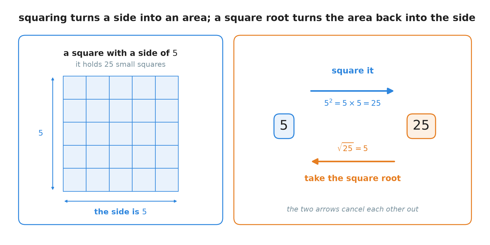

**Figure 1 — Look at the two arrows on the right. The blue one goes from the side of the square
to the number of small squares inside it. The orange one goes back the other way. Each one
cancels the other.**

Going one way is easy, and you learned it in Chapter 10: a square of side $5$ holds
$5 \times 5 = 25$ small squares, and we write that $5^{2} = 25$.

Going the other way is the new question. **You know there are $25$ small squares. How long is
the side?** You need the number which, multiplied by itself, gives $25$. That number is $5$.

**Definition — root.** Taking a **root** is the operation that undoes a power. It asks: *which
number, multiplied by itself a certain number of times, gives this number?*

The "certain number of times" is the part that changes. Multiplied by itself **twice**, it is a
square root. **Three times**, a cube root. The rest of the chapter is those two, and then all
the others.

### Summary of section 1

* Every operation in this book has an operation that undoes it.
* Exponents were the one exception. A **root** is the operation that undoes them.
* A power asks "what do I get?" A root asks "what did I start from?"
* $5^{2} = 25$ goes one way. The square root of $25$ is $5$, and that goes back.

---

## 2. The square root

### 2.1 Two numbers share the same square

Go back to the equation that could not be solved:

$$
x^{2} = 9
$$

In words: some number, multiplied by itself, gives $9$. Which number?

$3$ works, because $3 \times 3 = 9$.

But there is a second one, and it is easy to miss. In
[Chapter 9, section 5.2](./../9_Negative_Numbers/9_Negative_Numbers.md#52-a-negative-number-times-a-negative-number)
you learned that a negative number times a negative number gives a **positive** answer. So:

$$
(-3) \times (-3) = 9
$$

That is just as true. Both numbers do the job.

    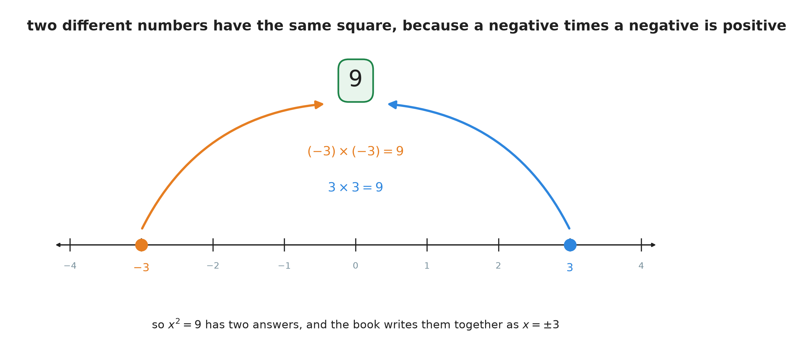

**Figure 2 — Two dots, two arrows, one destination. The number $9$ can be reached from either
side of zero, so the equation $x^{2} = 9$ has two answers.**

Both answers are written together with one symbol:

$$
x = \pm 3
$$

**Note — how to read $\pm$.** The symbol $\pm$ is said "plus or minus". It is short for "there
are two answers here: the positive one and the negative one". It is not a new kind of number.
$x = \pm 3$ means $x = 3$ **or** $x = -3$, and you should be able to say which one is meant in a
real problem — if $x$ is the side of a square, only $3$ makes sense, because a side cannot be
$-3$ metres long.

### 2.2 The symbol, and the names of its three parts

The operation has its own sign, and the sign has three parts worth naming.

    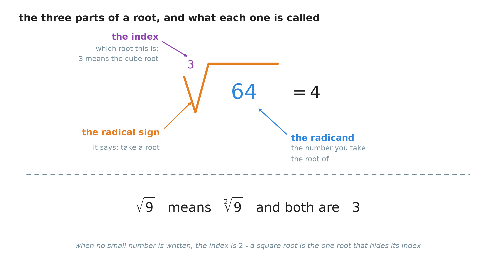

**Figure 3 — Three parts, three names. The small number in the corner is the one that decides
which root you are taking. When it is not written, it is a $2$.**

* **Definition — radical sign.** The symbol $\sqrt{\phantom{x}}$ is the **radical sign**. It
  says: take a root of whatever is written under it.
* **Definition — radicand.** The **radicand** is the number sitting under the bar. In
  $\sqrt{9}$ the radicand is $9$.
* **Definition — index.** The **index** is the small number in the top-left corner. It says how
  many equal factors you are looking for. In $\sqrt[3]{64}$ the index is $3$.

**Note — the index you cannot see.** A square root is so common that its index is never written.
$\sqrt{9}$ and $\sqrt[2]{9}$ are the same thing. If you see a radical sign with an empty corner,
read a $2$ into it.

**Definition — square root.** The **square root** of a number is the number which, multiplied by
itself, gives it. It is written $\sqrt{\phantom{x}}$, with the index $2$ left out.

### 2.3 The symbol names one number, not two

Here is a point that trips up almost everybody, and it is worth slowing down for.

The equation $x^{2} = 9$ has **two** answers. But the symbol $\sqrt{9}$ is not the equation. It
is the name of **one** number, and that number is $3$.

$$
\sqrt{9} = 3
$$

**Explanation — why it has to name only one.** A symbol in mathematics has to stand for exactly
one number, or you cannot calculate with it. Think about this sum:

$$
\sqrt{16} + \sqrt{9} = 4 + 3 = 7
$$

If $\sqrt{16}$ meant "$4$ or $-4$" and $\sqrt{9}$ meant "$3$ or $-3$", then that line would have
four different answers at once — $7$, $1$, $-1$ and $-7$ — and nobody reading it would know
which one you meant. So the symbol was given one job: **out of the two numbers that square to
$9$, it always hands you the one that is not negative.**

**Definition — principal square root.** The **principal square root** of a number is the one that
is not negative. The symbol $\sqrt{\phantom{x}}$ always means the principal square root.

So the two facts live side by side, and they do not contradict each other:

| The statement | What it means | The answer |
| :--- | :--- | :--- |
| $\sqrt{9}$ | the principal square root of $9$ | $3$, and only $3$ |
| $x^{2} = 9$ | which numbers square to $9$? | $3$ and $-3$, written $x = \pm 3$ |

When you solve an equation, **you** write the $\pm$, in front of the root, because **you** know
there are two answers:

$$
x^{2} = 9 \quad \Rightarrow \quad x = \pm \sqrt{9} = \pm 3
$$

> **Warning.** You will see $\sqrt{9} = \pm 3$ written in many places. It is wrong, and it is not
> a harmless kind of wrong: it makes every later expression containing a root ambiguous. The
> $\pm$ belongs to the *equation being solved*, never inside the symbol.

### 2.4 The perfect squares worth learning by heart

Some numbers give a whole number when you take their square root. They have a name, and the name
is a picture.

    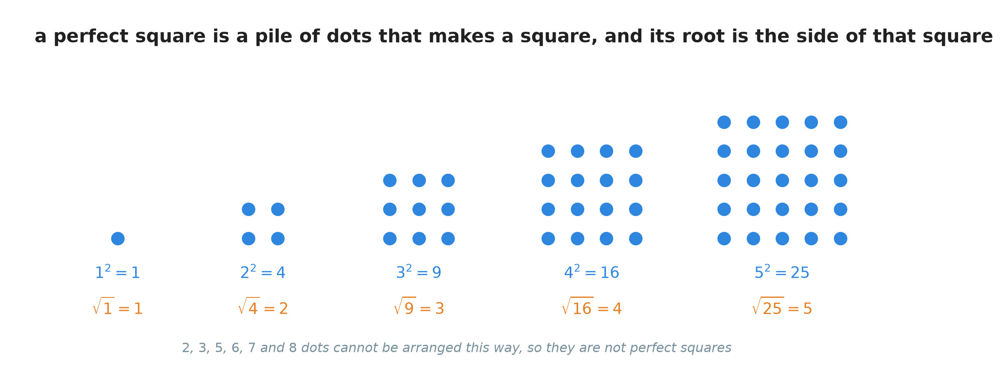

**Figure 4 — $9$ dots make a square with $3$ along each side. That is exactly what
$\sqrt{9} = 3$ says. Numbers like $2$ or $7$ cannot be arranged this way at all.**

**Definition — perfect square.** A **perfect square** is a whole number whose square root is
also a whole number.

These are the first ten, and they are worth knowing the way you know a times table:

| $n$ | $1$ | $2$ | $3$ | $4$ | $5$ | $6$ | $7$ | $8$ | $9$ | $10$ |
| :--- | :-: | :-: | :-: | :-: | :-: | :-: | :-: | :-: | :-: | :-: |
| $n^{2}$ | $1$ | $4$ | $9$ | $16$ | $25$ | $36$ | $49$ | $64$ | $81$ | $100$ |

Read the table from the bottom up and you have the roots: $\sqrt{49} = 7$, $\sqrt{81} = 9$, and
so on. Section 4 uses this table constantly, so it pays to know it.

### 2.5 A negative number has no square root

What is $\sqrt{-9}$?

The question asks for a number which, multiplied by itself, gives $-9$. Try both kinds of number:

* a positive one: $3 \times 3 = +9$. Not $-9$.
* a negative one: $(-3) \times (-3) = +9$. Not $-9$ either.

There is nothing left to try. Multiplying any number by itself means multiplying two numbers with
the **same sign**, and by
[Chapter 9, section 5](./../9_Negative_Numbers/9_Negative_Numbers.md#5-multiplying)
that always gives a positive answer.

**The rule.** A negative number has **no square root** among the numbers in this book.

> **Note.** This is not a permanent wall. Mathematics later invents a new kind of number for
> exactly this problem. Those numbers are not part of this book, so for now the honest answer to
> $\sqrt{-9}$ is: there is none.

> **Warning.** $\sqrt{-16}$ is not $-4$. Check it the way you check everything:
> $(-4) \times (-4) = +16$, not $-16$. A minus sign inside the radical and a minus sign in front
> of it are completely different things — $-\sqrt{16}$ is a perfectly ordinary number, $-4$.

### Summary of section 2

* Two numbers share every positive square, one on each side of zero, because a negative times a
  negative is positive.
* The equation $x^{2} = 9$ therefore has two answers, written $x = \pm 3$.
* The **symbol** $\sqrt{9}$ names only one of them, the one that is not negative. That is the
  **principal square root**.
* The parts of the symbol are the **radical sign**, the **radicand** and the **index**. A missing
  index means $2$.
* A **perfect square** has a whole number as its root. Learn the first ten.
* A negative radicand has no square root here at all.

---

## 3. When a root is not a whole number

### 3.1 Hunting for the square root of 2

$2$ is not a perfect square: it sits between $1$ and $4$ in the table above. So $\sqrt{2}$ is not
a whole number. But what is it?

You can hunt for it with nothing but multiplication. Square a number. If the answer is below $2$,
your number was too small. If the answer is above $2$, it was too big.

**First try, whole numbers.**

$$
1^{2} = 1 \quad \text{(too small)} \qquad 2^{2} = 4 \quad \text{(too big)}
$$

So $\sqrt{2}$ is somewhere between $1$ and $2$.

**Second try, one decimal place.**

$$
1.4 \times 1.4 = 1.96 \quad \text{(too small)} \qquad 1.5 \times 1.5 = 2.25 \quad \text{(too big)}
$$

So $\sqrt{2}$ is between $1.4$ and $1.5$.

> **Note — multiplying two decimals.**
> [Chapter 4, section 6.1](./../4_Converting_Between_Forms/4_Converting_Between_Forms.md#61-multiplying-a-decimal-by-a-whole-number)
> multiplied a decimal by a whole number by counting pieces. The same counting works when both
> numbers are decimals. $1.4$ is $14$ tenths, so $1.4 \times 1.4$ is $14 \times 14 = 196$ of
> "a tenth of a tenth". A tenth of a tenth is a hundredth, by
> [Chapter 16, section 3.3](./../16_Multiplying_And_Dividing_Fractions/16_Multiplying_And_Dividing_Fractions.md#33-the-rule-in-symbols).
> And $196$ hundredths is $1.96$. In short: multiply as if the points were not there, then give
> the answer as many decimal places as the two numbers have between them.

**Third try, two decimal places.**

$$
1.41 \times 1.41 = 1.9881 \quad \text{(too small)} \qquad 1.42 \times 1.42 = 2.0164 \quad \text{(too big)}
$$

So $\sqrt{2}$ is between $1.41$ and $1.42$.

    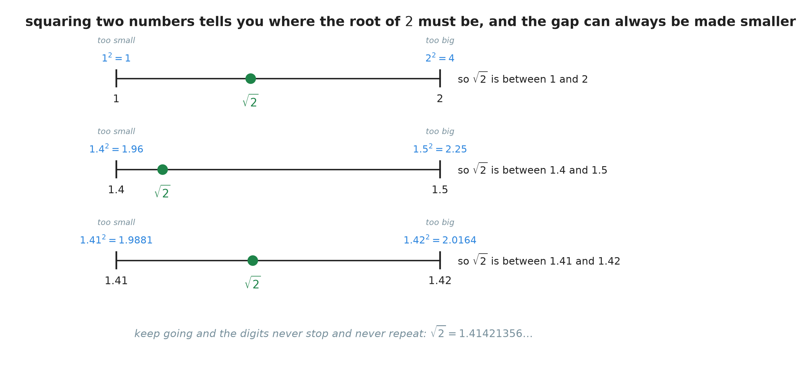

**Figure 5 — Each row is a zoom of the row above it. The green dot never lands on either end,
and the gap can always be made smaller.**

### 3.2 A decimal that never stops and never repeats

You could keep going for ever and the hunt would never finish. $\sqrt{2}$ begins

$$
\sqrt{2} = 1.41421356\ldots
$$

and those digits never stop.

Now, a decimal that never stops is not itself unusual. In
[Chapter 4, section 2.4](./../4_Converting_Between_Forms/4_Converting_Between_Forms.md#24-when-the-division-never-stops)
you met $\frac{1}{3} = 0.333\ldots$, which also never stops. But that one **repeats**: the same
digit comes round for ever, and because it repeats you can write the number exactly as the
fraction $\frac{1}{3}$.

The digits of $\sqrt{2}$ never stop **and** never settle into a repeating pattern. There is no
fraction that equals it.

**Definition — irrational number.** An **irrational number** is a number that cannot be written
as a fraction $\frac{a}{b}$ with whole numbers on the top and the bottom. Its decimal form goes
on for ever without ever repeating.

The square root of any number that is not a perfect square is irrational. $\sqrt{2}$, $\sqrt{3}$,
$\sqrt{5}$, $\sqrt{8}$ — none of them can ever be written down exactly as a decimal or a
fraction.

### 3.3 So the symbol is the exact answer

This has a practical consequence that shapes the rest of the chapter.

$1.414$ is **not** $\sqrt{2}$. It is a rounded copy of it, correct to three decimal places and
wrong after that. If you use $1.414$ and then multiply it by something, your small error grows.

$\sqrt{2}$, on the other hand, **is** exact. The symbol is the number. Writing $\sqrt{2}$ is not
leaving the work unfinished, any more than writing $\frac{1}{3}$ instead of $0.333$ is leaving it
unfinished.

    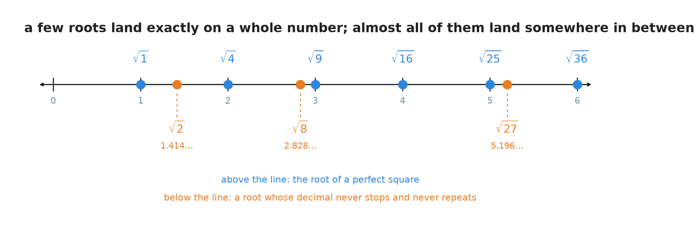

**Figure 6 — The blue dots are the roots of perfect squares, and they land on the marks. The
orange dots are all the others, and they land in the gaps. There are far more orange dots than
blue ones.**

Because an exact answer has to keep its radical sign, the question becomes: what is the **tidiest
way to write it**? That is section 4.

### Summary of section 3

* You can trap a root between two numbers by squaring: too small on one side, too big on the
  other.
* Squeeze the gap as much as you like; the root of a non-perfect square is never reached.
* Its decimal never stops **and** never repeats. Such a number is called **irrational**.
* $\sqrt{2}$ is the exact value. $1.414$ is only a rounded copy.
* So a root usually stays in the answer, and the job is to write it as tidily as possible.

---

## 4. Making a square root simpler

### 4.1 A root can be split across a multiplication

Try it with numbers before trusting it as a rule. Take $\sqrt{4 \times 9}$, and work it two
different ways.

**Way one — multiply first.**

$$
\sqrt{4 \times 9} = \sqrt{36} = 6
$$

**Way two — root first.**

$$
\sqrt{4} \times \sqrt{9} = 2 \times 3 = 6
$$

Same answer. That is not luck.

**Explanation — why splitting is allowed.** Take the two separate roots and multiply the whole
thing by itself:

$$
(\sqrt{4} \times \sqrt{9}) \times (\sqrt{4} \times \sqrt{9})
$$

The order and the grouping of a chain of multiplications can be changed freely
([Chapter 19, sections 2.1 and 2.2](./../19_The_Number_Properties_Of_Algebra/19_The_Number_Properties_Of_Algebra.md#21-changing-the-order)),
so rearrange it into pairs:

$$
= (\sqrt{4} \times \sqrt{4}) \times (\sqrt{9} \times \sqrt{9}) = 4 \times 9
$$

because a square root multiplied by itself gives back its radicand — that is what a square root
*is*. So $\sqrt{4} \times \sqrt{9}$ is a number which, multiplied by itself, gives $4 \times 9$.
And it is not negative. So it **is** the principal square root of $4 \times 9$.

**The rule — the product property of roots.**

$$
\sqrt{a \times b} = \sqrt{a} \times \sqrt{b}
$$

* $a$ and $b$ — the two numbers being multiplied inside the root.
* Both of them must be zero or positive, because section 2.5 showed that a negative radicand has
  no root to speak of.

### 4.2 The method: pull out the biggest perfect square

Now the rule earns its keep. $\sqrt{8}$ is irrational, so it cannot be written as a decimal — but
it can be written more simply.

**Step 1 — look for a perfect square hiding inside the radicand.** The factors of $8$ are $1$,
$2$, $4$ and $8$. Of those, $4$ is a perfect square.

**Step 2 — write the radicand as that perfect square times whatever is left.**

$$
\sqrt{8} = \sqrt{4 \times 2}
$$

**Step 3 — split the root, using the rule from section 4.1.**

$$
\sqrt{8} = \sqrt{4} \times \sqrt{2}
$$

**Step 4 — work out the part you can.** $\sqrt{4} = 2$, and $\sqrt{2}$ has to stay as it is.

$$
\sqrt{8} = 2\sqrt{2}
$$

**Note — what $2\sqrt{2}$ means.** It means $2 \times \sqrt{2}$. The multiplication sign is left
out, exactly as it is in $2x$ — the same habit
[Chapter 10, section 8.4](./../10_Exponents/10_Exponents.md#84-when-there-is-more-than-one-thing-inside-the-bracket)
pointed out for letters.

**Is it really the same number?** $\sqrt{2} = 1.41421356\ldots$, so
$2 \times 1.41421356\ldots = 2.82842712\ldots$, and $\sqrt{8} = 2.82842712\ldots$ as well. They
agree.

### 4.3 Two more, worked the same way

**Simplify $\sqrt{27}$.**

$27$ is not a perfect square: $5^{2} = 25$ and $6^{2} = 36$, so $27$ sits between two of them.
Its factors are $1$, $3$, $9$ and $27$, and $9$ is a perfect square.

$$
\sqrt{27} = \sqrt{9 \times 3} = \sqrt{9} \times \sqrt{3} = 3\sqrt{3}
$$

**Simplify $\sqrt{50}$.**

The factors of $50$ are $1$, $2$, $5$, $10$, $25$ and $50$. The perfect square among them is
$25$.

$$
\sqrt{50} = \sqrt{25 \times 2} = \sqrt{25} \times \sqrt{2} = 5\sqrt{2}
$$

### 4.4 Take the largest perfect square, or you have not finished

$72$ has more than one perfect square among its factors: $4$, $9$ and $36$ all divide into it.
Which one should you take?

    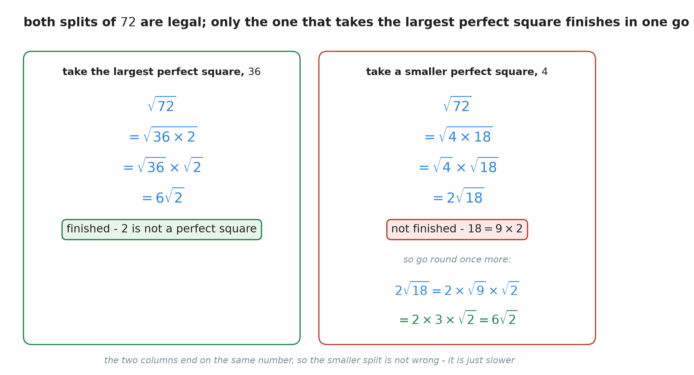

**Figure 7 — Both columns are correct and both end at the same number. The difference is that
the left one is finished after one pass, and the right one is not.**

$$
\sqrt{72} = \sqrt{36 \times 2} = \sqrt{36} \times \sqrt{2} = 6\sqrt{2}
$$

> **Warning — an unfinished answer.** If you take $4$ instead, you get $2\sqrt{18}$. Nothing there
> is wrong, but $18 = 9 \times 2$, so a perfect square is still trapped inside the radical and the
> job is only half done. A simplified root has **no perfect square left in the radicand**. Check
> the radicand against the table in section 2.4 before you stop.

> **Note — a way of never having to guess.** Break the radicand into primes, the way
> [Chapter 12, section 4](./../12_Divisibility_And_Prime_Numbers/12_Divisibility_And_Prime_Numbers.md#4-breaking-a-number-into-primes)
> taught you. $72 = 2^{3} \times 3^{2}$, which written out in full is
> $2 \times 2 \times 2 \times 3 \times 3$. Now take out every **pair** of identical factors,
> because a pair is a perfect square: the pair of $2$s comes out as a single $2$, the pair of $3$s
> comes out as a single $3$, and one lonely $2$ is left behind with no partner. So
> $2 \times 3 = 6$ stands outside and $2$ stays inside: $6\sqrt{2}$. For a large radicand this is
> far quicker than hunting through the factor list.

### 4.5 A root can be split across a division too

Multiplication has a partner rule, and it works for the same reason.

**The rule — the quotient property of roots.**

$$
\sqrt{\frac{a}{b}} = \frac{\sqrt{a}}{\sqrt{b}}
$$

* $a$ — the number on top, zero or positive.
* $b$ — the number underneath, positive and **not zero**, because nothing may be divided by zero
  ([Chapter 16, section 6.2](./../16_Multiplying_And_Dividing_Fractions/16_Multiplying_And_Dividing_Fractions.md#62-why-dividing-by-zero-has-no-answer)).

**Example.**

$$
\sqrt{\frac{9}{25}} = \frac{\sqrt{9}}{\sqrt{25}} = \frac{3}{5}
$$

**Check it.** $\frac{3}{5} = 0.6$, and $0.6 \times 0.6 = 0.36$. And $\frac{9}{25}$ is $9 \div 25 = 0.36$
as well. The two agree.

### Summary of section 4

* A root may be split across a multiplication: $\sqrt{a \times b} = \sqrt{a} \times \sqrt{b}$.
* To simplify a root, find the **largest perfect square** that divides the radicand, split it
  off, and take its root.
* $\sqrt{8} = 2\sqrt{2}$, $\sqrt{27} = 3\sqrt{3}$, $\sqrt{50} = 5\sqrt{2}$, $\sqrt{72} = 6\sqrt{2}$.
* Taking a smaller perfect square is not wrong, only unfinished — you have to go round again.
* Prime factors make it reliable: every **pair** of identical factors escapes the radical as one
  of itself.
* The same splitting works for division: $\sqrt{\frac{9}{25}} = \frac{3}{5}$.

---

## 5. The cube root

### 5.1 The same question, one step further

A square root asks for a number multiplied by itself **twice**. A cube root asks for a number
multiplied by itself **three times** — and the picture moves from a flat square to a box.

    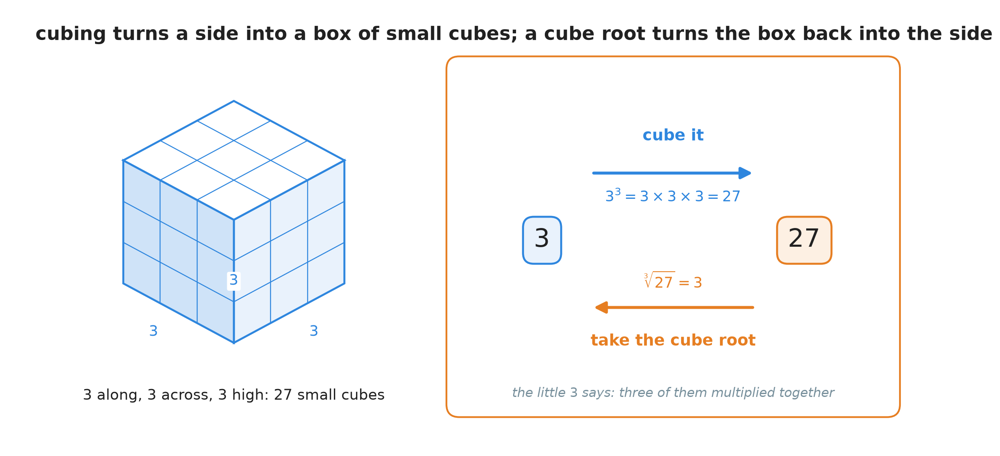

**Figure 8 — Three along, three across, three high. That is $27$ small cubes, and that is why
$3^{3}$ is read "three cubed".**

**Definition — cube root.** The **cube root** of a number is the number which, multiplied by
itself three times, gives it. It is written with an index of $3$: $\sqrt[3]{\phantom{x}}$.

$$
3 \times 3 \times 3 = 27 \qquad \text{so} \qquad \sqrt[3]{27} = 3
$$

**A worked one — find $\sqrt[3]{64}$.**

The index is $3$, so ask: what number multiplied by itself three times gives $64$? Try small
numbers in order.

$$
2 \times 2 \times 2 = 8 \quad \text{(too small)}
$$

$$
3 \times 3 \times 3 = 27 \quad \text{(still too small)}
$$

$$
4 \times 4 \times 4 = 64 \quad \checkmark
$$

$$
\sqrt[3]{64} = 4
$$

### 5.2 A cube root has only one answer

With the square root, $-3$ competed with $3$. Does $-3$ compete here?

Work it out, one step at a time. In
[Chapter 11](./../11_The_Order_Of_Operations/11_The_Order_Of_Operations.md)
you learned to take one step per line, so do that:

$$
(-3) \times (-3) = 9
$$

$$
9 \times (-3) = -27
$$

So $(-3)^{3} = -27$, which is **not** $27$. The negative number does not compete: multiplying
three negatives leaves the answer negative.

**The rule.** A cube root has exactly **one** answer. $\sqrt[3]{27} = 3$, and there is no
$\pm$ anywhere in sight.

### 5.3 A cube root of a negative number does exist

And now the fact that surprises people. $\sqrt{-27}$ has no answer. But $\sqrt[3]{-27}$ has one,
and the working above already found it:

$$
(-3) \times (-3) \times (-3) = -27 \qquad \text{so} \qquad \sqrt[3]{-27} = -3
$$

The very thing that stopped $-3$ from competing for $\sqrt[3]{27}$ is what makes it the answer
for $\sqrt[3]{-27}$.

**A worked one — find $\sqrt[3]{-125}$.**

The radicand is negative and the index is $3$, so expect a negative answer.

First find the cube root of the positive number:

$$
5 \times 5 \times 5 = 125 \qquad \text{so} \qquad \sqrt[3]{125} = 5
$$

Now put the sign back and check it, step by step:

$$
(-5) \times (-5) = 25
$$

$$
25 \times (-5) = -125
$$

$$
\sqrt[3]{-125} = -5
$$

> **Warning.** "You cannot take the root of a negative number" is only true for square roots. It
> is false for cube roots, and saying it out of habit is one of the commonest mistakes in this
> topic. The index decides.

### 5.4 The perfect cubes worth knowing

**Definition — perfect cube.** A **perfect cube** is a whole number whose cube root is also a
whole number.

The first six are short enough to learn:

| $n$ | $1$ | $2$ | $3$ | $4$ | $5$ | $6$ |
| :--- | :-: | :-: | :-: | :-: | :-: | :-: |
| $n^{3}$ | $1$ | $8$ | $27$ | $64$ | $125$ | $216$ |

They grow much faster than the squares, which is
[Chapter 10, section 3.2](./../10_Exponents/10_Exponents.md#32-doubling-does-not-stay-slow)'s
point showing up again.

### Summary of section 5

* A **cube root** asks for the number multiplied by itself three times. Its index is $3$.
* $\sqrt[3]{27} = 3$ because $3 \times 3 \times 3 = 27$.
* It has exactly one answer, never two: $(-3)^{3}$ is $-27$, so $-3$ is not a competitor.
* A negative radicand **does** have a cube root, and it is negative: $\sqrt[3]{-125} = -5$.
* The perfect cubes start $1$, $8$, $27$, $64$, $125$, $216$.

---

## 6. Even roots and odd roots

### 6.1 The index can be any whole number

Nothing stops the index from being $4$, or $5$, or anything else. It always means the same thing:
how many equal factors you are looking for.

$$
2 \times 2 \times 2 \times 2 = 16 \qquad \text{so} \qquad \sqrt[4]{16} = 2
$$

$$
2 \times 2 \times 2 \times 2 \times 2 = 32 \qquad \text{so} \qquad \sqrt[5]{32} = 2
$$

Roots split into two families, and section 5 has already shown you why.

* **Definition — even root.** An **even root** is one whose index is an even number: $2$, $4$,
  $6$, and so on. The square root is the one you meet most.
* **Definition — odd root.** An **odd root** is one whose index is an odd number: $3$, $5$, $7$,
  and so on. The cube root is the one you meet most.

### 6.2 Why the two families behave differently

Everything in this section comes from one pattern: **minus signs cancel in pairs**.

    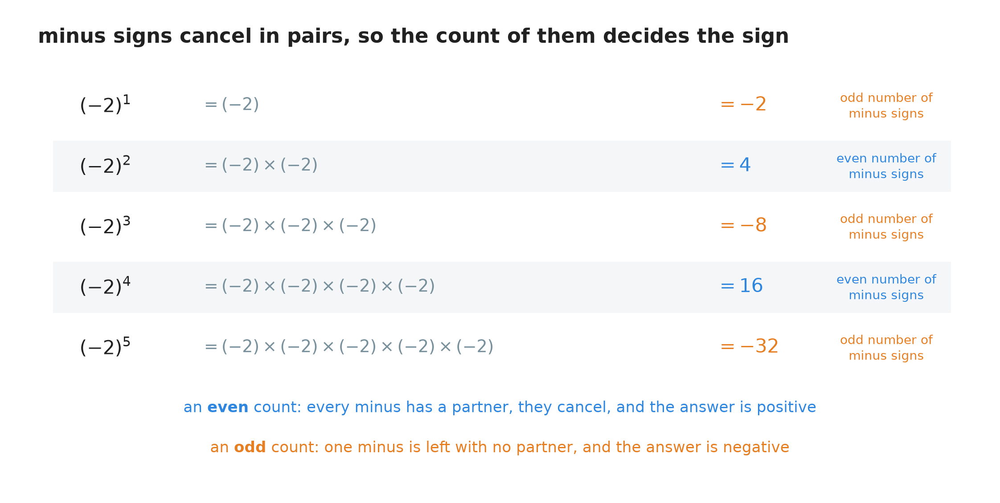

**Figure 9 — Count the minus signs in each row. An even count gives a positive answer, an odd
count gives a negative one. Nothing else in this section is new.**

Now read the two rules straight off the figure.

**An even index cannot reach a negative number.** Multiplying an even number of equal factors
means an even number of minus signs, or none at all. Either way the answer is positive. So
$\sqrt[4]{-16}$ has no answer, for the same reason $\sqrt{-9}$ has none.

**An odd index can reach a negative number, and only in one way.** Multiplying an odd number of
negative factors leaves one minus with no partner, so the answer is negative. That is why
$\sqrt[3]{-27} = -3$.

**An even index reaches a positive number from both sides.** $2^{4} = 16$ and
$(-2)^{4} = 16$ as well, so the equation $x^{4} = 16$ has two answers, $x = \pm 2$ — while the
symbol $\sqrt[4]{16}$, like every radical, still names just the positive one, $2$.

### 6.3 The four cases, in one place

    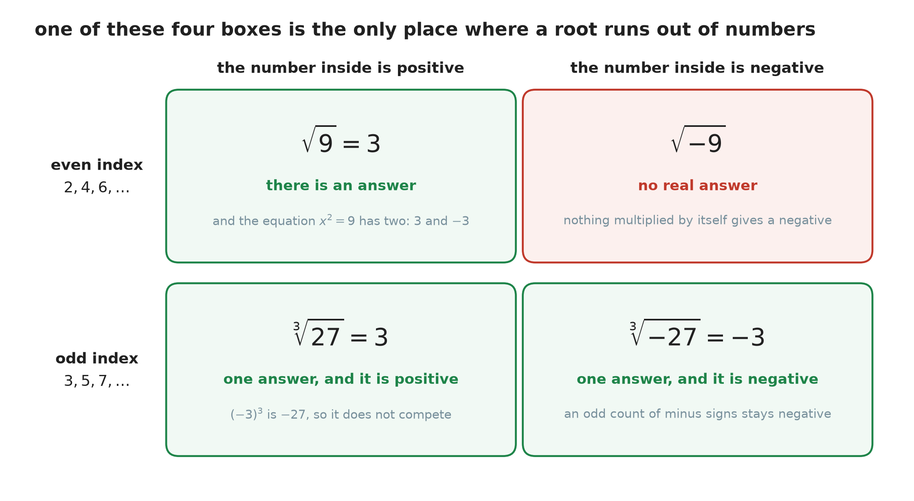

**Figure 10 — Only one of the four boxes is red. Everything else works.**

The same thing as a table, for looking up:

| | **even index** ($2, 4, 6, \ldots$) | **odd index** ($3, 5, 7, \ldots$) |
| :--- | :--- | :--- |
| **positive radicand** | the symbol gives one positive number | the symbol gives one positive number |
| **negative radicand** | **no answer at all** | one negative number |
| **example** | $\sqrt{9} = 3$, $\sqrt{-9}$ has no answer | $\sqrt[3]{27} = 3$, $\sqrt[3]{-27} = -3$ |
| **the matching equation** | $x^{2} = 9$ has **two** answers, $\pm 3$ | $x^{3} = 27$ has **one** answer, $3$ |

Read the last row carefully. It is the only place where a $\pm$ appears, and it appears because
that row is about **equations**, not about symbols.

### Summary of section 6

* The index may be any whole number, and it always counts the equal factors you want.
* **Even roots** have index $2, 4, 6, \ldots$; **odd roots** have index $3, 5, 7, \ldots$.
* Minus signs cancel in pairs. That single fact decides everything in this section.
* An even index can never reach a negative radicand. An odd index always can, in exactly one way.
* A radical symbol always names one number. Only an **equation** with an even power has two
  answers.

---

## 7. A root is a fraction in the exponent

### 7.1 What could an exponent of one half mean?

Chapter 10 gave a meaning to a positive exponent, to zero and to a negative exponent. It never
said anything about a **fraction**. What would $x^{\frac{1}{2}}$ mean? "Multiply $x$ by itself
half a time" is not a sentence anybody can act on.

So do what
[Chapter 10, section 6.1](./../10_Exponents/10_Exponents.md#61-a-question-the-definition-cannot-answer)
did when it met the same difficulty with $x^{0}$: stop asking what it means, and ask what the
**rules** force it to be.

Take Rule 1 from
[Chapter 10, section 4.2](./../10_Exponents/10_Exponents.md#42-the-rule):
when you multiply two powers with the same base, you add the exponents. Apply it to
$x^{\frac{1}{2}}$ multiplied by itself:

$$
x^{\frac{1}{2}} \times x^{\frac{1}{2}} = x^{\frac{1}{2} + \frac{1}{2}} = x^{1} = x
$$

So $x^{\frac{1}{2}}$ is a number which, multiplied by itself, gives $x$.

But that is word for word the definition of a square root:

$$
\sqrt{x} \times \sqrt{x} = x
$$

Two names, one job. They are the same number.

$$
\sqrt{x} = x^{\frac{1}{2}}
$$

### 7.2 Any index at all

The same argument works whatever the index is. $x^{\frac{1}{3}}$ multiplied by itself three times
gives

$$
x^{\frac{1}{3}} \times x^{\frac{1}{3}} \times x^{\frac{1}{3}} = x^{\frac{1}{3} + \frac{1}{3} + \frac{1}{3}} = x^{1} = x
$$

which is exactly what a cube root does.

**The rule.**

$$
\sqrt[n]{x} = x^{\frac{1}{n}}
$$

* $x$ — the radicand, the number under the sign.
* $n$ — the index, the small number in the corner.
* The index becomes the **bottom** of the fraction.

**Check it on a number you know.** $\sqrt[3]{8} = 2$, so the rule says $8^{\frac{1}{3}}$ should
also be $2$. And it is: $2 \times 2 \times 2 = 8$, which is what
$8^{\frac{1}{3}} \times 8^{\frac{1}{3}} \times 8^{\frac{1}{3}} = 8^{1}$ demands.

### 7.3 When there is a power inside the root as well

Now put the two together. What is $\sqrt[n]{x^{m}}$ — a root of something that is already a
power?

Start by writing the root as a fractional exponent, then use Rule 5 from
[Chapter 10, section 8.2](./../10_Exponents/10_Exponents.md#82-the-rule),
which says that a power of a power multiplies the two exponents:

$$
\sqrt[n]{x^{m}} = \left(x^{m}\right)^{\frac{1}{n}} = x^{m \times \frac{1}{n}} = x^{\frac{m}{n}}
$$

**The rule.**

$$
\sqrt[n]{x^{m}} = x^{\frac{m}{n}}
$$

* $m$ — the **power** inside the root. It goes on **top** of the fraction.
* $n$ — the **index** of the root. It goes **underneath**.

    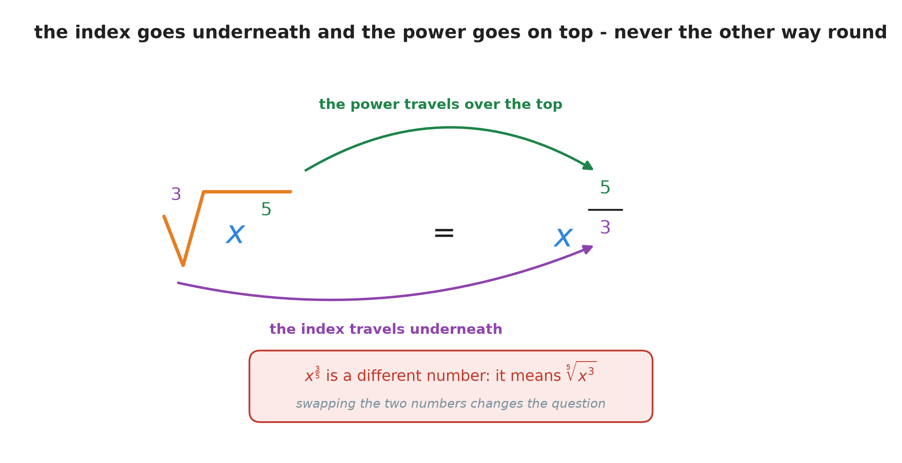

**Figure 11 — Two journeys that never cross. The power goes over the top and lands on top. The
index goes underneath and lands underneath.**

> **Warning.** Swapping the two numbers gives a completely different number.
> $\sqrt[3]{x^{2}}$ is $x^{\frac{2}{3}}$, not $x^{\frac{3}{2}}$. If you are unsure, say the rule
> out loud in the order the symbol is read: *"the root goes below"*.

> **Note — an assumption in this section.** From here on, a letter under a root stands for a
> number that is not negative. That keeps every statement below simple and true. The reason the
> warning is needed at all is in section 11.

### 7.4 Three worked examples

**Write $\sqrt{x^{6}}$ as a power and simplify it.**

The index is $2$ — it is not written, but it is there — and the power inside is $6$.

$$
\sqrt{x^{6}} = x^{\frac{6}{2}}
$$

$$
\frac{6}{2} = 3
$$

$$
\sqrt{x^{6}} = x^{3}
$$

**Simplify $\sqrt[4]{16x^{8}}$.**

First split the root across the multiplication, using section 4.1's rule — it works for any
index, not only $2$:

$$
\sqrt[4]{16x^{8}} = \sqrt[4]{16} \times \sqrt[4]{x^{8}}
$$

The first piece is a number: $2 \times 2 \times 2 \times 2 = 16$, so $\sqrt[4]{16} = 2$.

The second piece is a power, so use the rule:

$$
\sqrt[4]{x^{8}} = x^{\frac{8}{4}} = x^{2}
$$

Put them back together:

$$
\sqrt[4]{16x^{8}} = 2x^{2}
$$

**Simplify $\sqrt[3]{x^{5}}$.**

As a fractional exponent it is $x^{\frac{5}{3}}$, and that is already a complete answer. But it
can also be tidied **as a radical**, using exactly the method of section 4.2 — pull out the part
that comes free.

An index of $3$ means you are looking for groups of three. Split the power that way, using
Rule 1 backwards:

$$
x^{5} = x^{3} \times x^{2}
$$

$$
\sqrt[3]{x^{5}} = \sqrt[3]{x^{3}} \times \sqrt[3]{x^{2}}
$$

$\sqrt[3]{x^{3}}$ is just $x$, because three copies of $x$ is exactly what a cube root is looking
for. So:

$$
\sqrt[3]{x^{5}} = x\sqrt[3]{x^{2}}
$$

### 7.5 Why this is worth having

Once a root is a power, **every rule from Chapter 10 applies to it**. Nothing new has to be
learned or remembered.

For example, multiply a square root by a cube root of the same letter. As radicals there is no
obvious move. As powers there is:

$$
\sqrt{x} \times \sqrt[3]{x} = x^{\frac{1}{2}} \times x^{\frac{1}{3}} = x^{\frac{1}{2} + \frac{1}{3}}
$$

Adding those two fractions needs a common denominator, which is
[Chapter 15, section 3](./../15_Adding_And_Subtracting_Fractions/15_Adding_And_Subtracting_Fractions.md#3-when-the-bottom-numbers-are-different)'s
work: $\frac{1}{2} = \frac{3}{6}$ and $\frac{1}{3} = \frac{2}{6}$, so the sum is $\frac{5}{6}$.

$$
\sqrt{x} \times \sqrt[3]{x} = x^{\frac{5}{6}}
$$

Two chapters that looked unrelated — exponents and fractions — turn out to be the same machinery.

### Summary of section 7

* Rule 1 forces $x^{\frac{1}{2}} \times x^{\frac{1}{2}} = x$, which is what a square root does. So
  they are the same thing.
* $\sqrt[n]{x} = x^{\frac{1}{n}}$: the index becomes the bottom of the fraction.
* $\sqrt[n]{x^{m}} = x^{\frac{m}{n}}$: **the power goes on top, the index goes underneath**.
* Swapping them gives a different number, so the order matters.
* $\sqrt{x^{6}} = x^{3}$, $\sqrt[4]{16x^{8}} = 2x^{2}$, $\sqrt[3]{x^{5}} = x\sqrt[3]{x^{2}}$.
* Written as powers, roots obey all five of Chapter 10's rules.

---

## 8. Using a root to solve an equation

### 8.1 The missing move, added to the toolbox

[Chapter 20, section 2.2](./../20_Solving_Equations/20_Solving_Equations.md#22-the-four-properties-of-equality)
gave you the rule that makes solving possible: whatever you do to one side of an equation, you
may do to the other, and it stays true. Taking a root of both sides is a move of that kind.

**Solve $x^{2} = 25$.**

**Step 1 — what was done to the letter?** It was squared.

**Step 2 — undo it.** Take the square root of both sides.

**Step 3 — remember that a square has two roots.** Two numbers square to $25$, so write the
$\pm$ in front:

$$
x = \pm \sqrt{25}
$$

$$
x = \pm 5
$$

**Step 4 — check, both of them**, as
[Chapter 20, section 4.5](./../20_Solving_Equations/20_Solving_Equations.md#45-the-check-every-time)
insists:

$$
5 \times 5 = 25 \quad \checkmark \qquad\qquad (-5) \times (-5) = 25 \quad \checkmark
$$

Both work. The answer is $x = \pm 5$.

> **Warning — the most common mistake in this chapter.** Writing $x = 5$ and stopping. You have
> found one answer out of two. The $\pm$ is not decoration.

### 8.2 With an odd power there is only one answer

**Solve $y^{3} = -216$.**

**Step 1 — what was done to the letter?** It was cubed.

**Step 2 — undo it.** Take the cube root of both sides. The index is odd, so there is no $\pm$:

$$
y = \sqrt[3]{-216}
$$

**Step 3 — find it.** From the table in section 5.4, $6^{3} = 216$. The radicand is negative and
the index is odd, so the answer is negative:

$$
y = -6
$$

**Step 4 — check it**, one step per line:

$$
(-6) \times (-6) = 36
$$

$$
36 \times (-6) = -216 \quad \checkmark
$$

### 8.3 When there is no answer

**Solve $x^{2} = -4$.**

Undoing the square means asking for a number that squares to $-4$, and section 2.5 showed there
is none. Every number, squared, comes out positive or zero.

So this equation has **no solution** among the numbers of this book. That is a finished answer,
not a failure — some questions genuinely have none.

### 8.4 The two shapes side by side

| The equation | How many answers | How to write them |
| :--- | :--- | :--- |
| $x^{2} = k$, with $k$ positive | two | $x = \pm \sqrt{k}$ |
| $x^{2} = k$, with $k$ negative | none | say so |
| $x^{3} = k$, any $k$ at all | one | $x = \sqrt[3]{k}$ |

The pattern is section 6 again, read from the other end: an even power loses the sign of what
went into it, so undoing it has to offer both possibilities back. An odd power keeps the sign,
so undoing it returns exactly one number.

### Summary of section 8

* Taking a root of both sides is a legal move, by the same rule that allows every other move.
* $x^{2} = 25$ gives $x = \pm 5$. Both answers must be written, and both should be checked.
* $y^{3} = -216$ gives $y = -6$, and there is only one answer because the index is odd.
* $x^{2} = -4$ has no solution at all.
* An even power hides the sign, so undoing it gives two answers. An odd power keeps it, so
  undoing it gives one.

---

## 9. Glossary

* **Root** — the operation that undoes a power. It asks which number, multiplied by itself a
  given number of times, produces the number you have.
* **Radical sign** — the symbol $\sqrt{\phantom{x}}$, which says "take a root of what is written
  under me".
* **Radicand** — the number or expression under the radical sign. In $\sqrt{9}$ it is $9$.
* **Index** — the small number in the corner of the radical sign, saying which root to take. When
  none is written, it is $2$.
* **Square root** — the number which, multiplied by itself, gives the radicand. Index $2$.
* **Principal square root** — the one of the two square roots that is not negative. This is what
  the symbol $\sqrt{\phantom{x}}$ always means.
* **Perfect square** — a whole number whose square root is a whole number: $1, 4, 9, 16, 25,
  \ldots$
* **Irrational number** — a number that cannot be written as a fraction of two whole numbers. Its
  decimal never stops and never repeats. $\sqrt{2}$ is one.
* **Cube root** — the number which, multiplied by itself three times, gives the radicand.
  Index $3$.
* **Perfect cube** — a whole number whose cube root is a whole number: $1, 8, 27, 64, 125,
  \ldots$
* **Even root** — a root whose index is even. It has no answer for a negative radicand.
* **Odd root** — a root whose index is odd. It has exactly one answer for any radicand.
* **Product property of roots** — $\sqrt{a \times b} = \sqrt{a} \times \sqrt{b}$; the rule that
  lets a root be simplified.
* **Quotient property of roots** — $\sqrt{\frac{a}{b}} = \frac{\sqrt{a}}{\sqrt{b}}$, for $b$ not
  zero.
* **Fractional exponent** — an exponent written as a fraction. $x^{\frac{m}{n}}$ means
  $\sqrt[n]{x^{m}}$.
* **Simplified root** — a root with no perfect square (or perfect cube, for an index of $3$) left
  inside the radicand.

**Note.** Every other term used in this chapter was defined earlier and is not defined again.
**Base**, **exponent**, **power**, **squaring** and **cubing** are
[Chapter 10](./../10_Exponents/10_Exponents.md#10-glossary);
**negative number**, **opposite** and **absolute value** are
[Chapter 9](./../9_Negative_Numbers/9_Negative_Numbers.md#8-glossary);
**factor**, **prime** and **prime factorization** are
[Chapter 12](./../12_Divisibility_And_Prime_Numbers/12_Divisibility_And_Prime_Numbers.md#7-glossary);
**repeating decimal** is
[Chapter 4](./../4_Converting_Between_Forms/4_Converting_Between_Forms.md#7-glossary);
**solution**, **solving**, **inverse operation** and **the properties of equality** are
[Chapter 20](./../20_Solving_Equations/20_Solving_Equations.md#8-glossary).

---

## 10. Check your understanding

**Question 1.** Solve $x^{2} = 49$.

Answer

The letter was squared, so take the square root of both sides. Two numbers square to $49$, so
write the $\pm$:

$$
x = \pm \sqrt{49}
$$

From the table in section 2.4, $7^{2} = 49$, so $\sqrt{49} = 7$:

$$
x = \pm 7
$$

**Check.** $7 \times 7 = 49$, and $(-7) \times (-7) = 49$. Both work.

**Answer: $x = \pm 7$.**

**Question 2.** Find the value of $\sqrt[3]{125}$.

Answer

The index is $3$, so ask: what number multiplied by itself three times gives $125$?

$$
4 \times 4 \times 4 = 64 \quad \text{(too small)}
$$

$$
5 \times 5 \times 5 = 125 \quad \checkmark
$$

**Answer: $5$.** Note that there is no $\pm$ — the index is odd, so there is only one answer.

**Question 3.** Simplify $\sqrt{50}$.

Answer

$50$ is not a perfect square. Its factors are $1$, $2$, $5$, $10$, $25$ and $50$, and the largest
perfect square among them is $25$.

$$
\sqrt{50} = \sqrt{25 \times 2}
$$

$$
\sqrt{50} = \sqrt{25} \times \sqrt{2}
$$

$$
\sqrt{50} = 5\sqrt{2}
$$

$2$ has no perfect square inside it, so this is finished.

**Answer: $5\sqrt{2}$.**

**Question 4.** Evaluate $\sqrt[3]{-64}$.

Answer

The index is $3$, which is odd, so a negative radicand is allowed and the answer will be
negative.

The cube root of the positive number first: $4 \times 4 \times 4 = 64$.

Now check the negative one, one step per line:

$$
(-4) \times (-4) = 16
$$

$$
16 \times (-4) = -64 \quad \checkmark
$$

**Answer: $-4$.**

**Question 5.** Solve $y^{3} = -216$.

Answer

The letter was cubed, so take the cube root of both sides. The index is odd, so there is no
$\pm$:

$$
y = \sqrt[3]{-216}
$$

From the table in section 5.4, $6^{3} = 216$, and the radicand is negative, so:

$$
y = -6
$$

**Check.** $(-6) \times (-6) = 36$, then $36 \times (-6) = -216$.

**Answer: $y = -6$.**

**Question 6.** Simplify $\sqrt{72}$.

Answer

Look for the **largest** perfect square dividing $72$. The perfect squares that fit are $4$, $9$
and $36$; take $36$.

$$
\sqrt{72} = \sqrt{36 \times 2} = \sqrt{36} \times \sqrt{2} = 6\sqrt{2}
$$

If you took $4$ instead you would get $2\sqrt{18}$, which is true but not finished, because
$18 = 9 \times 2$ still hides a perfect square.

**Answer: $6\sqrt{2}$.**

**Question 7.** Write $\sqrt{x^{6}}$ as a power and simplify it. (Take $x$ to be a number that is
not negative.)

Answer

The index of a plain radical sign is $2$, and the power inside is $6$. The power goes on top and
the index goes underneath:

$$
\sqrt{x^{6}} = x^{\frac{6}{2}}
$$

$$
\frac{6}{2} = 3
$$

**Answer: $x^{3}$.**

**Question 8.** Rewrite $x^{\frac{5}{3}}$ in radical form, then simplify it. (Take $x$ to be a
number that is not negative.)

Answer

The bottom of the fraction is the index and the top is the power:

$$
x^{\frac{5}{3}} = \sqrt[3]{x^{5}}
$$

To simplify it, split off a group of three, because the index is $3$:

$$
x^{5} = x^{3} \times x^{2}
$$

$$
\sqrt[3]{x^{5}} = \sqrt[3]{x^{3}} \times \sqrt[3]{x^{2}} = x\sqrt[3]{x^{2}}
$$

**Answer: $\sqrt[3]{x^{5}}$, which simplifies to $x\sqrt[3]{x^{2}}$.**

**Question 9.** $\sqrt{-16}$ has no answer, but $\sqrt[3]{-64}$ does. Explain the difference in
your own words, without using the word "rule".

Answer

It is about how many minus signs there are.

$\sqrt{-16}$ asks for two equal numbers whose product is $-16$. Two equal numbers have the same
sign, so either there are no minus signs (and the answer is positive) or there are two (and they
cancel, so the answer is positive again). A product of $-16$ is impossible.

$\sqrt[3]{-64}$ asks for three equal numbers. If they are all negative there are three minus
signs, two of them cancel and one is left over, so the product is negative. That is exactly what
is wanted, and $-4$ does it.

So the difference is that an even count of minus signs always pairs off completely, and an odd
count never does.

**Question 10.** A friend writes $\sqrt{16} = \pm 4$. In the next line they write
$\sqrt{16} + 1$. What has gone wrong?

Answer

$\sqrt{16}$ is a **symbol**, and a symbol has to name one number so that you can calculate with
it. Their second line proves the point: if $\sqrt{16}$ were "$4$ or $-4$", then $\sqrt{16} + 1$
would be "$5$ or $-3$", and the expression would have no single value.

The radical sign always gives the **principal** square root, the one that is not negative. So
$\sqrt{16} = 4$ and $\sqrt{16} + 1 = 5$.

The two answers they were thinking of are real, but they belong to an equation, not to the
symbol. It is the equation $x^{2} = 16$ that has two answers, and there you write the $\pm$
yourself: $x = \pm \sqrt{16} = \pm 4$.

---

## 11. Important notes

**The mistakes people actually make.**

* **Forgetting the negative answer when solving.** $x^{2} = 16$ has two answers, $4$ and $-4$.
  This is the single most common slip in the whole topic, and section 8.1's four-step habit is
  what prevents it.
* **Putting the $\pm$ inside the symbol.** $\sqrt{16}$ is $4$, full stop. The $\pm$ is something
  *you* write in front of a root while solving an equation, because the equation has two answers.
  Section 2.3 is the reason, and question 10 is the test.
* **Saying "$\sqrt{-16} = -4$".** Check it and it collapses: $(-4) \times (-4) = +16$. A minus
  sign **inside** the radical is a different thing from a minus sign **in front** of it. $-\sqrt{16}$
  is a perfectly ordinary $-4$.
* **Saying a cube root of a negative number does not exist.** It does. $\sqrt[3]{-8} = -2$. The
  ban applies to **even** indexes only, and nothing else.
* **Stopping halfway when simplifying.** $\sqrt{8} = 4$ is wrong because $4 \times 4 = 16$.
  $\sqrt{72} = 2\sqrt{18}$ is not wrong, but it is unfinished. Look at the radicand you are left
  with and ask whether a perfect square still divides it.
* **Turning the fraction upside down.** $\sqrt[3]{x^{2}}$ is $x^{\frac{2}{3}}$, never
  $x^{\frac{3}{2}}$. The index goes underneath. Figure 11 exists only for this.

**Three ideas to keep.**

* **One fact is doing almost all of the work.** A negative times a negative is positive — which
  you learned in Chapter 9 and probably thought was housekeeping. Everything odd about this
  chapter comes from it: why a square has two roots, why a negative number has none, why a cube
  root has only one, why odd indexes reach into the negatives and even ones cannot. When you
  cannot remember a rule from this chapter, count minus signs and rebuild it.
* **A symbol names one number; an equation may have many answers.** These are two different kinds
  of statement, and the $\pm$ belongs to the second kind. Keeping them apart is worth more than
  any rule here, because the same distinction comes back everywhere in later mathematics.
* **A root is not a new operation at all.** Section 7 shows it was an exponent the whole time,
  just written a fraction instead of a whole number. That is why no new rules had to be invented:
  Chapter 10's five rules already covered it, and nobody had noticed.

**A precise point about $\sqrt{x^{2}}$.**
Section 7.3 assumed that a letter under a root stands for a number that is not negative, and here
is why that assumption was needed. $\sqrt{x^{2}}$ is **not** always $x$. Put $x = -3$ in: the
inside becomes $(-3)^{2} = 9$, and $\sqrt{9} = 3$, not $-3$. What comes out is the **absolute
value** from
[Chapter 9, section 2.3](./../9_Negative_Numbers/9_Negative_Numbers.md#23-how-far-from-zero-the-absolute-value):

$$
\sqrt{x^{2}} = |x|
$$

The square throws the sign away and the root cannot put it back. When $x$ is known to be zero or
positive, $|x| = x$ and the shorter statement is safe — which is the case every time this chapter
uses it.

**How this chapter connects to the rest of the book.**
[Chapter 10](./../10_Exponents/10_Exponents.md)
is not a prerequisite here so much as the other half of the same subject: this chapter is its
mirror image, and section 7 shows the mirror was never really there.
[Chapter 9](./../9_Negative_Numbers/9_Negative_Numbers.md)
supplies the one fact that everything rests on, exactly as it did for
[Chapter 23](./../23_Solving_Inequalities/23_Solving_Inequalities.md).
[Chapter 12](./../12_Divisibility_And_Prime_Numbers/12_Divisibility_And_Prime_Numbers.md)'s
factors and prime factorization are what make section 4 a method instead of a guess.
[Chapter 20](./../20_Solving_Equations/20_Solving_Equations.md)
supplies the whole of section 8 apart from one new move, and
[Chapter 21](./../21_Equations_With_The_Letter_On_Both_Sides/21_Equations_With_The_Letter_On_Both_Sides.md)
ended by listing "an equation with a power on the letter, such as $x^{2} = 9$" among the things
it could not yet do. That one is now closed.

What this chapter still cannot do: solve an equation where the letter appears both squared and
plain, such as $x^{2} + 5x = 6$; add or subtract two roots, such as $\sqrt{2} + \sqrt{8}$;
clear a root out of the bottom of a fraction; or say anything about the new numbers that would
give $\sqrt{-9}$ an answer. It also leaves open the question Chapter 10 asked and could not
answer — given a number, which **exponent** produces it — because a root finds the base, not the
exponent.

---

- [Back to the book](./../README.md)
- Previous: [23 Solving inequalities](./../23_Solving_Inequalities/23_Solving_Inequalities.md)
- Next: not written yet.
