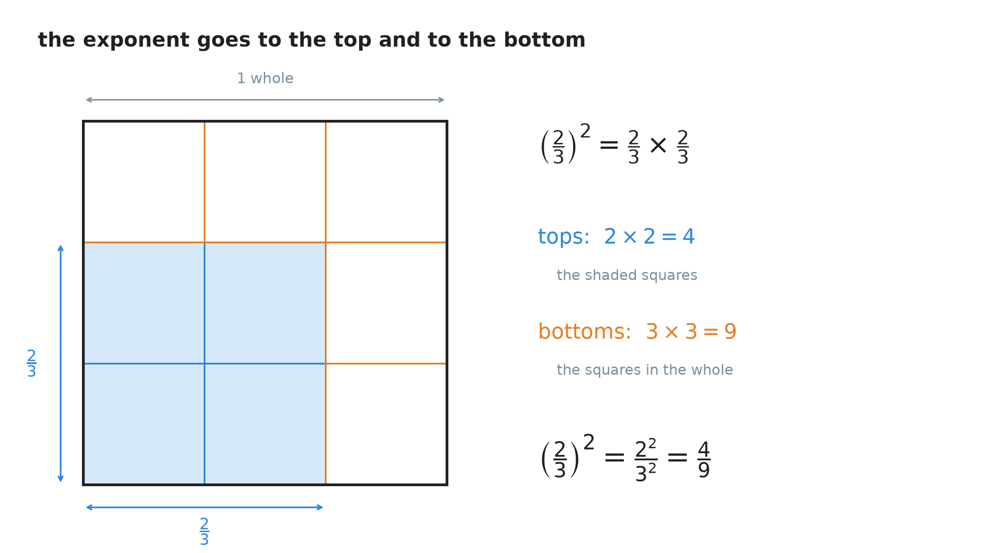
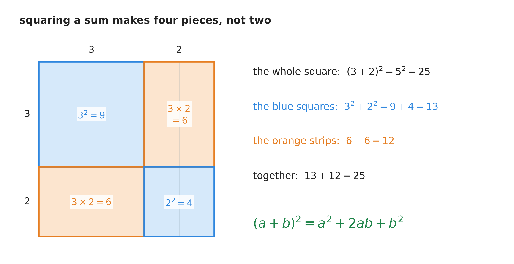
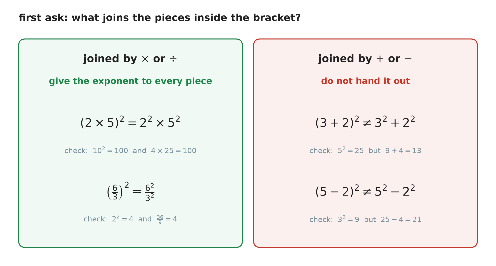
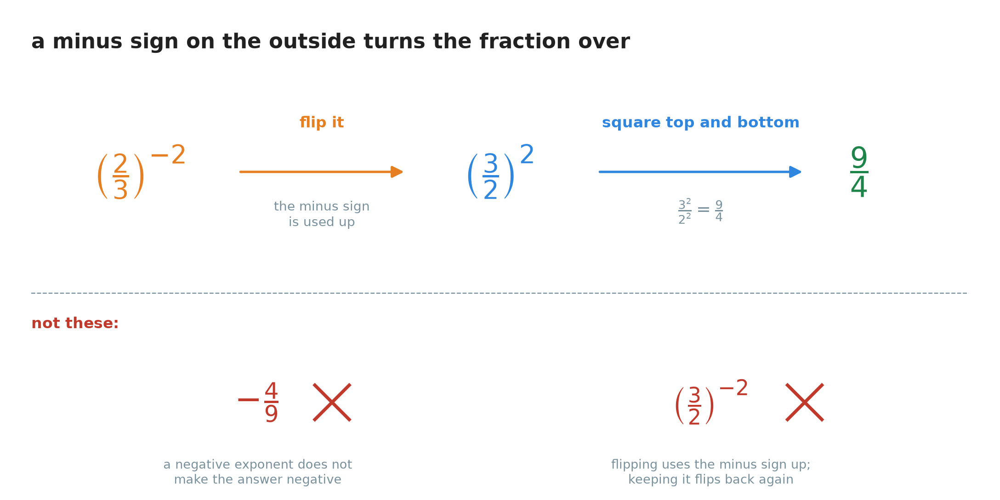
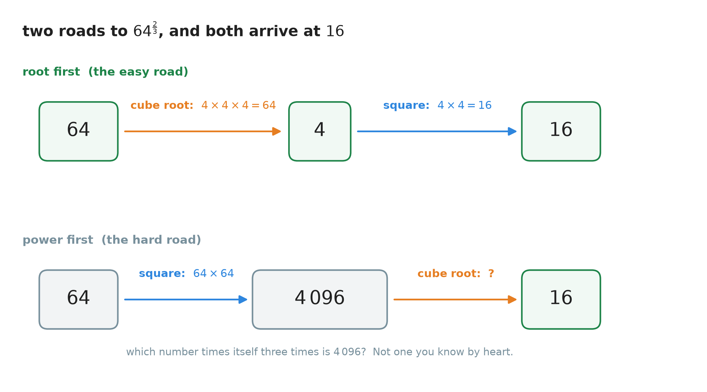

# 25. Simplifying expressions with exponents and roots

**What this chapter teaches**
How to use the exponent rules of Chapter 10 and the roots of Chapter 24 together, on one long
expression. You will learn three new moves — a power of a fraction, a negative exponent on a
fraction, and the best way to work out a fractional exponent — and one thing you must **never**
do: hand an exponent across a plus or minus sign.

**Before you start**
This chapter uses all five rules of
[Chapter 10](./../10_Exponents/10_Exponents.md),
and especially
[section 8.4](./../10_Exponents/10_Exponents.md#84-when-there-is-more-than-one-thing-inside-the-bracket),
where an exponent on a bracket reaches every factor inside it. From
[Chapter 24](./../24_Roots/24_Roots.md)
you need the cube root and
[section 7](./../24_Roots/24_Roots.md#7-a-root-is-a-fraction-in-the-exponent),
where a root becomes a fraction in the exponent. Section 2 multiplies fractions as in
[Chapter 16, section 3](./../16_Multiplying_And_Dividing_Fractions/16_Multiplying_And_Dividing_Fractions.md#3-a-fraction-times-a-fraction),
and section 3 uses the rectangle of
[Chapter 6, section 3](./../6_The_Distributive_Property/6_The_Distributive_Property.md#3-seeing-the-rule-as-a-rectangle).

---

## Table of contents

1. [What "simplified" means here](#1-what-simplified-means-here)
2. [A power of a fraction](#2-a-power-of-a-fraction)
3. [An exponent cannot pass a plus sign](#3-an-exponent-cannot-pass-a-plus-sign)
4. [A negative exponent on a fraction](#4-a-negative-exponent-on-a-fraction)
5. [A fractional exponent: take the root first](#5-a-fractional-exponent-take-the-root-first)
6. [Putting the rules together](#6-putting-the-rules-together)
7. [Glossary](#7-glossary)
8. [Check your understanding](#8-check-your-understanding)
9. [Important notes](#9-important-notes)

---

## 1. What "simplified" means here

### 1.1 The rules you already own

You already have almost every tool this chapter needs. Here they are in one place, with the
section that explains each one. Other books often give the first five rules names, so the names
are in the table too.

| The shape | What to do | Other name | Where it was explained |
| :--- | :--- | :--- | :--- |
| $x^{a} \times x^{b}$ | add the exponents: $x^{a+b}$ | product rule | [Ch. 10 § 4.2](./../10_Exponents/10_Exponents.md#42-the-rule) |
| $\dfrac{x^{a}}{x^{b}}$ | subtract the exponents: $x^{a-b}$ | quotient rule | [Ch. 10 § 5.2](./../10_Exponents/10_Exponents.md#52-the-rule) |
| $x^{0}$ | write $1$ | zero exponent | [Ch. 10 § 6.4](./../10_Exponents/10_Exponents.md#64-the-rule) |
| $x^{-a}$ | move it under the bar: $\frac{1}{x^{a}}$ | negative exponent | [Ch. 10 § 7.4](./../10_Exponents/10_Exponents.md#74-the-rule) |
| $(x^{a})^{b}$ | multiply the exponents: $x^{a \times b}$ | power of a power | [Ch. 10 § 8.2](./../10_Exponents/10_Exponents.md#82-the-rule) |
| $(ab)^{n}$ | give the exponent to every factor: $a^{n}b^{n}$ | power of a product | [Ch. 10 § 8.4](./../10_Exponents/10_Exponents.md#84-when-there-is-more-than-one-thing-inside-the-bracket) |
| $\sqrt[n]{x^{m}}$ | write it as $x^{\frac{m}{n}}$ | fractional exponent | [Ch. 24 § 7.3](./../24_Roots/24_Roots.md#73-when-there-is-a-power-inside-the-root-as-well) |

This chapter adds three rows to the table: a fraction inside the bracket (section 2), a negative
exponent on that fraction (section 4), and a better way to work out $x^{\frac{m}{n}}$ (section 5).
It also adds one row that says **no** (section 3).

> **Note — an assumption for the whole chapter.** Every letter in this chapter stands for a
> **positive** number. It must not be zero, because many letters here end up under a fraction bar,
> and nothing can be divided by zero
> ([Chapter 16, section 6.2](./../16_Multiplying_And_Dividing_Fractions/16_Multiplying_And_Dividing_Fractions.md#62-why-dividing-by-zero-has-no-answer)).
> It must not be negative, because some letters end up under a root
> ([Chapter 24, section 7.3](./../24_Roots/24_Roots.md#73-when-there-is-a-power-inside-the-root-as-well)).

### 1.2 When an answer is finished

[Chapter 19, section 1.2](./../19_The_Number_Properties_Of_Algebra/19_The_Number_Properties_Of_Algebra.md#12-so-the-word-simplify-changes-its-meaning)
told you what "simplify" means in algebra: write the same value in a tidier way. With exponents,
"tidy" has a precise meaning. An answer is **simplified** when all of these are true:

1. **No bracket is left.** Every outside exponent has been handed in.
2. **Each base appears once.** $x^{3} \times x^{2}$ has become $x^{5}$.
3. **The plain numbers are worked out.** $3^{2}$ has become $9$.
4. **No exponent is negative or zero.** $x^{-1}$ has become $\frac{1}{x}$, and $x^{0}$ has become $1$.
5. **A fraction cannot be made smaller.** Its top and bottom numbers have no common factor
   ([Chapter 14, section 5.2](./../14_The_Greatest_Common_Factor/14_The_Greatest_Common_Factor.md#52-simplifying-a-fraction-in-one-step)).

**Note.** $9x^{-1}y^{5}$ and $\frac{9y^{5}}{x}$ are the **same number** for every $x$ and $y$,
by Rule 4. Neither one is wrong. But point 4 in the list above says that the second one is the
finished form, so this book always ends there. If a question asks for something different, do
what the question asks.

### 1.3 How far an exponent reaches: the word "quantity"

[Chapter 11, section 5.1](./../11_The_Order_Of_Operations/11_The_Order_Of_Operations.md#51-an-exponent-holds-on-to-one-number-only)
showed that an exponent holds on to **one** number only, and a bracket is the only way to make it
reach further. This matters even more with letters. Compare:

$$
6x^{3}y^{2} \qquad \text{and} \qquad (6x^{3}y)^{2}
$$

* In $6x^{3}y^{2}$, the little $2$ sits on the $y$. It squares the $y$ and nothing else.
* In $(6x^{3}y)^{2}$, the little $2$ sits on the bracket. It squares **everything** inside: the
  $6$, the $x^{3}$ and the $y$.

**Definition — quantity.** When several things are put inside a bracket so that an operation
works on all of them together, the bracket is called a **quantity**. You read $(6x^{3}y)^{2}$ out
loud as "the quantity $6x^{3}y$, squared". The word tells the listener where the bracket is.

### Summary of section 1

* You already own seven rules. They are in the table in section 1.1.
* Every letter in this chapter stands for a positive number.
* A **simplified** answer has no bracket, each base once, numbers worked out, no negative or
  zero exponents, and a fraction that cannot be made smaller.
* An exponent reaches one thing only. A bracket — a **quantity** — makes it reach everything
  inside.

---

## 2. A power of a fraction

### 2.1 Try it with numbers

What is $\left(\frac{2}{3}\right)^{2}$?

An exponent of $2$ means two copies, multiplied
([Chapter 10, section 2.1](./../10_Exponents/10_Exponents.md#21-the-two-parts-and-their-names)):

$$
\left(\frac{2}{3}\right)^{2} = \frac{2}{3} \times \frac{2}{3}
$$

Two fractions multiply straight across, top times top and bottom times bottom
([Chapter 16, section 3.3](./../16_Multiplying_And_Dividing_Fractions/16_Multiplying_And_Dividing_Fractions.md#33-the-rule-in-symbols)):

$$
= \frac{2 \times 2}{3 \times 3}
$$

$$
= \frac{4}{9}
$$

Now look at the middle line again. The top is $2 \times 2$, which is $2^{2}$. The bottom is
$3 \times 3$, which is $3^{2}$. So:

$$
\left(\frac{2}{3}\right)^{2} = \frac{2^{2}}{3^{2}} = \frac{4}{9}
$$

The exponent went to the top **and** to the bottom.

### 2.2 Why the top and the bottom are powered separately

Here is the same calculation as a picture. It is the crossing-cuts picture of
[Chapter 16, section 3.2](./../16_Multiplying_And_Dividing_Fractions/16_Multiplying_And_Dividing_Fractions.md#32-why-the-numbers-multiply-straight-across).

    

**Figure 1 — The shaded square has side $\frac{2}{3}$, so its area is $\left(\frac{2}{3}\right)^{2}$.
Count the small squares. The shaded ones are $2 \times 2 = 4$. All of them together are
$3 \times 3 = 9$. The top was squared and the bottom was squared, each on its own.**

**Explanation.** The top of a fraction counts pieces. The bottom says how many pieces make one
whole. When you take copies of the fraction and multiply them, the tops multiply with each other
and the bottoms multiply with each other. They never mix. So $n$ copies give $n$ tops multiplied
together on top, and $n$ bottoms multiplied together underneath.

### 2.3 The rule

$$
\left(\frac{a}{b}\right)^{n} = \frac{a^{n}}{b^{n}} \qquad (b \neq 0)
$$

**In words:** an exponent outside a fraction goes to the top and to the bottom.

* $a$ — the top of the fraction.
* $b$ — the bottom of the fraction. It must not be zero.
* $n$ — the exponent outside the bracket.

This is the partner of the power-of-a-product rule from
[Chapter 10, section 8.4](./../10_Exponents/10_Exponents.md#84-when-there-is-more-than-one-thing-inside-the-bracket).
That rule handed an exponent to every factor of a multiplication. This one hands it to both parts
of a division. Its name is the **power of a quotient** rule, because a quotient is the answer to
a division.

### 2.4 With letters inside

The rule does not care what is on the top and the bottom. Take:

$$
\left(\frac{3xy^{2}}{2x^{3}}\right)^{2}
$$

**Step 1 — hand the exponent to the top and the bottom.**

$$
= \frac{(3xy^{2})^{2}}{(2x^{3})^{2}}
$$

**Step 2 — the top is a product, so the $2$ reaches every factor** (Chapter 10, section 8.4).
Remember that $x$ is $x^{1}$
([Chapter 10, section 2.4](./../10_Exponents/10_Exponents.md#24-the-exponent-one)):

$$
(3xy^{2})^{2} = 3^{2} \times x^{2} \times (y^{2})^{2} = 9x^{2}y^{4}
$$

**Step 3 — the same for the bottom.**

$$
(2x^{3})^{2} = 2^{2} \times (x^{3})^{2} = 4x^{6}
$$

**Step 4 — put them back together.**

$$
\left(\frac{3xy^{2}}{2x^{3}}\right)^{2} = \frac{9x^{2}y^{4}}{4x^{6}}
$$

This is not finished yet — $x$ appears twice. Section 6.3 finishes it.

> **Warning — the plain numbers get the exponent too.** $(2x^{3})^{2}$ is $4x^{6}$, not $2x^{6}$.
> The $2$ is inside the bracket, so it is squared like everything else. The same mistake on top
> would give $3x^{2}y^{4}$ instead of $9x^{2}y^{4}$.

### Summary of section 2

* $\left(\frac{2}{3}\right)^{2} = \frac{2}{3} \times \frac{2}{3} = \frac{4}{9}$.
* Tops multiply with tops and bottoms with bottoms, so the exponent goes to each one separately.
* The rule: $\left(\frac{a}{b}\right)^{n} = \frac{a^{n}}{b^{n}}$, with $b \neq 0$.
* Inside the top or the bottom, the exponent then reaches every factor, plain numbers included.

---

## 3. An exponent cannot pass a plus sign

### 3.1 The numbers say no

Section 2 and Chapter 10, section 8.4 both handed an exponent to each piece inside a bracket. It
is very tempting to do the same when the pieces are **added**. Test it before you trust it:

$$
(3 + 2)^{2}
$$

The correct way, from
[Chapter 11, section 5.2](./../11_The_Order_Of_Operations/11_The_Order_Of_Operations.md#52-a-bracket-can-widen-the-reach):
the bracket first, then the power.

$$
3 + 2 = 5
$$

$$
5^{2} = 25
$$

The tempting way: hand the $2$ to each piece.

$$
3^{2} + 2^{2} = 9 + 4 = 13
$$

$25$ and $13$. They are not the same, so the tempting way is **wrong**.

$$
(3 + 2)^{2} \neq 3^{2} + 2^{2}
$$

A minus sign fails in the same way:

$$
(5 - 2)^{2} = 3^{2} = 9 \qquad \text{but} \qquad 5^{2} - 2^{2} = 25 - 4 = 21
$$

### 3.2 What squaring a sum really gives

So where did the missing $12$ go? Draw it. $(3 + 2)^{2}$ is a square with side $3 + 2$.

    

**Figure 2 — Cut each side of the big square into $3$ and $2$. You get four pieces, not two. The
wrong answer $3^{2} + 2^{2}$ counts only the blue squares. It forgets the two orange strips, and
they hold the missing $12$.**

**Explanation — why multiplying is different.** In $(2 \times 5)^{2}$ everything inside is
multiplied, and a chain of multiplications can be put in any order
([Chapter 6, section 1.3](./../6_The_Distributive_Property/6_The_Distributive_Property.md#13-the-order-of-the-two-factors-does-not-matter)).
So the two copies $2 \times 5 \times 2 \times 5$ can be regrouped as $2 \times 2 \times 5 \times 5$.
Nothing is lost.

In $(3 + 2)^{2} = (3 + 2) \times (3 + 2)$ there is an addition inside, and a multiplication of
sums is done with the distributive property
([Chapter 6, section 2.4](./../6_The_Distributive_Property/6_The_Distributive_Property.md#24-the-rule-in-symbols)).
**Every** piece of the first bracket must multiply **every** piece of the second. That makes four
products: $3 \times 3$, $3 \times 2$, $2 \times 3$ and $2 \times 2$. Handing out the exponent keeps
only the first and the last. The two in the middle are the orange strips.

### 3.3 The rule for the square of a sum

Do the same with letters, one step per line.

**Step 1 — two copies of the bracket.**

$$
(a + b)^{2} = (a + b) \times (a + b)
$$

**Step 2 — think of the second bracket as one number, and hand it to $a$ and to $b$.** This is
the distributive property with the multiplier on the right
([Chapter 6, section 4.3](./../6_The_Distributive_Property/6_The_Distributive_Property.md#43-the-multiplier-can-stand-on-the-right)):

$$
= a \times (a + b) + b \times (a + b)
$$

**Step 3 — open both brackets**
([Chapter 19, section 3](./../19_The_Number_Properties_Of_Algebra/19_The_Number_Properties_Of_Algebra.md#3-handing-the-multiplier-out)):

$$
= a^{2} + ab + ba + b^{2}
$$

**Step 4 — $ba$ is the same as $ab$, so they are like terms. Collect them**
([Chapter 19, section 4](./../19_The_Number_Properties_Of_Algebra/19_The_Number_Properties_Of_Algebra.md#4-collecting-like-terms)):

$$
(a + b)^{2} = a^{2} + 2ab + b^{2}
$$

* $a$ and $b$ — the two numbers being added inside the bracket.
* $a^{2}$ and $b^{2}$ — the two blue squares in Figure 2.
* $2ab$ — the two orange strips, each $a \times b$.

**In words:** the square of a sum is the first number squared, plus twice the two numbers
multiplied, plus the second number squared.

**Check it with the numbers from section 3.1.** $a = 3$ and $b = 2$:

$$
3^{2} + 2 \times 3 \times 2 + 2^{2} = 9 + 12 + 4 = 25
$$

And $(3 + 2)^{2} = 25$. They agree.

**Definition — expand.** To **expand** a bracket is to multiply it out until no bracket is left,
as in steps 1 to 4 above. $a^{2} + 2ab + b^{2}$ is the **expanded** form of $(a + b)^{2}$.

> **Note.** This section shows only one bracket multiplied by itself. Many books teach a general
> method for multiplying two different brackets, often under the name **FOIL**. This book has not
> covered that method yet.

### 3.4 The test: what joins the pieces?

Before you hand an exponent to the pieces inside a bracket, ask one question.

    

**Figure 3 — Look at the sign between the pieces, not at the pieces. Times and divide: hand the
exponent out. Plus and minus: never.**

| Inside the bracket | What you may do | Example |
| :--- | :--- | :--- |
| a multiplication | give the exponent to every factor | $(ab)^{n} = a^{n}b^{n}$ |
| a division | give the exponent to the top and the bottom | $\left(\frac{a}{b}\right)^{n} = \frac{a^{n}}{b^{n}}$ |
| an addition or a subtraction | **never** hand it out | $(a + b)^{n} \neq a^{n} + b^{n}$ |

When the bracket holds numbers only, work out the bracket first, as Chapter 11 taught. When it
holds letters, expand it as in section 3.3.

### Summary of section 3

* $(3 + 2)^{2} = 25$, but $3^{2} + 2^{2} = 13$. An exponent cannot be handed across a plus sign.
* The same is true for a minus sign: $(5 - 2)^{2} = 9$, but $5^{2} - 2^{2} = 21$.
* Squaring a sum makes **four** pieces. The two middle pieces are what the wrong answer forgets.
* $(a + b)^{2} = a^{2} + 2ab + b^{2}$.
* Before handing out an exponent, look at the sign between the pieces.

---

## 4. A negative exponent on a fraction

### 4.1 Try it with numbers

What is $\left(\frac{2}{3}\right)^{-2}$?

Use Rule 4 from
[Chapter 10, section 7.4](./../10_Exponents/10_Exponents.md#74-the-rule)
exactly as it is: move the power under a fraction bar and make the exponent positive.

$$
\left(\frac{2}{3}\right)^{-2} = \frac{1}{\left(\frac{2}{3}\right)^{2}}
$$

The bottom is section 2's answer:

$$
= \frac{1}{\frac{4}{9}}
$$

$1$ divided by $\frac{4}{9}$ is $1 \times \frac{9}{4}$, by keep, change, flip
([Chapter 16, section 5.4](./../16_Multiplying_And_Dividing_Fractions/16_Multiplying_And_Dividing_Fractions.md#54-why-flipping-works)):

$$
= \frac{9}{4}
$$

Now look at the answer. $\frac{9}{4}$ is $\frac{3^{2}}{2^{2}}$, which is
$\left(\frac{3}{2}\right)^{2}$. So:

$$
\left(\frac{2}{3}\right)^{-2} = \left(\frac{3}{2}\right)^{2}
$$

The fraction turned upside down, and the minus sign disappeared.

### 4.2 Why the fraction turns over

[Chapter 10, section 7.1](./../10_Exponents/10_Exponents.md#71-one-more-word-first)
said that a negative exponent gives the **reciprocal**: the number turned upside down. A whole
number like $4$ has to be written as $\frac{4}{1}$ before you can see it turn over. A fraction is
already a top and a bottom, so you can turn it over straight away.

Here is the same thing with letters, one step per line.

$$
\left(\frac{a}{b}\right)^{-n} = \frac{1}{\left(\frac{a}{b}\right)^{n}} \qquad \text{(Rule 4)}
$$

$$
= \frac{1}{\frac{a^{n}}{b^{n}}} \qquad \text{(section 2.3)}
$$

$$
= \frac{b^{n}}{a^{n}} \qquad \text{(divide by a fraction: flip it and multiply)}
$$

$$
= \left(\frac{b}{a}\right)^{n} \qquad \text{(section 2.3, read backwards)}
$$

    

**Figure 4 — The minus sign is an instruction to turn the fraction over. It is used up by
the flip, so after the flip the exponent is positive. Below the line are the two answers
people write instead.**

### 4.3 The rule

$$
\left(\frac{a}{b}\right)^{-n} = \left(\frac{b}{a}\right)^{n} \qquad (a \neq 0,\ b \neq 0)
$$

**In words:** a negative exponent outside a fraction turns the fraction upside down, and the
exponent becomes positive.

* $a$ and $b$ — the top and the bottom. Neither may be zero, because each one ends up underneath
  at some point.
* $-n$ — the negative exponent before the flip.
* $n$ — the same exponent, now positive, after the flip.

> **Warning.** The answer is not negative. $\left(\frac{2}{3}\right)^{-2}$ is $\frac{9}{4}$, not
> $-\frac{4}{9}$. A minus sign in an exponent tells you **where** the power goes, not which side
> of zero the answer is on — the third job of the minus sign, from
> [Chapter 10, section 7.5](./../10_Exponents/10_Exponents.md#75-a-negative-exponent-does-not-give-a-negative-answer).

> **Warning.** Flip **or** remove the minus sign — do not do one without the other. If you flip
> and keep the minus, you get $\left(\frac{3}{2}\right)^{-2}$, which flips straight back to where
> you started.

### Summary of section 4

* $\left(\frac{2}{3}\right)^{-2} = \left(\frac{3}{2}\right)^{2} = \frac{9}{4}$.
* A negative exponent means "take the reciprocal", and the reciprocal of a fraction is the
  fraction turned over.
* The rule: $\left(\frac{a}{b}\right)^{-n} = \left(\frac{b}{a}\right)^{n}$.
* The flip uses up the minus sign. The answer is never made negative by it.

---

## 5. A fractional exponent: take the root first

### 5.1 Two ways to read $x^{\frac{m}{n}}$

[Chapter 24, section 7.3](./../24_Roots/24_Roots.md#73-when-there-is-a-power-inside-the-root-as-well)
showed that

$$
x^{\frac{m}{n}} = \sqrt[n]{x^{m}}
$$

The bottom of the fraction is the root. The top is the power. That form says: **power first**,
then the root.

But the fraction $\frac{m}{n}$ can also be split the other way round, as $\frac{1}{n} \times m$.
Rule 5, the power of a power
([Chapter 10, section 8.2](./../10_Exponents/10_Exponents.md#82-the-rule)),
read from right to left, then gives:

$$
x^{\frac{m}{n}} = x^{\frac{1}{n} \times m} = \left(x^{\frac{1}{n}}\right)^{m} = \left(\sqrt[n]{x}\right)^{m}
$$

That form says: **root first**, then the power. So both orders are correct:

$$
x^{\frac{m}{n}} = \sqrt[n]{x^{m}} = \left(\sqrt[n]{x}\right)^{m}
$$

* $x$ — the base.
* $n$ — the bottom of the fraction. It is the index of the root.
* $m$ — the top of the fraction. It is the power.

### 5.2 Both roads, with numbers

Work out $64^{\frac{2}{3}}$. The bottom is $3$, so there is a cube root. The top is $2$, so there
is a square.

**Road A — root first.**

$$
\sqrt[3]{64} = 4 \qquad \text{because } 4 \times 4 \times 4 = 64
$$

$$
4^{2} = 4 \times 4 = 16
$$

**Road B — power first.**

$$
64^{2} = 64 \times 64 = 4\,096
$$

$$
\sqrt[3]{4\,096} = 16 \qquad \text{because } 16 \times 16 \times 16 = 4\,096
$$

Both roads give $16$.

    

**Figure 5 — Same start, same end. On the upper road every number stays small. The lower road
climbs to $4\,096$, and then you must find a cube root that nobody knows by heart.**

### 5.3 Why the root should go first

A root makes a number **smaller**. A power makes it **bigger**. If you take the root first, the
power then works on a small number, and the numbers stay inside the tables you know: the perfect
squares of
[Chapter 24, section 2.4](./../24_Roots/24_Roots.md#24-the-perfect-squares-worth-learning-by-heart)
and the perfect cubes of
[section 5.4](./../24_Roots/24_Roots.md#54-the-perfect-cubes-worth-knowing).

If you take the power first, you make a big number, and then you must find a root of a big
number. That is the hard direction: you can always multiply, but finding a root means guessing
and checking.

**The habit.** For a number with a fractional exponent, take the **root first**, then the power.

**Another one — work out $27^{\frac{4}{3}}$.** The bottom is $3$, the top is $4$.

$$
\sqrt[3]{27} = 3 \qquad \text{because } 3 \times 3 \times 3 = 27
$$

$$
3^{4} = 3 \times 3 \times 3 \times 3 = 81
$$

Power first would have needed $27^{4} = 531\,441$, and then its cube root.

### Summary of section 5

* $x^{\frac{m}{n}}$ can be read two ways: $\sqrt[n]{x^{m}}$ (power first) or
  $\left(\sqrt[n]{x}\right)^{m}$ (root first). Both are correct.
* The bottom of the fraction is the root; the top is the power.
* $64^{\frac{2}{3}} = 16$ by both roads.
* Take the root first. The numbers stay small, and you never have to find the root of a big
  number.

---

## 6. Putting the rules together

### 6.1 An order of attack

A long expression looks hard only because there is a lot of it.
[Chapter 10, section 9.4](./../10_Exponents/10_Exponents.md#94-a-long-one-piece-by-piece)
already showed the most important habit: **finish one piece before you start the next**, and
write the whole line again after each step
([Chapter 11, section 8.1](./../11_The_Order_Of_Operations/11_The_Order_Of_Operations.md#81-the-habit-that-prevents-nearly-every-mistake)).
Here is an order that works for every example in this chapter.

1. **A negative exponent on a fraction?** Flip the fraction and make the exponent positive
   (section 4).
2. **Something to tidy inside the bracket?** You may tidy it first, with Rules 1 and 2. This is
   optional, but it keeps the numbers small.
3. **Hand in the outside exponent.** Give it to the top and the bottom (section 2), and then to
   every factor (Chapter 10, section 8.4). If it is a fraction, take the root first (section 5).
   Check first that nothing inside is joined by $+$ or $-$ (section 3).
4. **Multiply.** Multiply the plain numbers together, then each letter with itself (Rule 1).
5. **Divide.** Divide the plain numbers, then each letter (Rule 2).
6. **Check the finished form** against the list in section 1.2. Move any negative exponent under
   the bar (Rule 4).

### 6.2 A product in a bracket

**Simplify $(6x^{3}y)^{2}$.**

There is no fraction and no negative exponent, so start at step 3. Everything inside is
multiplied, so the $2$ reaches every factor:

$$
(6x^{3}y)^{2} = 6^{2} \times (x^{3})^{2} \times y^{2}
$$

Work out each piece. The number:

$$
6^{2} = 6 \times 6 = 36
$$

The $x$ part is a power of a power, so multiply the exponents (Rule 5):

$$
(x^{3})^{2} = x^{3 \times 2} = x^{6}
$$

Put them together:

$$
(6x^{3}y)^{2} = 36x^{6}y^{2}
$$

> **Warning.** $(x^{3})^{2}$ is $x^{6}$, not $x^{5}$. Rule 5 multiplies; it is Rule 1 that adds
> ([Chapter 10, section 8.3](./../10_Exponents/10_Exponents.md#83-multiply-do-not-add)).

### 6.3 A fraction in a bracket, times a term

**Simplify $4x^{3}y \times \left(\dfrac{3xy^{2}}{2x^{3}}\right)^{2}$.**

**Step 3 — hand in the outside exponent.** Section 2.4 already did this:

$$
\left(\frac{3xy^{2}}{2x^{3}}\right)^{2} = \frac{9x^{2}y^{4}}{4x^{6}}
$$

Write the whole line again:

$$
4x^{3}y \times \frac{9x^{2}y^{4}}{4x^{6}}
$$

**Step 4 — multiply.** $4x^{3}y$ is the same as $\frac{4x^{3}y}{1}$
([Chapter 16, section 1.2](./../16_Multiplying_And_Dividing_Fractions/16_Multiplying_And_Dividing_Fractions.md#12-every-whole-number-is-already-a-fraction)),
so it multiplies the top only. Take the numbers, then each letter. Remember $y = y^{1}$:

$$
4 \times 9 = 36
$$

$$
x^{3} \times x^{2} = x^{3 + 2} = x^{5}
$$

$$
y^{1} \times y^{4} = y^{1 + 4} = y^{5}
$$

The whole line is now:

$$
\frac{36x^{5}y^{5}}{4x^{6}}
$$

**Step 5 — divide.** The numbers:

$$
\frac{36}{4} = 9
$$

The $x$ part, with Rule 2. The bottom exponent is bigger, so the answer is negative:

$$
\frac{x^{5}}{x^{6}} = x^{5 - 6} = x^{-1}
$$

The $y$ part has nothing underneath, so $y^{5}$ stays on top.

**Step 6 — check the finished form.** $x^{-1}$ is a negative exponent, so move it under the bar
(Rule 4): $x^{-1} = \frac{1}{x}$.

$$
4x^{3}y \times \left(\frac{3xy^{2}}{2x^{3}}\right)^{2} = \frac{9y^{5}}{x}
$$

**The same question, tidying first (step 2).** Inside the bracket, $\frac{x}{x^{3}} = x^{1-3} = x^{-2} = \frac{1}{x^{2}}$,
so the bracket is $\frac{3y^{2}}{2x^{2}}$. Then:

$$
\left(\frac{3y^{2}}{2x^{2}}\right)^{2} = \frac{9y^{4}}{4x^{4}}
$$

$$
4x^{3}y \times \frac{9y^{4}}{4x^{4}} = \frac{36x^{3}y^{5}}{4x^{4}} = \frac{9y^{5}}{x}
$$

The same answer, with smaller exponents on the way. Step 2 is a choice, not a rule.

### 6.4 A negative fractional exponent

**Simplify $\left(\dfrac{x^{6}}{64}\right)^{-\frac{2}{3}}$.**

**Step 1 — flip the fraction and make the exponent positive** (section 4.3):

$$
\left(\frac{x^{6}}{64}\right)^{-\frac{2}{3}} = \left(\frac{64}{x^{6}}\right)^{\frac{2}{3}}
$$

**Step 3 — the exponent is a fraction, so take the root first** (section 5). The bottom of
$\frac{2}{3}$ is $3$, so take the cube root of the top and of the bottom. Splitting a root across a
fraction is the quotient property of
[Chapter 24, section 4.5](./../24_Roots/24_Roots.md#45-a-root-can-be-split-across-a-division-too),
and it works for a cube root for the same reason.

The top:

$$
\sqrt[3]{64} = 4 \qquad \text{because } 4 \times 4 \times 4 = 64
$$

The bottom, as a fractional exponent (Chapter 24, section 7.3):

$$
\sqrt[3]{x^{6}} = x^{\frac{6}{3}} = x^{2}
$$

So after the root:

$$
\frac{4}{x^{2}}
$$

**Then the power.** The top of $\frac{2}{3}$ is $2$, so square it, top and bottom (section 2.3):

$$
\left(\frac{4}{x^{2}}\right)^{2} = \frac{4^{2}}{(x^{2})^{2}} = \frac{16}{x^{4}}
$$

**Step 6 — check the finished form.** No bracket, each base once, no negative exponent.

$$
\left(\frac{x^{6}}{64}\right)^{-\frac{2}{3}} = \frac{16}{x^{4}}
$$

### Summary of section 6

* Finish one piece before you start the next, and write the whole line again after each step.
* The order: flip a negative exponent, tidy inside if you like, hand in the outside exponent,
  multiply, divide, then check the finished form.
* $(6x^{3}y)^{2} = 36x^{6}y^{2}$.
* $4x^{3}y \times \left(\frac{3xy^{2}}{2x^{3}}\right)^{2} = \frac{9y^{5}}{x}$, by either road.
* $\left(\frac{x^{6}}{64}\right)^{-\frac{2}{3}} = \frac{16}{x^{4}}$: flip, root, then power.

---

## 7. Glossary

* **Quantity** — a group of things inside a bracket, so that an operation works on all of them
  together. $(6x^{3}y)^{2}$ is "the quantity $6x^{3}y$, squared".
* **Simplified** (for an expression with exponents) — written with no bracket, each base once,
  numbers worked out, no negative or zero exponents, and a fraction that cannot be made smaller.
* **Power of a quotient** — the rule $\left(\frac{a}{b}\right)^{n} = \frac{a^{n}}{b^{n}}$: an
  exponent outside a fraction goes to the top and to the bottom.
* **Expand** — to multiply out a bracket until no bracket is left.
  $(a + b)^{2}$ expands to $a^{2} + 2ab + b^{2}$.

**Note.** Every other term in this chapter was defined earlier. **Base**, **exponent**, **power**
and **reciprocal** are in
[Chapter 10](./../10_Exponents/10_Exponents.md#10-glossary);
**root**, **index**, **cube root** and **fractional exponent** are in
[Chapter 24](./../24_Roots/24_Roots.md#9-glossary);
**term**, **distribute** and the **distributive property** are in
[Chapter 6](./../6_The_Distributive_Property/6_The_Distributive_Property.md#6-glossary);
**like terms** are in
[Chapter 19](./../19_The_Number_Properties_Of_Algebra/19_The_Number_Properties_Of_Algebra.md#9-glossary).

---

## 8. Check your understanding

**Question 1.** Simplify $(3a^{2}b^{4})^{3}$.

Answer

Everything inside is multiplied, so the $3$ reaches every factor:

$$
(3a^{2}b^{4})^{3} = 3^{3} \times (a^{2})^{3} \times (b^{4})^{3}
$$

The number:

$$
3^{3} = 3 \times 3 \times 3 = 27
$$

The letters, with Rule 5 (multiply the exponents):

$$
(a^{2})^{3} = a^{2 \times 3} = a^{6} \qquad (b^{4})^{3} = b^{4 \times 3} = b^{12}
$$

**Answer: $27a^{6}b^{12}$.**

**Question 2.** Work out $\left(\frac{2}{5}\right)^{3}$.

Answer

The exponent goes to the top and to the bottom:

$$
\left(\frac{2}{5}\right)^{3} = \frac{2^{3}}{5^{3}}
$$

$$
2^{3} = 2 \times 2 \times 2 = 8 \qquad 5^{3} = 5 \times 5 \times 5 = 125
$$

**Answer: $\frac{8}{125}$.**

**Question 3.** Work out $\left(\frac{3}{4}\right)^{-2}$.

Answer

Flip the fraction and make the exponent positive:

$$
\left(\frac{3}{4}\right)^{-2} = \left(\frac{4}{3}\right)^{2} = \frac{4^{2}}{3^{2}} = \frac{16}{9}
$$

The answer is positive, and bigger than $1$ — the flip made it so.

**Answer: $\frac{16}{9}$.**

**Question 4.** Work out $16^{\frac{3}{4}}$. Take the root first.

Answer

The bottom of the fraction is $4$, so take the fourth root:

$$
\sqrt[4]{16} = 2 \qquad \text{because } 2 \times 2 \times 2 \times 2 = 16
$$

The top is $3$, so cube the result:

$$
2^{3} = 2 \times 2 \times 2 = 8
$$

Power first would have needed $16^{3} = 4\,096$ and then its fourth root.

**Answer: $8$.**

**Question 5.** Simplify $5m^{2}n \times \left(\dfrac{2m^{3}n}{m^{4}}\right)^{3}$.

Answer

**Tidy inside the bracket first.** The $m$ part, with Rule 2:

$$
\frac{m^{3}}{m^{4}} = m^{3 - 4} = m^{-1} = \frac{1}{m}
$$

So the bracket is $\frac{2n}{m}$.

**Hand in the exponent**, top and bottom:

$$
\left(\frac{2n}{m}\right)^{3} = \frac{2^{3}n^{3}}{m^{3}} = \frac{8n^{3}}{m^{3}}
$$

**Multiply** the top by $5m^{2}n$: numbers $5 \times 8 = 40$; $n^{1} \times n^{3} = n^{4}$.

$$
\frac{40m^{2}n^{4}}{m^{3}}
$$

**Divide** the $m$ part:

$$
\frac{m^{2}}{m^{3}} = m^{2 - 3} = m^{-1} = \frac{1}{m}
$$

**Answer: $\frac{40n^{4}}{m}$.**

**Question 6.** Simplify $\left(\dfrac{27}{a^{9}}\right)^{-\frac{4}{3}}$.

Answer

**Flip** and make the exponent positive:

$$
\left(\frac{a^{9}}{27}\right)^{\frac{4}{3}}
$$

**Root first.** The bottom of $\frac{4}{3}$ is $3$, so take cube roots:

$$
\sqrt[3]{a^{9}} = a^{\frac{9}{3}} = a^{3} \qquad \sqrt[3]{27} = 3
$$

So after the root: $\frac{a^{3}}{3}$.

**Then the power.** The top of $\frac{4}{3}$ is $4$:

$$
\left(\frac{a^{3}}{3}\right)^{4} = \frac{(a^{3})^{4}}{3^{4}} = \frac{a^{12}}{81}
$$

**Answer: $\frac{a^{12}}{81}$.**

**Question 7.** A friend writes $(x + 3)^{2} = x^{2} + 9$. Show with one number that this is
wrong, then write the correct expansion.

Answer

Put $x = 1$ into both sides, the substitution test of
[Chapter 19, section 1.3](./../19_The_Number_Properties_Of_Algebra/19_The_Number_Properties_Of_Algebra.md#13-two-expressions-that-are-really-one):

$$
(1 + 3)^{2} = 4^{2} = 16 \qquad 1^{2} + 9 = 1 + 9 = 10
$$

$16 \neq 10$, so the two expressions are not equal. The friend handed the exponent across a plus
sign.

The correct expansion uses $(a + b)^{2} = a^{2} + 2ab + b^{2}$ with $a = x$ and $b = 3$:

$$
(x + 3)^{2} = x^{2} + 2 \times x \times 3 + 3^{2} = x^{2} + 6x + 9
$$

Check at $x = 1$: $1 + 6 + 9 = 16$. It agrees.

**Answer: $x^{2} + 6x + 9$.**

**Question 8.** A friend writes $(6x^{3})^{2} = 6x^{6}$. What went wrong?

Answer

The exponent is on the bracket, so it reaches **every** factor inside, and the $6$ is one of
them. The friend squared the $x^{3}$ but forgot the $6$.

$$
(6x^{3})^{2} = 6^{2} \times (x^{3})^{2} = 36x^{6}
$$

**Answer: it should be $36x^{6}$.**

**Question 9.** Why may an exponent be handed to the pieces of $(2 \times 5)^{2}$ but not to the
pieces of $(2 + 5)^{2}$? Answer without using the word "rule".

Answer

$(2 \times 5)^{2}$ means $2 \times 5 \times 2 \times 5$. That is one long multiplication, and a
multiplication can be put in any order, so it is the same as $2 \times 2 \times 5 \times 5$, which
is $2^{2} \times 5^{2}$. Nothing is lost by moving the pieces.

$(2 + 5)^{2}$ means $(2 + 5) \times (2 + 5)$. Each part of the first bracket must multiply each
part of the second, so there are four products: $2 \times 2$, $2 \times 5$, $5 \times 2$ and
$5 \times 5$. Handing out the exponent keeps only the first and the last and loses the two in the
middle. With numbers: $7^{2} = 49$, but $2^{2} + 5^{2} = 29$. The missing $20$ is
$2 \times 5 + 5 \times 2$.

**Question 10.** Two students simplify the same expression. One writes $9x^{-1}y^{5}$. The other
writes $\frac{9y^{5}}{x}$. Who is right?

Answer

Both are right: they are the same number for every $x$ and $y$, because $x^{-1} = \frac{1}{x}$.

But only the second one is **finished** in the sense of section 1.2, because it has no negative
exponent. If a question just says "simplify", give $\frac{9y^{5}}{x}$.

---

## 9. Important notes

**The mistakes people actually make.**

* **Handing an exponent across a plus or minus sign.** $(a + b)^{2}$ is not $a^{2} + b^{2}$. It
  is $a^{2} + 2ab + b^{2}$. This is the most common mistake in all of algebra, and Figure 2 is the
  picture to remember: the two forgotten strips.
* **Forgetting the plain number inside a bracket.** $(6x^{3})^{2}$ is $36x^{6}$, not $6x^{6}$.
  The exponent reaches everything inside the quantity.
* **Adding instead of multiplying for a power of a power.** $(x^{3})^{2}$ is $x^{6}$, not
  $x^{5}$. Two separate powers multiplied: add. One power copied: multiply.
* **Reading a negative exponent as a negative answer.** $x^{-2}$ is $\frac{1}{x^{2}}$, not
  $-x^{2}$. And $\left(\frac{2}{3}\right)^{-2}$ is $\frac{9}{4}$, not $-\frac{4}{9}$.
* **Flipping the fraction but keeping the minus sign.** The flip uses up the minus sign.
* **Taking the power first on a fractional exponent.** It is not wrong, but it makes big numbers
  whose roots you cannot find. Root first.

**Three ideas to keep.**

* **Look at the sign between the pieces.** Inside a bracket, $\times$ and $\div$ let an exponent
  through to every piece. $+$ and $-$ do not. This one question decides more than any rule in the
  chapter.
* **Nothing here is really new.** The power of a quotient is fraction multiplication from
  Chapter 16. The flip is Chapter 10's reciprocal. The root-first road is Chapter 10's Rule 5 read
  backwards. The square of a sum is Chapter 6's distributive property, used twice.
* **There is usually more than one correct road.** You can tidy inside the bracket first or
  last; you can take the root or the power first. All correct roads end at the same answer, so
  choose the one with the smaller numbers.

**How this chapter connects to the rest of the book.**
[Chapter 10](./../10_Exponents/10_Exponents.md)
gave five rules, and its memory notes listed "the power of a quotient" as a gap. Section 2 closes
it.
[Chapter 24](./../24_Roots/24_Roots.md)
turned roots into fractional exponents; section 5 shows how to work one out quickly.
[Chapter 6](./../6_The_Distributive_Property/6_The_Distributive_Property.md)'s
rectangle comes back in Figure 2, now as a square cut into four.

What this chapter still cannot do: multiply two **different** brackets together, such as
$(x + 2)(x + 5)$; expand a bracket with a higher power, such as $(a + b)^{3}$; or add and
subtract roots, such as $\sqrt{2} + \sqrt{8}$.

---

- [Back to the book](./../README.md)
- Previous: [24 Square roots, cube roots and other roots](./../24_Roots/24_Roots.md)
- Next: not written yet.
