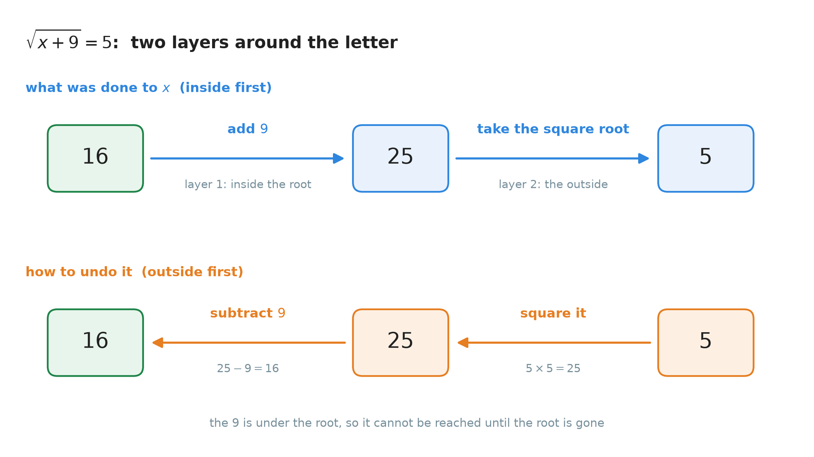
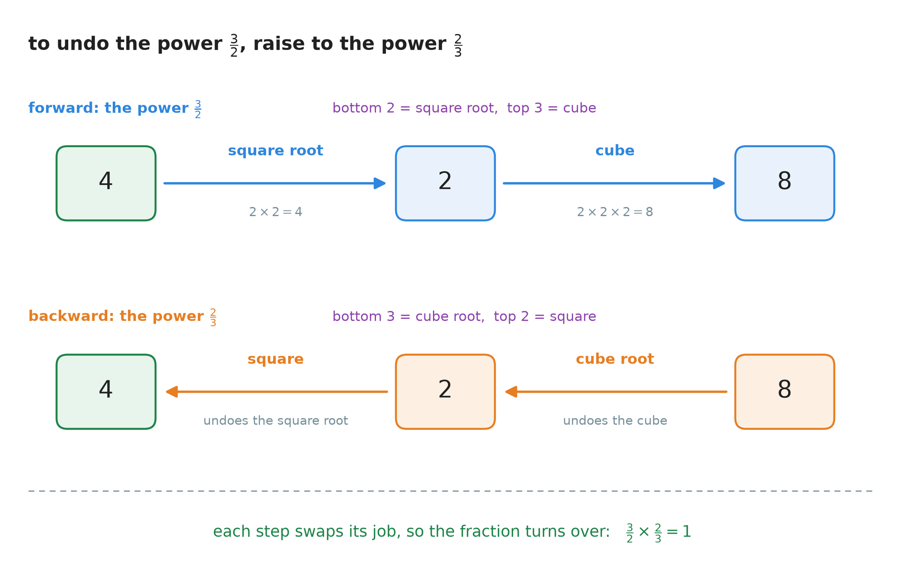
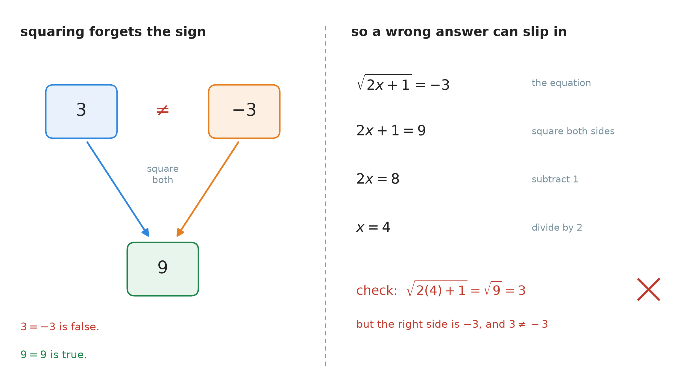
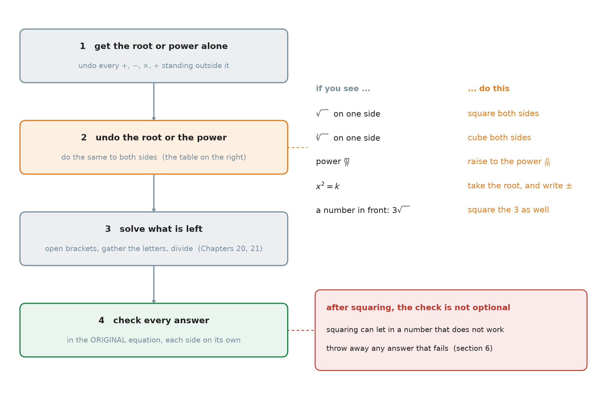

# 26. Solving equations with roots and exponents

**What this chapter teaches**
How to solve an equation when the letter is under a root, such as $\sqrt{x + 9} = 5$, or under a
fractional exponent, such as $(x + 2)^{\frac{3}{2}} = 8$. You will learn one new move — do the
**opposite power** to both sides — and one new danger: squaring both sides can bring in an answer
that does not work.

**Before you start**
You need the solving method of
[Chapter 20](./../20_Solving_Equations/20_Solving_Equations.md),
especially
[section 5](./../20_Solving_Equations/20_Solving_Equations.md#5-more-than-one-step),
where the last step done is the first step undone. From
[Chapter 21](./../21_Equations_With_The_Letter_On_Both_Sides/21_Equations_With_The_Letter_On_Both_Sides.md)
you need the letter on both sides and opening a bracket. From
[Chapter 24](./../24_Roots/24_Roots.md)
you need the square root, the cube root and
[section 8](./../24_Roots/24_Roots.md#8-using-a-root-to-solve-an-equation),
where $x^{2} = 25$ gave $x = \pm 5$. Section 3 uses
[Chapter 25, section 5](./../25_Simplifying_Expressions/25_Simplifying_Expressions.md#5-a-fractional-exponent-take-the-root-first)
(root first) and the **reciprocal** of
[Chapter 16, section 4](./../16_Multiplying_And_Dividing_Fractions/16_Multiplying_And_Dividing_Fractions.md#41-the-reciprocal).

---

## Table of contents

1. [The letter is under a root](#1-the-letter-is-under-a-root)
2. [Undoing a root: square or cube both sides](#2-undoing-a-root-square-or-cube-both-sides)
3. [Undoing a fractional exponent](#3-undoing-a-fractional-exponent)
4. [When the letter is squared: two answers](#4-when-the-letter-is-squared-two-answers)
5. [A number in front of the root, and roots on both sides](#5-a-number-in-front-of-the-root-and-roots-on-both-sides)
6. [Squaring can let in a wrong answer](#6-squaring-can-let-in-a-wrong-answer)
7. [The method in one place](#7-the-method-in-one-place)
8. [Glossary](#8-glossary)
9. [Check your understanding](#9-check-your-understanding)
10. [Important notes](#10-important-notes)

---

## 1. The letter is under a root

### 1.1 What the book can already do, and what it cannot

You can already solve these:

| Equation | How | Where |
| :--- | :--- | :--- |
| $5x - 3 = 12$ | add $3$, then divide by $5$ | [Ch. 20 § 5](./../20_Solving_Equations/20_Solving_Equations.md#5-more-than-one-step) |
| $x^{2} = 25$ | take the square root, write $\pm$ | [Ch. 24 § 8.1](./../24_Roots/24_Roots.md#81-the-missing-move-added-to-the-toolbox) |

Now look at this one:

$$
\sqrt{x + 9} = 5
$$

The letter is **under** the root. In
[Chapter 24](./../24_Roots/24_Roots.md#8-using-a-root-to-solve-an-equation)
a root **undid** a power. Here we need the opposite: something that undoes a root. That is the
new move of this chapter.

### 1.2 A root sign works like a bracket

The bar on top of the root sign covers $x + 9$. Everything under the bar is the **radicand**
([Chapter 24, section 2.2](./../24_Roots/24_Roots.md#22-the-symbol-and-the-names-of-its-three-parts)),
and the root works on **all** of it together. So $\sqrt{x + 9}$ means: first add, then take the
root. The bar is a bracket that you do not see, just like the fraction bar in
[Chapter 21, section 4.1](./../21_Equations_With_The_Letter_On_Both_Sides/21_Equations_With_The_Letter_On_Both_Sides.md#41-a-whole-side-written-over-a-number).

This means you **cannot** take the $9$ out from under the root. Test it with numbers. Put
$x = 16$:

$$
\sqrt{16 + 9} = \sqrt{25} = 5
$$

$$
\sqrt{16} + 9 = 4 + 9 = 13
$$

$5$ and $13$ are different, so $\sqrt{x + 9}$ is **not** $\sqrt{x} + 9$. A root is the exponent
$\frac{1}{2}$
([Chapter 24, section 7](./../24_Roots/24_Roots.md#7-a-root-is-a-fraction-in-the-exponent)),
and an exponent cannot pass a plus sign
([Chapter 25, section 3](./../25_Simplifying_Expressions/25_Simplifying_Expressions.md#3-an-exponent-cannot-pass-a-plus-sign)).

### 1.3 Undo from the outside in

[Chapter 20, section 5](./../20_Solving_Equations/20_Solving_Equations.md#5-more-than-one-step)
said: undo the **last** step first, like taking off shoes before socks. Look at what was done to
$x$ in $\sqrt{x + 9}$:

1. First, $9$ was added. This is the inside layer.
2. Then, the square root was taken. This is the outside layer.

So the root must come off first. Only then can you reach the $9$.

    

**Figure 1 — Top row: what was done to $x$. The $9$ went on first, the root went on last. Bottom
row: undoing it. The last layer comes off first, so we square before we subtract.**

### Summary of section 1

* A root sign works like a bracket: it covers everything under its bar.
* $\sqrt{x + 9}$ is not $\sqrt{x} + 9$. Test: at $x = 16$ they give $5$ and $13$.
* Undo from the outside in. The root is the outside layer, so it comes off first.

---

## 2. Undoing a root: square or cube both sides

### 2.1 Why squaring undoes a square root

The square root of $25$ is the number which, multiplied by itself, gives $25$. That number is $5$.
Now multiply it by itself:

$$
\left(\sqrt{25}\right)^{2} = 5^{2} = 25
$$

We are back at $25$. This is not luck. It is what a square root **means**: $\sqrt{A}$ is the number
whose square is $A$. So when you square it, you get $A$ back.

$$
\left(\sqrt{A}\right)^{2} = A
$$

**In words:** squaring a square root gives back the number under the root.

* $A$ — the radicand, the number or expression under the root. It must not be negative
  ([Chapter 24, section 2.5](./../24_Roots/24_Roots.md#25-a-negative-number-has-no-square-root)).

You can see the same thing with exponents. A square root is the power $\frac{1}{2}$, and a power
of a power multiplies the exponents
([Chapter 10, section 8.2](./../10_Exponents/10_Exponents.md#82-the-rule)):

$$
\left(\sqrt{A}\right)^{2} = \left(A^{\frac{1}{2}}\right)^{2} = A^{\frac{1}{2} \times 2} = A^{1} = A
$$

**Is it allowed?** Yes.
[Chapter 20, section 2.2](./../20_Solving_Equations/20_Solving_Equations.md#22-the-four-properties-of-equality)
says you may do the same thing to both sides of an equation. If two sides are equal, their
squares are equal too:

$$
\text{if } A = B \text{, then } A^{2} = B^{2}
$$

Section 6 will show that this sentence does **not** work backwards. For now, we use it forwards.

### 2.2 Worked: $\sqrt{x + 9} = 5$

**Step 1 — is the root alone on one side?** Yes. Nothing is outside it.

**Step 2 — square both sides.**

$$
\left(\sqrt{x + 9}\right)^{2} = 5^{2}
$$

The left side gives back what was under the root. The right side is $5 \times 5$:

$$
x + 9 = 25
$$

**Step 3 — solve what is left.** Subtract $9$ from both sides:

$$
x = 25 - 9
$$

$$
x = 16
$$

**Step 4 — check** in the original equation
([Chapter 20, section 4.5](./../20_Solving_Equations/20_Solving_Equations.md#45-the-check-every-time)):

$$
\sqrt{16 + 9} = \sqrt{25} = 5 \quad \checkmark
$$

### 2.3 When something stands outside the root

Solve $\sqrt{x + 9} + 1 = 6$.

Now there are **three** layers: add $9$, take the root, add $1$. The $+1$ went on last, so it
comes off first. It is outside the root, so you can reach it straight away.

**Step 1 — get the root alone.** Subtract $1$ from both sides:

$$
\sqrt{x + 9} = 5
$$

This is the equation of section 2.2, so $x = 16$.

**Check:** $\sqrt{16 + 9} + 1 = 5 + 1 = 6 \quad \checkmark$

> **Warning.** Do not square while something is still outside the root. Squaring
> $\sqrt{x + 9} + 1$ does not give $x + 9 + 1$, because an exponent cannot pass a plus sign
> ([Chapter 25, section 3](./../25_Simplifying_Expressions/25_Simplifying_Expressions.md#3-an-exponent-cannot-pass-a-plus-sign)).
> First get the root alone. Then square.

### 2.4 A cube root: cube both sides

The same idea works for every root. A cube root is undone by cubing, because $\sqrt[3]{A}$ is the
number whose cube is $A$
([Chapter 24, section 5.1](./../24_Roots/24_Roots.md#51-the-same-question-one-step-further)).

**Solve $\sqrt[3]{x - 2} = 3$.**

**Step 1 — cube both sides.**

$$
\left(\sqrt[3]{x - 2}\right)^{3} = 3^{3}
$$

$$
x - 2 = 3 \times 3 \times 3
$$

$$
x - 2 = 27
$$

**Step 2 — add $2$ to both sides.**

$$
x = 29
$$

**Check:** $\sqrt[3]{29 - 2} = \sqrt[3]{27} = 3$, because $3 \times 3 \times 3 = 27$. $\checkmark$

### 2.5 The pattern

| The root | What undoes it | Why |
| :--- | :--- | :--- |
| $\sqrt{A}$ (index $2$) | square both sides | $\left(\sqrt{A}\right)^{2} = A$ |
| $\sqrt[3]{A}$ (index $3$) | cube both sides | $\left(\sqrt[3]{A}\right)^{3} = A$ |
| $\sqrt[n]{A}$ (index $n$) | raise both sides to the power $n$ | $\left(\sqrt[n]{A}\right)^{n} = A$ |

**In words:** to undo a root, raise both sides to the power that is the **index** of the root.

* $n$ — the index, the small number in the corner of the root sign.

### Summary of section 2

* $\left(\sqrt{A}\right)^{2} = A$: squaring a square root gives back what was under it.
* Doing the same power to both sides is allowed: if $A = B$, then $A^{2} = B^{2}$.
* First get the root alone. Then square (or cube) both sides.
* $\sqrt{x + 9} = 5$ gives $x = 16$. $\sqrt[3]{x - 2} = 3$ gives $x = 29$.
* The power that undoes a root is the root's index.

---

## 3. Undoing a fractional exponent

### 3.1 What the exponent $\frac{3}{2}$ does

Look at this equation:

$$
(x + 2)^{\frac{3}{2}} = 8
$$

[Chapter 25, section 5](./../25_Simplifying_Expressions/25_Simplifying_Expressions.md#5-a-fractional-exponent-take-the-root-first)
showed how to read a fractional exponent: the **bottom** is a root, the **top** is a power. So the
exponent $\frac{3}{2}$ does two things, root first:

1. take the **square root** (the bottom is $2$),
2. then **cube** (the top is $3$).

Try it on $4$:

$$
\sqrt{4} = 2
$$

$$
2^{3} = 2 \times 2 \times 2 = 8
$$

So $4^{\frac{3}{2}} = 8$.

### 3.2 Undo it, last step first

To go back from $8$ to $4$, undo the steps in the opposite order:

1. The cube went on last. Undo it with a **cube root**: $\sqrt[3]{8} = 2$.
2. The square root went on first. Undo it with a **square**: $2^{2} = 4$.

A cube root and then a square is the exponent $\frac{2}{3}$: bottom $3$ for the cube root, top $2$
for the square. So:

$$
8^{\frac{2}{3}} = 4
$$

    

**Figure 2 — The power $\frac{3}{2}$ takes $4$ to $8$. The power $\frac{2}{3}$ takes $8$ back to
$4$. Each step is replaced by its opposite, so the root and the power swap places — and the
fraction turns upside down.**

$\frac{2}{3}$ is $\frac{3}{2}$ turned upside down. It is the **reciprocal** of $\frac{3}{2}$
([Chapter 16, section 4.1](./../16_Multiplying_And_Dividing_Fractions/16_Multiplying_And_Dividing_Fractions.md#41-the-reciprocal)).

### 3.3 Why the reciprocal always works

A power of a power multiplies the exponents
([Chapter 10, section 8.2](./../10_Exponents/10_Exponents.md#82-the-rule)).
A fraction times its reciprocal is always $1$
([Chapter 16, section 4.2](./../16_Multiplying_And_Dividing_Fractions/16_Multiplying_And_Dividing_Fractions.md#42-a-fraction-times-its-reciprocal-is-always-1)).
Put the two together, first with numbers:

$$
\left(X^{\frac{3}{2}}\right)^{\frac{2}{3}} = X^{\frac{3}{2} \times \frac{2}{3}} = X^{\frac{6}{6}} = X^{1} = X
$$

Then for any fraction:

$$
\left(X^{\frac{m}{n}}\right)^{\frac{n}{m}} = X^{\frac{m}{n} \times \frac{n}{m}} = X^{1} = X
$$

**In words:** to undo the power $\frac{m}{n}$, raise to the power $\frac{n}{m}$ — the same
fraction, upside down. The two exponents multiply to $1$, and $X^{1}$ is just $X$.

* $X$ — the base. Here it is a whole bracket, such as $x + 2$. It must not be negative (see the
  Note in section 3.6).
* $\frac{m}{n}$ — the fractional exponent in the equation.
* $\frac{n}{m}$ — its reciprocal, the power that undoes it.

**Definition — reciprocal power.** The **reciprocal power** of an exponent $\frac{m}{n}$ is the
exponent $\frac{n}{m}$. Raising to it undoes raising to $\frac{m}{n}$.

### 3.4 Worked: $(x + 2)^{\frac{3}{2}} = 8$

**Step 1 — find the reciprocal power.** The exponent is $\frac{3}{2}$, so the reciprocal power is
$\frac{2}{3}$.

**Step 2 — raise both sides to $\frac{2}{3}$.**

$$
\left[(x + 2)^{\frac{3}{2}}\right]^{\frac{2}{3}} = 8^{\frac{2}{3}}
$$

**Step 3 — the left side.** The exponents multiply to $1$:

$$
(x + 2)^{1} = x + 2
$$

**Step 4 — the right side.** Root first (Chapter 25, section 5). The bottom of $\frac{2}{3}$ is
$3$, so take the cube root:

$$
\sqrt[3]{8} = 2 \qquad \text{because } 2 \times 2 \times 2 = 8
$$

The top is $2$, so square it:

$$
2^{2} = 4
$$

So the equation is now:

$$
x + 2 = 4
$$

**Step 5 — subtract $2$ from both sides.**

$$
x = 2
$$

**Step 6 — check.** Put $x = 2$ into the original equation:

$$
(2 + 2)^{\frac{3}{2}} = 4^{\frac{3}{2}}
$$

$$
= \left(\sqrt{4}\right)^{3}
$$

$$
= 2^{3} = 8 \quad \checkmark
$$

### 3.5 An exponent is not a multiplier

> **Warning.** $(x + 2)^{\frac{3}{2}}$ does **not** mean $(x + 2) \times \frac{3}{2}$. So you
> cannot undo it by dividing by $\frac{3}{2}$. Try it and see. Dividing $8$ by $\frac{3}{2}$ gives
> $8 \times \frac{2}{3} = \frac{16}{3}$, so $x + 2 = \frac{16}{3}$. Check:
> $\left(\frac{16}{3}\right)^{\frac{3}{2}}$ is about $12.3$, not $8$. Wrong. An exponent is undone
> by a **power**, never by a division.

### 3.6 A note about the sign of the bracket

> **Note.** In this book a fractional exponent sits on a number that is **not negative**
> ([Chapter 24, section 7.3](./../24_Roots/24_Roots.md#73-when-there-is-a-power-inside-the-root-as-well)),
> so in this chapter a bracket like $x + 2$ under a fractional exponent is never negative. Most of
> the time this changes nothing. But when the **top** of the exponent is **even**, it matters.
> Take $(x - 1)^{\frac{2}{3}} = 9$. The top $2$ is a square, and a square forgets the sign
> ([Chapter 24, section 2.1](./../24_Roots/24_Roots.md#21-two-numbers-share-the-same-square)).
> With the rule "not negative", $x - 1 = 27$ and $x = 28$. If $x - 1$ were allowed to be negative,
> $x - 1 = -27$ would work too, because $\sqrt[3]{-27} = -3$ and $(-3)^{2} = 9$. That gives a
> second answer, $x = -26$. It is the same $\pm$ as in section 4 below, hidden inside the exponent.

### Summary of section 3

* The exponent $\frac{3}{2}$ means: square root, then cube.
* To undo it, do the opposite steps in the opposite order: cube root, then square. That is the
  exponent $\frac{2}{3}$.
* In general, the power $\frac{m}{n}$ is undone by its **reciprocal power** $\frac{n}{m}$, because
  $\frac{m}{n} \times \frac{n}{m} = 1$.
* $(x + 2)^{\frac{3}{2}} = 8$ gives $x = 2$.
* An exponent is not a multiplier. Never divide by it.

---

## 4. When the letter is squared: two answers

### 4.1 Worked: $x^{2} + 5 = 41$

[Chapter 24, section 8.1](./../24_Roots/24_Roots.md#81-the-missing-move-added-to-the-toolbox)
solved $x^{2} = 25$. The new thing here is the $+5$ outside the square. Outside in, as always.

**Step 1 — get $x^{2}$ alone.** Subtract $5$ from both sides:

$$
x^{2} = 41 - 5
$$

$$
x^{2} = 36
$$

**Step 2 — take the square root, and write $\pm$.** Two numbers have the square $36$: $6$ and
$-6$
([Chapter 24, section 2.1](./../24_Roots/24_Roots.md#21-two-numbers-share-the-same-square)).

$$
x = \pm \sqrt{36}
$$

$$
x = \pm 6
$$

**Step 3 — check both.**

$$
6^{2} + 5 = 36 + 5 = 41 \quad \checkmark
$$

$$
(-6)^{2} + 5 = 36 + 5 = 41 \quad \checkmark
$$

So $x = 6$ or $x = -6$. On the number line they are the same distance from zero, one on each side
— Figure 2 of
[Chapter 24](./../24_Roots/24_Roots.md#21-two-numbers-share-the-same-square)
shows the same picture for $9$.

### 4.2 Why the $5$ must go first

You cannot take the root of $x^{2} + 5$ piece by piece. A root cannot pass a plus sign (section
1.2). Test it at $x = 6$:

$$
\sqrt{6^{2} + 5} = \sqrt{41}, \text{ which is about } 6.40
$$

$$
6 + \sqrt{5} \text{ is about } 6 + 2.24 = 8.24
$$

They are different. So first get $x^{2}$ alone, then take the root.

### 4.3 Where the $\pm$ comes from, and where it does not

* **Taking a square root of both sides** (to undo $x^{2}$) needs $\pm$. Two numbers have the same
  square.
* **Squaring both sides** (to undo $\sqrt{\ }$) needs no $\pm$. A square root names **one**
  number, the positive one
  ([Chapter 24, section 2.3](./../24_Roots/24_Roots.md#23-the-symbol-names-one-number-not-two)).

Squaring has its own problem, though, and section 6 is about it.

### Summary of section 4

* First get $x^{2}$ alone. Then take the square root of both sides.
* $x^{2} = 36$ gives $x = \pm 6$: two answers, and both must be checked.
* $\sqrt{x^{2} + 5}$ is not $x + \sqrt{5}$. A root cannot pass a plus sign.
* Undoing a square needs $\pm$. Undoing a square root does not.

---

## 5. A number in front of the root, and roots on both sides

### 5.1 Square the number too

Sometimes a number multiplies the root, as in $3\sqrt{x - 1}$. When you square this, the exponent
reaches **every factor** of the product — the $3$ and the root
([Chapter 10, section 8.4](./../10_Exponents/10_Exponents.md#84-when-there-is-more-than-one-thing-inside-the-bracket)):

$$
\left(3\sqrt{x - 1}\right)^{2} = 3^{2} \times \left(\sqrt{x - 1}\right)^{2}
$$

$$
= 9 \times (x - 1)
$$

$$
= 9(x - 1)
$$

Check it with a number. Put $x = 5$:

$$
\left(3\sqrt{5 - 1}\right)^{2} = \left(3 \times 2\right)^{2} = 6^{2} = 36
$$

$$
9(5 - 1) = 9 \times 4 = 36 \quad \checkmark
$$

The general rule:

$$
\left(c\sqrt{A}\right)^{2} = c^{2} \times A
$$

* $c$ — the number in front of the root.
* $A$ — the expression under the root.

**In words:** square the number in front, and drop the root from what is under it.

> **Warning.** $\left(3\sqrt{x - 1}\right)^{2}$ is **not** $3(x - 1)$. At $x = 5$ that gives
> $3 \times 4 = 12$, not $36$. The $3$ is part of the product, so it is squared too.

### 5.2 Worked: $3\sqrt{x - 1} = \sqrt{x + 1}$

Now there is a root on **each** side. Each side is one product with nothing added outside it, so
we can square straight away.

**Step 1 — square both sides.**

$$
\left(3\sqrt{x - 1}\right)^{2} = \left(\sqrt{x + 1}\right)^{2}
$$

**Step 2 — work out each side.** The left side is section 5.1. The right side gives back what was
under the root.

$$
9(x - 1) = x + 1
$$

Both roots are gone. What is left is an equation of
[Chapter 21](./../21_Equations_With_The_Letter_On_Both_Sides/21_Equations_With_The_Letter_On_Both_Sides.md).

**Step 3 — open the bracket**
([Chapter 21, section 3](./../21_Equations_With_The_Letter_On_Both_Sides/21_Equations_With_The_Letter_On_Both_Sides.md#3-when-there-is-a-bracket-in-the-way)):

$$
9x - 9 = x + 1
$$

**Step 4 — gather the letters.** Subtract $x$ from both sides
([Chapter 21, section 2](./../21_Equations_With_The_Letter_On_Both_Sides/21_Equations_With_The_Letter_On_Both_Sides.md#2-moving-a-whole-term-across)):

$$
8x - 9 = 1
$$

**Step 5 — gather the numbers.** Add $9$ to both sides:

$$
8x = 10
$$

**Step 6 — divide by $8$, and simplify**
([Chapter 14, section 5.2](./../14_The_Greatest_Common_Factor/14_The_Greatest_Common_Factor.md#52-simplifying-a-fraction-in-one-step)):

$$
x = \frac{10}{8} = \frac{5}{4}
$$

**Step 7 — check, each side on its own.** First, the numbers under the roots:

$$
\frac{5}{4} - 1 = \frac{1}{4} \qquad \frac{5}{4} + 1 = \frac{9}{4}
$$

A root can be split across a division
([Chapter 24, section 4.5](./../24_Roots/24_Roots.md#45-a-root-can-be-split-across-a-division-too)),
so $\sqrt{\frac{1}{4}} = \frac{1}{2}$ and $\sqrt{\frac{9}{4}} = \frac{3}{2}$.

Left side:

$$
3 \times \sqrt{\frac{1}{4}} = 3 \times \frac{1}{2} = \frac{3}{2}
$$

Right side:

$$
\sqrt{\frac{9}{4}} = \frac{3}{2}
$$

Both sides are $\frac{3}{2}$. $\checkmark$

### Summary of section 5

* $\left(c\sqrt{A}\right)^{2} = c^{2} \times A$. The number in front is squared too.
* $\left(3\sqrt{x - 1}\right)^{2} = 9(x - 1)$, not $3(x - 1)$.
* With a root on each side, square both sides. Then solve what is left with Chapter 21.
* $3\sqrt{x - 1} = \sqrt{x + 1}$ gives $x = \frac{5}{4}$.

---

## 6. Squaring can let in a wrong answer

### 6.1 A false sentence that becomes true

Every move in Chapters 20 and 21 could be undone. If you add $3$ to both sides, you can subtract
$3$ again and get back exactly where you were. Squaring is different.

Take a **false** sentence:

$$
3 = -3
$$

Square both sides:

$$
3^{2} = (-3)^{2}
$$

$$
9 = 9
$$

That is **true**. Squaring turned a false sentence into a true one. The reason is the one from
[Chapter 24, section 2.1](./../24_Roots/24_Roots.md#21-two-numbers-share-the-same-square):
two different numbers, $3$ and $-3$, have the same square. Squaring forgets the sign.

So the sentence of section 2.1 works only one way:

* If $A = B$, then $A^{2} = B^{2}$. **Always true.**
* If $A^{2} = B^{2}$, then $A = B$. **Not always true.** $A$ might be $-B$.

### 6.2 What this does to an equation

**Solve $\sqrt{2x + 1} = -3$.**

Follow the method. Square both sides:

$$
2x + 1 = 9
$$

Subtract $1$:

$$
2x = 8
$$

Divide by $2$:

$$
x = 4
$$

Now **check** in the original equation:

$$
\sqrt{2(4) + 1} = \sqrt{8 + 1} = \sqrt{9} = 3
$$

The right side is $-3$, and $3 \neq -3$. The check **fails**. $x = 4$ is not a solution.

    

**Figure 3 — Left: $3$ and $-3$ are different, but both square to $9$. Right: that is how
$x = 4$ got in. It solves $\sqrt{2x + 1} = 3$, and squaring could not tell $3$ from $-3$.**

**Definition — extraneous solution.** An **extraneous solution** is a number that the solving
steps produce, but that does **not** make the original equation true. *Extraneous* means "coming
from outside". You must throw it away.

So $\sqrt{2x + 1} = -3$ has **no solution at all**, like the equation $x^{2} = -4$ in
[Chapter 24, section 8.3](./../24_Roots/24_Roots.md#83-when-there-is-no-answer).
You could have seen this at the start: a square root names the **positive** number
([Chapter 24, section 2.3](./../24_Roots/24_Roots.md#23-the-symbol-names-one-number-not-two)),
so it can never equal $-3$.

### 6.3 So the check is part of the method

In
[Chapter 20, section 4.5](./../20_Solving_Equations/20_Solving_Equations.md#45-the-check-every-time)
the check caught **your** mistakes, such as a slip in the arithmetic. Here the check catches
something different: an answer the method **itself** made, even when every step was correct.

**Explanation.** When you square both sides, the new equation keeps every true answer of the old
one — and it can also gain extra ones. Nothing is lost, but something may be added. Only the
original equation can tell you which answers are real. So after you square, the check is **not**
optional.

**Note.** Cubing does not have this problem. A cube keeps the sign: $3^{3} = 27$ but
$(-3)^{3} = -27$
([Chapter 24, section 6.2](./../24_Roots/24_Roots.md#62-why-the-two-families-behave-differently)).
Two different numbers never have the same cube, so cubing both sides never lets in a stranger.
The danger comes from **even** powers. Check every answer anyway — it costs one line.

### Summary of section 6

* Squaring forgets the sign, so it can turn a false sentence into a true one: $3 = -3$ becomes
  $9 = 9$.
* So squaring both sides can produce an answer that does not work: an **extraneous solution**.
* $\sqrt{2x + 1} = -3$ gives $x = 4$ after squaring, but the check fails. It has no solution.
* After squaring, always check every answer in the **original** equation, and throw away any
  that fail.

---

## 7. The method in one place

    

**Figure 4 — Only box 2 is new. Boxes 1 and 3 are the moves of Chapters 20 and 21. Box 4 was a
good habit before; after squaring, it is required.**

1. **Get the root or the power alone** on one side. Undo every $+$, $-$, $\times$ and $\div$
   that stands outside it (sections 2.3 and 4.1).
2. **Undo the root or the power**, on both sides:
   * a square root — square both sides (section 2.2);
   * a cube root — cube both sides (section 2.4);
   * a power $\frac{m}{n}$ — raise to the reciprocal power $\frac{n}{m}$ (section 3);
   * a square on the letter, $x^{2} = k$ — take the square root and write $\pm$ (section 4);
   * a number in front of the root — square it too (section 5.1).
3. **Solve what is left** with the methods of Chapters 20 and 21.
4. **Check every answer** in the original equation. Throw away any that fail (section 6).

### Summary of section 7

* Four steps: get it alone, undo it, solve the rest, check.
* Only step 2 is new. It always does the **opposite power** to both sides.
* Step 4 is required whenever you squared.

---

## 8. Glossary

* **Reciprocal power** — the exponent turned upside down. The reciprocal power of $\frac{m}{n}$ is
  $\frac{n}{m}$, and raising to it undoes raising to $\frac{m}{n}$.
* **Extraneous solution** — a number the solving steps produce that does not make the original
  equation true. It can appear after squaring both sides, and it must be thrown away.

**Note.** Every other term in this chapter was defined earlier. **Solution**, **isolating the
variable** and the **properties of equality** are in
[Chapter 20](./../20_Solving_Equations/20_Solving_Equations.md#8-glossary);
**term** is in
[Chapter 21](./../21_Equations_With_The_Letter_On_Both_Sides/21_Equations_With_The_Letter_On_Both_Sides.md#6-glossary);
**root**, **radical sign**, **radicand**, **index**, **principal square root** and **fractional
exponent** are in
[Chapter 24](./../24_Roots/24_Roots.md#9-glossary);
**reciprocal** is in
[Chapter 10](./../10_Exponents/10_Exponents.md#10-glossary).

---

## 9. Check your understanding

**Question 1.** Solve $\sqrt{x - 4} = 6$.

Answer

The root is alone, so square both sides:

$$
x - 4 = 36
$$

Add $4$ to both sides:

$$
x = 40
$$

Check: $\sqrt{40 - 4} = \sqrt{36} = 6 \quad \checkmark$

**Answer: $x = 40$.**

**Question 2.** Solve $x^{2} - 7 = 18$.

Answer

Get $x^{2}$ alone. Add $7$ to both sides:

$$
x^{2} = 25
$$

Take the square root, and write $\pm$:

$$
x = \pm 5
$$

Check both: $5^{2} - 7 = 25 - 7 = 18 \quad \checkmark$ and $(-5)^{2} - 7 = 25 - 7 = 18 \quad \checkmark$

**Answer: $x = 5$ or $x = -5$.**

**Question 3.** Solve $(x - 1)^{\frac{2}{3}} = 9$. Take $x - 1$ to be not negative.

Answer

The reciprocal power of $\frac{2}{3}$ is $\frac{3}{2}$. Raise both sides to it:

$$
x - 1 = 9^{\frac{3}{2}}
$$

Root first. The bottom is $2$: $\sqrt{9} = 3$. The top is $3$: $3^{3} = 27$.

$$
x - 1 = 27
$$

$$
x = 28
$$

Check: $(28 - 1)^{\frac{2}{3}} = 27^{\frac{2}{3}}$. Cube root: $\sqrt[3]{27} = 3$. Square:
$3^{2} = 9 \quad \checkmark$

**Answer: $x = 28$.** (Without the "not negative" rule, $x = -26$ would also work — see the Note
in section 3.6.)

**Question 4.** Solve $(x + 5)^{\frac{3}{4}} = 27$.

Answer

The reciprocal power of $\frac{3}{4}$ is $\frac{4}{3}$:

$$
x + 5 = 27^{\frac{4}{3}}
$$

Root first. The bottom is $3$: $\sqrt[3]{27} = 3$. The top is $4$:
$3^{4} = 3 \times 3 \times 3 \times 3 = 81$.

$$
x + 5 = 81
$$

$$
x = 76
$$

Check: $(76 + 5)^{\frac{3}{4}} = 81^{\frac{3}{4}}$. Fourth root: $\sqrt[4]{81} = 3$, because
$3 \times 3 \times 3 \times 3 = 81$. Cube: $3^{3} = 27 \quad \checkmark$

**Answer: $x = 76$.**

**Question 5.** Solve $2\sqrt{x + 3} = \sqrt{5x + 4}$.

Answer

Square both sides. The $2$ in front is squared too:

$$
2^{2}(x + 3) = 5x + 4
$$

$$
4(x + 3) = 5x + 4
$$

Open the bracket:

$$
4x + 12 = 5x + 4
$$

Subtract $4x$ from both sides:

$$
12 = x + 4
$$

Subtract $4$ from both sides:

$$
x = 8
$$

Check. Left side: $2\sqrt{8 + 3} = 2\sqrt{11}$. Right side: $\sqrt{5 \times 8 + 4} = \sqrt{44}$.
Simplify $\sqrt{44}$ as in
[Chapter 24, section 4.2](./../24_Roots/24_Roots.md#42-the-method-pull-out-the-biggest-perfect-square):
$\sqrt{44} = \sqrt{4 \times 11} = 2\sqrt{11}$. Both sides are $2\sqrt{11} \quad \checkmark$

**Answer: $x = 8$.**

**Question 6.** Solve $\sqrt[3]{2x + 1} = -3$.

Answer

Cube both sides:

$$
2x + 1 = (-3)^{3}
$$

$(-3) \times (-3) = 9$, and $9 \times (-3) = -27$:

$$
2x + 1 = -27
$$

Subtract $1$, then divide by $2$:

$$
2x = -28
$$

$$
x = -14
$$

Check: $2(-14) + 1 = -28 + 1 = -27$, and $\sqrt[3]{-27} = -3 \quad \checkmark$

Compare section 6.2. With a **square** root, $-3$ on the right meant no solution. With a **cube**
root it is fine, because a cube root of a negative number exists and is negative.

**Answer: $x = -14$.**

**Question 7.** Solve $\sqrt{x + 5} = -2$.

Answer

Squaring gives $x + 5 = 4$, so $x = -1$.

Check: $\sqrt{-1 + 5} = \sqrt{4} = 2$. The right side is $-2$, and $2 \neq -2$. The check fails, so
$x = -1$ is an extraneous solution.

You could see it at the start: a square root is never negative, so it cannot equal $-2$.

**Answer: no solution.**

**Question 8.** A friend solves $\sqrt{x + 9} = 5$ like this: "Subtract $9$ first, then square."
What is wrong?

Answer

The $9$ is **under** the root. It is the inside layer, so it cannot be reached until the root is
gone. Subtracting $9$ "from the root" treats $\sqrt{x + 9}$ as if it were $\sqrt{x} + 9$, and
those are different: at $x = 16$ the first is $5$ and the second is $13$. Square first, then
subtract.

**Question 9.** A friend writes $\left(2\sqrt{x}\right)^{2} = 2x$. Show with one number that this
is wrong, and correct it.

Answer

Put $x = 9$. Left: $\left(2\sqrt{9}\right)^{2} = (2 \times 3)^{2} = 6^{2} = 36$. The friend's
answer: $2 \times 9 = 18$. $36 \neq 18$.

The square reaches the $2$ as well: $\left(2\sqrt{x}\right)^{2} = 2^{2} \times x = 4x$. Check:
$4 \times 9 = 36 \quad \checkmark$

**Answer: $4x$.**

**Question 10.** Why must you check your answers after squaring both sides, even if every step
was correct? Answer without using the word "rule".

Answer

Because two different numbers, such as $3$ and $-3$, give the same square. Squaring cannot tell
them apart. So if the true equation says one side is $-3$, the squared equation only says "the
square is $9$" — and a number that makes the side equal $+3$ also fits that. The solving steps
can then find a number that works for the squared equation but not for the original one. Only
putting the number back into the **original** equation shows whether it is real.

---

## 10. Important notes

**The mistakes people actually make.**

* **Working inside the root before removing it.** In $\sqrt{x + 9} = 5$, the $9$ is under the
  root. Square first, then subtract. $\sqrt{x + 9}$ is not $\sqrt{x} + 9$.
* **Squaring while something is still outside the root.** Get the root alone first. In
  $\sqrt{x + 9} + 1 = 6$, subtract $1$ before you square.
* **Forgetting the $\pm$.** $x^{2} = 36$ gives $x = \pm 6$, not just $6$.
* **Forgetting to square the number in front.** $\left(3\sqrt{x - 1}\right)^{2}$ is $9(x - 1)$,
  not $3(x - 1)$.
* **Treating an exponent as a multiplier.** $(x + 2)^{\frac{3}{2}} = 8$ is undone by the power
  $\frac{2}{3}$, not by dividing by $\frac{3}{2}$.
* **Not checking after squaring.** Squaring can create an answer that does not work. Many books say
  "check to be safe", but that is too weak: after squaring, the check is part of the solution.

**Three ideas to keep.**

* **Undo with the opposite power.** A root is undone by the power of its index. A power
  $\frac{m}{n}$ is undone by $\frac{n}{m}$. A square on the letter is undone by a square root
  with $\pm$.
* **Outside in.** The last thing done to the letter is the outside layer, and it comes off first.
  This is Chapter 20's order, unchanged.
* **Even powers forget the sign.** That one fact explains both surprises of this chapter: why
  $x^{2} = 36$ has two answers, and why squaring both sides can bring in a wrong one.

**How this chapter connects to the rest of the book.**
[Chapter 20](./../20_Solving_Equations/20_Solving_Equations.md)
promised that equations with a power on the letter would come later.
[Chapter 24, section 8](./../24_Roots/24_Roots.md#8-using-a-root-to-solve-an-equation)
solved $x^{2} = k$ by taking a root. This chapter adds the opposite move — undoing a root by a
power — and the reciprocal power for fractional exponents, built on
[Chapter 16](./../16_Multiplying_And_Dividing_Fractions/16_Multiplying_And_Dividing_Fractions.md)'s
reciprocal and
[Chapter 25](./../25_Simplifying_Expressions/25_Simplifying_Expressions.md)'s
root-first habit. After the root is gone, everything left is
[Chapter 21](./../21_Equations_With_The_Letter_On_Both_Sides/21_Equations_With_The_Letter_On_Both_Sides.md).

What this chapter still cannot do: an equation where the letter appears **both** squared and
plain, such as $x^{2} + 5x = 6$, or one where squaring leaves such an equation behind, such as
$\sqrt{x + 3} = x - 3$.

---

- [Back to the book](./../README.md)
- Previous: [25 Simplifying expressions with exponents and roots](./../25_Simplifying_Expressions/25_Simplifying_Expressions.md)
- Next: not written yet.
