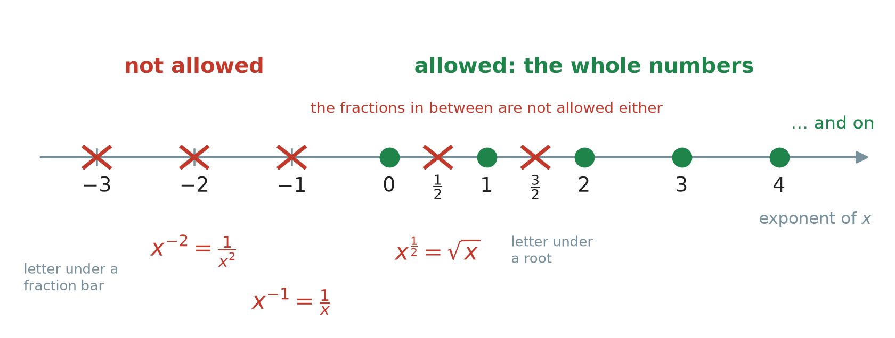
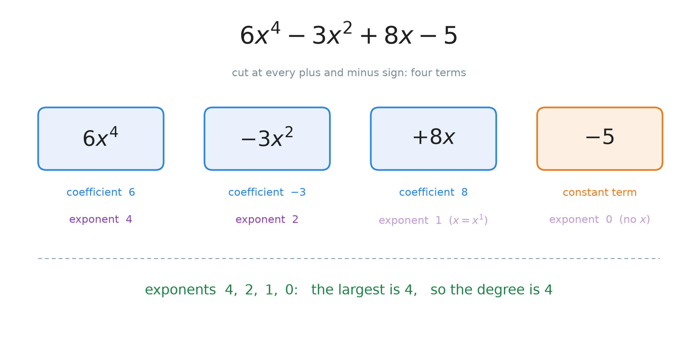
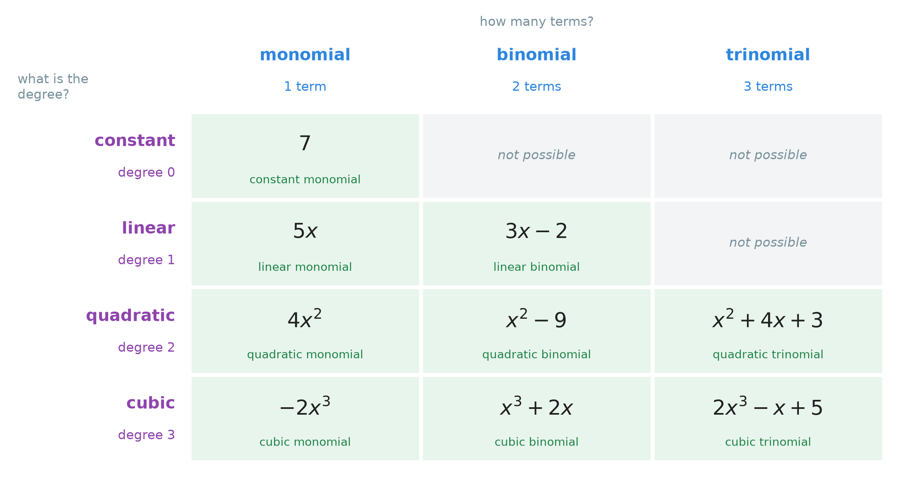
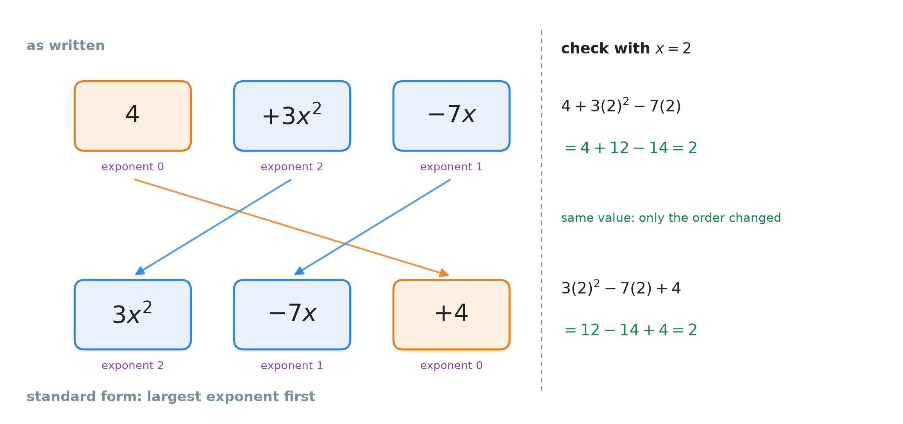

# 27. Introduction to polynomials

**What this chapter teaches**
What a **polynomial** is, how to tell whether an expression is one, and the names of its parts:
the terms, the coefficients, the constant term, the **degree** and the **leading term**. You
will also learn the two ways to name a polynomial, and the usual order to write its terms in,
which is called **standard form**.

**Before you start**
You need **terms**, **variable terms** and **constant terms** from
[Chapter 21, section 1.2](./../21_Equations_With_The_Letter_On_Both_Sides/21_Equations_With_The_Letter_On_Both_Sides.md#12-the-two-kinds-of-piece),
and the **coefficient** from
[Chapter 18, section 3.3](./../18_Introduction_To_Algebra_Variables/18_Introduction_To_Algebra_Variables.md#33-the-number-in-front-has-a-name).
From
[Chapter 10](./../10_Exponents/10_Exponents.md)
you need the exponent, $x^{1} = x$, $x^{0} = 1$ and the negative exponent. From
[Chapter 24, section 7](./../24_Roots/24_Roots.md#7-a-root-is-a-fraction-in-the-exponent)
you need $\sqrt{x} = x^{\frac{1}{2}}$. From
[Chapter 19](./../19_The_Number_Properties_Of_Algebra/19_The_Number_Properties_Of_Algebra.md)
you need like terms and the safe way to move a subtraction.

---

## Table of contents

1. [What a polynomial is](#1-what-a-polynomial-is)
2. [What is not a polynomial](#2-what-is-not-a-polynomial)
3. [The parts of a polynomial](#3-the-parts-of-a-polynomial)
4. [The degree](#4-the-degree)
5. [Two ways to name a polynomial](#5-two-ways-to-name-a-polynomial)
6. [Standard form and the leading term](#6-standard-form-and-the-leading-term)
7. [Reading a whole polynomial](#7-reading-a-whole-polynomial)
8. [Glossary](#8-glossary)
9. [Check your understanding](#9-check-your-understanding)
10. [Important notes](#10-important-notes)

---

## 1. What a polynomial is

### 1.1 You have already met many of them

Look at these two expressions:

$$
3x + 5 \qquad\qquad 2x^{2} - 7x + 4
$$

You have seen expressions like these all through the book.
[Chapter 19](./../19_The_Number_Properties_Of_Algebra/19_The_Number_Properties_Of_Algebra.md#4-collecting-like-terms)
collected like terms and got answers of this shape. Both of them are **polynomials**. This
chapter gives that family of expressions a name. Then it gives names to its parts, so that we
can talk about them clearly.

### 1.2 Every term has the same simple shape

Take one term, $6x^{4}$. It means $6$ times $x$ times $x$ times $x$ times $x$:

$$
6x^{4} = 6 \times x \times x \times x \times x
$$

It is built from only two things:

* a **number** in front — the coefficient, $6$;
* the letter $x$, multiplied by itself a **whole number** of times — here $4$ times.

A term of this shape — a number times $x$ raised to a whole number — is called a **monomial**.
The word comes from *mono*, which means "one". It is one term.

> **Definition — polynomial.** A **polynomial** is an expression made by adding or subtracting
> monomials. Every term is a number times the letter raised to a **whole number** exponent:
> $0, 1, 2, 3, \dots$

The word comes from *poly*, which means "many". A polynomial is "many terms", added together.
Here are three examples:

$$
5x^{3} - 2x + 7 \qquad\qquad x^{4} + 3x^{2} - 8 \qquad\qquad 12
$$

The last one, $12$, is a polynomial too. It has only one term, and that is allowed.

The **whole numbers** are $0, 1, 2, 3, \dots$, from
[Chapter 12, section 1.2](./../12_Divisibility_And_Prime_Numbers/12_Divisibility_And_Prime_Numbers.md#12-the-numbers-this-chapter-talks-about).
Many books say **non-negative integers** instead. It is the same list: no negative numbers and
no fractions.

### 1.3 Why $8x$ and $-5$ also fit the rule

In $5x^{3} - 2x + 7$, the term $-2x$ shows no exponent, and $7$ shows no $x$ at all. They still
fit the rule.

* $x = x^{1}$, from
  [Chapter 10, section 2.4](./../10_Exponents/10_Exponents.md#24-the-exponent-one).
  So $-2x$ is $-2x^{1}$. Its exponent is $1$, a whole number.
* $x^{0} = 1$, from
  [Chapter 10, section 6](./../10_Exponents/10_Exponents.md#6-rule-3-the-exponent-zero).
  So $7 = 7 \times 1 = 7x^{0}$. Its exponent is $0$, a whole number.

So a plain number is a term with the exponent $0$. This idea will give us the degree of a
number in section 4.

**Note.** Chapter 10 says $x^{0} = 1$ only when $x$ is not $0$. Inside a polynomial,
mathematicians agree to read $x^{0}$ as $1$ every time, also when $x = 0$. Then $7x^{0}$ is
always just $7$, as it should be.

### 1.4 The general formula

We have seen the idea with numbers. Now here is the same idea for any polynomial in $x$:

$$
a_{n}x^{n} + a_{n-1}x^{n-1} + \cdots + a_{2}x^{2} + a_{1}x + a_{0}
$$

**In words:** some number times $x^{n}$, plus some number times $x^{n-1}$, and so on, all the
way down to a number times $x$, plus a plain number at the end.

* $n$ — the biggest exponent. It is a whole number.
* $a_{n}, a_{n-1}, \dots, a_{1}, a_{0}$ — the coefficients. They are ordinary numbers.
* The small number at the bottom of $a$ is a **label**, not an exponent. $a_{2}$ means "the
  coefficient that belongs to $x^{2}$". $a_{0}$ belongs to $x^{0}$, so it is the plain number.
* $\cdots$ means "the same pattern continues here".

Match it with $2x^{2} - 7x + 4$. Here $n = 2$, $a_{2} = 2$, $a_{1} = -7$ and $a_{0} = 4$.

The exponents in this formula are $n$, then one less, then one less again, down to $0$. They
are always whole numbers. That is the whole rule.

### 1.5 A polynomial and a polynomial equation

[Chapter 18, section 4](./../18_Introduction_To_Algebra_Variables/18_Introduction_To_Algebra_Variables.md#4-expressions-and-equations)
separated an **expression** (a phrase) from an **equation** (a sentence with an equals sign).
A polynomial is an **expression**:

$$
x^{2} + 3x + 2
$$

When a polynomial is set equal to something, we get a **polynomial equation**:

$$
x^{2} + 3x + 2 = 0
$$

The polynomial is still only the left side, $x^{2} + 3x + 2$. The equation says that this
expression is equal to $0$. This chapter is about the expression. It does not solve anything.

### Summary of section 1

* A **polynomial** is a sum of terms. Each term is a number times $x$ raised to a whole number.
* The allowed exponents are $0, 1, 2, 3, \dots$ and nothing else.
* $8x$ has the exponent $1$, and a plain number has the exponent $0$, so both are allowed.
* A single term, such as $12$, is a polynomial too. It is called a **monomial**.
* A polynomial is an expression. With an equals sign it becomes a polynomial equation.

---

## 2. What is not a polynomial

The rule from section 1 is about the **exponents**. So the way to say "no" is always the same:
find an exponent that is not a whole number. Some of them are hidden. Figure 2 shows all of
them on one line.

    

**Figure 2 — Only the green dots are allowed: $0$, $1$, $2$, $3$ and so on. A negative exponent
hides a fraction bar with $x$ under it. A fraction exponent hides a root.**

### 2.1 A negative exponent

Look at $x^{-2}$. The exponent is $-2$. It is not a whole number, so $x^{-2}$ is **not** a
polynomial.

[Chapter 10, section 7](./../10_Exponents/10_Exponents.md#7-rule-4-a-negative-exponent)
tells us what it really is:

$$
x^{-2} = \frac{1}{x^{2}}
$$

So a negative exponent always means that $x$ is **under a fraction bar**.

### 2.2 The letter under a fraction bar

This works the other way round, too. If you see $x$ under a fraction bar, look for the hidden
negative exponent:

$$
\frac{3}{x} = 3 \times \frac{1}{x} = 3x^{-1}
$$

The exponent is $-1$, so $\frac{3}{x}$ is **not** a polynomial.

Let us check that the two forms really agree. Put $x = 2$ into $\frac{4}{x^{2}}$ and into
$4x^{-2}$:

$$
\frac{4}{2^{2}} = \frac{4}{4} = 1
$$

$$
4 \times 2^{-2} = 4 \times \frac{1}{4} = 1
$$

Both give $1$. They are the same expression, and its exponent is $-2$.

**Warning.** The problem is the letter **under** the bar, not the fraction bar itself.
$\frac{x}{4}$ means $\frac{1}{4} \times x$. The coefficient is $\frac{1}{4}$ and the exponent
is $1$, so $\frac{x}{4}$ **is** a polynomial. A coefficient may be any number. Only the exponent
has a rule.

Some expressions with $x$ under a bar cannot be rewritten as a sum of terms at all. An example
is $\frac{1}{x + 1}$. It is not a polynomial either.

### 2.3 A fraction exponent, or a root

Look at $x^{\frac{1}{2}}$. The exponent is $\frac{1}{2}$. It is a fraction, not a whole number,
so $x^{\frac{1}{2}}$ is **not** a polynomial.

[Chapter 24, section 7](./../24_Roots/24_Roots.md#7-a-root-is-a-fraction-in-the-exponent)
showed that this is a square root:

$$
x^{\frac{1}{2}} = \sqrt{x}
$$

So when $x$ stands **under a root**, the expression is not a polynomial. $\sqrt{x} + 2$ is not a
polynomial.

### 2.4 The test, in three steps

1. **Rewrite** the expression so that every $x$ shows its exponent. Turn $\frac{1}{x^{2}}$ into
   $x^{-2}$, and $\sqrt{x}$ into $x^{\frac{1}{2}}$.
2. **List** the exponents of $x$.
3. **Ask:** is every exponent a whole number $0, 1, 2, 3, \dots$? If yes, it is a polynomial.
   If even one is not, it is not a polynomial.

Five examples:

| Expression | Rewritten | Exponents of $x$ | Polynomial? |
| --- | --- | --- | --- |
| $5x^{4} - 2x + 1$ | $5x^{4} - 2x^{1} + 1x^{0}$ | $4, 1, 0$ | yes |
| $x^{-3} + 2$ | $x^{-3} + 2x^{0}$ | $-3, 0$ | no: $-3$ is negative |
| $\sqrt{x} + 1$ | $x^{\frac{1}{2}} + 1x^{0}$ | $\frac{1}{2}, 0$ | no: $\frac{1}{2}$ is a fraction |
| $\frac{4}{x^{2}} + 1$ | $4x^{-2} + 1x^{0}$ | $-2, 0$ | no: $-2$ is negative |
| $9$ | $9x^{0}$ | $0$ | yes |

**Note.** Do not decide by how the expression *looks*. $\frac{4}{x^{2}} + 1$ looks short and
simple, and it is not a polynomial. $x^{7} + 5x^{4} - 3x^{2} - 8x + 2$ looks long, and it is one.
Only the exponents decide.

### Summary of section 2

* A negative exponent means $x$ is under a fraction bar: $x^{-2} = \frac{1}{x^{2}}$. Not a
  polynomial.
* A fraction exponent means $x$ is under a root: $x^{\frac{1}{2}} = \sqrt{x}$. Not a polynomial.
* A fraction as a **coefficient** is fine: $\frac{x}{4}$ is a polynomial.
* The test: rewrite, list the exponents, check that every one is a whole number.

---

## 3. The parts of a polynomial

We will take one polynomial apart, piece by piece:

$$
6x^{4} - 3x^{2} + 8x - 5
$$

    

**Figure 1 — The polynomial is cut at every plus and minus sign, and each sign stays with its
term. Under each card: the coefficient and the exponent. The light purple exponents are the
ones nobody writes.**

### 3.1 The terms

A **term** is one piece between the plus and minus signs. That is the definition from
[Chapter 21, section 1.2](./../21_Equations_With_The_Letter_On_Both_Sides/21_Equations_With_The_Letter_On_Both_Sides.md#12-the-two-kinds-of-piece).
This polynomial has four terms:

$$
6x^{4} \qquad -3x^{2} \qquad +8x \qquad -5
$$

The sign in front **belongs to the term**. The second term is $-3x^{2}$, not $3x^{2}$. If you
lose the minus sign, you change the polynomial.

### 3.2 The coefficients

The **coefficient** is the number that multiplies $x$, from
[Chapter 18, section 3.3](./../18_Introduction_To_Algebra_Variables/18_Introduction_To_Algebra_Variables.md#33-the-number-in-front-has-a-name).
Here:

| Term | Coefficient |
| --- | --- |
| $6x^{4}$ | $6$ |
| $-3x^{2}$ | $-3$ |
| $8x$ | $8$ |

The coefficient keeps the sign of its term too. The coefficient of $x^{2}$ is $-3$.

Sometimes no number is written in front of $x$. Then the coefficient is still there, and it is
$1$ or $-1$:

$$
x^{3} = 1x^{3} \qquad\qquad -x^{3} = -1x^{3}
$$

The first one is
[Chapter 19, section 6.2](./../19_The_Number_Properties_Of_Algebra/19_The_Number_Properties_Of_Algebra.md#62-multiplying-by-one)'s
invisible $1$. The second one is the same idea with a minus sign: $-1 \times x^{3} = -x^{3}$.

### 3.3 The constant term

> The **constant term** is the term with no $x$ in it, from
> [Chapter 21, section 1.2](./../21_Equations_With_The_Letter_On_Both_Sides/21_Equations_With_The_Letter_On_Both_Sides.md#12-the-two-kinds-of-piece).

In $6x^{4} - 3x^{2} + 8x - 5$ the constant term is $-5$, with its sign.

Section 1.3 showed that a plain number is a term with the exponent $0$:

$$
-5 = -5x^{0}
$$

So the constant term is simply the term whose exponent is $0$.

### Summary of section 3

* A **term** is one piece between the plus and minus signs. Its sign belongs to it.
* The **coefficient** is the number in front of $x$, with its sign.
* $x^{3}$ has the coefficient $1$, and $-x^{3}$ has the coefficient $-1$.
* The **constant term** is the term with no $x$. Its exponent is $0$.

---

## 4. The degree

### 4.1 The largest exponent

Look again at Figure 1. Under each card is an exponent: $4$, $2$, $1$, $0$. The largest one is
$4$. This number has a name.

> **Definition — degree.** The **degree** of a polynomial is the largest exponent of $x$ in it.

Step by step, for $7x^{5} - 2x^{3} + 4x - 9$:

1. The terms are $7x^{5}$, $-2x^{3}$, $4x$, $-9$.
2. Their exponents are $5$, $3$, $1$, $0$.
3. The largest is $5$.
4. So the degree is $5$.

One more: $3x^{7} + 2x^{4} - 9x^{2} + 1$. The exponents are $7$, $4$, $2$, $0$. The largest is
$7$, so the degree is $7$.

Why does the degree matter? It tells you the **most important** term. When $x$ gets big, the
term with the biggest exponent grows much faster than the others, as
[Chapter 10, section 3](./../10_Exponents/10_Exponents.md#3-how-fast-a-power-grows)
showed. So one number tells you a lot about the whole polynomial.

### 4.2 The degree is not the biggest number you see

The degree comes from the **exponents** only. The coefficients and the constant do not count.

Look at $6x^{2} + 3x + 100$. The biggest number on the page is $100$. But $100$ is the constant
term. The exponents are $2$, $1$, $0$, so the degree is $2$, not $100$.

Look at $8x^{2} + 100x^{5} - 3$. The first term has the exponent $2$. But the degree is not read
from the first term. The exponents are $2$, $5$, $0$, so the degree is $5$.

### 4.3 The degree of a plain number

A plain number such as $8$ is a polynomial. What is its degree? Use section 1.3:

$$
8 = 8x^{0}
$$

The only exponent is $0$. So the degree of $8$ is $0$, not $1$. Every plain number except $0$
has degree $0$.

**Note.** The number $0$ itself is the one exception. $0$ is $0x^{0}$, but it is also $0x^{1}$
and $0x^{5}$, because $0$ times anything is $0$. So there is no single exponent to choose. Most
books say that $0$ has **no degree**.

### 4.4 Collect like terms first

Look at this polynomial:

$$
x^{3} + 2x - x^{3}
$$

The exponents you can see are $3$, $1$, $3$. Is the degree $3$? No. First collect the like terms,
as in
[Chapter 19, section 4](./../19_The_Number_Properties_Of_Algebra/19_The_Number_Properties_Of_Algebra.md#4-collecting-like-terms):

$$
x^{3} + 2x - x^{3} = (1 - 1)x^{3} + 2x = 0x^{3} + 2x = 2x
$$

The $x^{3}$ terms cancel. What is left is $2x$, and its degree is $1$.

Check with $x = 2$:

$$
2^{3} + 2 \times 2 - 2^{3} = 8 + 4 - 8 = 4
$$

$$
2 \times 2 = 4
$$

Both give $4$. They are the same polynomial. So the degree is the largest exponent **after** like
terms are collected, with a coefficient that is not $0$.

### Summary of section 4

* The **degree** is the largest exponent of $x$.
* Only exponents count. Not the coefficients, not the constant, not the first term.
* A plain number such as $8$ has degree $0$. The number $0$ has no degree.
* Collect like terms first. A term whose coefficient becomes $0$ is gone.

---

## 5. Two ways to name a polynomial

### 5.1 By the number of terms

Count the terms. There are special names for one, two and three terms:

| Number of terms | Name | Examples |
| --- | --- | --- |
| $1$ | **monomial** | $5x^{3}$, $-7x$, $12$ |
| $2$ | **binomial** | $x + 4$, $3x^{2} - 7$, $5x^{3} + 2x$ |
| $3$ | **trinomial** | $x^{2} + 3x + 2$, $4x^{3} - x + 8$ |

The beginnings of the words tell you the count. *Mono* means one, *bi* means two (as in
*bicycle*, two wheels), and *tri* means three (as in *triangle*, three corners).

For four terms or more there is no special name in common use. We just say "a polynomial with
five terms". For example, $x^{4} + 2x^{3} - x^{2} + 5x - 6$ is a polynomial with five terms.

**Note.** Count the terms after collecting like terms. $x^{3} + 2x - x^{3}$ looks like three
terms, but section 4.4 showed it is $2x$, a monomial.

### 5.2 By the degree

The degree gives a second name:

| Degree | Name | Example |
| --- | --- | --- |
| $0$ | **constant** | $7$ |
| $1$ | **linear** | $3x - 2$ |
| $2$ | **quadratic** | $x^{2} + 4x + 3$ |
| $3$ | **cubic** | $2x^{3} - x + 5$ |
| $4$ | **quartic** | $x^{4} + 1$ |
| $5$ | **quintic** | $5x^{5} - 2x^{4} + x - 9$ |

Two of these names you already half know.
[Chapter 10, section 2.2](./../10_Exponents/10_Exponents.md#22-saying-it-out-loud)
read $5^{2}$ as "five **squared**" and $5^{3}$ as "five **cubed**". *Quadratic* comes from the
Latin word for a square, and *cubic* from the cube. So a quadratic has $x^{2}$ as its biggest
power, and a cubic has $x^{3}$. A **constant** is the word from
[Chapter 18, section 2.2](./../18_Introduction_To_Algebra_Variables/18_Introduction_To_Algebra_Variables.md#22-a-constant-does-not-change):
a number that does not change.

Above degree $5$, people usually just say the number: $2x^{6} + x^{2} - 1$ is "a polynomial of
degree $6$".

### 5.3 The two names together

The two names answer two **different** questions:

* **How many terms?** — monomial, binomial, trinomial.
* **What is the biggest exponent?** — constant, linear, quadratic, cubic, ...

So you can use both at once. $3x^{2} + 5x + 1$ has three terms, so it is a **trinomial**. Its
degree is $2$, so it is **quadratic**. Together: a **quadratic trinomial**. The degree name comes
first.

In the same way, $x^{4} - 2x + 7$ is a **quartic trinomial**: three terms, degree $4$.

    

**Figure 3 — Read a row to find the degree and a column to count the terms. Every green cell is
one two-part name. The grey cells cannot happen.**

Why are three cells grey? A polynomial of degree $1$ can only use two kinds of term: $x$ and a
plain number. Like terms are always collected, so it can never have three terms. A polynomial
of degree $0$ can only use plain numbers, so it always has one term.

**Warning.** The degree is **not** the number of terms. $x^{5} + 2x + 1$ has $3$ terms, but its
degree is $5$. Always ask the two questions separately.

### Summary of section 5

* By the number of terms: **monomial** (1), **binomial** (2), **trinomial** (3).
* By the degree: **constant** (0), **linear** (1), **quadratic** (2), **cubic** (3),
  **quartic** (4), **quintic** (5).
* The two names together: $3x^{2} + 5x + 1$ is a quadratic trinomial.
* The degree and the number of terms are different things.

---

## 6. Standard form and the leading term

### 6.1 Largest exponent first

The terms of a polynomial can be written in any order. Addition is **commutative**
([Chapter 19, section 2.1](./../19_The_Number_Properties_Of_Algebra/19_The_Number_Properties_Of_Algebra.md#21-changing-the-order)),
so the value does not change. But one order is the usual one.

> **Definition — standard form.** A polynomial is in **standard form** when its terms are
> written from the largest exponent to the smallest.

Take $4 + 3x^{2} - 7x$. The exponents are $0$, $2$, $1$. In standard form they must be $2$, $1$,
$0$:

$$
4 + 3x^{2} - 7x \quad \to \quad 3x^{2} - 7x + 4
$$

    

**Figure 4 — Each card moves as one piece, sign and all. The $-7x$ keeps its minus sign the
whole way. On the right, both orders give $2$ when $x = 2$, so nothing changed except the
order.**

The minus sign moves **with** its term. This is
[Chapter 19, section 2.4](./../19_The_Number_Properties_Of_Algebra/19_The_Number_Properties_Of_Algebra.md#24-the-safe-way-to-move-a-subtraction):
read $-7x$ as $+(-7x)$, and then it may move like any other term.

**Warning.** If the sign gets lost, the polynomial changes. Writing $3x^{2} + 7x + 4$ instead
gives, at $x = 2$:

$$
3 \times 4 + 7 \times 2 + 4 = 12 + 14 + 4 = 30
$$

That is $30$, not $2$. It is a different polynomial.

A second example, with negative coefficients: $5 - 2x^{3} + 7x - x^{5}$. The exponents are $0$,
$3$, $1$, $5$. Largest first:

$$
-x^{5} - 2x^{3} + 7x + 5
$$

**Note.** Some exponents may be missing. In $-x^{5} - 2x^{3} + 7x + 5$ there is no $x^{4}$ and no
$x^{2}$. That is fine. Their coefficients are $0$, so they are simply not written. The order of
the terms that are there is still largest to smallest.

### 6.2 The leading term and the leading coefficient

> **Definition — leading term.** The **leading term** is the term with the largest exponent.

> **Definition — leading coefficient.** The **leading coefficient** is the coefficient of the
> leading term.

In standard form the leading term is always the **first** term, because standard form puts the
largest exponent first. That is where the name comes from: it leads the line.

Take $8x^{5} - 3x^{3} + 2x - 9$:

* the leading term is $8x^{5}$;
* the leading coefficient is $8$;
* the degree is $5$, the exponent of the leading term.

**Warning.** The leading term is the one with the largest exponent, not just the one written
first. In $4 + 3x^{2} - 7x$ the first term is $4$, but the leading term is $3x^{2}$. Put the
polynomial in standard form first, and then the two agree.

### 6.3 Why standard form is useful

In standard form, three important things sit in fixed places:

* the **leading term** is first, so you see it at once;
* the **degree** is the exponent of that first term;
* the **constant term** is last.

So one look at the line is enough to read the polynomial.

### Summary of section 6

* **Standard form:** terms from the largest exponent to the smallest.
* Each term moves with its sign. Check with a number if you are not sure.
* The **leading term** has the largest exponent. Its coefficient is the **leading coefficient**.
* In standard form the leading term is first and the constant term is last.

---

## 7. Reading a whole polynomial

### 7.1 One polynomial, every question

Here is the full method on one polynomial:

$$
4x^{5} - 7x^{3} + 2x^{2} + 9x - 6
$$

**Step 1 — is it in standard form?** The exponents are $5$, $3$, $2$, $1$, $0$. They go down,
so yes.

**Step 2 — the terms.** $4x^{5}$, $-7x^{3}$, $2x^{2}$, $9x$, $-6$. There are $5$ terms.

**Step 3 — the degree.** The largest exponent is $5$, so the degree is $5$.

**Step 4 — the leading term.** It is $4x^{5}$.

**Step 5 — the leading coefficient.** It is $4$.

**Step 6 — the constant term.** It is $-6$.

**Step 7 — the names.** It has five terms, so it has no special name for its count. Its degree
is $5$, so it is a **quintic** polynomial with five terms.

### 7.2 When it is not in standard form

Now a harder one:

$$
2 + 5x^{4} - 3x^{2} + x^{7} - 8x
$$

**Step 1 — put it in standard form.** The exponents are $0$, $4$, $2$, $7$, $1$. Largest first
gives $7$, $4$, $2$, $1$, $0$:

$$
x^{7} + 5x^{4} - 3x^{2} - 8x + 2
$$

Check with $x = 1$. The first form gives $2 + 5 - 3 + 1 - 8 = -3$. The second gives
$1 + 5 - 3 - 8 + 2 = -3$. They agree.

**Step 2 — the terms.** $x^{7}$, $5x^{4}$, $-3x^{2}$, $-8x$, $2$. There are $5$ terms.

**Step 3 — the degree.** $7$.

**Step 4 — the leading term.** $x^{7}$.

**Step 5 — the leading coefficient.** No number is written, so it is the invisible $1$.

**Step 6 — the constant term.** $2$.

**Step 7 — the names.** A polynomial of degree $7$ with five terms.

**Note.** In the original order the first term was $2$. If you had read the leading term from
there, you would have got $2$, and the degree $0$. Both are wrong. This is why step 1 comes
first.

### Summary of section 7

* First put the polynomial in standard form.
* Then read, in order: the terms, the degree, the leading term, the leading coefficient, the
  constant term.
* Finish with the names: by degree, and by number of terms.

---

## 8. Glossary

* **Polynomial** — an expression made by adding and subtracting terms, where each term is a
  number times $x$ raised to a whole number ($0, 1, 2, 3, \dots$).
* **Non-negative integers** — another name for the whole numbers $0, 1, 2, 3, \dots$
* **Monomial** — a polynomial with one term.
* **Binomial** — a polynomial with two terms.
* **Trinomial** — a polynomial with three terms.
* **Polynomial equation** — a polynomial set equal to something, such as
  $x^{2} + 3x + 2 = 0$.
* **Degree** — the largest exponent of $x$ in a polynomial, after like terms are collected.
* **Constant, linear, quadratic, cubic, quartic, quintic** — the names of polynomials of degree
  $0$, $1$, $2$, $3$, $4$ and $5$.
* **Standard form** — the terms written from the largest exponent to the smallest.
* **Leading term** — the term with the largest exponent. In standard form it comes first.
* **Leading coefficient** — the coefficient of the leading term.

**Note.** Every other term in this chapter was defined earlier. **Constant** and **coefficient**
are in
[Chapter 18](./../18_Introduction_To_Algebra_Variables/18_Introduction_To_Algebra_Variables.md#8-glossary);
**like terms** and the **commutative property** are in
[Chapter 19](./../19_The_Number_Properties_Of_Algebra/19_The_Number_Properties_Of_Algebra.md#9-glossary);
**term**, **variable term** and **constant term** are in
[Chapter 21](./../21_Equations_With_The_Letter_On_Both_Sides/21_Equations_With_The_Letter_On_Both_Sides.md#6-glossary);
**exponent** is in
[Chapter 10](./../10_Exponents/10_Exponents.md#10-glossary);
**whole numbers** are in
[Chapter 12](./../12_Divisibility_And_Prime_Numbers/12_Divisibility_And_Prime_Numbers.md#7-glossary).

---

## 9. Check your understanding

**Question 1.** Write down the terms of $4x^{2} - 3x + 7$. How many are there?

Answer

Cut at every plus and minus sign, and keep each sign with its term:

$$
4x^{2} \qquad -3x \qquad 7
$$

There are $3$ terms. The second one is $-3x$, not $3x$.

**Question 2.** What is the degree of $6x^{5} + 2x^{3} - 1$?

Answer

The exponents are $5$, $3$ and $0$. The largest is $5$.

**Answer: the degree is $5$.**

**Question 3.** Is $x + 9$ a monomial, a binomial or a trinomial?

Answer

It has two terms, $x$ and $9$.

**Answer: a binomial.**

**Question 4.** Which of these are polynomials?

a. $5x^{3} - 2x + 1$ b. $x^{-2} + 4$ c. $\sqrt{x} + 3$ d. $9$ e. $2x^{\frac{1}{2}} + x$

Answer

List the exponents of $x$ in each one.

* a. $3$, $1$, $0$. All whole numbers. **Polynomial.**
* b. $-2$, $0$. The $-2$ is negative. **Not a polynomial.**
* c. $\sqrt{x} = x^{\frac{1}{2}}$, so $\frac{1}{2}$, $0$. A fraction. **Not a polynomial.**
* d. $9 = 9x^{0}$, so $0$. **Polynomial**, of degree $0$.
* e. $\frac{1}{2}$, $1$. The $\frac{1}{2}$ is a fraction. **Not a polynomial.**

**Question 5.** For $7x^{4} - 3x^{2} + 5x - 11$, find the number of terms, the degree, the
leading term, the leading coefficient and the constant term.

Answer

The exponents are $4$, $2$, $1$, $0$. They go down, so it is already in standard form.

* Terms: $7x^{4}$, $-3x^{2}$, $5x$, $-11$. There are $4$.
* Degree: $4$.
* Leading term: $7x^{4}$.
* Leading coefficient: $7$.
* Constant term: $-11$.

**Question 6.** Write $3 - 7x^{2} + 4x^{6} - x + x^{3}$ in standard form. Then give its degree,
leading term, leading coefficient, constant term and number of terms.

Answer

The exponents are $0$, $2$, $6$, $1$, $3$. Largest first gives $6$, $3$, $2$, $1$, $0$:

$$
4x^{6} + x^{3} - 7x^{2} - x + 3
$$

Check with $x = 1$. The first form: $3 - 7 + 4 - 1 + 1 = 0$. The second form:
$4 + 1 - 7 - 1 + 3 = 0$. They agree.

* Degree: $6$.
* Leading term: $4x^{6}$.
* Leading coefficient: $4$.
* Constant term: $3$.
* Number of terms: $5$.

**Question 7.** Give both names of $4x^{2} + 3x + 9$.

Answer

The largest exponent is $2$, so it is **quadratic**. It has three terms, so it is a
**trinomial**.

**Answer: a quadratic trinomial.**

**Question 8.** A student says: "$6x^{2} + 3x + 100$ has degree $100$, because $100$ is the
biggest number." What is wrong, and what is the right degree?

Answer

The degree comes from the **exponents** only. $100$ is not an exponent. It is the constant
term, and its exponent is $0$.

The exponents are $2$, $1$, $0$. The largest is $2$.

**Answer: the degree is $2$.**

**Question 9.** What is the degree of $7$? Why is it not $1$?

Answer

$7 = 7x^{0}$, because $x^{0} = 1$. The only exponent is $0$.

A degree of $1$ would need an $x$ with exponent $1$, as in $7x$. The number $7$ has no $x$.

**Answer: the degree is $0$.**

**Question 10.** Is $\frac{x}{2} + 3$ a polynomial? And $\frac{2}{x} + 3$?

Answer

$\frac{x}{2} = \frac{1}{2}x$. The coefficient is $\frac{1}{2}$ and the exponent is $1$. A
coefficient may be any number, so $\frac{x}{2} + 3$ **is** a polynomial. It is a linear
binomial.

$\frac{2}{x} = 2x^{-1}$. The exponent is $-1$, which is negative. So $\frac{2}{x} + 3$ is **not**
a polynomial.

The difference: in the first one $x$ is on top, in the second one $x$ is under the bar.

---

## 10. Important notes

**The mistakes people actually make.**

* **Taking the degree to be the number of terms.** $x^{5} + 2x + 1$ has $3$ terms and degree $5$.
  These are two different questions.
* **Taking the degree from the biggest number.** In $6x^{2} + 3x + 100$ the degree is $2$. Only
  exponents count.
* **Taking the degree from the first term.** In $8x^{2} + 100x^{5} - 3$ the degree is $5$. Put
  the polynomial in standard form first, or look at every exponent.
* **Giving a plain number the degree $1$.** $7 = 7x^{0}$, so its degree is $0$.
* **Forgetting the invisible coefficient.** The coefficient of $x^{3}$ is $1$, and of $-x^{3}$
  it is $-1$.
* **Losing a minus sign.** In $x^{3} - 7x^{2} + 2$ the second term is $-7x^{2}$. When you
  reorder the terms, the sign moves with its term.
* **Thinking every expression with a letter is a polynomial.** $\frac{1}{x}$ and $\sqrt{x}$ are
  expressions, but not polynomials.

**Three ideas to keep.**

* **Only the exponents decide.** Whether it is a polynomial, what its degree is, and what its
  standard form is — all three questions are about the exponents of $x$.
* **A plain number has the exponent $0$.** That one fact explains why $12$ is a polynomial, why
  its degree is $0$, and why the constant term comes last in standard form.
* **A polynomial has two names.** One counts the terms; the other gives the degree.

**How this chapter connects to the rest of the book.**
This chapter adds no new calculation. It gives names. The terms and the constant term come from
[Chapter 21](./../21_Equations_With_The_Letter_On_Both_Sides/21_Equations_With_The_Letter_On_Both_Sides.md),
the coefficient from
[Chapter 18](./../18_Introduction_To_Algebra_Variables/18_Introduction_To_Algebra_Variables.md),
and the exponent rules from
[Chapter 10](./../10_Exponents/10_Exponents.md)
and
[Chapter 24](./../24_Roots/24_Roots.md).
The new idea is to look at **all** the exponents at once. Many expressions in earlier chapters
were polynomials without the name: $4x + 3$ in Chapter 21 is a linear binomial, and
$(a + b)^{2} = a^{2} + 2ab + b^{2}$ in
[Chapter 25](./../25_Simplifying_Expressions/25_Simplifying_Expressions.md#3-an-exponent-cannot-pass-a-plus-sign)
expands $(x + 3)^{2}$ into the quadratic trinomial $x^{2} + 6x + 9$.

---

- [Back to the book](./../README.md)
- Previous: [26 Solving equations with roots and exponents](./../26_Equations_With_Roots_And_Exponents/26_Equations_With_Roots_And_Exponents.md)
- Next: [28 Adding and subtracting polynomials](./../28_Adding_And_Subtracting_Polynomials/28_Adding_And_Subtracting_Polynomials.md)
