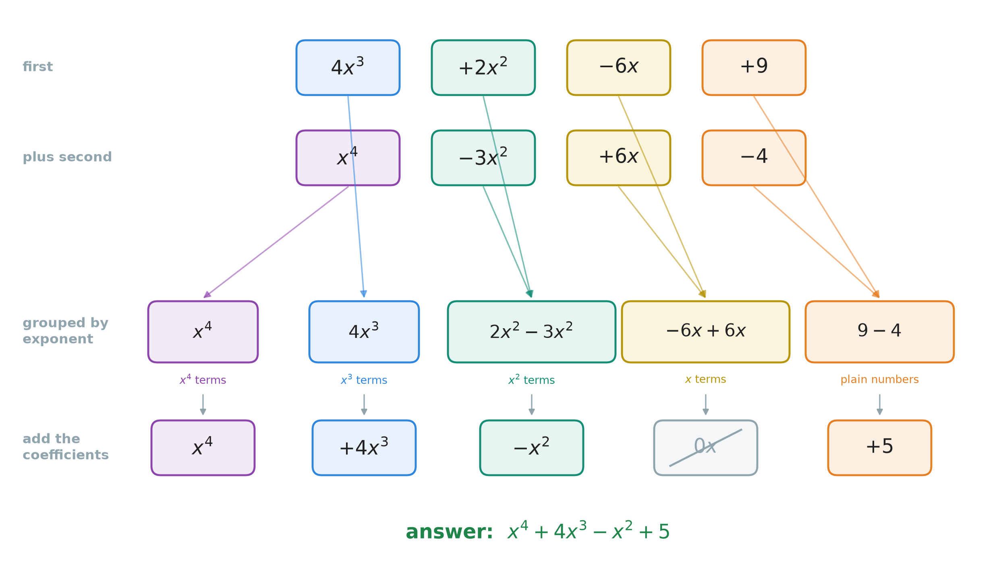
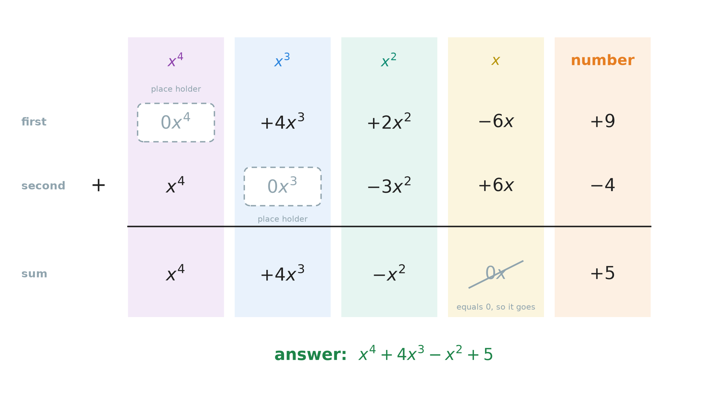
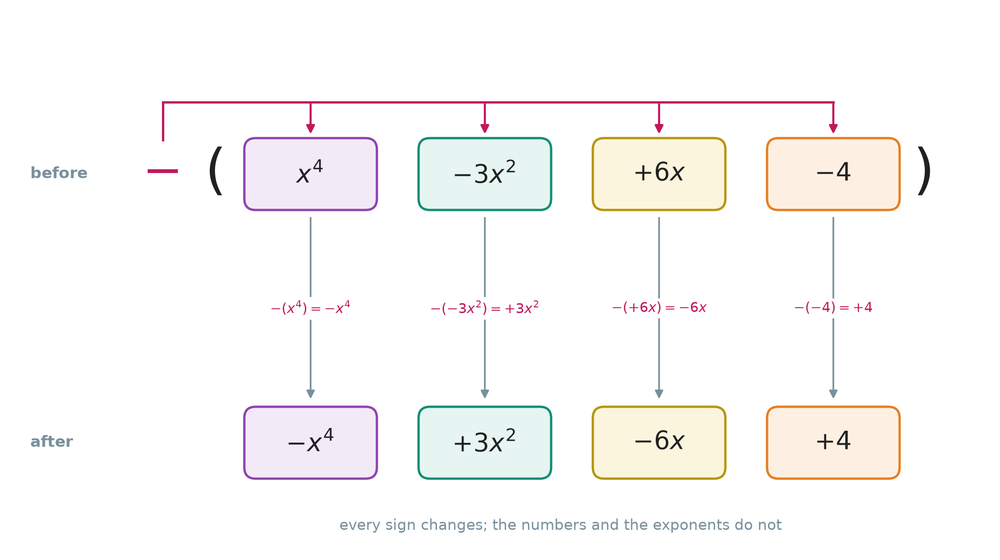

# 28. Adding and subtracting polynomials

**What this chapter teaches**
How to add two polynomials and how to subtract one polynomial from another. There are two ways
to set the work out: in one line (the **horizontal method**) or in columns (the **vertical
method**). Both rest on one idea you already have: **collecting like terms**.

**Before you start**
You need the polynomial, its degree and its standard form from
[Chapter 27](./../27_Introduction_To_Polynomials/27_Introduction_To_Polynomials.md).
You need like terms from
[Chapter 19, section 4](./../19_The_Number_Properties_Of_Algebra/19_The_Number_Properties_Of_Algebra.md#4-collecting-like-terms),
and a negative multiplier in front of a bracket from
[Chapter 19, section 3.5](./../19_The_Number_Properties_Of_Algebra/19_The_Number_Properties_Of_Algebra.md#35-a-negative-multiplier-keeps-its-sign-all-the-way).
You need the sign rules of
[Chapter 9, section 4](./../9_Negative_Numbers/9_Negative_Numbers.md#4-adding-and-subtracting),
and column work from
[Chapter 5, section 3](./../5_Adding_And_Subtracting_Large_Numbers/5_Adding_And_Subtracting_Large_Numbers.md#3-setting-the-numbers-out-in-columns).

---

## Table of contents

1. [What adding polynomials really is](#1-what-adding-polynomials-really-is)
2. [Adding in one line: the horizontal method](#2-adding-in-one-line-the-horizontal-method)
3. [Adding in columns: the vertical method](#3-adding-in-columns-the-vertical-method)
4. [Subtracting a polynomial](#4-subtracting-a-polynomial)
5. [Three polynomials in one line](#5-three-polynomials-in-one-line)
6. [The whole method, and how to check it](#6-the-whole-method-and-how-to-check-it)
7. [Glossary](#7-glossary)
8. [Check your understanding](#8-check-your-understanding)
9. [Important notes](#9-important-notes)

---

## 1. What adding polynomials really is

### 1.1 Nothing new is needed

Here are two polynomials:

$$
4x^{3} + 2x^{2} - 6x + 9 \qquad\qquad x^{4} - 3x^{2} + 6x - 4
$$

To add them means to write one long expression with all the terms of both, and then make it
as short as possible. Making it short is **collecting like terms**, from
[Chapter 19, section 4](./../19_The_Number_Properties_Of_Algebra/19_The_Number_Properties_Of_Algebra.md#4-collecting-like-terms).
That is the whole job. This chapter only shows how to organise the work so that nothing gets
lost.

### 1.2 Like terms in a polynomial

Chapter 19 said: like terms have the same letters, raised to the same powers. A polynomial in
this book has only one letter, $x$. So the test becomes very simple:

> Two terms of a polynomial are **like terms** when they have the **same exponent** of $x$.

| The pair | Like or not | Why |
| --- | --- | --- |
| $5x^{3}$ and $4x^{3}$ | like | both have exponent $3$ |
| $2x^{2}$ and $-3x^{2}$ | like | both have exponent $2$ |
| $5x^{3}$ and $4x^{2}$ | not like | exponents $3$ and $2$ |
| $-6x$ and $6x$ | like | both have exponent $1$ |
| $9$ and $-4$ | like | both have exponent $0$ |

The last row uses
[Chapter 27, section 1.3](./../27_Introduction_To_Polynomials/27_Introduction_To_Polynomials.md#13-why-8x-and--5-also-fit-the-rule):
a plain number is a term with exponent $0$, because $9 = 9x^{0}$. So all plain numbers are
like terms of each other.

An easy picture: think of $x^{3}$ as apples and $x^{2}$ as oranges. Five apples plus four
apples is nine apples. Five apples plus four oranges is not nine of anything. You keep them
apart.

### 1.3 The exponent never changes

**The idea:** when you add like terms, you add the numbers in front. The $x$ part is only
copied down.

With numbers:

$$
5x^{3} + 4x^{3} = (5 + 4)x^{3}
$$

$$
= 9x^{3}
$$

The general rule:

$$
Ax^{k} + Bx^{k} = (A + B)x^{k}
$$

$$
Ax^{k} - Bx^{k} = (A - B)x^{k}
$$

**In words:** two terms with the same exponent join into one term. Its coefficient is the sum
(or the difference) of the two coefficients. Its exponent is the same exponent as before.

* $A$, $B$ — the two coefficients.
* $k$ — the exponent that both terms share. It is a whole number.

Why is this allowed? It is the distributive property read backwards, with $x^{k}$ as the shared
factor. Chapter 19, section 4.2 gave the reason.

Check it with $x = 2$. Then $x^{3} = 8$:

$$
5 \times 8 + 4 \times 8 = 40 + 32 = 72
$$

$$
9 \times 8 = 72
$$

Both give $72$. Now try the wrong answer $9x^{6}$. With $x = 2$, $x^{6} = 64$, and
$9 \times 64 = 576$. That is not $72$.

**Warning.** You add exponents only when you **multiply** powers:
$x^{3} \times x^{3} = x^{6}$, from
[Chapter 10, section 4](./../10_Exponents/10_Exponents.md#4-rule-1-multiplying-powers-with-the-same-base).
When you **add** terms, the exponent does not move.

### Summary of section 1

* Adding polynomials is collecting like terms. There is no new rule.
* In a polynomial, like terms are terms with the same exponent of $x$.
* All plain numbers are like terms, because each has exponent $0$.
* Add or subtract the coefficients. The exponent stays the same.

---

## 2. Adding in one line: the horizontal method

### 2.1 A plus sign in front of a bracket changes nothing

We write each polynomial in brackets, so we can see where it starts and ends:

$$
(4x^{3} + 2x^{2} - 6x + 9) + (x^{4} - 3x^{2} + 6x - 4)
$$

The first step is to remove the brackets. With a **plus** sign in front, you can simply drop
them. Every term keeps its own sign.

First with numbers:

$$
10 + (4 - 3) = 10 + 1 = 11
$$

$$
10 + 4 - 3 = 14 - 3 = 11
$$

Both give $11$. The reason: a plus sign in front of a bracket means "times $+1$", and
multiplying by $1$ changes nothing
([Chapter 19, section 6.2](./../19_The_Number_Properties_Of_Algebra/19_The_Number_Properties_Of_Algebra.md#62-multiplying-by-one)).

### 2.2 The four steps

1. **Remove the brackets.** With a plus sign in front, every sign stays as it is.
2. **Group the like terms.** Put terms with the same exponent next to each other. Each term
   moves with its sign
   ([Chapter 19, section 2.4](./../19_The_Number_Properties_Of_Algebra/19_The_Number_Properties_Of_Algebra.md#24-the-safe-way-to-move-a-subtraction)).
3. **Add the coefficients** in each group.
4. **Write the answer in standard form**: largest exponent first
   ([Chapter 27, section 6.1](./../27_Introduction_To_Polynomials/27_Introduction_To_Polynomials.md#61-largest-exponent-first)).

### 2.3 A full example

Add $4x^{3} + 2x^{2} - 6x + 9$ and $x^{4} - 3x^{2} + 6x - 4$.

**Step 1 — remove the brackets.**

$$
(4x^{3} + 2x^{2} - 6x + 9) + (x^{4} - 3x^{2} + 6x - 4)
$$

$$
= 4x^{3} + 2x^{2} - 6x + 9 + x^{4} - 3x^{2} + 6x - 4
$$

**Step 2 — group the like terms**, largest exponent first.

$$
= x^{4} + 4x^{3} + (2x^{2} - 3x^{2}) + (-6x + 6x) + (9 - 4)
$$

    

**Figure 1 — Each colour is one exponent. Follow a colour down: every card goes into the box of
its own exponent, and never into another box. The $x$ box adds up to $0x$, so it disappears.**

**Step 3 — add the coefficients** in each group.

* $x^{4}$: only one term, so $x^{4}$.
* $x^{3}$: only one term, so $4x^{3}$.
* $x^{2}$: $2 - 3 = -1$, so $-1x^{2}$, which is written $-x^{2}$.
* $x$: $-6 + 6 = 0$, so $0x$.
* plain numbers: $9 - 4 = 5$.

**Step 4 — write the answer in standard form.**

$$
x^{4} + 4x^{3} - x^{2} + 5
$$

Check with $x = 2$. The first polynomial gives
$4 \times 8 + 2 \times 4 - 6 \times 2 + 9 = 32 + 8 - 12 + 9 = 37$. The second gives
$16 - 3 \times 4 + 6 \times 2 - 4 = 16 - 12 + 12 - 4 = 12$. Together that is $37 + 12 = 49$.
The answer gives $16 + 4 \times 8 - 4 + 5 = 16 + 32 - 4 + 5 = 49$. They agree.

### 2.4 A term that disappears

The $x$ terms gave $0x$. Zero times anything is $0$, so $0x = 0$. And adding $0$ changes
nothing
([Chapter 19, section 6.1](./../19_The_Number_Properties_Of_Algebra/19_The_Number_Properties_Of_Algebra.md#61-adding-zero)).
So we do not write the term at all.

That is why the answer has no $x$ term. It is not forgotten. It is really gone.

### Summary of section 2

* A plus sign in front of a bracket changes nothing. Drop the brackets.
* Group like terms, add their coefficients, and write the answer in standard form.
* A group that adds up to $0$ disappears from the answer.
* Check the answer by putting a number in for $x$.

---

## 3. Adding in columns: the vertical method

### 3.1 One column for each exponent

[Chapter 5, section 3.1](./../5_Adding_And_Subtracting_Large_Numbers/5_Adding_And_Subtracting_Large_Numbers.md#31-one-column-holds-one-kind-of-piece)
added large numbers in columns. The rule there was: one column holds one kind of piece — ones
under ones, tens under tens.

For polynomials, the kind of piece is the **exponent**. So:

> One column holds one exponent: $x^{4}$ under $x^{4}$, $x^{3}$ under $x^{3}$, and so on, with
> the plain numbers in the last column.

Write both polynomials in standard form first. Then the columns line up from left to right.

### 3.2 Fill the gaps with a place holder

The first polynomial, $4x^{3} + 2x^{2} - 6x + 9$, has no $x^{4}$ term. The second one,
$x^{4} - 3x^{2} + 6x - 4$, has no $x^{3}$ term. In the columns, those places would be empty.
An empty place makes it easy to slide a term into the wrong column.

So we fill each gap with a term whose coefficient is $0$: $0x^{4}$ or $0x^{3}$. This is a
**place holder**, the same idea as the zero in $0.03$ in
[Chapter 2, section 3.3](./../2_Decimals/2_Decimals.md#33-zero-holds-an-empty-place).

It is safe, because $0x^{3} = 0$, and adding $0$ changes nothing. The polynomial stays exactly
the same. It only becomes easier to line up.

### 3.3 A full example

The same two polynomials as in section 2.3:

    

**Figure 2 — Each column holds one exponent. The dashed grey boxes are the place holders. Add
down each column on its own. The $x$ column gives $0x$, which disappears.**

Add down each column:

* $x^{4}$ column: $0 + 1 = 1$, so $x^{4}$.
* $x^{3}$ column: $4 + 0 = 4$, so $4x^{3}$.
* $x^{2}$ column: $2 + (-3) = -1$, so $-x^{2}$.
* $x$ column: $-6 + 6 = 0$, so $0x$, which disappears.
* number column: $9 + (-4) = 5$.

$$
x^{4} + 4x^{3} - x^{2} + 5
$$

It is the same answer as section 2.3, as it must be.

### 3.4 No carrying between columns

With numbers, a full column carries into the next one: ten ones become one ten
([Chapter 5, section 4.3](./../5_Adding_And_Subtracting_Large_Numbers/5_Adding_And_Subtracting_Large_Numbers.md#43-when-a-column-is-too-full-carrying)).
With polynomials, this **never** happens.

Look at $7x^{2} + 5x^{2} = 12x^{2}$. The answer stays in the $x^{2}$ column. It does not turn
into $1x^{3} + 2x^{2}$.

Why not? Ten ones make one ten because each place is worth $10$ times the place to its right.
But $x$ is not $10$. With $x = 2$, ten lots of $x^{2}$ is $10 \times 4 = 40$, and one $x^{3}$
is only $8$. So there is no exchange rate between the columns. Each column is finished on its
own.

### 3.5 Which method should you use?

Both methods give the same answer. They are two ways of writing the same steps.

* The **horizontal method** is quick for short polynomials.
* The **vertical method** is safer for long polynomials with gaps, because the columns and the
  place holders stop terms from getting mixed up.

### Summary of section 3

* Put both polynomials in standard form, one under the other.
* Each column holds one exponent. Fill gaps with a place holder such as $0x^{3}$.
* Add down each column on its own.
* There is never any carrying between columns, because $x$ is not $10$.

---

## 4. Subtracting a polynomial

### 4.1 The order matters

Subtraction is not commutative: $8 - 3$ is not $3 - 8$
([Chapter 19, section 2.3](./../19_The_Number_Properties_Of_Algebra/19_The_Number_Properties_Of_Algebra.md#23-subtraction-and-division-still-refuse)).
So you must know which polynomial comes first.

"Subtract $B$ from $A$" means $A - B$. The polynomial after the word *from* comes **first**.
This is the same backwards reading as "less than" in
[Chapter 22, section 3.3](./../22_Word_Problems/22_Word_Problems.md#33-less-than-is-read-backwards).

So "subtract $x^{4} - 3x^{2} + 6x - 4$ from $4x^{3} + 2x^{2} - 6x + 9$" is:

$$
(4x^{3} + 2x^{2} - 6x + 9) - (x^{4} - 3x^{2} + 6x - 4)
$$

### 4.2 A minus sign in front of a bracket reaches every term

**The idea:** when you take away a whole bracket, you take away **every** term inside it. So
every sign inside the bracket changes.

First with numbers:

$$
10 - (6 - 2) = 10 - 4 = 6
$$

$$
10 - 6 + 2 = 4 + 2 = 6
$$

Both give $6$. Inside the bracket the $2$ had a minus sign. After the bracket is gone, it has a
plus sign. If you forget to change it, you get $10 - 6 - 2 = 2$, which is wrong.

Why does every sign change? A minus sign in front of something means "times $-1$", as
[Chapter 20, section 6.3](./../20_Solving_Equations/20_Solving_Equations.md#63-the-same-move-done-with-the-properties)
showed. So $-(6 - 2)$ is $-1 \times (6 - 2)$. Now the multiplier $-1$ goes to every term
inside, exactly like the $-3$ in
[Chapter 19, section 3.5](./../19_The_Number_Properties_Of_Algebra/19_The_Number_Properties_Of_Algebra.md#35-a-negative-multiplier-keeps-its-sign-all-the-way).

The general rule:

$$
-(a + b - c) = -a - b + c
$$

**In words:** remove a bracket with a minus sign in front, and every term inside gets the
opposite sign. Plus becomes minus. Minus becomes plus.

* $a$, $b$, $c$ — the terms inside the bracket.
* The minus sign outside — "take all of this away", or "times $-1$".

Here is the bracket from section 4.1:

    

**Figure 3 — The magenta line shows the minus sign reaching every card in the bracket, not only
the first one. Below, every sign has changed. The numbers and the exponents have not.**

The two middle results use
[Chapter 9, section 4.4](./../9_Negative_Numbers/9_Negative_Numbers.md#44-subtracting-a-negative-number-is-the-same-as-adding):
taking away a negative is the same as adding, so $-(-3x^{2}) = +3x^{2}$ and $-(-4) = +4$.

A useful habit: before you remove the bracket, put your finger on the minus sign outside and
touch each term inside, one by one. Change each sign as you touch it.

### 4.3 Subtracting is adding the opposite

The bracket after the change, $-x^{4} + 3x^{2} - 6x + 4$, has a name. It is the **opposite**
of $x^{4} - 3x^{2} + 6x - 4$. The word is the one from
[Chapter 9, section 2.2](./../9_Negative_Numbers/9_Negative_Numbers.md#22-every-number-has-an-opposite):
a polynomial and its opposite add up to $0$, because every term meets its own opposite.

[Chapter 9, section 4.3](./../9_Negative_Numbers/9_Negative_Numbers.md#43-adding-a-negative-number-is-the-same-as-subtracting)
said that subtracting a number is adding its opposite. The same is true for polynomials:

$$
A - B = A + (-B)
$$

* $A$ — the first polynomial.
* $B$ — the polynomial you take away.
* $-B$ — the opposite of $B$: every sign changed.

So subtraction becomes addition. Change every sign of the second polynomial, then **add**,
exactly as in sections 2 and 3.

### 4.4 A full example

Subtract $x^{4} - 3x^{2} + 6x - 4$ from $4x^{3} + 2x^{2} - 6x + 9$.

**Step 1 — write it in the right order.**

$$
(4x^{3} + 2x^{2} - 6x + 9) - (x^{4} - 3x^{2} + 6x - 4)
$$

**Step 2 — remove the brackets.** The first bracket has no minus in front, so its signs stay.
The second bracket has a minus in front, so every sign inside changes (Figure 3).

$$
= 4x^{3} + 2x^{2} - 6x + 9 - x^{4} + 3x^{2} - 6x + 4
$$

**Step 3 — group the like terms**, largest exponent first.

$$
= -x^{4} + 4x^{3} + (2x^{2} + 3x^{2}) + (-6x - 6x) + (9 + 4)
$$

**Step 4 — add the coefficients.**

* $x^{4}$: $-x^{4}$.
* $x^{3}$: $4x^{3}$.
* $x^{2}$: $2 + 3 = 5$, so $5x^{2}$.
* $x$: $-6 - 6 = -12$, so $-12x$.
* plain numbers: $9 + 4 = 13$.

$$
-x^{4} + 4x^{3} + 5x^{2} - 12x + 13
$$

Check with $x = 2$. Section 2.3 found that the first polynomial gives $37$ and the second
gives $12$. So the difference must be $37 - 12 = 25$. The answer gives:

$$
-16 + 4 \times 8 + 5 \times 4 - 12 \times 2 + 13
$$

$$
= -16 + 32 + 20 - 24 + 13
$$

$$
= 25
$$

They agree.

### 4.5 Subtracting in columns

The vertical method works for subtraction too. Do not subtract in the columns directly — that
is where signs get lost. Instead use section 4.3: write the **opposite** of the second
polynomial in the second row, and then **add** the columns.

| | $x^{4}$ | $x^{3}$ | $x^{2}$ | $x$ | number |
| --- | --- | --- | --- | --- | --- |
| first | $0x^{4}$ | $+4x^{3}$ | $+2x^{2}$ | $-6x$ | $+9$ |
| opposite of second | $-x^{4}$ | $+0x^{3}$ | $+3x^{2}$ | $-6x$ | $+4$ |
| sum | $-x^{4}$ | $+4x^{3}$ | $+5x^{2}$ | $-12x$ | $+13$ |

The answer is the same as in section 4.4: $-x^{4} + 4x^{3} + 5x^{2} - 12x + 13$.

### Summary of section 4

* "Subtract $B$ from $A$" means $A - B$. The order matters.
* A minus sign in front of a bracket changes the sign of **every** term inside.
* Subtracting a polynomial is adding its opposite: $A - B = A + (-B)$.
* After the signs are changed, the work is ordinary addition.

---

## 5. Three polynomials in one line

The same steps work for any number of polynomials. Only one thing needs care: **which**
brackets have a minus sign in front.

Simplify:

$$
(4x^{3} - x^{2} + 6) + (2x^{3} + 5x - 3) - (3x^{3} - 4x^{2} + 2x - 8)
$$

**Step 1 — remove the brackets.** The first two brackets have a plus (or nothing) in front, so
their signs stay. Only the third bracket has a minus in front, so only its signs change.

$$
= 4x^{3} - x^{2} + 6 + 2x^{3} + 5x - 3 - 3x^{3} + 4x^{2} - 2x + 8
$$

**Step 2 — group and add the coefficients.**

* $x^{3}$: $4 + 2 - 3 = 3$, so $3x^{3}$.
* $x^{2}$: $-1 + 4 = 3$, so $3x^{2}$.
* $x$: $5 - 2 = 3$, so $3x$.
* plain numbers: $6 - 3 + 8 = 11$.

$$
3x^{3} + 3x^{2} + 3x + 11
$$

Check with $x = 1$. The three brackets give $4 - 1 + 6 = 9$, then $2 + 5 - 3 = 4$, then
$3 - 4 + 2 - 8 = -7$. So the whole line is $9 + 4 - (-7) = 9 + 4 + 7 = 20$. The answer gives
$3 + 3 + 3 + 11 = 20$. They agree.

**Warning.** A minus sign in front of one bracket changes only **that** bracket. Do not change
the signs of the other brackets too.

### Summary of section 5

* Look at the sign in front of each bracket, one bracket at a time.
* Plus in front: signs stay. Minus in front: every sign inside changes.
* Then group the like terms and add, as before.

---

## 6. The whole method, and how to check it

### 6.1 The method in one list

1. **Write the problem with brackets**, in the right order (section 4.1).
2. **Remove the brackets.** Plus in front: signs stay. Minus in front: every sign changes.
3. **Group the like terms** — terms with the same exponent.
4. **Add the coefficients** in each group. Never change an exponent.
5. **Drop any term with coefficient $0$.**
6. **Write the answer in standard form.**

In the vertical method, steps 3 and 4 are the columns, and step 2 is writing the opposite in
the second row.

### 6.2 Check with a number

The answer and the problem are **equivalent expressions**: they must agree for every value of
$x$. So put one number into both, as in the substitution test of
[Chapter 19, section 1.3](./../19_The_Number_Properties_Of_Algebra/19_The_Number_Properties_Of_Algebra.md#13-two-expressions-that-are-really-one).
If they disagree, there is a mistake.

Choose the number with care:

* $x = 0$ checks only the plain numbers. Every other term becomes $0$.
* $x = 1$ is easy, but it cannot catch a wrong exponent. With $x = 1$, every power of $x$ is
  $1$, so $9x^{3}$ and $9x^{6}$ both give $9$.
* $x = 2$ is a good choice. Each power of $2$ is different ($2$, $4$, $8$, $16$), so a wrong
  exponent shows up.

### Summary of section 6

* Brackets, signs, group, add, drop the zeros, standard form.
* Check by putting the same number into the problem and into the answer.
* Use $x = 2$ when you want to catch a wrong exponent. $x = 0$ and $x = 1$ hide mistakes.

---

## 7. Glossary

* **Horizontal method** — adding or subtracting polynomials in one line: remove the brackets,
  group the like terms, add the coefficients.
* **Vertical method** (column method) — adding polynomials written one under the other, with
  one column for each exponent.
* **Opposite of a polynomial** — the same polynomial with the sign of every term changed. A
  polynomial plus its opposite is $0$.

**Note.** Every other term in this chapter was defined earlier. **Polynomial**, **degree** and
**standard form** are in
[Chapter 27](./../27_Introduction_To_Polynomials/27_Introduction_To_Polynomials.md#8-glossary);
**like terms**, **collecting like terms** and **equivalent expressions** are in
[Chapter 19](./../19_The_Number_Properties_Of_Algebra/19_The_Number_Properties_Of_Algebra.md#9-glossary);
the **opposite** of a number is in
[Chapter 9](./../9_Negative_Numbers/9_Negative_Numbers.md#8-glossary);
the **place holder** is in
[Chapter 2, section 3.3](./../2_Decimals/2_Decimals.md#33-zero-holds-an-empty-place).

---

## 8. Check your understanding

**Question 1.** Simplify $(3x^{2} + 5x + 2) + (4x^{2} - 2x + 7)$.

Answer

There is a plus sign in front of the second bracket, so the brackets can go:

$$
3x^{2} + 5x + 2 + 4x^{2} - 2x + 7
$$

Group and add:

* $x^{2}$: $3 + 4 = 7$, so $7x^{2}$.
* $x$: $5 - 2 = 3$, so $3x$.
* plain numbers: $2 + 7 = 9$.

**Answer: $7x^{2} + 3x + 9$.**

Check with $x = 1$: the problem gives $10 + 9 = 19$, and the answer gives $7 + 3 + 9 = 19$.

**Question 2.** Add $5x^{4} - 2x^{2} + 8$ and $3x^{3} + 4x^{2} - 5x - 3$ in columns.

Answer

The first polynomial has no $x^{3}$ and no $x$ term. The second has no $x^{4}$ term. Fill the
gaps with place holders:

| | $x^{4}$ | $x^{3}$ | $x^{2}$ | $x$ | number |
| --- | --- | --- | --- | --- | --- |
| first | $5x^{4}$ | $+0x^{3}$ | $-2x^{2}$ | $+0x$ | $+8$ |
| second | $0x^{4}$ | $+3x^{3}$ | $+4x^{2}$ | $-5x$ | $-3$ |
| sum | $5x^{4}$ | $+3x^{3}$ | $+2x^{2}$ | $-5x$ | $+5$ |

**Answer: $5x^{4} + 3x^{3} + 2x^{2} - 5x + 5$.**

Check with $x = 1$: the problem gives $11 + (-1) = 10$, and the answer gives
$5 + 3 + 2 - 5 + 5 = 10$.

**Question 3.** Simplify $(6x^{3} + 2x^{2} - x + 4) - (2x^{3} - 5x^{2} + 3x - 1)$.

Answer

The minus sign changes every sign in the second bracket:

$$
-(2x^{3} - 5x^{2} + 3x - 1) = -2x^{3} + 5x^{2} - 3x + 1
$$

So the line becomes:

$$
6x^{3} + 2x^{2} - x + 4 - 2x^{3} + 5x^{2} - 3x + 1
$$

Group and add:

* $x^{3}$: $6 - 2 = 4$, so $4x^{3}$.
* $x^{2}$: $2 + 5 = 7$, so $7x^{2}$.
* $x$: $-1 - 3 = -4$, so $-4x$.
* plain numbers: $4 + 1 = 5$.

**Answer: $4x^{3} + 7x^{2} - 4x + 5$.**

Check with $x = 2$: the first bracket is $48 + 8 - 2 + 4 = 58$, the second is
$16 - 20 + 6 - 1 = 1$, and $58 - 1 = 57$. The answer gives $32 + 28 - 8 + 5 = 57$.

**Question 4.** A student writes:

$$
(2x^{2} - 6x) - (3x^{2} - 4) = 2x^{2} - 6x - 3x^{2} - 4
$$

Find the mistake and give the right answer.

Answer

The minus sign changed only the first term in the bracket. It must change **every** term. The
$-4$ must become $+4$:

$$
2x^{2} - 6x - 3x^{2} + 4
$$

Group and add: $2 - 3 = -1$, so $-x^{2}$.

**Answer: $-x^{2} - 6x + 4$.**

Check with $x = 1$: the problem gives $(2 - 6) - (3 - 4) = -4 - (-1) = -3$. The right answer
gives $-1 - 6 + 4 = -3$. The student's line gives $2 - 6 - 3 - 4 = -11$, so it is wrong.

**Question 5.** A student writes $5x^{3} + 4x^{3} = 9x^{6}$. What is wrong?

Answer

The student added the exponents. When you add like terms, you add only the coefficients. The
exponent is copied down:

$$
5x^{3} + 4x^{3} = (5 + 4)x^{3} = 9x^{3}
$$

Exponents are added only when powers are **multiplied**: $x^{3} \times x^{3} = x^{6}$.

With $x = 2$: $40 + 32 = 72$, and $9 \times 8 = 72$, but $9 \times 64 = 576$.

**Question 6.** Can $4x^{3} + 2x^{2}$ be made shorter?

Answer

No. The exponents are $3$ and $2$, so these are not like terms. There is nothing to collect.
$6x^{5}$ and $6x^{3}$ are both wrong.

**Answer: no. $4x^{3} + 2x^{2}$ is already finished.**

**Question 7.** Subtract $x^{2} - 4x$ from $x^{2} + 4x$. What is the degree of the answer?

Answer

"From $x^{2} + 4x$" means $x^{2} + 4x$ comes first:

$$
(x^{2} + 4x) - (x^{2} - 4x) = x^{2} + 4x - x^{2} + 4x
$$

* $x^{2}$: $1 - 1 = 0$, so the term disappears.
* $x$: $4 + 4 = 8$, so $8x$.

**Answer: $8x$. Its degree is $1$.**

Both polynomials had degree $2$, but the answer has degree $1$, because the $x^{2}$ terms
cancelled. Subtracting can lower the degree.

**Question 8.** Simplify $(3x^{2} + x) - (5x^{2} - 2x + 1)$.

Answer

Change every sign in the second bracket:

$$
3x^{2} + x - 5x^{2} + 2x - 1
$$

* $x^{2}$: $3 - 5 = -2$, so $-2x^{2}$.
* $x$: $1 + 2 = 3$, so $3x$.
* plain numbers: $-1$.

**Answer: $-2x^{2} + 3x - 1$.**

Check with $x = 2$: the first bracket is $12 + 2 = 14$, the second is $20 - 4 + 1 = 17$, and
$14 - 17 = -3$. The answer gives $-8 + 6 - 1 = -3$.

**Question 9.** You add two polynomials and check your answer with $x = 1$. The check agrees.
Can the answer still be wrong?

Answer

Yes. With $x = 1$, every power of $x$ is $1$. So a wrong exponent cannot be seen: $9x^{3}$ and
$9x^{6}$ both give $9$. Check again with $x = 2$, where the powers are all different.

---

## 9. Important notes

**The mistakes people actually make.**

* **Adding the exponents.** $5x^{3} + 4x^{3}$ is $9x^{3}$, not $9x^{6}$. The exponent changes
  only in multiplication.
* **Joining unlike terms.** $4x^{3} + 2x^{2}$ cannot be shortened. Different exponents are
  different kinds of piece.
* **Changing only the first sign.** In $-(3x^{2} - 4)$ the minus sign reaches **every** term,
  so the answer is $-3x^{2} + 4$.
* **Changing the signs of the wrong bracket.** Only a bracket with a minus sign in front
  changes. The first polynomial keeps its signs.
* **Subtracting in the wrong order.** "Subtract $B$ from $A$" is $A - B$. The other order gives
  the opposite answer.
* **Columns out of line.** A missing power leaves a gap, and the next term slides into the
  wrong column. Fill every gap with a place holder such as $0x^{3}$.
* **Carrying between columns.** $12x^{2}$ stays $12x^{2}$. Columns of a polynomial never
  exchange, because $x$ is not $10$.

**Three ideas to keep.**

* **Only like terms join, and only their coefficients change.** That one rule is the whole of
  adding polynomials.
* **Subtracting is adding the opposite.** Change every sign of the second polynomial, then add.
* **Check with $x = 2$.** It catches a lost sign and a wrong exponent. $x = 1$ cannot catch a
  wrong exponent.

**How this chapter connects to the rest of the book.**
Nothing here is a new rule. Collecting like terms is
[Chapter 19](./../19_The_Number_Properties_Of_Algebra/19_The_Number_Properties_Of_Algebra.md);
the sign changes are
[Chapter 9](./../9_Negative_Numbers/9_Negative_Numbers.md)'s;
the columns are
[Chapter 5](./../5_Adding_And_Subtracting_Large_Numbers/5_Adding_And_Subtracting_Large_Numbers.md)'s,
without the carrying; and the answer is written in
[Chapter 27](./../27_Introduction_To_Polynomials/27_Introduction_To_Polynomials.md)'s
standard form. The new skill is keeping many terms in order at once.

---

- [Back to the book](./../README.md)
- Previous: [27 Introduction to polynomials](./../27_Introduction_To_Polynomials/27_Introduction_To_Polynomials.md)
- Next: not written yet.
