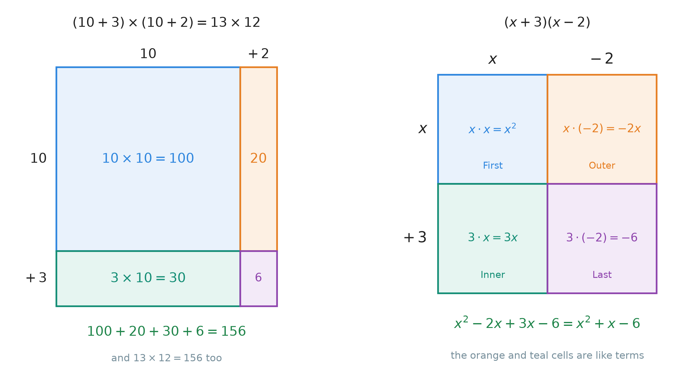
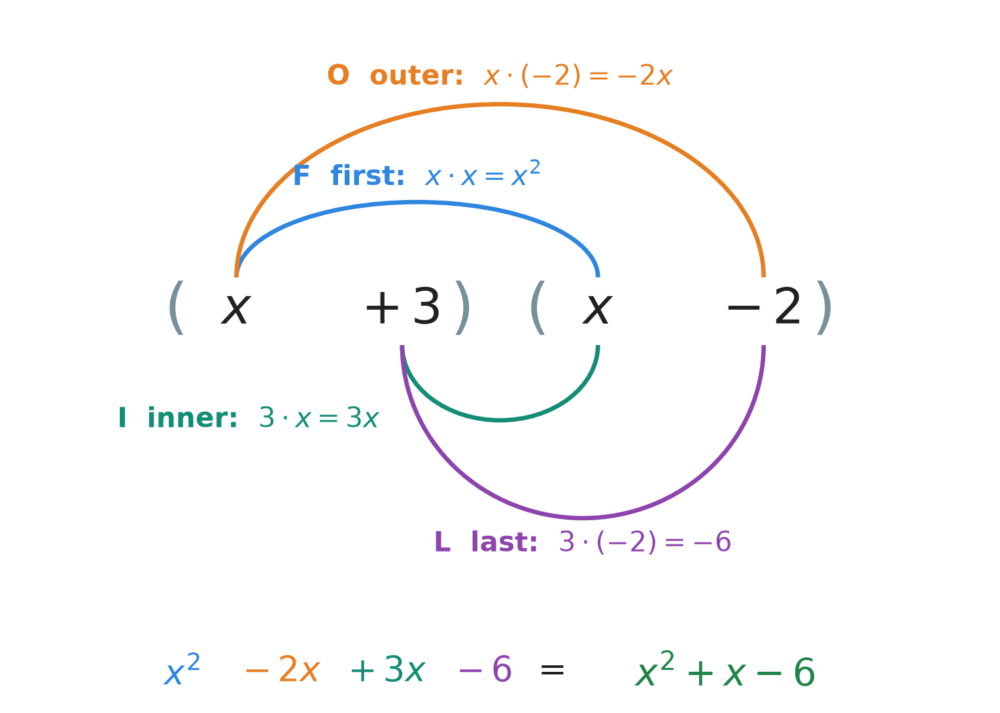
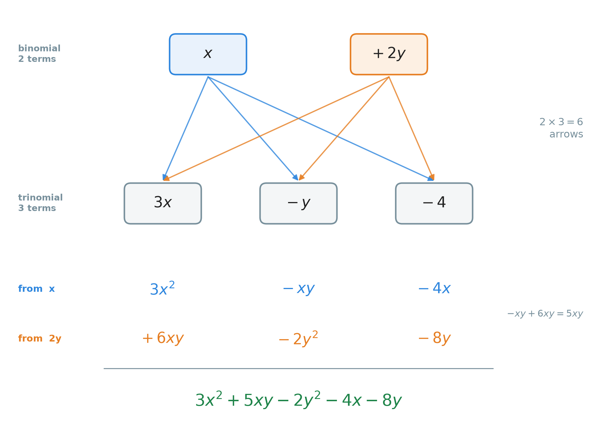

# 29. Multiplying polynomials: the FOIL method

**What this chapter teaches**
How to multiply two polynomials. The main case is two binomials, such as $(x + 3)(x - 2)$, and
the **FOIL method** that keeps the four products in order. Then the same idea for longer
polynomials: **every term of the first meets every term of the second**.

**Before you start**
You need the distributive property from
[Chapter 6](./../6_The_Distributive_Property/6_The_Distributive_Property.md), and a multiplier with
a letter from
[Chapter 19, section 3](./../19_The_Number_Properties_Of_Algebra/19_The_Number_Properties_Of_Algebra.md#3-handing-the-multiplier-out).
You need the product rule $x^{a} \cdot x^{b} = x^{a + b}$ from
[Chapter 10, section 4](./../10_Exponents/10_Exponents.md#4-rule-1-multiplying-powers-with-the-same-base),
the sign rules of
[Chapter 9, section 5](./../9_Negative_Numbers/9_Negative_Numbers.md#5-multiplying),
and like terms from
[Chapter 19, section 4](./../19_The_Number_Properties_Of_Algebra/19_The_Number_Properties_Of_Algebra.md#4-collecting-like-terms).
The names monomial, binomial and trinomial are in
[Chapter 27, section 5.1](./../27_Introduction_To_Polynomials/27_Introduction_To_Polynomials.md#51-by-the-number-of-terms).
This chapter finishes the work started in
[Chapter 25, section 3.3](./../25_Simplifying_Expressions/25_Simplifying_Expressions.md#33-the-rule-for-the-square-of-a-sum).

---

## Table of contents

1. [Multiplying single terms](#1-multiplying-single-terms)
2. [Two brackets: distributing twice](#2-two-brackets-distributing-twice)
3. [The FOIL method](#3-the-foil-method)
4. [Every term carries its own sign](#4-every-term-carries-its-own-sign)
5. [More than two terms](#5-more-than-two-terms)
6. [The whole method, and how to check it](#6-the-whole-method-and-how-to-check-it)
7. [Glossary](#7-glossary)
8. [Check your understanding](#8-check-your-understanding)
9. [Important notes](#9-important-notes)

---

## 1. Multiplying single terms

Every multiplication in this chapter is built from small ones: one term times one term. So we
start there. Nothing in this section is new. It collects three things you already know.

### 1.1 A number times a term

$$
2x \times 3 = 6x
$$

$2x$ means $2 \times x$. So the line is $2 \times x \times 3$. In a chain of multiplications you
may change the order and the grouping
([Chapter 6, sections 1.3 and 1.4](./../6_The_Distributive_Property/6_The_Distributive_Property.md#13-the-order-of-the-two-factors-does-not-matter)).
So put the numbers together:

$$
2 \times 3 \times x = 6x
$$

An easy picture: $2$ apples, taken $3$ times, is $6$ apples.

### 1.2 Two terms that both have $x$

$$
2x \times 3x = 6x^{2}
$$

Again, change the order so the numbers stand together and the letters stand together:

$$
2x \times 3x = 2 \times 3 \times x \times x
$$

$$
= 6 \times x^{2}
$$

$$
= 6x^{2}
$$

* The numbers multiply: $2 \times 3 = 6$.
* The letters multiply: $x \times x = x^{2}$, by the product rule of
  [Chapter 10, section 4](./../10_Exponents/10_Exponents.md#4-rule-1-multiplying-powers-with-the-same-base).

The same works with bigger exponents. Remember that $x$ is $x^{1}$
([Chapter 10, section 2.4](./../10_Exponents/10_Exponents.md#24-the-exponent-one)):

$$
x^{2} \times (-2x) = -2 \times x^{2} \times x^{1} = -2x^{3}
$$

The exponents add: $2 + 1 = 3$.

> **Warning.** $x \times x$ is $x^{2}$, not $2x$. $2x$ means $x + x$. With $x = 5$:
> $x \times x = 25$, but $2x = 10$.

### 1.3 One term times a bracket

This is the distributive property with a letter in the multiplier. It is fully explained in
[Chapter 19, section 3.4](./../19_The_Number_Properties_Of_Algebra/19_The_Number_Properties_Of_Algebra.md#34-the-multiplier-can-carry-a-letter-too).
A short reminder:

$$
2x(x - 4) = 2x \cdot x - 2x \cdot 4 = 2x^{2} - 8x
$$

The term outside meets **every** term inside. Keep this sentence in mind. The whole chapter is
this sentence, used again and again.

### Summary of section 1

* Numbers multiply with numbers, letters with letters.
* $x \times x = x^{2}$, and $x^{2} \times x = x^{3}$: the exponents add.
* A term outside a bracket multiplies every term inside.

---

## 2. Two brackets: distributing twice

### 2.1 First with numbers

**The idea:** when both factors are sums, every piece of the first must multiply every piece of
the second.

Take $13 \times 12$. Write each number as a sum: $13 = 10 + 3$ and $12 = 10 + 2$. Now draw a
rectangle $13$ tall and $12$ wide, and cut each side into its two pieces. This is the rectangle of
[Chapter 6, section 3.2](./../6_The_Distributive_Property/6_The_Distributive_Property.md#32-one-rectangle-cut-in-two),
but now it is cut in **both** directions.

    

**Figure 1 — Left: the rectangle falls into four pieces, and together they are the whole
$13 \times 12 = 156$. Right: the same four boxes for $(x + 3)(x - 2)$. Each colour is one
product. The orange and the teal boxes hold like terms.**

The four pieces on the left:

$$
10 \times 10 = 100
$$

$$
10 \times 2 = 20
$$

$$
3 \times 10 = 30
$$

$$
3 \times 2 = 6
$$

Add them:

$$
100 + 20 + 30 + 6 = 156
$$

And $13 \times 12 = 156$. They agree. Two pieces times two pieces gives **four** pieces. If you
forget one, the answer is wrong.

### 2.2 The same steps with letters

Multiply $(x + 3)(x - 2)$.

**Step 1 — think of the second bracket as one number.** Give it to each term of the first
bracket. This is the distributive property with the multiplier on the right
([Chapter 6, section 4.3](./../6_The_Distributive_Property/6_The_Distributive_Property.md#43-the-multiplier-can-stand-on-the-right)):

$$
(x + 3)(x - 2) = x(x - 2) + 3(x - 2)
$$

**Step 2 — open each bracket** (section 1.3):

$$
x(x - 2) = x^{2} - 2x
$$

$$
3(x - 2) = 3x - 6
$$

**Step 3 — write all four terms in one line:**

$$
x^{2} - 2x + 3x - 6
$$

**Step 4 — collect like terms.** $-2x$ and $3x$ both have $x$ with exponent $1$:

$$
-2x + 3x = 1x = x
$$

So:

$$
(x + 3)(x - 2) = x^{2} + x - 6
$$

We used the distributive property **twice**: once to split the first bracket, and once inside
each new bracket. Chapter 25, section 3.3 did exactly these steps for $(a + b)(a + b)$.

**Check with $x = 3$.** The problem gives $(3 + 3)(3 - 2) = 6 \times 1 = 6$. The answer gives
$9 + 3 - 6 = 6$. They agree.

> **Note.** Why not $x = 2$, the number that
> [Chapter 28, section 6.2](./../28_Adding_And_Subtracting_Polynomials/28_Adding_And_Subtracting_Polynomials.md#62-check-with-a-number)
> recommends? With $x = 2$ the bracket $x - 2$ is $0$, so the problem gives $0$. Many wrong
> answers also give $0$ at $x = 2$, for example $x^{2} - 4$. Choose a number that makes no
> bracket $0$.

### 2.3 Why there are four products

Every term of the first bracket meets every term of the second. The first bracket has $2$
terms, the second has $2$ terms, so there are $2 \times 2 = 4$ products. After that, some of
them may join as like terms. Here, four products became three terms.

This is also why the right-hand grid in Figure 1 is useful. It has one box for each pair of
terms, so you cannot forget one. With $-2$ as a side, it is no longer a real picture of an
area. It is only a table that keeps the four products in order.

### Summary of section 2

* $(a + b)(c + d)$: give the whole second bracket to $a$, then to $b$.
* Two terms times two terms gives four products.
* After the four products, collect like terms.
* Check with a number, but not one that makes a bracket $0$.

---

## 3. The FOIL method

### 3.1 Four products, always in the same order

The four products are always the same four pairs. The **FOIL method** gives them a fixed order,
so you do them the same way every time and never skip one. FOIL is a word made from first
letters (an *acronym*):

* **F — First.** The first term of each bracket.
* **O — Outer.** The two terms on the outside: the first of the first bracket, the last of the
  second.
* **I — Inner.** The two terms on the inside: the last of the first bracket, the first of the
  second.
* **L — Last.** The last term of each bracket.

    

**Figure 2 — Each arc joins two terms that multiply. The arcs above both start at the first
$x$. The arcs below both start at $+3$. Four arcs, four products. The colours match Figure 1.**

Look at Figures 1 and 2 together. They show the same four products. F and O are what the first
term $x$ does (section 2.2, $x(x - 2)$). I and L are what the second term $+3$ does
($3(x - 2)$). FOIL is not a new rule. It is the distributive property done twice, in a fixed
order.

### 3.2 The formula

First with numbers, from section 2.1: $(10 + 3)(10 + 2)$.

* First: $10 \times 10 = 100$
* Outer: $10 \times 2 = 20$
* Inner: $3 \times 10 = 30$
* Last: $3 \times 2 = 6$

$$
100 + 20 + 30 + 6 = 156
$$

Now the same with letters:

$$
(a + b)(c + d) = \underbrace{ac}_{\text{First}} + \underbrace{ad}_{\text{Outer}} + \underbrace{bc}_{\text{Inner}} + \underbrace{bd}_{\text{Last}}
$$

**In words:** multiply the first terms, then the outer terms, then the inner terms, then the
last terms, and add the four products.

* $a$, $b$ — the two terms of the first bracket.
* $c$, $d$ — the two terms of the second bracket.
* The curly line under each product, $\underbrace{\ }$, is only a label. It names the product.
  It does not change the maths.

### 3.3 A full example

Multiply $(x + 3)(x - 2)$ with FOIL.

| Step | Which terms | Product |
| --- | --- | --- |
| **F** First | $x$ and $x$ | $x \cdot x = x^{2}$ |
| **O** Outer | $x$ and $-2$ | $x \cdot (-2) = -2x$ |
| **I** Inner | $3$ and $x$ | $3 \cdot x = 3x$ |
| **L** Last | $3$ and $-2$ | $3 \cdot (-2) = -6$ |

Write the four products in one line:

$$
x^{2} - 2x + 3x - 6
$$

Collect the like terms, $-2x + 3x = x$:

$$
x^{2} + x - 6
$$

It is the same answer as in section 2.2, as it must be.

Very often the Outer and the Inner products are like terms, as here. So after FOIL, always look
at the two middle terms first.

### 3.4 What FOIL is, and what it is not

* **The order does not matter for the answer.** Addition can be done in any order, so
  $ac + ad + bc + bd$ is the same as $bd + ac + bc + ad$. FOIL fixes the order only to help
  your memory.
* **FOIL works only for two binomials.** It has exactly four letters for exactly four products.
  For longer polynomials, use the idea behind it: every term meets every term (section 5).

### Summary of section 3

* FOIL: First, Outer, Inner, Last — the four products of two binomials.
* $(a + b)(c + d) = ac + ad + bc + bd$.
* FOIL is the distributive property done twice, in a fixed order.
* After FOIL, collect like terms. Often the Outer and Inner products join.

---

## 4. Every term carries its own sign

### 4.1 Read a bracket as a list of terms

In $(x - 2)$, do not read "x, then take away 2". Read it as a **list of two terms**: $x$ and
$-2$. The minus sign belongs to the $2$. It travels with it, as in
[Chapter 19, section 2.4](./../19_The_Number_Properties_Of_Algebra/19_The_Number_Properties_Of_Algebra.md#24-the-safe-way-to-move-a-subtraction):

$$
x - 2 = x + (-2)
$$

So when FOIL says "the last term of $(x - 2)$", it means $-2$, not $2$.

Then each product follows the sign rules of
[Chapter 9, section 5](./../9_Negative_Numbers/9_Negative_Numbers.md#5-multiplying):

| Signs | Product |
| --- | --- |
| positive $\times$ positive | positive |
| positive $\times$ negative | negative |
| negative $\times$ negative | positive |

Use the method of
[Chapter 9, section 5.3](./../9_Negative_Numbers/9_Negative_Numbers.md#53-the-method-numbers-first-sign-last):
multiply the sizes first, then decide the sign. Write each product **with its sign** into one
line.

### 4.2 A full example with negative terms

Multiply $(x^{2} + 4)(-2x - 1)$.

The terms are: $x^{2}$ and $+4$ in the first bracket; $-2x$ and $-1$ in the second.

**F — First:** $x^{2}$ and $-2x$.

$$
x^{2} \cdot (-2x) = -2x^{3}
$$

**O — Outer:** $x^{2}$ and $-1$.

$$
x^{2} \cdot (-1) = -x^{2}
$$

**I — Inner:** $4$ and $-2x$.

$$
4 \cdot (-2x) = -8x
$$

**L — Last:** $4$ and $-1$.

$$
4 \cdot (-1) = -4
$$

Write the four products in one line:

$$
-2x^{3} - x^{2} - 8x - 4
$$

**Look for like terms.** The exponents are $3$, $2$, $1$ and $0$. They are all different. So
there is nothing to collect. The answer has four terms, and it is already in standard form
([Chapter 27, section 6.1](./../27_Introduction_To_Polynomials/27_Introduction_To_Polynomials.md#61-largest-exponent-first)):

$$
(x^{2} + 4)(-2x - 1) = -2x^{3} - x^{2} - 8x - 4
$$

**Check with $x = 2$.** No bracket becomes $0$. The problem gives:

$$
(4 + 4)(-4 - 1) = 8 \times (-5) = -40
$$

The answer gives:

$$
-2 \times 8 - 4 - 8 \times 2 - 4
$$

$$
= -16 - 4 - 16 - 4
$$

$$
= -40
$$

They agree.

### Summary of section 4

* A bracket is a list of terms. Each term carries the sign in front of it.
* Multiply the sizes, then decide the sign of each product.
* The Outer and Inner products do not always join. Check the exponents before you collect.

---

## 5. More than two terms

### 5.1 Every term meets every term

FOIL has four letters, so it only fits two binomials. But the idea behind it fits every case:

> Multiply **every** term of the first polynomial by **every** term of the second. Then
> collect like terms.

You can count the products before you start:

* binomial times binomial: $2 \times 2 = 4$ products;
* binomial times trinomial: $2 \times 3 = 6$ products;
* trinomial times trinomial: $3 \times 3 = 9$ products.

If your list has fewer products, one is missing.

This is the same as the written multiplication of
[Chapter 7, section 4.1](./../7_Multiplying_Large_Numbers/7_Multiplying_Large_Numbers.md#41-one-multiplication-becomes-two):
each term of the first factor makes one **partial product** (one row), and the rows are added at
the end.

### 5.2 A binomial times a trinomial

Multiply $(x + 2y)(3x - y - 4)$.

This example has two letters, $x$ and $y$. The names binomial and trinomial still count the
terms, exactly as in Chapter 27.

    

**Figure 3 — Two terms, three terms, six arrows. Each arrow is one product. The blue row is
everything $x$ makes; the orange row is everything $2y$ makes. Only $-xy$ and $+6xy$ are like
terms.**

**Step 1 — give the trinomial to $x$.**

$$
x \cdot 3x = 3x^{2}
$$

$$
x \cdot (-y) = -xy
$$

$$
x \cdot (-4) = -4x
$$

The first partial product is $3x^{2} - xy - 4x$.

**Step 2 — give the trinomial to $2y$.**

$$
2y \cdot 3x = 6xy
$$

$$
2y \cdot (-y) = -2y^{2}
$$

$$
2y \cdot (-4) = -8y
$$

The second partial product is $6xy - 2y^{2} - 8y$.

In the first line, $2y \cdot 3x = 2 \times 3 \times y \times x = 6yx$, and $yx$ is the same as
$xy$, because the order of a multiplication does not matter. We always write the letters in
alphabetical order: $6xy$.

**Step 3 — all six products in one line.**

$$
3x^{2} - xy - 4x + 6xy - 2y^{2} - 8y
$$

**Step 4 — collect like terms.** With two letters, like terms must have the same letters with
the same powers
([Chapter 19, section 4.1](./../19_The_Number_Properties_Of_Algebra/19_The_Number_Properties_Of_Algebra.md#41-which-terms-can-be-joined)).

* $3x^{2}$ — no partner.
* $-xy$ and $6xy$ — like terms: $-1 + 6 = 5$, so $5xy$.
* $-2y^{2}$ — no partner. It is not like $3x^{2}$: the letters differ.
* $-4x$ and $-8y$ — no partners. $x$ and $y$ are different letters.

$$
(x + 2y)(3x - y - 4) = 3x^{2} + 5xy - 2y^{2} - 4x - 8y
$$

With two letters there is no single standard form. A common habit, used here: the terms with
two letters multiplied together ($x^{2}$, $xy$, $y^{2}$) first, then the terms with one letter.

**Check with $x = 1$ and $y = 2$.** The problem gives:

$$
(1 + 4)(3 - 2 - 4) = 5 \times (-3) = -15
$$

The answer gives:

$$
3 + 5 \times 2 - 2 \times 4 - 4 - 8 \times 2
$$

$$
= 3 + 10 - 8 - 4 - 16
$$

$$
= -15
$$

They agree.

### 5.3 A trinomial times a trinomial

Multiply $(x^{2} + 2x - 1)(x^{2} - x + 3)$.

Nine products are a lot to keep in your head. The grid from Figure 1 helps: one row for each
term of the first polynomial, one column for each term of the second, one box for each product.

| $\times$ | $x^{2}$ | $-x$ | $+3$ |
| --- | --- | --- | --- |
| $x^{2}$ | $x^{4}$ | $-x^{3}$ | $3x^{2}$ |
| $+2x$ | $2x^{3}$ | $-2x^{2}$ | $6x$ |
| $-1$ | $-x^{2}$ | $+x$ | $-3$ |

Nine boxes, nine products. Now collect them by exponent:

* $x^{4}$: only $x^{4}$.
* $x^{3}$: $-1 + 2 = 1$, so $x^{3}$.
* $x^{2}$: $3 - 2 - 1 = 0$, so $0x^{2}$, which disappears
  ([Chapter 28, section 2.4](./../28_Adding_And_Subtracting_Polynomials/28_Adding_And_Subtracting_Polynomials.md#24-a-term-that-disappears)).
* $x$: $6 + 1 = 7$, so $7x$.
* plain numbers: $-3$.

$$
(x^{2} + 2x - 1)(x^{2} - x + 3) = x^{4} + x^{3} + 7x - 3
$$

**Check with $x = 2$.** The problem gives $(4 + 4 - 1)(4 - 2 + 3) = 7 \times 5 = 35$. The
answer gives $16 + 8 + 14 - 3 = 35$. They agree.

### Summary of section 5

* Every term of the first polynomial multiplies every term of the second.
* Count the products first: $2 \times 3 = 6$, $3 \times 3 = 9$.
* A grid with one box per product keeps long multiplications in order.
* Like terms need the same letters with the same powers. $xy$ and $yx$ are the same.

---

## 6. The whole method, and how to check it

### 6.1 The method in one list

1. **Read each bracket as a list of terms**, each with its own sign.
2. **Count the products**: terms in the first times terms in the second.
3. **Multiply every term by every term.** For two binomials, use FOIL. For longer ones, go term
   by term or use a grid. Numbers with numbers, letters with letters, exponents add.
4. **Write all the products in one line**, each with its sign.
5. **Collect like terms.** Drop any term that becomes $0$.
6. **Write the answer in standard form.**

### 6.2 Check with a number

The problem and the answer are equivalent expressions
([Chapter 19, section 1.3](./../19_The_Number_Properties_Of_Algebra/19_The_Number_Properties_Of_Algebra.md#13-two-expressions-that-are-really-one)).
So any number must give the same value in both. The advice of
[Chapter 28, section 6.2](./../28_Adding_And_Subtracting_Polynomials/28_Adding_And_Subtracting_Polynomials.md#62-check-with-a-number)
still holds: $x = 2$ is a good choice, $x = 0$ and $x = 1$ hide mistakes. One new rule for
multiplication: **do not choose a number that makes a bracket $0$** (section 2.2).

### Summary of section 6

* List the terms, count the products, multiply, write one line, collect, standard form.
* Check with a number that makes no bracket $0$.

---

## 7. Glossary

* **FOIL method** — a fixed order for the four products of two binomials: First, Outer, Inner,
  Last.
* **Grid method** — multiplying polynomials in a table with one row for each term of the first,
  one column for each term of the second, and one product in each box.

**Note.** Every other term in this chapter was defined earlier. **Monomial**, **binomial**,
**trinomial** and **standard form** are in
[Chapter 27](./../27_Introduction_To_Polynomials/27_Introduction_To_Polynomials.md#8-glossary);
**like terms** and **equivalent expressions** are in
[Chapter 19](./../19_The_Number_Properties_Of_Algebra/19_The_Number_Properties_Of_Algebra.md#9-glossary);
the **distributive property** is in
[Chapter 6](./../6_The_Distributive_Property/6_The_Distributive_Property.md#6-glossary);
**partial product** is in
[Chapter 7, section 4.1](./../7_Multiplying_Large_Numbers/7_Multiplying_Large_Numbers.md#41-one-multiplication-becomes-two);
**expand** is in
[Chapter 25, section 3.3](./../25_Simplifying_Expressions/25_Simplifying_Expressions.md#33-the-rule-for-the-square-of-a-sum).

---

## 8. Check your understanding

**Question 1.** Multiply $(x + 4)(x + 5)$.

Answer

* F: $x \cdot x = x^{2}$
* O: $x \cdot 5 = 5x$
* I: $4 \cdot x = 4x$
* L: $4 \cdot 5 = 20$

One line: $x^{2} + 5x + 4x + 20$. Collect: $5x + 4x = 9x$.

**Answer: $x^{2} + 9x + 20$.**

Check with $x = 1$: the problem gives $5 \times 6 = 30$, the answer gives $1 + 9 + 20 = 30$.

**Question 2.** Multiply $(x + 2)(x - 5)$.

Answer

The terms of the second bracket are $x$ and $-5$.

* F: $x \cdot x = x^{2}$
* O: $x \cdot (-5) = -5x$
* I: $2 \cdot x = 2x$
* L: $2 \cdot (-5) = -10$

One line: $x^{2} - 5x + 2x - 10$. Collect: $-5x + 2x = -3x$.

**Answer: $x^{2} - 3x - 10$.**

Check with $x = 1$: the problem gives $3 \times (-4) = -12$, the answer gives
$1 - 3 - 10 = -12$.

**Question 3.** Multiply $(2x - 3)(3x + 4)$.

Answer

* F: $2x \cdot 3x = 6x^{2}$
* O: $2x \cdot 4 = 8x$
* I: $-3 \cdot 3x = -9x$
* L: $-3 \cdot 4 = -12$

One line: $6x^{2} + 8x - 9x - 12$. Collect: $8x - 9x = -1x = -x$.

**Answer: $6x^{2} - x - 12$.**

Check with $x = 2$: the problem gives $1 \times 10 = 10$, the answer gives
$24 - 2 - 12 = 10$.

**Question 4.** Multiply $(x^{2} + 3)(-3x - 2)$.

Answer

* F: $x^{2} \cdot (-3x) = -3x^{3}$
* O: $x^{2} \cdot (-2) = -2x^{2}$
* I: $3 \cdot (-3x) = -9x$
* L: $3 \cdot (-2) = -6$

The exponents are $3$, $2$, $1$, $0$: all different, so nothing to collect.

**Answer: $-3x^{3} - 2x^{2} - 9x - 6$.**

Check with $x = 1$: the problem gives $4 \times (-5) = -20$, the answer gives
$-3 - 2 - 9 - 6 = -20$.

**Question 5.** Multiply $(2x + y)(x - 3y + 2)$.

Answer

$2 \times 3 = 6$ products.

From $2x$: $2x \cdot x = 2x^{2}$, $2x \cdot (-3y) = -6xy$, $2x \cdot 2 = 4x$.

From $y$: $y \cdot x = xy$, $y \cdot (-3y) = -3y^{2}$, $y \cdot 2 = 2y$.

One line: $2x^{2} - 6xy + 4x + xy - 3y^{2} + 2y$.

Collect: $-6xy + xy = -5xy$. Nothing else has a partner.

**Answer: $2x^{2} - 5xy - 3y^{2} + 4x + 2y$.**

Check with $x = 2$ and $y = 3$: the problem gives $(4 + 3)(2 - 9 + 2) = 7 \times (-5) = -35$.
The answer gives $8 - 30 - 27 + 8 + 6 = -35$.

**Question 6.** A student writes $(x + 3)(x - 2) = x^{2} - 6$. What went wrong?

Answer

The student did only F and L: $x \cdot x$ and $3 \cdot (-2)$. The Outer product $-2x$ and the
Inner product $3x$ are missing. Two terms times two terms must give **four** products.

The right answer is $x^{2} + x - 6$ (section 3.3).

Check with $x = 3$: the problem gives $6 \times 1 = 6$. The student's answer gives
$9 - 6 = 3$. So it is wrong.

**Question 7.** Use FOIL to multiply $(x + 5)(x + 5)$. Is the answer $x^{2} + 25$?

Answer

* F: $x \cdot x = x^{2}$
* O: $x \cdot 5 = 5x$
* I: $5 \cdot x = 5x$
* L: $5 \cdot 5 = 25$

Collect: $5x + 5x = 10x$.

**Answer: $x^{2} + 10x + 25$, not $x^{2} + 25$.**

This is $(x + 5)^{2}$, and it follows the rule $(a + b)^{2} = a^{2} + 2ab + b^{2}$ of
[Chapter 25, section 3.3](./../25_Simplifying_Expressions/25_Simplifying_Expressions.md#33-the-rule-for-the-square-of-a-sum).
The $10x$ is the Outer plus the Inner product — the two orange strips of Chapter 25's Figure 2.

**Question 8.** A student writes $2x \cdot 3x = 6x$. Another writes $2x \cdot 3x = 5x^{2}$. Who is
right?

Answer

Neither. The numbers multiply, $2 \times 3 = 6$, and the letters multiply, $x \cdot x = x^{2}$.

**Answer: $6x^{2}$.**

The first student forgot that $x \cdot x$ is $x^{2}$. The second student added the numbers
instead of multiplying them. With $x = 1$: $2 \times 3 = 6$, so $5x^{2} = 5$ is wrong. With
$x = 2$: $4 \times 6 = 24$, and $6x^{2} = 24$, but $6x = 12$.

**Question 9.** How many products do you write before collecting like terms in
$(x^{2} + x + 1)(x^{3} - x + 2)$? And in $(a + b)(c + d + e + f)$?

Answer

Count the terms and multiply the counts.

* $3$ terms times $3$ terms: $3 \times 3 = 9$ products.
* $2$ terms times $4$ terms: $2 \times 4 = 8$ products.

**Question 10.** You multiply $(x - 2)(x + 7)$ and check your answer with $x = 2$. The check
agrees. Is your answer surely right?

Answer

No. With $x = 2$ the bracket $x - 2$ is $0$, so the problem gives $0$. Any answer that also gives
$0$ at $x = 2$ passes, even a wrong one. Check again with a number that makes no bracket $0$,
for example $x = 3$.

(The right answer is $x^{2} + 5x - 14$. With $x = 3$: $1 \times 10 = 10$, and
$9 + 15 - 14 = 10$.)

---

## 9. Important notes

**The mistakes people actually make.**

* **Forgetting the middle products.** $(x + 3)(x - 2)$ is not $x^{2} - 6$. Two binomials always
  give four products. Say F-O-I-L and write four products every time.
* **Losing a minus sign.** In $(x - 2)$, the second term is $-2$, not $2$. Writing
  $x^{2} + 2x + 3x + 6$ for $(x + 3)(x - 2)$ ignores both minus signs.
* **Stopping too early.** $x^{2} - 2x + 3x - 6$ is not finished. $-2x$ and $3x$ are like terms.
* **Collecting unlike terms.** $-2x^{3} - x^{2} - 8x - 4$ is finished. Different exponents
  never join. With two letters, $x^{2}$ and $y^{2}$ never join either.
* **$x \cdot x = 2x$.** No: $x \cdot x = x^{2}$. $2x$ is $x + x$.
* **$(x + 5)^{2} = x^{2} + 25$.** No: the square of a sum has a middle term,
  $x^{2} + 10x + 25$ (Question 7).
* **Using FOIL on longer polynomials.** FOIL has four letters for four products. A binomial
  times a trinomial needs six. Use "every term meets every term" instead.

**Three ideas to keep.**

* **Every term meets every term.** That is the whole of multiplying polynomials. FOIL is this
  idea for two binomials, in a fixed order.
* **Count the products first.** Terms times terms. If your list is shorter, a product is
  missing.
* **Multiplying changes exponents; adding does not.** In multiplication the exponents add
  ($x \cdot x = x^{2}$). In collecting like terms, the exponent stays
  ([Chapter 28, section 1.3](./../28_Adding_And_Subtracting_Polynomials/28_Adding_And_Subtracting_Polynomials.md#13-the-exponent-never-changes)).

**How this chapter connects to the rest of the book.**
Nothing here is a new rule. The four products are
[Chapter 6](./../6_The_Distributive_Property/6_The_Distributive_Property.md)'s rectangle cut in
both directions, and the same pieces as the rows of the written multiplication of
[Chapter 7](./../7_Multiplying_Large_Numbers/7_Multiplying_Large_Numbers.md).
The single products use
[Chapter 10](./../10_Exponents/10_Exponents.md)'s product rule and
[Chapter 9](./../9_Negative_Numbers/9_Negative_Numbers.md)'s sign rules. The last step is
[Chapter 28](./../28_Adding_And_Subtracting_Polynomials/28_Adding_And_Subtracting_Polynomials.md)'s
collecting of like terms. And $(a + b)^{2}$ in
[Chapter 25](./../25_Simplifying_Expressions/25_Simplifying_Expressions.md) is one special case
of FOIL.

---

- [Back to the book](./../README.md)
- Previous: [28 Adding and subtracting polynomials](./../28_Adding_And_Subtracting_Polynomials/28_Adding_And_Subtracting_Polynomials.md)
- Next: [30 Solving quadratic equations by factoring](./../30_Solving_Quadratics_By_Factoring/30_Solving_Quadratics_By_Factoring.md)
