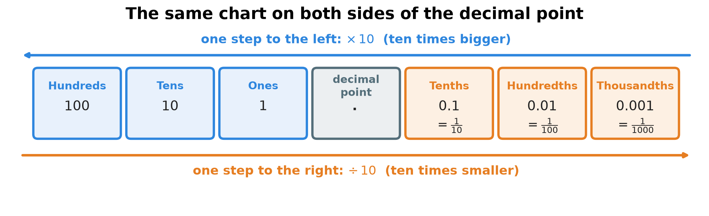
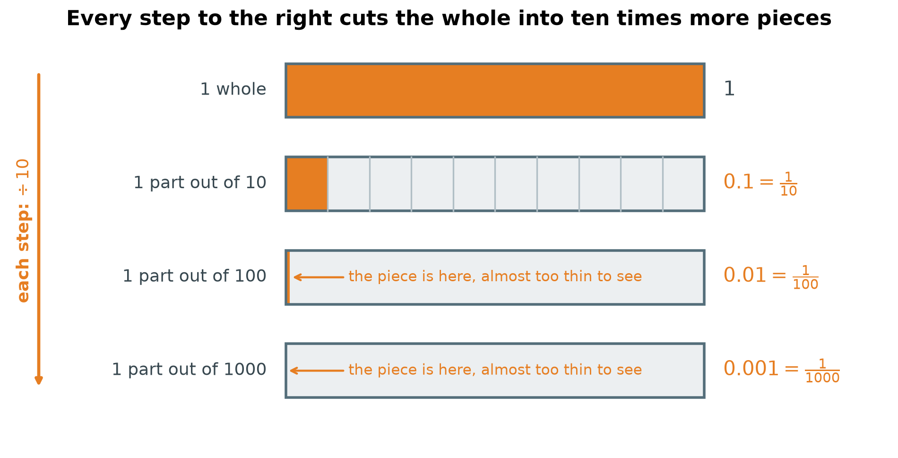
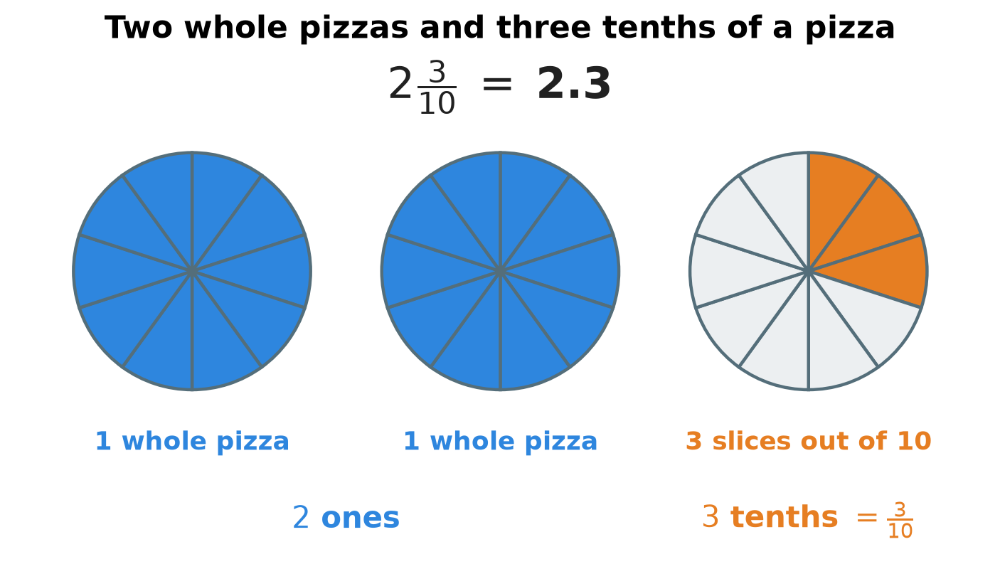
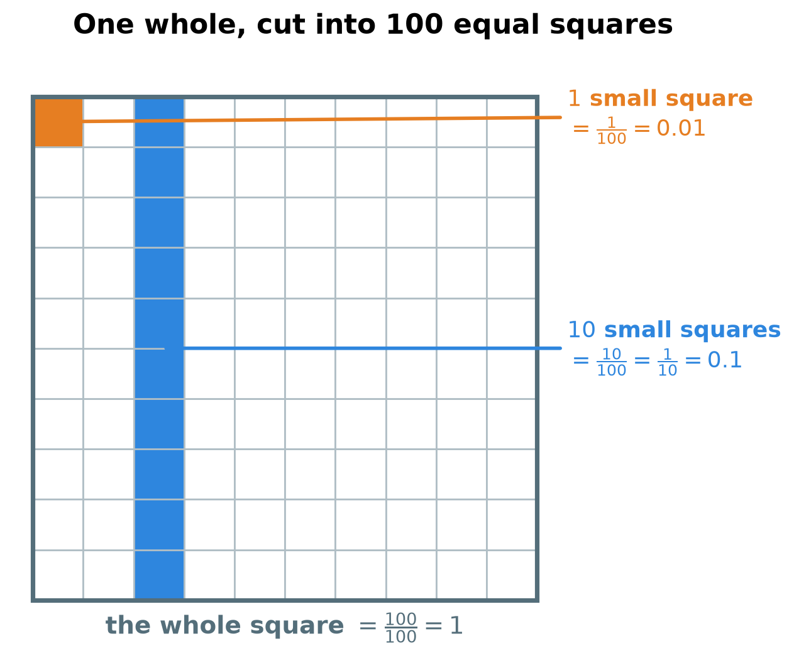
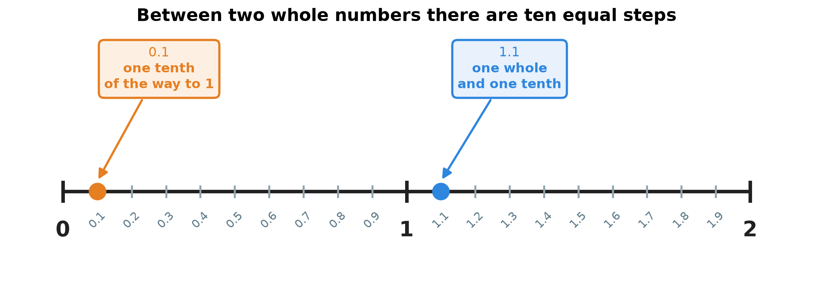
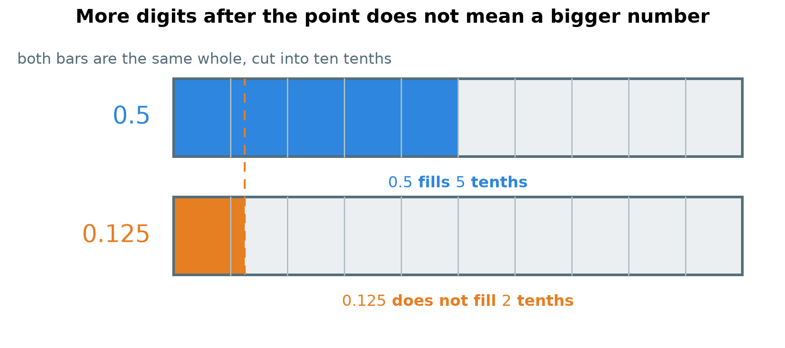
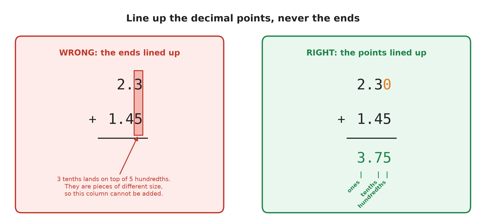

# 2. Decimals

**What this chapter teaches**
How to write parts of a whole without a fraction bar, what every digit after the point means,
how to read and compare decimal numbers, and how to add them correctly.

**Before you start**
Read [Chapter 1, Fractions](./../1_Fractions/1_Fractions.md) first. You need the words
*fraction*, *numerator*, *denominator* and *mixed number*, and you need to know that
$\frac{a}{b}$ means $a \div b$.

---

## Table of contents

1. [Why we need decimals](#1-why-we-need-decimals)
2. [Place value: a system you already use](#2-place-value-a-system-you-already-use)
3. [Reading and writing decimals](#3-reading-and-writing-decimals)
4. [Two pictures of a decimal](#4-two-pictures-of-a-decimal)
5. [Which decimal is bigger](#5-which-decimal-is-bigger)
6. [Adding decimals](#6-adding-decimals)
7. [A full example: the fruit shop](#7-a-full-example-the-fruit-shop)
8. [Glossary](#8-glossary)
9. [Check your understanding](#9-check-your-understanding)
10. [Important notes](#10-important-notes)

---

## 1. Why we need decimals

### 1.1 Most amounts are not whole numbers

Look around you for one minute. Very few amounts are whole numbers.

* Your height is not exactly $1$ metre or exactly $2$ metres.
* A bag of apples does not weigh exactly $1$ kilogram.
* Money is almost never a whole number of euros.

Chapter 1 already gave us a way to write these amounts. We can use a fraction like
$\frac{1}{10}$, or a mixed number like $1\frac{1}{10}$.

### 1.2 Fractions are correct, but slow to work with

Fractions are not wrong. They are simply uncomfortable when you have to calculate.

Try to add $1\frac{1}{10}$ and $2\frac{3}{10}$ in your head. You have to keep the whole
numbers apart from the fraction parts, and then put them back together.

Now look at the same two amounts written in the new way:

$$
1.1 + 2.3
$$

This looks like normal adding, because it *is* normal adding.

**Definition.** A **decimal** is a way of writing a number that has a whole part and a part
smaller than one, using only digits and a point — for example $1.1$ or $4.85$.

The best part of the idea is that it is not a new idea. Decimals use the same counting system
we already use for $1$, $10$ and $100$. They only continue it to the right, into the small
pieces. The next section shows how.

### Summary of section 1

* Most real amounts — height, weight, money — are not whole numbers.
* Fractions can write these amounts, but they are slow to calculate with.
* A decimal writes the same amount with digits and a point.
* Decimals are not a new counting system. They extend the one you already know.

---

## 2. Place value: a system you already use

### 2.1 The position of a digit decides its value

Take the number $325$. It is built from three digits, and each digit means something
different because of *where* it stands:

* the $5$ stands in the **ones** place, so it means $5 \times 1 = 5$;
* the $2$ stands in the **tens** place, so it means $2 \times 10 = 20$;
* the $3$ stands in the **hundreds** place, so it means $3 \times 100 = 300$.

Add those three values together:

$$
300 + 20 + 5 = 325
$$

**Definition.** **Place value** is the value a digit has because of its position in the
number.

**Note.** The digit $3$ is worth $300$ here, and it would be worth only $3$ in the number
$523$. The symbol did not change. Its position did.

### 2.2 The rule of ten

Our number system is built on the number $10$. That gives one simple rule:

* one step to the **left**, the place becomes **ten times bigger**: $1 \to 10 \to 100$;
* one step to the **right**, the place becomes **ten times smaller**: $100 \to 10 \to 1$.

Nothing in that rule says we must stop at the ones place. If we keep walking to the right, the
next place must be ten times smaller than $1$. Ten times smaller than one whole is one tenth,
which we already know how to write as a fraction: $\frac{1}{10}$.

That is the whole idea of decimals.

### 2.3 The decimal point and the new places

We need a mark that shows where the whole numbers end and the small parts begin. That mark is
the decimal point.

**Definition.** The **decimal point** is the dot written between the ones place and the tenths
place. It separates the whole part of the number from the part smaller than one.

**Definition.** A **decimal place** is any position to the right of the decimal point.

    

**Figure 1 — The same rule works on both sides of the point. Walk to the left and each box is
ten times bigger. Walk to the right and each box is ten times smaller. The point only marks
where the whole pieces end.**

The first three decimal places have names:

| Place | Written as a decimal | Written as a fraction |
| --- | :---: | :---: |
| Tenths | $0.1$ | $\frac{1}{10}$ |
| Hundredths | $0.01$ | $\frac{1}{100}$ |
| Thousandths | $0.001$ | $\frac{1}{1000}$ |

**Definition.** The **tenths** place is the first place after the point. One tenth is one part
of a whole that was cut into $10$ equal parts.

**Definition.** The **hundredths** place is the second place after the point. One hundredth is
one part of a whole cut into $100$ equal parts.

**Definition.** The **thousandths** place is the third place after the point. One thousandth is
one part of a whole cut into $1000$ equal parts.

### 2.4 Each step to the right makes the piece ten times smaller

The names above are not random. Each one comes from cutting the whole into ten times more
pieces than the place before it.

    

**Figure 2 — Every bar is the same whole. Only the number of pieces changes. Look at how the
orange piece shrinks: one tenth is already small, and one thousandth is almost invisible.**

**Definition.** The **magnitude** of a number is how big it is. In a decimal, the magnitude of
a digit comes from its place.

This is why the same digit can mean five different things:

| The number | What the digit $1$ means |
| :---: | --- |
| $100$ | one hundred wholes |
| $1$ | one whole |
| $0.1$ | one tenth of a whole |
| $0.01$ | one hundredth of a whole |
| $0.001$ | one thousandth of a whole |

**Warning.** Never judge a digit by its shape. The digit $1$ in $0.001$ is the same symbol as
the digit $1$ in $100$, but it stands for an amount that is $100\,000$ times smaller.

### Summary of section 2

* Place value means: the position of a digit decides what it is worth.
* One step left multiplies the place by $10$; one step right divides it by $10$.
* The decimal point marks the end of the whole part, not a new rule.
* The first three places after the point are tenths, hundredths and thousandths.
* Each place to the right is ten times smaller than the one before it.

---

## 3. Reading and writing decimals

### 3.1 From a mixed number to a decimal

Chapter 1 wrote a whole number together with a fraction as a mixed number, like
$2\frac{3}{10}$ — see
[Chapter 1, section 5.1](./../1_Fractions/1_Fractions.md#51-when-the-numerator-is-the-bigger-number).
Now cut every pizza into exactly $10$ slices, and the same amount fits into the place value
chart.

    

**Figure 3 — The two full pizzas are $2$ ones, so the $2$ goes before the point. The three
extra slices are $3$ tenths, so the $3$ goes in the first place after the point.**

Write it in three small steps:

1. The whole pizzas go in the ones place: $2$.
2. Put the decimal point after the ones digit.
3. The $3$ extra slices out of $10$ are $\frac{3}{10}$, so the $3$ goes in the tenths place.

$$
2\frac{3}{10} = 2.3
$$

You may read $2.3$ in two ways. Both are correct:

* "two point three" — say the digits one by one;
* "two and three tenths" — say what the number means.

### 3.2 From a fraction to a decimal

This works for any fraction whose denominator is $10$, $100$ or $1000$. The denominator tells
you *which* place to use, and the numerator tells you *which digit* to write there.

**Example.** $\frac{4}{10}$. The denominator is $10$, so this is tenths. Write $4$ in the
tenths place. There are no wholes, so write $0$ before the point:

$$
\frac{4}{10} = 0.4
$$

**Example.** $3\frac{7}{10}$. Three wholes, then $7$ tenths:

$$
3\frac{7}{10} = 3.7
$$

**Note.** The $0$ in front of $0.4$ does not change the value, but always write it. It makes
the point impossible to miss.

### 3.3 Zero holds an empty place

Hundredths need **two** places after the point. That is where beginners lose marks.

Take nine hundredths, $\frac{9}{100}$. The $9$ must stand in the **second** place after the
point. We cannot write the $9$ straight after the point, because that first place belongs to
the tenths. There are no tenths here, so we write a $0$ to hold that place:

$$
\frac{9}{100} = 0.09
$$

Compare the two numbers carefully:

| Words | Fraction | Decimal |
| --- | :---: | :---: |
| three tenths | $\frac{3}{10}$ | $0.3$ |
| three hundredths | $\frac{3}{100}$ | $0.03$ |

**Warning.** $0.3$ and $0.03$ are not the same number. $0.3$ is ten times bigger. The zero is
not decoration — it pushes the $3$ into the next place.

### 3.4 Zeros at the end change nothing

A zero *inside* the number does a job. A zero at the very **end** of a decimal does not.

Why? Take $0.5$. Five tenths is $\frac{5}{10}$. Chapter 1 taught that multiplying the top and
the bottom by the same number does not change the value — see
[Chapter 1, section 3.2](./../1_Fractions/1_Fractions.md#32-the-rule-do-the-same-thing-to-the-top-and-to-the-bottom).
Multiply both by $10$:

$$
\frac{5}{10} = \frac{5 \times 10}{10 \times 10} = \frac{50}{100}
$$

And $\frac{50}{100}$ is $50$ hundredths, which we write as $0.50$. So:

$$
0.5 = 0.50 = 0.500 = \frac{5}{10} = \frac{50}{100}
$$

**Definition.** A **trailing zero** is a zero written at the right-hand end of a decimal. It
does not change the value.

This looks like a small detail. It is not. In section 6 we use trailing zeros to make two
numbers the same length before we add them.

### Summary of section 3

* The whole part goes before the point; the parts smaller than one go after it.
* The denominator $10$ means one decimal place, $100$ means two, $1000$ means three.
* Always write a $0$ before the point when there are no wholes: $0.4$.
* A zero between the point and a digit pushes that digit to a smaller place: $0.03$.
* Zeros at the end add nothing: $0.5 = 0.50 = 0.500$.

---

## 4. Two pictures of a decimal

Two pictures are enough to see what any decimal means. Keep both in your head.

### 4.1 The square cut into a hundred

Draw one square. That square is **one whole**. Cut it into $100$ small equal squares.

    

**Figure 4 — One small square is one hundredth, $0.01$. One full column is ten small squares,
which is one tenth, $0.1$. The whole square is $100$ small squares, which is $1$.**

This picture shows something we proved with fractions in section 3.4, but now you can see it:

$$
0.1 = 0.10
$$

The blue column is *one* tenth and *ten* hundredths at the same time. It is one amount with
two names.

### 4.2 The number line, cut into tenths

Chapter 1 put fractions on a number line — see
[Chapter 1, section 5.2](./../1_Fractions/1_Fractions.md#52-both-kinds-of-fraction-on-the-number-line).
Decimals live on exactly the same line. Between any two whole numbers there are ten equal
steps, and one step is $0.1$.

    

**Figure 5 — Count the short marks between $0$ and $1$: there are nine, and they cut the gap
into ten equal steps. The point $1.1$ is one whole step past $1$.**

**Note.** A decimal is not a strange new object. It is a normal number that sits between two
whole numbers on the line you already know.

### Summary of section 4

* One whole square cut into $100$ parts shows hundredths; one small square is $0.01$.
* Ten small squares make one column, which is $0.1$ — this is why $0.1 = 0.10$.
* On the number line, one step between two whole numbers is $0.1$.
* Decimals sit on the same number line as whole numbers.

---

## 5. Which decimal is bigger

Whole numbers are easy to compare: $125$ is bigger than $5$, and the longer number wins.
**After a decimal point this stops being true.**

Look at $0.5$ and $0.125$. The second one has more digits. It is still the smaller number.

    

**Figure 6 — Both bars are the same whole. $0.5$ fills half of it. $0.125$ does not even fill
two of the ten pieces. The dashed line shows how far $0.125$ reaches.**

**Explanation.** Compare decimals **from the left**, place by place, exactly as you read them.
The tenths place decides first, because a tenth is much bigger than a hundredth. Only when the
tenths are equal does the hundredths place matter.

* $0.5$ has $5$ tenths.
* $0.125$ has $1$ tenth.
* $5$ tenths is more than $1$ tenth, so $0.5$ is bigger. Nothing after that can change it.

There is also a way that needs no thinking. Make both numbers the same length with trailing
zeros (section 3.4), then compare the digits as if they were whole numbers:

$$
0.500 \quad \text{against} \quad 0.125
$$

Now both are counted in thousandths: $500$ thousandths against $125$ thousandths.

$$
0.5 > 0.125
$$

**Example.** Which is bigger, $0.7$ or $0.68$? Pad the shorter one: $0.70$ against $0.68$.
That is $70$ hundredths against $68$ hundredths, so $0.7 > 0.68$.

### Summary of section 5

* More digits after the point does **not** mean a bigger number.
* Compare from the left: the tenths place decides first, then the hundredths.
* Or pad with trailing zeros until both numbers are the same length, then compare them as
  whole numbers.
* $0.5 > 0.125$, because $500$ thousandths is more than $125$ thousandths.

---

## 6. Adding decimals

### 6.1 The golden rule: line up the decimal points

Adding decimals uses the same method as adding whole numbers. There is one rule on top of it,
and it comes from an idea you already met in Chapter 1: **you can only add pieces of the same
size.**

Three tenths plus four tenths is seven tenths, because both are tenths. Three tenths plus four
*hundredths* is not seven of anything.

So every column of the sum must hold one single kind of piece: the ones column only ones, the
tenths column only tenths, the hundredths column only hundredths.

There is an easy way to get that right every time. **Write the decimal points under each
other.** If the points are lined up, every place is lined up automatically.

    

**Figure 7 — On the left the numbers were pushed to the right until their ends met, and $3$
tenths landed on top of $5$ hundredths. On the right the points are under each other, a zero
fills the empty hundredths place, and the sum works: $2.30 + 1.45 = 3.75$.**

### 6.2 The five steps

1. Write the numbers one under the other.
2. Line up the decimal points.
3. Fill any empty place on the right with a trailing zero, so both numbers have the same
   number of decimal places.
4. Add column by column, starting from the right.
5. Write the decimal point in the answer directly under the other decimal points.

### 6.3 Adding without carrying

**Example.** Calculate $2.3 + 1.4$.

Both numbers already have one decimal place, so no zero is needed.

| | ones | point | tenths |
| --- | :---: | :---: | :---: |
| | $2$ | $.$ | $3$ |
| $+$ | $1$ | $.$ | $4$ |
| **sum** | $3$ | $.$ | $7$ |

Step by step:

* Tenths column: $3$ tenths $+$ $4$ tenths $=$ $7$ tenths.
* Ones column: $2$ ones $+$ $1$ one $=$ $3$ ones.
* Put the point back: $3.7$.

$$
2.3 + 1.4 = 3.7
$$

**Note.** Compare this with the whole-number sum $23 + 14 = 37$. The digits are identical.
Only the point is different, and the point only says how big the pieces are.

### 6.4 When the numbers have different lengths

**Example.** Calculate $5.2 + 3.14$.

Here $5.2$ has one decimal place and $3.14$ has two. Step 3 fixes that: write $5.2$ as $5.20$.
Section 3.4 showed that this changes nothing.

| | ones | point | tenths | hundredths |
| --- | :---: | :---: | :---: | :---: |
| | $5$ | $.$ | $2$ | $0$ |
| $+$ | $3$ | $.$ | $1$ | $4$ |
| **sum** | $8$ | $.$ | $3$ | $4$ |

Step by step, always from the right:

* Hundredths: $0 + 4 = 4$.
* Tenths: $2 + 1 = 3$.
* Ones: $5 + 3 = 8$.

$$
5.2 + 3.14 = 8.34
$$

### 6.5 When a column is too full: carrying

Sometimes a column adds up to $10$ or more. A column can hold only one digit, so the extra
part moves one place to the left. This is called **carrying**, and it is the same carrying you
already do with whole numbers.

**Example.** Calculate $4.85 + 2.67$.

**Hundredths column.** $5 + 7 = 12$ hundredths. But $10$ hundredths is exactly $1$ tenth
(section 4.1), so:

$$
12 \text{ hundredths} = 10 \text{ hundredths} + 2 \text{ hundredths} = 1 \text{ tenth} + 2 \text{ hundredths}
$$

Write $2$ in the hundredths column and carry $1$ into the tenths column.

**Tenths column.** Add the carried tenth as well: $1 + 8 + 6$. Take it one step at a time:

$$
1 + 8 = 9
$$

$$
9 + 6 = 15
$$

That is $15$ tenths, and $10$ tenths is $1$ whole:

$$
15 \text{ tenths} = 10 \text{ tenths} + 5 \text{ tenths} = 1 \text{ one} + 5 \text{ tenths}
$$

Write $5$ in the tenths column and carry $1$ into the ones column.

**Ones column.** $1 + 4 + 2$:

$$
1 + 4 = 5
$$

$$
5 + 2 = 7
$$

| | ones | point | tenths | hundredths |
| --- | :---: | :---: | :---: | :---: |
| *carried* | $1$ | | $1$ | |
| | $4$ | $.$ | $8$ | $5$ |
| $+$ | $2$ | $.$ | $6$ | $7$ |
| **sum** | $7$ | $.$ | $5$ | $2$ |

$$
4.85 + 2.67 = 7.52
$$

**Note.** Carrying always moves **one place to the left**, because ten small pieces make one
piece of the next size up. Ten hundredths make one tenth. Ten tenths make one whole.

### Summary of section 6

* You can only add pieces of the same size, so the places must match.
* Lining up the decimal points lines up every place at once.
* Pad the shorter number with trailing zeros before you start.
* Add from the right; when a column reaches $10$, carry $1$ to the left.
* The point in the answer goes straight under the points above it.

---

## 7. A full example: the fruit shop

Maria buys $1.75$ kg of apples and $2.6$ kg of oranges. What is the total weight?

**Step 1 — understand the two numbers.**
$1.75$ kg is $1$ whole kilogram, $7$ tenths of a kilogram and $5$ hundredths of a kilogram.
$2.6$ kg is $2$ whole kilograms and $6$ tenths of a kilogram.

**Step 2 — make them the same length.**
$1.75$ has two decimal places and $2.6$ has one, so write $2.6$ as $2.60$. The weight did not
change. We only said "and zero hundredths" out loud.

**Step 3 — line up the points and add from the right.**

* Hundredths: $5 + 0 = 5$. Write $5$.
* Tenths: $7 + 6 = 13$ tenths. That is $1$ whole and $3$ tenths. Write $3$, carry $1$.
* Ones: the carried $1$, then $1$, then $2$. First $1 + 1 = 2$, then $2 + 2 = 4$. Write $4$.

| | ones | point | tenths | hundredths |
| --- | :---: | :---: | :---: | :---: |
| *carried* | $1$ | | | |
| | $1$ | $.$ | $7$ | $5$ |
| $+$ | $2$ | $.$ | $6$ | $0$ |
| **sum** | $4$ | $.$ | $3$ | $5$ |

**Step 4 — write the answer with its unit.**

$$
1.75 + 2.60 = 4.35
$$

Maria bought $4.35$ kg of fruit.

**Step 5 — check that the answer makes sense.** The apples are a little under $2$ kg and the
oranges are a little over $2.5$ kg, so the total should be a little over $4$ kg. It is
$4.35$ kg. The answer is believable.

### Summary of section 7

* Real problems use the same five steps: read, pad, line up, add, check.
* Always keep the unit — the answer is $4.35$ **kg**, not just $4.35$.
* A quick check with round numbers catches most mistakes.

---

## 8. Glossary

* **Decimal** — a number written with digits and a point, where the digits after the point
  count parts smaller than one, like $4.85$.
* **Decimal point** — the dot between the ones place and the tenths place.
* **Decimal place** — any position to the right of the decimal point.
* **Place value** — the value a digit has because of its position in the number.
* **Tenths** — the first place after the point; one tenth is $\frac{1}{10} = 0.1$.
* **Hundredths** — the second place after the point; one hundredth is $\frac{1}{100} = 0.01$.
* **Thousandths** — the third place after the point; one thousandth is
  $\frac{1}{1000} = 0.001$.
* **Magnitude** — how big a number is. For a digit in a decimal, the magnitude comes from its
  place.
* **Trailing zero** — a zero at the right-hand end of a decimal; it does not change the value.
* **Carrying (regrouping)** — moving $1$ to the next place on the left when a column reaches
  $10$ or more.

---

## 9. Check your understanding

Try each question before you open the answer.

**Question 1.** Write these as decimals: $\frac{4}{10}$, $3\frac{7}{10}$, $\frac{9}{100}$.

Answer

$$
\frac{4}{10} = 0.4
$$

The denominator is $10$, so the $4$ goes in the tenths place. There are no wholes, so a $0$
goes before the point.

$$
3\frac{7}{10} = 3.7
$$

Three wholes in the ones place, seven tenths in the tenths place.

$$
\frac{9}{100} = 0.09
$$

The denominator is $100$, so the $9$ must stand in the **second** place. There are no tenths,
so a $0$ holds the first place.

**Question 2.** In which place does each marked digit stand?
In $4.\mathbf{6}2$ the digit $\mathbf{6}$; in $0.0\mathbf{8}$ the digit $\mathbf{8}$; in
$\mathbf{5}.19$ the digit $\mathbf{5}$.

Answer

* In $4.\mathbf{6}2$ the $6$ is the first digit after the point, so it is in the **tenths**
  place. It is worth $\frac{6}{10}$.
* In $0.0\mathbf{8}$ the $8$ is the second digit after the point, so it is in the
  **hundredths** place. It is worth $\frac{8}{100}$.
* In $\mathbf{5}.19$ the $5$ is before the point, so it is in the **ones** place. It is worth
  $5$ whole units.

**Question 3.** Calculate $4.5 + 3.2$.

Answer

Both numbers have one decimal place, so nothing needs padding.

| | ones | point | tenths |
| --- | :---: | :---: | :---: |
| | $4$ | $.$ | $5$ |
| $+$ | $3$ | $.$ | $2$ |
| **sum** | $7$ | $.$ | $7$ |

Tenths: $5 + 2 = 7$. Ones: $4 + 3 = 7$.

$$
4.5 + 3.2 = 7.7
$$

**Question 4.** Calculate $12.4 + 3.18$.

Answer

$12.4$ has one decimal place and $3.18$ has two, so write $12.4$ as $12.40$.

| | tens | ones | point | tenths | hundredths |
| --- | :---: | :---: | :---: | :---: | :---: |
| | $1$ | $2$ | $.$ | $4$ | $0$ |
| $+$ | | $3$ | $.$ | $1$ | $8$ |
| **sum** | $1$ | $5$ | $.$ | $5$ | $8$ |

Hundredths: $0 + 8 = 8$. Tenths: $4 + 1 = 5$. Ones: $2 + 3 = 5$. Tens: the $1$ has nothing to
add to it, so it stays $1$.

$$
12.4 + 3.18 = 15.58
$$

**Question 5.** Which is bigger, $0.4$ or $0.35$?

Answer

$0.35$ has more digits, but that means nothing (section 5).

Pad the shorter number: $0.40$ against $0.35$. Now both are counted in hundredths: $40$
hundredths against $35$ hundredths.

$$
0.4 > 0.35
$$

You can also compare from the left: $4$ tenths against $3$ tenths. The tenths place already
decides it.

**Question 6.** Write "three tenths" and "three hundredths" as decimals. Then say how many
times bigger the first one is.

Answer

$$
\text{three tenths} = \frac{3}{10} = 0.3
$$

$$
\text{three hundredths} = \frac{3}{100} = 0.03
$$

The second number needs a $0$ in the tenths place, to push the $3$ into the hundredths place.

Each step to the right makes a place ten times smaller (section 2.2), and these two digits are
one place apart. So $0.3$ is **ten times** bigger than $0.03$.

---

## 10. Important notes

**The three mistakes that cost the most marks.**

* **Lining up the ends instead of the points.** If you push $2.3$ and $1.45$ to the right
  until their last digits meet, you are adding tenths to hundredths. Line up the points, pad
  with a trailing zero, and the problem disappears.
* **Believing that more digits means a bigger number.** That habit comes from whole numbers,
  where $125$ really is bigger than $5$. After a decimal point it is false: $0.5$ is four
  times bigger than $0.125$. Compare from the left, or pad and compare.
* **Writing hundredths in the tenths place.** "Three hundredths" is $0.03$, not $0.3$. Count
  the places after the point: hundredths always need two.

**The two ideas to keep.**

* The decimal point does not start a new counting system. It only marks where the whole pieces
  end. The rule of ten runs straight through it.
* You can only add pieces of the same size. Every rule in section 6 is that one idea, turned
  into a procedure.

**How this chapter connects to the rest of the book.**
Chapter 1 showed that a fraction is a number of equal parts of a whole. This chapter took the
special fractions with $10$, $100$ and $1000$ underneath and gave them a shorter way to be
written. Everything still agrees with Chapter 1: $0.1$ *is* $\frac{1}{10}$, and the two
notations describe the same amount. Money, weights and measurements in later chapters will all
be written as decimals.

---

- [Back to the book](./../README.md)
- Previous: [1 Fractions](./../1_Fractions/1_Fractions.md)
- Next: not written yet.
