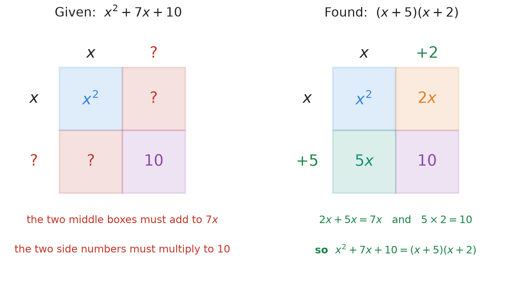
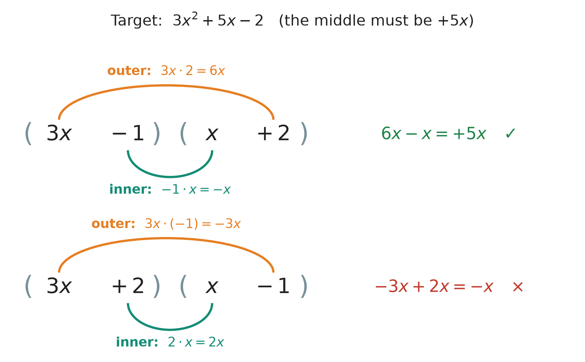

# 30. Solving quadratic equations by factoring

**What this chapter teaches**
How to solve an equation such as $x^{2} + 7x + 10 = 0$. Two new ideas do all the work: the
**zero product property** (if a product is $0$, one of its factors is $0$), and **factoring a
trinomial** into two brackets, which is the FOIL method of Chapter 29 run backwards.

**Before you start**
You need the FOIL method from
[Chapter 29, section 3](./../29_Multiplying_Polynomials/29_Multiplying_Polynomials.md#3-the-foil-method),
and the word *quadratic* and standard form from
[Chapter 27, sections 5.2 and 6.1](./../27_Introduction_To_Polynomials/27_Introduction_To_Polynomials.md#52-by-the-degree).
You need to solve small equations such as $x + 5 = 0$ and $3x - 1 = 0$, as in
[Chapter 20](./../20_Solving_Equations/20_Solving_Equations.md), and the sign rules of
[Chapter 9, section 5](./../9_Negative_Numbers/9_Negative_Numbers.md#5-multiplying).
Factor pairs are in
[Chapter 12, section 2.3](./../12_Divisibility_And_Prime_Numbers/12_Divisibility_And_Prime_Numbers.md#23-the-factors-of-20).

---

## Table of contents

1. [What a quadratic equation is](#1-what-a-quadratic-equation-is)
2. [The zero product property](#2-the-zero-product-property)
3. [Factoring: FOIL run backwards](#3-factoring-foil-run-backwards)
4. [Solving the simple case](#4-solving-the-simple-case)
5. [Solving when a number stands in front of the square](#5-solving-when-a-number-stands-in-front-of-the-square)
6. [The whole method, and three traps](#6-the-whole-method-and-three-traps)
7. [Glossary](#7-glossary)
8. [Check your understanding](#8-check-your-understanding)
9. [Important notes](#9-important-notes)

---

## 1. What a quadratic equation is

### 1.1 The name

[Chapter 27, section 1.5](./../27_Introduction_To_Polynomials/27_Introduction_To_Polynomials.md#15-a-polynomial-and-a-polynomial-equation)
set a polynomial equal to $0$ and called it a **polynomial equation**. Chapter 27 only gave it a
name. This chapter solves one.

A **quadratic equation** is a polynomial equation of degree $2$. So the largest power of $x$ in
it is $x^{2}$
([Chapter 27, section 5.2](./../27_Introduction_To_Polynomials/27_Introduction_To_Polynomials.md#52-by-the-degree)).
For example:

$$
x^{2} + 7x + 10 = 0
$$

Equations of this kind describe many real things: the path of a ball you throw, the shape of a
satellite dish, the profit of a shop. In this chapter we only learn how to solve them.

### 1.2 Standard form

A quadratic equation is in **standard form** when all its terms are on the left, in
standard order
([Chapter 27, section 6.1](./../27_Introduction_To_Polynomials/27_Introduction_To_Polynomials.md#61-largest-exponent-first)),
and the right side is $0$.

First with numbers. In $3x^{2} + 5x - 2 = 0$:

* the number in front of $x^{2}$ is $3$;
* the number in front of $x$ is $5$;
* the plain number is $-2$.

Every quadratic equation can be written in this shape:

$$
ax^{2} + bx + c = 0
$$

**In words:** some number times $x^{2}$, plus some number times $x$, plus a plain number,
equals zero.

* $a$ — the coefficient of $x^{2}$
  ([coefficient](./../18_Introduction_To_Algebra_Variables/18_Introduction_To_Algebra_Variables.md#33-the-number-in-front-has-a-name)
  is Chapter 18's word). In the example, $a = 3$.
* $b$ — the coefficient of $x$. In the example, $b = 5$.
* $c$ — the constant term
  ([Chapter 21, section 1.2](./../21_Equations_With_The_Letter_On_Both_Sides/21_Equations_With_The_Letter_On_Both_Sides.md#12-the-two-kinds-of-piece)).
  In the example, $c = -2$.
* Each sign belongs to its number. In $x^{2} - 8x - 20 = 0$, $b = -8$ and $c = -20$.
* $a$, $b$ and $c$ can be any numbers, but $a$ must not be $0$ ($a \neq 0$). If $a$ were $0$,
  the $x^{2}$ term would disappear. The equation would then have degree $1$, and it would not be
  quadratic any more.
* When you see $x^{2}$ with no number in front, $a = 1$
  ([Chapter 19, section 6.2](./../19_The_Number_Properties_Of_Algebra/19_The_Number_Properties_Of_Algebra.md#62-multiplying-by-one)).

In this chapter, $a$, $b$ and $c$ are always whole numbers or negative whole numbers.

### 1.3 What solving means

To **solve** an equation is to find the numbers that make it true
([Chapter 20, section 1.2](./../20_Solving_Equations/20_Solving_Equations.md#12-the-number-that-makes-it-true)).
Try two numbers in $x^{2} + 7x + 10 = 0$.

With $x = 1$:

$$
1^{2} + 7 \times 1 + 10 = 1 + 7 + 10 = 18
$$

$18$ is not $0$. So $1$ is not a solution.

With $x = -5$:

$$
(-5)^{2} + 7 \times (-5) + 10 = 25 - 35 + 10 = 0
$$

This is $0$. So $-5$ **is** a solution. Section 2.4 will show that $-2$ is a solution too. A
quadratic equation can have **two** solutions. You met this already:
$x^{2} = 25$ gave $x = 5$ and $x = -5$
([Chapter 24, section 8.1](./../24_Roots/24_Roots.md#81-the-missing-move-added-to-the-toolbox)).

The solutions of an equation have two other names. They are called the **roots** of the
equation, and the **zeros** of the expression on the left (because they make it $0$).

> **Note.** The word *root* now has two meanings. In
> [Chapter 24](./../24_Roots/24_Roots.md#12-what-a-root-asks), a root is the operation that
> undoes a power, as in $\sqrt{25} = 5$. Here, a root of an equation is simply a solution. The
> sentence around the word tells you which one is meant.

### 1.4 Why the old methods do not work

The book can solve $x^{2} = 25$ (take the square root,
[Chapter 24, section 8.1](./../24_Roots/24_Roots.md#81-the-missing-move-added-to-the-toolbox))
and $x^{2} + 5 = 41$ (first move the $5$,
[Chapter 26, section 4](./../26_Equations_With_Roots_And_Exponents/26_Equations_With_Roots_And_Exponents.md#4-when-the-letter-is-squared-two-answers)).
In both, $x$ appears only once.

In $x^{2} + 7x + 10 = 0$, the letter appears **twice**, once squared and once not. We cannot get
$x$ alone. If we move $7x$ to the right side, we get $x^{2} + 10 = -7x$, and the letter is still
on both sides. Chapter 21 gathered letters on one side, but there both letters were plain $x$, so
they joined. Here $x^{2}$ and $x$ are not like terms. They never join.

So we need a new idea. It comes in section 2.

### Summary of section 1

* A quadratic equation has $x^{2}$ as its largest power.
* Standard form: $ax^{2} + bx + c = 0$, with $a \neq 0$. Each sign belongs to its number.
* Its solutions are also called roots or zeros. There can be two of them.
* $x^{2}$ and $x$ do not join, so we cannot get $x$ alone in the usual way.

---

## 2. The zero product property

### 2.1 Numbers first

Suppose two numbers multiply to $12$. What are they? There are very many possibilities:

$$
3 \times 4 = 12 \qquad 2 \times 6 = 12 \qquad 0.5 \times 24 = 12 \qquad (-3) \times (-4) = 12
$$

Knowing the product is $12$ tells you almost nothing about the two numbers.

Now suppose two numbers multiply to $0$. Try to find two numbers, **neither of them $0$**, whose
product is $0$. $3 \times 4 = 12$. $0.5 \times 0.1 = 0.05$. $(-7) \times 2 = -14$. The products can
be very small, but they are never $0$. The only way to get $0$ is to have a $0$ among the
factors:

$$
0 \times 4 = 0 \qquad 7 \times 0 = 0 \qquad 0 \times 0 = 0
$$

So $0$ is special. A product of $12$ tells you nothing. A product of $0$ tells you something sure:
**at least one of the factors is $0$**.

### 2.2 Why it is true

There are two directions.

**If one factor is $0$, the product is $0$.** This is the fact "anything times zero is zero",
which
[Chapter 9, section 5.2](./../9_Negative_Numbers/9_Negative_Numbers.md#52-a-negative-number-times-a-negative-number)
started from.

**If the product is $0$, one factor is $0$.** Say $A \times B = 0$, and say $A$ is **not** $0$.
Then we may divide both sides by $A$
([Chapter 20, section 2.2](./../20_Solving_Equations/20_Solving_Equations.md#22-the-four-properties-of-equality)):

$$
\frac{A \times B}{A} = \frac{0}{A}
$$

$$
B = 0
$$

On the left, $A$ divided by $A$ is $1$, so only $B$ is left. On the right, $\frac{0}{A}$ asks "what
times $A$ gives $0$?", and the answer is $0$
([inverse operations, Chapter 8, section 1.1](./../8_Dividing_Large_Numbers/8_Dividing_Large_Numbers.md#11-small-divisions-are-times-tables-read-backwards)).
So if $A$ is not $0$, then $B$ must be $0$. One of the two is always $0$.

### 2.3 The rule

$$
\text{If } A \times B = 0, \text{ then } A = 0 \text{ or } B = 0.
$$

**In words:** when two things multiply to zero, the first one is zero, or the second one is zero.

* $A$, $B$ — any two numbers or expressions. Later they will be brackets such as $(x + 5)$.
* "or" — at least one of them. Both may be $0$, as in $0 \times 0 = 0$.

This rule is called the **zero product property**.

### 2.4 Using it on brackets

Solve $(x + 5)(x + 2) = 0$.

This is a product of two brackets, and the product is $0$. So one bracket is $0$:

$$
x + 5 = 0 \quad \text{or} \quad x + 2 = 0
$$

Each one is a one-step equation
([Chapter 20, section 4](./../20_Solving_Equations/20_Solving_Equations.md#4-the-four-one-step-equations)).
Subtract $5$, or subtract $2$, from both sides:

$$
x = -5 \quad \text{or} \quad x = -2
$$

One hard equation has become two easy ones. This is why we factor.

Look at the values of the two brackets and of their product for a few numbers:

| $x$ | $x + 5$ | $x + 2$ | $(x + 5)(x + 2)$ |
| --- | --- | --- | --- |
| $-6$ | $-1$ | $-4$ | $4$ |
| $-5$ | $\mathbf{0}$ | $-3$ | $\mathbf{0}$ |
| $-4$ | $1$ | $-2$ | $-2$ |
| $-3$ | $2$ | $-1$ | $-2$ |
| $-2$ | $3$ | $\mathbf{0}$ | $\mathbf{0}$ |
| $-1$ | $4$ | $1$ | $4$ |

The product is $0$ in exactly two rows. In each of them, one bracket is $0$. At $x = -5$ the
first bracket is $0$, so the product is $0 \times (-3) = 0$. At $x = -2$ the second bracket is
$0$, so the product is $3 \times 0 = 0$.

### 2.5 Only zero works

The rule needs a $0$ on one side. Any other number gives nothing.

Look at $x(x + 7) = -10$. It is tempting to say "$x = -10$ or $x + 7 = -10$". Test it. With
$x = -10$:

$$
-10 \times (-10 + 7) = -10 \times (-3) = 30
$$

$30$ is not $-10$. The idea was wrong. Two numbers can multiply to $-10$ in endless ways:
$2 \times (-5)$, $1 \times (-10)$, $0.5 \times (-20)$ and many more. So the product $-10$ does not
tell you what either factor is. Only a product of $0$ does.

### Summary of section 2

* Two numbers multiply to $0$ only when at least one of them is $0$.
* The zero product property: if $A \times B = 0$, then $A = 0$ or $B = 0$.
* $(x + 5)(x + 2) = 0$ splits into $x + 5 = 0$ or $x + 2 = 0$, so $x = -5$ or $x = -2$.
* The rule works only for a product equal to $0$. Never for $-10$ or any other number.

---

## 3. Factoring: FOIL run backwards

### 3.1 From one line to two brackets

Section 2 needs a product of brackets. But a quadratic equation usually arrives as
$x^{2} + 7x + 10 = 0$, with no brackets. So we must turn $x^{2} + 7x + 10$ into a product of two
binomials.

Writing an expression as a product is called **factoring**. The word is from
[Chapter 19, section 5.1](./../19_The_Number_Properties_Of_Algebra/19_The_Number_Properties_Of_Algebra.md#51-the-rule-read-from-right-to-left),
where we took a common factor out: $3x^{2} + 6x = 3x(x + 2)$. Now the result is two binomials.
The result is called the **factored form**.

[Chapter 29, section 2.2](./../29_Multiplying_Polynomials/29_Multiplying_Polynomials.md#22-the-same-steps-with-letters)
went one way:

$$
(x + 5)(x + 2) \to x^{2} + 7x + 10
$$

Factoring goes the other way:

$$
x^{2} + 7x + 10 \to (x + 5)(x + 2)
$$

**Factoring is FOIL run backwards.**

### 3.2 Where $7$ and $10$ come from

Multiply $(x + 5)(x + 2)$ with FOIL and watch the two numbers $5$ and $2$:

* First: $x \cdot x = x^{2}$
* Outer: $x \cdot 2 = 2x$
* Inner: $5 \cdot x = 5x$
* Last: $5 \cdot 2 = 10$

The Outer and Inner products join: $2x + 5x = 7x$. So:

* the middle number $7$ is $5 + 2$ — the two numbers **added**;
* the last number $10$ is $5 \times 2$ — the two numbers **multiplied**.

    

**Figure 1 — The FOIL grid of Chapter 29, filled in backwards. We know the corners, $x^{2}$ and
$10$. We must find two side numbers that multiply to $10$ (the purple corner) and give two middle
boxes that add to $7x$. The numbers $5$ and $2$ do both.**

### 3.3 The rule in symbols

Now with letters. Call the two numbers $m$ and $n$:

$$
(x + m)(x + n) = x^{2} + nx + mx + mn
$$

The middle terms $nx$ and $mx$ are like terms, so they join
([Chapter 19, section 4.2](./../19_The_Number_Properties_Of_Algebra/19_The_Number_Properties_Of_Algebra.md#42-why-joining-is-allowed)):

$$
(x + m)(x + n) = x^{2} + (m + n)x + mn
$$

Compare this with $x^{2} + bx + c$. The two must match, piece by piece:

$$
m + n = b \qquad m \times n = c
$$

**In words:** to factor $x^{2} + bx + c$, find two numbers that **multiply to $c$** and **add to
$b$**. Then the answer is $(x + m)(x + n)$.

* $m$, $n$ — the two numbers we are looking for.
* $b$ — the coefficient of $x$; it must be their sum.
* $c$ — the constant term; it must be their product.

This works only when $a = 1$. Section 5 deals with the other case.

### 3.4 Finding the two numbers

Start from the product, not from the sum. A product has only a few factor pairs, so you can list
all of them
([Chapter 12, section 2.3](./../12_Divisibility_And_Prime_Numbers/12_Divisibility_And_Prime_Numbers.md#23-the-factors-of-20)).
A sum has endless pairs.

Now the factors may be negative too. The sign rules of
[Chapter 9, section 5](./../9_Negative_Numbers/9_Negative_Numbers.md#5-multiplying) say which
signs are possible:

* If $c$ is **positive**, the two numbers have the **same sign**: both positive or both negative.
  $(+5) \times (+2) = 10$ and $(-5) \times (-2) = 10$.
* If $c$ is **negative**, the two numbers have **opposite signs**: one positive, one negative.
  $(+10) \times (-2) = -20$ and $(-10) \times (+2) = -20$.

Then the sign of $b$ chooses between them:

| Sign of $c$ | Sign of $b$ | The two numbers | Example |
| --- | --- | --- | --- |
| $+$ | $+$ | both positive | $x^{2} + 7x + 10 = (x + 5)(x + 2)$ |
| $+$ | $-$ | both negative | $x^{2} - 7x + 10 = (x - 5)(x - 2)$ |
| $-$ | $+$ | opposite signs; the one further from $0$ is positive | $x^{2} + 8x - 20 = (x + 10)(x - 2)$ |
| $-$ | $-$ | opposite signs; the one further from $0$ is negative | $x^{2} - 8x - 20 = (x - 10)(x + 2)$ |

Why the last two rows? When you add a positive and a negative number, the answer takes the sign
of the one further from $0$
([Chapter 9, section 4](./../9_Negative_Numbers/9_Negative_Numbers.md#4-adding-and-subtracting)).
$10 + (-2) = 8$ is positive, because $10$ is further from $0$ than $-2$. $-10 + 2 = -8$ is
negative, because $-10$ is further from $0$.

You do not need to learn this table by heart. If you list all the pairs with their signs and
add each pair, the right one shows itself. The table only saves time.

### Summary of section 3

* Factoring writes an expression as a product. For a quadratic, it is FOIL run backwards.
* $(x + m)(x + n) = x^{2} + (m + n)x + mn$.
* To factor $x^{2} + bx + c$: find two numbers that multiply to $c$ and add to $b$.
* List the factor pairs of $c$ first, with their signs. Then add each pair.

---

## 4. Solving the simple case

In this section $a = 1$: there is no number in front of $x^{2}$.

### 4.1 All signs positive: $x^{2} + 7x + 10 = 0$

**Step 1 — read $a$, $b$ and $c$.** $a = 1$, $b = 7$, $c = 10$. The equation is already in
standard form.

**Step 2 — list the factor pairs of $c = 10$.** $c$ is positive, so both numbers have the same
sign:

| Pair | Product | Sum |
| --- | --- | --- |
| $1$ and $10$ | $10$ | $11$ |
| $-1$ and $-10$ | $10$ | $-11$ |
| $2$ and $5$ | $10$ | $\mathbf{7}$ |
| $-2$ and $-5$ | $10$ | $-7$ |

**Step 3 — choose the pair whose sum is $b = 7$.** It is $2$ and $5$.

**Step 4 — write the factored form.**

$$
(x + 5)(x + 2) = 0
$$

**Step 5 — use the zero product property.** One bracket must be $0$:

$$
x + 5 = 0 \quad \text{or} \quad x + 2 = 0
$$

$$
x = -5 \quad \text{or} \quad x = -2
$$

**Step 6 — check both answers in the original equation**
([Chapter 20, section 4.5](./../20_Solving_Equations/20_Solving_Equations.md#45-the-check-every-time)).

With $x = -5$:

$$
(-5)^{2} + 7 \times (-5) + 10 = 25 - 35 + 10 = 0 \quad \checkmark
$$

With $x = -2$:

$$
(-2)^{2} + 7 \times (-2) + 10 = 4 - 14 + 10 = 0 \quad \checkmark
$$

Both work. Notice the signs: the brackets have $+5$ and $+2$, but the answers are $-5$ and $-2$.
That is normal. The answer is the number that makes the bracket $0$.

### 4.2 Negative signs: $x^{2} - 8x - 20 = 0$

**Step 1 — read $a$, $b$ and $c$.** $a = 1$, $b = -8$, $c = -20$. The minus signs belong to the
numbers.

**Step 2 — list the factor pairs of $c = -20$.** $c$ is negative, so one number is positive and
the other is negative:

| Pair | Product | Sum |
| --- | --- | --- |
| $1$ and $-20$ | $-20$ | $-19$ |
| $-1$ and $20$ | $-20$ | $19$ |
| $2$ and $-10$ | $-20$ | $\mathbf{-8}$ |
| $-2$ and $10$ | $-20$ | $8$ |
| $4$ and $-5$ | $-20$ | $-1$ |
| $-4$ and $5$ | $-20$ | $1$ |

**Step 3 — choose the pair whose sum is $b = -8$.** It is $2$ and $-10$.

**Step 4 — write the factored form.** The number $-10$ makes the bracket $x + (-10)$, which is
$x - 10$:

$$
(x - 10)(x + 2) = 0
$$

**Step 5 — use the zero product property.**

$$
x - 10 = 0 \quad \text{or} \quad x + 2 = 0
$$

$$
x = 10 \quad \text{or} \quad x = -2
$$

**Step 6 — check both answers.**

With $x = 10$:

$$
10^{2} - 8 \times 10 - 20 = 100 - 80 - 20 = 0 \quad \checkmark
$$

With $x = -2$:

$$
(-2)^{2} - 8 \times (-2) - 20 = 4 + 16 - 20 = 0 \quad \checkmark
$$

Both work.

### Summary of section 4

* Read $a$, $b$, $c$ with their signs.
* List every factor pair of $c$, with signs, and write each sum next to it.
* The pair whose sum is $b$ gives the brackets.
* Each bracket set to $0$ gives one answer. Check both in the original equation.

---

## 5. Solving when a number stands in front of the square

In this section $a$ is not $1$.

### 5.1 What changes

Take $3x^{2} + 5x - 2 = 0$. Here $a = 3$. The rule "multiply to $c$, add to $b$" from section 3
no longer works directly. To see why, multiply $(3x - 1)(x + 2)$ with FOIL:

* First: $3x \cdot x = 3x^{2}$
* Outer: $3x \cdot 2 = 6x$
* Inner: $-1 \cdot x = -x$
* Last: $-1 \cdot 2 = -2$

The middle term is $6x - x = 5x$. The numbers $-1$ and $2$ add to $1$, not to $5$. The reason
is the Outer product: the $2$ in the second bracket is multiplied by $3x$, not by $x$. So it
counts **three times**.

So when $a$ is not $1$, **where** you put each number matters.

### 5.2 Trying the places: $3x^{2} + 5x - 2 = 0$

**Step 1 — the first terms.** They must multiply to $3x^{2}$. $3$ is a prime number, so its
only factor pair is $3$ and $1$
([Chapter 12, section 3.1](./../12_Divisibility_And_Prime_Numbers/12_Divisibility_And_Prime_Numbers.md#31-counting-the-factors)).
We take $3x$ and $x$:

$$
(3x \quad \_\_)(x \quad \_\_) = 0
$$

**Step 2 — the last terms.** They must multiply to $c = -2$. $c$ is negative, so the signs are
opposite. The pairs are $1$ and $-2$, or $-1$ and $2$.

**Step 3 — try every place.** Each pair can go in two orders. That makes four tries. For each,
work out only the Outer and the Inner products, because F and L are always right:

| Try | Outer | Inner | Middle term |
| --- | --- | --- | --- |
| $(3x + 1)(x - 2)$ | $3x \cdot (-2) = -6x$ | $1 \cdot x = x$ | $-5x$ |
| $(3x - 1)(x + 2)$ | $3x \cdot 2 = 6x$ | $-1 \cdot x = -x$ | $\mathbf{+5x}$ |
| $(3x + 2)(x - 1)$ | $3x \cdot (-1) = -3x$ | $2 \cdot x = 2x$ | $-x$ |
| $(3x - 2)(x + 1)$ | $3x \cdot 1 = 3x$ | $-2 \cdot x = -2x$ | $x$ |

Only the second try gives $+5x$. Look at the first try too: it gives $-5x$, the right size with
the wrong sign. When that happens, swap the two signs.

    

**Figure 2 — The same pieces, $3x$, $x$, $2$ and $-1$, in two different places. The number at
the end of the second bracket meets $3x$ (orange arc), so it is multiplied by $3$. Moving the
numbers changes the middle term from $+5x$ to $-x$.**

**Step 4 — the factored form.**

$$
(3x - 1)(x + 2) = 0
$$

**Step 5 — use the zero product property.**

$$
3x - 1 = 0 \quad \text{or} \quad x + 2 = 0
$$

The first one is a two-step equation
([Chapter 20, section 5](./../20_Solving_Equations/20_Solving_Equations.md#5-more-than-one-step)).
Add $1$ to both sides, then divide both sides by $3$:

$$
3x = 1
$$

$$
x = \frac{1}{3}
$$

The second one gives $x = -2$.

**Step 6 — check both answers.**

With $x = \frac{1}{3}$, one step per line:

$$
3 \times \left(\frac{1}{3}\right)^{2} + 5 \times \frac{1}{3} - 2
$$

$$
= 3 \times \frac{1}{9} + \frac{5}{3} - 2
$$

$$
= \frac{1}{3} + \frac{5}{3} - 2
$$

$$
= \frac{6}{3} - 2
$$

$$
= 2 - 2 = 0 \quad \checkmark
$$

With $x = -2$:

$$
3 \times (-2)^{2} + 5 \times (-2) - 2 = 3 \times 4 - 10 - 2 = 12 - 10 - 2 = 0 \quad \checkmark
$$

Both work. A solution can be a fraction. That is fine.

### 5.3 The method when $a$ is not $1$

1. Choose two first terms that multiply to $ax^{2}$.
2. List the factor pairs of $c$, with their signs.
3. Try each pair in both orders. For each try, add only the Outer and Inner products.
4. Keep the try whose middle term is $bx$.

**In symbols:** we look for

$$
(px + q)(rx + s) = 0
$$

with

$$
p \times r = a \qquad q \times s = c \qquad p \times s + q \times r = b
$$

* $p$, $r$ — the numbers in front of $x$ in the two brackets.
* $q$, $s$ — the plain numbers in the two brackets.
* $p \times s$ is the Outer product's number, and $q \times r$ is the Inner product's number.
  Together they must make $b$.

With $(3x - 1)(x + 2)$: $p = 3$, $q = -1$, $r = 1$, $s = 2$. Then $3 \times 1 = 3 = a$,
$-1 \times 2 = -2 = c$, and $3 \times 2 + (-1) \times 1 = 6 - 1 = 5 = b$.

When $a = 1$, $p$ and $r$ are both $1$, and the last condition becomes $s + q = b$. That is the
rule of section 3.3 again.

### Summary of section 5

* When $a$ is not $1$, the number at the end of the second bracket is multiplied by the first
  term's number.
* So the places of the two numbers matter. Try every order.
* Check only Outer plus Inner; First and Last are right by construction.
* A right size with the wrong sign means: swap the signs.

---

## 6. The whole method, and three traps

### 6.1 The method in one picture

    

**Figure 3 — The five steps. The two blue steps are new in this chapter. The grey steps are
older chapters. The green step is the check, and it uses the equation you were given, not a
later line.**

### 6.2 Trap 1: the right side is not $0$

Solve $x^{2} + 7x = -10$.

The zero product property needs a $0$ on one side (section 2.5). So first add $10$ to both sides:

$$
x^{2} + 7x + 10 = 0
$$

Now it is section 4.1 again: $x = -5$ or $x = -2$. The check uses the **original** equation:

* $x = -5$: $25 - 35 = -10$ $\checkmark$
* $x = -2$: $4 - 14 = -10$ $\checkmark$

### 6.3 Trap 2: the sign of the answer

$(x + 5)(x + 2) = 0$ does **not** give $x = 5$. With $x = 5$ the brackets are $10$ and $7$, and
$10 \times 7 = 70$. Always write the small equation $x + 5 = 0$ first. Then subtract $5$ from both
sides and you get $-5$. Do not jump from the bracket straight to the answer.

### 6.4 Trap 3: stopping at the brackets

$(x + 5)(x + 2) = 0$ is not the answer. It is only the equation, written in another way. The
question asked for $x$. The answer is $x = -5$ or $x = -2$.

### Summary of section 6

* Right side $0$, factor, set each bracket to $0$, solve, check.
* Make the right side $0$ first. Only then factor.
* The answer is the number that makes a bracket $0$, so its sign is the opposite of the sign in
  the bracket.
* The brackets are a step, not the answer.

---

## 7. Glossary

* **Quadratic equation** — a polynomial equation of degree $2$; in standard form,
  $ax^{2} + bx + c = 0$ with $a \neq 0$.
* **Zero product property** — if $A \times B = 0$, then $A = 0$ or $B = 0$.
* **Factored form** — an expression written as a product, such as $(x + 5)(x + 2)$ for
  $x^{2} + 7x + 10$.
* **Root (of an equation)** — another name for a solution of the equation. Not the same as the
  root of Chapter 24.
* **Zero (of an expression)** — a value of $x$ that makes the expression equal $0$.

**Note.** Every other term was defined earlier. **Polynomial equation**, **degree**,
**quadratic**, **binomial**, **trinomial** and **standard form** are in
[Chapter 27](./../27_Introduction_To_Polynomials/27_Introduction_To_Polynomials.md#8-glossary);
**FOIL method** is in
[Chapter 29](./../29_Multiplying_Polynomials/29_Multiplying_Polynomials.md#7-glossary);
**factoring** and **like terms** are in
[Chapter 19](./../19_The_Number_Properties_Of_Algebra/19_The_Number_Properties_Of_Algebra.md#9-glossary);
**solution** is in
[Chapter 20](./../20_Solving_Equations/20_Solving_Equations.md#8-glossary);
**factor pair** is in
[Chapter 12](./../12_Divisibility_And_Prime_Numbers/12_Divisibility_And_Prime_Numbers.md#7-glossary).

---

## 8. Check your understanding

**Question 1.** Solve $x^{2} + 6x + 8 = 0$.

Answer

$b = 6$, $c = 8$. $c$ is positive and $b$ is positive, so both numbers are positive.

* $1$ and $8$: sum $9$.
* $2$ and $4$: sum $6$. This is the pair.

Factored form: $(x + 2)(x + 4) = 0$.

$x + 2 = 0$ or $x + 4 = 0$, so **$x = -2$ or $x = -4$**.

Check: $4 - 12 + 8 = 0$ $\checkmark$ and $16 - 24 + 8 = 0$ $\checkmark$.

**Question 2.** Solve $x^{2} - 3x - 18 = 0$.

Answer

$b = -3$, $c = -18$. $c$ is negative, so the signs are opposite.

| Pair | Sum |
| --- | --- |
| $1$ and $-18$ | $-17$ |
| $2$ and $-9$ | $-7$ |
| $3$ and $-6$ | $\mathbf{-3}$ |
| $-3$ and $6$ | $3$ |

Factored form: $(x + 3)(x - 6) = 0$.

**$x = -3$ or $x = 6$.**

Check: $9 + 9 - 18 = 0$ $\checkmark$ and $36 - 18 - 18 = 0$ $\checkmark$.

**Question 3.** Solve $2x^{2} + 7x + 3 = 0$.

Answer

First terms: $2x$ and $x$. Last terms multiply to $3$, and $b$ and $c$ are both positive, so use
$1$ and $3$. Two places to try:

| Try | Outer | Inner | Middle |
| --- | --- | --- | --- |
| $(2x + 1)(x + 3)$ | $2x \cdot 3 = 6x$ | $1 \cdot x = x$ | $\mathbf{7x}$ |
| $(2x + 3)(x + 1)$ | $2x \cdot 1 = 2x$ | $3 \cdot x = 3x$ | $5x$ |

Factored form: $(2x + 1)(x + 3) = 0$.

$2x + 1 = 0$ gives $2x = -1$, so $x = -\frac{1}{2}$. And $x + 3 = 0$ gives $x = -3$.

**$x = -\frac{1}{2}$ or $x = -3$.**

Check $x = -\frac{1}{2}$: $2 \times \frac{1}{4} - \frac{7}{2} + 3 = \frac{1}{2} - \frac{7}{2} + 3 = -\frac{6}{2} + 3 = -3 + 3 = 0$ $\checkmark$.
Check $x = -3$: $18 - 21 + 3 = 0$ $\checkmark$.

**Question 4.** Solve $x^{2} - 7x + 10 = 0$.

Answer

$c = 10$ is positive and $b = -7$ is negative, so both numbers are negative. $-5$ and $-2$
multiply to $10$ and add to $-7$.

Factored form: $(x - 5)(x - 2) = 0$.

**$x = 5$ or $x = 2$.**

Check: $25 - 35 + 10 = 0$ $\checkmark$ and $4 - 14 + 10 = 0$ $\checkmark$.

Compare with section 4.1: the same numbers $5$ and $2$, but all the signs are turned round.

**Question 5.** Solve $x^{2} + 5x = -6$.

Answer

The right side is not $0$. Add $6$ to both sides first: $x^{2} + 5x + 6 = 0$.

$2$ and $3$ multiply to $6$ and add to $5$. So $(x + 2)(x + 3) = 0$.

**$x = -2$ or $x = -3$.**

Check in the original equation: $4 - 10 = -6$ $\checkmark$ and $9 - 15 = -6$ $\checkmark$.

**Question 6.** A student solves $(x + 4)(x - 3) = 0$ and writes "$x = 4$ or $x = -3$". What
went wrong?

Answer

The student copied the numbers from the brackets and kept their signs. But the answer is the
number that makes a bracket $0$:

* $x + 4 = 0$ gives $x = -4$.
* $x - 3 = 0$ gives $x = 3$.

**The answers are $x = -4$ or $x = 3$.** Test the student's $x = 4$: $(4 + 4)(4 - 3) = 8 \times 1 = 8$,
not $0$.

**Question 7.** Solve $(x - 1)(x + 2) = 4$.

Answer

The right side is $4$, not $0$, so the zero product property cannot be used yet. "$x - 1 = 4$ or
$x + 2 = 4$" would be wrong (section 2.5).

Multiply out with FOIL
([Chapter 29](./../29_Multiplying_Polynomials/29_Multiplying_Polynomials.md#33-a-full-example)):
$x^{2} + 2x - x - 2 = x^{2} + x - 2$. So:

$$
x^{2} + x - 2 = 4
$$

Subtract $4$ from both sides:

$$
x^{2} + x - 6 = 0
$$

$3$ and $-2$ multiply to $-6$ and add to $1$. So $(x + 3)(x - 2) = 0$.

**$x = -3$ or $x = 2$.**

Check in the original equation: $(-4)(-1) = 4$ $\checkmark$ and $(1)(4) = 4$ $\checkmark$.

**Question 8.** Why must $a$ not be $0$ in $ax^{2} + bx + c = 0$? What happens to
$0x^{2} + 3x + 6 = 0$?

Answer

$0x^{2} = 0$, so the $x^{2}$ term disappears and the equation is $3x + 6 = 0$. Its degree is $1$,
so it is not quadratic. It is an ordinary two-step equation of
[Chapter 20](./../20_Solving_Equations/20_Solving_Equations.md#5-more-than-one-step): $3x = -6$,
so $x = -2$. It has one answer, not two.

**Question 9.** Solve $2x^{2} - x - 3 = 0$.

Answer

First terms: $2x$ and $x$. Last terms multiply to $-3$: $1$ and $-3$, or $-1$ and $3$.

| Try | Outer | Inner | Middle |
| --- | --- | --- | --- |
| $(2x + 1)(x - 3)$ | $-6x$ | $x$ | $-5x$ |
| $(2x - 1)(x + 3)$ | $6x$ | $-x$ | $5x$ |
| $(2x + 3)(x - 1)$ | $-2x$ | $3x$ | $x$ |
| $(2x - 3)(x + 1)$ | $2x$ | $-3x$ | $\mathbf{-x}$ |

The last try gives $-x$. Factored form: $(2x - 3)(x + 1) = 0$.

$2x - 3 = 0$ gives $2x = 3$, so $x = \frac{3}{2}$. And $x + 1 = 0$ gives $x = -1$.

**$x = \frac{3}{2}$ or $x = -1$.**

Check $x = \frac{3}{2}$: $2 \times \frac{9}{4} - \frac{3}{2} - 3 = \frac{9}{2} - \frac{3}{2} - 3 = \frac{6}{2} - 3 = 3 - 3 = 0$ $\checkmark$.
Check $x = -1$: $2 + 1 - 3 = 0$ $\checkmark$.

**Question 10.** Solve $x(x - 4) = 0$.

Answer

It is already a product equal to $0$. The two factors are $x$ and $(x - 4)$. So:

$$
x = 0 \quad \text{or} \quad x - 4 = 0
$$

**$x = 0$ or $x = 4$.**

Do not forget $x = 0$. A single $x$ is a factor too. Check: $0 \times (-4) = 0$ $\checkmark$ and
$4 \times 0 = 0$ $\checkmark$.

---

## 9. Important notes

**The mistakes people actually make.**

* **Factoring when the right side is not $0$.** $x(x + 7) = -10$ does not give $x = -10$. The
  zero product property speaks only about $0$. Move everything to one side first.
* **The wrong sign in the answer.** $(x + 5)(x + 2) = 0$ gives $-5$ and $-2$, not $5$ and $2$.
  Write $x + 5 = 0$ before you write the answer.
* **Stopping at the brackets.** The factored form is a step. The answer is $x = \ldots$.
* **Losing a minus sign when reading $b$ and $c$.** In $x^{2} - 8x - 20$, $b = -8$ and $c = -20$.
  If you read $b = 8$, you will choose the pair $-2$ and $10$ and get the wrong brackets.
* **Using "add to $b$" when $a$ is not $1$.** In $3x^{2} + 5x - 2$, the right numbers $-1$ and $2$
  add to $1$, not $5$. When $a$ is not $1$, check Outer plus Inner.
* **Giving only one answer.** A quadratic equation usually has two. Each bracket gives one.
* **Checking in a later line instead of the original equation.** A mistake made in step 1 is
  carried into every later line. Only the original equation catches it.

**Three ideas to keep.**

* **Zero is special.** A product of $0$ tells you that one factor is $0$. No other product tells
  you anything about its factors.
* **Factoring is FOIL backwards.** The constant is the product of the two numbers, and the middle
  coefficient is their sum (when $a = 1$).
* **One hard equation becomes two easy ones.** After factoring, each bracket is a Chapter 20
  equation.

**How this chapter connects to the rest of the book.**
This chapter is
[Chapter 29](./../29_Multiplying_Polynomials/29_Multiplying_Polynomials.md) read in the other
direction, just as factoring in
[Chapter 19, section 5](./../19_The_Number_Properties_Of_Algebra/19_The_Number_Properties_Of_Algebra.md#5-taking-the-common-factor-out)
was the distributive property read backwards. The factor pairs are
[Chapter 12](./../12_Divisibility_And_Prime_Numbers/12_Divisibility_And_Prime_Numbers.md)'s, now
with signs from
[Chapter 9](./../9_Negative_Numbers/9_Negative_Numbers.md). The two small equations at the end
are [Chapter 20](./../20_Solving_Equations/20_Solving_Equations.md)'s. And the idea that an
equation with $x^{2}$ can have two answers started in
[Chapter 24, section 8](./../24_Roots/24_Roots.md#8-using-a-root-to-solve-an-equation).

---

- [Back to the book](./../README.md)
- Previous: [29 Multiplying polynomials: the FOIL method](./../29_Multiplying_Polynomials/29_Multiplying_Polynomials.md)
- Next: [31 Solving quadratic equations by completing the square](./../31_Solving_Quadratics_By_Completing_The_Square/31_Solving_Quadratics_By_Completing_The_Square.md)
