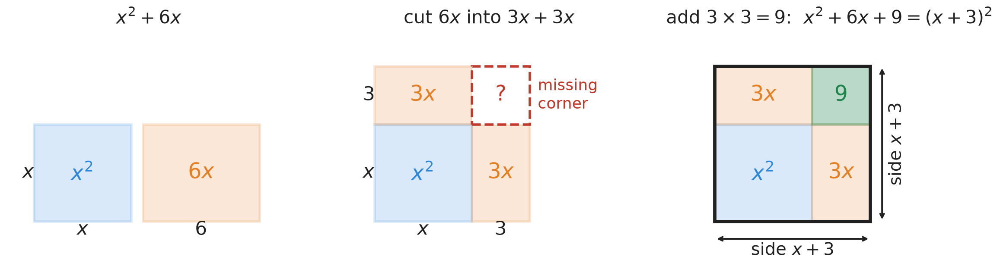
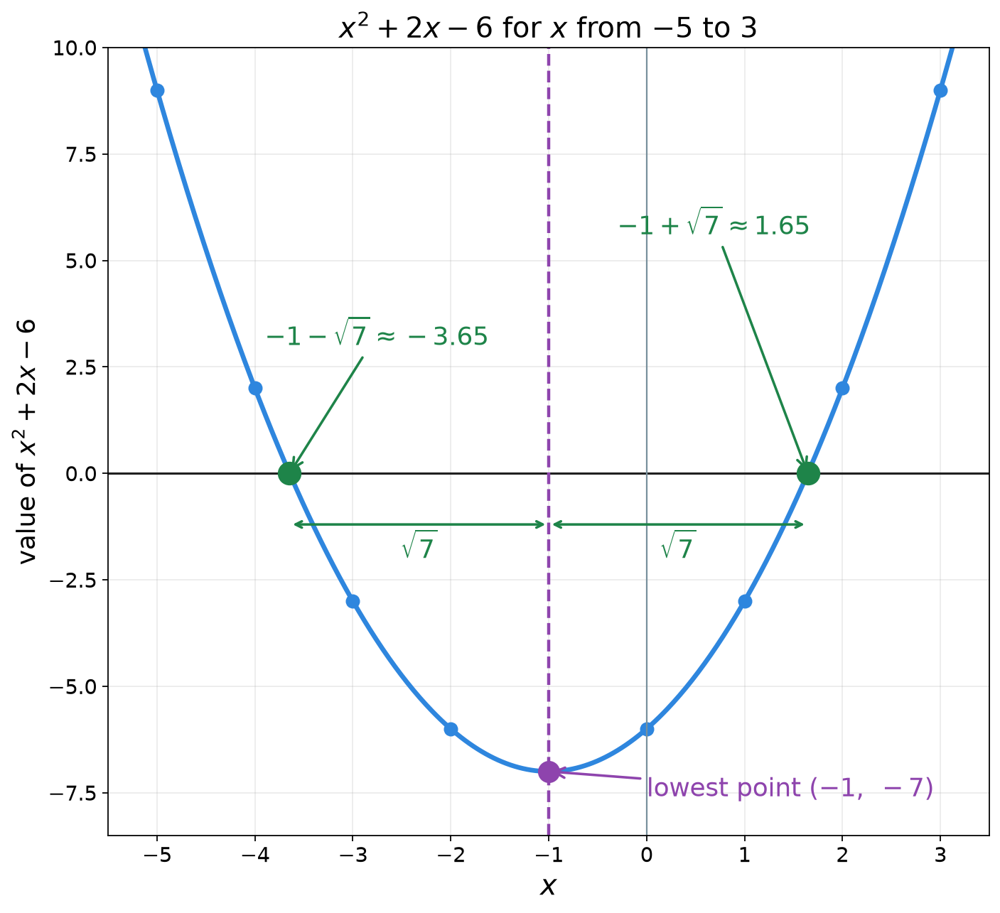
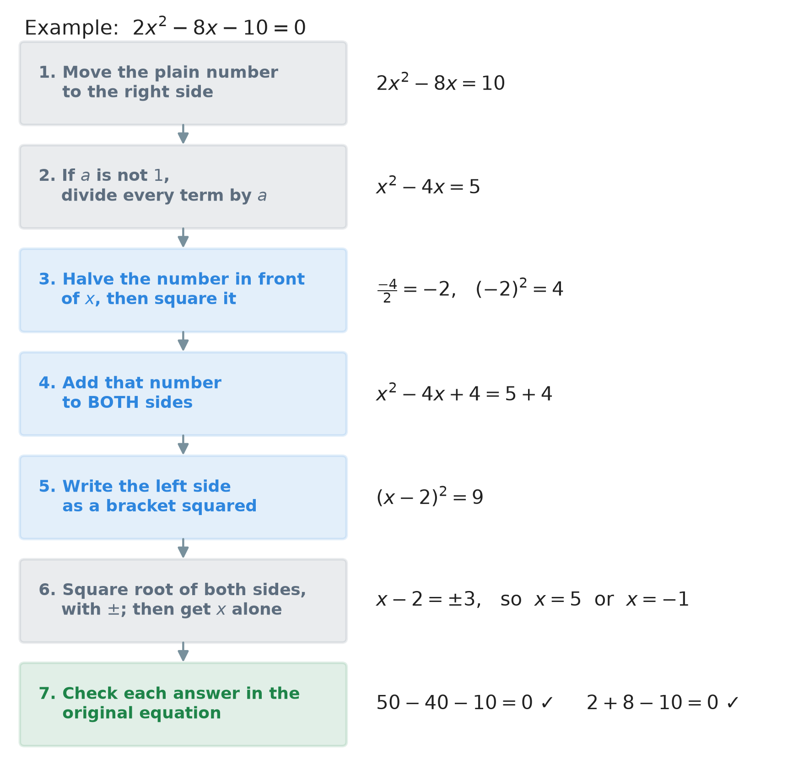

# 31. Solving quadratic equations by completing the square

**What this chapter teaches**
How to solve a quadratic equation such as $x^{2} + 2x - 6 = 0$, which cannot be factored with
whole numbers. We add one well-chosen number to both sides. That turns the left side into a
bracket squared, and a bracket squared is undone with a square root.

**Before you start**
You need quadratic equations and factoring from
[Chapter 30](./../30_Solving_Quadratics_By_Factoring/30_Solving_Quadratics_By_Factoring.md),
the square of a sum $(a + b)^{2} = a^{2} + 2ab + b^{2}$ from
[Chapter 25, section 3.3](./../25_Simplifying_Expressions/25_Simplifying_Expressions.md#33-the-rule-for-the-square-of-a-sum),
and solving $x^{2} = k$ with $\pm$ from
[Chapter 24, section 8](./../24_Roots/24_Roots.md#8-using-a-root-to-solve-an-equation).
Section 4.3 uses fractions with a common denominator, as in
[Chapter 15, section 3](./../15_Adding_And_Subtracting_Fractions/15_Adding_And_Subtracting_Fractions.md#3-when-the-bottom-numbers-are-different).

---

## Table of contents

1. [When factoring does not work](#1-when-factoring-does-not-work)
2. [Perfect square trinomials](#2-perfect-square-trinomials)
3. [Why it is called completing the square](#3-why-it-is-called-completing-the-square)
4. [Solving when there is no number in front of $x^{2}$](#4-solving-when-there-is-no-number-in-front-of-x2)
5. [Solving when a number stands in front of $x^{2}$](#5-solving-when-a-number-stands-in-front-of-x2)
6. [What the answers look like in a picture](#6-what-the-answers-look-like-in-a-picture)
7. [The whole method, and three traps](#7-the-whole-method-and-three-traps)
8. [Glossary](#8-glossary)
9. [Check your understanding](#9-check-your-understanding)
10. [Important notes](#10-important-notes)

---

## 1. When factoring does not work

### 1.1 An equation with no factor pair

Try to solve $x^{2} + 2x - 6 = 0$ by factoring, as in
[Chapter 30, section 4](./../30_Solving_Quadratics_By_Factoring/30_Solving_Quadratics_By_Factoring.md#4-solving-the-simple-case).
Here $b = 2$ and $c = -6$. We need two whole numbers that multiply to $-6$ and add to $2$. The
product is negative, so the signs are opposite:

| Pair | Product | Sum |
| --- | --- | --- |
| $1$ and $-6$ | $-6$ | $-5$ |
| $-1$ and $6$ | $-6$ | $5$ |
| $2$ and $-3$ | $-6$ | $-1$ |
| $-2$ and $3$ | $-6$ | $1$ |

No sum is $2$. So $x^{2} + 2x - 6$ **cannot be factored with whole numbers**. Chapter 30's method
stops here.

This is not rare. Factoring works only when the answers are tidy numbers. Most quadratic
equations do not have tidy answers. We need a method that always reaches the end.

### 1.2 One shape we can already solve

There is one kind of quadratic equation the book can already solve: **a bracket squared equals a
number**. For example:

$$
(x + 3)^{2} = 16
$$

Think of the bracket $x + 3$ as one number. That number, squared, gives $16$. So it is $4$ or
$-4$
([Chapter 24, section 8.1](./../24_Roots/24_Roots.md#81-the-missing-move-added-to-the-toolbox)):

$$
x + 3 = \pm 4
$$

Now we have two small equations:

* $x + 3 = 4$, so $x = 4 - 3 = 1$.
* $x + 3 = -4$, so $x = -4 - 3 = -7$.

The $x$ appears only **once** in $(x + 3)^{2}$. That is why this shape is easy. In
$x^{2} + 6x - 7$, the letter appears twice, and the two terms do not join
([Chapter 30, section 1.4](./../30_Solving_Quadratics_By_Factoring/30_Solving_Quadratics_By_Factoring.md#14-why-the-old-methods-do-not-work)).

### 1.3 The plan

So here is the plan of the whole chapter:

**Change the left side into a bracket squared. Then take the square root of both sides.**

The tool for the change is the subject of section 2.

### Summary of section 1

* $x^{2} + 2x - 6$ has no whole-number factor pair, so factoring fails.
* A bracket squared equal to a number, such as $(x + 3)^{2} = 16$, is easy: take the square root
  with $\pm$.
* The plan: turn any quadratic into that shape.

---

## 2. Perfect square trinomials

### 2.1 What a squared bracket looks like when you open it

[Chapter 25, section 3.3](./../25_Simplifying_Expressions/25_Simplifying_Expressions.md#33-the-rule-for-the-square-of-a-sum)
showed

$$
(a + b)^{2} = a^{2} + 2ab + b^{2}
$$

Put $a = x$ and $b = 3$:

$$
(x + 3)^{2} = x^{2} + 2 \times x \times 3 + 3^{2} = x^{2} + 6x + 9
$$

Now with a general number $d$ in place of $3$:

$$
(x + d)^{2} = x^{2} + 2dx + d^{2}
$$

**In words:** a bracket $x + d$, squared, gives $x^{2}$, then twice $d$ times $x$, then $d$
squared.

* $x$ — the letter.
* $d$ — the plain number inside the bracket. It can be positive or negative.
* $2d$ — the number in front of $x$ (the
  [coefficient](./../18_Introduction_To_Algebra_Variables/18_Introduction_To_Algebra_Variables.md#33-the-number-in-front-has-a-name)
  of $x$).
* $d^{2}$ — the plain number at the end.

### 2.2 A name for this shape

**Definition — perfect square trinomial.** A **perfect square trinomial** is a three-term
expression that is equal to a bracket squared. $x^{2} + 6x + 9$ is one, because it equals
$(x + 3)^{2}$.

(*Trinomial* means three terms;
[Chapter 27, section 5.1](./../27_Introduction_To_Polynomials/27_Introduction_To_Polynomials.md#51-by-the-number-of-terms).)

Look again at the two numbers in $x^{2} + 2dx + d^{2}$. The middle number is $2d$. Half of it
is $d$. And $d$ squared is the last number. So there is a simple test:

**Half of the middle number, squared, gives the last number.**

| Expression | Half of the middle number | Squared | Last number | Perfect square? |
| --- | --- | --- | --- | --- |
| $x^{2} + 6x + 9$ | $3$ | $9$ | $9$ | yes, $(x + 3)^{2}$ |
| $x^{2} + 10x + 25$ | $5$ | $25$ | $25$ | yes, $(x + 5)^{2}$ |
| $x^{2} + 6x + 5$ | $3$ | $9$ | $5$ | no |

### 2.3 With a minus sign

The number $d$ may be negative. Take $d = -2$. Use the same rule with $a = x$ and $b = -2$:

$$
(x - 2)^{2} = x^{2} + 2 \times x \times (-2) + (-2)^{2} = x^{2} - 4x + 4
$$

The middle number is $-4$. Half of it is $-2$. And $(-2)^{2} = 4$: the last number is
**positive**, because a negative number times a negative number is positive
([Chapter 9, section 5.2](./../9_Negative_Numbers/9_Negative_Numbers.md#52-a-negative-number-times-a-negative-number)).

So the sign inside the bracket is the sign of the middle number. The last number of a perfect
square trinomial is never negative.

### 2.4 The missing number

Now the key question of the chapter. We have only **two** terms:

$$
x^{2} + 6x
$$

Which number must we add to make it a perfect square trinomial?

The middle number is $6$. Half of it is $3$. Squared, that is $9$. So we add $9$:

$$
x^{2} + 6x + 9 = (x + 3)^{2}
$$

In general, call the middle number $b$. It must be $2d$, so $d$ is half of it:
$d = \frac{b}{2}$. The number to add is $d^{2}$:

$$
x^{2} + bx + \left(\frac{b}{2}\right)^{2} = \left(x + \frac{b}{2}\right)^{2}
$$

**In words:** take the number in front of $x$, cut it in half, and square it. Add that number,
and the expression becomes a bracket squared. The bracket holds $x$ plus half of $b$.

* $b$ — the coefficient of $x$, with its sign.
* $\frac{b}{2}$ — half of it. This number goes inside the bracket.
* $\left(\frac{b}{2}\right)^{2}$ — half of it, squared. This is the number we add.

Adding this number is called **completing the square**.

> **Note.** This rule needs exactly $x^{2}$ at the front, with no number in front of it. Section 5
> shows what to do when there is one.

### Summary of section 2

* $(x + d)^{2} = x^{2} + 2dx + d^{2}$.
* A **perfect square trinomial** equals a bracket squared. Test: half of the middle number,
  squared, is the last number.
* The sign inside the bracket is the sign of the middle number.
* To complete $x^{2} + bx$, add $\left(\frac{b}{2}\right)^{2}$. It becomes
  $\left(x + \frac{b}{2}\right)^{2}$.

---

## 3. Why it is called completing the square

The name comes from a picture. An expression such as $x^{2} + 6x$ can be drawn as areas
([area of a rectangle, Chapter 6, section 3.1](./../6_The_Distributive_Property/6_The_Distributive_Property.md#31-area-is-just-counting-squares)).

* $x^{2}$ is a square with side $x$.
* $6x$ is a strip, $6$ wide and $x$ long.

Cut the strip into two equal halves. Each half is $3$ wide and $x$ long, so each has area $3x$.
Put one half on top of the square and one half on its right side. The shape is now almost a big
square. Only one corner is empty. That corner is $3$ by $3$, so its area is $9$.

    

**Figure 1 — Left: $x^{2}$ and $6x$. Middle: the strip $6x$ is cut into two strips $3x$. They fit
around the square, but the corner is missing. Right: add the corner, $3 \times 3 = 9$. Now the
shape is one full square with side $x + 3$. So $x^{2} + 6x + 9 = (x + 3)^{2}$.**

This is exactly the rule of section 2.4. "Half of $6$" is the width of each strip. "Squared" is
the area of the missing corner. We **complete** the square by adding the corner.

The picture also shows why the number must be **squared**: the corner is a square, $3$ wide and
$3$ tall.

### Summary of section 3

* $x^{2}$ is a square; $bx$ is a strip, $b$ wide.
* Cut the strip in half and put the halves on two sides of the square.
* One corner is missing. Its area is $\left(\frac{b}{2}\right)^{2}$.
* Adding the corner makes a full square with side $x + \frac{b}{2}$.

---

## 4. Solving when there is no number in front of $x^{2}$

In this section $a = 1$.

### 4.1 Whole-number answers: $x^{2} + 6x - 7 = 0$

**Step 1 — move the plain number to the right side.** Add $7$ to both sides:

$$
x^{2} + 6x = 7
$$

We do this to make room. The left side must hold only $x^{2}$ and the $x$ term, so that we can
complete it.

**Step 2 — find the number to add.** $b = 6$. Half of it is $\frac{6}{2} = 3$. Squared,
$3^{2} = 9$.

**Step 3 — add $9$ to both sides.** The equation stays true, because we do the same thing to
both sides
([Chapter 20, section 2.2](./../20_Solving_Equations/20_Solving_Equations.md#22-the-four-properties-of-equality)):

$$
x^{2} + 6x + 9 = 7 + 9
$$

$$
x^{2} + 6x + 9 = 16
$$

**Step 4 — write the left side as a bracket squared.** Half of $b$ is $3$, so:

$$
(x + 3)^{2} = 16
$$

**Step 5 — take the square root of both sides, with $\pm$.**

$$
x + 3 = \pm \sqrt{16}
$$

$$
x + 3 = \pm 4
$$

**Step 6 — get $x$ alone.**

* $x + 3 = 4$, so $x = 4 - 3 = 1$.
* $x + 3 = -4$, so $x = -4 - 3 = -7$.

**Step 7 — check both answers in the original equation.**

$$
1^{2} + 6 \times 1 - 7 = 1 + 6 - 7 = 0 \quad \checkmark
$$

$$
(-7)^{2} + 6 \times (-7) - 7 = 49 - 42 - 7 = 0 \quad \checkmark
$$

This equation could also be factored: $(x + 7)(x - 1) = 0$ gives the same $-7$ and $1$. Both
methods agree. But completing the square did not need a factor pair. That is its advantage.

### 4.2 Answers with a square root: $x^{2} + 2x - 6 = 0$

This is the equation that factoring could not solve in section 1.1.

**Step 1 — move the plain number.** Add $6$ to both sides:

$$
x^{2} + 2x = 6
$$

**Step 2 — find the number to add.** $b = 2$. Half of it is $\frac{2}{2} = 1$. Squared,
$1^{2} = 1$.

**Step 3 — add $1$ to both sides.**

$$
x^{2} + 2x + 1 = 6 + 1
$$

$$
x^{2} + 2x + 1 = 7
$$

**Step 4 — bracket squared.**

$$
(x + 1)^{2} = 7
$$

**Step 5 — square root, with $\pm$.** $7$ is not a perfect square, so its root stays as a
symbol:

$$
x + 1 = \pm \sqrt{7}
$$

**Step 6 — get $x$ alone.** Subtract $1$ from both sides:

$$
x = -1 \pm \sqrt{7}
$$

This is two answers in one line:

$$
x = -1 + \sqrt{7} \quad \text{or} \quad x = -1 - \sqrt{7}
$$

These are the **exact** answers. $\sqrt{7}$ is an
[irrational number](./../24_Roots/24_Roots.md#32-a-decimal-that-never-stops-and-never-repeats),
so no decimal is exact
([Chapter 24, section 3.3](./../24_Roots/24_Roots.md#33-so-the-symbol-is-the-exact-answer)).
Rounded to two decimal places, $\sqrt{7} \approx 2.65$, so:

$$
x \approx -1 + 2.65 = 1.65 \qquad x \approx -1 - 2.65 = -3.65
$$

This is why factoring failed: the answers are not whole numbers, so no whole-number brackets
could give them.

**Step 7 — check.** Check $x = -1 + \sqrt{7}$ exactly. First the square, with the rule of
section 2.1 ($a = -1$, $b = \sqrt{7}$), and $(\sqrt{7})^{2} = 7$:

$$
(-1 + \sqrt{7})^{2} = (-1)^{2} + 2 \times (-1) \times \sqrt{7} + 7 = 1 - 2\sqrt{7} + 7 = 8 - 2\sqrt{7}
$$

Then the middle term:

$$
2 \times (-1 + \sqrt{7}) = -2 + 2\sqrt{7}
$$

Now the whole left side:

$$
(8 - 2\sqrt{7}) + (-2 + 2\sqrt{7}) - 6
$$

$$
= 8 - 2 - 6 - 2\sqrt{7} + 2\sqrt{7}
$$

$$
= 0 + 0 = 0 \quad \checkmark
$$

The two roots cancel. The other answer, $-1 - \sqrt{7}$, checks in the same way.

### 4.3 An odd middle number: $x^{2} + 5x + 3 = 0$

When $b$ is odd, half of it is a fraction. Nothing new happens; we only work with fractions.

**Step 1 — move the plain number.** Subtract $3$ from both sides:

$$
x^{2} + 5x = -3
$$

**Step 2 — find the number to add.** $b = 5$. Half of it is $\frac{5}{2}$. Squared, the top and
the bottom are both squared
([Chapter 25, section 2.3](./../25_Simplifying_Expressions/25_Simplifying_Expressions.md#23-the-rule)):

$$
\left(\frac{5}{2}\right)^{2} = \frac{5^{2}}{2^{2}} = \frac{25}{4}
$$

**Step 3 — add $\frac{25}{4}$ to both sides.** On the right, write $-3$ as quarters first:
$-3 = -\frac{12}{4}$.

$$
x^{2} + 5x + \frac{25}{4} = -\frac{12}{4} + \frac{25}{4}
$$

$$
x^{2} + 5x + \frac{25}{4} = \frac{13}{4}
$$

**Step 4 — bracket squared.** Half of $b$ is $\frac{5}{2}$:

$$
\left(x + \frac{5}{2}\right)^{2} = \frac{13}{4}
$$

**Step 5 — square root, with $\pm$.** A root can be split across a division
([Chapter 24, section 4.5](./../24_Roots/24_Roots.md#45-a-root-can-be-split-across-a-division-too)),
and $\sqrt{4} = 2$:

$$
x + \frac{5}{2} = \pm \sqrt{\frac{13}{4}} = \pm \frac{\sqrt{13}}{\sqrt{4}} = \pm \frac{\sqrt{13}}{2}
$$

**Step 6 — get $x$ alone.** Subtract $\frac{5}{2}$ from both sides. Both fractions have the
bottom $2$, so they go over one bar:

$$
x = -\frac{5}{2} \pm \frac{\sqrt{13}}{2} = \frac{-5 \pm \sqrt{13}}{2}
$$

So $x = \frac{-5 + \sqrt{13}}{2}$ or $x = \frac{-5 - \sqrt{13}}{2}$. In decimals, about $-0.70$
and $-4.30$.

**Step 7 — check, with decimals.** With $x \approx -0.697$:
$0.486 - 3.486 + 3 = 0$, to the accuracy of the rounding. The other answer works the same way.

> **Note.** Keep the fractions. Do not change $\frac{5}{2}$ into $2.5$ and $\frac{25}{4}$ into
> $6.25$ halfway. Here those decimals happen to be exact, but with other numbers they are not,
> and a rounded number spoils the exact answer.

### Summary of section 4

* Move the plain number to the right. Then add $\left(\frac{b}{2}\right)^{2}$ to **both** sides.
* The left side becomes $\left(x + \frac{b}{2}\right)^{2}$. Take the square root with $\pm$.
* Answers can be whole numbers, roots like $-1 \pm \sqrt{7}$, or fractions with roots.
* When $b$ is odd, work with fractions, not rounded decimals.

---

## 5. Solving when a number stands in front of $x^{2}$

### 5.1 Why we must divide first

Take $2x^{2} + 8x - 10 = 0$. Move the $10$: $2x^{2} + 8x = 10$. If we use the rule of section 2.4
straight away, we would add $\left(\frac{8}{2}\right)^{2} = 16$, and hope that
$2x^{2} + 8x + 16$ is $(x + 4)^{2}$. Test it with $x = 1$:

$$
2 \times 1^{2} + 8 \times 1 + 16 = 2 + 8 + 16 = 26
$$

$$
(1 + 4)^{2} = 5^{2} = 25
$$

$26$ is not $25$. It fails because $(x + 4)^{2}$ starts with $x^{2}$, not with $2x^{2}$. The rule
of section 2.4 was built for an expression that starts with exactly $x^{2}$.

So first we make the number in front of $x^{2}$ equal to $1$. We divide **every** term on
**both** sides by $a$. Dividing both sides by the same number (not $0$) keeps the equation true
([Chapter 20, section 2.2](./../20_Solving_Equations/20_Solving_Equations.md#22-the-four-properties-of-equality)).
And $a$ is never $0$ in a quadratic equation
([Chapter 30, section 1.2](./../30_Solving_Quadratics_By_Factoring/30_Solving_Quadratics_By_Factoring.md#12-standard-form)).

Here, divide by $2$: $x^{2} + 4x = 5$. Then add $\left(\frac{4}{2}\right)^{2} = 4$:
$(x + 2)^{2} = 9$, so $x + 2 = \pm 3$, and $x = 1$ or $x = -5$.

### 5.2 A full example: $2x^{2} - 8x - 10 = 0$

**Step 1 — move the plain number.** Add $10$ to both sides:

$$
2x^{2} - 8x = 10
$$

**Step 2 — divide every term by $a = 2$.**

$$
\frac{2x^{2}}{2} - \frac{8x}{2} = \frac{10}{2}
$$

$$
x^{2} - 4x = 5
$$

**Step 3 — find the number to add.** Now $b = -4$, with its minus sign. Half of it is
$\frac{-4}{2} = -2$. Squared, $(-2)^{2} = 4$.

**Step 4 — add $4$ to both sides.**

$$
x^{2} - 4x + 4 = 5 + 4
$$

$$
x^{2} - 4x + 4 = 9
$$

**Step 5 — bracket squared.** Half of $b$ is $-2$, so the bracket is $x + (-2)$, which is
$x - 2$ (section 2.3):

$$
(x - 2)^{2} = 9
$$

**Step 6 — square root with $\pm$, then get $x$ alone.**

$$
x - 2 = \pm 3
$$

* $x - 2 = 3$, so $x = 2 + 3 = 5$.
* $x - 2 = -3$, so $x = 2 - 3 = -1$.

**Step 7 — check in the original equation.**

$$
2 \times 5^{2} - 8 \times 5 - 10 = 2 \times 25 - 40 - 10 = 50 - 40 - 10 = 0 \quad \checkmark
$$

$$
2 \times (-1)^{2} - 8 \times (-1) - 10 = 2 \times 1 + 8 - 10 = 2 + 8 - 10 = 0 \quad \checkmark
$$

### Summary of section 5

* The rule of section 2.4 works only when the equation starts with exactly $x^{2}$.
* If $a$ is not $1$, divide **every** term on both sides by $a$ first.
* Read $b$ after dividing, with its sign. A negative $b$ gives a minus inside the bracket.

---

## 6. What the answers look like in a picture

### 6.1 A value for every $x$

For each number $x$, the expression $x^{2} + 2x - 6$ has a value. Here are some:

| $x$ | $-5$ | $-4$ | $-3$ | $-2$ | $-1$ | $0$ | $1$ | $2$ | $3$ |
| --- | --- | --- | --- | --- | --- | --- | --- | --- | --- |
| $x^{2} + 2x - 6$ | $9$ | $2$ | $-3$ | $-6$ | $-7$ | $-6$ | $-3$ | $2$ | $9$ |

Draw a dot for each column: go right (or left) to the number $x$, then up by the value, or down
if the value is negative. Join the dots with a smooth line. Such a picture is called a **graph**
of the expression.

    

**Figure 2 — The blue curve shows the value of $x^{2} + 2x - 6$ for every $x$. The equation
$x^{2} + 2x - 6 = 0$ asks where the value is $0$: the two green points where the curve crosses
the black zero line. They sit at the same distance, $\sqrt{7}$, on each side of the purple line.**

### 6.2 What the picture shows

**The solutions are the crossing points.** Solving $x^{2} + 2x - 6 = 0$ means finding where the
value is $0$. On the picture, that is where the curve crosses the zero line. The table agrees:
the value changes from $2$ to $-3$ between $x = -4$ and $x = -3$, and from $-3$ to $2$ between
$x = 1$ and $x = 2$. The answers $-3.65$ and $1.65$ are in those two gaps.

**The lowest point comes from the bracket.** Completing the square gave
$x^{2} + 2x - 6 = (x + 1)^{2} - 7$ (add $1$ and take it away again: $x^{2} + 2x + 1 - 1 - 6$). A
square is never negative. So $(x + 1)^{2}$ is smallest, $0$, when $x = -1$. Then the value is
$0 - 7 = -7$. That is the lowest point of the curve, $(-1, -7)$.

**The two answers are a mirror pair.** The answers are $-1 + \sqrt{7}$ and $-1 - \sqrt{7}$. Both
are $\sqrt{7}$ away from $-1$, one to the right and one to the left. The curve is the same on
both sides of the dashed line $x = -1$.

This U-shaped curve is called a **parabola**. Its lowest point is called its **vertex**. The line
down its middle is called its **axis of symmetry**. This chapter uses the picture only to see the
answers.

### Summary of section 6

* The value table, drawn as dots and joined, is the graph of the expression.
* The solutions of the equation are where the graph crosses the zero line.
* $(x + 1)^{2} - 7$ is smallest at $x = -1$, so the lowest point is $(-1, -7)$.
* The two answers are equally far from that middle line.

---

## 7. The whole method, and three traps

### 7.1 The method in one picture

    

**Figure 3 — The seven steps, done on $2x^{2} - 8x - 10 = 0$. The three blue steps are new in
this chapter. The grey steps come from earlier chapters. The green step is the check.**

### 7.2 Trap 1: adding to one side only

In $x^{2} + 6x = 7$, writing $x^{2} + 6x + 9 = 7$ is wrong. The left side grew by $9$ and the right
side did not, so the two sides are no longer equal. Always write the added number on **both**
sides: $x^{2} + 6x + 9 = 7 + 9$.

### 7.3 Trap 2: forgetting the $\pm$

From $(x + 1)^{2} = 7$, writing only $x + 1 = \sqrt{7}$ loses half of the answers. The bracket
can be $\sqrt{7}$ or $-\sqrt{7}$, because both square to $7$. Write $x + 1 = \pm \sqrt{7}$.

### 7.4 Trap 3: a negative number on the right

Solve $x^{2} + 2x + 5 = 0$. Move the $5$: $x^{2} + 2x = -5$. Add $1$ to both sides:

$$
(x + 1)^{2} = -4
$$

A square is never negative, so no number squares to $-4$
([Chapter 24, section 8.3](./../24_Roots/24_Roots.md#83-when-there-is-no-answer)). This equation
has **no solution**. Completing the square always reaches the end, but sometimes the end is "no
solution". In a picture, the curve of $x^{2} + 2x + 5$ never reaches the zero line: its lowest
value is $0 + 4 = 4$, at $x = -1$.

So when the right side is negative after step 5, stop and write "no solution".

### Summary of section 7

* Seven steps: move, divide by $a$, halve and square, add to both sides, bracket, root with $\pm$,
  check.
* Add the new number to **both** sides.
* Write the $\pm$, or you lose an answer.
* If the bracket squared equals a negative number, there is no solution.

---

## 8. Glossary

* **Perfect square trinomial** — a three-term expression equal to a bracket squared, such as
  $x^{2} + 6x + 9 = (x + 3)^{2}$.
* **Completing the square** — adding $\left(\frac{b}{2}\right)^{2}$ to $x^{2} + bx$ so that it
  becomes $\left(x + \frac{b}{2}\right)^{2}$; also the name of the method of solving built on it.
* **Graph (of an expression)** — a picture with one dot for every $x$, placed as high as the
  value of the expression, joined into a line.
* **Parabola** — the U-shaped curve that is the graph of a quadratic expression.
* **Vertex** — the lowest point of a U-shaped parabola.
* **Axis of symmetry** — the vertical line through the vertex; the parabola is the same on both
  sides of it.

**Note.** Every other term was defined earlier. **Quadratic equation**, **root** and **zero** of
an equation are in
[Chapter 30](./../30_Solving_Quadratics_By_Factoring/30_Solving_Quadratics_By_Factoring.md#7-glossary);
**expand** is in
[Chapter 25](./../25_Simplifying_Expressions/25_Simplifying_Expressions.md#7-glossary);
**irrational number** and **perfect square** are in
[Chapter 24](./../24_Roots/24_Roots.md#9-glossary);
**binomial**, **trinomial** and **standard form** are in
[Chapter 27](./../27_Introduction_To_Polynomials/27_Introduction_To_Polynomials.md#8-glossary);
**coefficient** is in
[Chapter 18](./../18_Introduction_To_Algebra_Variables/18_Introduction_To_Algebra_Variables.md#33-the-number-in-front-has-a-name).

---

## 9. Check your understanding

**Question 1.** Solve $x^{2} + 4x - 12 = 0$ by completing the square.

Answer

Move the $12$: $x^{2} + 4x = 12$.

Half of $4$ is $2$; $2^{2} = 4$. Add $4$ to both sides: $x^{2} + 4x + 4 = 16$.

Bracket: $(x + 2)^{2} = 16$, so $x + 2 = \pm 4$.

$x = 4 - 2 = 2$ or $x = -4 - 2 = -6$. **$x = 2$ or $x = -6$.**

Check: $4 + 8 - 12 = 0$ $\checkmark$ and $36 - 24 - 12 = 0$ $\checkmark$.

**Question 2.** Solve $x^{2} - 10x + 21 = 0$.

Answer

Move the $21$: $x^{2} - 10x = -21$.

$b = -10$. Half of it is $-5$; $(-5)^{2} = 25$. Add $25$ to both sides:
$x^{2} - 10x + 25 = -21 + 25 = 4$.

Bracket: $(x - 5)^{2} = 4$, so $x - 5 = \pm 2$.

$x = 5 + 2 = 7$ or $x = 5 - 2 = 3$. **$x = 7$ or $x = 3$.**

Check: $49 - 70 + 21 = 0$ $\checkmark$ and $9 - 30 + 21 = 0$ $\checkmark$.

**Question 3.** Solve $x^{2} + 4x - 7 = 0$.

Answer

Move the $7$: $x^{2} + 4x = 7$. Add $4$: $x^{2} + 4x + 4 = 11$.

Bracket: $(x + 2)^{2} = 11$, so $x + 2 = \pm \sqrt{11}$.

**$x = -2 + \sqrt{11}$ or $x = -2 - \sqrt{11}$**, about $1.32$ and $-5.32$.

$11$ is not a perfect square, so the root stays in the exact answer.

**Question 4.** Solve $x^{2} - 3x - 1 = 0$.

Answer

Move the $1$: $x^{2} - 3x = 1$.

$b = -3$. Half of it is $-\frac{3}{2}$; squared, $\frac{9}{4}$. Add it to both sides:

$$
x^{2} - 3x + \frac{9}{4} = \frac{4}{4} + \frac{9}{4} = \frac{13}{4}
$$

Bracket: $\left(x - \frac{3}{2}\right)^{2} = \frac{13}{4}$, so
$x - \frac{3}{2} = \pm \frac{\sqrt{13}}{2}$.

**$x = \frac{3 + \sqrt{13}}{2}$ or $x = \frac{3 - \sqrt{13}}{2}$**, about $3.30$ and $-0.30$.

**Question 5.** Solve $3x^{2} + 12x - 15 = 0$.

Answer

Move the $15$: $3x^{2} + 12x = 15$.

Divide every term by $3$: $x^{2} + 4x = 5$.

Add $4$: $x^{2} + 4x + 4 = 9$, so $(x + 2)^{2} = 9$ and $x + 2 = \pm 3$.

$x = 3 - 2 = 1$ or $x = -3 - 2 = -5$. **$x = 1$ or $x = -5$.**

Check: $3 + 12 - 15 = 0$ $\checkmark$ and $75 - 60 - 15 = 0$ $\checkmark$.

**Question 6.** Solve $2x^{2} - 6x - 8 = 0$.

Answer

Move the $8$: $2x^{2} - 6x = 8$. Divide by $2$: $x^{2} - 3x = 4$.

Half of $-3$ is $-\frac{3}{2}$; squared, $\frac{9}{4}$. Add it:

$$
x^{2} - 3x + \frac{9}{4} = \frac{16}{4} + \frac{9}{4} = \frac{25}{4}
$$

Bracket: $\left(x - \frac{3}{2}\right)^{2} = \frac{25}{4}$, so $x - \frac{3}{2} = \pm \frac{5}{2}$.

$x = \frac{3}{2} + \frac{5}{2} = \frac{8}{2} = 4$, or $x = \frac{3}{2} - \frac{5}{2} = -\frac{2}{2} = -1$.

**$x = 4$ or $x = -1$.** Check: $32 - 24 - 8 = 0$ $\checkmark$ and $2 + 6 - 8 = 0$ $\checkmark$.

**Question 7.** Which number completes the square in $x^{2} - 12x$? And in $x^{2} + 7x$? Write
each result as a bracket squared.

Answer

* $x^{2} - 12x$: half of $-12$ is $-6$; $(-6)^{2} = 36$. So
  $x^{2} - 12x + 36 = (x - 6)^{2}$.
* $x^{2} + 7x$: half of $7$ is $\frac{7}{2}$; squared, $\frac{49}{4}$. So
  $x^{2} + 7x + \frac{49}{4} = \left(x + \frac{7}{2}\right)^{2}$.

The added number is positive both times, even though $-12$ is negative.

**Question 8.** A student solves $2x^{2} + 8x = 10$ by adding $16$ to both sides, because
$\left(\frac{8}{2}\right)^{2} = 16$. Why is this wrong?

Answer

The rule "add $\left(\frac{b}{2}\right)^{2}$" works only when the expression starts with exactly
$x^{2}$. Here it starts with $2x^{2}$, and $2x^{2} + 8x + 16$ is not a bracket squared (at $x = 1$
it gives $26$, but $(1 + 4)^{2} = 25$). The student must divide by $2$ first:
$x^{2} + 4x = 5$, then add $4$. The answers are $x = 1$ and $x = -5$.

**Question 9.** Solve $x^{2} + 4x + 10 = 0$.

Answer

Move the $10$: $x^{2} + 4x = -10$. Add $4$: $x^{2} + 4x + 4 = -6$, so $(x + 2)^{2} = -6$.

No number squared gives $-6$. **There is no solution.**

---

## 10. Important notes

**The mistakes people actually make.**

* **Adding the new number to the left side only.** The equation stops being true. Write it on
  both sides, every time.
* **Forgetting the $\pm$.** $(x + 1)^{2} = 7$ gives two answers, $-1 + \sqrt{7}$ and
  $-1 - \sqrt{7}$.
* **Not dividing by $a$ first.** $2x^{2} + 8x + 16$ is not a bracket squared. Divide every term by
  $a$ before you halve and square.
* **The wrong sign inside the bracket.** $x^{2} - 4x + 4$ is $(x - 2)^{2}$, not $(x + 2)^{2}$. The
  bracket holds half of $b$, with $b$'s sign.
* **Squaring a fraction wrongly.** $\left(\frac{5}{2}\right)^{2} = \frac{25}{4}$, not
  $\frac{25}{2}$ and not $\frac{10}{4}$. Square the top and the bottom.
* **Rounding too early.** Keep $\frac{25}{4}$ and $\sqrt{7}$ until the end. Round only the final
  answer, if a decimal is wanted.
* **Believing every quadratic equation has two answers.** If the bracket squared equals a
  negative number, there is none.

**Three ideas to keep.**

* **Make the left side a bracket squared.** Then one square root, with $\pm$, finishes the job.
* **The number to add is half of $b$, squared.** The picture says why: it is the missing corner of
  the square.
* **The method never gets stuck.** It ends with two answers, or with "no solution". It does not
  depend on finding a factor pair.

**How this chapter connects to the rest of the book.**
The rule $(x + d)^{2} = x^{2} + 2dx + d^{2}$ is
[Chapter 25, section 3.3](./../25_Simplifying_Expressions/25_Simplifying_Expressions.md#33-the-rule-for-the-square-of-a-sum)
used backwards, just as factoring in
[Chapter 30](./../30_Solving_Quadratics_By_Factoring/30_Solving_Quadratics_By_Factoring.md)
was FOIL used backwards. The last step is
[Chapter 24, section 8](./../24_Roots/24_Roots.md#8-using-a-root-to-solve-an-equation): a square
equal to a number has two roots, or none. The square picture in Figure 1 is the area model of
[Chapter 6, section 3](./../6_The_Distributive_Property/6_The_Distributive_Property.md#3-seeing-the-rule-as-a-rectangle)
and the four pieces of Chapter 25's Figure 2, with one piece missing.

---

- [Back to the book](./../README.md)
- Previous: [30 Solving quadratic equations by factoring](./../30_Solving_Quadratics_By_Factoring/30_Solving_Quadratics_By_Factoring.md)
- Next: [32 Solving higher-degree equations](./../32_Solving_Higher_Degree_Equations/32_Solving_Higher_Degree_Equations.md)
