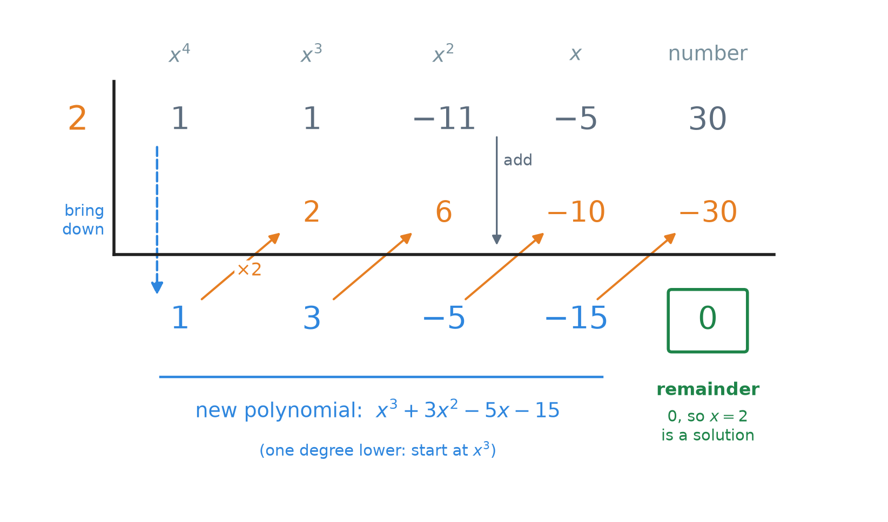
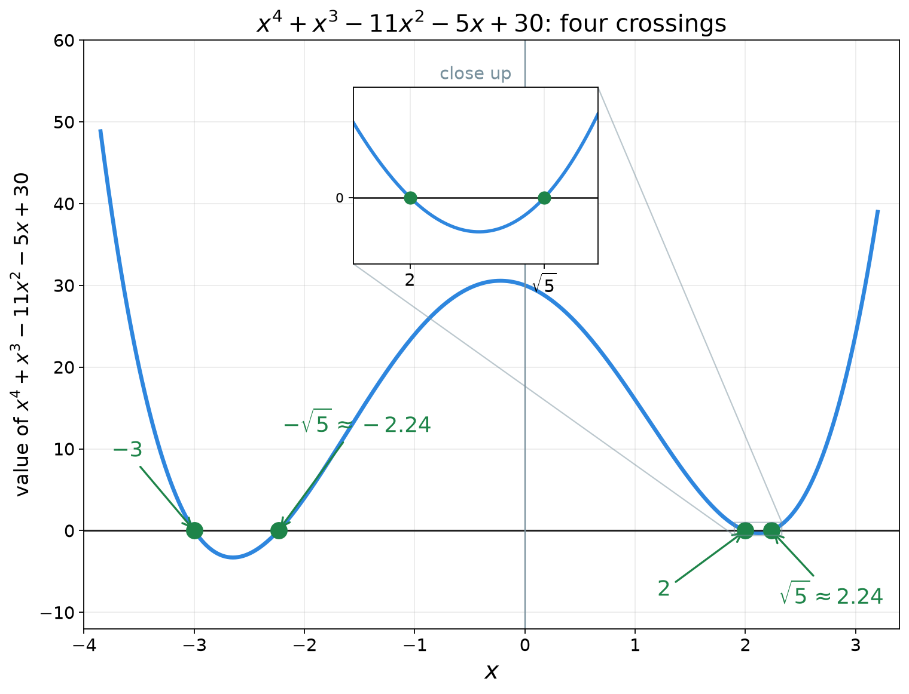
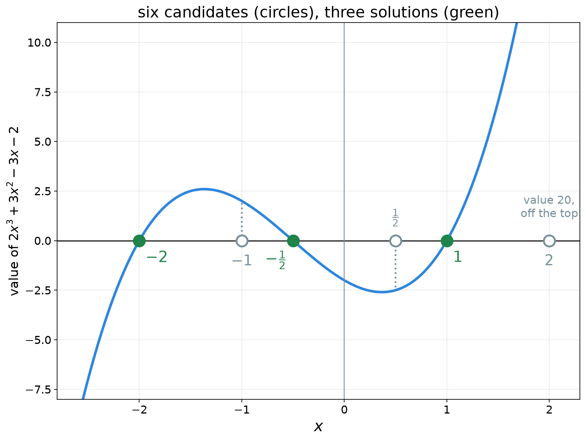
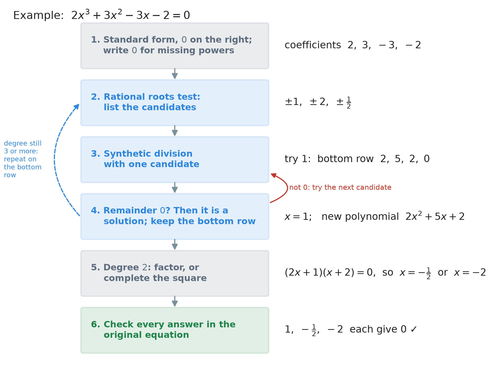

# 32. Solving higher-degree equations: synthetic division and the rational roots test

**What this chapter teaches**
How to solve an equation such as $x^{4} + x^{3} - 11x^{2} - 5x + 30 = 0$, where the largest power
is $3$, $4$ or more. We find one solution, use it to remove one bracket, and repeat until only a
quadratic is left. Two tools do the work: **synthetic division** tests a number quickly, and the
**rational roots test** tells us which numbers are worth testing.

**Before you start**
You need polynomials, degree and standard form from
[Chapter 27](./../27_Introduction_To_Polynomials/27_Introduction_To_Polynomials.md),
multiplying brackets from
[Chapter 29](./../29_Multiplying_Polynomials/29_Multiplying_Polynomials.md),
and both ways of solving a quadratic equation:
[Chapter 30](./../30_Solving_Quadratics_By_Factoring/30_Solving_Quadratics_By_Factoring.md)
(factoring) and
[Chapter 31](./../31_Solving_Quadratics_By_Completing_The_Square/31_Solving_Quadratics_By_Completing_The_Square.md)
(completing the square). Section 6 uses factors and prime factorizations from
[Chapter 12](./../12_Divisibility_And_Prime_Numbers/12_Divisibility_And_Prime_Numbers.md).

---

## Table of contents

1. [Equations of degree three and more](#1-equations-of-degree-three-and-more)
2. [A solution gives a bracket](#2-a-solution-gives-a-bracket)
3. [Synthetic division](#3-synthetic-division)
4. [The remainder is the value of the polynomial](#4-the-remainder-is-the-value-of-the-polynomial)
5. [Solving a quartic all the way](#5-solving-a-quartic-all-the-way)
6. [The rational roots test: which numbers to try](#6-the-rational-roots-test-which-numbers-to-try)
7. [Solving a cubic from nothing](#7-solving-a-cubic-from-nothing)
8. [The whole method](#8-the-whole-method)
9. [Glossary](#9-glossary)
10. [Check your understanding](#10-check-your-understanding)
11. [Important notes](#11-important-notes)

---

## 1. Equations of degree three and more

### 1.1 The new kind of equation

The book can now solve two kinds of polynomial equation:

* **linear** ones, such as $2x + 4 = 0$, where the largest power of $x$ is $1$
  ([Chapter 20](./../20_Solving_Equations/20_Solving_Equations.md));
* **quadratic** ones, such as $x^{2} - 5x + 6 = 0$, where the largest power is $2$
  (Chapters 30 and 31).

This chapter goes further. Here is the equation we will solve in section 5:

$$
x^{4} + x^{3} - 11x^{2} - 5x + 30 = 0
$$

Its largest power is $4$. So its degree is $4$, and it is a **quartic** equation. An equation of
degree $3$ is a **cubic** equation. (Both names are in
[Chapter 27, section 5.2](./../27_Introduction_To_Polynomials/27_Introduction_To_Polynomials.md#52-by-the-degree).)
Together they are called **higher-degree** equations: their degree is higher than $2$.

To **solve** the equation is to find every number $x$ that makes the left side $0$
([Chapter 30, section 1.3](./../30_Solving_Quadratics_By_Factoring/30_Solving_Quadratics_By_Factoring.md#13-what-solving-means)).
Try $x = 2$, one step per line:

$$
2^{4} + 2^{3} - 11 \times 2^{2} - 5 \times 2 + 30
$$

$$
= 16 + 8 - 11 \times 4 - 10 + 30
$$

$$
= 16 + 8 - 44 - 10 + 30
$$

$$
= 0
$$

So $x = 2$ is a solution. A solution is also called a **root** of the equation, or a **zero** of
the polynomial (Chapter 30, section 1.3 again). This chapter uses all three words.

### 1.2 Why the old methods do not reach it

Chapter 30 needs the shape $ax^{2} + bx + c$: three terms, the largest power $2$. Chapter 31
needs the same shape. A quartic has an $x^{4}$ and an $x^{3}$ as well. Neither method knows what
to do with them.

But both methods end the same way: with a quadratic, or with simple brackets. So the plan of this
chapter is:

**Break the big polynomial into smaller pieces, one bracket at a time, until only a quadratic is
left. Then use Chapter 30 or Chapter 31.**

Sections 2 to 4 build the tool that breaks off one bracket.

### 1.3 A short name for a polynomial

We will often talk about "the polynomial" and "its value at some number". Writing
$x^{4} + x^{3} - 11x^{2} - 5x + 30$ every time is long. So we give it a short name:

$$
P(x) = x^{4} + x^{3} - 11x^{2} - 5x + 30
$$

* $P$ — a name, like a label on a box. $P$ is for *polynomial*. Another letter is fine too.
* $(x)$ — tells you that the letter inside the polynomial is $x$. It is **not** a
  multiplication.

Then $P(2)$ means: **put $2$ in the place of every $x$, and work out the value.** That is
evaluating
([Chapter 18, section 6.1](./../18_Introduction_To_Algebra_Variables/18_Introduction_To_Algebra_Variables.md#61-the-three-steps)).
Section 1.1 showed that $P(2) = 0$.

So "$c$ is a root of $P(x)$" can be written in four symbols:

$$
P(c) = 0
$$

**In words:** when we put the number $c$ in the place of $x$, the polynomial gives $0$.

### Summary of section 1

* A cubic equation has degree $3$; a quartic equation has degree $4$.
* A root (or zero, or solution) is a number that makes the polynomial $0$.
* $P(x)$ is a short name for a polynomial; $P(2)$ is its value when $x = 2$.
* The plan: break off one bracket at a time until a quadratic is left.

---

## 2. A solution gives a bracket

### 2.1 From a bracket to a solution

Suppose a polynomial is already written as two pieces multiplied together:

$$
(x - 2)(x^{3} + 3x^{2} - 5x - 15) = 0
$$

(Multiply it out with
[Chapter 29, section 5](./../29_Multiplying_Polynomials/29_Multiplying_Polynomials.md#5-more-than-two-terms)
and you get exactly $x^{4} + x^{3} - 11x^{2} - 5x + 30$. Section 3 will show where the second
bracket comes from.)

Two things multiply to $0$. By the zero product property
([Chapter 30, section 2](./../30_Solving_Quadratics_By_Factoring/30_Solving_Quadratics_By_Factoring.md#2-the-zero-product-property)),
one of them is $0$:

$$
x - 2 = 0 \quad \text{or} \quad x^{3} + 3x^{2} - 5x - 15 = 0
$$

The first one gives $x = 2$. So a bracket $(x - 2)$ gives the solution $2$.

**Watch the sign.** The bracket has a minus, and the solution is positive. In the same way:

| Bracket | Set it to $0$ | Solution |
| --- | --- | --- |
| $(x - 2)$ | $x - 2 = 0$ | $x = 2$ |
| $(x + 3)$ | $x + 3 = 0$ | $x = -3$ |
| $(x - c)$ | $x - c = 0$ | $x = c$ |

The bracket $(x + 3)$ is the same as $(x - (-3))$. So it belongs to the number $-3$.

### 2.2 From a solution to a bracket

The other direction is also true, and it is the one we need:

**Definition — the factor theorem.** A number $c$ is a root of a polynomial $P(x)$ **exactly
when** $(x - c)$ is a factor of $P(x)$:

$$
P(c) = 0 \quad \Longleftrightarrow \quad (x - c) \text{ is a factor of } P(x)
$$

* $c$ — any number.
* $(x - c)$ is a **factor** of $P(x)$ — $P(x)$ can be written as $(x - c)$ times another
  polynomial. This is the same word *factor* as for numbers
  ([Chapter 12, section 1.3](./../12_Divisibility_And_Prime_Numbers/12_Divisibility_And_Prime_Numbers.md#13-one-fact-said-in-three-ways)):
  $3$ is a factor of $12$ because $12 = 3 \times 4$.
* $\Longleftrightarrow$ means "the left side and the right side are true together": if one is
  true, the other is true too.

**In words:** a root gives a bracket, and a bracket gives a root.

Section 2.1 showed why a bracket gives a root. Why a root gives a bracket is shown in section 4.3,
because it needs the tool of section 3.

### 2.3 Why a bracket helps

Look again at section 2.1. After we took out the bracket $(x - 2)$, the other piece was
$x^{3} + 3x^{2} - 5x - 15$. Its degree is $3$, one less than $4$.

That is the whole trick of this chapter. Each root we find lets us take out one bracket, and
each bracket lowers the degree by $1$:

* degree $4$, take out one bracket: degree $3$;
* take out another: degree $2$ — a quadratic, which we can solve.

**Definition — depressed polynomial.** The polynomial that is left after we take out one bracket
$(x - c)$ is called the **depressed polynomial**. Here *depressed* means "pushed down": its degree
is one lower. $x^{3} + 3x^{2} - 5x - 15$ is the depressed polynomial of
$x^{4} + x^{3} - 11x^{2} - 5x + 30$ after taking out $(x - 2)$.

### Summary of section 2

* The bracket $(x - c)$ belongs to the root $c$. $(x + 3)$ belongs to $-3$.
* Factor theorem: $c$ is a root exactly when $(x - c)$ is a factor.
* Taking out one bracket lowers the degree by $1$. What is left is the depressed polynomial.

---

## 3. Synthetic division

### 3.1 Division with a remainder, again

We know $2$ is a root, so $(x - 2)$ is a factor. But how do we find the other piece,
$x^{3} + 3x^{2} - 5x - 15$? We must **divide** the polynomial by $(x - 2)$.

Division with numbers is already in the book
([Chapter 8, section 5.3](./../8_Dividing_Large_Numbers/8_Dividing_Large_Numbers.md#53-the-equation-that-says-what-a-right-answer-is)):

$$
625 = 3 \times 208 + 1
$$

The total equals the divisor times the quotient, plus a remainder. Polynomials work the same way:

$$
P(x) = (x - c) \times Q(x) + r
$$

* $P(x)$ — the polynomial we start with.
* $(x - c)$ — the bracket we divide by.
* $Q(x)$ — the answer of the division, the **quotient**. It is a polynomial with degree one less
  than $P(x)$.
* $r$ — the **remainder**, a plain number.

If $r = 0$, then $P(x) = (x - c) \times Q(x)$, and $(x - c)$ is a factor.

### 3.2 Finding the quotient one number at a time

Let us divide a cubic by $(x - 2)$ and see what happens. Take

$$
x^{3} + 3x^{2} - 5x - 15
$$

The answer $Q(x)$ has degree $2$. We do not know its coefficients yet, so we call them $A$, $B$
and $C$:

$$
x^{3} + 3x^{2} - 5x - 15 = (x - 2)(Ax^{2} + Bx + C) + r
$$

Multiply out the right side, every term with every term
([Chapter 29, section 5](./../29_Multiplying_Polynomials/29_Multiplying_Polynomials.md#5-more-than-two-terms)):

$$
(x - 2)(Ax^{2} + Bx + C) = Ax^{3} + Bx^{2} + Cx - 2Ax^{2} - 2Bx - 2C
$$

Put like terms together:

$$
= Ax^{3} + (B - 2A)x^{2} + (C - 2B)x - 2C
$$

Now we **choose** $A$, $B$, $C$ and $r$ so that the right side is the same polynomial as the
left side. The number in front of each power must be the same on both sides. We go from the
largest power down:

| Power | Left side | Right side | So |
| --- | --- | --- | --- |
| $x^{3}$ | $1$ | $A$ | $A = 1$ |
| $x^{2}$ | $3$ | $B - 2A$ | $B = 3 + 2A = 3 + 2 = 5$ |
| $x$ | $-5$ | $C - 2B$ | $C = -5 + 2B = -5 + 10 = 5$ |
| number | $-15$ | $-2C + r$ | $r = -15 + 2C = -15 + 10 = -5$ |

Look at the last column. **Every line does the same thing:** take the number just found,
multiply it by $2$, and add the next coefficient of the left side.

* $B = 3 + 2 \times 1$
* $C = -5 + 2 \times 5$
* $r = -15 + 2 \times 5$

So

$$
x^{3} + 3x^{2} - 5x - 15 = (x - 2)(x^{2} + 5x + 5) - 5
$$

The remainder is $-5$, not $0$. So $(x - 2)$ is **not** a factor of this cubic, and $2$ is not
one of its roots. You can check: $2^{3} + 3 \times 2^{2} - 5 \times 2 - 15 = 8 + 12 - 10 - 15 = -5$.

The important thing is the pattern: **multiply by $c$, add the next coefficient, again and
again.** We never needed the letters $x$. Only the numbers.

### 3.3 The board

**Synthetic division** is that pattern, written on a small board with numbers only. *Synthetic*
means "put together": we build the answer one number at a time.

Divide $x^{4} + x^{3} - 11x^{2} - 5x + 30$ by $(x - 2)$:

    

**Figure 1 — Read the board from left to right. Bring the $1$ down. Then, again and again:
multiply the last bottom number by $2$ (orange arrow), write the answer in the next column, and
add down that column. The blue numbers are the new polynomial. The green number is the
remainder.**

The four moves:

1. **Bring down** the first coefficient to the bottom row.
2. **Multiply** the newest bottom number by $c$ (here $c = 2$).
3. **Write** the answer in the middle row, in the next column.
4. **Add** that column, top plus middle, and write the sum in the bottom row.

Repeat moves 2 to 4 until you reach the last column. Here is every step:

| Step | Multiply | Add |
| --- | --- | --- |
| bring down | | $1$ |
| column $x^{3}$ | $2 \times 1 = 2$ | $1 + 2 = 3$ |
| column $x^{2}$ | $2 \times 3 = 6$ | $-11 + 6 = -5$ |
| column $x$ | $2 \times (-5) = -10$ | $-5 + (-10) = -15$ |
| column number | $2 \times (-15) = -30$ | $30 + (-30) = 0$ |

In this book a finished board is written as a table:

| | $x^{4}$ | $x^{3}$ | $x^{2}$ | $x$ | number |
| --- | --- | --- | --- | --- | --- |
| coefficients | $1$ | $1$ | $-11$ | $-5$ | $30$ |
| $2 \times$ bottom number on the left | | $2$ | $6$ | $-10$ | $-30$ |
| bottom row (sums) | $1$ | $3$ | $-5$ | $-15$ | $\mathbf{0}$ |

### 3.4 Reading the bottom row

* The **last** number is the remainder $r$. Here it is $0$. So $(x - 2)$ is a factor, and $2$ is
  a root.
* The **other** numbers are the coefficients of the quotient $Q(x)$. It starts **one power
  lower**: the original started at $x^{4}$, so the quotient starts at $x^{3}$.

$$
1, \ 3, \ -5, \ -15 \quad \to \quad x^{3} + 3x^{2} - 5x - 15
$$

So

$$
x^{4} + x^{3} - 11x^{2} - 5x + 30 = (x - 2)(x^{3} + 3x^{2} - 5x - 15)
$$

That is the bracket section 2.1 started from.

### 3.5 A missing power needs a $0$

Every power, from the largest down to the plain number, must have its own column. If a power is
missing, its coefficient is $0$
([Chapter 27, section 6.1](./../27_Introduction_To_Polynomials/27_Introduction_To_Polynomials.md#61-largest-exponent-first)),
and you must **write the $0$**.

**Example.** Divide $x^{3} - 7x + 6$ by $(x - 2)$. There is no $x^{2}$, so we write it as
$x^{3} + 0x^{2} - 7x + 6$:

| | $x^{3}$ | $x^{2}$ | $x$ | number |
| --- | --- | --- | --- | --- |
| coefficients | $1$ | $0$ | $-7$ | $6$ |
| $2 \times$ bottom number on the left | | $2$ | $4$ | $-6$ |
| bottom row (sums) | $1$ | $2$ | $-3$ | $\mathbf{0}$ |

The steps: bring down $1$. $2 \times 1 = 2$, and $0 + 2 = 2$. $2 \times 2 = 4$, and $-7 + 4 = -3$.
$2 \times (-3) = -6$, and $6 + (-6) = 0$.

The remainder is $0$. So $2$ is a root, and

$$
x^{3} - 7x + 6 = (x - 2)(x^{2} + 2x - 3)
$$

> **Warning.** Without the $0$, the board has only three columns: $1$, $-7$, $6$. Then it gives
> $1$, $-5$, and a remainder of $-4$. That board is dividing a different polynomial,
> $x^{2} - 7x + 6$. It wrongly tells you that $2$ is not a root. The $0$ is not decoration: it
> holds the place of $x^{2}$.

### 3.6 Which number goes in the corner

The corner holds the number $c$ from the bracket $(x - c)$. That is the **root you are testing**,
with its own sign:

* to test the root $2$, or to divide by $(x - 2)$: write $2$;
* to test the root $-3$, or to divide by $(x + 3)$: write $-3$.

> **Warning.** To divide by $(x + 3)$, do **not** write $3$ in the corner. $(x + 3)$ is
> $(x - (-3))$, so $c = -3$. The table in section 2.1 is the same rule.

### Summary of section 3

* Dividing by $(x - c)$ means writing $P(x) = (x - c) \times Q(x) + r$.
* The coefficients of $Q(x)$ come one at a time: multiply the last one by $c$, add the next
  coefficient of $P(x)$.
* Synthetic division does exactly this on a board, with numbers only.
* The last bottom number is the remainder; the others are $Q(x)$, one power lower.
* Write a $0$ for every missing power. Put $c$ in the corner, not $-c$.

---

## 4. The remainder is the value of the polynomial

### 4.1 Why the remainder tells the truth

Start from the division equation of section 3.1:

$$
P(x) = (x - c) \times Q(x) + r
$$

This is true for **every** $x$. So it is true for $x = c$ too. Put $c$ in the place of $x$:

$$
P(c) = (c - c) \times Q(c) + r
$$

$$
P(c) = 0 \times Q(c) + r
$$

$$
P(c) = r
$$

**In words:** the remainder of the division by $(x - c)$ is the value of the polynomial at $c$.
This fact is called the **remainder theorem**.

* $P(c)$ — the value of the polynomial when $x = c$.
* $c - c = 0$, and $0$ times anything is $0$. That is why the bracket disappears.
* $r$ — the last number of the bottom row.

### 4.2 Checking it with numbers

Test $c = 1$ on $x^{4} + x^{3} - 11x^{2} - 5x + 30$:

| | $x^{4}$ | $x^{3}$ | $x^{2}$ | $x$ | number |
| --- | --- | --- | --- | --- | --- |
| coefficients | $1$ | $1$ | $-11$ | $-5$ | $30$ |
| $1 \times$ bottom number on the left | | $1$ | $2$ | $-9$ | $-14$ |
| bottom row (sums) | $1$ | $2$ | $-9$ | $-14$ | $\mathbf{16}$ |

The remainder is $16$. Now work out $P(1)$ directly:

$$
P(1) = 1^{4} + 1^{3} - 11 \times 1^{2} - 5 \times 1 + 30
$$

$$
= 1 + 1 - 11 - 5 + 30
$$

$$
= 16
$$

The same number. And $16$ is not $0$, so $1$ is **not** a root. The board answers the question
"is $c$ a root?" and, for free, gives the value $P(c)$.

### 4.3 Remainder $0$, root, factor: one fact

Now the three ideas join:

* If the remainder is $0$, then $P(c) = 0$ (section 4.1), so $c$ is a root.
* If $c$ is a root, then $P(c) = 0$, so the remainder is $0$, so
  $P(x) = (x - c) \times Q(x)$, and $(x - c)$ is a factor.

That second line is the reason promised in section 2.2: **a root always gives a bracket.**

| The remainder is $0$ | $\Longleftrightarrow$ | $c$ is a root | $\Longleftrightarrow$ | $(x - c)$ is a factor |
| --- | --- | --- | --- | --- |

### Summary of section 4

* The remainder after dividing by $(x - c)$ is $P(c)$, the value of the polynomial at $c$.
* $1$ is not a root of $x^{4} + x^{3} - 11x^{2} - 5x + 30$: the board gives $16$, and so does
  $P(1)$.
* Remainder $0$, "$c$ is a root" and "$(x - c)$ is a factor" are one fact, said three ways.

---

## 5. Solving a quartic all the way

Solve

$$
x^{4} + x^{3} - 11x^{2} - 5x + 30 = 0
$$

### 5.1 The first root: $2$

Section 3.3 tested $2$ and got remainder $0$. So

$$
(x - 2)(x^{3} + 3x^{2} - 5x - 15) = 0
$$

One solution is $x = 2$. The other solutions are the roots of the depressed cubic

$$
x^{3} + 3x^{2} - 5x - 15 = 0
$$

(Section 6.5 will show why $2$ was a sensible number to try first.)

### 5.2 The second root: $-3$

Now we work on the **cubic**, not on the original quartic. Test $c = -3$:

| | $x^{3}$ | $x^{2}$ | $x$ | number |
| --- | --- | --- | --- | --- |
| coefficients | $1$ | $3$ | $-5$ | $-15$ |
| $-3 \times$ bottom number on the left | | $-3$ | $0$ | $15$ |
| bottom row (sums) | $1$ | $0$ | $-5$ | $\mathbf{0}$ |

The steps, with the signs written out
([Chapter 9](./../9_Negative_Numbers/9_Negative_Numbers.md)):

* Bring down $1$.
* $-3 \times 1 = -3$, and $3 + (-3) = 0$.
* $-3 \times 0 = 0$, and $-5 + 0 = -5$.
* $-3 \times (-5) = 15$, and $-15 + 15 = 0$.

The remainder is $0$, so $-3$ is a root and $(x + 3)$ is a factor. The bottom row $1, 0, -5$ means
$1x^{2} + 0x - 5$, which is $x^{2} - 5$. So now

$$
(x - 2)(x + 3)(x^{2} - 5) = 0
$$

### 5.3 The last two roots: $\pm\sqrt{5}$

What is left is a quadratic, and a very simple one:

$$
x^{2} - 5 = 0
$$

Move the $5$, then take the square root of both sides, with $\pm$
([Chapter 24, section 8.1](./../24_Roots/24_Roots.md#81-the-missing-move-added-to-the-toolbox)):

$$
x^{2} = 5
$$

$$
x = \pm\sqrt{5}
$$

$5$ is not a perfect square, so $\sqrt{5} \approx 2.24$ is irrational and we keep the exact symbol
([Chapter 24, section 3.3](./../24_Roots/24_Roots.md#33-so-the-symbol-is-the-exact-answer)).

**The four solutions:**

$$
x = 2, \qquad x = -3, \qquad x = \sqrt{5}, \qquad x = -\sqrt{5}
$$

**Check $\sqrt{5}$**, exactly. We need its powers: $(\sqrt{5})^{2} = 5$,
$(\sqrt{5})^{3} = 5\sqrt{5}$ and $(\sqrt{5})^{4} = 25$. Then

$$
25 + 5\sqrt{5} - 11 \times 5 - 5\sqrt{5} + 30
$$

$$
= 25 + 5\sqrt{5} - 55 - 5\sqrt{5} + 30
$$

$$
= 25 - 55 + 30 = 0 \quad \checkmark
$$

The two $5\sqrt{5}$ terms cancel. The check for $-\sqrt{5}$ works the same way.

### 5.4 The picture

Draw the value of the polynomial for every $x$, as in
[Chapter 31, section 6](./../31_Solving_Quadratics_By_Completing_The_Square/31_Solving_Quadratics_By_Completing_The_Square.md#6-what-the-answers-look-like-in-a-picture).
The solutions are the places where the curve crosses the zero line:

    

**Figure 2 — The curve crosses the zero line four times: at $-3$, $-\sqrt{5}$, $2$ and
$\sqrt{5}$. The last two are very close, so the small window shows them enlarged. Four
crossings, four solutions.**

### Summary of section 5

* Each root found by the board removes one bracket: degree $4$, then $3$, then $2$.
* After the first root, work on the depressed polynomial, not on the original.
* The last quadratic $x^{2} - 5 = 0$ gives $\pm\sqrt{5}$.
* The solutions are the crossings of the curve with the zero line.

---

## 6. The rational roots test: which numbers to try

### 6.1 Too many numbers

In section 5 the numbers $2$ and $-3$ simply appeared. But where should we start when nobody
gives us a number? There are endless numbers to try. We need a short list.

The list will contain **rational numbers**. Two words first:

**Definition — integer.** The **integers** are the whole numbers together with their negatives:
$\dots, -3, -2, -1, 0, 1, 2, 3, \dots$

**Definition — rational number.** A **rational number** is a number that can be written as a
fraction $\frac{p}{q}$, with integers on the top and the bottom, and $q \neq 0$. For example
$3 = \frac{3}{1}$, $-\frac{1}{2}$ and $0.75 = \frac{3}{4}$ are rational. $\sqrt{5}$ is not: it is
irrational
([Chapter 24, section 3.2](./../24_Roots/24_Roots.md#32-a-decimal-that-never-stops-and-never-repeats)).

The word *rational* comes from *ratio*, which means a fraction.

### 6.2 A whole-number root must divide the constant term

Take the cubic of section 5.2:

$$
x^{3} + 3x^{2} - 5x - 15 = 0
$$

Suppose an integer $r$ is a root. Then

$$
r^{3} + 3r^{2} - 5r - 15 = 0
$$

Move the $15$ to the right side:

$$
r^{3} + 3r^{2} - 5r = 15
$$

Every term on the left has an $r$ in it. Take it outside a bracket
([Chapter 14, section 5.3](./../14_The_Greatest_Common_Factor/14_The_Greatest_Common_Factor.md#53-taking-a-common-factor-outside-a-bracket)):

$$
r \times (r^{2} + 3r - 5) = 15
$$

The bracket is an integer, because $r$ is. So $15$ is $r$ times an integer. That means $r$
divides $15$ with nothing left over. The only such integers are

$$
\pm 1, \quad \pm 3, \quad \pm 5, \quad \pm 15
$$

That is eight candidates instead of endless numbers. And the root $-3$ from section 5.2 is on the
list.

The $15$ was the **constant term**, the plain number at the end
([Chapter 27, section 3.3](./../27_Introduction_To_Polynomials/27_Introduction_To_Polynomials.md#33-the-constant-term)).
The same argument works for every polynomial whose leading coefficient is $1$:
**a whole-number root must divide the constant term.**

### 6.3 A fraction root: the bottom must divide the leading coefficient

When the leading coefficient is not $1$, a root can be a fraction. Take

$$
2x^{3} + 3x^{2} - 3x - 2 = 0
$$

> **Explanation.** Suppose a fraction $\frac{p}{q}$ is a root, and it is fully simplified, so
> $p$ and $q$ are coprime
> ([Chapter 14, section 5.2](./../14_The_Greatest_Common_Factor/14_The_Greatest_Common_Factor.md#52-simplifying-a-fraction-in-one-step)).
> Put it in the place of $x$:
>
> $$
> 2\frac{p^{3}}{q^{3}} + 3\frac{p^{2}}{q^{2}} - 3\frac{p}{q} - 2 = 0
> $$
>
> Multiply every term by $q^{3}$ to remove the fractions:
>
> $$
> 2p^{3} + 3p^{2}q - 3pq^{2} - 2q^{3} = 0
> $$
>
> **The top, $p$.** Move $2q^{3}$ to the right and take $p$ outside a bracket:
>
> $$
> p \times (2p^{2} + 3pq - 3q^{2}) = 2q^{3}
> $$
>
> So $p$ divides $2q^{3}$. Every prime inside $p$ must be inside $2q^{3}$
> ([Chapter 12, section 5.3](./../12_Divisibility_And_Prime_Numbers/12_Divisibility_And_Prime_Numbers.md#53-what-the-fingerprint-is-for)).
> But $p$ shares no prime with $q$, so its primes cannot come from $q^{3}$. They must come from
> the $2$. So **$p$ divides $2$, the constant term** (without its sign).
>
> **The bottom, $q$.** This time move $2p^{3}$ to the right and take $q$ outside:
>
> $$
> q \times (3p^{2} - 3pq - 2q^{2}) = -2p^{3}
> $$
>
> So $q$ divides $2p^{3}$. It shares no prime with $p$, so **$q$ divides $2$, the leading
> coefficient**.

In short: in a fully simplified root $\frac{p}{q}$, the top divides the **constant term** and
the bottom divides the **leading coefficient**. Section 6.2 was the case $q = 1$.

### 6.4 The test

**Definition — the rational roots test.** If a polynomial with integer coefficients has a
rational root, then that root is one of the numbers

$$
\pm \frac{p}{q}
$$

where $p$ is a factor of the constant term and $q$ is a factor of the leading coefficient.

* $p$ — a factor of the constant term $a_{0}$, the number at the end.
* $q$ — a factor of the leading coefficient $a_{n}$, the number in front of the largest power
  ([Chapter 27, section 6.2](./../27_Introduction_To_Polynomials/27_Introduction_To_Polynomials.md#62-the-leading-term-and-the-leading-coefficient)).
* $\pm$ — try each fraction with a plus sign and with a minus sign.

**In words:** factors of the last number, over factors of the first number, with both signs.

The numbers on the list are called **candidates**: numbers that *might* be roots.

> **Note.** The test gives **possible** roots, not roots. Every candidate must still be tested,
> with the board or by putting it into $P(x)$. Many will fail.

### 6.5 The list for the quartic

Go back to $x^{4} + x^{3} - 11x^{2} - 5x + 30$. The constant term is $30$; the leading
coefficient is $1$.

* Factors of $30$: $1, 2, 3, 5, 6, 10, 15, 30$.
* Factors of $1$: only $1$.

So the candidates are

$$
\pm 1, \ \pm 2, \ \pm 3, \ \pm 5, \ \pm 6, \ \pm 10, \ \pm 15, \ \pm 30
$$

That is $16$ numbers. $2$ and $-3$ are on the list — that is why they were sensible numbers to
try. $1$ is on the list too, but section 4.2 showed that it fails.

But $\sqrt{5}$ and $-\sqrt{5}$ are **not** on the list. They are irrational, and the test only
finds rational roots. We found them another way: after two brackets, a quadratic was left, and
Chapter 24 solved it. That is the usual pattern. **Use the test to bring the degree down to $2$,
then let the quadratic methods find the rest.**

### Summary of section 6

* A rational number is a fraction of two integers; $\sqrt{5}$ is not one.
* A whole-number root divides the constant term, because the constant equals $r$ times an
  integer.
* In a simplified fraction root $\frac{p}{q}$: $p$ divides the constant term, $q$ divides the
  leading coefficient.
* The candidates are $\pm \frac{p}{q}$. They are only possible roots: test each one.
* Irrational roots are never on the list; they come from the last quadratic.

---

## 7. Solving a cubic from nothing

Solve

$$
2x^{3} + 3x^{2} - 3x - 2 = 0
$$

This time nobody gives us a root.

### 7.1 Step 1: the candidates

* Constant term $-2$. Its factors, $p$: $1, 2$.
* Leading coefficient $2$. Its factors, $q$: $1, 2$.

Every fraction $\frac{p}{q}$:

| | $p = 1$ | $p = 2$ |
| --- | --- | --- |
| $q = 1$ | $\frac{1}{1} = 1$ | $\frac{2}{1} = 2$ |
| $q = 2$ | $\frac{1}{2}$ | $\frac{2}{2} = 1$ (already listed) |

With both signs, the candidates are

$$
\pm 1, \quad \pm 2, \quad \pm \frac{1}{2}
$$

Six numbers.

### 7.2 Step 2: test a candidate

Test $c = 1$ (the easiest number to multiply by):

| | $x^{3}$ | $x^{2}$ | $x$ | number |
| --- | --- | --- | --- | --- |
| coefficients | $2$ | $3$ | $-3$ | $-2$ |
| $1 \times$ bottom number on the left | | $2$ | $5$ | $2$ |
| bottom row (sums) | $2$ | $5$ | $2$ | $\mathbf{0}$ |

The steps: bring down $2$. $1 \times 2 = 2$, and $3 + 2 = 5$. $1 \times 5 = 5$, and $-3 + 5 = 2$.
$1 \times 2 = 2$, and $-2 + 2 = 0$.

The remainder is $0$. So $x = 1$ is a solution, and

$$
(x - 1)(2x^{2} + 5x + 2) = 0
$$

Notice that the leading coefficient $2$ was brought down unchanged. The depressed polynomial
starts with $2x^{2}$, not $x^{2}$.

### 7.3 Step 3: solve the quadratic

$2x^{2} + 5x + 2 = 0$ has a number in front of $x^{2}$, so we factor it by trying the places, as
in
[Chapter 30, section 5](./../30_Solving_Quadratics_By_Factoring/30_Solving_Quadratics_By_Factoring.md#5-solving-when-a-number-stands-in-front-of-the-square).

The first terms must give $2x^{2}$: take $2x$ and $x$. The last terms must give $+2$, with $b = 5$
positive, so both are positive: $1$ and $2$. Two places to try:

| Try | Outer | Inner | Middle term |
| --- | --- | --- | --- |
| $(2x + 1)(x + 2)$ | $2x \cdot 2 = 4x$ | $1 \cdot x = x$ | $\mathbf{5x}$ |
| $(2x + 2)(x + 1)$ | $2x \cdot 1 = 2x$ | $2 \cdot x = 2x$ | $4x$ |

The first one is right:

$$
(2x + 1)(x + 2) = 0
$$

By the zero product property:

* $2x + 1 = 0$, so $2x = -1$, so $x = -\frac{1}{2}$.
* $x + 2 = 0$, so $x = -2$.

**The three solutions:**

$$
x = 1, \qquad x = -\frac{1}{2}, \qquad x = -2
$$

All three are on the candidate list.

### 7.4 Step 4: check

Check $x = -\frac{1}{2}$, the hardest one, one step per line. First the powers:
$\left(-\frac{1}{2}\right)^{3} = -\frac{1}{8}$ and $\left(-\frac{1}{2}\right)^{2} = \frac{1}{4}$.

$$
2 \times \left(-\frac{1}{8}\right) + 3 \times \frac{1}{4} - 3 \times \left(-\frac{1}{2}\right) - 2
$$

$$
= -\frac{1}{4} + \frac{3}{4} + \frac{3}{2} - 2
$$

$$
= \frac{2}{4} + \frac{3}{2} - 2
$$

$$
= \frac{1}{2} + \frac{3}{2} - 2
$$

$$
= 2 - 2 = 0 \quad \checkmark
$$

Check $x = -2$: $2 \times (-8) + 3 \times 4 - 3 \times (-2) - 2 = -16 + 12 + 6 - 2 = 0$
$\checkmark$. And $x = 1$ was checked by the board.

The picture shows all six candidates and the three that work:

    

**Figure 3 — The test gave six candidates (circles on the zero line). The curve crosses the
line at only three of them (green). At $-1$, $\frac{1}{2}$ and $2$ it misses: those candidates are
not roots.**

### Summary of section 7

* Candidates from the test: $\pm 1, \pm 2, \pm \frac{1}{2}$.
* The board with $c = 1$ gives remainder $0$ and the quadratic $2x^{2} + 5x + 2$.
* Chapter 30's trial of places factors it: $(2x + 1)(x + 2)$.
* Solutions $1$, $-\frac{1}{2}$, $-2$ — all from the list; three candidates failed.

---

## 8. The whole method

### 8.1 The method in one picture

    

**Figure 4 — The blue boxes are new in this chapter; the grey ones come from earlier chapters.
Follow the red loop when a candidate fails. Follow the dashed blue loop when the new polynomial
still has degree $3$ or more: list the candidates again for it and divide again.**

### 8.2 How many solutions at most

The quartic had four solutions. The cubic had three. This is not luck.

**Rule.** An equation of degree $n$ has **at most $n$ solutions**.

**Why.** Each root we find takes out one bracket $(x - c)$, and each bracket lowers the degree by
$1$. Say we found $n$ different roots of a polynomial of degree $n$. After $n$ brackets the degree
is $0$: only a plain number $k$ is left, and $k$ is not $0$ (it is the leading coefficient, which
was brought down unchanged every time). So

$$
P(x) = k (x - c_{1})(x - c_{2}) \cdots (x - c_{n})
$$

* $c_{1}, c_{2}, \dots, c_{n}$ — the $n$ roots; the small numbers are labels.
* $k$ — the leading coefficient.
* $\cdots$ — "the same pattern continues".

Put in any other number $d$. No bracket is $0$, and $k$ is not $0$. A product of numbers that are
not $0$ is never $0$
([Chapter 30, section 2.1](./../30_Solving_Quadratics_By_Factoring/30_Solving_Quadratics_By_Factoring.md#21-numbers-first)).
So $d$ is not a root. There is no room for an $(n + 1)$-th root.

"At most" is important. An equation can have fewer solutions. For example,
$x^{2} + 4x + 10 = 0$ has none
([Chapter 31, section 7.4](./../31_Solving_Quadratics_By_Completing_The_Square/31_Solving_Quadratics_By_Completing_The_Square.md#74-trap-3-a-negative-number-on-the-right)).

This rule also tells you when to stop. A cubic with three solutions found is finished. Do not look
for a fourth.

### Summary of section 8

* List the candidates, test them on the board, keep the bottom row when the remainder is $0$,
  repeat until degree $2$, then solve the quadratic and check.
* An equation of degree $n$ has at most $n$ solutions, because each root uses up one degree.

---

## 9. Glossary

* **Cubic equation, quartic equation** — a polynomial equation of degree $3$, or degree $4$.
  The names come from
  [Chapter 27](./../27_Introduction_To_Polynomials/27_Introduction_To_Polynomials.md#52-by-the-degree).
* **Higher-degree equation** — a polynomial equation of degree more than $2$.
* **$P(x)$** — a short name for a polynomial in $x$. $P(c)$ is its value when $x = c$.
* **Factor (of a polynomial)** — a polynomial that multiplies with another polynomial to give
  $P(x)$, such as $(x - 2)$ in $(x - 2)(x^{3} + 3x^{2} - 5x - 15)$.
* **Factor theorem** — $c$ is a root of $P(x)$ exactly when $(x - c)$ is a factor of $P(x)$.
* **Quotient (of polynomials)** — the answer $Q(x)$ when we write
  $P(x) = (x - c) \times Q(x) + r$.
* **Remainder theorem** — the remainder of $P(x)$ divided by $(x - c)$ is $P(c)$.
* **Depressed polynomial** — what is left after taking out one bracket $(x - c)$; its degree is
  one lower.
* **Synthetic division** — dividing a polynomial by $(x - c)$ on a board with numbers only:
  bring down, multiply by $c$, add, repeat.
* **Integer** — a whole number or its negative: $\dots, -2, -1, 0, 1, 2, \dots$
* **Rational number** — a number that can be written as $\frac{p}{q}$ with integers $p$ and $q$,
  and $q \neq 0$.
* **Rational roots test** — every rational root is $\pm \frac{p}{q}$, with $p$ a factor of the
  constant term and $q$ a factor of the leading coefficient.
* **Candidate (root)** — a number on the list of the rational roots test; it might be a root and
  must be tested.

**Note.** Every other term was defined earlier. **Root**, **zero** and the **zero product
property** are in
[Chapter 30](./../30_Solving_Quadratics_By_Factoring/30_Solving_Quadratics_By_Factoring.md#7-glossary);
**graph** is in
[Chapter 31](./../31_Solving_Quadratics_By_Completing_The_Square/31_Solving_Quadratics_By_Completing_The_Square.md#8-glossary);
**degree**, **standard form**, **leading coefficient** are in
[Chapter 27](./../27_Introduction_To_Polynomials/27_Introduction_To_Polynomials.md#8-glossary);
**irrational number** is in
[Chapter 24](./../24_Roots/24_Roots.md#9-glossary);
**remainder** and **quotient** of numbers are in
[Chapter 8](./../8_Dividing_Large_Numbers/8_Dividing_Large_Numbers.md#9-glossary);
**coprime** is in
[Chapter 13](./../13_The_Least_Common_Multiple/13_The_Least_Common_Multiple.md#41-numbers-that-share-nothing).

---

## 10. Check your understanding

**Question 1.** Use synthetic division to test whether $x = 1$ is a solution of
$x^{3} - 6x^{2} + 11x - 6 = 0$. If it is, find the other solutions.

Answer

| | $x^{3}$ | $x^{2}$ | $x$ | number |
| --- | --- | --- | --- | --- |
| coefficients | $1$ | $-6$ | $11$ | $-6$ |
| $1 \times$ bottom number on the left | | $1$ | $-5$ | $6$ |
| bottom row (sums) | $1$ | $-5$ | $6$ | $\mathbf{0}$ |

The remainder is $0$, so $x = 1$ is a solution. The depressed polynomial is $x^{2} - 5x + 6$.

Factor it (Chapter 30): two numbers that multiply to $6$ and add to $-5$ are $-2$ and $-3$. So
$(x - 2)(x - 3) = 0$.

**$x = 1$, $x = 2$, $x = 3$.**

**Question 2.** Find all solutions of $2x^{3} - x^{2} - 5x - 2 = 0$.

Answer

Candidates: constant $-2$ gives $p = 1, 2$; leading coefficient $2$ gives $q = 1, 2$. So
$\pm 1, \pm 2, \pm \frac{1}{2}$.

Test $c = 2$:

| | $x^{3}$ | $x^{2}$ | $x$ | number |
| --- | --- | --- | --- | --- |
| coefficients | $2$ | $-1$ | $-5$ | $-2$ |
| $2 \times$ bottom number on the left | | $4$ | $6$ | $2$ |
| bottom row (sums) | $2$ | $3$ | $1$ | $\mathbf{0}$ |

Remainder $0$, so $x = 2$ is a solution. Depressed polynomial: $2x^{2} + 3x + 1$.

Factor it: $(2x + 1)(x + 1)$, because Outer $2x$ plus Inner $x$ gives $3x$.

**$x = 2$, $x = -\frac{1}{2}$, $x = -1$.**

**Question 3.** Find all four solutions of $x^{4} - 2x^{3} - 7x^{2} + 8x + 12 = 0$.

Answer

Leading coefficient $1$, constant $12$. Candidates:
$\pm 1, \pm 2, \pm 3, \pm 4, \pm 6, \pm 12$.

Test $c = -1$:

| | $x^{4}$ | $x^{3}$ | $x^{2}$ | $x$ | number |
| --- | --- | --- | --- | --- | --- |
| coefficients | $1$ | $-2$ | $-7$ | $8$ | $12$ |
| $-1 \times$ bottom number on the left | | $-1$ | $3$ | $4$ | $-12$ |
| bottom row (sums) | $1$ | $-3$ | $-4$ | $12$ | $\mathbf{0}$ |

So $x = -1$, and the depressed cubic is $x^{3} - 3x^{2} - 4x + 12$.

Test $c = 2$ on the **cubic**:

| | $x^{3}$ | $x^{2}$ | $x$ | number |
| --- | --- | --- | --- | --- |
| coefficients | $1$ | $-3$ | $-4$ | $12$ |
| $2 \times$ bottom number on the left | | $2$ | $-2$ | $-12$ |
| bottom row (sums) | $1$ | $-1$ | $-6$ | $\mathbf{0}$ |

So $x = 2$, and what is left is $x^{2} - x - 6 = (x - 3)(x + 2)$.

**$x = -1$, $x = 2$, $x = 3$, $x = -2$.** Four solutions for degree $4$: the most there can be.

**Question 4.** Find the remainder when $x^{3} - 2x + 5$ is divided by $(x - 2)$. Then check it
another way.

Answer

There is no $x^{2}$, so the coefficients are $1, 0, -2, 5$:

| | $x^{3}$ | $x^{2}$ | $x$ | number |
| --- | --- | --- | --- | --- |
| coefficients | $1$ | $0$ | $-2$ | $5$ |
| $2 \times$ bottom number on the left | | $2$ | $4$ | $4$ |
| bottom row (sums) | $1$ | $2$ | $2$ | $\mathbf{9}$ |

The remainder is $9$. By the remainder theorem it must equal $P(2)$:
$2^{3} - 2 \times 2 + 5 = 8 - 4 + 5 = 9$ $\checkmark$.

**Question 5.** You want to divide a polynomial by $(x + 4)$. Which number goes in the corner of
the board? Why?

Answer

**$-4$.** The board divides by $(x - c)$, and $(x + 4) = (x - (-4))$, so $c = -4$. Another way to
see it: the bracket $(x + 4)$ is $0$ when $x = -4$, so it belongs to the root $-4$.

**Question 6.** Without any division, explain why $x = 3$ cannot be a solution of
$x^{3} + x^{2} + x + 10 = 0$.

Answer

The leading coefficient is $1$, so every integer root must divide the constant term $10$
(section 6.2). $3$ does not divide $10$. So $3$ is not on the candidate list, and it cannot be a
root. (Indeed $27 + 9 + 3 + 10 = 49$, not $0$.)

**Question 7.** List all candidates of the rational roots test for
$3x^{3} + x^{2} - 8x - 4 = 0$. (Do not test them.)

Answer

Constant $-4$: $p = 1, 2, 4$. Leading coefficient $3$: $q = 1, 3$.

With $q = 1$: $1, 2, 4$. With $q = 3$: $\frac{1}{3}, \frac{2}{3}, \frac{4}{3}$.

With both signs: **$\pm 1, \pm 2, \pm 4, \pm \frac{1}{3}, \pm \frac{2}{3}, \pm \frac{4}{3}$** —
twelve candidates.

**Question 8.** For $x^{2} - 5 = 0$ the rational roots test gives $\pm 1$ and $\pm 5$. None of
them is a root. Does that mean the equation has no solution?

Answer

**No.** The test finds only **rational** roots. The solutions $\pm\sqrt{5}$ are irrational, so they
can never be on the list. The equation has two solutions; the test just cannot see them. That is
why we use the test only to bring the degree down to $2$, and then solve the quadratic another
way.

**Question 9.** A student divides $x^{3} - 7x + 6$ by $(x - 2)$ and writes the coefficients
$1, -7, 6$. What goes wrong?

Answer

The $x^{2}$ term is missing, and its $0$ was not written. The student's board gives $1, -5$ and a
remainder of $-4$, so they wrongly decide $2$ is not a root. With $1, 0, -7, 6$ the remainder is
$0$, and $2$ **is** a root (section 3.5).

---

## 11. Important notes

**The mistakes people actually make.**

* **Forgetting the $0$ for a missing power.** The board then divides a different polynomial. Write
  every power from the largest down to the plain number.
* **The wrong sign in the corner.** To divide by $(x + 3)$, write $-3$. The corner holds the root,
  and the root of $x + 3$ is $-3$.
* **Thinking every candidate is a root.** The rational roots test gives a list of possibilities.
  Most fail. Test each one.
* **Testing the next candidate on the original polynomial.** After a root is found, continue with
  the depressed polynomial (the bottom row). It is smaller, and its roots are exactly the roots
  that are still missing.
* **Reading the bottom row one power too high.** A board that started at $x^{4}$ gives a quotient
  that starts at $x^{3}$.
* **Forgetting the $\pm$** when the last quadratic is $x^{2} = 5$. Both $\sqrt{5}$ and
  $-\sqrt{5}$ are solutions.
* **Thinking "no candidate works" means "no solution".** The roots may be irrational, like
  $\pm\sqrt{5}$.

**Three ideas to keep.**

* **A root gives a bracket, and a bracket lowers the degree.** Solving a big equation is breaking
  it into small ones.
* **The remainder is the value $P(c)$.** So remainder $0$ means "root", with no doubt.
* **A rational root is built from the first and last numbers.** Its top divides the constant term;
  its bottom divides the leading coefficient. This turns endless guessing into a short list.

**How this chapter connects to the rest of the book.**
Synthetic division is the division equation of
[Chapter 8, section 5.3](./../8_Dividing_Large_Numbers/8_Dividing_Large_Numbers.md#53-the-equation-that-says-what-a-right-answer-is),
with polynomials in place of numbers, and the multiplying of
[Chapter 29](./../29_Multiplying_Polynomials/29_Multiplying_Polynomials.md)
run backwards. Every root becomes a bracket through the zero product property of
[Chapter 30](./../30_Solving_Quadratics_By_Factoring/30_Solving_Quadratics_By_Factoring.md#2-the-zero-product-property).
The rational roots test is divisibility and prime fingerprints from
[Chapter 12](./../12_Divisibility_And_Prime_Numbers/12_Divisibility_And_Prime_Numbers.md),
used on the coefficients. And the method ends where Chapters 30 and 31 begin: with a quadratic.

---

- [Back to the book](./../README.md)
- Previous: [31 Solving quadratic equations by completing the square](./../31_Solving_Quadratics_By_Completing_The_Square/31_Solving_Quadratics_By_Completing_The_Square.md)
- Next: [33 Rational expressions: simplifying, the four operations and rationalizing](./../33_Rational_Expressions/33_Rational_Expressions.md)
