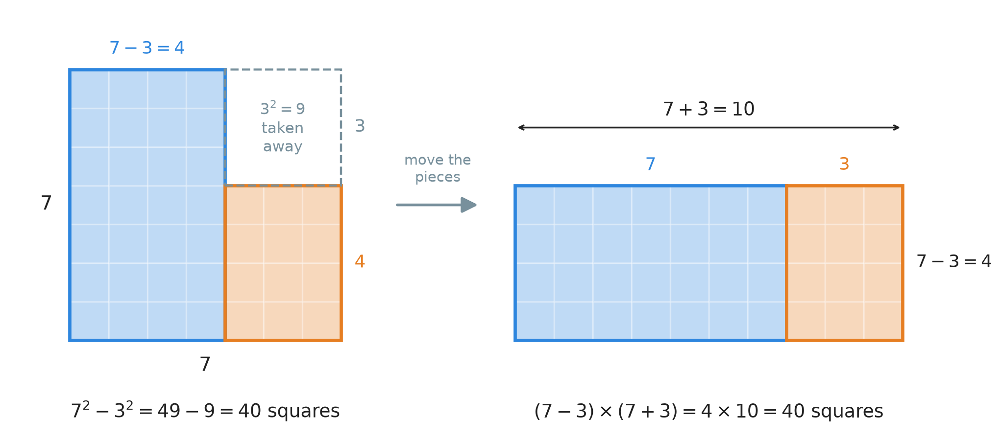
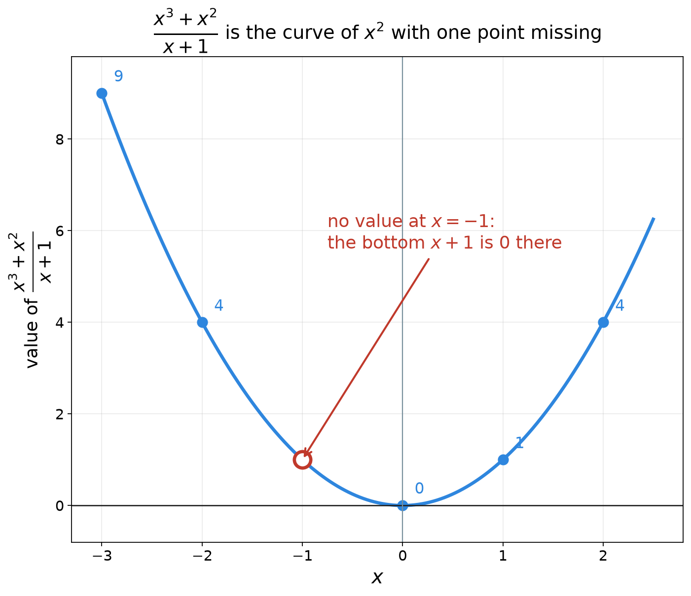
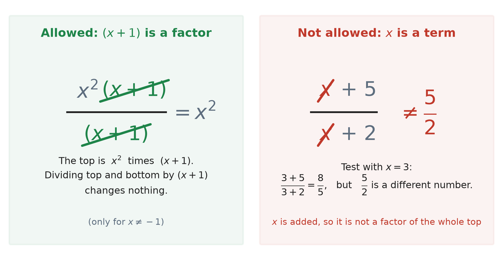
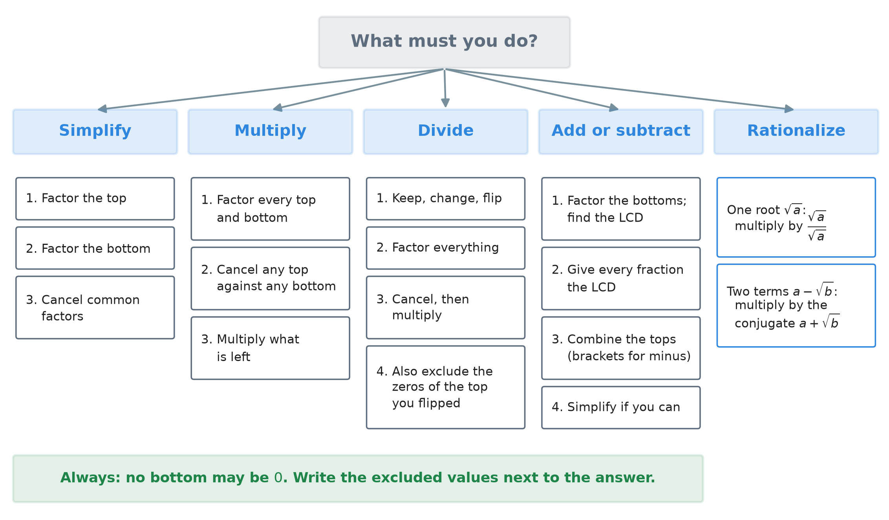

# 33. Rational expressions: simplifying, the four operations and rationalizing

**What this chapter teaches**
How to work with fractions that have polynomials on the top and on the bottom, such as
$\frac{x^{2} - 1}{x^{2} + 2x + 1}$. We simplify them, multiply, divide, add and subtract them,
and clear a square root out of the bottom of a fraction. Every rule is a fraction rule you
already know. The new work is the factoring, and one new habit: **a bottom must never be $0$**.

**Before you start**
You need the fraction rules of
[Chapter 1](./../1_Fractions/1_Fractions.md),
[Chapter 15](./../15_Adding_And_Subtracting_Fractions/15_Adding_And_Subtracting_Fractions.md) and
[Chapter 16](./../16_Multiplying_And_Dividing_Fractions/16_Multiplying_And_Dividing_Fractions.md),
polynomials from
[Chapter 27](./../27_Introduction_To_Polynomials/27_Introduction_To_Polynomials.md),
FOIL from
[Chapter 29](./../29_Multiplying_Polynomials/29_Multiplying_Polynomials.md),
and factoring from
[Chapter 19, section 5](./../19_The_Number_Properties_Of_Algebra/19_The_Number_Properties_Of_Algebra.md#5-taking-the-common-factor-out)
and
[Chapter 30, section 3](./../30_Solving_Quadratics_By_Factoring/30_Solving_Quadratics_By_Factoring.md#3-factoring-foil-run-backwards).
Section 8 uses square roots from
[Chapter 24](./../24_Roots/24_Roots.md).

---

## Table of contents

1. [Fractions with polynomials in them](#1-fractions-with-polynomials-in-them)
2. [A new factoring pattern: the difference of two squares](#2-a-new-factoring-pattern-the-difference-of-two-squares)
3. [Simplifying a rational expression](#3-simplifying-a-rational-expression)
4. [Multiplying rational expressions](#4-multiplying-rational-expressions)
5. [Dividing rational expressions](#5-dividing-rational-expressions)
6. [Adding and subtracting rational expressions](#6-adding-and-subtracting-rational-expressions)
7. [Fractions inside fractions](#7-fractions-inside-fractions)
8. [Rationalizing the denominator](#8-rationalizing-the-denominator)
9. [The whole method](#9-the-whole-method)
10. [Glossary](#10-glossary)
11. [Check your understanding](#11-check-your-understanding)
12. [Important notes](#12-important-notes)

---

## 1. Fractions with polynomials in them

### 1.1 What a rational expression is

You know fractions of numbers, such as $\frac{3}{4}$. You know polynomials, such as
$x^{2} + 2x + 1$
([Chapter 27, section 1.2](./../27_Introduction_To_Polynomials/27_Introduction_To_Polynomials.md#12-every-term-has-the-same-simple-shape)).
Now put a polynomial on the top of a fraction and a polynomial on the bottom.

> **Definition.** A **rational expression** is a fraction whose top (numerator) and bottom
> (denominator) are both polynomials. The bottom must not be $0$.

Two examples:

$$
\frac{x + 3}{x - 4} \qquad\qquad \frac{x^{2} - 1}{x^{2} + 2x + 1}
$$

The name comes from **rational number** — a number that can be written as a fraction of two
integers
([Chapter 32, section 6.1](./../32_Solving_Higher_Degree_Equations/32_Solving_Higher_Degree_Equations.md#61-too-many-numbers)).
A rational expression is the same idea, one level up: a fraction of two polynomials.

> **Note.** A rational expression is usually **not** a polynomial. A polynomial never has $x$
> under a fraction bar
> ([Chapter 27, section 2.2](./../27_Introduction_To_Polynomials/27_Introduction_To_Polynomials.md#22-the-letter-under-a-fraction-bar)).
> That is why this chapter needs its own rules.

A rational expression is a recipe for a number. Choose a value of $x$, and it gives a fraction
of two numbers
([Chapter 18, section 6.1](./../18_Introduction_To_Algebra_Variables/18_Introduction_To_Algebra_Variables.md#61-the-three-steps)).
Take $\frac{x + 3}{x - 4}$ with $x = 3$:

$$
\frac{3 + 3}{3 - 4} = \frac{6}{-1} = -6
$$

### 1.2 The bottom must not be zero

Now try $x = 4$ in the same expression:

$$
\frac{4 + 3}{4 - 4} = \frac{7}{0}
$$

That is a division by zero. It has no answer: it is **undefined**
([Chapter 16, section 6.2](./../16_Multiplying_And_Dividing_Fractions/16_Multiplying_And_Dividing_Fractions.md#62-why-dividing-by-zero-has-no-answer)).
So the number $4$ is not allowed in this expression.

> **Definition.** An **excluded value** is a value of $x$ that makes the bottom of a rational
> expression equal to $0$. The expression has no value there. Another name is a **domain
> restriction**.

We write it like this: $x \neq 4$. Read it as "$x$ is not equal to $4$".

**How to find the excluded values.** Set the bottom equal to $0$ and solve. The answers are the
values that are not allowed.

* Bottom $x - 4$: solve $x - 4 = 0$. So $x = 4$ is excluded.
* Bottom $x^{2} + 2x + 1$: factor it first (Chapter 30). Two numbers that multiply to $1$ and
  add to $2$ are $1$ and $1$. So $x^{2} + 2x + 1 = (x + 1)(x + 1)$. By the zero product property
  ([Chapter 30, section 2](./../30_Solving_Quadratics_By_Factoring/30_Solving_Quadratics_By_Factoring.md#2-the-zero-product-property)),
  this is $0$ only when $x + 1 = 0$, so $x = -1$ is excluded.

> **Note.** The excluded values belong to the expression **for its whole life**. When we change
> the expression later — cancel, multiply, flip — the excluded values stay. We write them next to
> the final answer.

### 1.3 The plan

Everything you did with number fractions still works:

| With numbers | With polynomials |
| --- | --- |
| Simplify by dividing top and bottom by a common factor (Ch. 1 § 3.3) | Same rule; the common factor can be a bracket such as $(x + 1)$ |
| Multiply straight across (Ch. 16 § 3) | Same |
| Divide: keep, change, flip (Ch. 16 § 5) | Same |
| Add and subtract with a common denominator (Ch. 15) | Same; the LCD is built from brackets |

With numbers, the hidden work was finding common factors through prime factorization
([Chapter 12](./../12_Divisibility_And_Prime_Numbers/12_Divisibility_And_Prime_Numbers.md)).
With polynomials, the hidden work is **factoring**. A bracket such as $(x + 1)$ plays the job of
a prime number. So the most important skill of this chapter is one you already have: factoring.
Section 2 adds one more pattern to it.

### Summary of section 1

* A rational expression is a fraction with a polynomial on top and a polynomial on the bottom.
* A value of $x$ that makes the bottom $0$ is an excluded value. Find it by setting the bottom
  equal to $0$ and solving.
* All the number-fraction rules still work. Factoring does the job that prime factorization did.

---

## 2. A new factoring pattern: the difference of two squares

### 2.1 Numbers first

A **difference** is the answer to a subtraction. So a **difference of two squares** is one square
number minus another, such as $7^{2} - 3^{2}$.

Work it out:

$$
7^{2} - 3^{2} = 49 - 9 = 40
$$

Now take the same two numbers, $7$ and $3$. Subtract them, add them, and multiply the two
answers:

$$
(7 - 3) \times (7 + 3) = 4 \times 10 = 40
$$

The same $40$. Try another pair, $10$ and $1$:

$$
10^{2} - 1^{2} = 100 - 1 = 99
\qquad\qquad
(10 - 1) \times (10 + 1) = 9 \times 11 = 99
$$

Again the same. This is not luck.

### 2.2 Why it always works

Multiply $(a - b)(a + b)$ with FOIL
([Chapter 29, section 3](./../29_Multiplying_Polynomials/29_Multiplying_Polynomials.md#3-the-foil-method)):

$$
(a - b)(a + b) = a^{2} + ab - ba - b^{2}
$$

The middle two terms are $ab$ and $-ab$. They cancel each other: $ab - ab = 0$. So:

$$
(a - b)(a + b) = a^{2} - b^{2}
$$

Read from right to left, this is a factoring rule:

$$
a^{2} - b^{2} = (a - b)(a + b)
$$

**In words:** a square minus a square is (the first number minus the second) times (the first
number plus the second).

* $a$ — the number (or letter) that is squared first.
* $b$ — the number (or letter) that is squared and subtracted.
* $a^{2} - b^{2}$ — the difference of two squares.

You can also **see** it. Take a $7$ by $7$ square and cut a $3$ by $3$ square out of its corner.
The rest can be moved into one rectangle:

    

**Figure 2 — On the left: $49$ small squares, minus the $9$ in the corner, leaves $40$. On the
right: the same two pieces, moved. The blue strip is turned on its side. Now they make one
rectangle, $7 + 3 = 10$ wide and $7 - 3 = 4$ tall. No square was lost, so
$7^{2} - 3^{2} = (7 - 3) \times (7 + 3)$.**

### 2.3 With a letter

The rule works when $a$ is a letter.

**Example.** Factor $x^{2} - 1$. The number $1$ is a square: $1 = 1^{2}$. So $a = x$ and $b = 1$:

$$
x^{2} - 1 = x^{2} - 1^{2} = (x - 1)(x + 1)
$$

**Example.** Factor $x^{2} - 9$. Here $9 = 3^{2}$, so:

$$
x^{2} - 9 = (x - 3)(x + 3)
$$

Check with $x = 5$: the left side is $25 - 9 = 16$. The right side is
$(5 - 3)(5 + 3) = 2 \times 8 = 16$. The same.

**The same answer by the old method.** You can also see $x^{2} - 1$ as the trinomial
$x^{2} + 0x - 1$: there is no $x$ term, so its coefficient is $0$. The rule of
[Chapter 30, section 3.4](./../30_Solving_Quadratics_By_Factoring/30_Solving_Quadratics_By_Factoring.md#34-finding-the-two-numbers)
asks for two numbers that multiply to $-1$ and add to $0$. They are $1$ and $-1$. That gives
$(x + 1)(x - 1)$ — the same brackets. The new pattern is simply a quick way to see this answer.

> **Note.** The other shape you will meet in this chapter is the **perfect square trinomial**,
> such as $x^{2} + 2x + 1 = (x + 1)^{2}$. It is explained in
> [Chapter 31, section 2.2](./../31_Solving_Quadratics_By_Completing_The_Square/31_Solving_Quadratics_By_Completing_The_Square.md#22-a-name-for-this-shape).

### Summary of section 2

* $a^{2} - b^{2} = (a - b)(a + b)$. A square minus a square splits into two brackets with
  opposite signs.
* The reason: in $(a - b)(a + b)$ the two middle products $ab$ and $-ab$ cancel.
* $x^{2} - 1 = (x - 1)(x + 1)$ and $x^{2} - 9 = (x - 3)(x + 3)$.

---

## 3. Simplifying a rational expression

### 3.1 The rule, with numbers first

Simplify $\frac{6}{8}$. Write the top and the bottom as products. They share the factor $2$:

$$
\frac{6}{8} = \frac{2 \times 3}{2 \times 4} = \frac{3}{4}
$$

This is the rule of
[Chapter 1, section 3.3](./../1_Fractions/1_Fractions.md#33-simplifying-a-fraction): divide the top
and the bottom by the same number. In symbols:

$$
\frac{A \times C}{B \times C} = \frac{A}{B} \qquad (B \neq 0,\ C \neq 0)
$$

**In words:** if the top and the bottom are both multiplied by the same thing, you may remove it
from both.

* $A$, $B$ — what is left on the top and on the bottom.
* $C$ — the **common factor**: it multiplies the whole top and the whole bottom.
* $B \neq 0,\ C \neq 0$ — the bottom $B \times C$ must not be $0$.

**Why it is true.** Split the fraction into two fractions (multiplying straight across, read
backwards —
[Chapter 16, section 3.3](./../16_Multiplying_And_Dividing_Fractions/16_Multiplying_And_Dividing_Fractions.md#33-the-rule-in-symbols)):

$$
\frac{A \times C}{B \times C} = \frac{A}{B} \times \frac{C}{C} = \frac{A}{B} \times 1 = \frac{A}{B}
$$

Any number over itself is $1$
([Chapter 1, section 2.3](./../1_Fractions/1_Fractions.md#23-when-the-parts-build-the-whole-back)),
and multiplying by $1$ changes nothing
([Chapter 19, section 6.2](./../19_The_Number_Properties_Of_Algebra/19_The_Number_Properties_Of_Algebra.md#62-multiplying-by-one)).
Removing a common factor from top and bottom is called **cancelling**.

The rule does not care whether $C$ is a number or a bracket such as $(x + 1)$. That is the whole
idea of this section.

### 3.2 The four steps

1. **Factor** the top completely.
2. **Factor** the bottom completely.
3. **Cancel** every factor that is on both the top and the bottom.
4. **Write** what is left, and the excluded values next to it.

Factoring comes first because the rule needs **products**. Before factoring you cannot see which
factors are there.

### 3.3 First example: a common factor

Simplify $\dfrac{x^{3} + x^{2}}{x + 1}$.

**Excluded value.** The bottom is $0$ when $x + 1 = 0$, so $x \neq -1$.

**Step 1.** The two terms of the top share $x^{2}$
([Chapter 19, section 5.2](./../19_The_Number_Properties_Of_Algebra/19_The_Number_Properties_Of_Algebra.md#52-the-greatest-common-factor-of-two-terms)):

$$
x^{3} + x^{2} = x^{2}(x + 1)
$$

**Step 2.** The bottom $x + 1$ cannot be factored further.

**Step 3.** Write the fraction again. The bracket $(x + 1)$ is on the top and on the bottom:

$$
\frac{x^{2}(x + 1)}{x + 1} = \frac{x^{2}}{1} \times \frac{x + 1}{x + 1} = x^{2} \times 1
$$

**Step 4.**

$$
\frac{x^{3} + x^{2}}{x + 1} = x^{2} \qquad (x \neq -1)
$$

**Check with $x = 2$.** The original: $\frac{8 + 4}{2 + 1} = \frac{12}{3} = 4$. The answer:
$2^{2} = 4$. The same.

**Why we still write $x \neq -1$.** The answer $x^{2}$ has no bottom, so it seems to have no
excluded value. But the original expression has no value at $x = -1$: there it is
$\frac{0}{0}$. The two are equal **everywhere except at $x = -1$**. The picture shows this:

    

**Figure 3 — The values of $\frac{x^{3} + x^{2}}{x + 1}$ lie on the curve of $x^{2}$ (graphs are
explained in
[Chapter 31, section 6](./../31_Solving_Quadratics_By_Completing_The_Square/31_Solving_Quadratics_By_Completing_The_Square.md#6-what-the-answers-look-like-in-a-picture)).
Look at the red circle at $x = -1$. It is empty: the expression has no value there. Everywhere
else, the two expressions give the same number.**

### 3.4 Second example: two quadratics

Simplify $\dfrac{x^{2} - 1}{x^{2} + 2x + 1}$.

**Step 1.** The top is a difference of two squares (section 2.3):

$$
x^{2} - 1 = (x - 1)(x + 1)
$$

**Step 2.** The bottom is a perfect square trinomial (section 1.2 factored it):

$$
x^{2} + 2x + 1 = (x + 1)(x + 1)
$$

So the excluded value is $x = -1$.

**Step 3.** Write the fraction with the factors:

$$
\frac{(x - 1)(x + 1)}{(x + 1)(x + 1)}
$$

One $(x + 1)$ is on the top and two are on the bottom. Cancel **one** pair. One $(x + 1)$ stays
on the bottom.

**Step 4.**

$$
\frac{x^{2} - 1}{x^{2} + 2x + 1} = \frac{x - 1}{x + 1} \qquad (x \neq -1)
$$

**Check with $x = 3$.** The original: $\frac{9 - 1}{9 + 6 + 1} = \frac{8}{16} = \frac{1}{2}$. The
answer: $\frac{3 - 1}{3 + 1} = \frac{2}{4} = \frac{1}{2}$. The same.

The answer is finished when the top and the bottom share no factor. This is the same test as for
number fractions
([Chapter 14, section 5.2](./../14_The_Greatest_Common_Factor/14_The_Greatest_Common_Factor.md#52-simplifying-a-fraction-in-one-step)).

### 3.5 Cancel factors, never terms

This is the most important rule of the chapter.

Look at $\frac{x + 5}{x + 2}$. There is an $x$ on the top and an $x$ on the bottom. It is tempting
to cross them out and write $\frac{5}{2}$. **That is wrong.**

    

**Figure 1 — Left: $(x + 1)$ **multiplies** the whole top and is the whole bottom. It is a factor,
so it may be cancelled. Right: $x$ is **added** to $5$. It is a term, not a factor of the whole
top, so it may not be cancelled. The test with $x = 3$ proves it: the true value is
$\frac{8}{5}$, not $\frac{5}{2}$.**

**Why.** Cancelling means dividing the top and the bottom by the same thing. Divide the top
$x + 5$ by $x$: you get $1 + \frac{5}{x}$, not $5$. The bar groups the whole top
([Chapter 21, section 4.1](./../21_Equations_With_The_Letter_On_Both_Sides/21_Equations_With_The_Letter_On_Both_Sides.md#41-a-whole-side-written-over-a-number)),
so you must divide the **whole** top, not one piece of it.

With plain numbers it is easy to see:

$$
\frac{3 \times 5}{3 \times 2} = \frac{5}{2}
\qquad \text{but} \qquad
\frac{3 + 5}{3 + 2} = \frac{8}{5}
$$

The first has the factor $3$ on both sides. The second has the term $3$ on both sides, and
crossing it out gives a wrong answer.

So $\frac{x + 5}{x + 2}$ is already finished. Its top and bottom cannot be factored, so they
share no factor.

> **Warning.** Before you cancel, ask: **"Does this multiply everything above the bar, and
> everything below it?"** If the answer is no, it is a term. Leave it alone.

### Summary of section 3

* $\frac{A \times C}{B \times C} = \frac{A}{B}$, because $\frac{C}{C} = 1$.
* Factor the top and the bottom completely. Then cancel the factors they share.
* Cancel **factors** (things multiplied), never **terms** (things added or subtracted).
* The answer keeps the excluded values of the original expression, even when the bracket that
  caused them has been cancelled.

---

## 4. Multiplying rational expressions

### 4.1 The rule, and why we cancel first

Two fractions multiply straight across
([Chapter 16, section 3.3](./../16_Multiplying_And_Dividing_Fractions/16_Multiplying_And_Dividing_Fractions.md#33-the-rule-in-symbols)):

$$
\frac{A}{B} \times \frac{C}{D} = \frac{A \times C}{B \times D} \qquad (B \neq 0,\ D \neq 0)
$$

After this step there is **one** fraction. Its top is a product, and its bottom is a product.
The order of the factors does not matter
([Chapter 19, section 2.1](./../19_The_Number_Properties_Of_Algebra/19_The_Number_Properties_Of_Algebra.md#21-changing-the-order)).
So a factor on **any** top may cancel with the same factor on **any** bottom.

With numbers, take $\frac{4}{9} \times \frac{3}{8}$:

* Multiply first, simplify last: $\frac{4 \times 3}{9 \times 8} = \frac{12}{72} = \frac{1}{6}$.
* Cancel first: $\frac{4 \times 3}{9 \times 8} = \frac{4 \times 3}{3 \times 3 \times 4 \times 2}$.
  The $4$ and one $3$ cancel. What is left is $\frac{1}{3 \times 2} = \frac{1}{6}$.

Both roads give $\frac{1}{6}$. With numbers, either road is fine. With polynomials, cancelling
first is much better. If you multiply first, you must expand long brackets and then factor them
back again.

### 4.2 The three steps

1. **Factor** every top and every bottom completely.
2. **Cancel** any factor on a top against the same factor on a bottom.
3. **Multiply** what is left: tops together, bottoms together.

### 4.3 A full example

Multiply $\dfrac{x + 2}{x - 1} \times \dfrac{x^{2} + 4x - 5}{x + 3}$.

**Excluded values.** The bottoms are $x - 1$ and $x + 3$. So $x \neq 1$ and $x \neq -3$.

**Step 1.** The first fraction is already factored. In $x^{2} + 4x - 5$, find two numbers that
multiply to $-5$ and add to $4$. They are $5$ and $-1$:

$$
x^{2} + 4x - 5 = (x + 5)(x - 1)
$$

So the problem is:

$$
\frac{x + 2}{x - 1} \times \frac{(x + 5)(x - 1)}{x + 3}
$$

**Step 2.** $(x - 1)$ is on a bottom (first fraction) and on a top (second fraction). Cancel it:

$$
\frac{x + 2}{1} \times \frac{x + 5}{x + 3}
$$

**Step 3.** Multiply across:

$$
\frac{(x + 2)(x + 5)}{x + 3} \qquad (x \neq 1,\ x \neq -3)
$$

You may also expand the top with FOIL: $(x + 2)(x + 5) = x^{2} + 5x + 2x + 10 = x^{2} + 7x + 10$.
So the answer can also be written $\frac{x^{2} + 7x + 10}{x + 3}$. Both forms are correct. The
factored form is often more useful, because you can see at once that nothing more cancels.

**Check with $x = 2$.** The original:
$\frac{4}{1} \times \frac{4 + 8 - 5}{5} = 4 \times \frac{7}{5} = \frac{28}{5}$. The answer:
$\frac{4 \times 7}{5} = \frac{28}{5}$. The same.

> **Note.** $x = 1$ is still excluded, even though $(x - 1)$ was cancelled. At $x = 1$ the
> original problem divides by $0$, so it has no value there.

### Summary of section 4

* Multiply straight across. Before that, factor everything and cancel.
* A factor on any top may cancel with the same factor on any bottom.
* Keep all the excluded values of the original problem.

---

## 5. Dividing rational expressions

### 5.1 Keep, change, flip

Dividing by a fraction is multiplying by its reciprocal (the fraction turned upside down —
[Chapter 16, section 4.1](./../16_Multiplying_And_Dividing_Fractions/16_Multiplying_And_Dividing_Fractions.md#41-the-reciprocal)).
This is "keep, change, flip"
([Chapter 16, section 5.3](./../16_Multiplying_And_Dividing_Fractions/16_Multiplying_And_Dividing_Fractions.md#53-keep-change-flip)),
and the reason it works is in
[section 5.4](./../16_Multiplying_And_Dividing_Fractions/16_Multiplying_And_Dividing_Fractions.md#54-why-flipping-works)
of the same chapter:

$$
\frac{A}{B} \div \frac{C}{D} = \frac{A}{B} \times \frac{D}{C} \qquad (B \neq 0,\ C \neq 0,\ D \neq 0)
$$

After the flip, it is a multiplication, so section 4 does the rest. The steps:

1. **Keep** the first fraction, **change** $\div$ to $\times$, **flip** the second fraction.
2. **Factor** everything.
3. **Cancel**, then **multiply**.

### 5.2 A full example

Divide $\dfrac{x + 3}{x - 4} \div \dfrac{x^{2} + x - 6}{x^{2} - 3x - 4}$.

**Step 1.** Keep, change, flip:

$$
\frac{x + 3}{x - 4} \times \frac{x^{2} - 3x - 4}{x^{2} + x - 6}
$$

**Step 2.** Factor the two quadratics.

* $x^{2} - 3x - 4$: two numbers that multiply to $-4$ and add to $-3$ are $-4$ and $1$. So
  $x^{2} - 3x - 4 = (x - 4)(x + 1)$.
* $x^{2} + x - 6$: two numbers that multiply to $-6$ and add to $1$ are $3$ and $-2$. So
  $x^{2} + x - 6 = (x + 3)(x - 2)$.

$$
\frac{x + 3}{x - 4} \times \frac{(x - 4)(x + 1)}{(x + 3)(x - 2)}
$$

**Step 3.** $(x + 3)$ is on a top and on a bottom. So is $(x - 4)$. Cancel both:

$$
\frac{1}{1} \times \frac{x + 1}{x - 2} = \frac{x + 1}{x - 2}
$$

**Check with $x = 1$.** The original: the first fraction is $\frac{4}{-3} = -\frac{4}{3}$. The
second is $\frac{1 + 1 - 6}{1 - 3 - 4} = \frac{-4}{-6} = \frac{2}{3}$. So
$-\frac{4}{3} \div \frac{2}{3} = -\frac{4}{3} \times \frac{3}{2} = -2$. The answer:
$\frac{1 + 1}{1 - 2} = \frac{2}{-1} = -2$. The same.

### 5.3 Division has extra excluded values

Which values of $x$ are excluded here? There are **three** places where a $0$ would break the
problem.

1. The bottom of the first fraction: $x - 4 = 0$ gives $x = 4$.
2. The bottom of the second fraction: $(x - 4)(x + 1) = 0$ gives $x = 4$ or $x = -1$.
3. **The top of the second fraction.** We divide by the whole second fraction. If it is $0$, we
   divide by $0$. And after the flip, this top **becomes a bottom**. So
   $(x + 3)(x - 2) = 0$ is not allowed: $x = -3$ or $x = 2$.

So the full answer is:

$$
\frac{x + 3}{x - 4} \div \frac{x^{2} + x - 6}{x^{2} - 3x - 4} = \frac{x + 1}{x - 2}
\qquad (x \neq 4,\ x \neq -1,\ x \neq -3,\ x \neq 2)
$$

**Why $x = -3$ matters.** The answer $\frac{x + 1}{x - 2}$ at $x = -3$ gives
$\frac{-2}{-5} = \frac{2}{5}$, a normal number. But the original problem at $x = -3$ is
$\frac{0}{-7} \div \frac{0}{14} = 0 \div 0$, which is undefined. So the answer alone does not
show this excluded value. You must find it in the original problem.

> **Warning.** In a division, look for excluded values in **three** places: both bottoms, and
> the top of the fraction you flip.

### Summary of section 5

* Keep, change, flip. Then it is a multiplication: factor, cancel, multiply.
* Flip **only** the second fraction
  ([Chapter 16, section 5.7](./../16_Multiplying_And_Dividing_Fractions/16_Multiplying_And_Dividing_Fractions.md#57-flip-the-second-one-never-the-first)).
* The top of the flipped fraction becomes a bottom. Its zeros are excluded values too.

---

## 6. Adding and subtracting rational expressions

### 6.1 When the bottoms are the same

Add the tops and keep the bottom
([Chapter 15, section 2.3](./../15_Adding_And_Subtracting_Fractions/15_Adding_And_Subtracting_Fractions.md#23-the-rule-in-symbols)):

$$
\frac{A}{C} + \frac{B}{C} = \frac{A + B}{C}
\qquad\qquad
\frac{A}{C} - \frac{B}{C} = \frac{A - B}{C}
\qquad (C \neq 0)
$$

When you subtract, the minus sign belongs to the **whole** second top. So put the second top in
a bracket, and then open the bracket
([Chapter 28, section 4.2](./../28_Adding_And_Subtracting_Polynomials/28_Adding_And_Subtracting_Polynomials.md#42-a-minus-sign-in-front-of-a-bracket-reaches-every-term)).

**Example.** Subtract $\dfrac{5x + 2}{x + 1} - \dfrac{2x - 3}{x + 1}$. Here $x \neq -1$.

$$
\frac{(5x + 2) - (2x - 3)}{x + 1}
= \frac{5x + 2 - 2x + 3}{x + 1}
= \frac{3x + 5}{x + 1}
$$

The minus sign changed $-3$ into $+3$. If you forget the bracket, you get $-3$ there and the
wrong top $3x - 1$.

**Check with $x = 1$.** The original: $\frac{7}{2} - \frac{-1}{2} = \frac{7 + 1}{2} = 4$. The
answer: $\frac{3 + 5}{2} = 4$. The same. (The wrong top $3x - 1$ gives $\frac{2}{2} = 1$.)

### 6.2 The least common denominator of polynomials

When the bottoms are different, we need a common bottom, the **LCD**
([Chapter 13, section 5.2](./../13_The_Least_Common_Multiple/13_The_Least_Common_Multiple.md#52-the-least-common-denominator)).
For numbers you built it from primes
([Chapter 13, section 3.2](./../13_The_Least_Common_Multiple/13_The_Least_Common_Multiple.md#32-the-five-steps)).
For polynomials, build it from the factors of the bottoms in the same way:

1. Factor every bottom.
2. Take every different factor. Take it as many times as it appears in the bottom that has it
   the most.
3. Multiply them. That product is the LCD.

**Example.** The bottoms $(x + 1)^{2}$ and $(x + 1)(x - 2)$. The factor $(x + 1)$ appears twice in
the first bottom, so take it twice. The factor $(x - 2)$ appears once. The LCD is
$(x + 1)^{2}(x - 2)$.

When two bottoms share **no** factor, the LCD is simply their product — exactly as for coprime
numbers
([Chapter 15, section 3.7](./../15_Adding_And_Subtracting_Fractions/15_Adding_And_Subtracting_Fractions.md#37-when-the-bottom-numbers-share-nothing-frac15--frac211)).

### 6.3 A full example

Add $\dfrac{x + 1}{x - 1} + \dfrac{x + 2}{x + 3}$.

**Excluded values:** $x \neq 1$ and $x \neq -3$.

**Step 1: the LCD.** The bottoms $(x - 1)$ and $(x + 3)$ share no factor. So:

$$
\text{LCD} = (x - 1)(x + 3)
$$

**Step 2: give each fraction the LCD.** The first fraction is missing $(x + 3)$. The second is
missing $(x - 1)$. Multiply the top and the bottom of each by its missing factor
([Chapter 1, section 3.2](./../1_Fractions/1_Fractions.md#32-the-rule-do-the-same-thing-to-the-top-and-to-the-bottom)):

$$
\frac{(x + 1)(x + 3)}{(x - 1)(x + 3)} + \frac{(x + 2)(x - 1)}{(x - 1)(x + 3)}
$$

**Step 3: expand the tops** with FOIL:

* $(x + 1)(x + 3) = x^{2} + 3x + x + 3 = x^{2} + 4x + 3$
* $(x + 2)(x - 1) = x^{2} - x + 2x - 2 = x^{2} + x - 2$

**Step 4: add the tops**, keep the bottom, and collect like terms:

$$
\frac{(x^{2} + 4x + 3) + (x^{2} + x - 2)}{(x - 1)(x + 3)}
$$

$$
x^{2} + x^{2} = 2x^{2} \qquad 4x + x = 5x \qquad 3 - 2 = 1
$$

$$
\frac{x + 1}{x - 1} + \frac{x + 2}{x + 3} = \frac{2x^{2} + 5x + 1}{(x - 1)(x + 3)}
\qquad (x \neq 1,\ x \neq -3)
$$

If you expand the bottom too, it is $x^{2} + 2x - 3$. Both forms are correct.

**Check with $x = 2$.** The original: $\frac{3}{1} + \frac{4}{5} = \frac{15}{5} + \frac{4}{5}
= \frac{19}{5}$. The answer: $\frac{8 + 10 + 1}{1 \times 5} = \frac{19}{5}$. The same.

### 6.4 Is it finished?

Last, check if the new top shares a factor with the bottom. The only factors that could cancel
are $(x - 1)$ and $(x + 3)$. By the factor theorem
([Chapter 32, section 2.2](./../32_Solving_Higher_Degree_Equations/32_Solving_Higher_Degree_Equations.md#22-from-a-solution-to-a-bracket)),
$(x - 1)$ is a factor of the top only if the top is $0$ at $x = 1$:

$$
2 \times 1^{2} + 5 \times 1 + 1 = 2 + 5 + 1 = 8 \neq 0
$$

And $(x + 3)$ is a factor only if the top is $0$ at $x = -3$:

$$
2 \times 9 - 15 + 1 = 18 - 15 + 1 = 4 \neq 0
$$

Neither is $0$. So nothing cancels, and the answer is finished.

### Summary of section 6

* Same bottoms: add or subtract the tops, keep the bottom. Put the second top in a bracket when
  you subtract.
* Different bottoms: build the LCD from the factors of the bottoms, give every fraction the LCD,
  then combine.
* At the end, check whether the new top shares a factor with the bottom.

---

## 7. Fractions inside fractions

### 7.1 What it is

> **Definition.** A **complex rational expression** (also called a **complex fraction**) is a
> fraction that has smaller fractions inside its top, its bottom, or both.

An example:

$$
\frac{1 + \dfrac{1}{x}}{1 - \dfrac{1}{x}}
$$

You have met this shape before. In
[Chapter 16, section 5.4](./../16_Multiplying_And_Dividing_Fractions/16_Multiplying_And_Dividing_Fractions.md#54-why-flipping-works)
every division of fractions was written as one "tall fraction". The big bar is a division sign
([Chapter 1, section 2.2](./../1_Fractions/1_Fractions.md#22-a-fraction-is-a-division)).
So a complex fraction is a division in a different shape.

### 7.2 The method

1. Make the top **one** fraction.
2. Make the bottom **one** fraction.
3. Divide the top fraction by the bottom fraction (keep, change, flip).

### 7.3 A full example

Simplify $\dfrac{1 + \frac{1}{x}}{1 - \frac{1}{x}}$.

**Excluded values.** $\frac{1}{x}$ needs $x \neq 0$. The big bottom must not be $0$:
$1 - \frac{1}{x} = 0$ when $x = 1$. So $x \neq 0$ and $x \neq 1$.

**Step 1: the top.** Write $1$ as $\frac{x}{x}$ (any number over itself is $1$). Then the two
fractions have the same bottom:

$$
1 + \frac{1}{x} = \frac{x}{x} + \frac{1}{x} = \frac{x + 1}{x}
$$

**Step 2: the bottom**, the same way:

$$
1 - \frac{1}{x} = \frac{x}{x} - \frac{1}{x} = \frac{x - 1}{x}
$$

**Step 3: divide.**

$$
\frac{x + 1}{x} \div \frac{x - 1}{x} = \frac{x + 1}{x} \times \frac{x}{x - 1}
$$

The factor $x$ is on a bottom and on a top. Cancel it:

$$
\frac{1 + \frac{1}{x}}{1 - \frac{1}{x}} = \frac{x + 1}{x - 1} \qquad (x \neq 0,\ x \neq 1)
$$

**Check with $x = 2$.** The original: the top is $1 + \frac{1}{2} = \frac{3}{2}$ and the bottom is
$1 - \frac{1}{2} = \frac{1}{2}$. So $\frac{3}{2} \div \frac{1}{2} = \frac{3}{2} \times 2 = 3$. The
answer: $\frac{2 + 1}{2 - 1} = \frac{3}{1} = 3$. The same.

### Summary of section 7

* A complex fraction has fractions inside its top or its bottom. The big bar means "divide".
* Make the top one fraction, make the bottom one fraction, then keep, change, flip.
* Writing $1$ as $\frac{x}{x}$ gives it the same bottom as $\frac{1}{x}$.

---

## 8. Rationalizing the denominator

### 8.1 What it means and why we do it

Here the bottom of the fraction holds a square root, such as $\frac{1}{\sqrt{2}}$. **Rationalizing
the denominator** means rewriting the fraction so that **no root is left in the bottom**. The
value of the fraction does not change. Only its form changes.

**Why.** Mathematicians agree that a fraction with a root in the bottom is not in its finished
form. It is the same kind of agreement as the finished form of a root
([Chapter 24, section 4.4](./../24_Roots/24_Roots.md#44-take-the-largest-perfect-square-or-you-have-not-finished))
and of an exponent expression
([Chapter 25, section 1.2](./../25_Simplifying_Expressions/25_Simplifying_Expressions.md#12-when-an-answer-is-finished)).
There is also a practical reason. $\sqrt{2}$ is about $1.414$. Working by hand,
$1 \div 1.414$ is a hard division. But section 8.2 shows that $\frac{1}{\sqrt{2}}$ equals
$\frac{\sqrt{2}}{2}$, and $1.414 \div 2 = 0.707$ is easy.

**How.** We multiply the fraction by a fraction that equals $1$, such as $\frac{\sqrt{2}}{\sqrt{2}}$.
Multiplying by $1$ changes nothing
([Chapter 19, section 6.2](./../19_The_Number_Properties_Of_Algebra/19_The_Number_Properties_Of_Algebra.md#62-multiplying-by-one)).
We only choose **which** $1$ — the one that removes the root from the bottom.

### 8.2 One root in the bottom

The key fact: a square root times itself gives the number under the root,

$$
\sqrt{a} \times \sqrt{a} = a \qquad (a \geq 0)
$$

This is the meaning of a square root: the number that, multiplied by itself, gives $a$
([Chapter 24, section 2.2](./../24_Roots/24_Roots.md#22-the-symbol-and-the-names-of-its-three-parts);
see also
[Chapter 26, section 2.1](./../26_Equations_With_Roots_And_Exponents/26_Equations_With_Roots_And_Exponents.md#21-why-squaring-undoes-a-square-root)).
For example, $\sqrt{2} \times \sqrt{2} = 2$.

**Example.** Rationalize $\dfrac{1}{\sqrt{2}}$. Multiply the top and the bottom by $\sqrt{2}$:

$$
\frac{1}{\sqrt{2}} \times \frac{\sqrt{2}}{\sqrt{2}} = \frac{1 \times \sqrt{2}}{\sqrt{2} \times \sqrt{2}} = \frac{\sqrt{2}}{2}
$$

**Check in decimals.** $1 \div 1.41421 \approx 0.70711$, and $1.41421 \div 2 \approx 0.70711$. The
same.

The general rule:

$$
\frac{1}{\sqrt{a}} = \frac{1}{\sqrt{a}} \times \frac{\sqrt{a}}{\sqrt{a}} = \frac{\sqrt{a}}{a} \qquad (a > 0)
$$

* $a$ — the number under the root in the bottom. It must be more than $0$, so that the bottom
  is not $0$.

### 8.3 Two terms in the bottom: the conjugate

Now the bottom has two terms, for example $\frac{1}{1 - \sqrt{2}}$.

**First, what does not work.** Multiply the bottom by $\sqrt{2}$:

$$
(1 - \sqrt{2}) \times \sqrt{2} = \sqrt{2} - 2
$$

There is still a root. Multiplying by $\sqrt{2}$ removes the root from one term, but it puts a
root on the other term.

**What works: the difference of two squares.** Section 2 says
$(a - b)(a + b) = a^{2} - b^{2}$. Both terms are **squared**. And squaring a square root removes
the root. So multiply $a - \sqrt{b}$ by $a + \sqrt{b}$:

$$
(a - \sqrt{b})(a + \sqrt{b}) = a^{2} - (\sqrt{b})^{2} = a^{2} - b
$$

No root is left.

> **Definition.** The **conjugate** of a two-term expression is the same two terms with the
> opposite sign between them. The conjugate of $a - \sqrt{b}$ is $a + \sqrt{b}$, and the
> conjugate of $a + \sqrt{b}$ is $a - \sqrt{b}$.

**Example.** Rationalize $\dfrac{1}{1 - \sqrt{2}}$.

**Step 1.** The bottom is $1 - \sqrt{2}$. Its conjugate is $1 + \sqrt{2}$.

**Step 2.** Multiply the top and the bottom by the conjugate:

$$
\frac{1}{1 - \sqrt{2}} \times \frac{1 + \sqrt{2}}{1 + \sqrt{2}}
$$

**Step 3.** The top: $1 \times (1 + \sqrt{2}) = 1 + \sqrt{2}$. The bottom, by the difference of
two squares:

$$
(1 - \sqrt{2})(1 + \sqrt{2}) = 1^{2} - (\sqrt{2})^{2} = 1 - 2 = -1
$$

**Step 4.** Dividing by $-1$ changes every sign:

$$
\frac{1 + \sqrt{2}}{-1} = -1 - \sqrt{2}
$$

So:

$$
\frac{1}{1 - \sqrt{2}} = -1 - \sqrt{2}
$$

**Check in decimals.** $1 - 1.41421 = -0.41421$, and $1 \div (-0.41421) \approx -2.41421$. The
answer: $-1 - 1.41421 = -2.41421$. The same.

### 8.4 Why the sign must change

Why not multiply by the bottom itself? Take $\frac{1}{3 - \sqrt{2}}$ and multiply the bottom by
$3 - \sqrt{2}$. That is a squared bracket, and
[Chapter 31, section 2.3](./../31_Solving_Quadratics_By_Completing_The_Square/31_Solving_Quadratics_By_Completing_The_Square.md#23-with-a-minus-sign)
gives:

$$
(3 - \sqrt{2})^{2} = 3^{2} - 2 \times 3 \times \sqrt{2} + (\sqrt{2})^{2} = 9 - 6\sqrt{2} + 2 = 11 - 6\sqrt{2}
$$

The middle term $-6\sqrt{2}$ still has a root. With the conjugate, the two middle products are
$+3\sqrt{2}$ and $-3\sqrt{2}$, and they cancel:

$$
(3 - \sqrt{2})(3 + \sqrt{2}) = 3^{2} - (\sqrt{2})^{2} = 9 - 2 = 7
$$

That is the whole reason for changing the sign: it makes the middle terms cancel.

### Summary of section 8

* Rationalizing removes a root from the bottom. The value stays the same, because we multiply by
  a fraction equal to $1$.
* One root $\sqrt{a}$: multiply top and bottom by $\sqrt{a}$, because $\sqrt{a} \times \sqrt{a} = a$.
* Two terms $a - \sqrt{b}$: multiply top and bottom by the conjugate $a + \sqrt{b}$. The bottom
  becomes $a^{2} - b$.
* The same sign does not work: a middle term with a root stays.

---

## 9. The whole method

### 9.1 The method in one picture

    

**Figure 4 — First decide which task you have. Then follow its column from top to bottom. Look at
the green bar: whatever the task, the excluded values go next to the answer. In the divide
column, step 4 reminds you of the extra excluded values from section 5.3.**

### 9.2 The one skill under all of them

Look at the first four columns. They all start with **factor**. Simplifying needs factors to
cancel. Multiplying and dividing need factors to cancel across. Adding needs factors to build the
LCD. If you can factor, you can do this whole chapter. The fraction rules themselves are the old
ones from Chapters 1, 15 and 16.

A complex fraction (section 7) is not a new column. Make its top and its bottom single
fractions with the add-or-subtract column, then use the divide column.

### Summary of section 9

* Find the task, then follow its steps.
* For fractions of polynomials, factoring always comes first.
* The excluded values come from the **original** problem and stay with the answer.

---

## 10. Glossary

* **Rational expression** — a fraction with a polynomial on the top and a polynomial on the
  bottom; the bottom must not be $0$.
* **Excluded value (domain restriction)** — a value of $x$ that makes a bottom equal to $0$; the
  expression has no value there.
* **Difference of two squares** — an expression of the form $a^{2} - b^{2}$; it factors as
  $(a - b)(a + b)$.
* **Cancelling** — removing the same factor from the top and the bottom of a fraction; allowed
  because $\frac{C}{C} = 1$.
* **Least common denominator of polynomials** — the product of every different factor of the
  bottoms, each taken as many times as it appears in the bottom that has it the most.
* **Complex rational expression (complex fraction)** — a fraction with smaller fractions inside
  its top, its bottom, or both.
* **Rationalizing the denominator** — rewriting a fraction, without changing its value, so that
  no root is left in the bottom.
* **Conjugate** — the same two terms with the opposite sign between them; the conjugate of
  $a - \sqrt{b}$ is $a + \sqrt{b}$.

**Note.** Every other term was defined earlier. **Numerator**, **denominator** and **simplifying**
are in
[Chapter 1](./../1_Fractions/1_Fractions.md#7-glossary);
**undefined** and **reciprocal** are in
[Chapter 16](./../16_Multiplying_And_Dividing_Fractions/16_Multiplying_And_Dividing_Fractions.md#8-glossary);
**least common denominator** for numbers is in
[Chapter 13](./../13_The_Least_Common_Multiple/13_The_Least_Common_Multiple.md#6-glossary);
**polynomial** is in
[Chapter 27](./../27_Introduction_To_Polynomials/27_Introduction_To_Polynomials.md#8-glossary);
**FOIL** is in
[Chapter 29](./../29_Multiplying_Polynomials/29_Multiplying_Polynomials.md#7-glossary);
**perfect square trinomial** is in
[Chapter 31](./../31_Solving_Quadratics_By_Completing_The_Square/31_Solving_Quadratics_By_Completing_The_Square.md#8-glossary);
**square root**, **radical sign** and **irrational number** are in
[Chapter 24](./../24_Roots/24_Roots.md#9-glossary);
**rational number** and the **factor theorem** are in
[Chapter 32](./../32_Solving_Higher_Degree_Equations/32_Solving_Higher_Degree_Equations.md#9-glossary).

---

## 11. Check your understanding

**Question 1.** Simplify $\dfrac{2x^{2} + 6x}{2x}$.

Answer

The bottom is $0$ when $x = 0$, so $x \neq 0$.

The two terms of the top share $2x$: $2x^{2} + 6x = 2x(x + 3)$. So:

$$
\frac{2x(x + 3)}{2x} = x + 3 \qquad (x \neq 0)
$$

Check with $x = 1$: $\frac{2 + 6}{2} = 4$, and $1 + 3 = 4$.

**Question 2.** Simplify $\dfrac{x^{2} - 9}{x^{2} - 5x + 6}$.

Answer

Top: a difference of two squares, $x^{2} - 9 = (x - 3)(x + 3)$.
Bottom: two numbers that multiply to $6$ and add to $-5$ are $-3$ and $-2$, so
$x^{2} - 5x + 6 = (x - 3)(x - 2)$. The excluded values are $x = 3$ and $x = 2$.

Cancel $(x - 3)$:

$$
\frac{x + 3}{x - 2} \qquad (x \neq 3,\ x \neq 2)
$$

**Question 3.** Multiply $\dfrac{x - 3}{x + 4} \times \dfrac{x^{2} + 5x + 4}{x^{2} - 9}$.

Answer

Factor: $x^{2} + 5x + 4 = (x + 4)(x + 1)$ and $x^{2} - 9 = (x - 3)(x + 3)$.

$$
\frac{x - 3}{x + 4} \times \frac{(x + 4)(x + 1)}{(x - 3)(x + 3)}
$$

Cancel $(x - 3)$ and $(x + 4)$:

$$
\frac{x + 1}{x + 3} \qquad (x \neq -4,\ x \neq 3,\ x \neq -3)
$$

**Question 4.** Divide $\dfrac{x^{2} - 4}{x + 1} \div \dfrac{x + 2}{x^{2} + 3x + 2}$.

Answer

Keep, change, flip:

$$
\frac{x^{2} - 4}{x + 1} \times \frac{x^{2} + 3x + 2}{x + 2}
$$

Factor: $x^{2} - 4 = (x - 2)(x + 2)$ and $x^{2} + 3x + 2 = (x + 1)(x + 2)$.

$$
\frac{(x - 2)(x + 2)}{x + 1} \times \frac{(x + 1)(x + 2)}{x + 2}
$$

Cancel $(x + 1)$, and cancel one $(x + 2)$ against the bottom $(x + 2)$. What is left is
$(x - 2)(x + 2) = x^{2} - 4$.

Excluded values: the bottoms give $x = -1$ and $x = -2$; the flipped top $x + 2$ also gives
$x = -2$. So the answer is $x^{2} - 4$ with $x \neq -1,\ x \neq -2$.

Check with $x = 1$: $\frac{-3}{2} \div \frac{3}{6} = -\frac{3}{2} \times 2 = -3$, and
$1 - 4 = -3$.

**Question 5.** Subtract $\dfrac{x}{x - 2} - \dfrac{2}{x + 3}$.

Answer

The bottoms share nothing, so the LCD is $(x - 2)(x + 3)$.

$$
\frac{x(x + 3)}{(x - 2)(x + 3)} - \frac{2(x - 2)}{(x - 2)(x + 3)}
$$

Expand the tops: $x(x + 3) = x^{2} + 3x$ and $2(x - 2) = 2x - 4$. Subtract with a bracket:

$$
\frac{(x^{2} + 3x) - (2x - 4)}{(x - 2)(x + 3)} = \frac{x^{2} + 3x - 2x + 4}{(x - 2)(x + 3)}
= \frac{x^{2} + x + 4}{(x - 2)(x + 3)}
$$

with $x \neq 2,\ x \neq -3$.

Check with $x = 1$: $\frac{1}{-1} - \frac{2}{4} = -1 - \frac{1}{2} = -\frac{3}{2}$, and
$\frac{1 + 1 + 4}{(-1)(4)} = \frac{6}{-4} = -\frac{3}{2}$.

**Question 6.** Rationalize the denominator of $\dfrac{3}{2 - \sqrt{5}}$.

Answer

The conjugate of $2 - \sqrt{5}$ is $2 + \sqrt{5}$.

$$
\frac{3}{2 - \sqrt{5}} \times \frac{2 + \sqrt{5}}{2 + \sqrt{5}}
$$

Top: $3(2 + \sqrt{5}) = 6 + 3\sqrt{5}$.
Bottom: $(2 - \sqrt{5})(2 + \sqrt{5}) = 2^{2} - (\sqrt{5})^{2} = 4 - 5 = -1$.

$$
\frac{6 + 3\sqrt{5}}{-1} = -6 - 3\sqrt{5}
$$

Check in decimals: $3 \div (2 - 2.23607) \approx -12.708$, and
$-6 - 3 \times 2.23607 \approx -12.708$.

**Question 7.** A student writes $\dfrac{x + 5}{x + 2} = \dfrac{5}{2}$. Is this right? Explain
without a rule — use a number.

Answer

No. Try $x = 3$: $\frac{3 + 5}{3 + 2} = \frac{8}{5}$, which is not $\frac{5}{2}$. The $x$ is
**added** to $5$ and to $2$. It is a term, not a factor, so it cannot be cancelled (section 3.5).
The expression $\frac{x + 5}{x + 2}$ cannot be simplified.

**Question 8.** Work out $21^{2} - 19^{2}$ in your head.

Answer

Use the difference of two squares:
$21^{2} - 19^{2} = (21 - 19)(21 + 19) = 2 \times 40 = 80$.

(The long way: $441 - 361 = 80$.)

**Question 9.** Why does $\dfrac{1}{\sqrt{3}}$ become $\dfrac{\sqrt{3}}{3}$, and not a different
number?

Answer

We multiplied by $\frac{\sqrt{3}}{\sqrt{3}}$, which is $1$. Multiplying by $1$ never changes a
value. Only the form changes: the bottom becomes $\sqrt{3} \times \sqrt{3} = 3$, with no root.

---

## 12. Important notes

**The mistakes people actually make.**

* **Cancelling terms.** In $\frac{x + 5}{x + 2}$ nothing cancels. Only a factor of the **whole**
  top and the **whole** bottom may be cancelled. Factor first, then cancel.
* **Forgetting the bracket when subtracting.** $\frac{A}{C} - \frac{B}{C}$ means
  $\frac{A - (B)}{C}$. The minus sign reaches every term of $B$.
* **Adding tops and adding bottoms.** $\frac{a}{b} + \frac{c}{d}$ is **not** $\frac{a + c}{b + d}$.
  Test it: $\frac{1}{2} + \frac{1}{2} = 1$, but $\frac{1 + 1}{2 + 2} = \frac{1}{2}$. Fractions need
  a common bottom first
  ([Chapter 15, section 3.1](./../15_Adding_And_Subtracting_Fractions/15_Adding_And_Subtracting_Fractions.md#31-what-goes-wrong-if-you-just-add-everything)).
* **Flipping the wrong fraction, or forgetting to flip.** In a division, flip only the second
  fraction.
* **Using the same sign instead of the conjugate.** $(3 - \sqrt{2})(3 - \sqrt{2}) = 11 - 6\sqrt{2}$
  still has a root. Change the sign: $(3 - \sqrt{2})(3 + \sqrt{2}) = 7$.
* **Losing excluded values.** A bracket that was cancelled still gives an excluded value. In a
  division, the top of the flipped fraction gives excluded values too. Always look at the
  **original** problem.

**Ideas to keep.**

* **Every rule is an old fraction rule.** Only the factoring is new work.
* **Cancelling is dividing by $\frac{C}{C} = 1$.** That is why it needs a factor of the whole top
  and the whole bottom.
* **Rationalizing changes the form, not the value.** It is an agreement about the finished form,
  and the trick is always to multiply by a well-chosen $1$.
* **The difference of two squares makes the middle terms cancel.** That one fact factors
  $x^{2} - 9$ and also clears a root from $a - \sqrt{b}$.

**How this chapter connects to the rest of the book.**
This chapter is Chapters 1, 15 and 16 again, with polynomials in place of numbers. The
factoring comes from
[Chapter 19](./../19_The_Number_Properties_Of_Algebra/19_The_Number_Properties_Of_Algebra.md),
[Chapter 30](./../30_Solving_Quadratics_By_Factoring/30_Solving_Quadratics_By_Factoring.md) and
[Chapter 31](./../31_Solving_Quadratics_By_Completing_The_Square/31_Solving_Quadratics_By_Completing_The_Square.md),
plus the difference of two squares from section 2. A bracket plays the job of a prime number,
just as in
[Chapter 13](./../13_The_Least_Common_Multiple/13_The_Least_Common_Multiple.md).
The ban on dividing by zero from
[Chapter 16, section 6.2](./../16_Multiplying_And_Dividing_Fractions/16_Multiplying_And_Dividing_Fractions.md#62-why-dividing-by-zero-has-no-answer)
becomes the excluded values. And rationalizing finishes the square-root work of
[Chapter 24](./../24_Roots/24_Roots.md), which stopped at roots in the top of a fraction.

---

- [Back to the book](./../README.md)
- Previous: [32 Solving higher-degree equations: synthetic division and the rational roots test](./../32_Solving_Higher_Degree_Equations/32_Solving_Higher_Degree_Equations.md)
- Next: not written yet.
