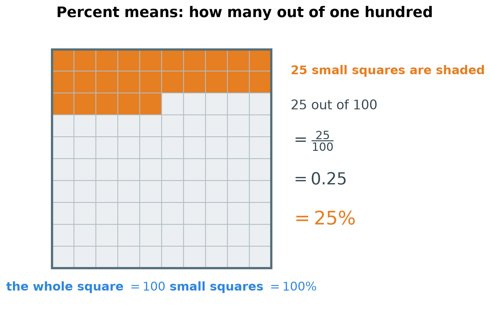
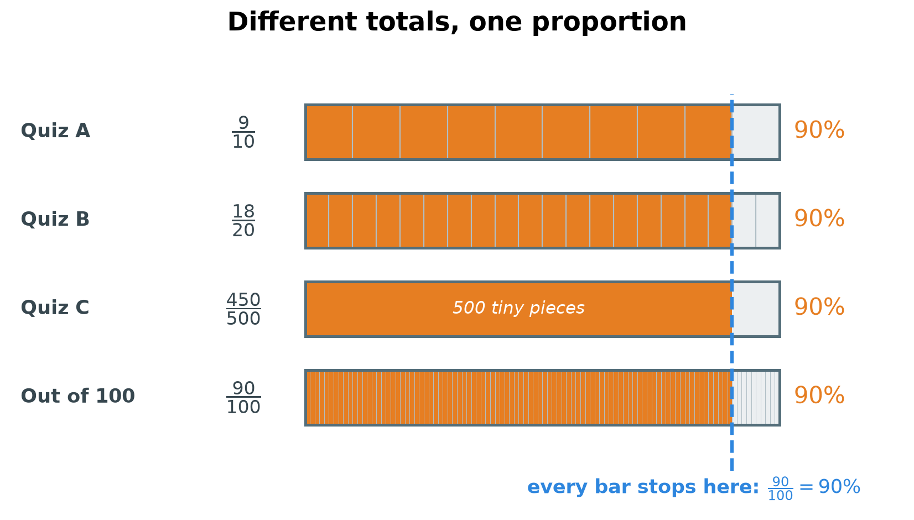
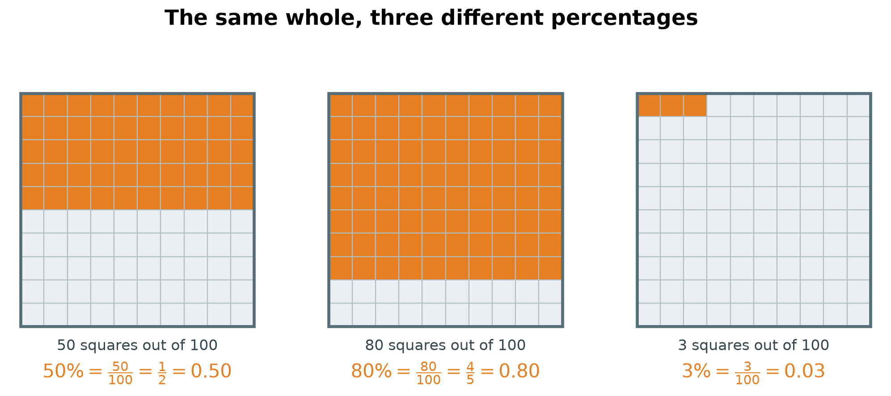
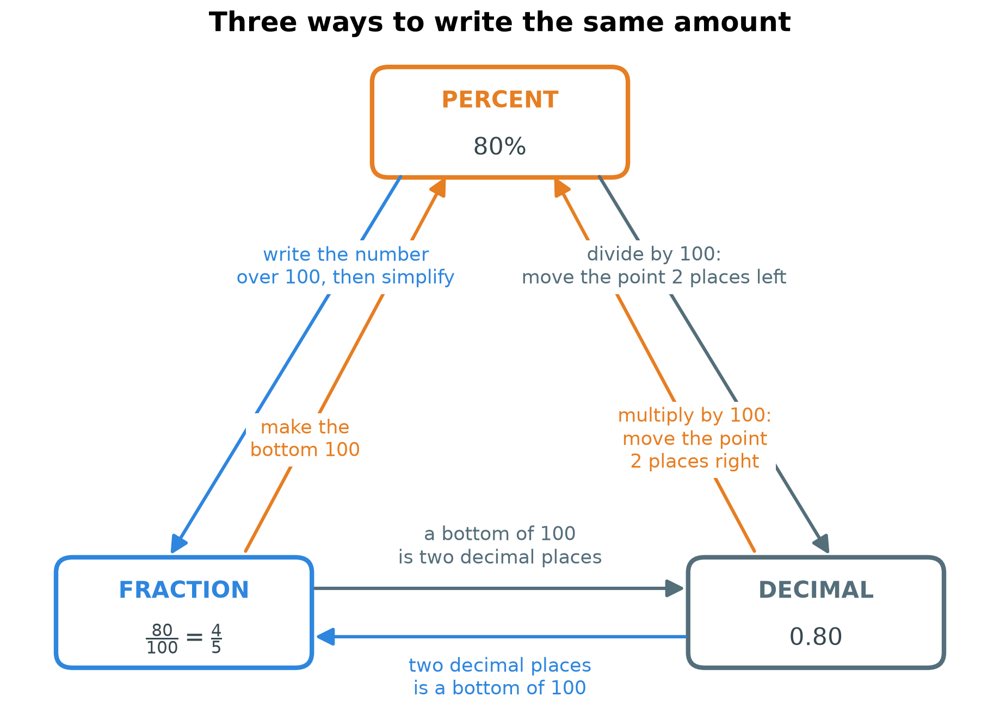
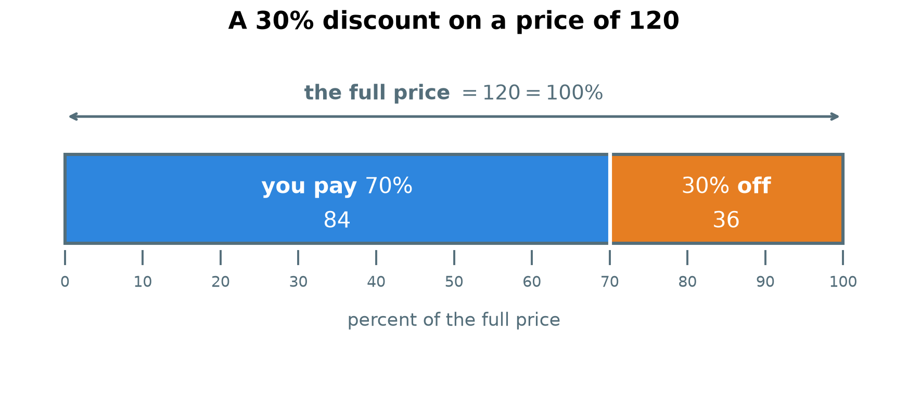
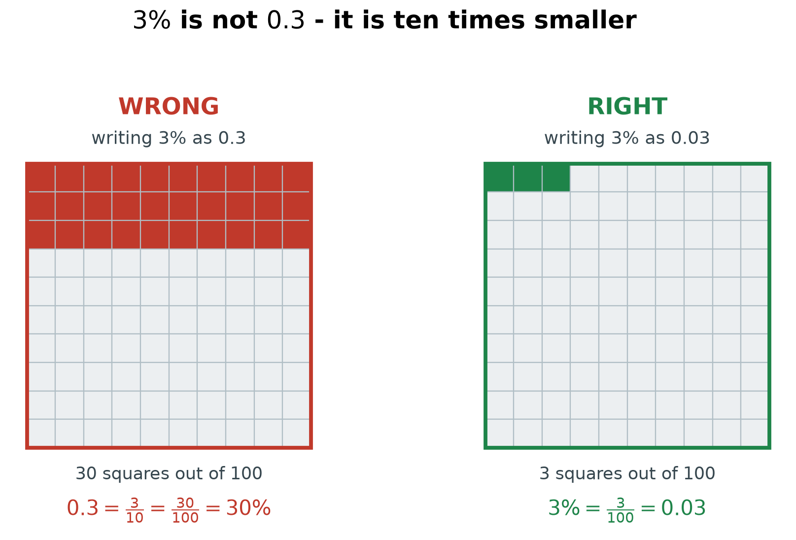

# 3. Percentages

**What this chapter teaches**
What the word *percent* really means, why every percentage is measured out of one hundred,
how to change a percentage into a fraction or a decimal and back again, and how to find a
percentage of an amount of money.

**Before you start**
Read [Chapter 1, Fractions](./../1_Fractions/1_Fractions.md) and
[Chapter 2, Decimals](./../2_Decimals/2_Decimals.md) first. You need three things from them:
the words *numerator* and *denominator*, the rule that you may multiply or divide the top and
the bottom of a fraction by the same number, and the fact that a fraction with $100$
underneath is written with two decimal places.

---

## Table of contents

1. [Why we need percentages](#1-why-we-need-percentages)
2. [What a percentage is](#2-what-a-percentage-is)
3. [Turning any score into a percentage](#3-turning-any-score-into-a-percentage)
4. [Percent, fraction and decimal](#4-percent-fraction-and-decimal)
5. [The percentage formula](#5-the-percentage-formula)
6. [Finding a percentage of an amount](#6-finding-a-percentage-of-an-amount)
7. [A full example: the shoes in the sale](#7-a-full-example-the-shoes-in-the-sale)
8. [Glossary](#8-glossary)
9. [Check your understanding](#9-check-your-understanding)
10. [Important notes](#10-important-notes)

---

## 1. Why we need percentages

### 1.1 You already meet them every day

Percentages are probably the piece of mathematics you see most often.

* A shop sign says $30\%$ off.
* You leave a $20\%$ tip in a restaurant.
* The weather app says there is a $50\%$ chance of rain.
* Your test result says $90\%$.

In every one of these, a percentage answers the same kind of question: **how big is this part,
compared with the whole thing?**

### 1.2 The problem that percentages solve

Here is the real reason percentages exist. Imagine you take three quizzes.

* Quiz A: you score $9$ points out of $10$.
* Quiz B: you score $18$ points out of $20$.
* Quiz C: you score $450$ points out of $500$.

Which result is the best?

You cannot see the answer. The three quizzes have different totals: $10$, $20$ and $500$. The
number $450$ looks huge next to $9$, but the quiz it came from was huge too. The three
fractions $\frac{9}{10}$, $\frac{18}{20}$ and $\frac{450}{500}$ are simply not built the same
way, so they cannot be compared side by side.

Chapter 1 already showed this trouble in a smaller form. Comparing fractions was easy when the
denominators matched, and it was hard when they did not — see
[Chapter 1, section 4](./../1_Fractions/1_Fractions.md#4-comparing-two-fractions).

So here is the idea that fixes it. **Rewrite every result so that it is out of the same
total.** Then the top numbers alone tell you everything.

The total that the world agreed to use is $100$.

### Summary of section 1

* A percentage compares a part with a whole.
* Results with different totals cannot be compared directly.
* The fix is to rewrite every result out of the same total.
* The total everyone uses is $100$.

---

## 2. What a percentage is

### 2.1 Percent means "out of one hundred"

The word **percent** comes from Latin. *Per* means "for each", and *centum* means "one
hundred". So *per centum* means **for each hundred**, or simply **out of a hundred**.

That is the whole definition. There is nothing hidden in it.

**Definition.** A **percent** ($\%$) is a part measured out of $100$. Writing $25\%$ means
$25$ out of every $100$.

Take one whole thing and cut it into $100$ equal pieces. Then a percentage just counts pieces.

    

**Figure 1 — Count the orange squares: there are $25$ of them, out of $100$. Every line on the
right says that same thing in a different way. The whole square is always $100\%$.**

**Note.** The words *percent* and *percentage* are used slightly differently. You say
"twenty percent" when a number comes first, and you call the amount itself "a percentage".
The meaning is the same.

### 2.2 Why one hundred, and not some other number

Nothing in mathematics forces us to use $100$. We chose it, for two practical reasons.

1. **A hundred is easy to picture.** Most people can imagine $100$ small squares, as in Figure
   1. Nobody can picture $7431$ of anything.
2. **A hundred gives enough detail.** Between $0$ and $100$ there are $100$ steps. That is
   enough to see a real difference between $61\%$ and $64\%$. If we had chosen $10$, the only
   possible answers would be $0$, $1$, $2$, and so on up to $10$ — far too rough for a bank or
   a laboratory.

So $100$ sits in a comfortable middle: small enough to imagine, large enough to be useful.

### 2.3 A percentage is a ratio with $100$ underneath

**Definition.** A **ratio** compares two numbers by division. The ratio of $9$ points to $10$
points is written $9 : 10$, and it is the same thing as the fraction $\frac{9}{10}$.

A percentage is one special ratio: the second number is always $100$.

$$
P\% = \frac{P}{100}
$$

**In words:** "$P$ percent" means "$P$ out of one hundred", which means "$P$ divided by
$100$".

The symbols:

* $P$ — the percentage number, the number written in front of the $\%$ sign.
* $100$ — the total, which never changes.
* $\%$ — the sign that tells you the total underneath is $100$.

**Example.** $25\% = \frac{25}{100}$, and $3\% = \frac{3}{100}$, and $90\% = \frac{90}{100}$.

**Note.** Two ratios that describe the same comparison are called **equivalent ratios**. This
is exactly the idea of equivalent fractions from
[Chapter 1, section 3.1](./../1_Fractions/1_Fractions.md#31-two-fractions-one-amount) — only
the name is different.

### 2.4 What $100\%$ and $0\%$ mean

Two percentages are worth knowing by heart.

* $100\% = \frac{100}{100} = 1$. That is the **whole** thing. All $100$ squares in Figure 1.
* $0\% = \frac{0}{100} = 0$. That is **none** of it.

Chapter 1 showed that any number divided by itself is $1$ — see
[Chapter 1, section 2.3](./../1_Fractions/1_Fractions.md#23-when-the-parts-build-the-whole-back).
So $100\%$ being the whole thing is not a new rule. It is the same rule as before.

### Summary of section 2

* *Percent* comes from Latin and means "out of one hundred".
* $P\%$ is the fraction $\frac{P}{100}$.
* We use $100$ because it is easy to imagine and detailed enough to be useful.
* A percentage is a ratio whose second number is always $100$.
* $100\%$ is the whole thing, and $0\%$ is none of it.

---

## 3. Turning any score into a percentage

### 3.1 The one rule you need

You already have the rule. It is the rule of equivalence from
[Chapter 1, section 3.2](./../1_Fractions/1_Fractions.md#32-the-rule-do-the-same-thing-to-the-top-and-to-the-bottom):

$$
\frac{a}{b} = \frac{a \times c}{b \times c} = \frac{a \div c}{b \div c}
$$

Multiply the top and the bottom by the same number, and the value does not change. Divide them
both by the same number, and the value does not change either.

So the plan is simple. **Whatever you must do to the bottom number to turn it into $100$, do
exactly the same thing to the top number.** Then read the new top number, and that is your
percentage.

### 3.2 The three quizzes, solved

Now go back to the three quizzes from section 1.2.

**Quiz A: $9$ out of $10$.**

Ask: what turns $10$ into $100$? Multiplying by $10$.

$$
10 \times 10 = 100
$$

So multiply the top by $10$ as well:

$$
\frac{9}{10} = \frac{9 \times 10}{10 \times 10} = \frac{90}{100} = 90\%
$$

**Quiz B: $18$ out of $20$.**

Ask: what turns $20$ into $100$? Multiplying by $5$.

$$
20 \times 5 = 100
$$

So multiply the top by $5$ as well:

$$
\frac{18}{20} = \frac{18 \times 5}{20 \times 5} = \frac{90}{100} = 90\%
$$

**Quiz C: $450$ out of $500$.**

Here the bottom is already bigger than $100$, so this time we divide. What turns $500$ into
$100$? Dividing by $5$.

$$
500 \div 5 = 100
$$

So divide the top by $5$ as well:

$$
\frac{450}{500} = \frac{450 \div 5}{500 \div 5} = \frac{90}{100} = 90\%
$$

All three quizzes give the same answer: $90\%$.

    

**Figure 2 — Every bar is one whole quiz, so every bar is the same length. Only the number of
pieces changes. Look at where the orange stops: it is the same place in all four bars. That
place is $\frac{90}{100}$, which is $90\%$.**

**Explanation.** Why does this work at all? Because none of the three students changed their
result. We only changed the *size of the piece we count in*. Quiz A counts in tenths, quiz B
counts in twentieths, quiz C counts in five-hundredths. Turning every one of them into
hundredths is like measuring three tables in feet, in metres and in inches, and then writing
all three lengths in centimetres. The tables did not move. Only the ruler changed.

### 3.3 Which bottom numbers reach $100$ easily

The method above needs a whole number that turns the bottom into $100$. These are the bottoms
where that works nicely:

| Bottom number | What you do to it | Do the same to the top |
| :---: | :---: | :---: |
| $2$ | $\times 50$ | $\times 50$ |
| $4$ | $\times 25$ | $\times 25$ |
| $5$ | $\times 20$ | $\times 20$ |
| $10$ | $\times 10$ | $\times 10$ |
| $20$ | $\times 5$ | $\times 5$ |
| $25$ | $\times 4$ | $\times 4$ |
| $50$ | $\times 2$ | $\times 2$ |
| $100$ | nothing | nothing |
| $500$ | $\div 5$ | $\div 5$ |

**Example.** Turn $\frac{3}{5}$ into a percentage.

The bottom is $5$. From the table, multiply by $20$:

$$
\frac{3}{5} = \frac{3 \times 20}{5 \times 20} = \frac{60}{100} = 60\%
$$

**Example.** Turn $\frac{1}{2}$ into a percentage.

The bottom is $2$. Multiply by $50$:

$$
\frac{1}{2} = \frac{1 \times 50}{2 \times 50} = \frac{50}{100} = 50\%
$$

Half of something is $50\%$ of it. That agrees with what everybody already knows, which is a
good sign that the method is right.

**Warning.** The number you multiply by must go on **both** lines. If you multiply only the
top of $\frac{18}{20}$ by $5$, you get $\frac{90}{20}$, which is not $90\%$ and is not even a
sensible score. See section 10 for more about this mistake.

### Summary of section 3

* To make a percentage, turn the bottom number into $100$.
* Do exactly the same operation to the top number.
* The new top number is the percentage.
* $\frac{9}{10}$, $\frac{18}{20}$ and $\frac{450}{500}$ are all $90\%$.
* Changing the bottom to $100$ does not change the amount, only the size of the pieces you
  count in.

---

## 4. Percent, fraction and decimal

Every percentage can be written in three ways: as a percent, as a fraction, or as a decimal.
They are three spellings of one amount. This section shows how to move between them in any
direction.

### 4.1 From a percent to a fraction

This is the easiest direction, because the definition already does the work: $P\%$ *is*
$\frac{P}{100}$.

Two steps:

1. Write the percentage number over $100$.
2. Simplify the fraction, using the method from
   [Chapter 1, section 3.3](./../1_Fractions/1_Fractions.md#33-simplifying-a-fraction).

**Example.** Write $50\%$ as a fraction.

Step 1 — put it over $100$:

$$
50\% = \frac{50}{100}
$$

Step 2 — simplify. Both $50$ and $100$ can be divided by $50$:

$$
\frac{50}{100} = \frac{50 \div 50}{100 \div 50} = \frac{1}{2}
$$

Only $1$ divides both $1$ and $2$, so we are finished. $50\% = \frac{1}{2}$.

**Example.** Write $80\%$ as a fraction.

$$
80\% = \frac{80}{100}
$$

Both numbers end in $0$, so both can be divided by $10$:

$$
\frac{80}{100} = \frac{80 \div 10}{100 \div 10} = \frac{8}{10}
$$

Do not stop here. Both $8$ and $10$ are even, so both can be divided by $2$:

$$
\frac{8}{10} = \frac{8 \div 2}{10 \div 2} = \frac{4}{5}
$$

Only $1$ divides both $4$ and $5$. So $80\% = \frac{4}{5}$.

**Example.** Write $3\%$ as a fraction.

$$
3\% = \frac{3}{100}
$$

Can this be made smaller? The only whole numbers that divide $3$ are $1$ and $3$. And $3$ does
not divide $100$ evenly, because $100 \div 3$ leaves something over. So $1$ is the only number
that divides both, and $\frac{3}{100}$ is already as simple as it gets.

### 4.2 Doing it in one step: the greatest common factor

In the $80\%$ example we divided twice: first by $10$, then by $2$. There is a way to finish
in a single step.

**Definition.** The **greatest common factor** (GCF) of two numbers is the biggest whole
number that divides both of them evenly, with nothing left over.

Look at $80$ and $100$ again. The numbers that divide both of them are $1$, $2$, $4$, $5$,
$10$ and $20$. The biggest one is $20$. So the GCF of $80$ and $100$ is $20$.

Divide both lines by $20$ and the job is done at once:

$$
\frac{80}{100} = \frac{80 \div 20}{100 \div 20} = \frac{4}{5}
$$

Same answer as before, in one step instead of two.

**Note.** You do not have to find the GCF. Dividing by any common number and repeating, as in
Chapter 1, always reaches the same final fraction. The GCF is a short cut, not a different
rule.

**Warning.** A fraction is only finished when nothing except $1$ divides both numbers.
Stopping at $\frac{8}{10}$ is the most common way to lose a mark in this topic.

### 4.3 From a percent to a decimal

A percentage is a fraction with $100$ underneath. Chapter 2 already turned those into
decimals — see
[Chapter 2, section 3.2](./../2_Decimals/2_Decimals.md#32-from-a-fraction-to-a-decimal). A
bottom of $100$ means the digits land in the hundredths place, which is two places after the
point.

$$
80\% = \frac{80}{100} = 0.80
$$

$$
3\% = \frac{3}{100} = 0.03
$$

$$
25\% = \frac{25}{100} = 0.25
$$

There is a quicker way to see it. Dividing by $100$ moves every digit two places to the right,
because one step to the right divides a place by $10$, and two steps divide it by $100$ — that
is the rule of ten from
[Chapter 2, section 2.2](./../2_Decimals/2_Decimals.md#22-the-rule-of-ten). On the page it
looks as if the point moves two places to the left.

**The rule:** to change a percent into a decimal, move the decimal point **two places to the
left**.

$$
80. \quad \to \quad 8.0 \quad \to \quad 0.80
$$

$$
3. \quad \to \quad 0.3 \quad \to \quad 0.03
$$

**Warning.** The second line is where people slip. $3\%$ has only one digit, so after one step
you reach $0.3$, and it is tempting to stop there. You must take the second step and write
$0.03$. The zero after the point is a place holder, exactly as in
[Chapter 2, section 3.3](./../2_Decimals/2_Decimals.md#33-zero-holds-an-empty-place). Section
10 shows how big that mistake is.

### 4.4 From a decimal to a percent

This is the same journey, walked backwards. Read the decimal as hundredths, and the top number
is the percentage.

$$
0.03 = \frac{3}{100} = 3\%
$$

$$
0.50 = \frac{50}{100} = 50\%
$$

$$
0.25 = \frac{25}{100} = 25\%
$$

**The rule:** to change a decimal into a percent, move the decimal point **two places to the
right**, then write the $\%$ sign.

$$
0.03 \quad \to \quad 0.3 \quad \to \quad 3. \quad = \quad 3\%
$$

**Note.** A decimal with only one place still works. Write the trailing zero first, which
changes nothing — see
[Chapter 2, section 3.4](./../2_Decimals/2_Decimals.md#34-zeros-at-the-end-change-nothing):

$$
0.5 = 0.50 = \frac{50}{100} = 50\%
$$

### 4.5 From a fraction to a percent

You already know this one. It is section 3: make the bottom $100$, and the new top is the
percentage.

$$
\frac{1}{2} = \frac{50}{100} = 50\%
\qquad
\frac{3}{5} = \frac{60}{100} = 60\%
\qquad
\frac{4}{5} = \frac{80}{100} = 80\%
$$

### 4.6 The whole map in one picture

Now every direction is covered. Here are the three amounts from this section, written in every
form:

| Percent | Fraction over $100$ | Simplified fraction | Decimal | Shaded squares out of $100$ |
| :---: | :---: | :---: | :---: | :---: |
| $50\%$ | $\frac{50}{100}$ | $\frac{1}{2}$ | $0.50$ | $50$ |
| $80\%$ | $\frac{80}{100}$ | $\frac{4}{5}$ | $0.80$ | $80$ |
| $3\%$ | $\frac{3}{100}$ | $\frac{3}{100}$ | $0.03$ | $3$ |

And here is that last column drawn.

    

**Figure 3 — The three grids are exactly the same size, so you can compare them by eye.
$80\%$ is almost the whole square. $50\%$ is half of it. $3\%$ is three little squares in the
top corner — much less than you might expect.**

Finally, here is every route on one page.

    

**Figure 4 — Start in any box and follow an arrow. The label on the arrow tells you exactly
what to do. All three boxes hold the same amount: $80\%$, $\frac{4}{5}$ and $0.80$.**

**Note.** The two arrows between the fraction box and the decimal box only work while the
bottom number is $100$. A fraction such as $\frac{3}{8}$ cannot be scaled to a bottom of
$100$ by any whole number, so it does not fit on this map yet.
[Chapter 4, section 2](./../4_Converting_Between_Forms/4_Converting_Between_Forms.md#2-from-a-fraction-to-a-decimal)
replaces those two arrows with rules that work for every fraction.

### Summary of section 4

* $P\%$ becomes a fraction by writing $P$ over $100$ and then simplifying.
* The GCF is the biggest number that divides both lines; using it simplifies in one step.
* $P\%$ becomes a decimal by moving the point two places to the left.
* A decimal becomes a percent by moving the point two places to the right.
* A fraction becomes a percent by making the bottom $100$.
* $50\% = \frac{1}{2} = 0.50$, $80\% = \frac{4}{5} = 0.80$, $3\% = \frac{3}{100} = 0.03$.

---

## 5. The percentage formula

### 5.1 The idea before the symbols

You have a small amount and a big amount. You want to know how big the small one is compared
with the big one, measured out of $100$.

So: write the small amount over the big amount, then change that fraction so the bottom is
$100$.

That sentence is the formula. Here it is with names.

**Definition.** The **part** is the amount you are looking at. The **whole** is the total that
the part is measured against.

In "$18$ points out of $20$", the part is $18$ and the whole is $20$.

### 5.2 A small example first

You scored $18$ out of $20$.

Write the part over the whole:

$$
\frac{18}{20}
$$

Turn the bottom into $100$ by multiplying by $5$, and do the same on top:

$$
\frac{18 \times 5}{20 \times 5} = \frac{90}{100}
$$

Read the top number:

$$
90\%
$$

### 5.3 The formula

$$
\text{percentage} = \left( \frac{\text{part}}{\text{whole}} \right) \times 100
$$

**In words:** divide the part by the whole, then multiply the answer by one hundred. That
tells you how many hundredths the part is.

The symbols:

* **part** — the amount you are measuring, such as the points you earned.
* **whole** — the total it came out of, such as the points in the whole quiz.
* $\times 100$ — the step that turns the answer into "out of a hundred".
* The brackets mean "do this bit first".

**Explanation.** Why does multiplying by $100$ do the right thing? Because
$\frac{18}{20} \times 100$ is the same calculation as $\frac{18 \times 100}{20}$, and
$100 \div 20 = 5$, so this is $18 \times 5 = 90$. That is exactly the scaling from section 3,
written in a different order. The formula and the scaling method are one method, not two.

**Note.** The whole always goes underneath. If you turn the fraction upside down you are
answering a different question. "$18$ out of $20$" is $90\%$, but $\frac{20}{18}$ is more than
$1$, which would say you scored more points than the quiz contained.

### Summary of section 5

* The **part** is the amount you look at; the **whole** is the total.
* $\text{percentage} = \left( \frac{\text{part}}{\text{whole}} \right) \times 100$.
* The formula is the scaling method from section 3, written as one line.
* The whole always goes on the bottom.

---

## 6. Finding a percentage of an amount

### 6.1 The question turned around

Section 5 asked: *I have a part and a whole — what is the percentage?*

Now we ask the opposite: *I know the percentage and the whole — how big is the part?*

This is the question behind every tip and every discount. "A $20\%$ tip on a bill of $45$" is
exactly "what is the part, if the whole is $45$ and the percentage is $20$?"

Start from what $20\%$ means: $\frac{20}{100}$ of the bill. So take the bill and keep
$\frac{20}{100}$ of it.

$$
\text{part} = \left( \frac{P}{100} \right) \times \text{whole}
$$

**In words:** write the percentage over $100$, then take that much of the whole.

The symbols:

* $P$ — the percentage number, the number in front of the $\%$ sign.
* **whole** — the full amount you start from, such as the bill or the price.
* **part** — the answer: the amount the percentage is worth.

There are two comfortable ways to do the calculation. Both give the same answer, so use
whichever fits the numbers.

### 6.2 Method 1 — simplify the percentage first

Simplify $\frac{P}{100}$ as far as it goes (section 4.1). A simple fraction is often easy to
take.

**Example.** A meal costs $45$ dollars and you want to leave a $20\%$ tip.

Step 1 — write the percentage as a fraction and simplify it:

$$
20\% = \frac{20}{100} = \frac{20 \div 20}{100 \div 20} = \frac{1}{5}
$$

Step 2 — take one fifth of the bill. Chapter 1 showed that a fraction is a division, so
$\frac{1}{5}$ of $45$ means $45 \div 5$ — see
[Chapter 1, section 2.2](./../1_Fractions/1_Fractions.md#22-a-fraction-is-a-division):

$$
45 \div 5 = 9
$$

The tip is $9$ dollars.

Step 3 — a tip is added to the bill, so the total you hand over is:

$$
45 + 9 = 54
$$

You pay $54$ dollars.

**Check it makes sense.** $20\%$ is one fifth, so the tip should be a fifth of the bill, which
is clearly less than a quarter of it. And $9$ is indeed a small piece of $45$. Good.

### 6.3 Method 2 — find $1\%$ first, then multiply

One percent is one hundredth. So dividing the whole by $100$ gives you what a single percent
is worth. After that, multiply by how many percent you need.

**Example.** A phone costs $500$ dollars, with $15\%$ off. How big is the discount?

Step 1 — find $1\%$ of $500$ by dividing by $100$:

$$
500 \div 100 = 5
$$

So $1\%$ of the price is $5$ dollars.

Step 2 — you need $15$ of those:

$$
15 \times 5 = 75
$$

The discount is $75$ dollars.

Step 3 — subtract it from the price:

$$
500 - 75 = 425
$$

The phone costs $425$ dollars in the sale.

**Note.** Method 2 is the one to use in your head in a shop, because dividing by $100$ is just
moving the point two places (section 4.3), and most shop percentages are whole numbers.

### 6.4 Choosing a method

| The percentage | Easiest method | Why |
| :---: | --- | --- |
| $50\%$, $25\%$, $20\%$, $10\%$ | Method 1 | They simplify to $\frac{1}{2}$, $\frac{1}{4}$, $\frac{1}{5}$, $\frac{1}{10}$ |
| $15\%$, $30\%$, $45\%$ | Method 2 | Find $1\%$, then multiply |
| A whole that ends in $00$ | Method 2 | Dividing by $100$ is instant |

### Summary of section 6

* $\text{part} = \left( \frac{P}{100} \right) \times \text{whole}$.
* Method 1: simplify the percentage to a small fraction, then take that much of the whole.
* Method 2: divide the whole by $100$ to find $1\%$, then multiply by $P$.
* A tip is **added** to the bill; a discount is **taken off** the price.
* $20\%$ of $45$ is $9$. $15\%$ of $500$ is $75$.

---

## 7. A full example: the shoes in the sale

A pair of shoes costs $120$ dollars. Today the shop takes $30\%$ off. What do you pay?

**Step 1 — name the three numbers.**

* The whole is $120$, the full price.
* The percentage is $P = 30$.
* The part we want is the discount, in dollars.

**Step 2 — write the percentage as a fraction and simplify it.**

$$
30\% = \frac{30}{100}
$$

Both numbers can be divided by $10$:

$$
\frac{30}{100} = \frac{30 \div 10}{100 \div 10} = \frac{3}{10}
$$

Only $1$ divides both $3$ and $10$, so $\frac{3}{10}$ is finished.

**Step 3 — take $\frac{3}{10}$ of the price.** First find one tenth, then take three of them.

$$
120 \div 10 = 12
$$

$$
12 \times 3 = 36
$$

The discount is $36$ dollars.

**Step 4 — take the discount off the price.**

$$
120 - 36 = 84
$$

You pay $84$ dollars.

    

**Figure 5 — The whole bar is the full price, $120$, which is $100\%$. The orange piece on the
right is the $30\%$ the shop gives away, worth $36$. The blue piece on the left is what is
left for you to pay: $70\%$, worth $84$. Read the scale underneath to see where $30\%$ falls.**

**Step 5 — check the answer two ways.**

First check: the two pieces must build the price back.

$$
36 + 84 = 120
$$

Second check: the percentages must build $100\%$ back.

$$
30\% + 70\% = 100\%
$$

If the shop keeps $70\%$, then the price you pay should be $70\%$ of $120$. Test that with
Method 1 from section 6.2. First simplify:

$$
70\% = \frac{70}{100} = \frac{70 \div 10}{100 \div 10} = \frac{7}{10}
$$

Then take seven tenths of $120$:

$$
120 \div 10 = 12
$$

$$
12 \times 7 = 84
$$

The same $84$. The answer is right.

**Explanation.** That second check is worth remembering as a short cut. A discount question
always has two doors. You can find what is taken off and subtract it, or you can find what is
left and take that directly. $100\% - 30\% = 70\%$, so "$30\%$ off" and "pay $70\%$" are the
same instruction.

### Summary of section 7

* Write down the whole, the percentage and what you are looking for.
* Simplify the percentage, then take that much of the whole.
* A discount is subtracted from the full price.
* The discount and the price you pay must add back up to the full price.
* "$30\%$ off" is the same as "pay $70\%$", because $100\% - 30\% = 70\%$.

---

## 8. Glossary

* **Percent ($\%$)** — a part measured out of $100$; $P\%$ means $\frac{P}{100}$.
* **Percentage** — the amount that a percent describes, such as $90\%$.
* **Ratio** — a comparison of two numbers by division, written $9 : 10$ or $\frac{9}{10}$.
* **Equivalent ratios** — two ratios that describe the same comparison, like $9 : 10$ and
  $90 : 100$; the same idea as equivalent fractions.
* **Greatest common factor (GCF)** — the biggest whole number that divides two numbers evenly.
* **Part** — the amount you are measuring, the number on top of the fraction.
* **Whole** — the total the part is measured against, the number underneath.

---

## 9. Check your understanding

Try each question before you open the answer.

**Question 1.** Write $25\%$ as a simplified fraction and as a decimal.

Answer

Put it over $100$:

$$
25\% = \frac{25}{100}
$$

The biggest number that divides both $25$ and $100$ is $25$:

$$
\frac{25 \div 25}{100 \div 25} = \frac{1}{4}
$$

For the decimal, a bottom of $100$ means two decimal places:

$$
\frac{25}{100} = 0.25
$$

Fraction $\frac{1}{4}$, decimal $0.25$.

**Question 2.** Write $7\%$ as a fraction and as a decimal.

Answer

$$
7\% = \frac{7}{100}
$$

The only numbers that divide $7$ are $1$ and $7$, and $7$ does not divide $100$ evenly. So
$\frac{7}{100}$ is already simple.

For the decimal, move the point two places to the left. One place gives $0.7$ — that is not
finished. The second place gives:

$$
7\% = 0.07
$$

**Question 3.** A student answers $16$ questions correctly out of $20$. What is the score as a
percentage?

Answer

Part over whole:

$$
\frac{16}{20}
$$

The bottom $20$ becomes $100$ when multiplied by $5$, so multiply the top by $5$ too:

$$
\frac{16 \times 5}{20 \times 5} = \frac{80}{100} = 80\%
$$

**Question 4.** What is $30\%$ of $80$ dollars?

Answer

Simplify the percentage first:

$$
30\% = \frac{30}{100} = \frac{3}{10}
$$

Take one tenth of $80$:

$$
80 \div 10 = 8
$$

Take three of them:

$$
8 \times 3 = 24
$$

The answer is $24$ dollars.

**Question 5.** Write $\frac{3}{5}$ as a percentage.

Answer

The bottom is $5$, and $5 \times 20 = 100$. So multiply both lines by $20$:

$$
\frac{3 \times 20}{5 \times 20} = \frac{60}{100} = 60\%
$$

**Question 6.** A smartphone costs $500$ dollars. It is on sale with $15\%$ off. How big is the
discount, and what is the sale price?

Answer

Find $1\%$ by dividing by $100$:

$$
500 \div 100 = 5
$$

You need $15$ of those:

$$
15 \times 5 = 75
$$

The discount is $75$ dollars. Take it off the price:

$$
500 - 75 = 425
$$

The sale price is $425$ dollars.

Check: $75 + 425 = 500$. The two pieces build the price back, so the answer is right.

**Question 7.** Alex scored $18$ out of $20$ on the first test, and $450$ out of $500$ on the
second. Which test went better?

Answer

Turn both into percentages.

First test — the bottom $20$ needs $\times 5$:

$$
\frac{18 \times 5}{20 \times 5} = \frac{90}{100} = 90\%
$$

Second test — the bottom $500$ needs $\div 5$:

$$
\frac{450 \div 5}{500 \div 5} = \frac{90}{100} = 90\%
$$

Neither test went better. Both are $90\%$ — exactly the same proportion. The second test only
*looks* bigger because it had more points in it.

---

## 10. Important notes

**The three mistakes that cost the most marks.**

* **Writing a small percent with one decimal place.** $3\%$ is not $0.3$. The rule says
  **two** places to the left, and $3\%$ has only one digit, so a zero must fill the tenths
  place: $3\% = 0.03$. The picture below shows how large that slip is.

    

**Figure 6 — Both grids hold $100$ squares. Writing $3\%$ as $0.3$ claims the red area: $30$
squares. The true $3\%$ is the small green corner: $3$ squares. The mistake makes the amount
ten times too big.**

* **Changing only one line of the fraction.** To turn $\frac{18}{20}$ into a percentage you
  multiply the top **and** the bottom by $5$. Multiplying only the top gives $\frac{90}{20}$,
  which is not a percentage at all. The bottom must actually arrive at $100$, or the top
  number means nothing.
* **Stopping before the fraction is finished.** $80\% = \frac{8}{10}$ is true, but it is not
  the answer, because $8$ and $10$ can both still be divided by $2$. Keep going until only
  $1$ divides both numbers: $\frac{4}{5}$.

**The two ideas to keep.**

* A percentage is not a new kind of number. It is a fraction whose bottom is always $100$.
  Everything in this chapter follows from that one sentence.
* The reason percentages are useful is that they put every comparison on the same ruler. Once
  three results are out of $100$, the top numbers alone decide which is biggest — no thinking
  required.

**How this chapter connects to the rest of the book.**
Chapter 1 gave you fractions and the rule that you may scale the top and the bottom together.
Chapter 2 gave you decimals and the places called tenths and hundredths. This chapter needed
nothing else: a percent is a fraction (Chapter 1) with a bottom of $100$, and that bottom is
exactly the hundredths place (Chapter 2). Whenever you see a discount, a tip or a test score
from now on, you can move it into whichever of the three forms makes the arithmetic easiest.

---

- [Back to the book](./../README.md)
- Previous: [2 Decimals](./../2_Decimals/2_Decimals.md)
- Next: [4 One number, three names](./../4_Converting_Between_Forms/4_Converting_Between_Forms.md)
