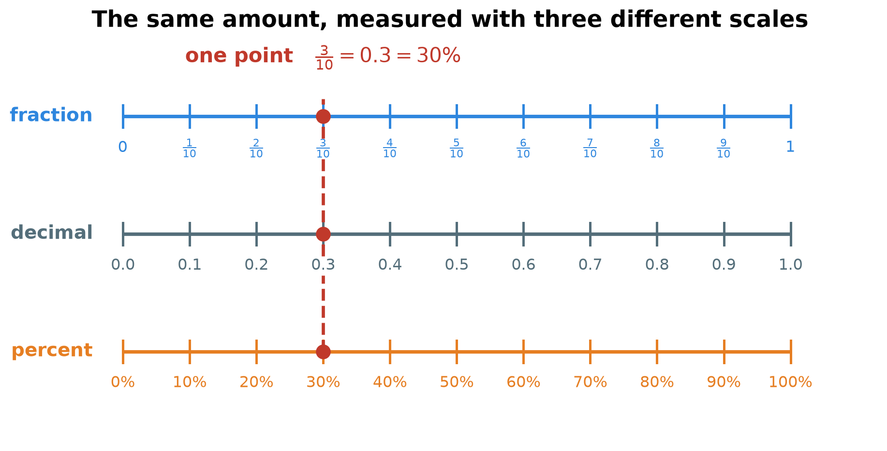
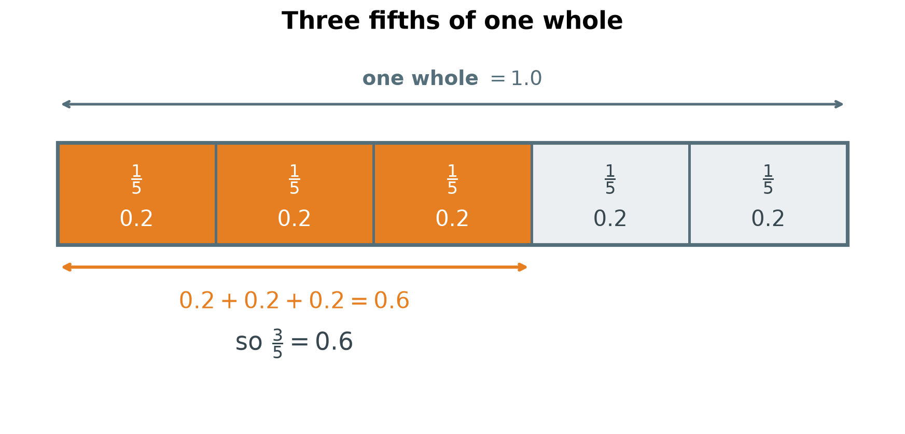
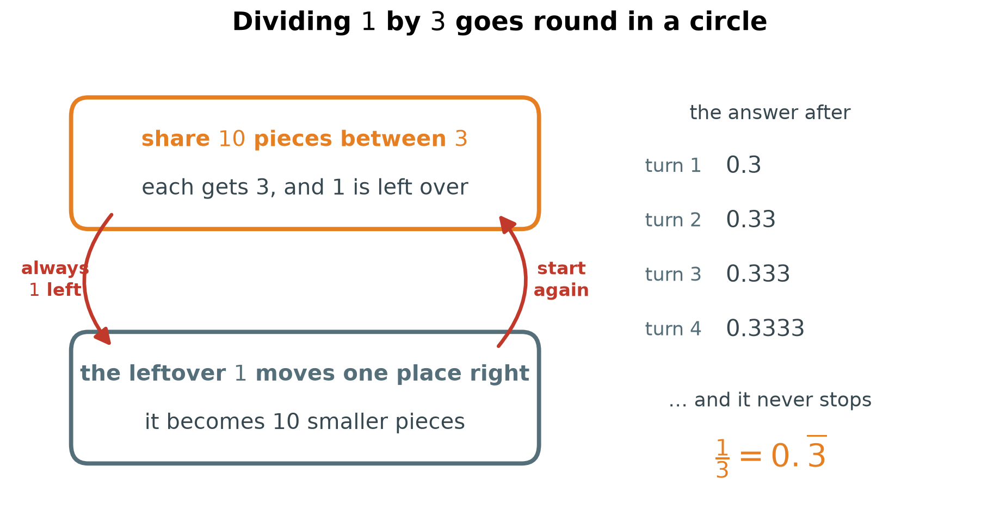
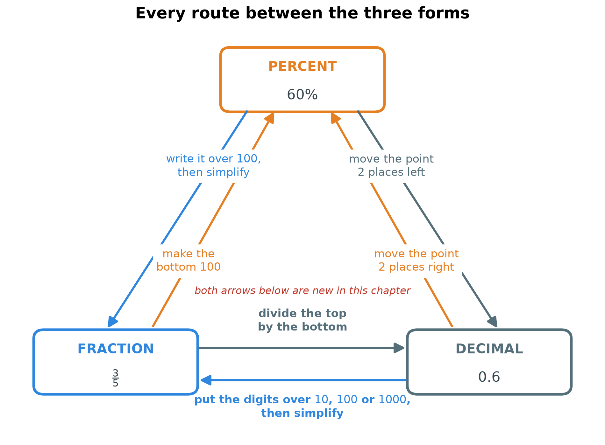
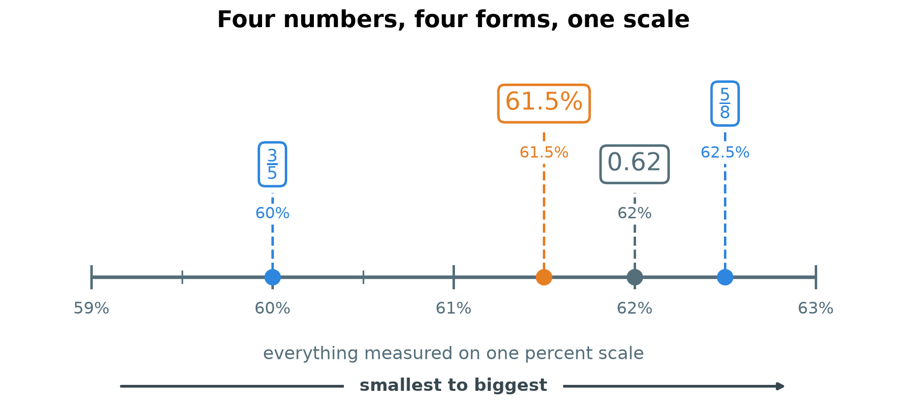
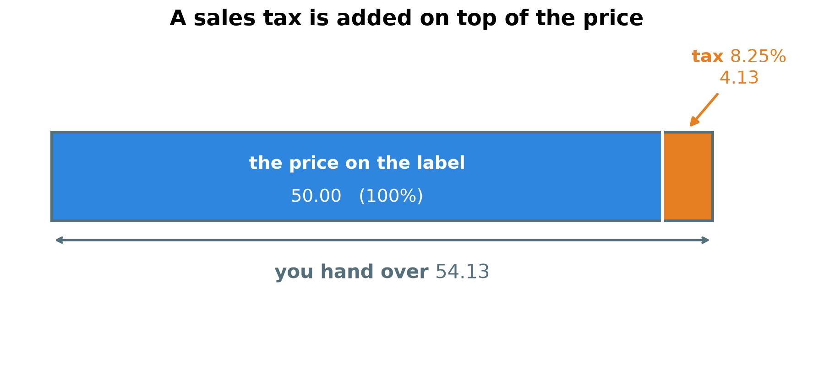

# 4. One number, three names

**What this chapter teaches**
How to turn any fraction into a decimal by dividing, how to turn any decimal back into a
fraction, why some divisions never stop, how to put numbers in order when they are written in
different forms, and how to use the decimal form to work out tax, tips and discounts on money.

**Before you start**
Read [Chapter 1, Fractions](./../1_Fractions/1_Fractions.md),
[Chapter 2, Decimals](./../2_Decimals/2_Decimals.md) and
[Chapter 3, Percentages](./../3_Percentages/3_Percentages.md) first. You need four things from
them: that the fraction bar means divide, how to simplify a fraction, what the tenths and
hundredths places are, and that $P\%$ means $\frac{P}{100}$.

---

## Table of contents

1. [Three names for one number](#1-three-names-for-one-number)
2. [From a fraction to a decimal](#2-from-a-fraction-to-a-decimal)
3. [From a decimal to a fraction](#3-from-a-decimal-to-a-fraction)
4. [The finished map, and the numbers worth knowing](#4-the-finished-map-and-the-numbers-worth-knowing)
5. [Putting mixed forms in order](#5-putting-mixed-forms-in-order)
6. [Working with money](#6-working-with-money)
7. [Glossary](#7-glossary)
8. [Check your understanding](#8-check-your-understanding)
9. [Important notes](#9-important-notes)

---

## 1. Three names for one number

### 1.1 The same point, measured three ways

You have now met three ways of writing a part of a whole.

* A fraction: $\frac{3}{10}$.
* A decimal: $0.3$.
* A percent: $30\%$.

These are not three different amounts. They are **one amount with three names**.

Think about a distance. You can say it is $1$ kilometre, or $1000$ metres, or
$100\,000$ centimetres. The road did not change. Only the ruler changed.

Numbers work the same way. The picture below shows one line drawn three times, with a
different ruler under each copy.

    

**Figure 1 — Look at the red dashed line. It crosses all three rulers in the same place. The
top ruler calls that place $\frac{3}{10}$, the middle one calls it $0.3$, and the bottom one
calls it $30\%$. One place, three names.**

**Definition.** Two numbers are **equivalent** when they sit at the same place on the line,
even though they are written differently. $\frac{3}{10}$, $0.3$ and $30\%$ are equivalent.

### 1.2 Then why do we need three of them?

Because each name is easy for a different job.

| Form | Best for | Why |
| --- | --- | --- |
| Fraction | sharing, recipes, exact answers | $\frac{1}{3}$ of a cake is exact. No digits are lost. |
| Decimal | money, machines, measurements | A calculator, a till and a set of scales all work in decimals. |
| Percent | comparing, discounts, results | Everything is out of $100$, so the numbers can be compared at a glance. |

So the skill is not "which one is right". They are all right. The skill is **moving between
them**, so you can always work in the easiest one and answer in the one you were asked for.

### 1.3 What is still missing

Chapter 3 already built four of the routes between these three forms:

* percent $\to$ fraction, and fraction $\to$ percent — see
  [Chapter 3, section 4.1](./../3_Percentages/3_Percentages.md#41-from-a-percent-to-a-fraction)
  and [section 4.5](./../3_Percentages/3_Percentages.md#45-from-a-fraction-to-a-percent);
* percent $\to$ decimal, and decimal $\to$ percent — see
  [Chapter 3, section 4.3](./../3_Percentages/3_Percentages.md#43-from-a-percent-to-a-decimal)
  and [section 4.4](./../3_Percentages/3_Percentages.md#44-from-a-decimal-to-a-percent).

Two routes are still missing: fraction $\to$ decimal and decimal $\to$ fraction.

There is also a hole in what you can already do. To turn a fraction into a percent, Chapter 3
made the bottom number $100$. That works for $\frac{3}{5}$, because $5 \times 20 = 100$. It
does **not** work for $\frac{3}{8}$, because no whole number turns $8$ into $100$. Sections 2
and 3 fix both problems at once.

### Summary of section 1

* A fraction, a decimal and a percent can be three names for one number.
* Numbers that sit at the same place on the line are **equivalent**.
* Fractions are exact, decimals suit money and machines, percents suit comparing.
* Chapter 3 built four of the six routes between the forms. This chapter builds the last two.

---

## 2. From a fraction to a decimal

### 2.1 The fraction bar was always a division sign

Back in [Chapter 1, section 2.2](./../1_Fractions/1_Fractions.md#22-a-fraction-is-a-division)
you learned that

$$
\frac{a}{b} = a \div b
$$

In words: the line in a fraction is a division sign. The top number is shared between the
bottom number of people.

That single fact is the whole rule for this section.

**Rule.** To turn a fraction into a decimal, **divide the top number by the bottom number**.

$$
\frac{3}{5} = 3 \div 5
$$

But $3$ shared between $5$ people gives each person less than one whole. In
[Chapter 1, section 1.3](./../1_Fractions/1_Fractions.md#13-what-happens-when-the-divisor-is-bigger)
that was the moment we invented fractions. Now we have decimals as well, so we can write the
answer with digits. There are two ways to find it.

### 2.2 Method 1 — find one part first

**Definition.** A **unit fraction** is a fraction with $1$ on top: $\frac{1}{2}$,
$\frac{1}{5}$, $\frac{1}{8}$. It is one single part of the whole.

Start with the unit fraction, because one part is the easiest thing to find.

**How much is $\frac{1}{5}$?** One whole shared between $5$.

One whole is $10$ tenths. Share $10$ tenths between $5$ people:

$$
10 \div 5 = 2
$$

Each person gets $2$ tenths, and $2$ tenths is $0.2$. So $\frac{1}{5} = 0.2$.

Check it: $5$ people with $2$ tenths each hold $5 \times 2 = 10$ tenths, which is one whole.
Correct.

**Now $\frac{3}{5}$.** Three fifths is simply three of those parts:

$$
0.2 + 0.2 + 0.2 = 0.6
$$

So $\frac{3}{5} = 0.6$. Here it is drawn.

    

**Figure 2 — The whole bar is $1$. It is cut into five equal parts, so each part is $0.2$.
Take three of them and you have $0.6$. The orange piece stops a little past the middle of the
bar, which is exactly where $0.6$ belongs.**

These are the unit fractions worth keeping in your head:

| Unit fraction | As a decimal | Why |
| :---: | :---: | :--- |
| $\frac{1}{2}$ | $0.5$ | $10$ tenths shared between $2$ is $5$ tenths |
| $\frac{1}{4}$ | $0.25$ | $100$ hundredths shared between $4$ is $25$ hundredths |
| $\frac{1}{5}$ | $0.2$ | $10$ tenths shared between $5$ is $2$ tenths |
| $\frac{1}{8}$ | $0.125$ | $1000$ thousandths shared between $8$ is $125$ thousandths |
| $\frac{1}{10}$ | $0.1$ | one tenth |
| $\frac{1}{20}$ | $0.05$ | $100$ hundredths shared between $20$ is $5$ hundredths |

**Example.** $\frac{3}{4} = 3 \times 0.25 = 0.75$.

**Note.** This method is quick, but it only helps when you already know the unit fraction.
For anything else, use Method 2 — and Method 2 always works.

### 2.3 Method 2 — divide, and keep going past the point

In Chapter 1 a division that did not come out even left a **remainder**. We stopped there.
Now we do not have to stop, because decimals give us smaller pieces to share.

The idea is one sentence: **when something is left over, cut every leftover piece into ten
smaller pieces and share again.** Cutting into ten is exactly the step to the right in the
place value table — see
[Chapter 2, section 2.2](./../2_Decimals/2_Decimals.md#22-the-rule-of-ten).

**Example.** Turn $\frac{3}{8}$ into a decimal. That means $3 \div 8$: three cakes shared
between eight people.

| The pieces we share | Each of the $8$ gets | What is left |
| :---: | :---: | :---: |
| $3$ ones | $0$ ones | $3$ ones |
| $30$ tenths | $3$ tenths | $6$ tenths |
| $60$ hundredths | $7$ hundredths | $4$ hundredths |
| $40$ thousandths | $5$ thousandths | nothing |

Read the table one row at a time.

* **Row 1.** Three cakes, eight people. Nobody can have a whole cake, so each gets $0$ ones and
  all $3$ cakes are still on the table.
* **Row 2.** Cut every cake into $10$. Three cakes make $30$ tenths. Now share:
  $8 \times 3 = 24$, so each gets $3$ tenths, and $30 - 24 = 6$ tenths are left.
* **Row 3.** Cut those $6$ tenths into $10$ each. That makes $60$ hundredths. Share:
  $8 \times 7 = 56$, so each gets $7$ hundredths, and $60 - 56 = 4$ hundredths are left.
* **Row 4.** Cut those $4$ hundredths into $10$ each. That makes $40$ thousandths. Share:
  $8 \times 5 = 40$, so each gets $5$ thousandths, and nothing is left. The job is finished.

Now read the middle column downwards: $0$, $3$, $7$, $5$. The first one is the ones digit, so
the point goes straight after it:

$$
\frac{3}{8} = 0.375
$$

Check it by putting the pieces back together. Eight people with $375$ thousandths each hold
$8 \times 375 = 3000$ thousandths, and $3000$ thousandths is $3$ wholes. That is what we
shared out. Correct.

**Example.** Turn $\frac{9}{20}$ into a decimal, so $9 \div 20$.

| The pieces we share | Each of the $20$ gets | What is left |
| :---: | :---: | :---: |
| $9$ ones | $0$ ones | $9$ ones |
| $90$ tenths | $4$ tenths | $10$ tenths |
| $100$ hundredths | $5$ hundredths | nothing |

Row 2: $20 \times 4 = 80$, and $90 - 80 = 10$. Row 3: $20 \times 5 = 100$, and
$100 - 100 = 0$.

$$
\frac{9}{20} = 0.45
$$

**Definition.** A decimal that stops, like $0.375$ or $0.45$, is called a **terminating
decimal**. *Terminate* means *come to an end*.

### 2.4 When the division never stops

Try the same method on $\frac{1}{3}$, so $1 \div 3$.

| The pieces we share | Each of the $3$ gets | What is left |
| :---: | :---: | :---: |
| $1$ one | $0$ ones | $1$ one |
| $10$ tenths | $3$ tenths | $1$ tenth |
| $10$ hundredths | $3$ hundredths | $1$ hundredth |
| $10$ thousandths | $3$ thousandths | $1$ thousandth |

Look at the last column. Every row leaves $1$ behind. That $1$ is cut into $10$, and we are
back at "share $10$ pieces between $3$" — exactly the row we just did. The work goes round in
a circle and never ends.

    

**Figure 3 — The two boxes are the only two steps there are, and the red arrows run from each
one back to the other. Every turn of the loop adds one more $3$ to the answer. Nothing ever
changes, so nothing ever stops.**

**Definition.** A decimal whose digits repeat for ever is a **repeating decimal**. We write it
with a bar over the digits that repeat:

$$
\frac{1}{3} = 0.333\ldots = 0.\overline{3}
$$

$$
\frac{2}{3} = 0.666\ldots = 0.\overline{6}
$$

The bar over the $3$ means "this digit goes on for ever". The three dots mean the same thing.

**Warning.** $0.\overline{3}$ is not the same as $0.333$. The first one never ends; the second
one stops after three digits and is very slightly smaller. When you need a short answer, say
how you shortened it: "$\frac{1}{3}$ is about $0.33$."

### 2.5 And then straight on to a percent

Once a fraction is a decimal, a percent is one short step away: move the point two places to
the right ([Chapter 3, section 4.4](./../3_Percentages/3_Percentages.md#44-from-a-decimal-to-a-percent)).

$$
\frac{3}{5} = 0.6 = 0.60 = 60\%
$$

This gives you a second road to a percent, and it is the road that rescues the fractions
Chapter 3 could not handle. The bottom of $\frac{3}{8}$ never reaches $100$ by a whole-number
step. Dividing does not care:

$$
\frac{3}{8} = 0.375 = 37.5\%
$$

It even works for the fractions that repeat:

$$
\frac{1}{3} = 0.\overline{3} = 33.\overline{3}\%
$$

That is a third of the whole, and a third of $100$ is $33$ with $1$ left over — which is why
the digits carry on.

### Summary of section 2

* A fraction is a division: $\frac{a}{b}$ means $a \div b$.
* Method 1: find the unit fraction $\frac{1}{b}$ as a decimal, then take $a$ of them.
* Method 2: divide, and every time something is left over, cut it into ten smaller pieces and
  share again.
* $\frac{3}{5} = 0.6$, $\frac{3}{8} = 0.375$, $\frac{9}{20} = 0.45$.
* Some divisions never end. $\frac{1}{3} = 0.\overline{3}$, because the leftover is always $1$.
* Dividing turns **any** fraction into a percent, even when the bottom cannot reach $100$.

---

## 3. From a decimal to a fraction

### 3.1 The last digit names the bottom number

This is the easiest conversion in the whole chapter, because the decimal already tells you the
answer. You only have to listen to how it is read.

$0.7$ is read "seven **tenths**". So write it as seven tenths:

$$
0.7 = \frac{7}{10}
$$

$0.65$ is read "sixty-five **hundredths**":

$$
0.65 = \frac{65}{100}
$$

**Rule.** Write the digits after the point as the top number. The **last** digit tells you the
bottom number: tenths give $10$, hundredths give $100$, thousandths give $1000$. Then simplify.

| Decimal | Last digit sits in | Fraction before simplifying |
| :---: | :---: | :---: |
| $0.7$ | tenths | $\frac{7}{10}$ |
| $0.65$ | hundredths | $\frac{65}{100}$ |
| $0.065$ | thousandths | $\frac{65}{1000}$ |
| $0.375$ | thousandths | $\frac{375}{1000}$ |

**Note.** Count **all** the places after the point, including any zeros. In $0.065$ the last
digit is the third one, so the bottom number is $1000$ and not $100$. The zero is holding a
place, just as in
[Chapter 2, section 3.3](./../2_Decimals/2_Decimals.md#33-zero-holds-an-empty-place).

### 3.2 Then simplify

A fraction is not finished until nothing but $1$ divides both lines
([Chapter 1, section 3.3](./../1_Fractions/1_Fractions.md#33-simplifying-a-fraction)).

**Example.** $0.65$.

$$
0.65 = \frac{65}{100}
$$

Both numbers can be divided by $5$:

$$
\frac{65}{100} = \frac{65 \div 5}{100 \div 5} = \frac{13}{20}
$$

Only $1$ divides both $13$ and $20$, so $0.65 = \frac{13}{20}$.

**Example.** $0.065$.

$$
0.065 = \frac{65}{1000} = \frac{65 \div 5}{1000 \div 5} = \frac{13}{200}
$$

So $0.065 = \frac{13}{200}$.

### 3.3 The round trip

In section 2.3 we divided $3$ by $8$ and got $0.375$. Let us walk back the other way and see
whether we land where we started.

$$
0.375 = \frac{375}{1000}
$$

Both numbers end in a $5$, so divide both by $5$ — three times over:

$$
\frac{375}{1000} = \frac{75}{200} = \frac{15}{40} = \frac{3}{8}
$$

We are back at $\frac{3}{8}$. The two routes really are the same road, walked in opposite
directions.

**Note.** You could have done that in one step by dividing both lines by $125$, their greatest
common factor ([Chapter 3, section 4.2](./../3_Percentages/3_Percentages.md#42-doing-it-in-one-step-the-greatest-common-factor)).
Dividing by $5$ again and again is slower but easier to see, and it reaches the same place.

### Summary of section 3

* Read the decimal out loud. The last place gives the bottom number.
* One place after the point means $10$, two means $100$, three means $1000$.
* Count zeros as places: $0.065$ is $\frac{65}{1000}$, not $\frac{65}{100}$.
* Always simplify at the end.
* $0.7 = \frac{7}{10}$, $0.65 = \frac{13}{20}$, $0.065 = \frac{13}{200}$,
  $0.375 = \frac{3}{8}$.

---

## 4. The finished map, and the numbers worth knowing

### 4.1 Every route in one picture

All six routes now exist. Here they are together.

    

**Figure 4 — Start in any box, follow an arrow, and do what the arrow says. The four arrows
that reach the top box are the ones from Chapter 3. The two arrows along the bottom are the
ones this chapter added, and they are the two that work for every fraction, not only for
fractions with $100$ underneath.**

You do not always need the shortest route. Going the long way round is often easier:

$$
\frac{3}{8}
\;\xrightarrow{\ \text{divide}\ }\;
0.375
\;\xrightarrow{\ \text{two places right}\ }\;
37.5\%
$$

### 4.2 The table worth learning

You will meet these fractions again and again. Learning the row is faster than doing the work
every time.

| Fraction | Decimal | Percent |
| :---: | :---: | :---: |
| $\frac{1}{10}$ | $0.1$ | $10\%$ |
| $\frac{1}{5}$ | $0.2$ | $20\%$ |
| $\frac{1}{4}$ | $0.25$ | $25\%$ |
| $\frac{3}{10}$ | $0.3$ | $30\%$ |
| $\frac{1}{3}$ | $0.\overline{3}$ | $33.\overline{3}\%$ |
| $\frac{2}{5}$ | $0.4$ | $40\%$ |
| $\frac{1}{2}$ | $0.5$ | $50\%$ |
| $\frac{3}{5}$ | $0.6$ | $60\%$ |
| $\frac{2}{3}$ | $0.\overline{6}$ | $66.\overline{6}\%$ |
| $\frac{3}{4}$ | $0.75$ | $75\%$ |
| $\frac{4}{5}$ | $0.8$ | $80\%$ |
| $\frac{9}{10}$ | $0.9$ | $90\%$ |
| $\frac{1}{1}$ | $1.0$ | $100\%$ |

**Note.** Only two rows in the table repeat for ever, and they are the two with $3$ on the
bottom. Every other bottom number here divides a power of ten exactly, so the division ends.

### Summary of section 4

* There are six routes between the three forms, and you now know all six.
* Two forms can be joined through the third one, and often that is the easy way.
* $\frac{3}{8} = 0.375 = 37.5\%$.
* Learn the common table. It saves work in every later chapter.

---

## 5. Putting mixed forms in order

### 5.1 You cannot compare them as they are

Which is biggest?

$$
45\%, \qquad \frac{21}{50}, \qquad 0.43
$$

Looking at them tells you nothing useful. $45$ is the biggest number on the page, but it is a
percent. $50$ is bigger still, but it is a bottom number, and a bigger bottom number means
*smaller* pieces ([Chapter 1, section 4.2](./../1_Fractions/1_Fractions.md#42-when-the-numerators-are-the-same)).
The three numbers are measured with three different rulers, so their digits cannot be compared.

This is the same problem the three quizzes had in
[Chapter 3, section 1.2](./../3_Percentages/3_Percentages.md#12-the-problem-that-percentages-solve),
and it has the same cure.

**Rule.** To compare or order numbers in mixed forms, **first write every one of them in the
same form.** Percent is usually the easiest choice, because every answer then lands out of
$100$.

### 5.2 The three numbers, solved

**Step 1 — move everything to percent.**

$45\%$ is already a percent. Leave it.

$\frac{21}{50}$: the bottom is $50$, and $50 \times 2 = 100$, so multiply both lines by $2$:

$$
\frac{21}{50} = \frac{21 \times 2}{50 \times 2} = \frac{42}{100} = 42\%
$$

$0.43$: move the point two places to the right:

$$
0.43 \quad \to \quad 43\%
$$

**Step 2 — compare.** Now every number is out of $100$, so the top numbers decide:

$$
42\% < 43\% < 45\%
$$

**Step 3 — answer in the forms you were given.** The question asked about the original numbers,
so put their own names back:

$$
\frac{21}{50} \; < \; 0.43 \; < \; 45\%
$$

**Warning.** Do the comparing in the converted form, but write the answer in the original form.
A reader who asked about $\frac{21}{50}$ wants to see $\frac{21}{50}$ in the answer.

### 5.3 A harder one, with four numbers

Put these in order, smallest first:

$$
0.62, \qquad \frac{3}{5}, \qquad 61.5\%, \qquad \frac{5}{8}
$$

**$0.62$** — two places right:

$$
0.62 = 62\%
$$

**$\frac{3}{5}$** — the bottom reaches $100$, so scale both lines by $20$:

$$
\frac{3}{5} = \frac{60}{100} = 60\%
$$

**$61.5\%$** — already a percent.

**$\frac{5}{8}$** — the bottom does **not** reach $100$, so divide instead, $5 \div 8$:

| The pieces we share | Each of the $8$ gets | What is left |
| :---: | :---: | :---: |
| $5$ ones | $0$ ones | $5$ ones |
| $50$ tenths | $6$ tenths | $2$ tenths |
| $20$ hundredths | $2$ hundredths | $4$ hundredths |
| $40$ thousandths | $5$ thousandths | nothing |

$$
\frac{5}{8} = 0.625 = 62.5\%
$$

Now all four sit on one ruler:

$$
60\% \; < \; 61.5\% \; < \; 62\% \; < \; 62.5\%
$$

    

**Figure 5 — Only the stretch from $59\%$ to $63\%$ is drawn, so the line is very stretched
out. The four numbers are crowded into a space of two and a half percent, which is why
guessing their order is hopeless. Once they are all on the same scale, reading them from left
to right gives the answer.**

Putting the original names back:

$$
\frac{3}{5} \; < \; 61.5\% \; < \; 0.62 \; < \; \frac{5}{8}
$$

### Summary of section 5

* Numbers in different forms cannot be compared as they are written.
* Convert them all into one form first. Percent is usually the easiest.
* Then the top numbers alone decide the order.
* Give the answer using the forms in the question.

---

## 6. Working with money

Money is where the decimal form earns its place. A till, a bank and a calculator all work in
decimals, so a percentage is turned into a decimal before anything is multiplied.

### 6.1 Multiplying a decimal by a whole number

So far the book has only added decimals
([Chapter 2, section 6](./../2_Decimals/2_Decimals.md#6-adding-decimals)). For money we also
need to multiply one.

Start with something you have already seen. In section 2.2 we found $3 \times 0.2$ by counting
pieces: three lots of $2$ tenths is $6$ tenths, which is $0.6$.

Nothing else is going on. Multiplying a decimal by a whole number is just **counting pieces**:

* $0.2$ is $2$ tenths, so $3 \times 0.2$ is $3 \times 2 = 6$ tenths.
* $0.15$ is $15$ hundredths, so $32 \times 0.15$ is $32 \times 15 = 480$ hundredths.

And $480$ hundredths is $4.80$, because $100$ hundredths make one whole.

**The rule.** Multiply as if the point were not there. Then give the answer **the same number
of decimal places** as the decimal you started with.

$$
32 \times 15 = 480
\qquad \to \qquad
32 \times 0.15 = 4.80
$$

$0.15$ has two decimal places, so the answer has two decimal places.

**Why it works.** The digits never change; only the size of one piece changes. Counting $480$
hundredths and writing $4.80$ are the same act. The count gives you the digits, and the place
tells you where the point goes.

**Warning.** The rule is about the number of decimal *places*, not about the size of the
answer. $32 \times 0.15$ comes out smaller than $32$, because you are taking only a part of it.

### 6.2 Sales tax on a shirt

**Definition.** **Sales tax** is a percentage that a government adds to the price of something
you buy. It is added on top, like the tip in
[Chapter 3, section 6.2](./../3_Percentages/3_Percentages.md#62-method-1--simplify-the-percentage-first),
not taken off like a discount.

**Problem.** A shirt costs $50.00$. The sales tax is $8.25\%$. How much is the tax?

**Step 1 — turn the percent into a decimal.** Move the point two places to the left. The point
in $8.25$ is already written, so move it from where it is:

$$
8.25 \quad \to \quad 0.825 \quad \to \quad 0.0825
$$

$$
8.25\% = 0.0825
$$

**Note.** Two places, not one. After the first step you have $0.825$, and stopping there would
claim $82.5\%$ of the shirt as tax. The second step needs a zero to fill the tenths place, in
exactly the way described in
[Chapter 3, section 10](./../3_Percentages/3_Percentages.md#10-important-notes).

**Step 2 — multiply.** Ignore the point and multiply:

$$
50 \times 825 = 41250
$$

$0.0825$ has four decimal places, so the answer has four decimal places:

$$
50 \times 0.0825 = 4.1250 = 4.125
$$

Zeros at the end change nothing
([Chapter 2, section 3.4](./../2_Decimals/2_Decimals.md#34-zeros-at-the-end-change-nothing)).

**Step 3 — is it sensible?** $8.25\%$ is a little more than $8\%$, and $8\%$ of $50$ is $4$. An
answer near $4$ is right. A tax of $40$ on a shirt of $50$ would have been nonsense.

    

**Figure 6 — The bar is drawn to scale. The blue part is the price on the label, and the small
orange part is the tax, stuck on the end of it. Together you hand over $54.13$.**

### 6.3 Rounding to the nearest cent

The answer was $4.125$. But money has only two decimal places: a cent is one hundredth of a
dollar. There is no such coin as half a cent, so we must choose $4.12$ or $4.13$.

**Definition.** To **round** a number is to replace it with the nearest number that has fewer
decimal places.

Keep two places, and look at the **next** digit — the first one you are about to drop.

* If it is $5$ or more, add $1$ to the last digit you keep.
* If it is $4$ or less, leave the last digit you keep alone.

In $4.125$ the digit after the two places we keep is $5$. So we add $1$ to the last kept digit:

$$
4.125 \quad \to \quad 4.13
$$

The tax on the shirt is $4.13$, and the total to pay is $50.00 + 4.13 = 54.13$.

**Warning.** Round only at the **end**. If you round $4.125$ to $4.13$ and then carry on
calculating with it, every later answer is slightly wrong. Keep the long number while you work.

### 6.4 A discount written as a fraction

Shops do not always use percentages. Some write "$\frac{3}{8}$ off".

**Problem.** A jacket costs $120.00$. The discount is $\frac{3}{8}$ off. What do you save, and
what do you pay?

**Step 1 — give the discount its other two names.** We did this division in section 2.3:

$$
\frac{3}{8} = 0.375 = 37.5\%
$$

So "$\frac{3}{8}$ off" and "$37.5\%$ off" are the same sign in the window.

**Step 2 — find the discount.** Multiply the price by the decimal:

$$
120 \times 375 = 45000
$$

$0.375$ has three decimal places, so the answer has three:

$$
120 \times 0.375 = 45.000 = 45
$$

You save $45.00$.

**Step 3 — find the price you pay.** A discount is taken off
([Chapter 3, section 7](./../3_Percentages/3_Percentages.md#7-a-full-example-the-shoes-in-the-sale)):

$$
120 - 45 = 75
$$

You pay $75.00$.

**Check it a second way.** Work straight from the fraction instead. $\frac{3}{8}$ of $120$
means: cut $120$ into $8$ equal parts, then take $3$ of them.

$$
120 \div 8 = 15
$$

$$
15 \times 3 = 45
$$

The same $45$. Two different roads, one answer — that is how you know it is right.

### Summary of section 6

* Turn the percent into a decimal before you multiply.
* To multiply a decimal by a whole number: multiply without the point, then give the answer the
  same number of decimal places as the decimal had.
* $8.25\% = 0.0825$, and $8.25\%$ of $50$ is $4.125$, which is $4.13$ in money.
* Round only at the very end, and let the first digit you drop decide.
* $\frac{3}{8}$ off $120$ saves $45$ and leaves $75$ to pay.

---

## 7. Glossary

Only the words that appear for the first time in this chapter are listed. For *numerator*,
*denominator*, *simplify* and *remainder* see
[Chapter 1](./../1_Fractions/1_Fractions.md#7-glossary); for *tenths*, *hundredths* and
*place value* see [Chapter 2](./../2_Decimals/2_Decimals.md#8-glossary); for *percent*,
*ratio* and *greatest common factor* see
[Chapter 3](./../3_Percentages/3_Percentages.md#8-glossary).

* **Equivalent** — sitting at the same place on the number line, although written differently.
  $\frac{3}{10}$, $0.3$ and $30\%$ are equivalent.
* **Unit fraction** — a fraction with $1$ on top, such as $\frac{1}{5}$. It is one single part
  of the whole.
* **Terminating decimal** — a decimal that comes to an end, such as $0.375$.
* **Repeating decimal** — a decimal whose digits go on for ever in the same pattern, such as
  $0.\overline{3}$. The bar marks the digits that repeat.
* **Round** — to replace a number with the nearest number that has fewer decimal places.
  $4.125$ rounded to two places is $4.13$.
* **Sales tax** — a percentage that a government adds on top of the price of something you buy.

---

## 8. Check your understanding

Try each one on paper before you open the answer.

**Question 1.** Write $\frac{7}{10}$ as a decimal and as a percent.

Answer

The bottom is $10$, so the $7$ goes in the tenths place:

$$
\frac{7}{10} = 0.7
$$

Then move the point two places to the right. Write the trailing zero first, so there is a
second place to move into:

$$
0.7 = 0.70 = 70\%
$$

**Question 2.** Write $\frac{9}{20}$ as a percent in two different ways.

Answer

**Way 1 — scale the bottom to $100$.** Since $20 \times 5 = 100$:

$$
\frac{9}{20} = \frac{9 \times 5}{20 \times 5} = \frac{45}{100} = 45\%
$$

**Way 2 — divide first.** From section 2.3, $9 \div 20 = 0.45$. Then move the point two places
to the right:

$$
0.45 \quad \to \quad 45\%
$$

Both give $45\%$. When two different methods agree, the answer is almost certainly right.

**Question 3.** Write $0.375$ as a fraction in its simplest form.

Answer

There are three digits after the point, so the bottom number is $1000$:

$$
0.375 = \frac{375}{1000}
$$

Divide both lines by $5$, three times:

$$
\frac{375}{1000} = \frac{75}{200} = \frac{15}{40} = \frac{3}{8}
$$

Only $1$ divides both $3$ and $8$, so $0.375 = \frac{3}{8}$.

**Question 4.** Write $6.5\%$ as a decimal, and then as a fraction in its simplest form.

Answer

Move the point two places to the left. It starts between the $6$ and the $5$:

$$
6.5 \quad \to \quad 0.65 \quad \to \quad 0.065
$$

So $6.5\% = 0.065$. Stopping at $0.65$ would be ten times too big.

Now the fraction. Three places after the point, so the bottom is $1000$:

$$
0.065 = \frac{65}{1000} = \frac{65 \div 5}{1000 \div 5} = \frac{13}{200}
$$

$13$ does not divide $200$, so $6.5\% = \frac{13}{200}$.

**Question 5.** Which is bigger, $\frac{3}{8}$ or $37\%$? How do you know?

Answer

They are written in different forms, so put them both into the same form first.

The bottom of $\frac{3}{8}$ cannot be scaled to $100$ by a whole number, so divide instead.
From section 2.3, $\frac{3}{8} = 0.375$, and moving the point two places to the right gives

$$
\frac{3}{8} = 37.5\%
$$

Now compare: $37.5\%$ against $37\%$. So $\frac{3}{8}$ is the bigger of the two.

**Question 6.** A restaurant bill is $32.00$. You want to leave a tip of $15\%$. How much is
the tip?

Answer

Turn the percent into a decimal — two places left:

$$
15\% = 0.15
$$

Multiply without the point:

$$
32 \times 15 = 480
$$

$0.15$ has two decimal places, so the answer has two:

$$
32 \times 0.15 = 4.80
$$

The tip is $4.80$. Check it roughly: $10\%$ of $32$ is $3.20$, and half of that again is
$1.60$, so $15\%$ should be about $4.80$. It matches.

**Question 7.** Why does $\frac{3}{8}$ stop after three decimal places, while $\frac{1}{3}$
never stops at all?

Answer

Because of what is left over at each step.

With $3 \div 8$ the leftovers were $3$, then $6$, then $4$, then nothing. Once the leftover
reaches zero, there is nothing more to share and the division is finished.

With $1 \div 3$ the leftover is $1$ every single time. That $1$ is cut into ten, giving $10$ to
share between $3$ — which is the step we just did. The same step repeats for ever, so the
digits repeat for ever: $0.\overline{3}$.

A division ends when a leftover of zero appears. If no leftover is ever zero, it cannot end.

**Question 8.** A friend says: "$0.3$ must be smaller than $\frac{1}{4}$, because $3$ is
smaller than $4$." What is wrong with that?

Answer

The $3$ and the $4$ are not the same kind of number, so comparing them means nothing. The $3$
in $0.3$ counts tenths. The $4$ in $\frac{1}{4}$ is a bottom number — it says how many pieces
one whole was cut into, and a bigger bottom number makes each piece **smaller**.

Put both into one form and the fog clears:

$$
0.3 = 30\%
\qquad
\frac{1}{4} = 0.25 = 25\%
$$

So $0.3$ is the bigger one, not the smaller one. Never compare digits across two different
forms.

---

## 9. Important notes

**The three mistakes that cost the most marks.**

* **Moving the point the wrong way.** Turning $25\%$ into $2500$ instead of $0.25$. Use the
  meaning as your guard: a percent is a part of the whole, so its decimal must be **smaller**
  than the percent number. Percent to decimal goes **left**; decimal to percent goes **right**.
* **Dividing the wrong way round.** $\frac{3}{5}$ means $3 \div 5$, not $5 \div 3$. The top
  number is the one being shared out. Here is the check: a proper fraction is less than one
  ([Chapter 1, section 2.4](./../1_Fractions/1_Fractions.md#24-proper-fractions)), so its
  decimal must start with $0$. If your answer for $\frac{3}{5}$ comes out as $1.6$, you divided
  the wrong way.
* **Comparing forms by eye.** $\frac{21}{50}$ looks bigger than $45\%$ because $50$ is bigger
  than $45$. It is not. Nothing can be compared until everything is in one form, as in
  section 5.

Two more mistakes belong to Chapter 3 and are worth re-reading before a test: forgetting the
place-holder zero (writing $3\%$ as $0.3$), and scaling only one line of a fraction. Both are
in [Chapter 3, section 10](./../3_Percentages/3_Percentages.md#10-important-notes).

**The three ideas to keep.**

* **One number, three names.** Nothing is turned into something else. The number never moves;
  only its name changes. That is why every conversion can be walked backwards, and why
  section 3.3 landed exactly where section 2.3 started.
* **Divide, and keep going.** The one new piece of machinery in this chapter is that a leftover
  can always be cut into ten smaller pieces. That is what lets a division carry on past the
  point, and it is the reason every fraction has a decimal.
* **Pick the form that makes the work easy.** Compare in percent. Calculate money in decimals.
  Share things exactly in fractions. Then answer in whatever form you were asked for.

**How this chapter connects to the rest of the book.**
Chapter 1 told you that $\frac{a}{b}$ means $a \div b$, but you could not finish that division
when it did not come out even. Chapter 2 gave you the places after the point. This chapter put
those two facts together: the leftover from Chapter 1 goes into the places from Chapter 2, and
the division finishes. Chapter 3 built the map between percent, fraction and decimal but left
two arrows incomplete, and those two arrows are what sections 2 and 3 have now drawn. From here
on, any number you meet can be moved into any form you like.

---

- [Back to the book](./../README.md)
- Previous: [3 Percentages](./../3_Percentages/3_Percentages.md)
- Next: not written yet.
