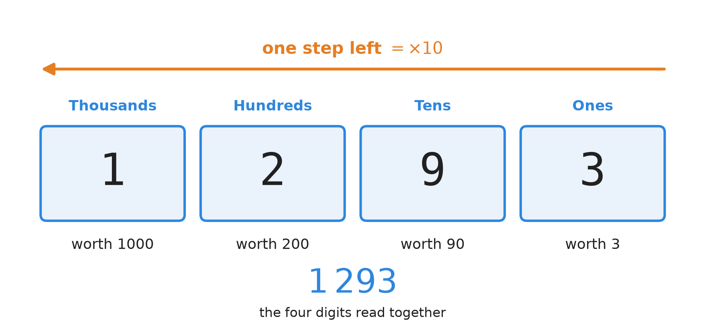
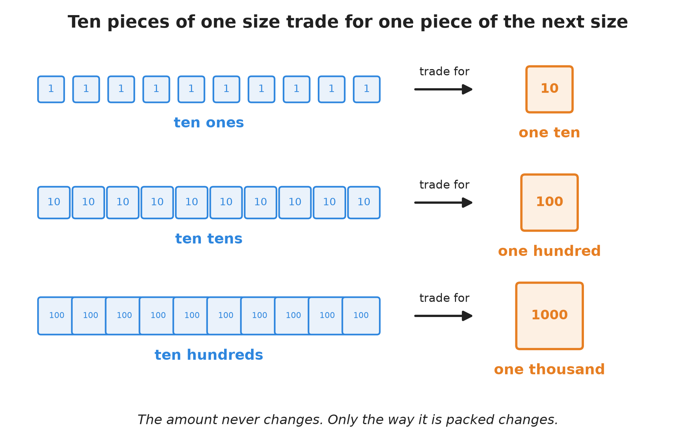
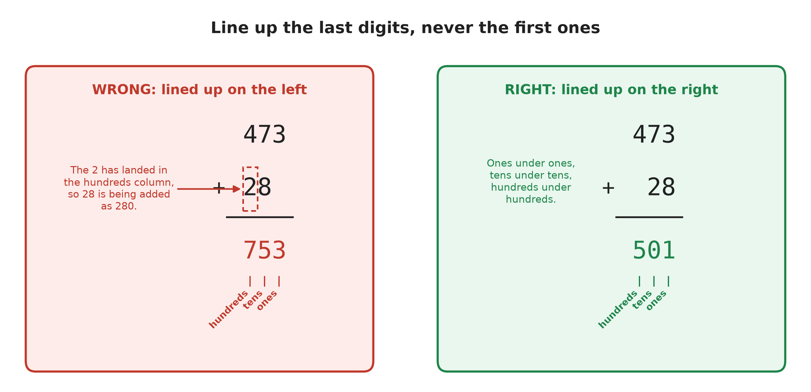
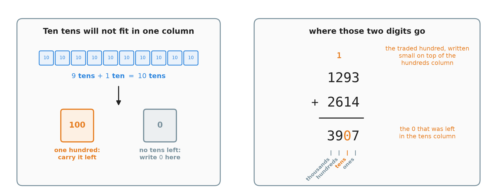
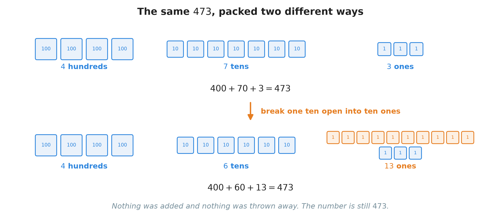
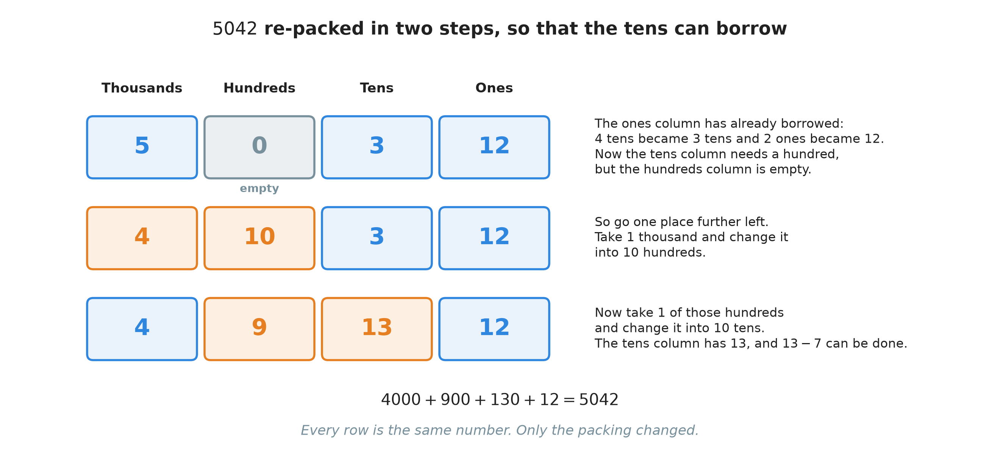

# 5. Adding and subtracting large numbers

**What this chapter teaches**
How to add and subtract numbers that are far too big to count on your fingers, using only
paper and a pencil. You will learn how to set the numbers out in columns, what carrying and
borrowing really do to a number, and how to subtract when the column next door is a zero.

**Before you start**
Read [Chapter 1, Fractions](./../1_Fractions/1_Fractions.md) and
[Chapter 2, Decimals](./../2_Decimals/2_Decimals.md) first. You need two things from
Chapter 2: what **place value** is, and the **rule of ten** — one step to the left makes a
place ten times bigger.

---

## Table of contents

1. [Why counting is not enough](#1-why-counting-is-not-enough)
2. [The places to the left of the ones](#2-the-places-to-the-left-of-the-ones)
3. [Setting the numbers out in columns](#3-setting-the-numbers-out-in-columns)
4. [Adding large numbers](#4-adding-large-numbers)
5. [Adding a long list of numbers at once](#5-adding-a-long-list-of-numbers-at-once)
6. [Subtracting large numbers](#6-subtracting-large-numbers)
7. [When the column next door is a zero](#7-when-the-column-next-door-is-a-zero)
8. [Glossary](#8-glossary)
9. [Check your understanding](#9-check-your-understanding)
10. [Important notes](#10-important-notes)

---

## 1. Why counting is not enough

### 1.1 With small numbers, counting works

You have $2$ apples. Someone gives you $3$ more. How many do you have?

$$
2 + 3 = 5
$$

You can check this answer without trusting anybody. Put the apples on the table and point at
them one at a time: one, two, three, four, five. Counting is slow, but for five apples it is
perfectly good.

### 1.2 With large numbers, counting stops working

Now take a real question. One market sells $1\,293$ apples in a day. A second market sells
$2\,614$ apples. How many apples did the two markets sell together?

You could try to count them. You would be counting for hours. Long before the end you would
lose your place, and you would have no way of knowing that you had.

**Note.** Big numbers are often written with a small gap or a comma every three digits:
$1\,293$ or $1,293$. That mark is only there to make the digits easy to read in groups. It is
**not** a decimal point, and it does not change the value. $1\,293$ and $1293$ are the same
number.

### 1.3 So we use an algorithm instead

**Definition.** An **algorithm** is a fixed list of steps. If you follow the steps exactly,
you get the right answer every time, even when the numbers are far too big to picture.

The algorithms in this chapter are the ones you were probably shown at school: write the
numbers one under the other, and work through them column by column.

**Explanation.** Why does writing the numbers in columns help so much? Because it breaks one
hard question into several easy ones. You cannot see $1\,293$ apples in your head. But you
can certainly do $3 + 4$, and $9 + 1$, and $2 + 6$. The column method never asks you to add
anything bigger than two single digits at a time. It does the hard part — keeping track of
which digit is worth what — by using the *position* of the digit on the paper.

### Summary of section 1

* Counting one by one is fine for small numbers and useless for large ones.
* An algorithm is a fixed list of steps that always gives the right answer.
* The column method turns one hard sum into several easy single-digit sums.
* A comma or a small gap inside a big number only separates groups of three digits.

---

## 2. The places to the left of the ones

Chapter 2 built the place value system and then walked **right**, into tenths and hundredths.
This chapter needs the same system walked **left**, into thousands and beyond. The rule is the
one you already know; only the direction is new.

### 2.1 Ten symbols, and nothing more

**Definition.** A **digit** is one of the ten symbols we write numbers with:

$$
0, \quad 1, \quad 2, \quad 3, \quad 4, \quad 5, \quad 6, \quad 7, \quad 8, \quad 9
$$

There are no others. Every number that has ever been written, however large, is built from
these ten symbols.

That should feel surprising. Ten symbols, and yet we can write a number as big as we like.
The trick is the one from
[Chapter 2, section 2.1](./../2_Decimals/2_Decimals.md#21-the-position-of-a-digit-decides-its-value):
a digit does not only mean itself. It also means something because of **where it stands**.

### 2.2 Walking left past the hundreds

[Chapter 2, section 2.2](./../2_Decimals/2_Decimals.md#22-the-rule-of-ten) gave the rule of
ten: one step to the left makes a place ten times bigger. Chapter 2 only needed three places
going left — ones, tens, hundreds. Nothing stops us from taking one more step.

Ten times a hundred is a thousand. So the place to the left of the hundreds is the
**thousands** place.

    

**Figure 1 — The four digits of $1\,293$, each in its own place. The same digit means a
different amount in each box. Follow the orange arrow: every step to the left is worth ten
times more than the step before it.**

| Place | What one of them is worth |
| --- | :---: |
| Ones | $1$ |
| Tens | $10$ |
| Hundreds | $100$ |
| Thousands | $1000$ |

**Note.** The list does not stop at thousands. Take one more step to the left and the place is
ten times bigger again, and so on for ever. This chapter only needs to go as far as thousands.

### 2.3 What a number is made of

Reading Figure 1 from left to right, $1\,293$ is one thousand, two hundreds, nine tens and
three ones:

$$
1\,293 = (1 \times 1000) + (2 \times 100) + (9 \times 10) + (3 \times 1)
$$

In words: the $1$ stands for one lot of a thousand, the $2$ for two lots of a hundred, the $9$
for nine lots of ten, and the $3$ for three single ones.

Let us put those four amounts back together, one step at a time:

$$
1000 + 200 = 1200
$$

$$
1200 + 90 = 1290
$$

$$
1290 + 3 = 1293
$$

The number is back. Nothing was lost, so the way we read the digits was right.

### 2.4 Ten of one size make one of the next size

This is the most important idea in the chapter. Everything that follows is built on it.

Because each place is ten times the place on its right, **ten pieces of one size can always be
traded for one piece of the next size up**:

| Ten of these | make one of these |
| --- | --- |
| $10$ ones | $1$ ten |
| $10$ tens | $1$ hundred |
| $10$ hundreds | $1$ thousand |

    

**Figure 2 — Each row is a fair trade. Ten ones are worth exactly one ten. Ten tens are worth
exactly one hundred. Ten hundreds are worth exactly one thousand. The amount of money in your
hand never changes — only the size of the pieces it is made of.**

**Note.** You have already used this rule, in the other direction. In
[Chapter 2, section 6.5](./../2_Decimals/2_Decimals.md#65-when-a-column-is-too-full-carrying)
ten hundredths made one tenth, and ten tenths made one whole. It is one rule, working the same
way at every size.

This trade can be made in either direction, and that is what this whole chapter is about:

* Going **up** a size — packing ten small pieces into one big one — is called **carrying**,
  and it is what addition needs.
* Going **down** a size — breaking one big piece into ten small ones — is called
  **borrowing**, and it is what subtraction needs.

### Summary of section 2

* A digit is one of the ten symbols $0$ to $9$; every number is built from them.
* One step to the left is ten times bigger, so after hundreds comes thousands.
* $1\,293$ means $(1 \times 1000) + (2 \times 100) + (9 \times 10) + (3 \times 1)$.
* Ten pieces of one size always trade for one piece of the next size up.
* Packing ten small pieces into one big one is carrying; breaking one big piece into ten small
  ones is borrowing.

---

## 3. Setting the numbers out in columns

### 3.1 One column holds one kind of piece

[Chapter 2, section 6.1](./../2_Decimals/2_Decimals.md#61-the-golden-rule-line-up-the-decimal-points)
gave the rule that makes column arithmetic work: **you can only add pieces of the same size**.
Three tens plus four tens is seven tens. Three tens plus four *hundreds* is not seven of
anything.

So each column must hold one kind of piece and nothing else: the ones column only ones, the
tens column only tens, the hundreds column only hundreds.

For decimals, Chapter 2 got this right by lining up the decimal points. A whole number has no
point written on it, but it still has one — it sits at the right-hand end. The number $473$ is
the same number as $473.0$. So for whole numbers the rule becomes even simpler:

> **Line up the last digits.** Put the ones digit under the ones digit, and every other column
> falls into place by itself.

    

**Figure 3 — Look at where the $2$ of $28$ lands. On the left it has slipped into the hundreds
column, so the sum being worked out is really $473 + 280$, and the answer $753$ is wrong. On
the right the last digits are under each other, the $8$ is in the ones column where it belongs,
and the answer is $501$.**

**Warning.** This is the mistake that costs the most marks in the whole chapter, and it is
easy to make when the two numbers have different lengths. Write the longer number first, then
slide the shorter one right until its last digit is under the last digit above it.

### 3.2 Draw a line, and work from the right

Once the numbers are stacked, draw a horizontal line under them. The answer is written below
that line, one digit per column.

Then work **from right to left**: ones first, then tens, then hundreds, then thousands.

**Explanation.** Why from the right? Because of section 2.4. When a column has too much in it,
the extra is traded for one piece of the next size up — and the next size up is always to the
**left**. So the leftover always travels leftwards. If you started on the left, you would
finish a column, move right, and then discover that the column you just finished has to
change. Starting from the right means every column is finished for good the moment you write
its digit.

### Summary of section 3

* Each column may hold only one size of piece.
* A whole number's decimal point sits at its right-hand end, so lining up the last digits is
  the same rule as lining up the points.
* Never line the numbers up on the left. A digit in the wrong column changes the number.
* Draw a line, write the answer under it, and always work from right to left, because
  leftovers always move left.

---

## 4. Adding large numbers

### 4.1 The two words you need

**Definition.** **Addition** is putting numbers together to find how much there is in total.
Its symbol is $+$.

**Definition.** The **sum** is the answer you get from an addition. In $2 + 3 = 5$, the sum
is $5$.

### 4.2 An easy one first

**Example.** A shop sold $524$ bottles in one week and $315$ in the next. How many in total?

Stack the numbers, last digits under each other, and work from the right.

| | hundreds | tens | ones |
| --- | :---: | :---: | :---: |
| | $5$ | $2$ | $4$ |
| $+$ | $3$ | $1$ | $5$ |
| **sum** | $8$ | $3$ | $9$ |

Step by step:

* Ones: $4 + 5 = 9$. Write $9$.
* Tens: $2 + 1 = 3$. Write $3$.
* Hundreds: $5 + 3 = 8$. Write $8$.

$$
524 + 315 = 839
$$

No column reached $10$, so nothing had to be traded. Every column stayed inside a single
digit.

### 4.3 When a column is too full: carrying

A column has room for **one digit only**. So what do you do when a column adds up to $10$ or
more?

You do exactly what section 2.4 allows. You trade.

You met this in
[Chapter 2, section 6.5](./../2_Decimals/2_Decimals.md#65-when-a-column-is-too-full-carrying)
with tenths and hundredths. The pieces here are bigger, but the rule has not changed at all:

> If a column adds up to $10$ or more, write its **right-hand digit** in that column, and
> **carry** the digit on its left to the top of the next column.

**Example.** The two markets from section 1.2. One sold $1\,293$ apples, the other $2\,614$.
How many were sold altogether?

**Step 1 — the ones column.**

$$
3 + 4 = 7
$$

That is less than $10$, so write $7$ under the line and move on.

**Step 2 — the tens column.**

$$
9 + 1 = 10
$$

Ten tens will not fit in the tens column. Trade them: ten tens are one hundred.

    

**Figure 4 — On the left, the ten tens are traded for one hundred, and nothing is left in the
tens. On the right, those two results are written down: the hundred becomes the small orange
$1$ on top of the hundreds column, and the empty tens column gets a $0$.**

So write $0$ in the tens column, and carry $1$ to the top of the hundreds column.

**Step 3 — the hundreds column.** The carried $1$ is now part of this column, so there are
three numbers to add. Take it one step at a time:

$$
1 + 2 = 3
$$

$$
3 + 6 = 9
$$

Write $9$.

**Step 4 — the thousands column.**

$$
1 + 2 = 3
$$

Write $3$.

Here is the whole sum in one place:

| | thousands | hundreds | tens | ones |
| --- | :---: | :---: | :---: | :---: |
| *carried* | | $1$ | | |
| | $1$ | $2$ | $9$ | $3$ |
| $+$ | $2$ | $6$ | $1$ | $4$ |
| **sum** | $3$ | $9$ | $0$ | $7$ |

$$
1\,293 + 2\,614 = 3\,907
$$

The two markets sold $3\,907$ apples.

**Warning.** The carried digit is part of the next column. It must be added in. If you forget
it here and work out the hundreds as $2 + 6 = 8$, you get $3\,807$ — an answer that is $100$
too small, because the hundred you carried has simply vanished.

### 4.4 When every column carries

Nothing changes when the carrying happens again and again. You just keep trading.

**Example.** Calculate $1\,584 + 2\,739$.

* **Ones:** $4 + 9 = 13$. Write $3$, carry $1$.
* **Tens:** $1 + 8 + 3$. Step by step: $1 + 8 = 9$, then $9 + 3 = 12$. Write $2$, carry $1$.
* **Hundreds:** $1 + 5 + 7$. Step by step: $1 + 5 = 6$, then $6 + 7 = 13$. Write $3$, carry $1$.
* **Thousands:** $1 + 1 + 2$. Step by step: $1 + 1 = 2$, then $2 + 2 = 4$. Write $4$.

| | thousands | hundreds | tens | ones |
| --- | :---: | :---: | :---: | :---: |
| *carried* | $1$ | $1$ | $1$ | |
| | $1$ | $5$ | $8$ | $4$ |
| $+$ | $2$ | $7$ | $3$ | $9$ |
| **sum** | $4$ | $3$ | $2$ | $3$ |

$$
1\,584 + 2\,739 = 4\,323
$$

**Note.** Notice that the carried digit was $1$ every time. When you add two single digits the
biggest total you can reach is $9 + 9 = 18$, and if a carry comes in as well, $1 + 9 + 9 = 19$.
So with two numbers the carry is always $0$ or $1$. That is not true once you add more than
two numbers, as the next section shows.

### Summary of section 4

* Addition finds a total; its answer is called the sum.
* Stack the numbers, line up the last digits, and add from the right.
* If a column reaches $10$ or more, write its right-hand digit and carry the rest left.
* The carried digit must be added into the next column, or the answer comes out too small.

---

## 5. Adding a long list of numbers at once

Suppose you have to add five numbers: $17$, $22$, $11$, $34$ and $46$.

You could add them in pairs: first $17 + 22$, then add $11$ to that answer, then $34$, then
$46$. That works, but it is four separate sums, and four chances to make a mistake.

There is no need. The column method does not care how many numbers you stack. Put all five of
them one above the other, last digits lined up, and add each column in one go.

**Step 1 — the ones column.** Add all five ones digits:

$$
7 + 2 = 9
$$

$$
9 + 1 = 10
$$

$$
10 + 4 = 14
$$

$$
14 + 6 = 20
$$

The ones column comes to $20$. The rule from section 4.3 still applies, exactly as written:
write the right-hand digit, carry the digit on its left. So write $0$ in the ones column and
carry $2$ to the tens.

That carry of $2$ makes sense: $20$ ones is $2$ tens and no ones left over.

**Step 2 — the tens column.** Add the carried $2$ and all five tens digits:

$$
2 + 1 = 3
$$

$$
3 + 2 = 5
$$

$$
5 + 1 = 6
$$

$$
6 + 3 = 9
$$

$$
9 + 4 = 13
$$

The tens column comes to $13$. There is no column to the left of the tens here, so there is
nothing to carry into — you simply write the whole $13$:

| | tens | ones |
| --- | :---: | :---: |
| *carried* | $2$ | |
| | $1$ | $7$ |
| | $2$ | $2$ |
| | $1$ | $1$ |
| | $3$ | $4$ |
| $+$ | $4$ | $6$ |
| **sum** | $13$ | $0$ |

$$
17 + 22 + 11 + 34 + 46 = 130
$$

**Explanation.** Writing $13$ in the tens column looks like breaking the one-digit-per-column
rule, but it is not. It says "thirteen tens", and thirteen tens is $130$. If you prefer to keep
one digit per column, carry once more: $13$ tens is $1$ hundred and $3$ tens, so put $3$ in the
tens column and $1$ in a new hundreds column. That spells out $130$ as well. The two ways of
finishing give the same number.

**Note.** With five numbers stacked, the carry was $2$, not $1$. The more numbers you stack,
the bigger a column total can get, so the carry can be $2$, $3$ or more. The rule itself never
changes: write the right-hand digit, carry everything to its left.

### Summary of section 5

* Any number of numbers can be stacked and added column by column in one pass.
* Add a whole column at a time, then carry as usual.
* The carry can be larger than $1$ when more than two numbers are stacked.
* In the leftmost column there is nothing to carry into, so the whole total is written there.

---

## 6. Subtracting large numbers

### 6.1 Two more words, and one warning

**Definition.** **Subtraction** is taking one number away from another to find how much is
left. Its symbol is $-$.

**Definition.** The **difference** is the answer you get from a subtraction. In $9 - 4 = 5$,
the difference is $5$.

**Warning.** Order matters in subtraction, and this is different from addition. $2 + 3$ and
$3 + 2$ are both $5$. But $9 - 4 = 5$ while $4 - 9$ is something else entirely. The number you
start with goes first, and the number being taken away goes second.

In this chapter the number you start with is always the larger of the two, and it is always
written **on top**. Taking a larger number away from a smaller one gives an answer below zero,
and numbers below zero are not in this book yet.

### 6.2 A subtraction with no surprises

**Example.** A box held $98$ screws and $45$ were used. How many are left?

| | tens | ones |
| --- | :---: | :---: |
| | $9$ | $8$ |
| $-$ | $4$ | $5$ |
| **difference** | $5$ | $3$ |

Step by step, from the right as always:

* Ones: $8 - 5 = 3$. Write $3$.
* Tens: $9 - 4 = 5$. Write $5$.

$$
98 - 45 = 53
$$

In this sum the top digit was bigger than the bottom digit in every column, so each column
could be done on its own. That will not always happen.

### 6.3 When the top digit is too small: borrowing

**Example.** A seller started the day with $473$ apples and sold $286$. How many are left?

Set it out, larger number on top:

| | hundreds | tens | ones |
| --- | :---: | :---: | :---: |
| | $4$ | $7$ | $3$ |
| $-$ | $2$ | $8$ | $6$ |

Start at the ones column, and immediately there is a problem: $3 - 6$. You cannot take $6$
away from $3$.

So get more ones. There are no spare ones lying about, but there are seven tens sitting in the
next column, and section 2.4 says one ten can always be broken back into ten ones.

**Definition.** **Borrowing** (also called **regrouping**) means taking $1$ from the column on
the left and breaking it into $10$ for the column you are working on.

    

**Figure 5 — The same $473$, packed two ways. In the top row it is $4$ hundreds, $7$ tens and
$3$ ones. In the bottom row one ten has been broken open, so it is $4$ hundreds, $6$ tens and
$13$ ones. Count the value both ways and you get $473$ each time.**

The word "borrowing" is a little misleading, because nothing is ever given back. Nothing is
taken away either. The number is simply re-packed, as the two sums under Figure 5 show:

$$
400 + 70 + 3 = 473
$$

$$
400 + 60 + 13 = 473
$$

Now the subtraction can go ahead.

**Step 1 — the ones column.** Borrow one ten. The $7$ in the tens becomes $6$, and the $3$ in
the ones becomes $13$:

$$
13 - 6 = 7
$$

Write $7$.

**Step 2 — the tens column.** Careful: the tens digit is no longer $7$. It is $6$, because you
borrowed from it. And $6 - 8$ cannot be done either, so borrow again — this time from the
hundreds. One hundred is ten tens. The $4$ in the hundreds becomes $3$, and the $6$ in the tens
becomes $16$:

$$
16 - 8 = 8
$$

Write $8$.

**Step 3 — the hundreds column.** The hundreds digit is now $3$:

$$
3 - 2 = 1
$$

Write $1$.

| | hundreds | tens | ones |
| --- | :---: | :---: | :---: |
| *after borrowing* | $3$ | $16$ | $13$ |
| | $4$ | $7$ | $3$ |
| $-$ | $2$ | $8$ | $6$ |
| **difference** | $1$ | $8$ | $7$ |

$$
473 - 286 = 187
$$

The seller has $187$ apples left.

**Note.** You can check any subtraction by adding your answer back on — the same idea as
checking a division by multiplying back, in
[Chapter 1, section 1.1](./../1_Fractions/1_Fractions.md#11-division-means-sharing-into-equal-parts).
If $187$ is
right, then $187 + 286$ must come back to $473$. Ones: $7 + 6 = 13$, write $3$ carry $1$. Tens:
$1 + 8 + 8 = 17$, write $7$ carry $1$. Hundreds: $1 + 1 + 2 = 4$. That gives $473$. The answer
is right.

**Warning.** When you borrow, cross the left-hand digit out at once and write its new, smaller
value above it. If you take the ten but leave the $7$ standing, you have created ten ones out
of nothing and your answer will be $10$ too big.

### Summary of section 6

* Subtraction takes one number away from another; its answer is called the difference.
* The order cannot be swapped, and the larger number goes on top.
* If the top digit is smaller than the bottom digit, borrow $1$ from the left; it arrives as
  $10$ in the column you are working on.
* Borrowing does not change the number, it only re-packs it.
* Reduce the left-hand digit by $1$ the moment you borrow from it.
* Check a subtraction by adding the answer back on.

---

## 7. When the column next door is a zero

There is one case that trips people up. You need to borrow, but the column on the left is a
$0$. It has nothing to lend.

The answer is to go one place further left and bring the value across in two steps.

**Example.** Calculate $5\,042 - 2\,678$.

| | thousands | hundreds | tens | ones |
| --- | :---: | :---: | :---: | :---: |
| | $5$ | $0$ | $4$ | $2$ |
| $-$ | $2$ | $6$ | $7$ | $8$ |

**Step 1 — the ones column.** $2 - 8$ cannot be done. Borrow one ten: the $4$ becomes $3$ and
the $2$ becomes $12$:

$$
12 - 8 = 4
$$

Write $4$.

**Step 2 — the tens column.** Now the tens digit is $3$, and $3 - 7$ cannot be done either. So
borrow from the hundreds — except the hundreds digit is $0$.

Here is the two-step trade. First take $1$ thousand and change it into $10$ hundreds. Now the
hundreds column is not empty any more. Then take $1$ of those $10$ hundreds and change it into
$10$ tens.

    

**Figure 6 — Each row is the same number, $5\,042$, packed differently. The empty hundreds
column cannot lend anything, so a thousand is opened up first (middle row), and only then can
a hundred be opened up for the tens (bottom row).**

After the two steps the thousands digit is $4$, the hundreds digit is $9$, and the tens digit
is $13$:

$$
13 - 7 = 6
$$

Write $6$.

**Step 3 — the hundreds column.** The hundreds digit is now $9$:

$$
9 - 6 = 3
$$

Write $3$.

**Step 4 — the thousands column.** The thousands digit is now $4$:

$$
4 - 2 = 2
$$

Write $2$.

| | thousands | hundreds | tens | ones |
| --- | :---: | :---: | :---: | :---: |
| *after borrowing* | $4$ | $9$ | $13$ | $12$ |
| | $5$ | $0$ | $4$ | $2$ |
| $-$ | $2$ | $6$ | $7$ | $8$ |
| **difference** | $2$ | $3$ | $6$ | $4$ |

$$
5\,042 - 2\,678 = 2\,364
$$

**Note.** The re-packed row still adds up to the number we started with:

$$
4000 + 900 + 130 + 12 = 5\,042
$$

Add it in steps to be sure: $4000 + 900 = 4900$, then $4900 + 130 = 5030$, then
$5030 + 12 = 5042$.

**Note.** Check the answer by adding it back on, as in section 6.3. Ones: $4 + 8 = 12$, write
$2$ carry $1$. Tens: $1 + 6 + 7 = 14$, write $4$ carry $1$. Hundreds: $1 + 3 + 6 = 10$, write
$0$ carry $1$. Thousands: $1 + 2 + 2 = 5$. That gives $5\,042$, so $2\,364$ is right.

### Summary of section 7

* A $0$ in the column to the left has nothing to lend.
* Go one place further left, open up a piece there, and pass the value across in two steps.
* The $0$ becomes $10$, then gives one away and becomes $9$.
* Every step is still just the trade from section 2.4, done twice instead of once.

---

## 8. Glossary

Only the terms first used in this chapter are listed here. **Place value** and **carrying**
were defined in [Chapter 2, section 8](./../2_Decimals/2_Decimals.md#8-glossary).

* **Algorithm** — a fixed list of steps that always gives the right answer if followed exactly.
* **Digit** — one of the ten symbols $0$ to $9$ that all numbers are written with.
* **Thousands** — the place to the left of the hundreds; one of them is worth $1000$.
* **Addition** — putting numbers together to find a total. Symbol $+$.
* **Sum** — the answer to an addition.
* **Subtraction** — taking one number away from another. Symbol $-$.
* **Difference** — the answer to a subtraction.
* **Borrowing (regrouping)** — taking $1$ from the column on the left and breaking it into $10$
  for the column you are working on.

---

## 9. Check your understanding

Try each question before you open the answer.

**Question 1.** Someone writes $473 + 28$ like this, with the numbers lined up on the left:
the $2$ under the $4$, and the $8$ under the $7$. They get $753$. What did they actually add
together?

Answer

They added $473 + 280$.

Putting the $2$ under the $4$ pushes it into the hundreds column, and the $8$ into the tens
column. A digit's value comes from its place, so in those places $28$ has become $280$. The
ones column was left empty.

Lined up on the right, the answer is $473 + 28 = 501$.

**Question 2.** Calculate $524 + 315$.

Answer

* Ones: $4 + 5 = 9$.
* Tens: $2 + 1 = 3$.
* Hundreds: $5 + 3 = 8$.

$$
524 + 315 = 839
$$

No column reached $10$, so there was nothing to carry.

**Question 3.** Calculate $1\,584 + 2\,739$.

Answer

* Ones: $4 + 9 = 13$. Write $3$, carry $1$.
* Tens: $1 + 8 = 9$, then $9 + 3 = 12$. Write $2$, carry $1$.
* Hundreds: $1 + 5 = 6$, then $6 + 7 = 13$. Write $3$, carry $1$.
* Thousands: $1 + 1 = 2$, then $2 + 2 = 4$. Write $4$.

$$
1\,584 + 2\,739 = 4\,323
$$

**Question 4.** In $1\,293 + 2\,614$ the tens column came to $10$. We wrote $0$ and carried
$1$. But the column total was ten, not one. Why is the carried digit a $1$?

Answer

Because the $1$ is written in the **hundreds** column, and a $1$ in the hundreds column is
worth $100$.

The tens column held $10$ tens. Ten tens are one hundred (section 2.4). So the value being
moved is one hundred, and the way to write one hundred in the hundreds column is with the
digit $1$.

The carried digit always looks ten times too small, because it is being written in a place
that is worth ten times more.

**Question 5.** Calculate $98 - 45$.

Answer

* Ones: $8 - 5 = 3$.
* Tens: $9 - 4 = 5$.

$$
98 - 45 = 53
$$

Check: $53 + 45 = 98$. Correct.

**Question 6.** Calculate $624 - 358$.

Answer

* Ones: $4 - 8$ cannot be done. Borrow one ten: the $2$ becomes $1$, the $4$ becomes $14$.
  $14 - 8 = 6$.
* Tens: the tens digit is now $1$, and $1 - 5$ cannot be done. Borrow one hundred: the $6$
  becomes $5$, the $1$ becomes $11$. $11 - 5 = 6$.
* Hundreds: $5 - 3 = 2$.

$$
624 - 358 = 266
$$

Check: $266 + 358$. Ones $6 + 8 = 14$, write $4$ carry $1$. Tens $1 + 6 + 5 = 12$, write $2$
carry $1$. Hundreds $1 + 2 + 3 = 6$. That is $624$. Correct.

**Question 7.** Calculate $600 - 247$. (The tens column is a zero, so you will need
section 7.)

Answer

* Ones: $0 - 7$ cannot be done, and the tens column is $0$, so it has nothing to lend. Go one
  place further left. Take $1$ hundred: the $6$ becomes $5$ and the tens become $10$. Now take
  $1$ ten: the tens become $9$ and the ones become $10$. Then $10 - 7 = 3$.
* Tens: $9 - 4 = 5$.
* Hundreds: $5 - 2 = 3$.

$$
600 - 247 = 353
$$

Check: $353 + 247$. Ones $3 + 7 = 10$, write $0$ carry $1$. Tens $1 + 5 + 4 = 10$, write $0$
carry $1$. Hundreds $1 + 3 + 2 = 6$. That is $600$. Correct.

**Question 8.** Calculate $48 + 15 + 83 + 29 + 67$ in one pass.

Answer

Stack all five numbers with the last digits lined up.

* Ones: $8 + 5 = 13$, then $13 + 3 = 16$, then $16 + 9 = 25$, then $25 + 7 = 32$.
  Write $2$, carry $3$.
* Tens: $3 + 4 = 7$, then $7 + 1 = 8$, then $8 + 8 = 16$, then $16 + 2 = 18$, then
  $18 + 6 = 24$. There is no column to the left, so write $24$.

$$
48 + 15 + 83 + 29 + 67 = 242
$$

The carry was $3$ here, not $1$, because five numbers were stacked.

---

## 10. Important notes

**The four mistakes that cost the most marks.**

* **Lining the numbers up on the left.** This is the worst one, because the working looks tidy
  and the answer is still wrong. A digit's value comes from its column, so a digit in the wrong
  column is a different number. Always line up the last digits, as in Figure 3.
* **Forgetting to add the carried digit.** You write the small $1$ on top of the next column
  and then add that column without it. The answer comes out too small by exactly the value of
  the carry. Get into the habit of reading the carried digit first, before the two digits below
  it.
* **Doing bottom take away top.** In the ones column of $473 - 286$ you see a $3$ and a $6$,
  and it is tempting to write $6 - 3 = 3$ because that one is easy. It is not the same sum.
  When the top digit is smaller, the answer is to borrow, never to swap.
* **Borrowing without reducing the left digit.** You turn the $3$ into $13$ but leave the $7$
  next door standing. You have just invented ten ones. Cross the digit out and write its new
  value the instant you borrow.

**The three ideas to keep.**

* **Everything rests on one trade.** Ten of any size make one of the next size up. Carrying is
  that trade going up; borrowing is the same trade going down. If you ever forget a step, go
  back to Figure 2 and work out what a fair trade would be.
* **Re-packing never changes the number.** $400 + 70 + 3$ and $400 + 60 + 13$ are both $473$.
  This is why borrowing is safe, and it is the reason you can always check your work by adding
  the answer back on.
* **Position does the hard work.** Ten symbols and a set of columns are enough to add and
  subtract numbers of any size, because the paper remembers what each digit is worth. That is
  why you never have to hold a big number in your head.

**How this chapter connects to the rest of the book.**
Chapter 2 built the place value system and walked to the right of the decimal point, into
tenths and hundredths. This chapter walked the other way, into thousands, and found the same
rule of ten waiting there. The carrying you learned for decimals in Chapter 2 turned out to be
the same carrying used for whole numbers here, and subtraction — which Chapter 2 never
covered — turned out to be that same trade run backwards. Chapter 3 and Chapter 4 gave you
ways to compare and convert numbers; this chapter gives you the plain arithmetic to work with
them once they are written down.

---

- [Back to the book](./../README.md)
- Previous: [4 One number, three names](./../4_Converting_Between_Forms/4_Converting_Between_Forms.md)
- Next: [6 The distributive property](./../6_The_Distributive_Property/6_The_Distributive_Property.md)
