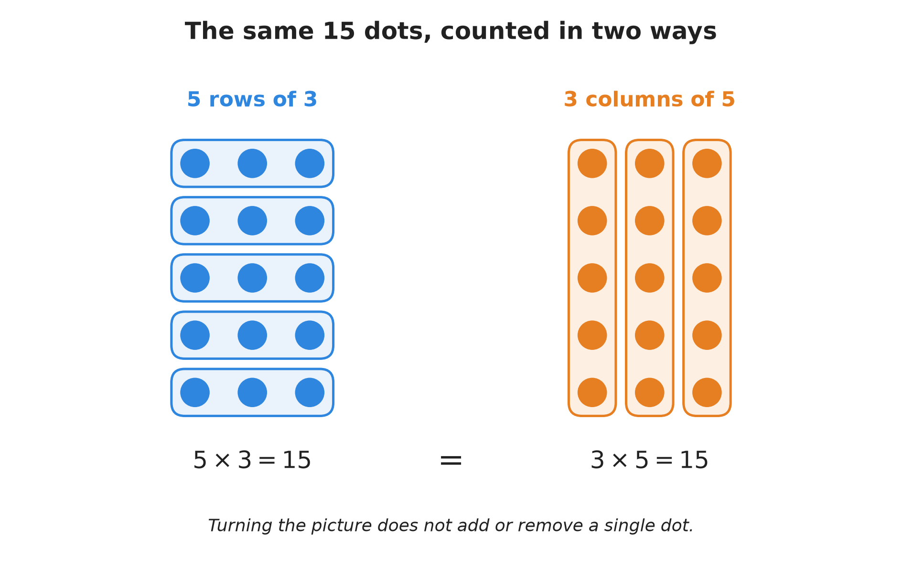
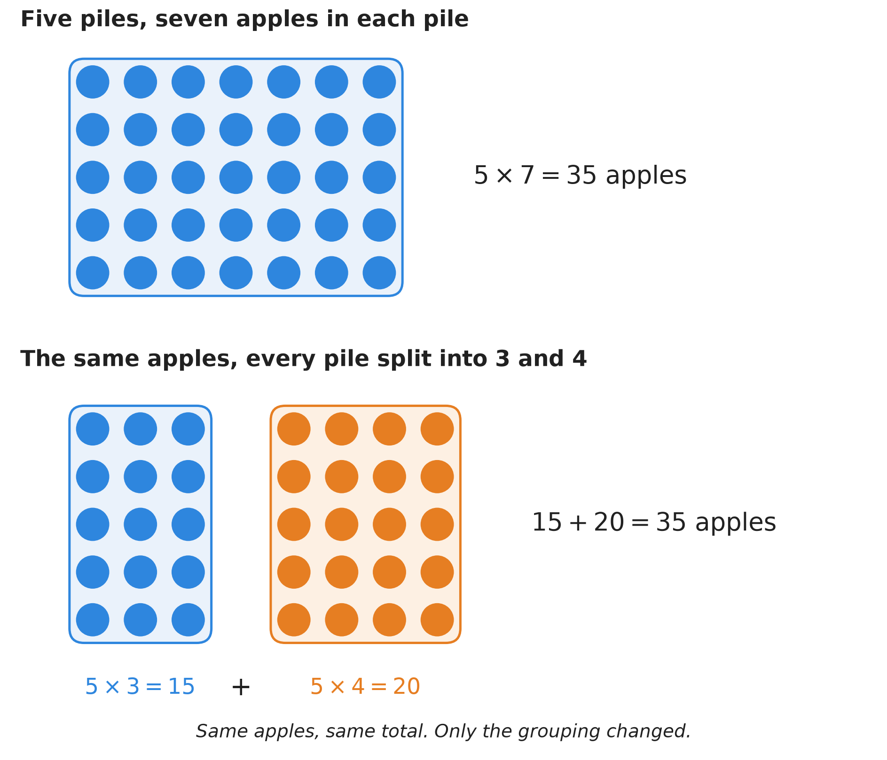
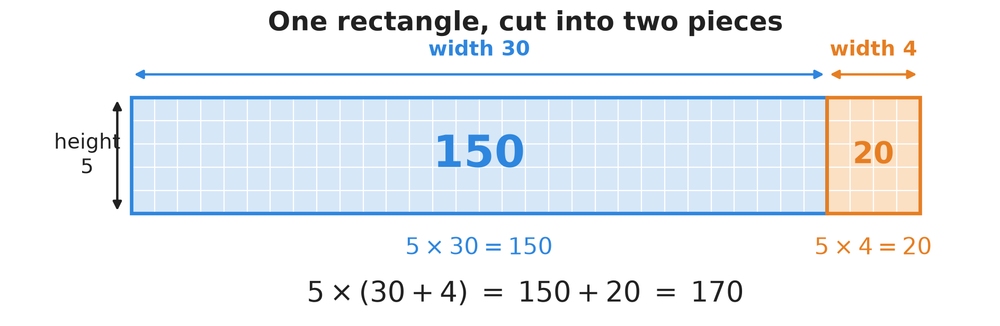
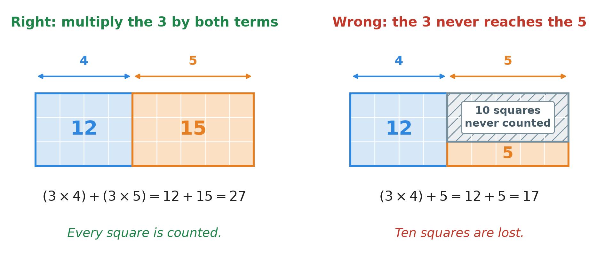
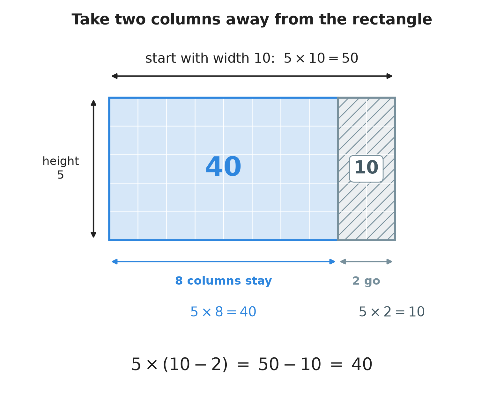
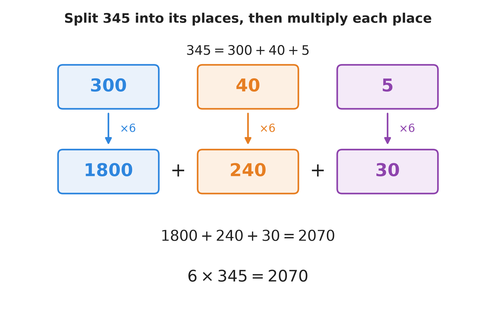

# 6. The distributive property

**What this chapter teaches**
How multiplication and addition work together. You will learn one rule — the distributive
property — that lets you cut a hard multiplication into easy pieces. With it you can multiply
large numbers in your head, without paper and without a calculator.

**Before you start**
Read [Chapter 2, Decimals](./../2_Decimals/2_Decimals.md) for **place value** and the **rule
of ten**, and [Chapter 5, Adding and subtracting large numbers](./../5_Adding_And_Subtracting_Large_Numbers/5_Adding_And_Subtracting_Large_Numbers.md)
for the words *sum* and *difference* and for adding in columns. This chapter brings in no new
tools. It only shows you how two tools you already have fit together.

---

## Table of contents

1. [Multiplication, before we start](#1-multiplication-before-we-start)
2. [The distributive property](#2-the-distributive-property)
3. [Seeing the rule as a rectangle](#3-seeing-the-rule-as-a-rectangle)
4. [The rule in all its forms](#4-the-rule-in-all-its-forms)
5. [Using the rule backwards: multiplying in your head](#5-using-the-rule-backwards-multiplying-in-your-head)
6. [Glossary](#6-glossary)
7. [Check your understanding](#7-check-your-understanding)
8. [Important notes](#8-important-notes)

---

## 1. Multiplication, before we start

This chapter is about one rule that joins multiplication and addition together. Before we can
say what that rule is, we have to be sure about multiplication itself.

So this section writes down the few facts we will lean on later. Some of them will feel
obvious. That is fine. The point is to say them out loud now, so that later we can point back
at them and say *this is why the rule works*.

### 1.1 Multiplication is repeated addition

**Definition.** **Multiplication** is adding the same number again and again. The expression
$5 \times 3$ means "add three, five times".

Write it out:

$$
3 + 3 + 3 + 3 + 3 = 15
$$

Count the threes: there are five of them. So:

$$
5 \times 3 = 15
$$

That is all multiplication is. It is a short way of writing a long addition.

**Definition.** In a multiplication, the numbers you multiply are called the **factors**. The
answer is called the **product**. In $5 \times 7 = 35$, the factors are $5$ and $7$, and the
product is $35$.

**Note.** You have met the word *factor* before, inside the name *greatest common factor*
in [Chapter 3, section 4.2](./../3_Percentages/3_Percentages.md#42-doing-it-in-one-step-the-greatest-common-factor).
It is the same word. We say $20$ is a factor of $80$ because $80 = 20 \times 4$ — you can
build $80$ by multiplying $20$ by something.

**Note.** Different books write multiplication in different ways. $5 \times 7$ and $5 \cdot 7$
mean exactly the same thing: five times seven. This book always uses $\times$, so that the dot
is never confused with the decimal point from
[Chapter 2](./../2_Decimals/2_Decimals.md#23-the-decimal-point-and-the-new-places).

### 1.2 Brackets say "do this part first"

When an expression has round brackets in it, you work out what is inside the brackets before
you do anything else.

$$
5 \times (3 + 4)
$$

First the bracket: $3 + 4 = 7$. Then the multiplication: $5 \times 7 = 35$. So:

$$
5 \times (3 + 4) = 5 \times 7 = 35
$$

You met this idea in one line in
[Chapter 3, section 5.3](./../3_Percentages/3_Percentages.md#53-the-formula), where the
brackets told you to divide before you multiplied by $100$. Here it matters much more, so it
is worth saying clearly: **the brackets are an instruction, and the instruction is "me
first".**

### 1.3 The order of the two factors does not matter

Look at these two:

$$
5 \times 3 = 15 \qquad \text{and} \qquad 3 \times 5 = 15
$$

Same answer. That is not luck. Here is why.

    

**Figure 1 — One grid of dots, counted in two ways. On the left we see five rows with three
dots in each row, which is $5 \times 3$. On the right we look at the very same dots and see
three columns with five dots in each column, which is $3 \times 5$. Nobody added a dot and
nobody took one away, so both counts must give the same number.**

**Definition.** The **commutative property** says that changing the *order* of the numbers
does not change the answer. It is true for addition and for multiplication:

$$
a + b = b + a
\qquad\qquad
a \times b = b \times a
$$

**In words:** it does not matter which number you write first.

The symbols:

* $a$ — any number you like.
* $b$ — any other number you like.

With real numbers: $3 + 4 = 7$ and $4 + 3 = 7$. And $5 \times 3 = 15$ and $3 \times 5 = 15$.

### 1.4 The grouping does not matter either

Now take three numbers: $2$, $3$ and $4$, all multiplied together. There are two ways to start.

Multiply the first pair first:

$$
(2 \times 3) \times 4 = 6 \times 4 = 24
$$

Or multiply the second pair first:

$$
2 \times (3 \times 4) = 2 \times 12 = 24
$$

Same answer again.

**Definition.** The **associative property** says that changing the *grouping* — which pair you
do first — does not change the answer. It is true for addition and for multiplication:

$$
(a + b) + c = a + (b + c)
\qquad\qquad
(a \times b) \times c = a \times (b \times c)
$$

**In words:** with three numbers all added, or all multiplied, you may start with whichever
pair you like.

The symbols:

* $a$, $b$, $c$ — any three numbers.
* The brackets — the pair you choose to do first (section 1.2).

**Note.** These two properties are easy to mix up, because both of them say "it does not
matter". Keep them apart like this: **commutative is about order** (which number comes first),
and **associative is about grouping** (which pair you do first).

### 1.5 Subtraction and division do not follow these two rules

This is where beginners lose marks, so read it slowly.

Addition and multiplication are relaxed. Subtraction and division are not.

**Order.** In [Chapter 5, section 6.1](./../5_Adding_And_Subtracting_Large_Numbers/5_Adding_And_Subtracting_Large_Numbers.md#61-two-more-words-and-one-warning)
you were told that you cannot swap the two numbers in a subtraction. Now you know the name of
the rule that is missing:

$$
7 - 3 = 4 \qquad \text{but} \qquad 3 - 7 \; \text{is not } 4
$$

Division is the same:

$$
10 \div 2 = 5 \qquad \text{but} \qquad 2 \div 10 = 0.2
$$

(That second answer comes from [Chapter 4, section 2](./../4_Converting_Between_Forms/4_Converting_Between_Forms.md#2-from-a-fraction-to-a-decimal).)

**Grouping.** Moving the brackets changes a subtraction too:

$$
(10 - 4) - 3 = 6 - 3 = 3
$$

$$
10 - (4 - 3) = 10 - 1 = 9
$$

And a division:

$$
(12 \div 6) \div 2 = 2 \div 2 = 1
$$

$$
12 \div (6 \div 2) = 12 \div 3 = 4
$$

**Warning.** With subtraction and division, both the order and the brackets are part of the
question. Change either one and you are answering a different question.

### Summary of section 1

* Multiplication is repeated addition: $5 \times 3$ means five threes, which is $15$.
* The numbers you multiply are the **factors**; the answer is the **product**.
* Round brackets mean "do this part first".
* **Commutative**: order does not matter. $a + b = b + a$ and $a \times b = b \times a$.
* **Associative**: grouping does not matter. $(a + b) + c = a + (b + c)$ and
  $(a \times b) \times c = a \times (b \times c)$.
* Subtraction and division obey neither rule.

---

## 2. The distributive property

### 2.1 Two more words: term and distribute

**Definition.** A **term** is one of the parts that are added together or subtracted in an
expression. In $3 + 4$ there are two terms, $3$ and $4$. In $50 + 8 + 3$ there are three
terms. A term can also be a small multiplication, such as the $5 \times 3$ in
$(5 \times 3) + 2$.

Two words you already have will be used a lot here. The **sum** is the answer to an addition
and the **difference** is the answer to a subtraction; both were defined in
[Chapter 5, section 4.1](./../5_Adding_And_Subtracting_Large_Numbers/5_Adding_And_Subtracting_Large_Numbers.md#41-the-two-words-you-need)
and [section 6.1](./../5_Adding_And_Subtracting_Large_Numbers/5_Adding_And_Subtracting_Large_Numbers.md#61-two-more-words-and-one-warning).

**Definition.** To **distribute** something means to hand it out to everybody. If you
distribute sweets to a class, every child gets some — not just the child at the front.

In mathematics the word keeps that meaning. To **distribute** a factor across a bracket means
to multiply it by **every** term inside the bracket. Nobody inside the bracket is left out.

### 2.2 Five piles of apples

Here is the picture the whole chapter rests on.

You have $5$ piles of apples. Each pile has $7$ apples in it. How many apples do you have?

$$
5 \times 7 = 35
$$

Now do something that changes nothing. Walk along the piles and, in each pile, push $3$ apples
to the left and the other $4$ apples to the right. You have not eaten an apple and you have
not bought one. All you did was move them.

    

**Figure 2 — The same apples, twice. At the top they are five piles of seven. At the bottom
every pile has been split into a group of $3$ and a group of $4$, because $3 + 4 = 7$. Now
look down the columns: there are five groups of three (that is $15$ apples) and five groups of
four (that is $20$ apples). And $15 + 20 = 35$, the number we started with.**

So we have counted one heap of apples in two different ways:

1. **Add first, then multiply.** Each pile holds $3 + 4 = 7$ apples, and there are $5$ piles,
   so $5 \times 7 = 35$.
2. **Multiply each part, then add.** There are $5$ groups of three, which is
   $5 \times 3 = 15$. There are $5$ groups of four, which is $5 \times 4 = 20$. Together,
   $15 + 20 = 35$.

Both answers are $35$, and they have to be. It is the same pile of apples on the table.

### 2.3 Two roads to the same answer

Written as maths, the two ways of counting look like this:

$$
5 \times (3 + 4) \;=\; (5 \times 3) + (5 \times 4)
$$

The left-hand side is road one. The right-hand side is road two. Here they are step by step,
side by side:

| | Road 1: bracket first | Road 2: distribute first |
| --- | --- | --- |
| **Start** | $5 \times (3 + 4)$ | $5 \times (3 + 4)$ |
| **Step 1** | add inside: $3 + 4 = 7$ | hand the $5$ to both terms: $(5 \times 3) + (5 \times 4)$ |
| **Step 2** | multiply: $5 \times 7$ | multiply each: $15 + 20$ |
| **Answer** | $35$ | $35$ |

**Explanation.** Why is road two allowed at all? Because of the apples. The $5$ has to reach
**both** groups, since every one of the five piles was split into a group of three *and* a
group of four. If the $5$ only reached the threes, twenty apples would vanish from the table.

### 2.4 The rule in symbols

Now that the numbers make sense, here is the rule in general form.

**Definition.** The **distributive property** says that multiplying a number by a sum gives the
same answer as multiplying that number by each term and then adding the results:

$$
a \times (b + c) \;=\; (a \times b) + (a \times c)
$$

**In words:** to multiply by a bracket, hand the outside number to every number inside the
bracket, multiply each pair, and then add what you get.

The symbols:

* $a$ — the number outside the bracket. It is the one that gets handed out.
* $b$ — the first term inside the bracket.
* $c$ — the second term inside the bracket.
* The brackets on the right — a reminder to do each small multiplication before you add.

**Note.** Many books write the right-hand side as $a \times b + a \times c$, with no brackets,
because there is a separate rule that says multiplication is done before addition. This book
has not taught that rule yet, so it keeps the brackets. They cost nothing and they remove all
doubt.

### 2.5 A worked example, step by step

**Example.** Calculate $4 \times (6 + 2)$ using the distributive property.

**Step 1 — name the parts.** The factor outside is $4$. The terms inside are $6$ and $2$.

**Step 2 — hand the $4$ to both terms.**

$$
4 \times (6 + 2) = (4 \times 6) + (4 \times 2)
$$

**Step 3 — do each small multiplication.**

$$
4 \times 6 = 24
$$

$$
4 \times 2 = 8
$$

**Step 4 — add the two products.**

$$
24 + 8 = 32
$$

**Check.** Do it the other road, the one from section 1.2. Bracket first: $6 + 2 = 8$. Then
$4 \times 8 = 32$. The two roads agree, so the answer is $32$.

### Summary of section 2

* A **term** is one of the parts that are added or subtracted inside an expression.
* To **distribute** means to hand the outside factor to **every** term inside the bracket.
* The apples prove it: splitting each pile does not change how many apples there are.
* The rule: $a \times (b + c) = (a \times b) + (a \times c)$.
* You can always check the answer by doing the bracket first instead.

---

## 3. Seeing the rule as a rectangle

The apples showed that the rule is true. A rectangle shows *why* it must be true, and it keeps
working no matter how big the numbers get.

### 3.1 Area is just counting squares

**Definition.** The **area** of a flat shape is how much flat space it covers. We measure it by
counting equal squares.

Take a rectangle that is $5$ squares tall and $3$ squares wide. Each row holds $3$ squares.
There are $5$ rows. So the number of squares is

$$
3 + 3 + 3 + 3 + 3 = 15
$$

which, by section 1.1, is $5 \times 3 = 15$.

That is the whole idea:

$$
\text{area of a rectangle} = \text{height} \times \text{width}
$$

Multiplication and rectangles are the same thing seen from two sides.

### 3.2 One rectangle, cut in two

Now take a rectangle that is $5$ tall and $34$ wide. Its area is $5 \times 34$.

Cut it once with a vertical line, $30$ squares from the left. You now have two rectangles: one
$5$ by $30$, and one $5$ by $4$.

    

**Figure 3 — The cut does not destroy any squares. The blue piece is $5$ rows of $30$, which
is $5 \times 30 = 150$ squares. The orange piece is $5$ rows of $4$, which is
$5 \times 4 = 20$ squares. Put them back together and you have $150 + 20 = 170$ squares —
exactly the area of the rectangle you started with.**

Written as maths, the picture says:

$$
5 \times (30 + 4) \;=\; (5 \times 30) + (5 \times 4) \;=\; 150 + 20 \;=\; 170
$$

And if you go the other road, $30 + 4 = 34$ and $5 \times 34 = 170$. The same $170$.

### 3.3 Why the picture is a proof

**Explanation.** A proof is an argument that leaves no room for doubt. The rectangle gives one.

Drawing a line across a rectangle is only drawing. It does not remove squares and it does not
create them. So the number of squares on the left of the line, plus the number on the right,
must equal the number in the whole rectangle. That sentence is the distributive property.

And it does not depend on the numbers $5$, $30$ and $4$. Make the rectangle $a$ tall. Cut its
width into a piece $b$ and a piece $c$. The whole rectangle holds $a \times (b + c)$ squares,
the left piece holds $a \times b$ and the right piece holds $a \times c$. Since no square is
lost:

$$
a \times (b + c) = (a \times b) + (a \times c)
$$

This is why the rule is not a trick to memorise. It is just what cutting a rectangle does.

### 3.4 What the picture says about the commonest mistake

There is one mistake almost everybody makes at least once: handing the outside number to the
first term only, and then adding the second term as it is.

$$
3 \times (4 + 5) \quad\longrightarrow\quad (3 \times 4) + 5 = 12 + 5 = 17 \quad \text{— wrong}
$$

On paper it is hard to see what is wrong with that. On the rectangle it is obvious.

    

**Figure 4 — Both rectangles are $3$ tall and $4 + 5 = 9$ wide, so both hold $27$ squares. On
the left the $3$ reaches both terms and every square is counted. On the right the $3$ reaches
only the $4$, and then a bare $5$ is added. That counts just five of the fifteen squares in
the orange part, and the ten grey squares are never counted at all. The gap is exactly
$27 - 17 = 10$.**

**Warning.** The outside factor must touch **every** term inside the bracket. If one term is
left out, a whole block of the rectangle is left out with it.

### Summary of section 3

* The **area** of a shape is the number of equal squares it covers.
* A rectangle's area is height $\times$ width, because each row holds the same number of
  squares.
* Cutting a rectangle with one line changes nothing, so the two pieces must add up to the
  whole. That is the distributive property.
* The proof works for any numbers, not just the ones in the picture.
* If the outside factor misses a term, the answer misses a whole block of squares.

---

## 4. The rule in all its forms

So far the bracket has held exactly two terms, joined by a plus sign, and the multiplier has
stood on the left. None of that is required. This section shows the other three shapes the
rule comes in.

### 4.1 A subtraction inside the bracket

**Example.** Calculate $5 \times (10 - 2)$.

Road one, bracket first:

$$
10 - 2 = 8
$$

$$
5 \times 8 = 40
$$

Road two, distribute. Hand the $5$ to both numbers, and **keep the minus sign between them**:

$$
5 \times (10 - 2) = (5 \times 10) - (5 \times 2)
$$

$$
= 50 - 10
$$

$$
= 40
$$

Both roads give $40$.

**Explanation.** Why does the minus sign survive? Go back to the rectangle. Start with a
rectangle $5$ tall and $10$ wide, and then make it two columns narrower.

    

**Figure 5 — The whole rectangle is $5 \times 10 = 50$ squares. The grey strip that leaves is
$2$ columns wide, and it is $5$ squares tall, so it takes $5 \times 2 = 10$ squares with it.
What stays is $50 - 10 = 40$.**

Look closely at the grey strip. It is not $2$ squares. It is $2$ squares in *every one of the
five rows*, so it is $5 \times 2 = 10$ squares. That is why the amount taken away is
$5 \times 2$ and not $2$. The subtraction is multiplied just like the addition was.

**The rule.** For any three numbers:

$$
a \times (b - c) \;=\; (a \times b) - (a \times c)
$$

**In words:** multiply the outside number by both numbers inside, then subtract the second
product from the first.

### 4.2 More than two terms inside the bracket

Nothing stops a bracket from holding three terms, or four. The rule does not change: hand the
outside factor to **every** term.

**Example.** Calculate $2 \times (4 + 3 + 1)$.

Distribute the $2$ to all three terms:

$$
2 \times (4 + 3 + 1) = (2 \times 4) + (2 \times 3) + (2 \times 1)
$$

$$
= 8 + 6 + 2
$$

Add them one step at a time:

$$
8 + 6 = 14
$$

$$
14 + 2 = 16
$$

**Check.** Bracket first: $4 + 3 = 7$, then $7 + 1 = 8$, then $2 \times 8 = 16$. Correct.

**The rule.** With three terms inside:

$$
a \times (b + c + d) \;=\; (a \times b) + (a \times c) + (a \times d)
$$

And with four terms you would write four products, and so on. On the rectangle this is simply
cutting the width into three pieces instead of two.

### 4.3 The multiplier can stand on the right

Everything so far had the outside factor on the left of the bracket. It works just as well on
the right.

**Example.** Calculate $(6 + 2) \times 4$.

$$
(6 + 2) \times 4 = (6 \times 4) + (2 \times 4)
$$

$$
= 24 + 8 = 32
$$

**Explanation.** Why is this allowed? Because of the commutative property in section 1.3.
$(6 + 2) \times 4$ and $4 \times (6 + 2)$ are the same product with its two factors swapped,
and swapping factors never changes a product. So the right-hand case is not a new rule at all.
It is the old rule plus a swap.

**The rule.**

$$
(b + c) \times a \;=\; (b \times a) + (c \times a)
$$

### 4.4 The four forms in one table

| Form | Rule | A small example |
| --- | --- | --- |
| Over addition | $a \times (b + c) = (a \times b) + (a \times c)$ | $4 \times (6 + 2) = 24 + 8 = 32$ |
| Over subtraction | $a \times (b - c) = (a \times b) - (a \times c)$ | $5 \times (10 - 2) = 50 - 10 = 40$ |
| Multiplier on the right | $(b + c) \times a = (b \times a) + (c \times a)$ | $(6 + 2) \times 4 = 24 + 8 = 32$ |
| More than two terms | $a \times (b + c + d) = (a \times b) + (a \times c) + (a \times d)$ | $2 \times (4 + 3 + 1) = 8 + 6 + 2 = 16$ |

**Note.** These are four ways of writing one rule, not four rules. In every line the outside
factor reaches every term, and the plus or minus signs between the terms stay exactly where
they were.

### Summary of section 4

* The rule works with a minus sign inside the bracket. Keep the minus between the two products.
* The strip taken away is a whole strip, so it is $a \times c$ squares, not $c$ squares.
* The rule works with any number of terms inside the bracket.
* The rule works with the multiplier on the right, because swapping factors changes nothing.
* One rule, four shapes.

---

## 5. Using the rule backwards: multiplying in your head

### 5.1 You are allowed to choose the split

Until now the bracket was given to you and you took it apart. Read the rule from right to left
and it becomes far more useful:

$$
(a \times b) + (a \times c) \;=\; a \times (b + c)
$$

Nobody has to hand you a bracket. If a multiplication looks hard, you can **make** a bracket
yourself: take the awkward number, split it into pieces that are easy to multiply, and then
put the pieces back together at the end.

This is the whole method:

1. Take the hard number apart into two or three easy numbers.
2. Multiply each easy number separately.
3. Add or subtract the answers.

The split is your choice. Any split works, as long as the pieces really do add back up to the
original number.

### 5.2 Splitting upwards: $5 \times 17$

**Example.** What is $5 \times 17$?

Seventeen is awkward. But $17$ can be built from friendly numbers:

$$
17 = 10 + 5 + 2
$$

So:

$$
5 \times 17 = 5 \times (10 + 5 + 2)
$$

Hand the $5$ to each term:

$$
= (5 \times 10) + (5 \times 5) + (5 \times 2)
$$

$$
= 50 + 25 + 10
$$

Add them one step at a time, because in your head that is easier than all at once:

$$
50 + 25 = 75
$$

$$
75 + 10 = 85
$$

So $5 \times 17 = 85$.

**Note.** That was not the only possible split. $17 = 10 + 7$ works too:
$(5 \times 10) + (5 \times 7) = 50 + 35 = 85$. Same answer, as it must be. Choose whichever
pieces you find easiest to multiply.

### 5.3 Splitting by place value: $6 \times 345$

For a big number, there is a split that is always available and always sensible: the one the
number already has. In
[Chapter 5, section 2.3](./../5_Adding_And_Subtracting_Large_Numbers/5_Adding_And_Subtracting_Large_Numbers.md#23-what-a-number-is-made-of)
you saw that every number is written as a sum of its places. So:

$$
345 = 300 + 40 + 5
$$

**Example.** What is $6 \times 345$?

    

**Figure 6 — The number $345$ is broken into the three places it is already made of. Each
place is multiplied by $6$ on its own, which is easy, and the three answers are added at the
end. Only the last step needs any adding.**

Step by step:

$$
6 \times 345 = 6 \times (300 + 40 + 5)
$$

$$
= (6 \times 300) + (6 \times 40) + (6 \times 5)
$$

Each of those is a small multiplication with zeros stuck on the end:

$$
6 \times 300 = 1800
$$

$$
6 \times 40 = 240
$$

$$
6 \times 5 = 30
$$

Now add, one step at a time:

$$
1800 + 240 = 2040
$$

$$
2040 + 30 = 2070
$$

So $6 \times 345 = 2070$.

**Note.** Notice how little you actually had to know: $6 \times 3$, $6 \times 4$ and
$6 \times 5$. The zeros came from the places. This is the same trick as the column method in
[Chapter 5, section 4](./../5_Adding_And_Subtracting_Large_Numbers/5_Adding_And_Subtracting_Large_Numbers.md#4-adding-large-numbers):
one hard question becomes several easy ones.

### 5.4 Splitting downwards: $7 \times 98$

Some numbers sit just below a round number. For those, subtraction is the fast road.

**Example.** What is $7 \times 98$?

Splitting $98$ into $90 + 8$ would work, but there is something better. $98$ is only $2$ away
from $100$:

$$
98 = 100 - 2
$$

So:

$$
7 \times 98 = 7 \times (100 - 2)
$$

Distribute, keeping the minus sign:

$$
= (7 \times 100) - (7 \times 2)
$$

$$
7 \times 100 = 700
$$

$$
7 \times 2 = 14
$$

$$
700 - 14 = 686
$$

So $7 \times 98 = 686$.

Multiplying by $100$ is the easiest multiplication there is, and taking away $14$ is easy too.
The hard-looking $98$ never had to be multiplied at all.

### 5.5 How to choose a split

There is no single right answer, but these three questions will pick a good one almost every
time.

* **Is the number close to a round number?** If it is just below $10$, $100$ or $1000$, split
  downwards with a minus sign: $98 = 100 - 2$, $49 = 50 - 1$, $198 = 200 - 2$.
* **Is it just above a round number?** Split upwards: $21 = 20 + 1$, $102 = 100 + 2$.
* **Neither?** Fall back on place value: $345 = 300 + 40 + 5$. This one always works.

**Note.** Whichever split you pick, check it before you multiply. The pieces must add back up
to the number you started with. If you split $98$ as $100 - 3$ by mistake, every step after
that is wasted.

### Summary of section 5

* Read the rule backwards and you may invent the bracket yourself.
* Split the awkward number into easy pieces, multiply each piece, then put them together.
* Just below a round number, split downwards and subtract: $98 = 100 - 2$.
* Just above, split upwards and add: $21 = 20 + 1$.
* Otherwise use place value: $345 = 300 + 40 + 5$.
* Always check that the pieces add back up to the original number.

---

## 6. Glossary

Only the words that appear for the first time in this chapter are listed here. For *sum*,
*difference*, *digit* and *place value*, see the glossaries of
[Chapter 2](./../2_Decimals/2_Decimals.md#8-glossary) and
[Chapter 5](./../5_Adding_And_Subtracting_Large_Numbers/5_Adding_And_Subtracting_Large_Numbers.md#8-glossary).

* **Multiplication** — adding the same number again and again. $5 \times 3$ means five threes.
* **Factor** — a number that is being multiplied. In $5 \times 7$, both $5$ and $7$ are
  factors.
* **Product** — the answer to a multiplication. The product of $5$ and $7$ is $35$.
* **Brackets** — the round marks around a part of an expression, as in $5 \times (3 + 4)$.
  They mean "work out this part first".
* **Commutative property** — changing the *order* of two numbers does not change the answer.
  True for addition and multiplication only.
* **Associative property** — changing the *grouping* of three numbers does not change the
  answer. True for addition and multiplication only.
* **Term** — one of the parts that are added or subtracted in an expression. In $50 + 8 + 3$
  there are three terms.
* **Distribute** — to hand the outside factor to every term inside the bracket.
* **Distributive property** — the rule that
  $a \times (b + c) = (a \times b) + (a \times c)$, and the same with a minus sign.
* **Area** — how much flat space a shape covers, measured by counting equal squares. For a
  rectangle it is height $\times$ width.

---

## 7. Check your understanding

Try each question on paper before you open the answer.

**Question 1.** Work out $5 \times (6 + 3)$ using the distributive property.

Answer

Hand the $5$ to both terms:

$$
5 \times (6 + 3) = (5 \times 6) + (5 \times 3)
$$

$$
= 30 + 15
$$

$$
= 45
$$

Check with the bracket first: $6 + 3 = 9$, and $5 \times 9 = 45$. Correct.

**Question 2.** Work out $6 \times (10 - 4)$ using the distributive property.

Answer

Hand the $6$ to both numbers and keep the minus sign:

$$
6 \times (10 - 4) = (6 \times 10) - (6 \times 4)
$$

$$
= 60 - 24
$$

$$
= 36
$$

Check with the bracket first: $10 - 4 = 6$, and $6 \times 6 = 36$. Correct.

**Question 3.** Use the distributive property to work out $8 \times 21$ in your head.

Answer

$21$ is just above a round number, so split upwards: $21 = 20 + 1$.

$$
8 \times 21 = 8 \times (20 + 1)
$$

$$
= (8 \times 20) + (8 \times 1)
$$

$$
= 160 + 8
$$

$$
= 168
$$

**Question 4.** Use the distributive property and a subtraction to work out $9 \times 49$.

Answer

$49$ is just below a round number, so split downwards: $49 = 50 - 1$.

$$
9 \times 49 = 9 \times (50 - 1)
$$

$$
= (9 \times 50) - (9 \times 1)
$$

$$
= 450 - 9
$$

$$
= 441
$$

**Question 5.** Work out $4 \times (50 + 8 + 3)$.

Answer

Three terms inside, so three products:

$$
4 \times (50 + 8 + 3) = (4 \times 50) + (4 \times 8) + (4 \times 3)
$$

$$
= 200 + 32 + 12
$$

Add one step at a time:

$$
200 + 32 = 232
$$

$$
232 + 12 = 244
$$

Check with the bracket first: $50 + 8 = 58$, then $58 + 3 = 61$, and $4 \times 61 = 244$.
Correct.

**Question 6.** Work out $7 \times 198$.

Answer

$198$ is $2$ below $200$, so split downwards: $198 = 200 - 2$.

$$
7 \times 198 = 7 \times (200 - 2)
$$

$$
= (7 \times 200) - (7 \times 2)
$$

$$
= 1400 - 14
$$

$$
= 1386
$$

**Question 7.** A student writes $3 \times (4 + 5) = 12 + 5 = 17$. The right answer is $27$.
Using the rectangle in Figure 4, say in your own words where the missing $10$ went.

Answer

The rectangle is $3$ tall and $9$ wide, so it holds $27$ squares.

The student did multiply the $3$ by the $4$, which counts the $12$ blue squares correctly. But
then the $5$ was added as if it were five single squares. It is not. The second piece of the
rectangle is $3$ rows of $5$, which is $15$ squares.

So the student counted $5$ squares where there were $15$. The $10$ squares that were never
counted are the grey ones in Figure 4, and $27 - 17 = 10$.

The lesson: a term inside the bracket is a *width*, not an area. It has to be multiplied by
the height before it can be added.

**Question 8.** Is $2 + (3 \times 4)$ equal to $(2 + 3) \times (2 + 4)$? Work out both, and
say what went wrong.

Answer

They are not equal.

The left side, bracket first:

$$
3 \times 4 = 12
$$

$$
2 + 12 = 14
$$

The right side:

$$
2 + 3 = 5
$$

$$
2 + 4 = 6
$$

$$
5 \times 6 = 30
$$

$14$ and $30$ are not the same number.

What went wrong is that the distributive property was used where it does not apply. The rule
is about a **multiplication** spread across a sum or a difference. Here the operation outside
the bracket is an addition, so there is nothing to hand out. Just follow the brackets:
$2 + (3 \times 4) = 14$.

**Question 9.** You want $6 \times 99$ in your head. Which split would you choose, and why?
Then finish the calculation.

Answer

$99$ is only $1$ below $100$, so split downwards. Splitting by place value into $90 + 9$ also
works, but it leaves you with two harder multiplications instead of one very easy one.

$$
6 \times 99 = 6 \times (100 - 1)
$$

$$
= (6 \times 100) - (6 \times 1)
$$

$$
= 600 - 6
$$

$$
= 594
$$

---

## 8. Important notes

**The three mistakes people actually make.**

* **Handing the factor to the first term only.** This is the big one:
  $3 \times (4 + 5)$ written as $(3 \times 4) + 5$. The answer comes out far too small,
  because a whole block of the rectangle is never counted (Figure 4). Before you add up, count
  your products: two terms inside the bracket means **two** products, three terms means
  **three**.
* **Losing the minus sign.** $4 \times (10 - 3)$ written as $(4 \times 10) + (4 \times 3)$
  gives $52$ instead of $28$. The sign between the terms is part of the question. Distributing
  moves the numbers around; it never turns a minus into a plus.
* **Using the rule where there is no multiplication.** In $2 + (3 \times 4)$ the operation
  outside the bracket is an addition, so there is nothing to hand out. Writing
  $(2 + 3) \times (2 + 4)$ turns $14$ into $30$. The distributive property joins
  *multiplication* to addition or subtraction. If there is no multiplication outside the
  bracket, just do the bracket.

**The three ideas to keep.**

* **The rule is a picture, not a trick.** Cutting a rectangle into two pieces cannot create or
  destroy squares, so the pieces must add back up to the whole. If you ever forget the rule,
  draw the rectangle and read it off.
* **You are allowed to invent the bracket.** The hardest-looking multiplication becomes easy
  the moment you choose a friendly split. $98$ is horrible; $100 - 2$ is not.
* **Every answer can be checked, free of charge.** The two roads must agree. Do the bracket
  first, then distribute, and compare the two answers. If they differ, one of them is wrong,
  and you know it before anyone marks it.

**How this chapter connects to the rest of the book.**
Chapter 5 took one hard addition and turned it into several easy single-digit additions by
using columns. This chapter does the same thing for multiplication, and by the same means:
splitting a number into its places. That is why $6 \times 345$ became three tiny
multiplications. The place value you learned in Chapter 2 is doing the work in both chapters.

Two things here also point forwards. First, the rule was written with letters —
$a \times (b + c) = (a \times b) + (a \times c)$ — and those letters stand for *any* numbers.
That is what algebra is: a rule written once, for every number at the same time. Second, the
commutative and associative properties named in section 1 are the reason so many everyday
short cuts are safe. You now know which operations they apply to, and, just as importantly,
which ones they do not.

---

- [Back to the book](./../README.md)
- Previous: [5 Adding and subtracting large numbers](./../5_Adding_And_Subtracting_Large_Numbers/5_Adding_And_Subtracting_Large_Numbers.md)
- Next: [7 Multiplying large numbers](./../7_Multiplying_Large_Numbers/7_Multiplying_Large_Numbers.md)
