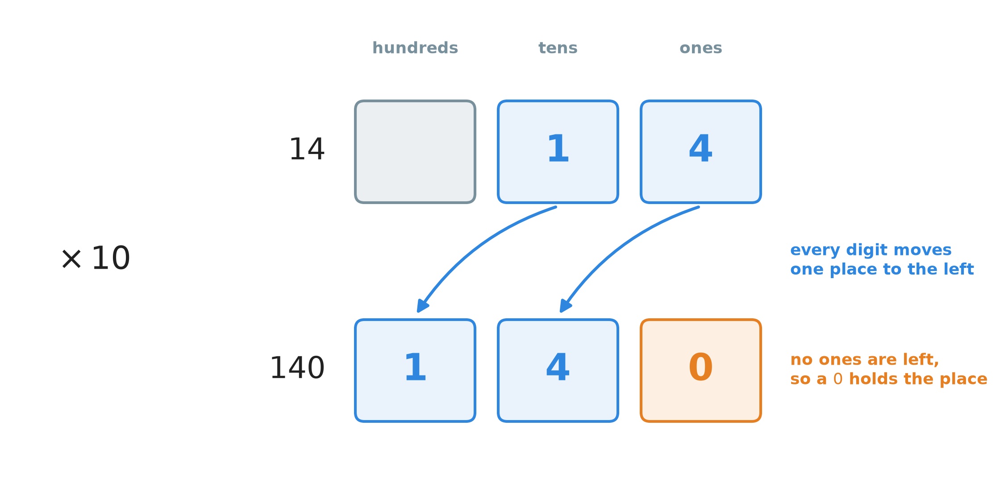
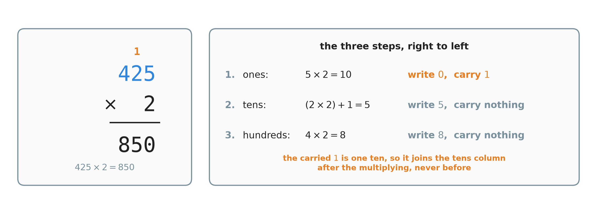
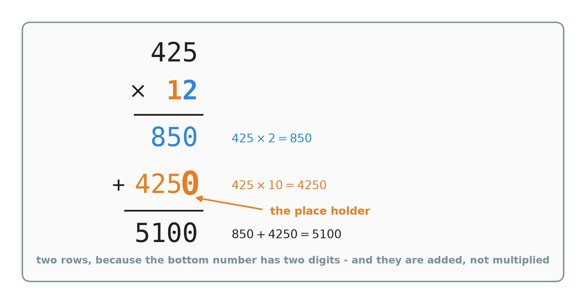
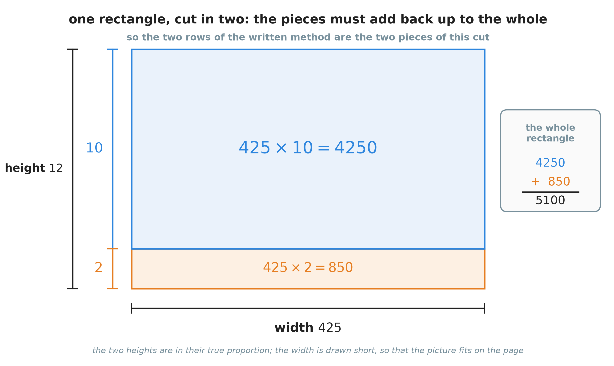
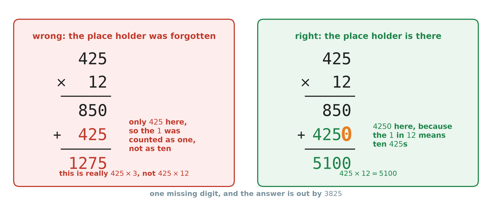
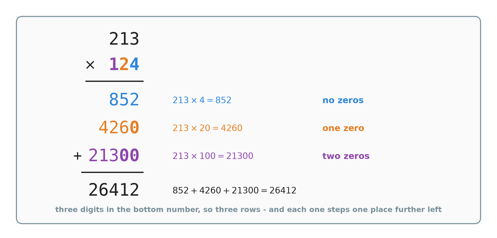

# 7. Multiplying large numbers

**What this chapter teaches**
How to multiply two large numbers — on paper, and in your head. You will learn the column
method that always works, and you will see that it is not a new rule at all. It is the rule
from Chapter 6, written in a shorter way.

**Before you start**
Read [Chapter 5, Adding and subtracting large numbers](./../5_Adding_And_Subtracting_Large_Numbers/5_Adding_And_Subtracting_Large_Numbers.md)
for columns, carrying and the word *algorithm*, and
[Chapter 6, The distributive property](./../6_The_Distributive_Property/6_The_Distributive_Property.md)
for multiplication, factors, products and the rule that splits a multiplication into pieces.
This chapter uses both of them on every page.

---

## Table of contents

1. [Two large numbers at once](#1-two-large-numbers-at-once)
2. [Multiplying by 10, by 100 and by 1000](#2-multiplying-by-10-by-100-and-by-1000)
3. [Multiplying by one digit, in columns](#3-multiplying-by-one-digit-in-columns)
4. [The standard method: a two-digit multiplier](#4-the-standard-method-a-two-digit-multiplier)
5. [Why the method works, and why the zero is there](#5-why-the-method-works-and-why-the-zero-is-there)
6. [The same multiplication in your head](#6-the-same-multiplication-in-your-head)
7. [Choosing a method, and checking the answer](#7-choosing-a-method-and-checking-the-answer)
8. [Glossary](#8-glossary)
9. [Check your understanding](#9-check-your-understanding)
10. [Important notes](#10-important-notes)

---

## 1. Two large numbers at once

### 1.1 What you can already do

By the end of Chapter 6 you could multiply a large number by a small one without a
calculator. You took the large number apart and multiplied the pieces:

$$
6 \times 345 = (6 \times 300) + (6 \times 40) + (6 \times 5) = 1800 + 240 + 30 = 2070
$$

That method is in
[Chapter 6, section 5](./../6_The_Distributive_Property/6_The_Distributive_Property.md#5-using-the-rule-backwards-multiplying-in-your-head).
In every example there, one of the two factors was a single digit.

### 1.2 Where that stops being comfortable

Now look at this one:

$$
425 \times 12
$$

Both numbers are large. Nobody knows this answer by heart. There is no line in the times
tables that says $425 \times 12$.

You could still split it. Splitting is not wrong here, and section 6 will do exactly that.
But notice what splitting asks of you: **you** have to choose how to cut the number, every
single time. For $425 \times 12$ the choice is easy. For $789 \times 47$ it is not.

### 1.3 What a fixed recipe gives you

In [Chapter 5, section 1.3](./../5_Adding_And_Subtracting_Large_Numbers/5_Adding_And_Subtracting_Large_Numbers.md#13-so-we-use-an-algorithm-instead)
you met the word **algorithm**: a fixed list of steps that you follow without thinking, and
that works every time. Column addition was one. This chapter gives you the same thing for
multiplication.

So you will end this chapter with two tools:

* a **written method** in columns, which never asks you to be clever, and
* a **head method**, which is faster when one of the numbers is friendly.

They are not rivals. They do the same arithmetic in the same order. Section 5 shows that they
are the same thing, and section 7 shows how to use one to check the other.

### Summary of section 1

* Chapter 6 multiplied a large number by a **single digit**.
* Now both numbers are large, and nothing in the times tables helps.
* An **algorithm** is a fixed list of steps that works every time, so you do not have to
  invent a method for each new question.
* This chapter teaches a written method and a head method. They always agree.

---

## 2. Multiplying by 10, by 100 and by 1000

Everything in this chapter stands on one small fact. We deal with it first, on its own, so
that later it never gets in the way.

### 2.1 What multiplying by ten really does

In [Chapter 2, section 2.2](./../2_Decimals/2_Decimals.md#22-the-rule-of-ten) you learned the
rule of ten: **each place is worth ten times the place on its right**. A hundred is ten tens.
A ten is ten ones.

Now think about what "ten times bigger" means for a digit. A digit that stood in the ones
place is now worth ten times more — so it belongs in the tens place. A digit that stood in
the tens place is now worth ten times more — so it belongs in the hundreds place.

**Explanation.** Multiplying by $10$ moves **every digit one place to the left**.

Take $14$. Split it by place value, then multiply each piece, exactly as in Chapter 6:

$$
14 = 10 + 4
$$

$$
14 \times 10 = (10 \times 10) + (4 \times 10)
$$

$$
10 \times 10 = 100
$$

$$
4 \times 10 = 40
$$

$$
100 + 40 = 140
$$

So $14 \times 10 = 140$. Look at what happened to each digit. The $1$ was one ten; it is now
one hundred. The $4$ was four ones; it is now four tens.

    

**Figure 1 — Multiplying by ten does not change the digits. It moves them. The $1$ and the
$4$ are the same two digits in both rows; each one has stepped one place to the left. The
orange $0$ is there because nothing is left in the ones place.**

That orange zero is not a new number stuck on the end. It is the **place holder** you met in
[Chapter 2, section 3.3](./../2_Decimals/2_Decimals.md#33-zero-holds-an-empty-place): a digit
whose whole job is to keep a place open, so the digits beside it cannot slide back.

**Note.** This gives the short cut everyone uses: to multiply a whole number by $10$, write a
$0$ at its right-hand end. It is quick, and now you know it is not magic — it is the digits
moving one place left.

### 2.2 By one hundred, and by one thousand

One hundred is ten tens, so multiplying by $100$ is multiplying by ten twice. Every digit
moves **two** places to the left, and two places open up at the right-hand end:

$$
23 \times 10 = 230
$$

$$
23 \times 100 = 2300
$$

$$
23 \times 1000 = 23000
$$

**The rule in words:** count the zeros in the number you are multiplying by, and write that
many zeros on the end.

| Multiply by | Zeros to write | Example |
| --- | --- | --- |
| $10$ | one | $23 \times 10 = 230$ |
| $100$ | two | $23 \times 100 = 2300$ |
| $1000$ | three | $23 \times 1000 = 23000$ |

**Note.** Some books call $10$, $100$ and $1000$ the **powers of ten**. That name just means
the numbers you build by multiplying tens together: $10$, then $10 \times 10$, then
$10 \times 10 \times 10$, and so on.

**Warning.** "Write a zero on the end" is a short cut for **whole numbers only**. It does not
work for a decimal. $2.5 \times 10$ is $25$, not $2.50$ — and you already know from
[Chapter 2, section 3.4](./../2_Decimals/2_Decimals.md#34-zeros-at-the-end-change-nothing) that $2.50$ is just
$2.5$ again. The rule that is always true is the one in Figure 1: the digits move one place to
the left. Every number in this chapter is a whole number, so the short cut is safe here.

### 2.3 Multiplying by 20, and by other round numbers

The same idea covers any round number, not only $10$ and $100$. Twenty is two tens:

$$
20 = 2 \times 10
$$

So multiplying by $20$ is multiplying by $2$ and then by $10$. We are allowed to regroup a
chain of multiplications like this — that is the **associative property** from
[Chapter 6, section 1.4](./../6_The_Distributive_Property/6_The_Distributive_Property.md#14-the-grouping-does-not-matter-either):

$$
425 \times 20 = 425 \times (2 \times 10)
$$

$$
= (425 \times 2) \times 10
$$

$$
= 850 \times 10
$$

$$
= 8500
$$

**The rule in words:** multiply by the single digit first, then move the answer one place to
the left.

Another one, which we will need later:

$$
316 \times 20 = (316 \times 2) \times 10 = 632 \times 10 = 6320
$$

### Summary of section 2

* Multiplying by $10$ moves every digit **one place to the left**.
* The zero that appears at the end is a **place holder**. It keeps the ones place open.
* Multiplying by $100$ moves every digit two places; by $1000$, three places. Count the zeros.
* For a round number such as $20$, multiply by the digit first, then move one place left.
* The "write a zero" short cut is for whole numbers. For decimals, only the shift is true.

---

## 3. Multiplying by one digit, in columns

Before we multiply by a two-digit number, we need to do it neatly with one digit.

### 3.1 Setting the work out

The set-up is the one from
[Chapter 5, section 3](./../5_Adding_And_Subtracting_Large_Numbers/5_Adding_And_Subtracting_Large_Numbers.md#3-setting-the-numbers-out-in-columns):

* Write the long number on top and the single digit under it.
* Line the numbers up **on the right**, so the ones sit under the ones.
* Draw a line underneath.
* Work from the **right to the left**, one column at a time.

You work right to left for the same reason as in addition: a column can overflow, and what
overflows always travels to the **left**. If you started on the left, you would have to go
back and change digits you had already written.

### 3.2 When nothing overflows: $321 \times 3$

Multiply the top number by $3$, one column at a time, starting at the ones.

* ones: $1 \times 3 = 3$. Write $3$.
* tens: $2 \times 3 = 6$. Write $6$.
* hundreds: $3 \times 3 = 9$. Write $9$.

$$
321 \times 3 = 963
$$

Every step was a single-digit multiplication. That is the whole point of columns: one hard
question became three easy ones.

**Note.** Check it with the Chapter 6 method, which cuts $321$ into its places:
$(3 \times 300) + (3 \times 20) + (3 \times 1) = 900 + 60 + 3 = 963$. The same answer, because
it is the same arithmetic.

### 3.3 When a column overflows: $425 \times 2$

This time a column will not fit in one digit.

    

**Figure 2 — Each line on the right made one digit on the left. Read them from the top: the
ones column produced the $0$ and the little orange $1$; the tens column produced the $5$; the
hundreds column produced the $8$.**

Step by step:

**Ones.** $5 \times 2 = 10$. Ten will not fit in a column that holds one digit. Ten ones are
one ten, so we trade — exactly the trade from
[Chapter 5, section 2.4](./../5_Adding_And_Subtracting_Large_Numbers/5_Adding_And_Subtracting_Large_Numbers.md#24-ten-of-one-size-make-one-of-the-next-size).
Write the $0$ in the ones column and carry the $1$ over to the tens column.

**Tens.** $2 \times 2 = 4$. Now add the carried ten: $4 + 1 = 5$. Write $5$.

$$
(2 \times 2) + 1 = 4 + 1 = 5
$$

**Hundreds.** $4 \times 2 = 8$. Nothing was carried into this column. Write $8$.

$$
425 \times 2 = 850
$$

### 3.4 Multiply first, then add the carry

**Warning.** This is the mistake people make most often in this section. When a column has a
carried digit waiting in it, **multiply first, and add the carried digit to the answer**. Do
not add it to the digit before you multiply.

Here is the wrong version of the tens column above. The student adds the carried $1$ to the
$2$, and then multiplies:

$$
(2 + 1) \times 2 = 3 \times 2 = 6
$$

That would give $860$ instead of $850$ — ten too many.

Why is it wrong? Because the carried $1$ is **not part of the number $425$**. The number has
exactly two tens. The carried $1$ came out of the ones column: it is one extra ten in the
**answer**. So it is added to the answer for that column, after the multiplying is done.
Multiplying it by $2$ as well would count it twice.

Brackets say which part comes first, as in
[Chapter 6, section 1.2](./../6_The_Distributive_Property/6_The_Distributive_Property.md#12-brackets-say-do-this-part-first).
Write the column as $(2 \times 2) + 1$ and there is nothing left to get wrong.

### 3.5 One more: $316 \times 5$

* **Ones.** $6 \times 5 = 30$. Write $0$, carry $3$.
* **Tens.** $1 \times 5 = 5$. Add the carried $3$: $(1 \times 5) + 3 = 5 + 3 = 8$. Write $8$.
* **Hundreds.** $3 \times 5 = 15$. Nothing was carried in. This is the last column, so the
  whole $15$ is written down.

$$
316 \times 5 = 1580
$$

**Note.** Writing $15$ in the leftmost column is allowed, and it is the same permission you
had in
[Chapter 5, section 5](./../5_Adding_And_Subtracting_Large_Numbers/5_Adding_And_Subtracting_Large_Numbers.md#5-adding-a-long-list-of-numbers-at-once):
there is no column further left waiting for a carry, so nothing has to be traded. The $15$ is
fifteen **hundreds**, which is $1500$, and that is exactly the $1500$ inside $1580$.

### Summary of section 3

* Line up on the right, then multiply the top number column by column, right to left.
* If a column gives $10$ or more, write its right-hand digit and carry the rest left.
* In a column with a carry: **multiply first, then add the carry**.
* The carried digit belongs to the answer, not to the number you are multiplying.
* In the leftmost column you may write a two-digit result, because nothing is waiting to its
  left.

---

## 4. The standard method: a two-digit multiplier

### 4.1 One multiplication becomes two

Look again at $425 \times 12$, and write $12$ as the sum of its places:

$$
12 = 10 + 2
$$

Now use the distributive property from
[Chapter 6, section 2.4](./../6_The_Distributive_Property/6_The_Distributive_Property.md#24-the-rule-in-symbols):

$$
425 \times 12 = 425 \times (10 + 2)
$$

$$
= (425 \times 10) + (425 \times 2)
$$

Both of those you can already do. $425 \times 2$ is section 3.3, and $425 \times 10$ is
section 2.1. So the hard multiplication has become two easy ones and one addition.

**Definition.** Each of those two answers is a **partial product**. *Partial* means "a part
of it". A partial product is not the answer — it is one piece of the answer, and the pieces
are added at the end.

### 4.2 The steps

This is the algorithm. It is the same five steps every time.

1. Write the longer number on top and the shorter one under it, lined up **on the right**.
   Draw a line.
2. Multiply the top number by the **ones digit** of the bottom number, using section 3. Write
   the result under the line. That is the first partial product.
3. On the next row, write a $0$ in the ones column. This is the **place holder**.
4. Multiply the top number by the **tens digit**, and write the result to the left of that
   zero. That is the second partial product.
5. Add the two rows together, using column addition from
   [Chapter 5, section 4](./../5_Adding_And_Subtracting_Large_Numbers/5_Adding_And_Subtracting_Large_Numbers.md#4-adding-large-numbers).

**Definition.** The **place holder** is the $0$ written at the right-hand end of the second
row. It is there because that row is not the top number times the digit $1$ — it is the top
number times **ten**. Section 5.2 shows what goes wrong without it.

**Warning.** Step 5 says *add*. The two partial products are added, never multiplied. They are
two pieces of one answer, and pieces are put back together by adding.

### 4.3 A small one first: $14 \times 11$

Here $11 = 10 + 1$.

* **Row 1 — the ones digit.** $14 \times 1 = 14$.
* **Row 2 — the tens digit.** Write the place-holding $0$, then $14 \times 1 = 14$ again, to
  its left. The row reads $140$.
* **Add the rows.**

$$
14 + 140 = 154
$$

$$
14 \times 11 = 154
$$

Both digits of $11$ are ones, so both rows came from the same small multiplication $14 \times
1$. Only the place holder tells them apart — and it is the place holder that turns the second
$14$ into $140$.

### 4.4 The full example: $425 \times 12$

    

**Figure 3 — Each digit of $12$ makes one row, and each row is drawn in that digit's colour.
The big orange $0$ is the place holder. Everything below the second line is a plain addition.**

**Row 1 — multiply by the ones digit, $2$.** This is section 3.3:

$$
425 \times 2 = 850
$$

**Row 2 — multiply by the tens digit, $1$.** First write the place holder $0$ in the ones
column. Then multiply: $425 \times 1 = 425$, written to the left of the zero. The row reads:

$$
425 \times 10 = 4250
$$

**Add the two rows.** Column by column, right to left:

* ones: $0 + 0 = 0$.
* tens: $5 + 5 = 10$. Write $0$, carry $1$.
* hundreds: $8 + 2 + 1 = 11$. Write $1$, carry $1$.
* thousands: $0 + 4 + 1 = 5$. Write $5$.

$$
850 + 4250 = 5100
$$

$$
425 \times 12 = 5100
$$

### 4.5 Both digits carrying: $316 \times 25$

**Row 1 — multiply by $5$.** This is section 3.5:

$$
316 \times 5 = 1580
$$

**Row 2 — multiply by the tens digit, $2$.** Write the place holder $0$. Then multiply $316$
by $2$, one column at a time:

* $6 \times 2 = 12$. Write $2$, carry $1$.
* $(1 \times 2) + 1 = 2 + 1 = 3$. Write $3$.
* $3 \times 2 = 6$. Write $6$.

That gives $632$, and with the place holder the row reads:

$$
316 \times 20 = 6320
$$

**Add the two rows.**

* ones: $0 + 0 = 0$.
* tens: $8 + 2 = 10$. Write $0$, carry $1$.
* hundreds: $5 + 3 + 1 = 9$. Write $9$.
* thousands: $1 + 6 = 7$. Write $7$.

$$
1580 + 6320 = 7900
$$

$$
316 \times 25 = 7900
$$

### Summary of section 4

* A two-digit bottom number makes **two rows**, one for each of its digits.
* Each row is a **partial product** — one piece of the answer, not the answer.
* The second row starts with a **place holder** $0$ in the ones column.
* The rows are **added** at the end, never multiplied.
* Every single step inside the method is a times-table fact or a small addition.

---

## 5. Why the method works, and why the zero is there

Section 4 told you what to do. This section says why it is right. If you understand this, you
will never again wonder where the zero goes.

### 5.1 The picture behind the two rows

In [Chapter 6, section 3](./../6_The_Distributive_Property/6_The_Distributive_Property.md#3-seeing-the-rule-as-a-rectangle)
you saw that a multiplication is the area of a rectangle, and that cutting the rectangle into
two pieces cannot create or destroy any squares. The two pieces must add back up to the whole.

$425 \times 12$ is a rectangle $425$ wide and $12$ tall. Cut it at height $10$.

    

**Figure 4 — The cut makes two pieces: a tall one of height $10$ and a short one of height
$2$. Those two pieces are exactly the two rows of the written method. The heights are drawn
in their true proportion, but the width is squeezed, because $425$ beside $12$ would be too
thin to write in.**

So the written method is not a trick that someone invented. It is this cut, written down:

$$
425 \times 12 = (425 \times 10) + (425 \times 2) = 4250 + 850 = 5100
$$

### 5.2 What the place holder is really doing

Now remove the zero and see what the method becomes.

    

**Figure 5 — One missing digit changes everything. On the left the second row is $425$; on
the right it is $4250$. The answers are $1275$ and $5100$.**

The $1$ in $12$ does not mean one. It stands in the tens place, so it means **ten**. The
second row has to be ten lots of $425$, which is $4250$. Writing $425$ there says "one lot of
$425$", and one is not ten.

Look at what the wrong answer really is:

$$
425 \times 3 = 1275
$$

That is the red answer exactly. Without the place holder, the bottom number stopped being
$12$ and quietly became $1 + 2 = 3$. The method did not break — it answered a different
question.

### 5.3 More digits, more zeros

The same reasoning works for any digit, however far to the left it stands. A digit in the
hundreds place means "so many hundreds", so its row must be the top number multiplied by
$100$ — and that needs **two** zeros.

**The rule in words:** a row ends with as many zeros as there are places between that digit
and the ones place.

| The digit stands in the | Its row is the top number times | The row ends with |
| --- | --- | --- |
| ones place | $1$ | no zeros |
| tens place | $10$ | one zero |
| hundreds place | $100$ | two zeros |
| thousands place | $1000$ | three zeros |

**Example.** $213 \times 124$. The bottom number has three digits, so there are three rows.

    

**Figure 6 — Three digits in the bottom number, so three rows. Each row steps one more place
to the left than the row above it, and the bold zeros are what does the stepping.**

$$
124 = 100 + 20 + 4
$$

$$
213 \times 124 = (213 \times 4) + (213 \times 20) + (213 \times 100)
$$

* **Row 1, from the $4$.** $213 \times 4 = 852$. No zeros.
* **Row 2, from the $2$.** One place holder, then $213 \times 2 = 426$, so the row is $4260$.
* **Row 3, from the $1$.** Two place holders, then $213 \times 1 = 213$, so the row is
  $21300$.

Add the three rows, one pair at a time:

$$
852 + 4260 = 5112
$$

$$
5112 + 21300 = 26412
$$

$$
213 \times 124 = 26412
$$

### Summary of section 5

* The written method is a rectangle cut into pieces, so the rows **must** add up to the whole.
* Each row is the top number multiplied by one **place** of the bottom number.
* The place holders say which place, by pushing the row to the left.
* Forgetting the place holder does not give a nearly-right answer. It answers a different
  question: $425 \times 12$ becomes $425 \times 3$.
* A bottom number with $3$ digits has $3$ rows, with $4$ digits has $4$ rows, and so on.

---

## 6. The same multiplication in your head

The written method is safe, but it needs paper. For many everyday numbers there is a faster
way, and you already know it.

### 6.1 The same split, without the columns

[Chapter 6, section 5](./../6_The_Distributive_Property/6_The_Distributive_Property.md#5-using-the-rule-backwards-multiplying-in-your-head)
taught you to make your own bracket: cut the awkward number into friendly pieces, multiply
each piece, then add. That is all the head method is. The pieces are usually the places of the
smaller number, because section 2 made multiplying by $10$, $20$ and $100$ so easy.

### 6.2 $14 \times 11$

$$
14 \times 11 = 14 \times (10 + 1)
$$

$$
= (14 \times 10) + (14 \times 1)
$$

$$
= 140 + 14
$$

$$
= 154
$$

### 6.3 $425 \times 12$, and a friendlier way to add

$$
425 \times 12 = 425 \times (10 + 2)
$$

$$
= (425 \times 10) + (425 \times 2)
$$

$$
= 4250 + 850
$$

Adding $4250 + 850$ in your head is the hard part now. So split again, this time to reach a
round number:

$$
850 = 750 + 100
$$

$$
4250 + 750 = 5000
$$

$$
5000 + 100 = 5100
$$

Why $750$? Because $4250$ needs exactly $750$ to reach $5000$, and round numbers are easy to
hold in your head. The same idea as before: choose the split that makes the next step easy.

### 6.4 $316 \times 25$

$$
316 \times 25 = 316 \times (20 + 5)
$$

$$
= (316 \times 20) + (316 \times 5)
$$

$$
= 6320 + 1580
$$

Add in two easy steps:

$$
6320 + 1000 = 7320
$$

$$
7320 + 580 = 7900
$$

So $316 \times 25 = 7900$ — the same answer as the written method in section 4.5.

### 6.5 Split with a plus, not a times

**Warning.** The split must be an **addition**. Writing $12$ as $10 \times 2$ is a different
number's worth of trouble:

$$
10 \times 2 = 20, \quad \text{not } 12
$$

So $425 \times (10 \times 2)$ is really $425 \times 20 = 8500$, which is not the answer to the
question that was asked.

The distributive property hands a factor out **across a sum**. If the bracket does not hold a
sum, the rule does not apply. Before you multiply anything, check the split by adding the
pieces back up:

$$
10 + 2 = 12 \quad \checkmark
$$

### Summary of section 6

* The head method is Chapter 6's rule: split, multiply the pieces, add.
* Split the smaller number by its places, because $\times 10$ and $\times 20$ are easy.
* When the final addition is awkward, split again to reach a round number.
* The split must use $+$, never $\times$. Check it by adding the pieces back up.

---

## 7. Choosing a method, and checking the answer

### 7.1 Which method when

| | Written method (columns) | Head method (splitting) |
| --- | --- | --- |
| What you need | pen and paper | nothing |
| The steps | always the same five | you choose the split |
| Place values | handled for you by the place holders | you handle them yourself |
| Where it goes wrong | a forgotten place holder, or a carry added too early | a split that does not add back up |
| Best for | large or ugly numbers, such as $789 \times 47$ | a number near a round one, such as $11$, $12$, $25$ or $99$ |

Neither one is better. Learn both, and you can always pick the easier road.

### 7.2 Checking your answer

You do not need anyone to mark your work. You have two methods, so **do it the other way and
compare**.

For $425 \times 12$:

* the written method gave $5100$ (section 4.4);
* the head method gave $5100$ (section 6.3).

They agree, so the answer is $5100$.

This is the same check as the two roads in
[Chapter 6, section 2.3](./../6_The_Distributive_Property/6_The_Distributive_Property.md#23-two-roads-to-the-same-answer):
two different routes to one answer must arrive at the same place.

**Warning.** A check is only worth doing if the second route is genuinely different. Working
the same columns twice, in the same order, will usually repeat the same mistake. Splitting the
number a different way will not.

### Summary of section 7

* Use columns when the numbers are ugly; split when one number is near a round number.
* The two methods must agree, because they are the same rule.
* Check your work by taking the other road, not by repeating the first one.

---

## 8. Glossary

Only the words that appear for the first time in this chapter. Everything else is linked back
to the chapter that defined it.

* **Partial product** — one row of the written method: the top number multiplied by **one
  place** of the bottom number. It is a piece of the answer, and the pieces are added at the
  end.
* **Place holder** (in multiplication) — the $0$, or the $00$, written at the right-hand end
  of a row, to push that row into the place its digit came from. The word itself is from
  [Chapter 2, section 3.3](./../2_Decimals/2_Decimals.md#33-zero-holds-an-empty-place).
* **Standard method** (also called the *standard algorithm*) — the fixed five steps of section
  4.2: multiply by each digit of the bottom number in turn, give each row its place holders,
  then add the rows.
* **Powers of ten** — the numbers $10$, $100$, $1000$, and so on: the numbers you get by
  multiplying tens together.

---

## 9. Check your understanding

Try each one before you open the answer.

**Question 1.** Work out $18 \times 11$ in your head, by splitting.

Answer

$$
18 \times 11 = 18 \times (10 + 1)
$$

$$
= (18 \times 10) + (18 \times 1)
$$

$$
= 180 + 18
$$

$$
= 198
$$

**Question 2.** Work out $34 \times 12$ with the written method.

Answer

**Row 1, the ones digit $2$.** $4 \times 2 = 8$, and $3 \times 2 = 6$, so the row is $68$.

**Row 2, the tens digit $1$.** Place holder $0$, then $34 \times 1 = 34$. The row is $340$.

**Add.** ones: $8 + 0 = 8$. tens: $6 + 4 = 10$, write $0$ and carry $1$. hundreds:
$0 + 3 + 1 = 4$.

$$
68 + 340 = 408
$$

$$
34 \times 12 = 408
$$

**Question 3.** Work out $215 \times 14$ **both** ways, and check that the two answers agree.

Answer

**By splitting:**

$$
215 \times 14 = 215 \times (10 + 4)
$$

$$
= (215 \times 10) + (215 \times 4)
$$

$$
= 2150 + 860
$$

$$
= 3010
$$

**With the written method:**

* Row 1, the ones digit $4$: $5 \times 4 = 20$, write $0$ carry $2$; $(1 \times 4) + 2 = 6$;
  $2 \times 4 = 8$. The row is $860$.
* Row 2, the tens digit $1$: place holder $0$, then $215 \times 1 = 215$. The row is $2150$.
* Add: $860 + 2150 = 3010$.

Both roads give $3010$, so $215 \times 14 = 3010$.

**Question 4.** Work out $412 \times 21$ in your head.

Answer

$21$ is one more than the round number $20$, so split it as $20 + 1$.

$$
412 \times 21 = 412 \times (20 + 1)
$$

$$
= (412 \times 20) + (412 \times 1)
$$

$$
412 \times 20 = (412 \times 2) \times 10 = 824 \times 10 = 8240
$$

$$
8240 + 412 = 8652
$$

**Question 5.** Work out $524 \times 35$ with the written method, showing both partial
products.

Answer

**Row 1, the ones digit $5$.**

* $4 \times 5 = 20$. Write $0$, carry $2$.
* $(2 \times 5) + 2 = 10 + 2 = 12$. Write $2$, carry $1$.
* $(5 \times 5) + 1 = 25 + 1 = 26$. Write $26$.

The first partial product is $2620$.

**Row 2, the tens digit $3$.** Write the place holder $0$, then multiply $524$ by $3$:

* $4 \times 3 = 12$. Write $2$, carry $1$.
* $(2 \times 3) + 1 = 6 + 1 = 7$. Write $7$.
* $5 \times 3 = 15$. Write $15$.

That gives $1572$, so with the place holder the second partial product is $15720$.

**Add the two rows.**

* ones: $0 + 0 = 0$.
* tens: $2 + 2 = 4$.
* hundreds: $6 + 7 = 13$. Write $3$, carry $1$.
* thousands: $2 + 5 + 1 = 8$.
* ten thousands: $1$.

$$
2620 + 15720 = 18340
$$

$$
524 \times 35 = 18340
$$

**Question 6.** Without multiplying anything, say how many rows $3471 \times 268$ will have,
and how many zeros each row will end with.

Answer

The bottom number $268$ has three digits, so there are **three rows** — one for each digit.
The rows do not depend on the top number at all.

* The $8$ is in the ones place, so its row ends with **no** zeros.
* The $6$ is in the tens place, so its row ends with **one** zero.
* The $2$ is in the hundreds place, so its row ends with **two** zeros.

**Question 7.** A student writes $425 \times 12$ as $425 \times (10 \times 2)$ and gets
$8500$. What did they do wrong?

Answer

They split $12$ with a times sign instead of a plus sign.

$$
10 \times 2 = 20
$$

So they did not work out $425 \times 12$ at all. They worked out $425 \times 20 = 8500$, which
is the right answer to a different question.

The distributive property spreads a factor across a **sum**. The correct split is
$12 = 10 + 2$, which gives $4250 + 850 = 5100$.

The habit that prevents this: before multiplying, add the pieces back up and check that they
make the original number.

**Question 8.** In the ones column of $425 \times 2$ a student writes $0$ and carries $1$.
Then, in the tens column, they work out $(2 + 1) \times 2 = 6$. What answer do they get, and
what is wrong with it?

Answer

They get $860$. The correct answer is $850$, so they are ten too high.

The carried $1$ is not one of the digits of $425$. The number has exactly two tens. The $1$
came out of the ones column, and it is one extra ten **in the answer**.

By adding it before multiplying, the student multiplied it by $2$ as well, so that extra ten
was counted twice. The tens column must be worked out as:

$$
(2 \times 2) + 1 = 4 + 1 = 5
$$

Multiply first. Add the carry to the result.

---

## 10. Important notes

**The three mistakes people actually make.**

* **Forgetting the place holder.** This is the big one. Writing $425$ instead of $4250$ in the
  second row turns $425 \times 12$ into $425 \times 3$, and the answer comes out at $1275$
  instead of $5100$. Before you multiply by a digit, put its zeros down first. Then you cannot
  forget them.
* **Adding the carry before multiplying.** $(2 + 1) \times 2$ instead of $(2 \times 2) + 1$.
  The carried digit belongs to the answer, not to the number you are multiplying. Multiply,
  then add.
* **Splitting with a times sign.** $12$ is $10 + 2$, not $10 \times 2$. Whenever you invent a
  split, add the pieces back up before you use them.

**The three ideas to keep.**

* **Every row is one place.** The whole method is one sentence: multiply the top number by
  each **place** of the bottom number, and add the results. The place holders are how the
  paper remembers which place each row came from.
* **Nothing here is new arithmetic.** Every step inside the method is either a times-table
  fact you already know or an addition from Chapter 5. The method's only job is to keep the
  pieces in order.
* **You can always check yourself.** Two methods, two roads, one answer. If they disagree, one
  of them is wrong, and you know it before anyone tells you.

**How this chapter connects to the rest of the book.**
Chapter 5 turned one hard addition into several easy ones by splitting the numbers into their
places. Chapter 6 did the same for multiplication and gave the splitting a name. This chapter
puts the two together: the columns are Chapter 5, the split is Chapter 6, and the place
holders are the place value from Chapter 2 keeping everything honest.

That is worth noticing, because it is how the rest of mathematics works too. New methods are
usually old ideas, arranged so that the hard part becomes a list of easy parts.

---

- [Back to the book](./../README.md)
- Previous: [6 The distributive property](./../6_The_Distributive_Property/6_The_Distributive_Property.md)
- Next: not written yet.
