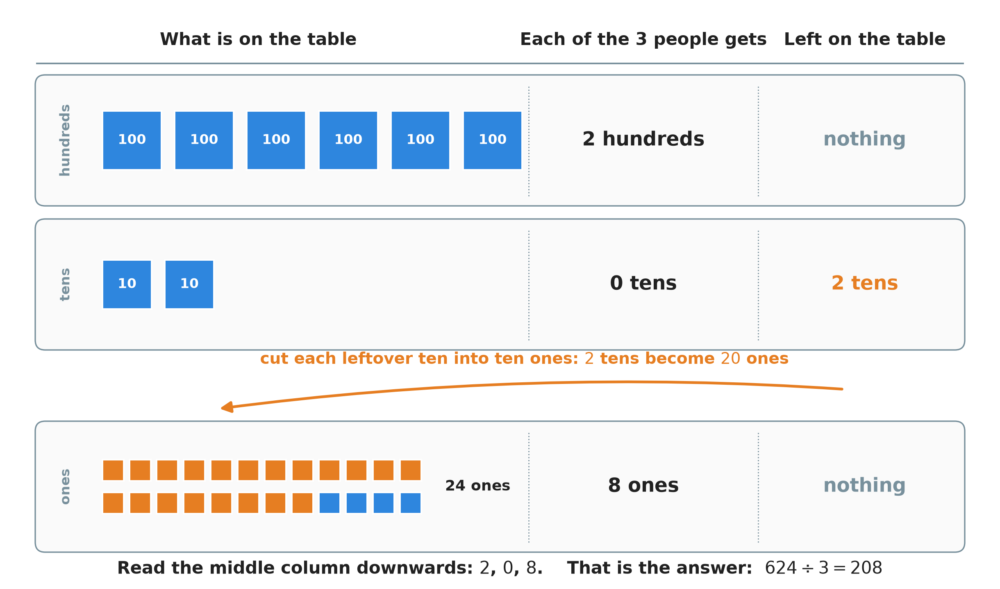
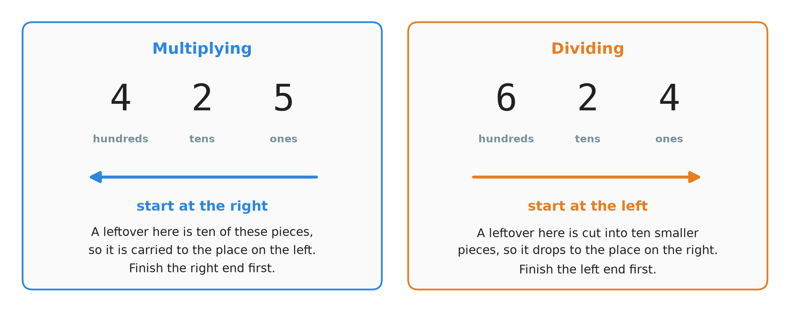
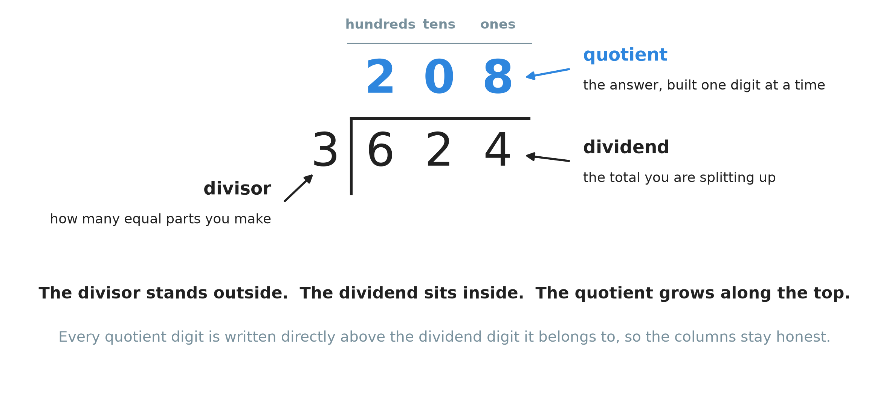
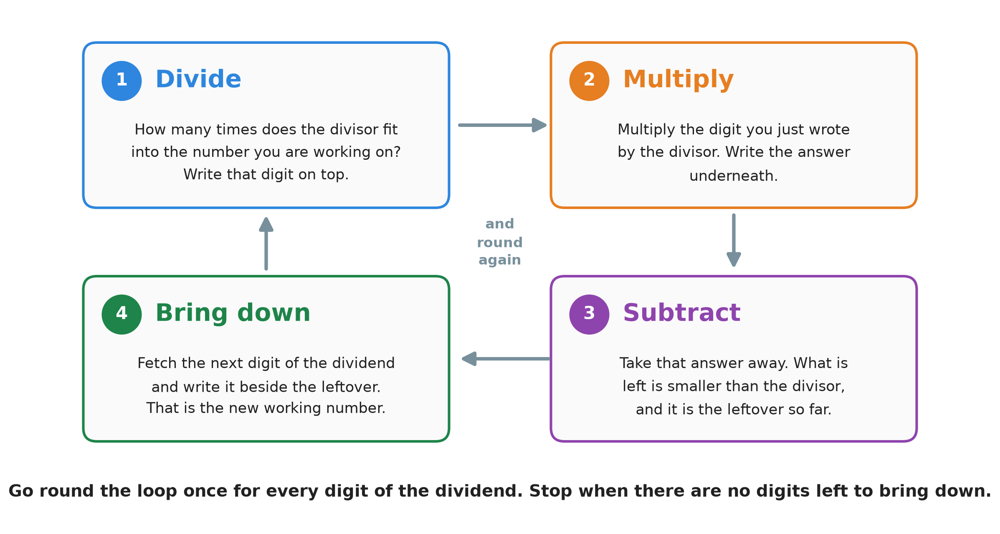
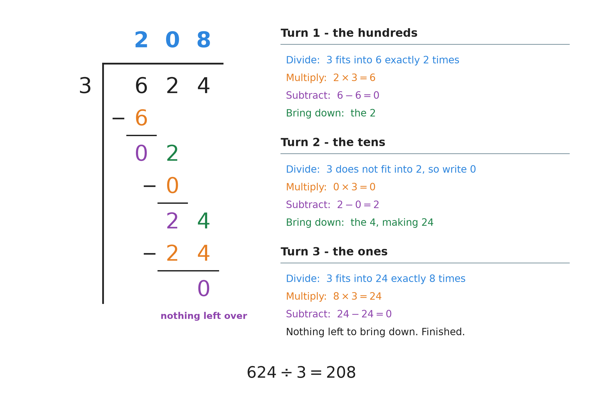
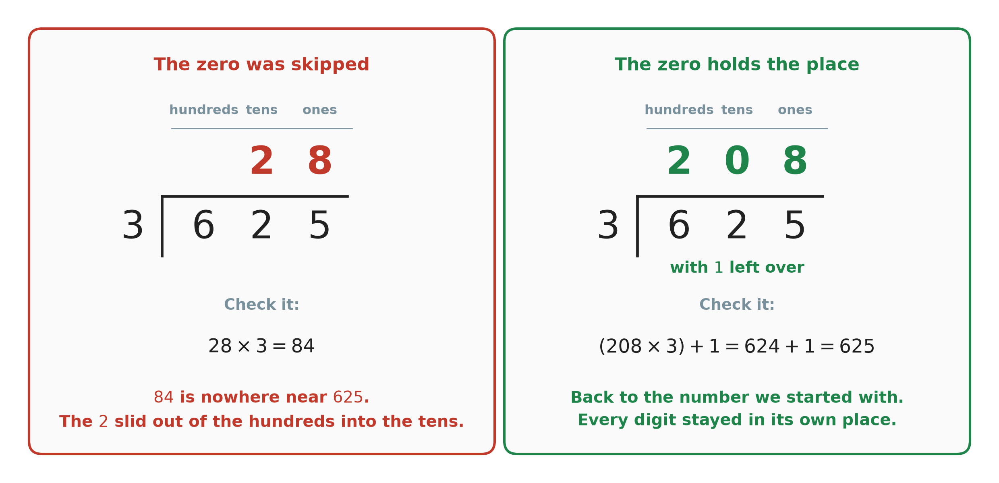
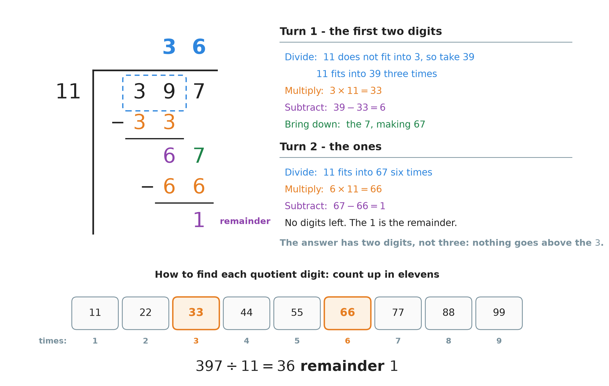
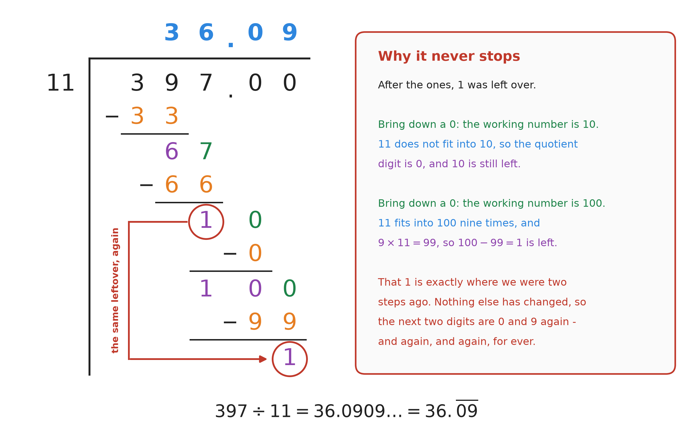

# 8. Dividing large numbers

**What this chapter teaches**
How to divide one large number by another, on paper, without a calculator. You will learn the
written method called **long division**: four small steps that you repeat once for every digit.
You will also see what to do when the division does not come out even.

**Before you start**
Read [Chapter 1, section 1](./../1_Fractions/1_Fractions.md#1-division-and-its-three-names)
for the words *dividend*, *divisor* and *quotient*, and
[Chapter 1, section 5.3](./../1_Fractions/1_Fractions.md#53-turning-an-improper-fraction-into-a-mixed-number)
for the *remainder*. You also need
[Chapter 5](./../5_Adding_And_Subtracting_Large_Numbers/5_Adding_And_Subtracting_Large_Numbers.md)
for columns, subtraction and the word *algorithm*, and
[Chapter 7](./../7_Multiplying_Large_Numbers/7_Multiplying_Large_Numbers.md) for multiplying.
Every turn of this method is one small multiplication followed by one small subtraction.

---

## Table of contents

1. [Sharing a large number](#1-sharing-a-large-number)
2. [The division bracket](#2-the-division-bracket)
3. [The four steps that repeat](#3-the-four-steps-that-repeat)
4. [A first division: 624 divided by 3](#4-a-first-division-624-divided-by-3)
5. [When something is left over: 625 divided by 3](#5-when-something-is-left-over-625-divided-by-3)
6. [Dividing by a two-digit number: 397 divided by 11](#6-dividing-by-a-two-digit-number-397-divided-by-11)
7. [Going past the point: a decimal answer](#7-going-past-the-point-a-decimal-answer)
8. [Three ways to write one answer](#8-three-ways-to-write-one-answer)
9. [Glossary](#9-glossary)
10. [Check your understanding](#10-check-your-understanding)
11. [Important notes](#11-important-notes)

---

## 1. Sharing a large number

### 1.1 Small divisions are times tables, read backwards

You already know this one:

$$
15 \div 5 = 3
$$

You know it because you know that $5 \times 3 = 15$. That is the whole reason it feels easy. A
small division is a line of the times tables, read from the other end.

**Definition.** Two operations are **inverse** operations when each one undoes the other.
Multiplication and division are inverse operations.

In symbols:

$$
\text{if} \quad a \times b = c \quad \text{then} \quad c \div b = a
$$

* $a$ and $b$ — the two numbers being multiplied.
* $c$ — the answer you get when you multiply them.

In words: if multiplying $a$ by $b$ takes you to $c$, then dividing $c$ by $b$ brings you back
to $a$. Multiplying walks one way; dividing walks back.

With real numbers, using $5 \times 3 = 15$:

$$
15 \div 5 = 3 \qquad \text{and} \qquad 15 \div 3 = 5
$$

This is the fact behind the check you met in
[Chapter 1, section 1.1](./../1_Fractions/1_Fractions.md#11-division-means-sharing-into-equal-parts):
multiply your answer back and see whether you land on the number you started with. We will use
that check on every example in this chapter.

### 1.2 Where the times tables run out

Now look at this one:

$$
625 \div 3
$$

There is no line in any times table that says $625 \div 3$. Nobody knows this answer by heart.

So we need a method: a fixed list of steps that works every time, whatever the two numbers are.
That is exactly what
[Chapter 5, section 1.3](./../5_Adding_And_Subtracting_Large_Numbers/5_Adding_And_Subtracting_Large_Numbers.md#13-so-we-use-an-algorithm-instead)
called an **algorithm**.

### 1.3 A large number is a pile of pieces of different sizes

Before the method, look at what division actually does to a large number.

$624$ is not really one thing. It is $6$ hundreds, $2$ tens and $4$ ones — that is what place
value means
([Chapter 2, section 2.1](./../2_Decimals/2_Decimals.md#21-the-position-of-a-digit-decides-its-value)).
So sharing $624$ between $3$ people means sharing three different sizes of piece.

Start with the biggest pieces.

    

**Figure 1 — Hand out the biggest pieces first. Six hundreds give two hundreds each, with
nothing left. Two tens cannot be split three ways, so nobody gets a ten and both tens stay on
the table. The orange arrow is the step that matters: those two leftover tens are cut into ten
ones each, which makes twenty ones, and they join the four ones that were already there.
Twenty-four ones between three people is eight each.**

Read the middle column of the picture downwards: $2$, $0$, $8$. That is the answer.

$$
624 \div 3 = 208
$$

Two things in that picture matter more than the answer.

* **Nothing is ever lost.** A leftover is not thrown away. It is cut into ten smaller pieces
  and carried down to the next place. Cutting into ten is the step to the right in the place
  value table — [Chapter 2, section 2.2](./../2_Decimals/2_Decimals.md#22-the-rule-of-ten).
* **The leftover moves to the right.** In
  [Chapter 5, section 2.4](./../5_Adding_And_Subtracting_Large_Numbers/5_Adding_And_Subtracting_Large_Numbers.md#24-ten-of-one-size-make-one-of-the-next-size)
  you traded ten small pieces **upwards** for one bigger piece. Here you trade one bigger piece
  **downwards** for ten small ones. It is the same trade, walked backwards.

### 1.4 Which end you start from, and why

This gives us the rule that surprises people.

    

**Figure 2 — The same fact seen twice. When you add or multiply, a full column overflows into
the place on its left, so you must finish the right-hand end before you touch the left. When
you divide, a leftover drops into the place on its right, so you must finish the left-hand end
first.**

In
[Chapter 5, section 3.2](./../5_Adding_And_Subtracting_Large_Numbers/5_Adding_And_Subtracting_Large_Numbers.md#32-draw-a-line-and-work-from-the-right)
and all through [Chapter 7](./../7_Multiplying_Large_Numbers/7_Multiplying_Large_Numbers.md)
you worked from right to left. Division runs the other way: **left to right, biggest place
first**.

**Warning.** This is not a matter of taste. If you start a division at the ones end, the
leftovers have nowhere to go, because there is no smaller place waiting for them yet. The
method falls apart.

### Summary of section 1

* A small division is a times-table fact read backwards.
* Multiplication and division are **inverse** operations: each one undoes the other.
* A large number is a pile of hundreds, tens and ones. Division shares out each size in turn.
* A leftover is never lost. It is cut into ten smaller pieces and joins the next place.
* Because leftovers travel to the right, division starts at the **left**.

---

## 2. The division bracket

### 2.1 The words, and the name of the method

You already have the words you need. From
[Chapter 1, section 1.2](./../1_Fractions/1_Fractions.md#12-the-three-names): in
$625 \div 3$ the **dividend** is $625$, the **divisor** is $3$, and the **quotient** is the
answer. From
[Chapter 1, section 5.3](./../1_Fractions/1_Fractions.md#53-turning-an-improper-fraction-into-a-mixed-number):
the **remainder** is what is left over when the sharing does not come out even.

**Definition.** **Long division** is the written method for dividing a large number by hand.
*Long* does not mean difficult. It means the work is written out at full length, one line per
step, instead of being done in your head.

### 2.2 Where each number is written

Long division has its own piece of scaffolding.

**Definition.** The **division bracket** is the shape you draw to hold the work: a vertical
line, with a horizontal line running to the right from the top of it. Some books call it the
*tableau*, which is simply the French word for a layout.

    

**Figure 3 — The divisor stands outside the bracket on the left. The dividend sits inside it.
The quotient is built along the top, one digit at a time. Look at the columns: the $2$ of the
answer sits above the $6$, the $0$ above the $2$, the $8$ above the $4$.**

That last point is the whole reason the bracket exists.

**Note.** Every quotient digit is written **directly above** the dividend digit it came from.
The digit above the hundreds column is a number of hundreds. The digit above the tens column is
a number of tens. If your columns drift, your answer comes out ten times too big or ten times
too small, and nothing in the working will tell you.

Use squared paper, or draw the columns before you start. It is the cheapest mistake to prevent.

### Summary of section 2

* **Dividend**, **divisor**, **quotient** and **remainder** are all words from Chapter 1.
* **Long division** is the written method; *long* means written out in full.
* The **division bracket** holds the work: divisor outside, dividend inside, quotient on top.
* Each quotient digit goes directly above the dividend digit it came from.

---

## 3. The four steps that repeat

The whole method is four steps. You do them in order, and then you do them again, and again,
until the dividend runs out of digits.

    

**Figure 4 — The four steps are a loop, not a list. You go round it once for every digit of the
dividend. The four colours come back in the next figures: blue for a digit of the answer,
orange for a product written underneath, purple for what is left after subtracting, green for a
digit that has just been brought down.**

Here they are in words.

1. **Divide.** Ask how many times the divisor fits into the number you are working on. Write
   that digit on top, in the right column.
2. **Multiply.** Multiply the digit you just wrote by the divisor. Write the answer underneath
   the number you are working on.
3. **Subtract.** Take it away. What is left is the leftover so far.
4. **Bring down.** Fetch the next digit of the dividend and write it beside the leftover. The
   two together are your new working number, and you go back to step 1.

**Definition.** The **working number** is the number you are dividing into at this moment. It
starts as the first digit or two of the dividend. After that it is always "what was left over,
with the next digit written after it".

**Note.** A memory aid many people use: **D**ad, **M**um, **S**ister, **B**rother —
**D**ivide, **M**ultiply, **S**ubtract, **B**ring down. Four family members, four steps, in
order.

You stop when there is nothing left to bring down. Whatever is sitting at the bottom of the
page at that moment is the remainder.

### Summary of section 3

* Divide, Multiply, Subtract, Bring down — then start again.
* One turn of the loop produces exactly one digit of the answer.
* The **working number** is the leftover with the next dividend digit written after it.
* You stop when the dividend has no digits left to bring down.

---

## 4. A first division: 624 divided by 3

This is the division from figure 1, now done on paper. Three digits in the dividend, so three
turns of the loop.

### 4.1 Turn one — the hundreds

The working number is $6$, the first digit of the dividend.

* **Divide.** How many times does $3$ fit into $6$? Exactly $2$ times. Write $2$ above the $6$.
* **Multiply.** $2 \times 3 = 6$. Write $6$ underneath.
* **Subtract.** $6 - 6 = 0$. Nothing is left in the hundreds.
* **Bring down.** Fetch the $2$. The new working number is $2$.

### 4.2 Turn two — the tens

The working number is $2$.

* **Divide.** How many times does $3$ fit into $2$? It does not fit at all, because $2$ is
  smaller than $3$. So the answer for this column is $0$. **Write the $0$ above the $2$.**
* **Multiply.** $0 \times 3 = 0$.
* **Subtract.** $2 - 0 = 2$. Both tens are still waiting.
* **Bring down.** Fetch the $4$. Writing it after the $2$ gives $24$.

That is the step figure 1 showed with counters: two tens with nowhere to go, cut into twenty
ones, joining the four ones that were already there.

### 4.3 Turn three — the ones

The working number is $24$.

* **Divide.** How many times does $3$ fit into $24$? Exactly $8$ times, because
  $8 \times 3 = 24$. Write $8$ above the $4$.
* **Multiply.** $8 \times 3 = 24$.
* **Subtract.** $24 - 24 = 0$.

There is nothing left to bring down, so the work is finished.

    

**Figure 5 — The left half is exactly what you write on paper. The right half names every step.
Read the colours down the page and you are watching the loop go round three times. The answer
on top is $208$, and the $0$ at the bottom means nothing was left over.**

$$
624 \div 3 = 208
$$

### 4.4 Check it

Multiply the answer back by the divisor. If the division is right, you land on the dividend
again. That is section 1.1 put to work.

$$
208 \times 3 = 624
$$

Using the column method from
[Chapter 7, section 3](./../7_Multiplying_Large_Numbers/7_Multiplying_Large_Numbers.md#3-multiplying-by-one-digit-in-columns):
ones, $8 \times 3 = 24$, write $4$ and carry $2$. Tens, $(0 \times 3) + 2 = 2$. Hundreds,
$2 \times 3 = 6$. That gives $624$, which is where we started. The answer is right.

### Summary of section 4

* Three digits in the dividend, three turns of the loop, three digits in the answer.
* When the divisor does not fit, the quotient digit is $0$ — and you write it.
* A leftover plus the next digit makes the new working number: $2$ and $4$ make $24$.
* Check by multiplying the quotient by the divisor. You should land back on the dividend.

---

## 5. When something is left over: 625 divided by 3

### 5.1 The same work, one digit different

Change the last digit of the dividend from $4$ to $5$, and nothing changes until the very end.

* **Turn one.** $3$ into $6$ goes $2$ times. $2 \times 3 = 6$. $6 - 6 = 0$. Bring down the $2$.
* **Turn two.** $3$ does not fit into $2$, so write $0$. $0 \times 3 = 0$. $2 - 0 = 2$. Bring
  down the $5$, making $25$.
* **Turn three.** $3$ into $25$ goes $8$ times, because $8 \times 3 = 24$, while
  $9 \times 3 = 27$ is already too much. Write $8$. Subtract: $25 - 24 = 1$.

There are no digits left to bring down, and $1$ is still sitting there. That $1$ is the
remainder.

$$
625 \div 3 = 208 \text{ remainder } 1
$$

### 5.2 How big may a remainder be?

A remainder is always **smaller than the divisor**:

$$
0 \leq \text{remainder} < \text{divisor}
$$

In words: the leftover is never less than nothing, and it is never as big as the number you are
dividing by.

The reason is short. If the leftover were as big as the divisor, then the divisor would fit
into it one more time — so you had not finished dividing.

**Warning.** Suppose someone says $25 \div 3 = 7$ with remainder $4$. Check the size of the
remainder: $4$ is bigger than $3$. That is impossible. And indeed $3$ does fit once more: the
true answer is $8$ with remainder $1$. **A remainder that is too big always means the quotient
digit was too small.**

### 5.3 The equation that says what a right answer is

Here is the sentence behind every division in this chapter: the parts you handed out, plus the
bit you could not hand out, must add back up to what you started with.

With the numbers from section 5.1. Three people were given $208$ each:

$$
208 \times 3 = 624
$$

And $1$ was left on the table:

$$
624 + 1 = 625
$$

Back to where we began. In general:

$$
\text{dividend} = (\text{divisor} \times \text{quotient}) + \text{remainder}
$$

* **dividend** — the total you started with.
* **divisor** — how many equal parts you made.
* **quotient** — how much went into one part.
* **remainder** — what was left on the table, always smaller than the divisor.

You have seen this equation before, wearing different clothes. In
[Chapter 1, section 5.3](./../1_Fractions/1_Fractions.md#53-turning-an-improper-fraction-into-a-mixed-number)
it was written $N = (W \times D) + R$, where $N$ was a number of pizza slices and $W$ was the
number of whole pizzas you could build from them. Same equation, same idea: whole parts plus
leftover equals the total.

**Note.** This is the only check you need, and it works for every division in this chapter.
Multiply, add the remainder, and see whether you come home.

### 5.4 The zero you must not skip

Look again at turn two. The divisor did not fit, so the quotient digit was $0$. It is very
tempting to write nothing at all and move on. That one missing digit ruins the answer.

    

**Figure 6 — On the left the zero was skipped, so only two digits were written and the $2$ slid
out of the hundreds column into the tens. The answer reads $28$ instead of $208$. The check
gives $84$, which is nowhere near $625$, so the mistake is caught at once.**

That $0$ is doing the same job as the $0$ in
[Chapter 2, section 3.3](./../2_Decimals/2_Decimals.md#33-zero-holds-an-empty-place)
and the place holders in
[Chapter 7, section 5.2](./../7_Multiplying_Large_Numbers/7_Multiplying_Large_Numbers.md#52-what-the-place-holder-is-really-doing):
it holds a place open so that the digits beside it cannot slide.

**Warning.** If the divisor does not fit into the working number, write $0$ in the quotient and
carry straight on to the next digit. Never leave the column empty.

### Summary of section 5

* When the last subtraction leaves something behind, that leftover is the **remainder**.
* A remainder is always smaller than the divisor. A bigger one means your quotient digit was
  too small.
* $\text{dividend} = (\text{divisor} \times \text{quotient}) + \text{remainder}$ is the check
  for every division.
* Never skip a $0$ in the quotient. It holds a place open, exactly as in Chapters 2 and 7.

---

## 6. Dividing by a two-digit number: 397 divided by 11

### 6.1 When the divisor does not fit the first digit

Nothing about the four steps changes when the divisor gets bigger. Only the start changes.

The first working number would be the first digit of the dividend, $3$. But $11$ does not fit
into $3$. So you take **one more digit**, and the working number becomes $39$.

Where does the quotient digit go? Above the **last** digit you took — above the $9$, not above
the $3$. That is the tens column, so this digit counts tens, and that is exactly right: $11$
goes into $397$ about thirty-something times.

**Note.** Nothing at all is written above the $3$. You could write a $0$ there, but a zero at
the **front** of a number changes nothing, so it is left out — in the same way that you write
$36$ and never $036$. This is different from the $0$ inside $208$ in section 5.4, which sits
between two digits and is holding them apart.

### 6.2 Finding the digit when you do not know the times table

With a divisor of $3$ you can see the answer at once. With a divisor of $11$, most people
cannot.

The fix is to count up in elevens until you go past the working number, then step back one. For
the working number $39$:

$$
11, \quad 22, \quad 33, \quad 44
$$

$44$ is already past $39$. Step back: $33$ is the biggest one that still fits, and $33$ is
$3 \times 11$. So the quotient digit is $3$, and the subtraction will be $39 - 33$.

Writing that short list at the side of your page costs ten seconds and removes all the
guessing.

### 6.3 The work

* **Turn one.** Working number $39$. Divide: $11$ fits $3$ times. Multiply: $3 \times 11 = 33$.
  Subtract: $39 - 33 = 6$. Bring down the $7$, making $67$.
* **Turn two.** Working number $67$. Count up: $11$, $22$, $33$, $44$, $55$, $66$, $77$. $77$
  is too big, so the digit is $6$. Multiply: $6 \times 11 = 66$. Subtract: $67 - 66 = 1$.

Nothing is left to bring down, and $1$ is smaller than $11$, so $1$ is the remainder.

    

**Figure 7 — The dashed blue box marks the first working number, $39$: two digits, because $11$
will not fit into one. The first quotient digit sits above the $9$, so the answer has two digits
and not three. The strip along the bottom is the eleven times table counted out; $33$ and $66$
are the two entries this division actually uses.**

$$
397 \div 11 = 36 \text{ remainder } 1
$$

### 6.4 Check it

$$
36 \times 11 = 396
$$

$$
396 + 1 = 397
$$

Home again, so the answer is right.

### Summary of section 6

* If the divisor will not fit into the first digit, take two digits instead.
* The quotient digit goes above the **last** digit of the working number.
* A zero at the front of the quotient is not written; a zero inside it always is.
* When you do not know the times table, count up in the divisor until you pass the working
  number, then step back one.

---

## 7. Going past the point: a decimal answer

### 7.1 The idea is already in the book

A remainder is a perfectly good answer when the thing being shared cannot be cut: you cannot
hand out a third of a chair. But money, weight and distance can be cut, and then a decimal is
more useful than "remainder $1$".

You already know how to do this. In
[Chapter 4, section 2.3](./../4_Converting_Between_Forms/4_Converting_Between_Forms.md#23-method-2--divide-and-keep-going-past-the-point)
the rule was one sentence: **when something is left over, cut every leftover piece into ten
smaller pieces and share again.** Chapter 4 wrote that out as a table. Here we do the same
thing inside the bracket.

### 7.2 What you write

Three small additions to the layout, and then the same four steps as before.

1. Put a decimal point after the last digit of the dividend, and write as many zeros after it
   as you need. Those zeros change nothing:
   [Chapter 2, section 3.4](./../2_Decimals/2_Decimals.md#34-zeros-at-the-end-change-nothing)
   showed that $397 = 397.0 = 397.00$.
2. Put a decimal point in the quotient as well, **directly above** the one in the dividend. Do
   it the moment you reach it, not at the end.
3. Carry on: divide, multiply, subtract, bring down — now bringing down those zeros.

**Warning.** The point in the answer must sit exactly above the point in the dividend. It is
the same column rule as section 2.2, and getting it wrong moves your answer by a factor of ten.

### 7.3 397 divided by 11, all the way

We stopped in section 6.3 with a leftover of $1$. Now we carry on.

* **Tenths.** Bring down a $0$. The working number is $10$. Does $11$ fit into $10$? No. So the
  tenths digit is $0$. Multiply: $0 \times 11 = 0$. Subtract: $10 - 0 = 10$.
* **Hundredths.** Bring down another $0$. The working number is $100$. Count up in elevens:
  $9 \times 11 = 99$, and $10 \times 11 = 110$ would be too big. So the hundredths digit is
  $9$. Multiply: $9 \times 11 = 99$. Subtract: $100 - 99 = 1$.

Stop and look at that $1$.

    

**Figure 8 — Both circled numbers are a leftover of $1$, two turns apart. Nothing else about the
working is different at those two moments, so whatever happened in between must happen again.
The two digits $0$ and $9$ come round for ever.**

$$
397 \div 11 = 36.090909\ldots = 36.\overline{09}
$$

The bar over the $09$ means those two digits repeat for ever. Both the bar and the name
**repeating decimal** are from
[Chapter 4, section 2.4](./../4_Converting_Between_Forms/4_Converting_Between_Forms.md#24-when-the-division-never-stops),
where $\frac{1}{3} = 0.\overline{3}$ looped for exactly the same reason.

### 7.4 How to know when to stop

Watch the leftovers. There are only two things that can happen.

* **A leftover of $0$ appears.** The division is finished and the decimal stops. That is a
  **terminating decimal**, like $3 \div 8 = 0.375$ in
  [Chapter 4, section 2.3](./../4_Converting_Between_Forms/4_Converting_Between_Forms.md#23-method-2--divide-and-keep-going-past-the-point).
* **A leftover you have already seen comes back.** From that point on the same working repeats,
  so the same quotient digits repeat. Write the bar and stop.

**Note.** This is why you should write the leftovers down clearly instead of keeping them in
your head. They are what tells you when to put the pen down.

### Summary of section 7

* To get a decimal instead of a remainder, add a point and some zeros to the dividend and keep
  going.
* The point in the quotient sits directly above the point in the dividend.
* A leftover of $0$ means the decimal stops.
* A leftover that comes back a second time means the decimal repeats for ever.
* $397 \div 11 = 36.\overline{09}$.

---

## 8. Three ways to write one answer

$625 \div 3$ has one answer and three ways to write it down.

| Form | Written | Read as |
| --- | --- | --- |
| Whole number and remainder | $208$ remainder $1$ | two hundred and eight, with one left over |
| Mixed number | $208\frac{1}{3}$ | two hundred and eight and a third |
| Decimal | $208.\overline{3}$ | two hundred and eight point three, three, three… |

The middle one comes straight out of the division:

$$
\frac{\text{dividend}}{\text{divisor}} = \text{quotient} + \frac{\text{remainder}}{\text{divisor}}
$$

In words: the answer is the whole part, plus the leftover shared between the same number of
people. The leftover goes on top, and the divisor stays underneath, because it has not changed.

With the numbers:

$$
\frac{625}{3} = 208 + \frac{1}{3} = 208\frac{1}{3}
$$

There is nothing new here. It is
[Chapter 1, section 5.3](./../1_Fractions/1_Fractions.md#53-turning-an-improper-fraction-into-a-mixed-number)
read in the other direction. There you turned $\frac{30}{8}$ into $3\frac{3}{4}$ by dividing;
here the division is already done and you are writing the result down.

Which form should you use?

* **Remainder** when the things cannot be cut: chairs, people, buses, boxes.
* **Mixed number** when you want an exact answer and the fraction is simple.
* **Decimal** for money and measurements, or when you need to compare two answers quickly — see
  [Chapter 4, section 1.2](./../4_Converting_Between_Forms/4_Converting_Between_Forms.md#12-then-why-do-we-need-three-of-them).

**Warning.** $208.\overline{3}$ never ends, so any decimal you actually write down has been
shortened. If you write $208.33$, say so: "about $208.33$". The remainder form and the mixed
number are exact; a shortened decimal is not.

### Summary of section 8

* One division, three ways to write the answer: remainder, mixed number, decimal.
* $\frac{\text{dividend}}{\text{divisor}} = \text{quotient} + \frac{\text{remainder}}{\text{divisor}}$.
* The remainder goes on top of the fraction; the divisor stays underneath.
* Choose the form that suits what you are counting.

---

## 9. Glossary

Only the words that appear for the first time in this chapter. Everything else is linked back to
the chapter that defined it.

* **Inverse operations** — two operations that undo each other. Multiplication and division are
  inverse operations, which is why a division can be checked by multiplying.
* **Long division** — the written method in this chapter: divide, multiply, subtract, bring
  down, repeated once for every digit of the dividend. *Long* means written out in full.
* **Division bracket** (also called the *tableau*) — the vertical line with a horizontal line
  along the top that holds the work. The divisor goes outside on the left, the dividend inside,
  and the quotient along the top.
* **Working number** — the number you are dividing into at this moment: the leftover from the
  last turn, with the next dividend digit written after it.
* **Bring down** — the fourth step: fetching the next digit of the dividend and writing it
  beside the leftover.

---

## 10. Check your understanding

Try each one on paper before you open the answer.

**Question 1.** Work out $486 \div 2$ by long division.

Answer

Three digits, so three turns.

* **Hundreds.** $2$ into $4$ goes $2$ times. $2 \times 2 = 4$. $4 - 4 = 0$. Bring down the $8$.
* **Tens.** $2$ into $8$ goes $4$ times. $4 \times 2 = 8$. $8 - 8 = 0$. Bring down the $6$.
* **Ones.** $2$ into $6$ goes $3$ times. $3 \times 2 = 6$. $6 - 6 = 0$.

$$
486 \div 2 = 243
$$

Check: $243 \times 2 = 486$. Correct.

**Question 2.** Work out $745 \div 4$. Give the answer with a remainder, then as a mixed number,
then as a decimal.

Answer

* **Hundreds.** $4$ into $7$ goes $1$ time. $1 \times 4 = 4$. $7 - 4 = 3$. Bring down the $4$,
  making $34$.
* **Tens.** $4$ into $34$ goes $8$ times, because $8 \times 4 = 32$, while $9 \times 4 = 36$ is
  too big. $34 - 32 = 2$. Bring down the $5$, making $25$.
* **Ones.** $4$ into $25$ goes $6$ times, because $6 \times 4 = 24$. $25 - 24 = 1$.

$$
745 \div 4 = 186 \text{ remainder } 1
$$

As a mixed number, the leftover $1$ goes over the divisor:

$$
745 \div 4 = 186\frac{1}{4}
$$

For the decimal, carry on past the point.

* **Tenths.** Bring down a $0$, making $10$. $4$ into $10$ goes $2$ times. $2 \times 4 = 8$.
  $10 - 8 = 2$.
* **Hundredths.** Bring down a $0$, making $20$. $4$ into $20$ goes $5$ times.
  $5 \times 4 = 20$. $20 - 20 = 0$.

The leftover is $0$, so the decimal stops.

$$
745 \div 4 = 186.25
$$

Check: $186 \times 4 = 744$, and $744 + 1 = 745$. Correct. And $\frac{1}{4} = 0.25$ agrees with
the table in
[Chapter 4, section 4.2](./../4_Converting_Between_Forms/4_Converting_Between_Forms.md#42-the-table-worth-learning).

**Question 3.** Work out $529 \div 12$, first with a remainder and then as a decimal.

Answer

$12$ does not fit into $5$, so the first working number is $52$. Count up in twelves: $12$,
$24$, $36$, $48$, $60$. $60$ is too big, so $48$ fits and the digit is $4$. It goes above the
$2$, so the answer has two digits.

* **Turn one.** $52 - 48 = 4$. Bring down the $9$, making $49$.
* **Turn two.** $48$ still fits and $60$ still does not, so the digit is $4$ again.
  $49 - 48 = 1$.

$$
529 \div 12 = 44 \text{ remainder } 1 = 44\frac{1}{12}
$$

Now past the point.

* **Tenths.** Bring down a $0$, making $10$. $12$ does not fit into $10$, so the digit is $0$.
  $10 - 0 = 10$.
* **Hundredths.** Bring down a $0$, making $100$. $8 \times 12 = 96$, while $9 \times 12 = 108$
  is too big, so the digit is $8$. $100 - 96 = 4$.
* **Thousandths.** Bring down a $0$, making $40$. $3 \times 12 = 36$, so the digit is $3$.
  $40 - 36 = 4$.

The leftover is $4$ again — the same as the turn before. So the digit $3$ repeats for ever.

$$
529 \div 12 = 44.08333\ldots = 44.08\overline{3}
$$

Check: $44 \times 12 = 528$, and $528 + 1 = 529$. Correct.

**Question 4.** In $624 \div 3$, why must you write the $0$ in $208$, when $0 \times 3 = 0$ adds
nothing at all to the working?

Answer

Because the $0$ is not there for the arithmetic. It is there to hold a column open.

The $2$ has to stay in the hundreds column and the $8$ has to stay in the ones column. If
nothing is written between them, they slide together and the answer reads $28$ — the $2$ has
become two tens instead of two hundreds.

It is the same job the place-holding zero does in
[Chapter 2, section 3.3](./../2_Decimals/2_Decimals.md#33-zero-holds-an-empty-place)
and in the second row of a long multiplication
([Chapter 7, section 5.2](./../7_Multiplying_Large_Numbers/7_Multiplying_Large_Numbers.md#52-what-the-place-holder-is-really-doing)).

**Question 5.** A student writes $25 \div 3 = 7$ remainder $4$. Without dividing again, say how
you know it is wrong.

Answer

The remainder is bigger than the divisor: $4$ is bigger than $3$. That can never happen.

If $4$ is left over, then $3$ fits into it one more time, so the quotient digit was one too
small. The true answer: $8 \times 3 = 24$ and $25 - 24 = 1$, so $25 \div 3 = 8$ remainder $1$.
Now the remainder $1$ is smaller than the divisor $3$, as it must be.

Notice that the equation from section 5.3 does **not** catch this one:
$(7 \times 3) + 4 = 21 + 4 = 25$ comes out right. The arithmetic was not wrong; the division was
simply stopped too early. **That is why you check the size of the remainder as well as the
equation.**

**Question 6.** Column addition and long multiplication start at the right-hand end. Long
division starts at the left. Why the difference?

Answer

Because leftovers travel in opposite directions.

When you add or multiply, a column that goes over $9$ overflows into the place on its **left**
as a carry. So you must settle the right-hand column before you can finish the one beside it.

When you divide, a leftover is too big to share, so it gets cut into ten smaller pieces and
drops into the place on its **right**. So you must settle the left-hand column first, and its
leftover then joins the next column along.

Both rules say the same thing: **finish the end that the leftovers come from.**

**Question 7.** Someone tells you that $936 \div 7 = 133$ remainder $5$. Check it without doing
the division.

Answer

Two things to check.

First the size of the remainder: $5$ is smaller than $7$. Good.

Then the equation from section 5.3:

$$
133 \times 7 = 931
$$

$$
931 + 5 = 936
$$

That is the number we started with, so the answer is right.

**Question 8.** While dividing $397$ by $11$ you reach a leftover of $1$ for the second time.
Why is that enough to know the answer repeats, without doing any more steps?

Answer

Because at that moment nothing is different from the first time.

The divisor is still $11$. The leftover is still $1$. The only digits still to come down are
zeros, and one zero is the same as another. Every number going into the next step is identical
to what it was two turns ago.

The same steps on the same numbers must give the same results. So the digits $0$ and $9$ come
out again, and again, for ever:

$$
397 \div 11 = 36.\overline{09}
$$

---

## 11. Important notes

**The three mistakes people actually make.**

* **Skipping the zero in the quotient.** This is the big one, and it hides well, because the
  rest of the working looks perfectly tidy. $625 \div 3$ comes out as $28$ instead of $208$. Get
  into the habit of writing a digit in the quotient on **every** turn of the loop, even when
  that digit is $0$.
* **Letting the remainder grow too big.** $25 \div 3 = 7$ remainder $4$ is not a small slip; it
  means you stopped dividing too early. Before you write a remainder down, compare it with the
  divisor. It must be smaller.
* **Letting the columns drift.** A quotient digit written half a column to the left is worth ten
  times what it should be, and nothing in the working will complain. Draw your columns, or use
  squared paper.

**The three ideas to keep.**

* **Division walks down the places.** You share the hundreds, then whatever is left becomes
  tens, then whatever is left becomes ones, then tenths, then hundredths. The four steps are
  just the bookkeeping for that one idea.
* **The leftover tells you everything.** It tells you whether your quotient digit was too small
  (leftover too big), whether the division has finished (leftover $0$), and whether the decimal
  will repeat (a leftover you have seen before). Write your leftovers clearly.
* **You never have to wonder whether you are right.** Multiply the quotient by the divisor, add
  the remainder, and see whether you land on the dividend. It takes ten seconds and it is never
  wrong.

**How this chapter connects to the rest of the book.**
This is the last of the four operations, and it uses all three of the others. Each turn of the
loop is a multiplication from
[Chapter 7](./../7_Multiplying_Large_Numbers/7_Multiplying_Large_Numbers.md) and a subtraction
from
[Chapter 5](./../5_Adding_And_Subtracting_Large_Numbers/5_Adding_And_Subtracting_Large_Numbers.md),
and the check at the end is a multiplication plus an addition. Long division is not new
arithmetic. It is a way of keeping arithmetic you already know in the right order.

It also closes a hole. Chapter 1 could divide only when the answer happened to be a times-table
fact. Chapter 4 could take a division past the decimal point, but only in a table, and only for
small numbers. This chapter does both, for any two whole numbers, on one piece of paper.

---

- [Back to the book](./../README.md)
- Previous: [7 Multiplying large numbers](./../7_Multiplying_Large_Numbers/7_Multiplying_Large_Numbers.md)
- Next: [9 Negative numbers](./../9_Negative_Numbers/9_Negative_Numbers.md)
