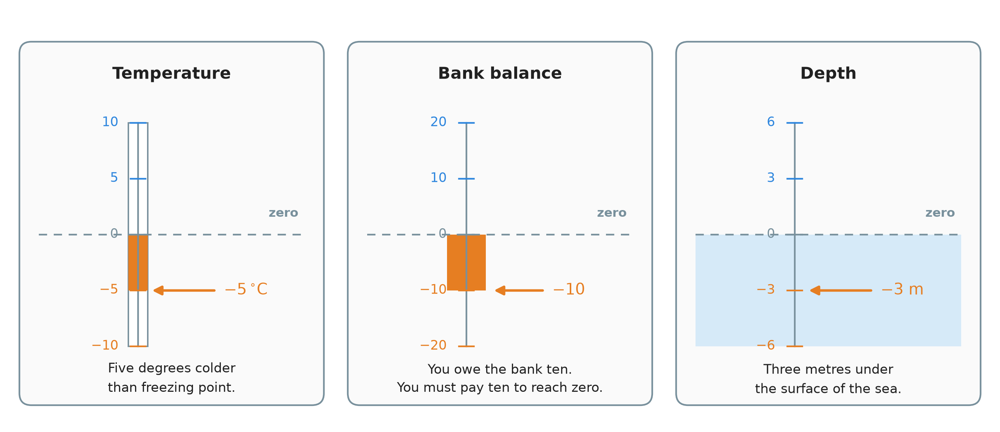
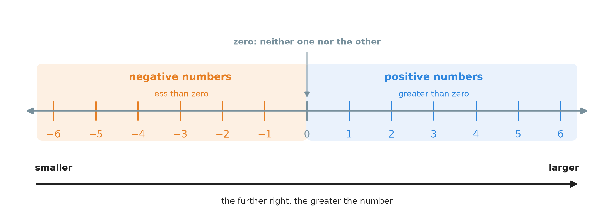
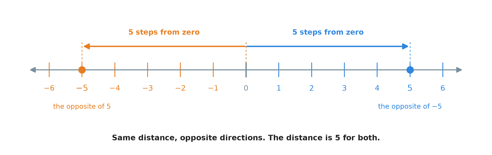
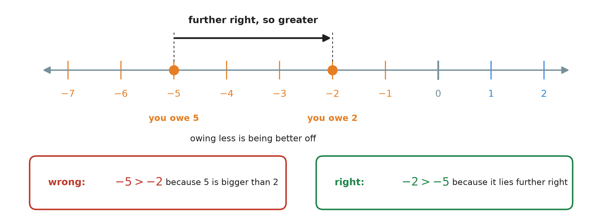
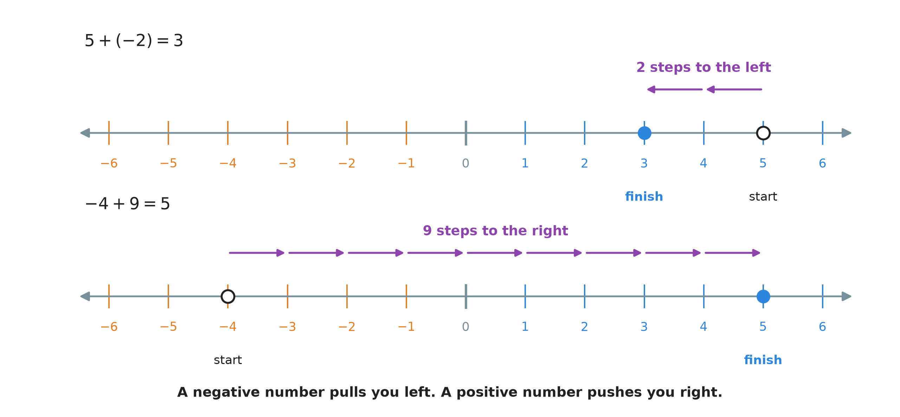
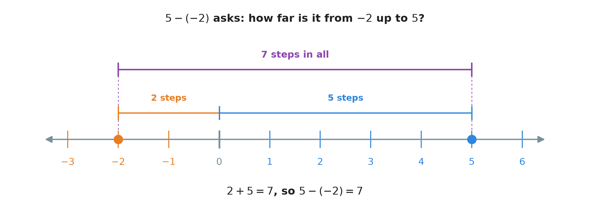
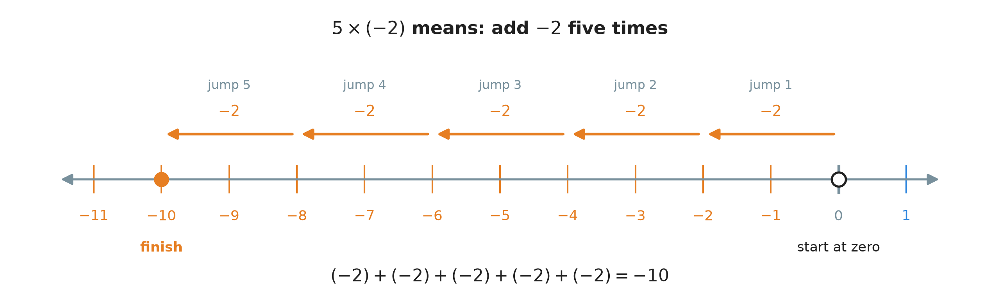
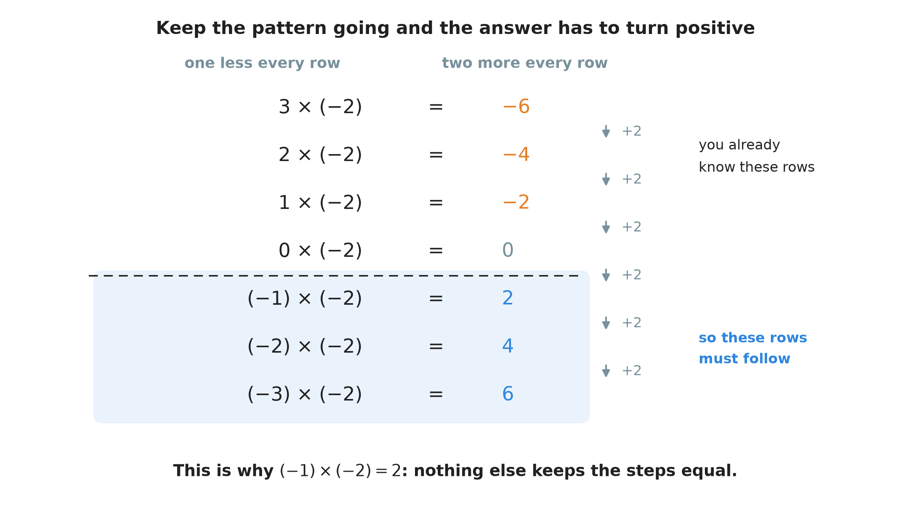
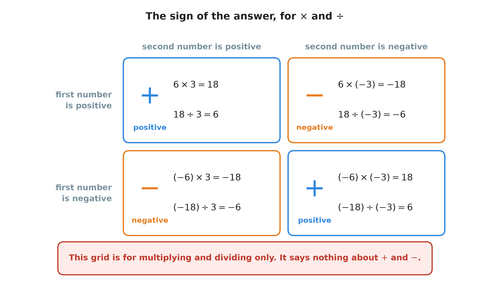

# 9. Negative numbers

**What this chapter teaches**
What a number below zero means, how to compare two of them, and how to add, subtract, multiply
and divide with them. After this chapter, a subtraction like $10 - 15$ finally has an answer.

**Before you start**
Read
[Chapter 5, section 6](./../5_Adding_And_Subtracting_Large_Numbers/5_Adding_And_Subtracting_Large_Numbers.md#6-subtracting-large-numbers)
for subtraction and the warning that closes it, and
[Chapter 6, section 1](./../6_The_Distributive_Property/6_The_Distributive_Property.md#1-multiplication-before-we-start)
for multiplication as repeated addition and for what brackets mean. You also need the number
line from
[Chapter 1, section 5.2](./../1_Fractions/1_Fractions.md#52-both-kinds-of-fraction-on-the-number-line),
and *inverse operations* from
[Chapter 8, section 1.1](./../8_Dividing_Large_Numbers/8_Dividing_Large_Numbers.md#11-small-divisions-are-times-tables-read-backwards).

---

## Table of contents

1. [Where the numbers we have run out](#1-where-the-numbers-we-have-run-out)
2. [The line goes both ways](#2-the-line-goes-both-ways)
3. [Which of two numbers is bigger](#3-which-of-two-numbers-is-bigger)
4. [Adding and subtracting](#4-adding-and-subtracting)
5. [Multiplying](#5-multiplying)
6. [Dividing](#6-dividing)
7. [All the signs in one place](#7-all-the-signs-in-one-place)
8. [Glossary](#8-glossary)
9. [Check your understanding](#9-check-your-understanding)
10. [Important notes](#10-important-notes)

---

## 1. Where the numbers we have run out

### 1.1 Taking away less than you have

You have $10$ apples. A customer buys $3$ of them. You count what is left:

$$
10 - 3 = 7
$$

Nothing here is difficult. It works because you started with more than you gave away. Every
subtraction in
[Chapter 5](./../5_Adding_And_Subtracting_Large_Numbers/5_Adding_And_Subtracting_Large_Numbers.md)
was like this. The larger number went on top, the smaller number went underneath, and the
answer was never below zero.

That chapter ended with a promise: *taking a larger number away from a smaller one gives an
answer below zero, and numbers below zero are not in this book yet*
([Chapter 5, section 6.1](./../5_Adding_And_Subtracting_Large_Numbers/5_Adding_And_Subtracting_Large_Numbers.md#61-two-more-words-and-one-warning)).

This chapter keeps that promise.

### 1.2 Taking away more than you have

Same shop, same day. You still have $10$ apples. Now a customer wants to buy $15$.

You do what any shopkeeper would do:

* you give the customer all $10$ apples you have;
* you promise the other $5$ for tomorrow.

Look at your shop now. How many apples do you have? Not $10$ — you gave them away. Not $0$
either, because $0$ would mean you owe nobody anything. You have **less than nothing**: you
have no apples *and* a promise to hand over five more.

That situation is worth a number of its own, and the number is $-5$:

$$
10 - 15 = -5
$$

**In words:** you have five fewer apples than an empty shop. To get back to an empty shop —
back to zero — you must find $5$ apples and give them all away.

### 1.3 Below zero is normal

The apples are not a trick. Almost every measurement people use every day carries on below
zero.

    

**Figure 1 — The same idea three times. The dashed grey line is zero. In each case the orange
marker sits below it. The temperature is five degrees colder than freezing. The bank balance is
ten below empty, which means you owe the bank ten. The diver is three metres under the surface
of the sea.**

**Definition.** A **positive number** is a number greater than zero: $1$, $7$, $10.5$,
$\frac{3}{4}$. Every number in the book so far has been positive.

**Definition.** A **negative number** is a number less than zero. It is written with a minus
sign in front of it: $-1$, $-5$, $-2.5$.

**Definition.** The **sign** of a number says which of the two it is. A number with a minus
sign in front is negative. A number with nothing in front is positive.

**Note.** Zero is neither positive nor negative. It is the point both sides are measured from,
so it belongs to neither of them.

**Note.** You may sometimes see a positive number written with a plus in front, such as $+5$.
It means exactly the same as $5$. This book writes the plus only when it helps you compare it
with a $-5$ standing beside it.

### Summary of section 1

* Subtraction has worked so far only because the starting number was always the bigger one.
* When you take away more than you have, the answer is below zero.
* A number below zero is written with a minus sign: $-5$.
* $-5$ means "five below nothing" — you would need five more just to reach zero.
* Temperature, bank balances and depth all use these numbers every day.

---

## 2. The line goes both ways

### 2.1 The number line, continued

You have already used a number line twice: for fractions in
[Chapter 1, section 5.2](./../1_Fractions/1_Fractions.md#52-both-kinds-of-fraction-on-the-number-line)
and for decimals in
[Chapter 2, section 4.2](./../2_Decimals/2_Decimals.md#42-the-number-line-cut-into-tenths).
Both of those lines started at zero, because zero was the smallest number we had.

Now the line keeps going.

    

**Figure 2 — Zero is not the end of the line, it is the middle of it. Everything on the orange
side is negative, everything on the blue side is positive. The arrow along the bottom is the
part to remember: as you walk to the right the numbers grow, all the way across, with no break
at zero.**

The line has no end in either direction. Whatever negative number you name, there is a smaller
one further left. Whatever positive number you name, there is a bigger one further right.

**Note.** The steps are exactly the same size on both sides. The gap from $3$ to $4$ is the
same as the gap from $-4$ to $-3$. Negative numbers are not squeezed up or stretched out. They
are ordinary numbers sitting on the other side of zero.

### 2.2 Every number has an opposite

Look at $5$ and $-5$ in the picture below.

    

**Figure 3 — Both arrows start at zero and both are five steps long. The only difference is the
direction they point. That is the whole relationship between $5$ and $-5$.**

**Definition.** Two numbers are **opposites** when they are the same distance from zero, one on
each side. $-5$ is the opposite of $5$, and $5$ is the opposite of $-5$.

So the minus sign in front of a number has a plain meaning. It says **"the opposite of"**. Keep
that sentence: it is what explains the whole of section 5.

**Note.** Zero is its own opposite. It sits in the middle, so the other side of zero is still
zero.

### 2.3 How far from zero: the absolute value

Sometimes you do not care which side of zero a number is on. You only care how far from zero it
is. That distance has a name.

**Definition.** The **absolute value** of a number is its distance from zero, ignoring the
sign. The absolute value of $-5$ is $5$. The absolute value of $5$ is also $5$.

It is written with two straight bars around the number:

$$
|-5| = 5 \qquad \text{and} \qquad |5| = 5
$$

**In words:** take the number, throw the sign away, and keep what is left.

In [Chapter 2, section 2.4](./../2_Decimals/2_Decimals.md#24-each-step-to-the-right-makes-the-piece-ten-times-smaller)
the word **magnitude** was used for how big a number is. The absolute value is that same idea,
now that a number can sit on either side of zero: it is the size of a number with its direction
taken off.

**Warning.** An absolute value is never negative. It is a distance, and a distance cannot point
backwards. You can walk five steps to the left, but the walk is still five steps long.

This is not just a word. Section 5 will ask you to multiply $6$ and $-3$, and the way to do it
is to multiply the absolute values $6$ and $3$ first, then decide the sign afterwards.

### Summary of section 2

* The number line carries on to the left of zero, for ever, in steps of the same size.
* Negative numbers sit on the left, positive numbers on the right, zero in the middle.
* A number and its opposite are the same distance from zero, on opposite sides.
* A minus sign in front of a number means "the opposite of".
* The **absolute value** of a number is its distance from zero, and it is never negative.

---

## 3. Which of two numbers is bigger

### 3.1 One rule, and it never changes

Everything about comparing numbers comes from the arrow along the bottom of Figure 2:

> **A number further right on the number line is always greater than a number further left.**

The rule was already true for the numbers you knew. $7$ is right of $3$, and $7 > 3$. Nothing
changes when the line grows to the left. The rule simply covers more numbers now.

Three results come straight out of it:

* Every positive number is greater than every negative number, because the whole blue side is
  to the right of the whole orange side.
* Zero is greater than every negative number, and smaller than every positive number.
* Between two negative numbers, the one nearer to zero is the greater one.

That last one is the one people get wrong.

### 3.2 Two negative numbers

Which is greater, $-2$ or $-5$?

    

**Figure 4 — Find both numbers on the line. $-2$ sits further right than $-5$, so $-2$ is the
greater number. The money underneath says the same thing: owing $2$ is a better position to be
in than owing $5$.**

$$
-2 > -5
$$

**In words:** minus two is greater than minus five.

Read it as money if the symbols feel strange. A balance of $-2$ means you owe $2$. A balance of
$-5$ means you owe $5$. You would rather owe $2$: you are $3$ closer to being out of debt.
Being better off is what "greater" means.

### 3.3 The trap

**Warning.** This is the commonest mistake with negative numbers:

> "$-5$ is bigger than $-2$, because $5$ is bigger than $2$."

It is wrong. $5$ really is bigger than $2$ — that part is fine. But $-5$ and $-2$ are not $5$
and $2$. The minus sign sends each of them to the other side of zero, and crossing over flips
the order. The bigger the debt, the worse off you are.

The safe habit: **do not compare the digits, compare the positions.** Picture the line, find
both numbers on it, and take the one further right.

Here are the four cases in one place.

| Compare | Answer | Why |
| :--- | :---: | :--- |
| $3$ and $7$ | $3 < 7$ | both positive; $7$ is further right |
| $-3$ and $7$ | $-3 < 7$ | any negative is left of any positive |
| $-3$ and $0$ | $-3 < 0$ | any negative is left of zero |
| $-7$ and $-3$ | $-7 < -3$ | both negative; $-3$ is nearer zero, so further right |

### Summary of section 3

* Further right means greater. That is the only comparison rule you need.
* Every negative number is smaller than zero and smaller than every positive number.
* Between two negative numbers, the one closer to zero is the greater one.
* So $-2 > -5$, even though $5 > 2$.
* Compare positions on the line, never the digits on their own.

---

## 4. Adding and subtracting

### 4.1 Every calculation is a walk along the line

Here is a way to picture every addition and subtraction in this chapter.

Stand on the number line at your starting number. Then:

* a **plus** sign tells you to walk to the **right**;
* a **minus** sign tells you to walk to the **left**;
* the number tells you **how many steps** to take.

That is all. It was already true before this chapter — $5 + 3$ means stand on $5$ and walk
three steps right — but now the walk is allowed to cross zero and keep going.

    

**Figure 5 — The hollow circle is where you start, the filled circle is where you land. On the
top line the $-2$ pulls you two steps left from $5$, so you finish at $3$. On the bottom line
the $+9$ pushes you nine steps right from $-4$: four steps bring you to zero, and the five
after that take you to $5$. Nothing special happens as you pass zero.**

So:

$$
-4 + 9 = 5
$$

### 4.2 The minus sign has two jobs

Before the rules, one piece of bookkeeping that confuses people for years.

The symbol $-$ does two different things.

1. **Between two numbers it is an operation.** In $9 - 4$ it says "take $4$ away from $9$".
2. **In front of one number it is a sign.** In $-4$ it says "the opposite of $4$" — the number
   four steps to the *left* of zero.

Usually you can tell them apart at a glance. But what about "add the number $-2$ to $5$"? The
operation is $+$ and the number is $-2$, so the two symbols end up side by side.

**Note.** Two signs are never written touching. We put the negative number in brackets instead:

$$
5 + (-2) \qquad \text{never} \qquad 5 + -2
$$

These brackets are not the "do this part first" brackets of
[Chapter 6, section 1.2](./../6_The_Distributive_Property/6_The_Distributive_Property.md#12-brackets-say-do-this-part-first).
There is nothing to work out inside them. They are there only to keep the $+$ and the $-$
apart, so the eye can see which symbol is the operation and which is the sign.

### 4.3 Adding a negative number is the same as subtracting

Look again at the top line of Figure 5. The instruction was $5 + (-2)$: start at $5$, and add
the number $-2$. Adding $-2$ moved you two steps to the **left**, and you finished at $3$.

But two steps to the left from $5$ is exactly what $5 - 2$ means.

$$
5 + (-2) = 5 - 2 = 3
$$

The general rule:

$$
a + (-b) = a - b
$$

* $a$ — the number you start from.
* $b$ — a positive number.
* $-b$ — its opposite, the negative number you are adding.

**In words:** adding a negative number is the same as subtracting the positive one. A plus and
a minus standing together become a single minus.

**Why it makes sense.** Think of money. Your balance is $a$. Someone adds a debt of $b$ to your
account. Your balance drops by $b$. Adding a debt and taking away money are the same event seen
from two sides.

**Example.** You have $50$ in the bank. A bill for $10$ arrives:

$$
50 + (-10) = 50 - 10 = 40
$$

**Example — starting below zero.** You already owe $3$, and then you borrow $4$ more:

$$
-3 + (-4) = -3 - 4 = -7
$$

Stand on $-3$ and walk four more steps to the left. You land on $-7$. You now owe $7$.

**Warning.** $-3 + (-4)$ is $-7$, not $+7$. There is a rule about two negatives making a
positive, and it is coming in section 5 — but it is a rule about **multiplying**, not about
adding. Nothing about putting two debts together makes you richer. Section 7 comes back to
this.

### 4.4 Subtracting a negative number is the same as adding

This is the one that looks strange, so it gets three separate reasons.

$$
5 - (-2) = ?
$$

**Reason one: the money.** Your balance is $5$. Now a debt of $2$ is taken away from your
account — the bank forgives it, or a friend says "forget what you owe me". Something bad has
been removed, so you are better off than before. You end up at $7$.

**Reason two: the distance.** A subtraction asks how far it is from the second number up to the
first.

    

**Figure 6 — To get from $-2$ up to $5$ you first climb two steps to reach zero, and then five
steps more. Two plus five is seven. The gap is seven steps wide, and that is why the answer
comes out bigger than the $5$ you started with.**

**Reason three: the pattern.** Keep the first number at $5$ and make the number you take away
smaller, one step at a time. Watch the answers.

| The subtraction | The answer |
| :---: | :---: |
| $5 - 2$ | $3$ |
| $5 - 1$ | $4$ |
| $5 - 0$ | $5$ |
| $5 - (-1)$ | $6$ |
| $5 - (-2)$ | $7$ |

Every time the number being taken away drops by $1$, the answer climbs by $1$. The first three
rows are ordinary arithmetic you already trust. The last two rows are the only way to keep that
pattern going.

All three reasons agree:

$$
5 - (-2) = 5 + 2 = 7
$$

The general rule:

$$
a - (-b) = a + b
$$

* $a$ — the number you start from.
* $b$ — a positive number.
* $-b$ — its opposite, the negative number you are taking away.

**In words:** subtracting a negative number is the same as adding the positive one. A minus and
a minus standing together become a plus.

**Example.**

$$
12 - (-8) = 12 + 8 = 20
$$

**Note.** Both rules in this section say the same thing in different clothes: **when two signs
meet, they turn into one.** A plus with a minus gives a minus. A minus with a minus gives a
plus.

### 4.5 A longer one, step by step

Real calculations mix the two rules. Work through them one at a time, from left to right, and
never try to do two of them in your head at once.

$$
-8 - (-5) + (-3)
$$

**Step 1 — clear the signs.** There are two pairs of signs here. The $- (-5)$ becomes $+ 5$, by
the rule in section 4.4. The $+ (-3)$ becomes $- 3$, by the rule in section 4.3.

$$
-8 - (-5) + (-3) = -8 + 5 - 3
$$

**Step 2 — from $-8$, walk five steps to the right.**

$$
-8 + 5 = -3
$$

Stand on $-8$. Five steps right: $-7$, $-6$, $-5$, $-4$, $-3$. You are still on the negative
side, because five steps were not enough to reach zero.

**Step 3 — from $-3$, walk three steps to the left.**

$$
-3 - 3 = -6
$$

**The answer:**

$$
-8 - (-5) + (-3) = -6
$$

**Note.** Clearing the signs first, as its own separate step, is worth the extra line of
writing. Most mistakes in this chapter happen because somebody tried to change a sign and do
the arithmetic in the same movement.

### Summary of section 4

* Plus means walk right, minus means walk left, and the number says how far.
* The symbol $-$ is an operation between two numbers, and a sign in front of one number.
* Brackets keep an operation and a sign from touching: $5 + (-2)$.
* $a + (-b) = a - b$ — adding a negative is subtracting.
* $a - (-b) = a + b$ — subtracting a negative is adding.
* In a long calculation, clear every sign first, then do the arithmetic one step at a time.

---

## 5. Multiplying

### 5.1 A positive number times a negative number

Nothing about multiplication changes here.
[Chapter 6, section 1.1](./../6_The_Distributive_Property/6_The_Distributive_Property.md#11-multiplication-is-repeated-addition)
said that $5 \times 3$ means "add three, five times". So $5 \times (-2)$ means "add $-2$, five
times".

$$
(-2) + (-2) + (-2) + (-2) + (-2)
$$

From section 4.3, adding $-2$ is walking two steps left. Five of those walks in a row:

    

**Figure 7 — Start at zero. Every jump is the same: two steps to the left. After five jumps you
are at $-10$. Multiplying by a negative number does not change what multiplication is; it only
turns the jumps around.**

$$
5 \times (-2) = -10
$$

The general rule:

$$
a \times (-b) = -(a \times b)
$$

* $a$ and $b$ — two positive numbers.
* $-b$ — the opposite of $b$.
* $-(a \times b)$ — the opposite of the answer you would get if both numbers were positive.

**In words:** multiply as if both numbers were positive, then put a minus sign in front of the
answer.

**What if the negative number comes first?** Nothing changes.
[Chapter 6, section 1.3](./../6_The_Distributive_Property/6_The_Distributive_Property.md#13-the-order-of-the-two-factors-does-not-matter)
showed that the order of two factors never matters, and that is still true here:

$$
(-2) \times 5 = 5 \times (-2) = -10
$$

So both of these are the same rule:

$$
a \times (-b) = -(a \times b) \qquad \text{and} \qquad (-a) \times b = -(a \times b)
$$

**One negative sign in a multiplication makes the answer negative.**

### 5.2 A negative number times a negative number

Now $(-5) \times (-2)$. Repeated addition cannot help this time: you cannot add something
"minus five times". So we ask a different question. **What answer would keep arithmetic
consistent?**

Write out a column of multiplications by $-2$, and make the first number drop by one each row.

    

**Figure 8 — Read the answers downwards: $-6$, $-4$, $-2$, $0$, and then what? Each answer is
two more than the one above it. The top four rows are ones you can already work out with
section 5.1. The bottom three rows have no choice: to keep the steps equal, the answers must be
$2$, $4$ and $6$ — positive numbers.**

So:

$$
(-1) \times (-2) = 2
$$

and the same pattern gives $(-5) \times (-2) = 10$.

The general rule:

$$
(-a) \times (-b) = a \times b
$$

* $a$ and $b$ — two positive numbers.
* $-a$ and $-b$ — their opposites.

**In words:** two negative numbers multiplied together give a positive answer. Multiply as if
both were positive, and leave the answer alone.

**Note — a way to remember it.** A minus sign means "the opposite of" (section 2.2). So
$-(-2)$ means "the opposite of the opposite of $2$". Turn around once and you face backwards;
turn around twice and you face forwards again. Two minus signs undo each other, exactly as they
did in section 4.4.

**Explanation — why it really has to be this way.** The pattern is convincing, but here is a
proof that uses only rules from earlier chapters.

Start with something nobody doubts: anything multiplied by zero is zero.

$$
(-2) \times 0 = 0
$$

Now write that zero as $3 + (-3)$, which it is:

$$
(-2) \times \big(3 + (-3)\big) = 0
$$

The distributive property from
[Chapter 6, section 2.4](./../6_The_Distributive_Property/6_The_Distributive_Property.md#24-the-rule-in-symbols)
says the outside factor is handed to each term inside:

$$
(-2) \times 3 \;+\; (-2) \times (-3) = 0
$$

The first product is one we settled in section 5.1: $(-2) \times 3 = -6$. Put it in:

$$
-6 \;+\; (-2) \times (-3) = 0
$$

So $(-2) \times (-3)$ is whatever number turns $-6$ into $0$. Only one number does that: $6$.

$$
(-2) \times (-3) = 6
$$

If negative times negative were anything else, the distributive property would break. That is
why every mathematician agrees on this rule — it is not a decision, it is forced.

### 5.3 The method: numbers first, sign last

You never have to think hard about this. Split every multiplication into two easy questions.

1. **How big is the answer?** Multiply the absolute values — the two numbers with their signs
   thrown away (section 2.3).
2. **Which side of zero is it on?** Count the minus signs. One minus sign gives a negative
   answer. Two minus signs give a positive answer.

**Example 1.** $6 \times (-3)$.

* Absolute values: $6 \times 3 = 18$.
* Signs: one minus sign, so the answer is negative.

$$
6 \times (-3) = -18
$$

**Example 2.** $(-4) \times (-6)$.

* Absolute values: $4 \times 6 = 24$.
* Signs: two minus signs, so the answer is positive.

$$
(-4) \times (-6) = 24
$$

**Note.** For a long multiplication, the sign costs you nothing extra. Work the digits out in
columns exactly as in
[Chapter 7](./../7_Multiplying_Large_Numbers/7_Multiplying_Large_Numbers.md), then write the
sign in front of the finished answer.

### Summary of section 5

* $5 \times (-2)$ is still repeated addition: five jumps of two steps to the left.
* One negative sign makes the answer negative: $a \times (-b) = -(a \times b)$.
* The order of the factors does not matter, so $(-a) \times b$ follows the same rule.
* Two negative signs make the answer positive: $(-a) \times (-b) = a \times b$.
* That is not a choice. The distributive property from Chapter 6 forces it.
* Method: multiply the absolute values, then count the minus signs to get the sign.

---

## 6. Dividing

### 6.1 The same rules, for a good reason

You do not have to learn anything new for division.
[Chapter 8, section 1.1](./../8_Dividing_Large_Numbers/8_Dividing_Large_Numbers.md#11-small-divisions-are-times-tables-read-backwards)
showed that multiplication and division are **inverse operations**: each one undoes the other.
If $a \times b = c$, then $c \div b = a$.

So every multiplication from section 5 can be read backwards, and it hands you a division for
free.

| The multiplication | Read backwards | Sign of the answer |
| :--- | :--- | :---: |
| $5 \times 3 = 15$ | $15 \div 3 = 5$ | positive |
| $5 \times (-3) = -15$ | $-15 \div (-3) = 5$ | positive |
| $(-5) \times 3 = -15$ | $-15 \div 3 = -5$ | negative |
| $(-5) \times (-3) = 15$ | $15 \div (-3) = -5$ | negative |

Look at the right-hand column. One minus sign gives a negative answer; two minus signs give a
positive one. Exactly the rule from section 5, and it could not be otherwise: division has to
undo multiplication, so it has to agree with it.

Written as fractions — remembering from
[Chapter 1, section 2.2](./../1_Fractions/1_Fractions.md#22-a-fraction-is-a-division)
that a fraction bar *is* a division sign:

$$
\frac{-a}{b} = -\frac{a}{b} \qquad \frac{a}{-b} = -\frac{a}{b} \qquad \frac{-a}{-b} = \frac{a}{b}
$$

* $a$ — the number being divided.
* $b$ — the number you divide by.
* $-\frac{a}{b}$ — the opposite of the answer you would get with two positive numbers.

**In words:** divide as if both numbers were positive. Then, if there was exactly one minus
sign, put a minus in front of the answer.

**Example 1.** $\dfrac{15}{-3}$.

* Absolute values: $15 \div 3 = 5$.
* Signs: one minus sign, so the answer is negative.

$$
\frac{15}{-3} = -5
$$

**Example 2.** $\dfrac{-15}{-3}$.

* Absolute values: $15 \div 3 = 5$.
* Signs: two minus signs, so the answer is positive.

$$
\frac{-15}{-3} = 5
$$

**Example 3.** $\dfrac{-36}{-4}$.

* Absolute values: $36 \div 4 = 9$.
* Signs: two minus signs, so the answer is positive.

$$
\frac{-36}{-4} = 9
$$

**Note.** You can check any of these the way Chapter 8 checked every division: multiply back.
For Example 1, $(-5) \times (-3) = 15$, which is the number we started with. Correct.

### 6.2 When there is work above and below the bar

A fraction bar does a second job as well as dividing. It **groups**. Everything above the bar
is one number, everything below the bar is one number, and only then do you divide.

That is the same instruction that brackets give in
[Chapter 6, section 1.2](./../6_The_Distributive_Property/6_The_Distributive_Property.md#12-brackets-say-do-this-part-first):
this part first.

**Example.** Work out

$$
\frac{(-4) \times (-6)}{-3}
$$

**Step 1 — the top.** Two minus signs, so the answer is positive: $4 \times 6 = 24$.

$$
(-4) \times (-6) = 24
$$

**Step 2 — the bottom.** There is nothing to do. It is $-3$.

**Step 3 — now divide.** $24 \div 3 = 8$, and there is exactly one minus sign, so the answer is
negative.

$$
\frac{24}{-3} = -8
$$

**The answer:**

$$
\frac{(-4) \times (-6)}{-3} = -8
$$

**Warning.** Do not count minus signs across the whole expression at once. There were three
minus signs written down here, but they did not all belong to the same operation. Finish the
top, finish the bottom, and only then look at the two signs that are left.

### Summary of section 6

* Division undoes multiplication, so it must follow the same sign rules.
* One minus sign gives a negative answer; two minus signs give a positive answer.
* Method: divide the absolute values, then decide the sign.
* A fraction bar groups. Work out the top, work out the bottom, then divide.
* Check a division by multiplying back, exactly as in Chapter 8.

---

## 7. All the signs in one place

Here is everything from sections 4, 5 and 6 on one page.

    

**Figure 9 — The four cases for multiplying and dividing. Same signs give a positive answer;
different signs give a negative answer. Read the red bar at the bottom twice: this grid says
nothing at all about adding and subtracting.**

**Adding and subtracting — what to write instead:**

| What you see | What to write instead | Example |
| :--- | :--- | :--- |
| $a + (-b)$ | $a - b$ | $5 + (-2) = 5 - 2 = 3$ |
| $a - (-b)$ | $a + b$ | $5 - (-2) = 5 + 2 = 7$ |

Once the signs are cleared you have an ordinary addition or subtraction, and the answer may
come out either side of zero. It depends on which number is further from zero:

* $5 - 2 = 3$ — positive, because $5$ is further from zero than $2$.
* $2 - 5 = -3$ — negative, because $5$ is further from zero than $2$.

**Multiplying and dividing — the sign of the answer:**

| Signs of the two numbers | Sign of the answer | Multiplying | Dividing |
| :--- | :---: | :--- | :--- |
| both positive | positive | $6 \times 3 = 18$ | $18 \div 3 = 6$ |
| one negative | negative | $6 \times (-3) = -18$ | $18 \div (-3) = -6$ |
| one negative | negative | $(-6) \times 3 = -18$ | $-18 \div 3 = -6$ |
| both negative | positive | $(-6) \times (-3) = 18$ | $-18 \div (-3) = 6$ |

**Warning — the sentence that causes the most damage in this chapter.** People remember "two
negatives make a positive" and then use it everywhere. It is true in exactly two places:

* when two numbers are **multiplied** or **divided**: $(-6) \times (-3) = 18$;
* when two **signs touch**, as in $5 - (-2) = 5 + 2$.

It is **not** true when two negative numbers are added:

$$
-3 + (-4) = -3 - 4 = -7
$$

Owe $3$, borrow $4$ more, and you owe $7$. Two debts never add up to money in your pocket.

### Summary of section 7

* For $\times$ and $\div$: same signs give a positive answer, different signs a negative one.
* For $+$ and $-$: clear the touching signs first, then do ordinary arithmetic.
* After clearing, the answer's sign depends on which number is further from zero.
* "Two negatives make a positive" applies to multiplying, dividing and touching signs only.
* Adding two negative numbers always gives a negative number.

---

## 8. Glossary

Only the words that appear for the first time in this chapter. Everything else is linked back
to the chapter that defined it.

* **Positive number** — a number greater than zero. It sits to the right of zero on the number
  line.
* **Negative number** — a number less than zero, written with a minus sign in front: $-5$. It
  sits to the left of zero on the number line.
* **Sign** — the mark that says which side of zero a number is on. A minus sign means negative;
  nothing, or a plus sign, means positive.
* **Opposite** — the number the same distance from zero but on the other side. $-5$ is the
  opposite of $5$. A minus sign in front of a number means "the opposite of".
* **Absolute value** — the distance of a number from zero, ignoring its sign. It is written
  with two straight bars, as in $|-5| = 5$, and it is never negative.

**Note.** The **number line** itself is from
[Chapter 1, section 5.2](./../1_Fractions/1_Fractions.md#52-both-kinds-of-fraction-on-the-number-line),
**magnitude** is from
[Chapter 2, section 2.4](./../2_Decimals/2_Decimals.md#24-each-step-to-the-right-makes-the-piece-ten-times-smaller),
**subtraction** and **difference** are from
[Chapter 5, section 6.1](./../5_Adding_And_Subtracting_Large_Numbers/5_Adding_And_Subtracting_Large_Numbers.md#61-two-more-words-and-one-warning),
**factor** and **product** are from
[Chapter 6, section 1.1](./../6_The_Distributive_Property/6_The_Distributive_Property.md#11-multiplication-is-repeated-addition),
and **inverse operations** are from
[Chapter 8, section 1.1](./../8_Dividing_Large_Numbers/8_Dividing_Large_Numbers.md#11-small-divisions-are-times-tables-read-backwards).

---

## 9. Check your understanding

Try each one on paper before you open the answer.

**Question 1.** What is $-4 + 9$?

Answer

Stand on $-4$ and walk nine steps to the right.

Four of those steps bring you to zero. That leaves five more steps, and they take you to $5$.

$$
-4 + 9 = 5
$$

**Question 2.** Compare $-7$ and $-3$. Which sign belongs between them, $>$ or $<$?

Answer

Both numbers are negative, so find them on the line. $-7$ is further left than $-3$, and
further left means smaller.

$$
-7 < -3
$$

In money: owing $7$ is worse than owing $3$.

**Question 3.** Calculate $6 \times (-3)$.

Answer

Absolute values first: $6 \times 3 = 18$.

There is one minus sign, so the answer is negative.

$$
6 \times (-3) = -18
$$

**Question 4.** Calculate $12 - (-8)$.

Answer

Two signs are touching, so they become one plus:

$$
12 - (-8) = 12 + 8 = 20
$$

Check it as a distance: from $-8$ up to $12$ is $8$ steps to reach zero and $12$ steps after
that, which is $20$ steps in all.

**Question 5.** Calculate $\dfrac{-36}{-4}$.

Answer

Absolute values: $36 \div 4 = 9$.

Two minus signs, so the answer is positive.

$$
\frac{-36}{-4} = 9
$$

Check by multiplying back: $9 \times (-4) = -36$. Correct.

**Question 6.** Calculate $-15 + (-7) - (-10)$.

Answer

**Clear the signs.** $+ (-7)$ becomes $- 7$. And $- (-10)$ becomes $+ 10$.

$$
-15 + (-7) - (-10) = -15 - 7 + 10
$$

**Work left to right.** From $-15$, seven steps further left:

$$
-15 - 7 = -22
$$

Then from $-22$, ten steps to the right:

$$
-22 + 10 = -12
$$

$$
-15 + (-7) - (-10) = -12
$$

Ten steps was not enough to reach zero from $-22$, so the answer is still negative.

**Question 7.** Simplify $\dfrac{(-6) \times (-4)}{-2 + (-6)}$.

Answer

The bar groups, so do the top and the bottom separately first.

**Top.** Two minus signs, so the answer is positive: $6 \times 4 = 24$.

$$
(-6) \times (-4) = 24
$$

**Bottom.** This is an addition, not a multiplication, so the sign rule of section 5 does not
apply. Adding a negative is subtracting:

$$
-2 + (-6) = -2 - 6 = -8
$$

**Now divide.** $24 \div 8 = 3$, and there is one minus sign, so the answer is negative.

$$
\frac{24}{-8} = -3
$$

**Question 8.** In the morning the temperature in a city was $-5\,^\circ\text{C}$. By the
afternoon it had risen by $12\,^\circ\text{C}$. By night it had dropped by $9\,^\circ\text{C}$.
What is the temperature at night?

Answer

Take the two changes in order.

**Morning to afternoon.** Rising means walking right:

$$
-5 + 12 = 7
$$

Five of the twelve degrees are used up climbing to zero, and seven are left, so the afternoon
is $7\,^\circ\text{C}$.

**Afternoon to night.** Dropping means walking left:

$$
7 - 9 = -2
$$

Seven degrees bring it back to zero, and it keeps falling for two more.

The temperature at night is $-2\,^\circ\text{C}$.

**Question 9.** Explain, without using the words "rule" or "because I was told", why
$(-1) \times (-3)$ has to be $3$ and cannot be $-3$.

Answer

Use the pattern from Figure 8, written with $-3$ this time.

$$
2 \times (-3) = -6 \qquad 1 \times (-3) = -3 \qquad 0 \times (-3) = 0
$$

Each time the first number drops by $1$, the answer climbs by $3$. The next row down has a
first number of $-1$, so its answer must be three more than $0$:

$$
(-1) \times (-3) = 3
$$

If the answer were $-3$ instead, the steps would suddenly stop being equal, and the pattern
would break for no reason.

The proof in section 5.2 says the same thing more strictly: $(-1) \times \big(3 + (-3)\big)$
must be $0$, and the distributive property then leaves $(-1) \times (-3) = 3$ as the only
possibility.

**Question 10.** A student writes: "$-2 + (-5) = 7$, because two negatives make a positive."
Find the mistake and give the right answer.

Answer

The sentence is being used in the wrong place. "Two negatives make a positive" is about
**multiplying** and **dividing**, and about **two signs touching**. This calculation is an
addition, and the signs here are not touching each other in that way: the $+$ belongs to the
operation and the $-$ belongs to the number $-5$.

Adding a negative is subtracting:

$$
-2 + (-5) = -2 - 5 = -7
$$

In money: you owe $2$, then you borrow $5$ more. You owe $7$.

Note how far apart the two answers are — $7$ and $-7$ are on opposite sides of zero. This is
not a small slip.

---

## 10. Important notes

**The three mistakes people actually make.**

* **Comparing the digits instead of the positions.** $-5$ looks bigger than $-2$ because $5$
  looks bigger than $2$, but it is smaller. Whenever you compare two negative numbers, picture
  the line first and take the one further right.
* **Losing a double sign.** $5 - (-2)$ is $7$, not $3$. When two signs stand together, deal
  with them on their own line before you touch the numbers.
* **Using the multiplying rule on an addition.** $-3 + (-4)$ is $-7$, not $7$. "Two negatives
  make a positive" is a sentence about $\times$ and $\div$. It has nothing to say about adding.

**The three ideas to keep.**

* **A minus sign means "the opposite of".** That one sentence covers everything in the chapter:
  why $-5$ sits on the far side of zero, why two minus signs cancel each other, and why
  multiplying by a negative number turns the jumps around.
* **Everything is a position on one line.** Negative numbers are not a separate kind of
  arithmetic. They are the rest of the line you were already standing on. When a calculation
  confuses you, draw the line and walk it.
* **Do the size and the sign separately.** For $\times$ and $\div$, work out how big the answer
  is using the absolute values, then count the minus signs to decide which side of zero it is
  on. Two small questions are easier than one big one.

**How this chapter connects to the rest of the book.**
This chapter lifts a restriction that has been in place since Chapter 1. Division was already
allowed to give an answer that was not a whole number — that is what fractions and decimals
were for. Subtraction had no such escape: $4 - 9$ simply had no answer, and
[Chapter 5, section 6.1](./../5_Adding_And_Subtracting_Large_Numbers/5_Adding_And_Subtracting_Large_Numbers.md#61-two-more-words-and-one-warning)
had to warn you to keep the larger number on top. That warning is now retired. Any whole number
can be taken away from any other whole number, and the answer always exists.

Nothing you learned has been replaced. Column addition, borrowing, long multiplication and long
division all work exactly as before. You do the digits with those methods, and this chapter
tells you what sign to write in front of the result.

---

- [Back to the book](./../README.md)
- Previous: [8 Dividing large numbers](./../8_Dividing_Large_Numbers/8_Dividing_Large_Numbers.md)
- Next: [10 Exponents](./../10_Exponents/10_Exponents.md)
