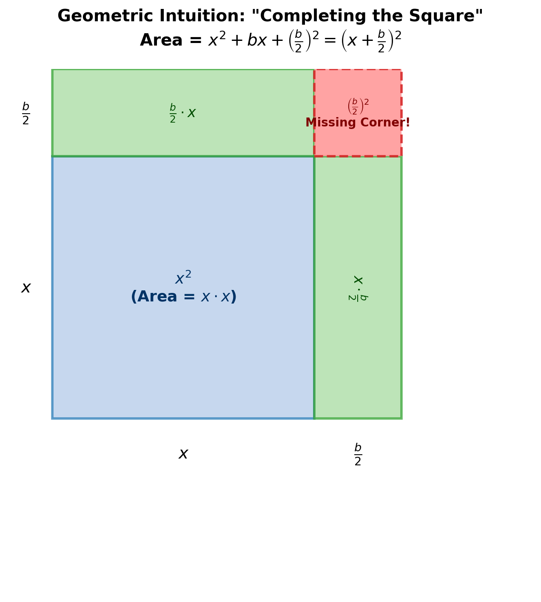
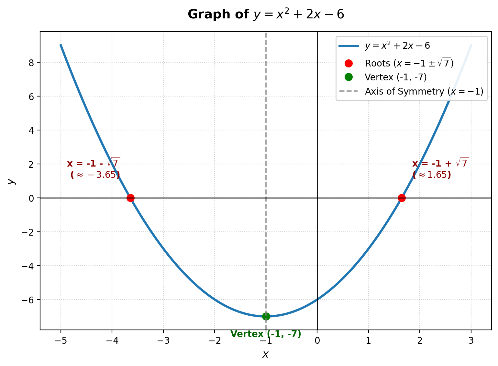

# Solving Quadratic Equations by Completing the Square
*A Complete, Step-by-Step Beginner's Manual*

---

## 1. Introduction

A **quadratic equation** is one of the most fundamental types of equations in algebra. It is an equation where the highest exponent of the variable (usually $x$) is $2$, such as $x^2 + 2x - 6 = 0$.

When learning algebra, students often start by solving quadratic equations using **factoring**. Factoring is quick and simple, but it has a major limitation: it only works when the solutions are clean integers or simple fractions. Many quadratic equations cannot be factored using simple numbers.

This is where **completing the square** becomes essential:
* **Works Every Time:** Completing the square is a universal method. It can solve **any** quadratic equation, regardless of whether the solutions are whole numbers, fractions, or irrational square roots.
* **Forms the Foundation of Algebra:** Completing the square is the exact mathematical technique used to derive the famous **Quadratic Formula** ($x = \frac{-b \pm \sqrt{b^2 - 4ac}}{2a}$).
* **Helps Graph Parabolas:** It allows us to rewrite quadratic functions in **vertex form** ($y = a(x - h)^2 + k$), making it easy to find the peak or lowest point (vertex) of a quadratic graph.

---

## 2. Prerequisite Knowledge

Before learning how to complete the square, let us review three simple algebraic concepts that build the foundation for this method.

### 2.1 The Golden Rule of Equations
In algebra, an equation is like a balanced scale. Whatever operation you perform on the left-hand side, you **must** perform the exact same operation on the right-hand side.
* If you add $5$ to the left side, you must add $5$ to the right side:
  $$x - 5 = 10 \implies x - 5 + 5 = 10 + 5 \implies x = 15$$

### 2.2 Expanding a Squared Binomial
A **binomial** is an algebraic expression containing two terms, such as $(x + d)$. When we multiply a binomial by itself (squaring it), we expand it using the distributive property:
$$(x + d)^2 = (x + d)(x + d) = x^2 + dx + dx + d^2 = x^2 + 2dx + d^2$$

Pay close attention to the terms in $x^2 + 2dx + d^2$:
1. The first term is $x^2$.
2. The middle coefficient is $2d$ (twice $d$).
3. The last constant term is $d^2$ (the square of $d$).

Notice that if you take half of the middle coefficient ($2d \div 2 = d$) and square it, you get the last constant term ($d^2$).

### 2.3 The Square Root Property
If you have an equation where a squared term equals a positive number $k$:
$$y^2 = k$$
You can find $y$ by taking the square root of both sides. However, remember that both a positive number and a negative number give a positive result when squared (for example, $(+3)^2 = 9$ and $(-3)^2 = 9$).

Therefore, always include both the positive and negative square root ($\pm$):
$$y = \pm \sqrt{k}$$

---

## 3. Important Definitions

To ensure complete clarity, let us define key mathematical terms in simple language:

* **Quadratic Equation:** An equation of degree $2$ that can be written in the standard form $ax^2 + bx + c = 0$, where $a \neq 0$.
* **Binomial:** An algebraic expression with exactly two terms joined by addition or subtraction, such as $(x + 3)$ or $(x - 5)$.
* **Trinomial:** An algebraic expression with exactly three terms, such as $x^2 + 6x + 9$.
* **Perfect Square Trinomial:** A three-term expression that can be factored into the square of a single binomial. For example, $x^2 + 6x + 9$ is a perfect square trinomial because it equals $(x + 3)^2$.
* **Completing the Square:** A process where we add a specific constant value to a quadratic expression $x^2 + bx$ to convert it into a perfect square trinomial $\left(x + \frac{b}{2}\right)^2$.
* **Coefficient:** A number multiplied by a variable. In $5x$, the coefficient is $5$.
* **Irrational Solution:** A number that cannot be written as a simple fraction, such as $-1 + \sqrt{7}$.

---

## 4. Main Concepts

### 4.1 Why Factoring Fails
Consider the quadratic equation from Professor Dave's tutorial:
$$x^2 + 2x - 6 = 0$$

If we try to solve this by factoring, we look for two integer factors of $-6$ that add up to the middle coefficient $+2$. Let us check all possible integer factor pairs of $-6$:
* $1 \times (-6) = -6 \implies 1 + (-6) = -5$
* $(-1) \times 6 = -6 \implies -1 + 6 = +5$
* $2 \times (-3) = -6 \implies 2 + (-3) = -1$
* $(-2) \times 3 = -6 \implies -2 + 3 = +1$

None of these pairs equal $+2$. Because no simple integer factors exist, this quadratic polynomial **cannot be factored over integers**. We need a more powerful tool.

### 4.2 The Intuition of Completing the Square
Let us rewrite the equation by moving the constant term $-6$ to the right side by adding $6$ to both sides:
$$x^2 + 2x = 6$$

Now look at the left side: $x^2 + 2x$. It is almost a perfect square trinomial! 
Recall from Section 2.2 that a perfect square trinomial looks like:
$$x^2 + 2dx + d^2 = (x + d)^2$$

Here, our middle term coefficient is $2$, which means $2d = 2$, so $d = 1$.
If we add $d^2 = 1^2 = 1$ to $x^2 + 2x$, we get:
$$x^2 + 2x + 1$$
This expression is a perfect square! It equals $(x + 1)^2$.

By adding $1$ to **both** sides of our equation:
$$x^2 + 2x + 1 = 6 + 1$$
$$(x + 1)^2 = 7$$

We have transformed an unsolvable factoring problem into a simple square root problem!

### 4.3 The Magic Formula for the Added Term
How do we know what number to add to $x^2 + bx$?
1. Take the coefficient of $x$, which is $b$.
2. Divide it by $2$: $\frac{b}{2}$.
3. Square the result: $\left(\frac{b}{2}\right)^2$.

$$\text{Magic Constant to Add} = \left(\frac{b}{2}\right)^2$$

When you add $\left(\frac{b}{2}\right)^2$ to $x^2 + bx$, the expression factors cleanly into:
$$x^2 + bx + \left(\frac{b}{2}\right)^2 = \left(x + \frac{b}{2}\right)^2$$

---

## 5. Formulas and Rules

### 5.1 General Identity
$$x^2 + bx + \left(\frac{b}{2}\right)^2 = \left(x + \frac{b}{2}\right)^2$$

### 5.2 Complete Step-by-Step Algorithm for $ax^2 + bx + c = 0$

When solving any quadratic equation $ax^2 + bx + c = 0$, follow these 7 systematic steps:

1. **Move the Constant Term:** Move $c$ to the right side of the equation so that only variable terms remain on the left.
   $$ax^2 + bx = -c$$

2. **Ensure Leading Coefficient is 1:** If $a \neq 1$, divide every single term in the equation by $a$:
   $$x^2 + \left(\frac{b}{a}\right)x = -\frac{c}{a}$$

3. **Calculate $\left(\frac{b}{2}\right)^2$:** Identify the coefficient of $x$ (let us call it $B$). Divide $B$ by $2$, and square it to find the magic constant:
   $$\text{Constant} = \left(\frac{B}{2}\right)^2$$

4. **Add to Both Sides:** Add $\left(\frac{B}{2}\right)^2$ to **both** the left-hand side and right-hand side of the equation.

5. **Rewrite as a Squared Binomial:** Factor the left side into:
   $$\left(x + \frac{B}{2}\right)^2 = \text{Right Side}$$

6. **Take the Square Root:** Take the square root of both sides, placing a $\pm$ sign on the right side:
   $$x + \frac{B}{2} = \pm \sqrt{\text{Right Side}}$$

7. **Isolate $x$:** Subtract $\frac{B}{2}$ from both sides to find the solutions.

---

## 6. Step-by-Step Examples

### Example 1 (Easy: $a = 1$, Even $b$, Integer Solutions)
**Problem:** Solve $x^2 + 6x - 7 = 0$ by completing the square.

* **Step 1 (Move constant):** Add $7$ to both sides.
  $$x^2 + 6x = 7$$

* **Step 2 (Check leading coefficient):** The coefficient of $x^2$ is already $1$.

* **Step 3 (Calculate magic term):** The coefficient of $x$ is $b = 6$.
  $$\frac{b}{2} = \frac{6}{2} = 3 \implies 3^2 = 9$$

* **Step 4 (Add to both sides):** Add $9$ to both sides of the equation.
  $$x^2 + 6x + 9 = 7 + 9$$
  $$x^2 + 6x + 9 = 16$$

* **Step 5 (Factor left side):** Rewrite the left side as a squared binomial $(x + 3)^2$.
  $$(x + 3)^2 = 16$$

* **Step 6 (Square root both sides):**
  $$x + 3 = \pm \sqrt{16}$$
  $$x + 3 = \pm 4$$

* **Step 7 (Solve for $x$):**
  * Solution 1: $x + 3 = 4 \implies x = 4 - 3 = 1$
  * Solution 2: $x + 3 = -4 \implies x = -4 - 3 = -7$

**Final Answer:** $x = 1$ or $x = -7$

---

### Example 2 (Medium: From Video Tutorial — Square Root / Irrational Solutions)
**Problem:** Solve $x^2 + 2x - 6 = 0$ by completing the square.

* **Step 1 (Move constant):** Add $6$ to both sides.
  $$x^2 + 2x = 6$$

* **Step 2 (Check leading coefficient):** The coefficient of $x^2$ is $1$.

* **Step 3 (Calculate magic term):** The coefficient of $x$ is $b = 2$.
  $$\frac{b}{2} = \frac{2}{2} = 1 \implies 1^2 = 1$$

* **Step 4 (Add to both sides):** Add $1$ to both sides.
  $$x^2 + 2x + 1 = 6 + 1$$
  $$x^2 + 2x + 1 = 7$$

* **Step 5 (Factor left side):**
  $$(x + 1)^2 = 7$$

* **Step 6 (Square root both sides):**
  $$x + 1 = \pm \sqrt{7}$$

* **Step 7 (Solve for $x$):** Subtract $1$ from both sides.
  $$x = -1 \pm \sqrt{7}$$

**Final Answer:** 
* Exact form: $x = -1 + \sqrt{7}$ and $x = -1 - \sqrt{7}$
* Decimal approximation: $x \approx 1.65$ and $x \approx -3.65$

---

### Example 3 (Challenging: Odd Coefficient $b$ Leading to Fractions)
**Problem:** Solve $x^2 + 5x + 3 = 0$ by completing the square.

* **Step 1 (Move constant):** Subtract $3$ from both sides.
  $$x^2 + 5x = -3$$

* **Step 2 (Check leading coefficient):** Coefficient of $x^2$ is $1$.

* **Step 3 (Calculate magic term):** The coefficient of $x$ is $b = 5$.
  $$\frac{b}{2} = \frac{5}{2} \implies \left(\frac{5}{2}\right)^2 = \frac{25}{4}$$

* **Step 4 (Add to both sides):** Add $\frac{25}{4}$ to both sides. Convert $-3$ into a fraction with denominator $4$ ($-3 = -\frac{12}{4}$):
  $$x^2 + 5x + \frac{25}{4} = -\frac{12}{4} + \frac{25}{4}$$
  $$x^2 + 5x + \frac{25}{4} = \frac{13}{4}$$

* **Step 5 (Factor left side):**
  $$\left(x + \frac{5}{2}\right)^2 = \frac{13}{4}$$

* **Step 6 (Square root both sides):**
  $$x + \frac{5}{2} = \pm \sqrt{\frac{13}{4}} = \pm \frac{\sqrt{13}}{\sqrt{4}} = \pm \frac{\sqrt{13}}{2}$$

* **Step 7 (Solve for $x$):** Subtract $\frac{5}{2}$ from both sides.
  $$x = -\frac{5}{2} \pm \frac{\sqrt{13}}{2} = \frac{-5 \pm \sqrt{13}}{2}$$

**Final Answer:** $x = \frac{-5 + \sqrt{13}}{2}$ or $x = \frac{-5 - \sqrt{13}}{2}$

---

### Example 4 (Challenging: Leading Coefficient $a > 1$)
**Problem:** Solve $2x^2 - 8x - 10 = 0$ by completing the square.

* **Step 1 (Move constant):** Add $10$ to both sides.
  $$2x^2 - 8x = 10$$

* **Step 2 (Divide by $a$):** Here $a = 2$. Divide every term by $2$.
  $$\frac{2x^2}{2} - \frac{8x}{2} = \frac{10}{2}$$
  $$x^2 - 4x = 5$$

* **Step 3 (Calculate magic term):** Middle coefficient $b = -4$.
  $$\frac{-4}{2} = -2 \implies (-2)^2 = 4$$

* **Step 4 (Add to both sides):** Add $4$ to both sides.
  $$x^2 - 4x + 4 = 5 + 4$$
  $$x^2 - 4x + 4 = 9$$

* **Step 5 (Factor left side):** Since $b/2 = -2$, the binomial is $(x - 2)^2$.
  $$(x - 2)^2 = 9$$

* **Step 6 (Square root both sides):**
  $$x - 2 = \pm \sqrt{9} = \pm 3$$

* **Step 7 (Solve for $x$):**
  * $x = 2 + 3 = 5$
  * $x = 2 - 3 = -1$

**Final Answer:** $x = 5$ or $x = -1$

---

## 7. Visual Explanations

### 7.1 Geometric Visualization: Why is it called "Completing the Square"?
The name **Completing the Square** comes directly from geometry!

Suppose you have an algebraic expression $x^2 + bx$:
1. $x^2$ represents the area of a large square with side length $x$.
2. $bx$ can be split into two equal rectangles, each with width $\frac{b}{2}$ and length $x$.

If you place the large square $x^2$ in the bottom left, one rectangle $\left(\frac{b}{2} \cdot x\right)$ on top, and one rectangle $\left(x \cdot \frac{b}{2}\right)$ on the right side, you form a larger shape. However, there is a **missing corner piece** in the top-right corner!

To complete the physical big square of side length $\left(x + \frac{b}{2}\right)$, you must add the missing corner piece. The area of that missing corner piece is precisely:
$$\text{Corner Area} = \frac{b}{2} \times \frac{b}{2} = \left(\frac{b}{2}\right)^2$$

When you add this corner piece, the entire shape becomes a complete square with total area $\left(x + \frac{b}{2}\right)^2$.

---

### 7.2 Graphical Interpretation of Quadratic Solutions
When we solve $x^2 + 2x - 6 = 0$, we are finding the **$x$-intercepts** (roots) of the parabola $y = x^2 + 2x - 6$.

Key observations from the graph above:
* **Vertex:** Completing the square rewrites $y = x^2 + 2x - 6$ into vertex form $y = (x + 1)^2 - 7$. The lowest point (vertex) is at $(-1, -7)$.
* **Axis of Symmetry:** The parabola is symmetric around the vertical line $x = -1$.
* **Roots ($x$-intercepts):** The graph crosses the $x$-axis at $x = -1 - \sqrt{7} \approx -3.65$ and $x = -1 + \sqrt{7} \approx 1.65$.

---

## 8. Common Mistakes to Avoid

Here are five common mistakes students make when completing the square, along with explanations of how to avoid them.

| Common Mistake | Incorrect Approach | Correct Approach | Why It Matters |
| :--- | :--- | :--- | :--- |
| **1. Forgetting to add to BOTH sides** | Adds $\left(\frac{b}{2}\right)^2$ only to the left side: $x^2 + 6x + 9 = 7$. | Adds $9$ to both sides: $x^2 + 6x + 9 = 7 + 9 = 16$. | Adding to only one side violates the golden rule of equations. |
| **2. Forgetting the $\pm$ sign** | Write $(x+1)^2 = 7 \implies x+1 = \sqrt{7}$. | Write $(x+1)^2 = 7 \implies x+1 = \pm \sqrt{7}$. | Omitting $\pm$ causes you to lose half of your solutions. |
| **3. Not dividing by $a$ first** | For $2x^2 + 8x = 10$, taking $(8/2)^2 = 16$ directly. | Divide by $2$ first ($x^2 + 4x = 5$), then take $(4/2)^2 = 4$. | $2x^2 + 8x + 16$ cannot be factored into $(x+d)^2$ because $a=2 \neq 1$. |
| **4. Sign confusion with negative $b$** | For $x^2 - 4x = 5$, writing $(x + 2)^2 = 9$. | Write $(x - 2)^2 = 9$, because $\frac{b}{2} = -2$. | The sign inside the binomial $(x + \frac{b}{2})$ always matches the sign of $b$. |
| **5. Squaring errors with fractions** | Squaring $\frac{5}{2}$ to get $\frac{25}{2}$ or $\frac{10}{4}$. | $\left(\frac{5}{2}\right)^2 = \frac{5^2}{2^2} = \frac{25}{4}$. | Remember to square both the numerator and the denominator. |

---

## 9. Practice Problems

Test your understanding by solving these 6 practice problems. They are arranged from easy to challenging.

* **Problem 1 (Easy):** Solve $x^2 + 4x - 12 = 0$ by completing the square.
* **Problem 2 (Easy):** Solve $x^2 - 10x + 21 = 0$ by completing the square.
* **Problem 3 (Medium):** Solve $x^2 + 4x - 7 = 0$ by completing the square.
* **Problem 4 (Medium):** Solve $x^2 - 3x - 1 = 0$ by completing the square.
* **Problem 5 (Challenging):** Solve $3x^2 + 12x - 15 = 0$ by completing the square.
* **Problem 6 (Challenging):** Solve $2x^2 - 6x - 8 = 0$ by completing the square.

---

## 10. Solutions with Step-by-Step Reasoning

### Solution to Problem 1
**Equation:** $x^2 + 4x - 12 = 0$
1. Move constant: $x^2 + 4x = 12$
2. Leading coefficient is $1$.
3. Calculate added term: $b = 4 \implies \frac{4}{2} = 2 \implies 2^2 = 4$.
4. Add $4$ to both sides: $x^2 + 4x + 4 = 12 + 4 \implies x^2 + 4x + 4 = 16$.
5. Factor left side: $(x + 2)^2 = 16$.
6. Take square root: $x + 2 = \pm 4$.
7. Solve for $x$:
   * $x = 4 - 2 = 2$
   * $x = -4 - 2 = -6$

**Answers:** $x = 2$ or $x = -6$

---

### Solution to Problem 2
**Equation:** $x^2 - 10x + 21 = 0$
1. Move constant: $x^2 - 10x = -21$
2. Leading coefficient is $1$.
3. Calculate added term: $b = -10 \implies \frac{-10}{2} = -5 \implies (-5)^2 = 25$.
4. Add $25$ to both sides: $x^2 - 10x + 25 = -21 + 25 \implies x^2 - 10x + 25 = 4$.
5. Factor left side: $(x - 5)^2 = 4$.
6. Take square root: $x - 5 = \pm 2$.
7. Solve for $x$:
   * $x = 5 + 2 = 7$
   * $x = 5 - 2 = 3$

**Answers:** $x = 7$ or $x = 3$

---

### Solution to Problem 3
**Equation:** $x^2 + 4x - 7 = 0$
1. Move constant: $x^2 + 4x = 7$
2. Leading coefficient is $1$.
3. Calculate added term: $b = 4 \implies \frac{4}{2} = 2 \implies 2^2 = 4$.
4. Add $4$ to both sides: $x^2 + 4x + 4 = 7 + 4 \implies x^2 + 4x + 4 = 11$.
5. Factor left side: $(x + 2)^2 = 11$.
6. Take square root: $x + 2 = \pm \sqrt{11}$.
7. Solve for $x$: $x = -2 \pm \sqrt{11}$.

**Answers:** $x = -2 + \sqrt{11}$ or $x = -2 - \sqrt{11}$

---

### Solution to Problem 4
**Equation:** $x^2 - 3x - 1 = 0$
1. Move constant: $x^2 - 3x = 1$
2. Leading coefficient is $1$.
3. Calculate added term: $b = -3 \implies \frac{b}{2} = -\frac{3}{2} \implies \left(-\frac{3}{2}\right)^2 = \frac{9}{4}$.
4. Add $\frac{9}{4}$ to both sides:
   $$x^2 - 3x + \frac{9}{4} = 1 + \frac{9}{4} = \frac{4}{4} + \frac{9}{4} = \frac{13}{4}$$
5. Factor left side: $\left(x - \frac{3}{2}\right)^2 = \frac{13}{4}$.
6. Take square root: $x - \frac{3}{2} = \pm \frac{\sqrt{13}}{2}$.
7. Solve for $x$: $x = \frac{3 \pm \sqrt{13}}{2}$.

**Answers:** $x = \frac{3 + \sqrt{13}}{2}$ or $x = \frac{3 - \sqrt{13}}{2}$

---

### Solution to Problem 5
**Equation:** $3x^2 + 12x - 15 = 0$
1. Move constant: $3x^2 + 12x = 15$
2. Divide by $a = 3$: $\frac{3x^2}{3} + \frac{12x}{3} = \frac{15}{3} \implies x^2 + 4x = 5$.
3. Calculate added term: $b = 4 \implies \frac{4}{2} = 2 \implies 2^2 = 4$.
4. Add $4$ to both sides: $x^2 + 4x + 4 = 5 + 4 \implies (x + 2)^2 = 9$.
5. Take square root: $x + 2 = \pm 3$.
6. Solve for $x$:
   * $x = 3 - 2 = 1$
   * $x = -3 - 2 = -5$

**Answers:** $x = 1$ or $x = -5$

---

### Solution to Problem 6
**Equation:** $2x^2 - 6x - 8 = 0$
1. Move constant: $2x^2 - 6x = 8$
2. Divide by $a = 2$: $x^2 - 3x = 4$.
3. Calculate added term: $b = -3 \implies \left(-\frac{3}{2}\right)^2 = \frac{9}{4}$.
4. Add $\frac{9}{4}$ to both sides:
   $$x^2 - 3x + \frac{9}{4} = 4 + \frac{9}{4} = \frac{16}{4} + \frac{9}{4} = \frac{25}{4}$$
5. Factor left side: $\left(x - \frac{3}{2}\right)^2 = \frac{25}{4}$.
6. Take square root: $x - \frac{3}{2} = \pm \sqrt{\frac{25}{4}} = \pm \frac{5}{2}$.
7. Solve for $x$:
   * $x = \frac{3}{2} + \frac{5}{2} = \frac{8}{2} = 4$
   * $x = \frac{3}{2} - \frac{5}{2} = -\frac{2}{2} = -1$

**Answers:** $x = 4$ or $x = -1$

---

## 11. Summary

Completing the square is a reliable, universal technique for solving quadratic equations. Whenever factoring fails or feels difficult, follow this core process:

1. Move the constant number to the right-hand side.
2. Make sure the coefficient of $x^2$ is $1$ (divide if necessary).
3. Find the key term to add by taking half of the $x$-coefficient and squaring it: $\left(\frac{b}{2}\right)^2$.
4. Add this value to **both sides** of the equation.
5. Factor the left side into a squared binomial $\left(x + \frac{b}{2}\right)^2$.
6. Take the square root of both sides (remembering $\pm$) and solve for $x$.

Mastering this method unlocks deeper algebraic understanding, allowing you to solve complex equations, graph quadratic curves, and easily derive the quadratic formula!

---

## 12. Key Things to Remember

* **Universal Formula:** $x^2 + bx + \left(\frac{b}{2}\right)^2 = \left(x + \frac{b}{2}\right)^2$
* **The Golden Rule:** Always add $\left(\frac{b}{2}\right)^2$ to **BOTH** sides of the equation.
* **Leading Coefficient Check:** Always divide the equation by $a$ first if $a \neq 1$.
* **Plus-Minus Symbol ($\pm$):** Always include $\pm$ when taking the square root of both sides.
* **Sign Rule:** The sign inside the binomial $\left(x + \frac{b}{2}\right)$ matches the sign of $b$.
* **Odd Coefficients:** When $b$ is odd, use fractions: $\left(\frac{b}{2}\right)^2 = \frac{b^2}{4}$. Do not convert to decimals prematurely.
