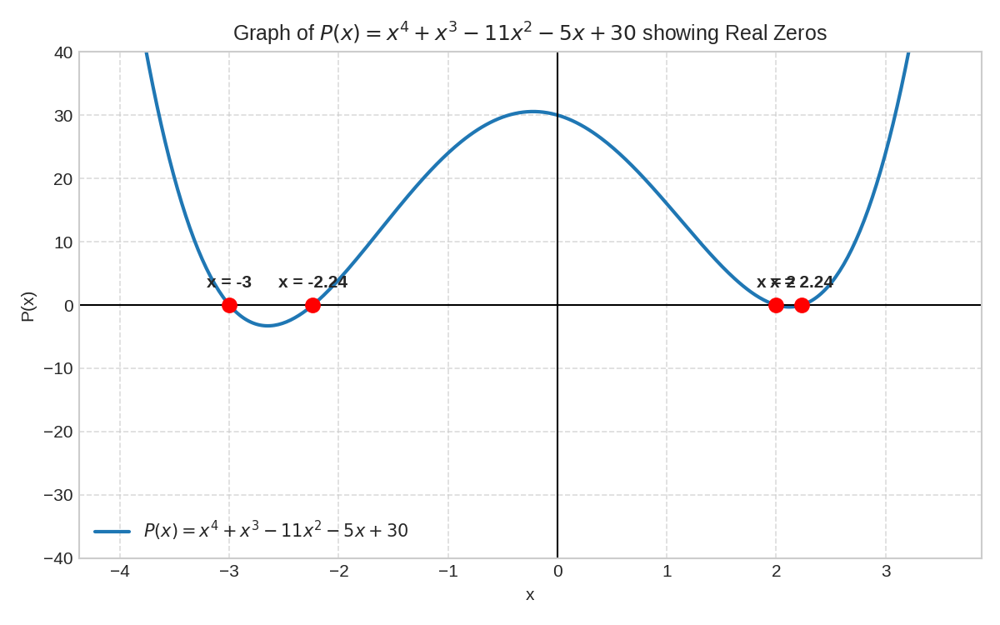
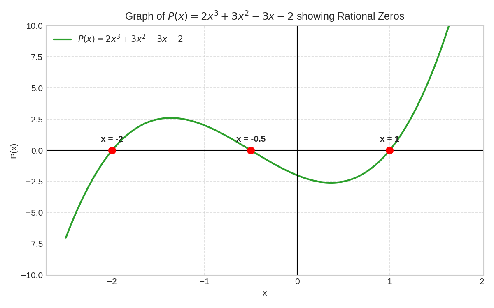

# Solving Higher-Degree Polynomials by Synthetic Division and the Rational Roots Test

*A Complete, Step-by-Step, Beginner-Friendly Guide*

---

## 1. Introduction

When you first learned algebra, you learned how to solve **linear equations** like $2x + 4 = 0$ and **quadratic equations** like $x^2 - 5x + 6 = 0$. Linear equations have $x$ raised to the power of $1$, and quadratic equations have $x$ raised to the power of $2$.

However, in many real-world problems in science, engineering, and business, we meet **higher-degree polynomial equations**. These are equations where $x$ is raised to powers like $3$ (cubic), $4$ (quartic), or even higher. For example:

$$x^4 + x^3 - 11x^2 - 5x + 30 = 0$$

Solving these equations directly by simple algebra can be very difficult. Unlike quadratic equations, which have the famous quadratic formula $x = \frac{-b \pm \sqrt{b^2 - 4ac}}{2a}$, higher-degree equations do not have easy formulas.

In this tutorial, you will learn two powerful tools that work together to solve higher-degree polynomial equations easily:
1. **The Rational Roots Test**: A method to find a list of "smart guesses" (candidate roots) to test.
2. **Synthetic Division**: A fast, shortcut method to divide polynomials and check if a candidate root is correct.

By combining these two methods, you can break down complicated higher-degree polynomials into simple quadratic equations that you already know how to solve! [1, 12, 14]

---

## 2. Prerequisite Knowledge

Before we begin, let us quickly review the basic ideas you need to understand this topic.

### 2.1 Polynomial in Standard Form
A **polynomial** is an algebraic expression made of terms added or subtracted together. Each term has a coefficient (a number) multiplied by $x$ raised to a non-negative integer power [12].

A polynomial in **standard form** is written with the powers of $x$ going from highest to lowest:

$$P(x) = a_n x^n + a_{n-1} x^{n-1} + \dots + a_1 x + a_0$$

* **Degree ($n$)**: The highest exponent of $x$ in the polynomial.
* **Leading Coefficient ($a_n$)**: The number in front of $x^n$ (the term with the highest power).
* **Constant Term ($a_0$)**: The number at the end without any $x$ variable.

#### Example:
For the polynomial $P(x) = 2x^3 + 3x^2 - 3x - 2$:
* The **degree** is $3$ (it is a cubic polynomial).
* The **leading coefficient** $a_n$ is $2$.
* The **constant term** $a_0$ is $-2$. [14, 15]

---

### 2.2 Zeros, Roots, and Factors
When studying polynomials, three words are closely related:

1. **Zero (or Root)**: A number $c$ is a zero of a polynomial $P(x)$ if substituting $x = c$ makes the polynomial equal to zero:
   $$P(c) = 0$$
2. **Solution**: The value $x = c$ that satisfies the equation $P(x) = 0$.
3. **Factor**: An expression $(x - c)$ that divides $P(x)$ completely with **no remainder** [12, 13].

#### The Factor Theorem
> **Rule**: A number $c$ is a root of $P(x)$ if and only if $(x - c)$ is a factor of $P(x)$ [12, 13].

* **Example**: If $x = 2$ is a root, then $(x - 2)$ is a factor. If $x = -3$ is a root, then $(x - (-3)) = (x + 3)$ is a factor [12, 13, 14].

---

### 2.3 Polynomial Long Division vs. Synthetic Division
Normally, to divide a polynomial $P(x)$ by $(x - c)$, you use polynomial long division. However, polynomial long division takes a lot of time and involves writing variables over and over again [12].

**Synthetic division** is a shortcut method that only uses the **coefficients** (numbers) of the polynomial. It allows you to perform division in just a few quick steps of multiplication and addition! [12]

---

## 3. Important Definitions

Here are simple definitions for the key terms used in this tutorial:

* **Degree of a Polynomial**: The highest power of the variable $x$ in the expression.
  * Degree $1$: Linear (e.g., $x - 2$)
  * Degree $2$: Quadratic (e.g., $x^2 - 5$)
  * Degree $3$: Cubic (e.g., $x^3 + 3x^2 - 5x - 15$)
  * Degree $4$: Quartic (e.g., $x^4 + x^3 - 11x^2 - 5x + 30$) [12, 13]
* **Leading Coefficient**: The coefficient of the term with the highest power of $x$ [14, 15].
* **Constant Term**: The number term that has no variable attached to it [14].
* **Rational Number**: A number that can be written as a fraction $\frac{p}{q}$, where $p$ and $q$ are integers and $q \neq 0$ (for example, $3$, $-\frac{1}{2}$, $0.75$).
* **Synthetic Division**: A shorthand method of dividing a polynomial by a linear binomial of the form $(x - c)$ using only coefficients [12].
* **Remainder**: The number left over after division. If the remainder is $0$, the division is exact, meaning $(x - c)$ is a factor [13].
* **Depressed Polynomial**: The simplified polynomial quotient that remains after dividing out a factor. Its degree is always $1$ less than the original polynomial [13].

---

## 4. Main Concepts

To solve a higher-degree polynomial equation $P(x) = 0$, we follow a logical three-step strategy:

```
[ Step 1: Rational Roots Test ]
            │
            ▼
   List candidate roots (± p/q)
            │
            ▼
[ Step 2: Synthetic Division ]
            │
            ▼
   Test a candidate root (c)
            │
      ┌─────┴─────┐
   Remainder = 0?
      │           │
     YES          NO ───► Try another candidate
      │
      ▼
Root found! (x - c) is a factor.
Degree decreases by 1 (Depressed Polynomial).
            │
            ▼
[ Step 3: Repeat or Solve Quadratic ]
   Repeat synthetic division until you reach degree 2,
   then solve using factoring or the quadratic formula!
```

---

### Concept 1: The Rational Roots Test (Finding Candidates)
When given a polynomial like $2x^3 + 3x^2 - 3x - 2 = 0$, we cannot test every number in the world. We need a short list of likely answers [14].

The **Rational Roots Test** guarantees that if a polynomial has any **rational** roots $\frac{p}{q}$ (in simplest form), then:
* $p$ must be a factor of the **constant term** $a_0$.
* $q$ must be a factor of the **leading coefficient** $a_n$ [14, 15].

Therefore, all potential rational roots are given by:

$$\text{Possible Rational Roots} = \pm \frac{\text{Factors of Constant Term } a_0}{\text{Factors of Leading Coefficient } a_n}$$

*Note*: The test gives us a list of **possible** roots. Some candidates might not be actual roots, or the equation might have irrational/complex roots. But this test narrows down infinite possibilities to a small, manageable list [14, 15]!

---

### Concept 2: Synthetic Division Algorithm (Testing Candidates)
Once we have a candidate root $c$, we test it using **synthetic division** [12, 14, 15].

#### The Synthetic Division Setup:
1. Draw a horizontal line and a vertical line forming an inverted step box.
2. Write the candidate root $c$ on the left.
3. Write the coefficients of the polynomial in order from highest degree to lowest degree across the top row. (If any degree of $x$ is missing, write $0$ as a placeholder!) [12, 15]

```
  c │  a_n    a_{n-1}    a_{n-2}   ...   a_0
    │         (multiply) (multiply)
────┴────────────────────────────────────────
       a_n      ...        ...          Remainder
```

#### The 4-Step Synthetic Division Loop:
1. **Bring down** the first coefficient directly to the bottom row [12, 15].
2. **Multiply** the value in the bottom row by $c$ [12, 15].
3. **Write** the result in the middle row under the next coefficient [12, 15].
4. **Add** the column numbers together and write the sum in the bottom row [12, 15].
5. **Repeat** this process until you reach the final column [12, 13, 15].

#### Interpreting the Result:
* The last number in the bottom row is the **Remainder** [13].
  * If **Remainder = 0**: $c$ is a true root! $(x - c)$ is a factor [12, 13].
  * If **Remainder $\neq$ 0**: $c$ is not a root [13].
* The other numbers in the bottom row are the coefficients of the **depressed polynomial** (which has degree $n - 1$) [13].

---

## 5. Formulas and Rules

Here is a reference table of the core formulas and rules used when solving polynomial equations:

| Tool / Theorem | Formula / Rule | Meaning & Usage |
| :--- | :--- | :--- |
| **Rational Roots Test** | $\pm \frac{\text{Factors of } a_0}{\text{Factors of } a_n}$ | Generates all candidate rational zeros $\frac{p}{q}$ [14, 15]. |
| **Factor Theorem** | $P(c) = 0 \iff (x - c) \text{ is a factor}$ | Connecting roots ($x = c$) with polynomial factors $(x - c)$ [12, 13]. |
| **Degree Reduction Rule** | $\text{Degree of Quotient} = \text{Degree of Original} - 1$ | Every successful division reduces the polynomial degree by 1 [13]. |
| **Quadratic Formula** | $x = \frac{-b \pm \sqrt{b^2 - 4ac}}{2a}$ | Used to solve the final remaining degree-2 polynomial [14]. |
| **Fundamental Theorem of Algebra** | A polynomial of degree $n$ has exactly $n$ complex roots (counting multiplicity). | A degree-4 polynomial will have 4 roots in total [12, 14]. |

---

## 6. Step-by-Step Examples

Let us go through two complete examples from the video tutorial, explained step by step [12, 13, 14, 15].

---

### Example 1: Solving a Quartic (Degree 4) Polynomial

**Problem**: Find all solutions to the degree-4 equation:
$$x^4 + x^3 - 11x^2 - 5x + 30 = 0$$

---

#### Step 1: Identify coefficients and test a candidate root
Suppose we want to test if $x = 2$ is a solution [12].
* Original polynomial coefficients: $1, 1, -11, -5, 30$.
* Candidate root: $c = 2$.

#### Step 2: Perform Synthetic Division with $c = 2$

Set up the synthetic division board [12]:

```
  2 │   1    1   -11    -5    30
    │        2     6   -10   -30
────┴─────────────────────────────
        1    3    -5   -15     0  ◄── Remainder is 0!
```

**Walkthrough of calculations**:
1. **Bring down** the first coefficient: $1$ [12].
2. **Multiply**: $2 \times 1 = 2$. Add to next column: $1 + 2 = 3$ [12].
3. **Multiply**: $2 \times 3 = 6$. Add to next column: $-11 + 6 = -5$ [12].
4. **Multiply**: $2 \times (-5) = -10$. Add to next column: $-5 + (-10) = -15$ [12].
5. **Multiply**: $2 \times (-15) = -30$. Add to final column: $30 + (-30) = 0$ [12, 13].

**Conclusion**:
* Since the remainder is **$0$**, $x = 2$ is a solution, and $(x - 2)$ is a factor [13].
* The remaining coefficients $(1, 3, -5, -15)$ form a **cubic polynomial** (degree $4 - 1 = 3$) [13]:

$$x^3 + 3x^2 - 5x - 15 = 0$$

Our polynomial is now partially factored as:
$$(x - 2)(x^3 + 3x^2 - 5x - 15) = 0$$ [13]

---

#### Step 3: Test another candidate root on the depressed cubic
Now we work with the new cubic polynomial $x^3 + 3x^2 - 5x - 15 = 0$.
Let us test if $x = -3$ is a solution [13].

* Cubic coefficients: $1, 3, -5, -15$.
* Candidate root: $c = -3$.

Set up synthetic division [13]:

```
 -3 │   1    3    -5   -15
    │       -3     0    15
────┴──────────────────────
        1    0    -5     0  ◄── Remainder is 0!
```

**Walkthrough of calculations**:
1. **Bring down**: $1$.
2. **Multiply**: $-3 \times 1 = -3$. Add: $3 + (-3) = 0$.
3. **Multiply**: $-3 \times 0 = 0$. Add: $-5 + 0 = -5$.
4. **Multiply**: $-3 \times (-5) = 15$. Add: $-15 + 15 = 0$ [13].

**Conclusion**:
* Since the remainder is **$0$**, $x = -3$ is a solution, and $(x + 3)$ is a factor [13, 14].
* The bottom row $(1, 0, -5)$ forms a **quadratic polynomial** (degree $3 - 1 = 2$) [13, 14]:

$$1x^2 + 0x - 5 = 0 \implies x^2 - 5 = 0$$ [14]

Our polynomial is now factored as:
$$(x - 2)(x + 3)(x^2 - 5) = 0$$ [14]

---

#### Step 4: Solve the remaining quadratic equation
We don't need synthetic division anymore because we have a simple quadratic equation [14]:

$$x^2 - 5 = 0$$
$$x^2 = 5$$
$$x = \pm \sqrt{5}$$ [14]

#### Final Answer:
The four solutions to $x^4 + x^3 - 11x^2 - 5x + 30 = 0$ are:

$$x = 2, \quad x = -3, \quad x = \sqrt{5}, \quad x = -\sqrt{5}$$ [14]

---

### Example 2: Using the Rational Roots Test and Solving a Cubic Polynomial

**Problem**: Solve the cubic equation:
$$2x^3 + 3x^2 - 3x - 2 = 0$$ [14]

In this problem, we are not given any roots to start with! We must use the **Rational Roots Test** to find candidates [14].

---

#### Step 1: Apply the Rational Roots Test
For $2x^3 + 3x^2 - 3x - 2 = 0$:
* **Constant term** $a_0 = -2$. Factors ($p$): $\pm 1, \pm 2$.
* **Leading coefficient** $a_n = 2$. Factors ($q$): $1, 2$. [14, 15]

Now, form all possible fractions $\pm \frac{p}{q}$ [15]:

* When $q = 1$: $\frac{\pm 1}{1} = \pm 1$, $\frac{\pm 2}{1} = \pm 2$
* When $q = 2$: $\frac{\pm 1}{2} = \pm \frac{1}{2}$, $\frac{\pm 2}{2} = \pm 1$ (already listed)

**List of Candidate Roots**:
$$\pm 1, \quad \pm 2, \quad \pm \frac{1}{2}$$

We have 6 potential rational roots to test [15].

---

#### Step 2: Test candidate $x = 1$ using Synthetic Division
Let us test $c = 1$ on coefficients $2, 3, -3, -2$ [15]:

```
  1 │   2    3    -3    -2
    │        2     5     2
────┴──────────────────────
        2    5     2     0  ◄── Remainder is 0!
```

**Walkthrough**:
1. Bring down $2$.
2. $1 \times 2 = 2 \implies 3 + 2 = 5$.
3. $1 \times 5 = 5 \implies -3 + 5 = 2$.
4. $1 \times 2 = 2 \implies -2 + 2 = 0$ [15].

**Conclusion**:
* $x = 1$ is a root! $(x - 1)$ is a factor [15].
* The depressed quadratic polynomial is $2x^2 + 5x + 2 = 0$ [15, 16].

---

#### Step 3: Solve the depressed quadratic equation
We solve $2x^2 + 5x + 2 = 0$ by factoring [16]:

Find two numbers that multiply to $2 \times 2 = 4$ and add to $5$. These numbers are $4$ and $1$.

$$2x^2 + 4x + x + 2 = 0$$
$$2x(x + 2) + 1(x + 2) = 0$$
$$(2x + 1)(x + 2) = 0$$ [16]

Set each factor to zero:
1. $2x + 1 = 0 \implies 2x = -1 \implies x = -\frac{1}{2}$
2. $x + 2 = 0 \implies x = -2$ [16]

#### Final Answer:
The three solutions to $2x^3 + 3x^2 - 3x - 2 = 0$ are:

$$x = 1, \quad x = -2, \quad x = -\frac{1}{2}$$ [16]

---

## 7. Visual Explanations

### Visual 1: Graphical Meaning of Roots / Zeros
A root (zero) of a polynomial equation $P(x) = 0$ represents the $x$-intercept where the graph of $y = P(x)$ crosses or touches the $x$-axis.

#### Graph for Example 1: $P(x) = x^4 + x^3 - 11x^2 - 5x + 30$
Below is the graph of the quartic polynomial. Notice how the curve crosses the $x$-axis at four points: $x = -3$, $x = -\sqrt{5} \approx -2.24$, $x = \sqrt{5} \approx 2.24$, and $x = 2$ [14].



#### Graph for Example 2: $P(x) = 2x^3 + 3x^2 - 3x - 2$
Below is the graph of the cubic polynomial. The curve crosses the $x$-axis at three rational points: $x = -2$, $x = -0.5$, and $x = 1$ [16].



---

### Visual 2: The Synthetic Division Diagram Anatomy

```
               [ Candidate Root ]
                       │
                       ▼
                 c │  a_n   a_{n-1}   a_{n-2}   a_0   ◄── [ Original Coefficients ]
                   │   │  ▲    │  ▲      │
                   │   │  │    │  │      │
                   │   │ [Multiply by c] │
                   │   ▼  │    ▼  │      ▼
               ────┴─────────────────────────────────
                      a_n     Sum       Sum   Remainder ◄── [ Bottom Row ]
                       │                        ▲
                       └────────────────────────┘
                    [ Coefficients of Depressed    [ Must be 0 for c
                      Polynomial (Degree n-1) ]      to be a Root! ]
```

---

## 8. Common Mistakes

Here are common errors students make and how to avoid them:

### Mistake 1: Forgetting Zero Placeholders for Missing Terms
* **Incorrect**: To divide $P(x) = x^3 - 7x + 6$ using synthetic division, a student writes coefficients: `1, -7, 6`.
* **Why it's wrong**: The $x^2$ term is missing! The polynomial is $1x^3 + 0x^2 - 7x + 6$.
* **Correct Approach**: Always insert `0` for any missing power of $x$. The correct coefficients are `1, 0, -7, 6`.

---

### Mistake 2: Sign Confusion Between Root $c$ and Factor $(x - c)$
* **Incorrect**: If testing if $(x + 3)$ is a factor, writing $c = +3$ in the synthetic division box.
* **Why it's wrong**: The factor form is $(x - c)$. If the factor is $(x + 3) = (x - (-3))$, then $c = -3$.
* **Correct Rule**:
  * Root $x = 3 \implies c = 3$.
  * Factor $(x - 2) \implies c = 2$.
  * Factor $(x + 3) \implies c = -3$ [12, 13].

---

### Mistake 3: Confusing Candidates with Guaranteed Solutions
* **Incorrect**: Assuming that all numbers generated by the Rational Roots Test $\pm \frac{p}{q}$ are solutions to the equation.
* **Why it's wrong**: The Rational Roots Test only gives a list of **possibilities**. You must test them using synthetic division or polynomial evaluation [14, 15].

---

### Mistake 4: Forgetting $\pm$ when taking Square Roots
* **Incorrect**: Solving $x^2 = 5 \implies x = \sqrt{5}$.
* **Why it's wrong**: Taking the square root of both sides gives both a positive and a negative solution.
* **Correct Approach**: $x^2 = 5 \implies x = \pm \sqrt{5}$ [14].

---

## 9. Practice Problems

Test your understanding with these practice problems arranged from easy to challenging!

### Problem 1 (Easy)
Use synthetic division to test if $x = 1$ is a solution to the cubic equation:
$$x^3 - 6x^2 + 11x - 6 = 0$$
If it is a root, find the remaining solutions.

---

### Problem 2 (Medium)
Use the Rational Roots Test and synthetic division to find all real solutions to:
$$2x^3 - x^2 - 5x - 2 = 0$$

---

### Problem 3 (Challenging)
Find all four solutions to the quartic polynomial equation:
$$x^4 - 2x^3 - 7x^2 + 8x + 12 = 0$$

---

## 10. Solutions

### Solution to Problem 1 (Easy)

**Equation**: $x^3 - 6x^2 + 11x - 6 = 0$

1. **Synthetic Division with $c = 1$**:
   Coefficients: $1, -6, 11, -6$.

```
  1 │   1   -6   11   -6
    │        1   -5    6
────┴────────────────────
        1   -5    6    0  ◄── Remainder = 0
```

   Since the remainder is $0$, $x = 1$ is a solution!

2. **Depressed Quadratic Equation**:
   $$x^2 - 5x + 6 = 0$$

3. **Solve Quadratic by Factoring**:
   $$(x - 2)(x - 3) = 0 \implies x = 2, \quad x = 3$$

**Final Roots**:
$$x = 1, \quad x = 2, \quad x = 3$$

---

### Solution to Problem 2 (Medium)

**Equation**: $2x^3 - x^2 - 5x - 2 = 0$

1. **Rational Roots Test**:
   * Constant term $a_0 = -2 \implies p \in \{\pm 1, \pm 2\}$.
   * Leading coefficient $a_n = 2 \implies q \in \{1, 2\}$.
   * Candidates $\pm \frac{p}{q}$: $\pm 1, \pm 2, \pm \frac{1}{2}$.

2. **Test candidate $c = 2$**:

```
  2 │   2   -1   -5   -2
    │        4    6    2
────┴────────────────────
        2    3    1    0  ◄── Remainder = 0
```

   Since remainder is $0$, $x = 2$ is a solution!

3. **Depressed Quadratic Equation**:
   $$2x^2 + 3x + 1 = 0$$

4. **Factor the Quadratic**:
   $$(2x + 1)(x + 1) = 0$$
   * $2x + 1 = 0 \implies x = -\frac{1}{2}$
   * $x + 1 = 0 \implies x = -1$

**Final Roots**:
$$x = 2, \quad x = -1, \quad x = -\frac{1}{2}$$

---

### Solution to Problem 3 (Challenging)

**Equation**: $x^4 - 2x^3 - 7x^2 + 8x + 12 = 0$

1. **Rational Roots Test**:
   * $a_0 = 12 \implies p \in \{\pm 1, \pm 2, \pm 3, \pm 4, \pm 6, \pm 12\}$.
   * $a_n = 1 \implies q = 1$.
   * Candidates: $\pm 1, \pm 2, \pm 3, \pm 4, \pm 6, \pm 12$.

2. **Test $c = -1$**:

```
 -1 │   1   -2   -7    8   12
    │       -1    3    4  -12
────┴─────────────────────────
        1   -3   -4   12    0  ◄── Remainder = 0
```

   So $x = -1$ is a solution! The depressed cubic is $x^3 - 3x^2 - 4x + 12 = 0$.

3. **Test $c = 2$ on depressed cubic**:

```
  2 │   1   -3   -4   12
    │        2   -2  -12
────┴────────────────────
        1   -1   -6    0  ◄── Remainder = 0
```

   So $x = 2$ is a solution! The depressed quadratic is $x^2 - x - 6 = 0$.

4. **Factor the quadratic**:
   $$x^2 - x - 6 = 0 \implies (x - 3)(x + 2) = 0$$
   $$x = 3, \quad x = -2$$

**Final Roots**:
$$x = -1, \quad x = 2, \quad x = 3, \quad x = -2$$

---

## 11. Summary

In this tutorial, we learned how to solve higher-degree polynomial equations step by step:

1. **Rational Roots Test**: Finds candidate rational roots $\pm \frac{\text{Factors of } a_0}{\text{Factors of } a_n}$ to narrow down possibilities [14, 15].
2. **Synthetic Division**: Rapidly tests candidate roots using only coefficients. If the remainder is $0$, the candidate is a root and $(x - c)$ is a factor [12, 13].
3. **Degree Reduction**: Each successful division produces a depressed polynomial with a degree reduced by $1$ [13].
4. **Solving the Remainder**: Once reduced to a quadratic (degree 2), we can factor or use the quadratic formula to find all remaining solutions [14, 16].

---

## 12. Key Things to Remember

* $\checkmark$ **Rational Roots Formula**: $\pm \frac{\text{Factors of constant term } a_0}{\text{Factors of leading coefficient } a_n}$ [14, 15].
* $\checkmark$ **Zero Placeholder**: Always include `0` for any missing power of $x$ in synthetic division!
* $\checkmark$ **Zero Remainder**: A candidate root $c$ is a solution **only** if the remainder at the end of synthetic division is $0$ [13].
* $\checkmark$ **Degree Rule**: A polynomial of degree $n$ has at most $n$ real solutions [12, 14].
* $\checkmark$ **Factor vs. Root Sign**: If $x = c$ is a root, the factor is $(x - c)$. If the factor is $(x + k)$, the root is $x = -k$ [12, 13].
