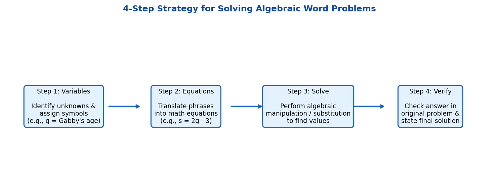
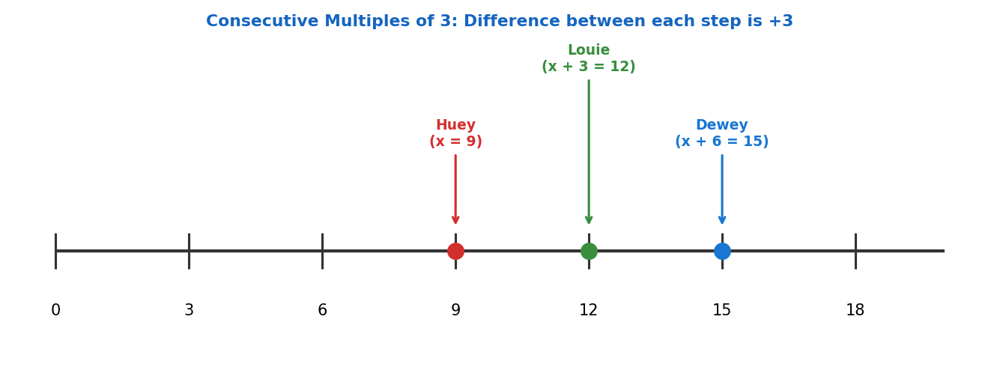
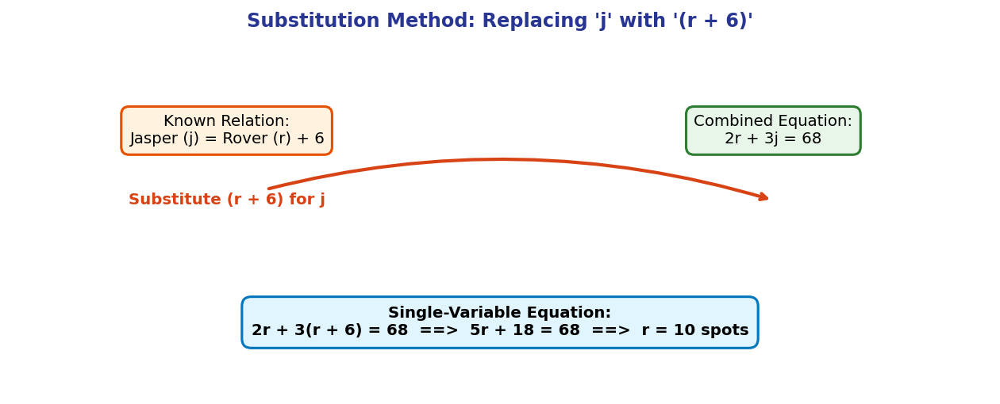

# Algebraic Word Problems: A Step-by-Step Beginner's Guide

---

## 1. Introduction

Mathematics is not just about calculating numbers. It is a powerful tool to solve real-world problems. **Algebraic word problems** take scenarios written in normal words—such as calculating someone's age or counting items—and translate them into mathematical statements.

By converting words into algebraic equations, we can find unknown values systematically without guessing. This manual will teach you how to analyze word problems, set up variables, form equations, and solve them step by step.

---

## 2. Prerequisite Knowledge

Before working with word problems, let us review three foundational algebra concepts.

### 2.1 What is a Variable?
A **variable** is a letter (like $x$, $y$, $g$, or $s$) that represents an unknown number or quantity. 
- Example: If we do not know Gabby's age yet, we can represent it with the letter $g$.

### 2.2 Algebraic Equations
An **equation** is a mathematical statement showing that two expressions are equal using an equals sign ($=$).
- Example: $s = 2g - 3$ means "The value of $s$ is equal to twice $g$ minus 3."

### 2.3 The Distributive Property
When a number is multiplied by a sum inside parentheses, you multiply that number by each term inside:
$$a(b + c) = ab + ac$$
- Example: $3(r + 6) = 3 \cdot r + 3 \cdot 6 = 3r + 18$.

---

## 3. Important Definitions

- **Variable**: A symbol, usually a letter, used to represent an unknown quantity (e.g., $x$, $r$, $j$).
- **Constant**: a fixed value that does not change (e.g., numbers like $3$, $6$, $36$).
- **Coefficient**: A number multiplied by a variable (e.g., in $3x$, the coefficient is $3$).
- **Sum**: The result of adding numbers or expressions together (e.g., the sum of $x$ and $y$ is $x + y$).
- **Consecutive Multiples**: Numbers in a counting sequence of a specific factor without skipping. For example, consecutive multiples of $3$ are $3, 6, 9, 12, 15, \dots$, where each number is $3$ greater than the previous one ($x, x+3, x+6$).
- **Substitution Method**: A method to solve system equations where an expression representing one variable is placed in equal value into another equation.

---

## 4. Main Concepts

Solving algebraic word problems relies on a clear, 4-step framework:

```
[Step 1: Assign Variables] ---> [Step 2: Construct Equations] ---> [Step 3: Solve Equations] ---> [Step 4: Verify & Answer]
```

1. **Assign Variables**: Choose clear letters for the quantities you want to find. (Tip: Use descriptive letters like $g$ for Gabby or $r$ for Rover).
2. **Translate Words to Math**: Convert everyday English phrases into mathematical operations ($+$, $-$, $\times$, $\div$, $=$).
3. **Solve the Equation**: Use algebraic rules (combining like terms, isolating variables, or substitution) to find the numerical value.
4. **Answer the Question**: Calculate all requested values and verify that the numbers make sense in the context of the story.

---

## 5. Formulas and Rules

### 5.1 Common Word-to-Math Translation Table

| Word Phrase | Mathematical Translation | Example |
| :--- | :--- | :--- |
| **"Is", "equals", "is equal to"** | $=$ | $s$ **is** $21$ $\rightarrow s = 21$ |
| **"Twice a number"** | $2 \times \text{variable}$ | Twice Gabby's age $\rightarrow 2g$ |
| **"Three less than $A$"** | $A - 3$ | 3 less than $2g$ $\rightarrow 2g - 3$ |
| **"Six more than $B$"** | $B + 6$ | 6 more spots than $r$ $\rightarrow r + 6$ |
| **"Sum of $A, B, C$"** | $A + B + C$ | Sum of three ages $\rightarrow A + B + C = 36$ |

> **Crucial Rule on "Less Than":** The phrase "$A$ less than $B$" means you start with $B$ and subtract $A$ ($B - A$). Writing $A - B$ is a common error!

---

## 6. Step-by-Step Examples

### Example 1 (Easy): Age Relationship Problem
> **Problem:** There are two sisters, Sally and Gabby. Sally is $3$ years younger than twice the age of Gabby. If Gabby is $12$ years old, how old is Sally?

#### Step 1: Assign Variables
- Let $g =$ Gabby's age
- Let $s =$ Sally's age

#### Step 2: Construct the Equation
- "Twice the age of Gabby" $\rightarrow 2g$
- "3 years younger than twice Gabby's age" $\rightarrow 2g - 3$
- Therefore:
$$s = 2g - 3$$

#### Step 3: Evaluate for the Known Value
- We are given that Gabby is $12$ years old ($g = 12$). Substitute $12$ into the equation:
$$s = 2(12) - 3$$
$$s = 24 - 3$$
$$s = 21$$

#### Step 4: Final Answer
Sally is **$21$ years old**.

---

### Example 2 (Medium): Consecutive Multiples Problem
> **Problem:** Three brothers—Huey, Louie, and Dewey—have ages that are consecutive multiples of $3$. The sum of their ages is $36$. How old are they?

#### Step 1: Assign Variables
- Let $x =$ age of the youngest brother (Huey).
- Since the ages are **consecutive multiples of $3$**, each brother is $3$ years older than the previous one:
  - Huey's age $= x$
  - Louie's age $= x + 3$
  - Dewey's age $= (x + 3) + 3 = x + 6$

#### Step 2: Construct the Equation
The problem states that the sum of their ages equals $36$:
$$(x) + (x + 3) + (x + 6) = 36$$

#### Step 3: Solve the Equation Step by Step
1. **Combine like terms** ($x + x + x = 3x$ and $3 + 6 = 9$):
$$3x + 9 = 36$$

2. **Subtract $9$ from both sides** to isolate the variable term:
$$3x + 9 - 9 = 36 - 9$$
$$3x = 27$$

3. **Divide both sides by $3$**:
$$\frac{3x}{3} = \frac{27}{3}$$
$$x = 9$$

#### Step 4: Calculate All Ages and State Final Answer
Now substitute $x = 9$ back into each brother's age expression:
- Huey's age $= x = 9$
- Louie's age $= x + 3 = 9 + 3 = 12$
- Dewey's age $= x + 6 = 9 + 6 = 15$

**Check:** $9 + 12 + 15 = 36$. The solution is correct!
The brothers are **$9$, $12$, and $15$ years old**.

---

### Example 3 (Challenging): Multi-Variable System Problem
> **Problem:** Rover and Jasper are dogs, and they each have spots. Jasper has $6$ more spots than Rover. Twice the number of Rover's spots plus three times the number of Jasper's spots equals $68$. How many spots does each dog have?

#### Step 1: Assign Variables
- Let $r =$ number of spots Rover has
- Let $j =$ number of spots Jasper has

#### Step 2: Construct Equations from the Problem
From statement 1 ("Jasper has 6 more spots than Rover"):
$$j = r + 6$$

From statement 2 ("Twice Rover's spots plus three times Jasper's spots equals 68"):
$$2r + 3j = 68$$

#### Step 3: Solve using the Substitution Method
Since $j$ is equal to $(r + 6)$, substitute $(r + 6)$ in place of $j$ in the second equation:
$$2r + 3(r + 6) = 68$$

1. **Apply the Distributive Property** to expand $3(r + 6)$:
$$2r + 3r + 18 = 68$$

2. **Combine like terms** ($2r + 3r = 5r$):
$$5r + 18 = 68$$

3. **Subtract $18$ from both sides**:
$$5r = 68 - 18$$
$$5r = 50$$

4. **Divide by $5$**:
$$r = 10$$

#### Step 4: Calculate the Second Variable & State Final Answer
Substitute $r = 10$ back into $j = r + 6$:
$$j = 10 + 6 = 16$$

**Check:** $2(10) + 3(16) = 20 + 48 = 68$. The solution is correct!
Rover has **$10$ spots** and Jasper has **$16$ spots**.

---

## 7. Visual Explanations

### 7.1 Word Problem Solution Workflow
The chart below outlines the structured thinking process for solving word problems:



### 7.2 Number Line of Consecutive Multiples
This number line illustrates how consecutive multiples of $3$ ($x$, $x+3$, $x+6$) are spaced equally apart:



### 7.3 Substitution Method Breakdown
This diagram highlights how substituting an equivalent expression simplifies a 2-variable system into a single solvable equation:



---

## 8. Common Mistakes

| Common Mistake | Incorrect Expression | Correct Approach & Explanation |
| :--- | :--- | :--- |
| **Reversing "Less Than"** | "$3$ less than $2g$" $\rightarrow 3 - 2g$ | **Correct:** $2g - 3$. "Less than" means subtracting from the base amount. |
| **Forgetting Distribution** | $3(r + 6) \rightarrow 3r + 6$ | **Correct:** $3r + 18$. The multiplier outside parentheses must apply to *all* inside terms. |
| **Incomplete Answers** | Stopping at $x = 9$ for Example 2 | **Correct:** Calculate all values ($9, 12, 15$). Always re-read the final question to answer fully! |
| **Misidentifying Multiples** | Consecutive multiples of $3$ written as $x, x+1, x+2$ | **Correct:** $x, x+3, x+6$. Regular consecutive integers increase by $+1$, but consecutive multiples of $n$ increase by $+n$. |

---

## 9. Practice Problems

Try solving these problems on your own before looking at the solutions!

### Problem 1 (Easy)
Maya is $5$ years younger than $3$ times the age of her cousin Kevin. If Kevin is $10$ years old, how old is Maya?

### Problem 2 (Medium)
The sum of three consecutive multiples of $4$ is equal to $60$. What are the three numbers?

### Problem 3 (Challenging)
A store sells small boxes and large boxes. A large box holds $4$ more items than a small box. If $3$ small boxes and $2$ large boxes contain a total of $43$ items, how many items does each box type hold?

---

## 10. Solutions

### Solution to Problem 1
1. **Variables:** Let $k =$ Kevin's age, $m =$ Maya's age.
2. **Equation:** $m = 3k - 5$.
3. **Substitute $k = 10$:**
   $$m = 3(10) - 5$$
   $$m = 30 - 5 = 25$$
4. **Answer:** Maya is **$25$ years old**.

---

### Solution to Problem 2
1. **Variables:** Let $x =$ first multiple of $4$. The next consecutive multiples of $4$ are $(x + 4)$ and $(x + 8)$.
2. **Equation:**
   $$x + (x + 4) + (x + 8) = 60$$
3. **Combine terms:**
   $$3x + 12 = 60$$
4. **Subtract $12$:**
   $$3x = 48$$
5. **Divide by $3$:**
   $$x = 12$$
6. **Find all numbers:**
   - First number $= 12$
   - Second number $= 12 + 4 = 16$
   - Third number $= 12 + 8 = 20$
7. **Answer:** The three numbers are **$12$, $16$, and $20$**. (Check: $12 + 16 + 20 = 60$).

---

### Solution to Problem 3
1. **Variables:** Let $s =$ items in a small box, $l =$ items in a large box.
2. **Equations:**
   - $l = s + 4$
   - $3s + 2l = 43$
3. **Substitute $l = s + 4$ into equation 2:**
   $$3s + 2(s + 4) = 43$$
4. **Distribute $2$:**
   $$3s + 2s + 8 = 43$$
5. **Combine like terms:**
   $$5s + 8 = 43$$
6. **Subtract $8$:**
   $$5s = 35$$
7. **Divide by $5$:**
   $$s = 7$$
8. **Find $l$:**
   $$l = 7 + 4 = 11$$
9. **Answer:** A small box holds **$7$ items** and a large box holds **$11$ items**. (Check: $3(7) + 2(11) = 21 + 22 = 43$).

---

## 11. Summary

- **Algebraic word problems** translate real-world scenarios into equations so they can be solved logically.
- Assign clear, descriptive variables first to represent unknown quantities.
- Use step-by-step algebraic methods like combining like terms, isolating variables, and substitution to solve equations.
- Always check that your calculated values satisfy the original word problem.

---

## 12. Key Things to Remember

1. **"$A$ less than $B$"** translates to **$B - A$** (do not reverse the order).
2. **Consecutive multiples of $n$** increase by adding $n$ each step ($x, x+n, x+2n$).
3. **Distributive property:** $a(b + c) = ab + ac$ (multiply the outer term by *every* inner term).
4. **Substitution:** Replace a multi-variable term with an equivalent expression in one variable to simplify system equations.
5. **Reread the question:** Make sure you solve for all requested variables, not just $x$.
