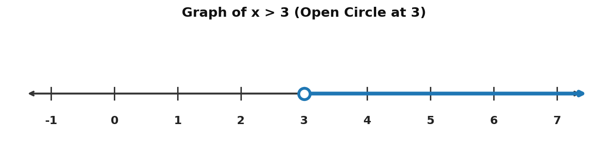
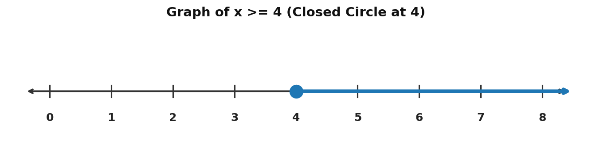
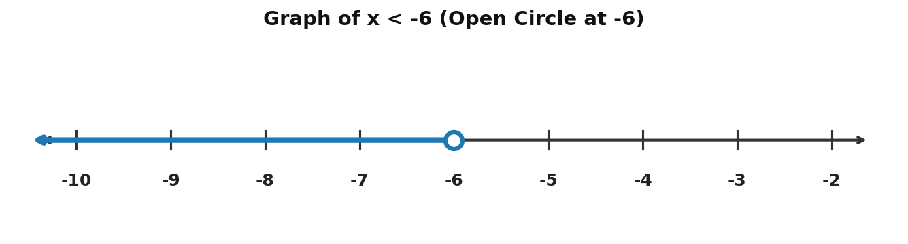
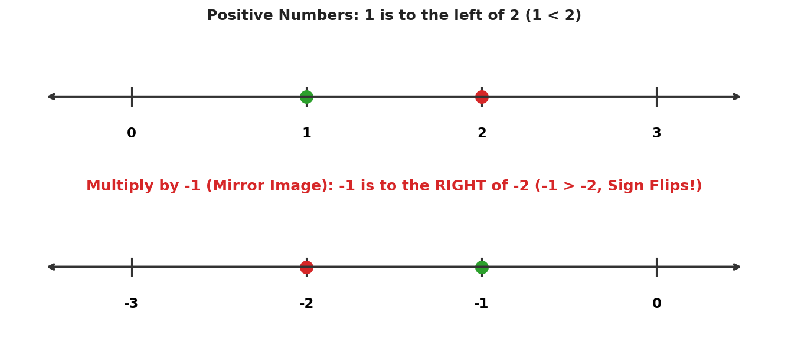

# Solving Algebraic Inequalities: A Complete Beginner's Manual

> **Tutorial Topic:** Solving Algebraic Inequalities  
> **Source Material:** YouTube Tutorial by *Professor Dave Explains*  
> **Target Audience:** Beginner Mathematics Students (B1 English Level)

---

## 1. Introduction

In algebra, most students start by learning **equations**. An equation uses an equals sign ($=$) to show that two mathematical expressions have the exact same value. For example, in $x + 2 = 5$, there is only one specific number that works: $x = 3$.

However, in real life and advanced mathematics, things are not always exactly equal. Often, one quantity is **greater than** or **less than** another quantity. This relationship is called an **inequality**.

Instead of finding a single number, solving an inequality gives us a **range of numbers** (called a solution set) that make the statement true [12]. 

* **Why is this important?** Inequalities help us calculate budgets (spending *less than* a maximum amount), speed limits (driving *under* a maximum limit), and safety boundaries in engineering and science.

---

## 2. Prerequisite Knowledge

Before learning about inequalities, make sure you understand these two basic ideas:

### A. Basic Linear Equations
When you solve a normal equation like $x + 3 = 7$, you isolate the variable $x$ by doing the opposite operation on both sides of the equals sign:
$$x + 3 - 3 = 7 - 3 \implies x = 4$$

### B. Understanding the Number Line
A **number line** is a straight line where numbers are placed in order from left to right:
* Numbers get **larger** as you move to the **right**.
* Numbers get **smaller** as you move to the **left**.
* For positive numbers: $2$ is larger than $1$ ($2 > 1$).
* For negative numbers: Numbers closer to zero are larger than numbers farther away from zero [14]. For example, $-1$ is larger than $-2$ ($-1 > -2$) because $-1$ is further to the right on the line [15].

---

## 3. Important Definitions

Here are the key mathematical terms explained in simple language:

* **Inequality:** A mathematical sentence comparing two expressions that are not equal, using symbols such as $>$, $<$, $\ge$, or $\le$ [12].
* **Variable:** A letter (such as $x$ or $y$) representing an unknown number [12].
* **Solution Set:** The entire group of numbers that satisfy an inequality (make it true) [12].
* **Strict Inequality:** An inequality using greater than ($>$) or less than ($<$). The boundary number itself is **not included** in the solution set [13].
* **Non-Strict Inequality:** An inequality using greater than or equal to ($\ge$) or less than or equal to ($\le$). The boundary number **is included** in the solution set [13].
* **Open Circle ($\circ$):** An empty circle plotted on a number line to show that the boundary number is **excluded** (not part of the solution) [13].
* **Closed Circle ($ullet$):** A solid, filled-in circle plotted on a number line to show that the boundary number is **included** in the solution [13].

---

## 4. Main Concepts

### Concept 1: Inequalities Have Many Solutions
Unlike a standard linear equation which usually has one single answer, an inequality has **infinitely many solutions** [12].

For example, consider the inequality:
$$x > 3$$

Any number greater than $3$ is a correct answer!
* $4$ is a solution because $4 > 3$.
* $10$ is a solution because $10 > 3$.
* $1,000,000$ is a solution because $1,000,000 > 3$.
* $3.00001$ is a solution because $3.00001 > 3$.

However, $3$ itself is **not** a solution, because $3$ is not strictly greater than $3$ [12, 13]. Neither is $2$ or $-5$.

---

### Concept 2: Solving Inequalities is Almost Like Solving Equations
For almost every step, you can treat an inequality symbol ($>$, $<$, $\ge$, $\le$) just like an equals sign ($=$) [12, 13]:
1. You can **add** the same number to both sides.
2. You can **subtract** the same number from both sides.
3. You can **multiply** or **divide** both sides by any **positive number**.

---

### Concept 3: The Special Rule for Negative Numbers
There is **one critical rule** where inequalities behave differently from equations:

> **The Golden Rule of Inequalities:** Whenever you multiply or divide both sides of an inequality by a **negative number**, you MUST **flip (reverse)** the direction of the inequality symbol [14].

* If the symbol was $>$, it becomes $<$.
* If the symbol was $\le$, it becomes $\ge$.

#### Why does this rule exist? (The Intuition)
Think about the positive numbers $1$ and $2$. We know that:
$$1 < 2$$

Now, multiply both sides by $-1$:
$$1 	imes (-1) = -1 \quad 	ext{and} \quad 2 	imes (-1) = -2$$

If we did *not* flip the sign, we would write $-1 < -2$. But look at a number line! $-1$ is to the right of $-2$, which means $-1$ is actually **greater than** $-2$ [15]!

To keep the statement true, we must flip the symbol:
$$-1 > -2$$

Multiplying by a negative number acts like a **mirror image** of the number line, reversing all order relationships [14, 15].

---

## 5. Formulas and Rules

### Summary of Inequality Symbols

| Symbol | Meaning | Included on Number Line? | Circle Type |
| :---: | :---: | :---: | :---: |
| $>$ | Greater than | No (Excludes boundary) | Open Circle ($\circ$) |
| $<$ | Less than | No (Excludes boundary) | Open Circle ($\circ$) |
| $\ge$ | Greater than or equal to | Yes (Includes boundary) | Closed Circle ($ullet$) |
| $\le$ | Less than or equal to | Yes (Includes boundary) | Closed Circle ($ullet$) |

---

### Key Algebraic Operations Summary

1. **Addition Rule:**
   $$	ext{If } a > b, 	ext{ then } a + c > b + c$$

2. **Subtraction Rule:**
   $$	ext{If } a > b, 	ext{ then } a - c > b - c$$

3. **Positive Multiplication/Division Rule ($c > 0$):**
   $$	ext{If } a > b 	ext{ and } c > 0, 	ext{ then } a \cdot c > b \cdot c \quad 	ext{and} \quad rac{a}{c} > rac{b}{c}$$

4. **Negative Multiplication/Division Rule ($c < 0$):**
   $$	ext{If } a > b 	ext{ and } c < 0, 	ext{ then } a \cdot c < b \cdot c \quad 	ext{and} \quad rac{a}{c} < rac{b}{c}$$
   *(Notice how the symbol flipped from $>$ to $<$!)* [14]

---

## 6. Step-by-Step Examples

### Example 1 (Easy): Basic One-Step Inequality
**Problem:** Solve $x + 2 < 7$ and describe the solution.

**Step-by-Step Solution:**
1. **Identify the goal:** We want to isolate $x$ on the left side [12].
2. **Undo the addition:** Subtract $2$ from both sides of the inequality [13]:
   $$x + 2 - 2 < 7 - 2$$
3. **Simplify:**
   $$x < 5$$
4. **Interpretation:** Any number strictly less than $5$ is a valid solution (e.g., $4$, $0$, $-10$). The number $5$ itself is excluded [13].

---

### Example 2 (Medium): Two-Step Inequality with Inclusive Symbol
**Problem:** Solve $3x + 4 \ge 16$.

**Step-by-Step Solution:**
1. **Subtract $4$ from both sides:**
   $$3x + 4 - 4 \ge 16 - 4$$
   $$3x \ge 12$$
2. **Divide both sides by positive $3$:**
   *(Since $3$ is positive, the inequality symbol $\ge$ stays the same!)* [13]
   $$rac{3x}{3} \ge rac{12}{3}$$
   $$x \ge 4$$
3. **Interpretation:** $x$ can be $4$ or any number greater than $4$ [13].

---

### Example 3 (Challenging): Inequality with Negative Division
**Problem:** Solve $-x > 6$.

**Step-by-Step Solution:**
1. **Identify the negative variable:** $-x$ is the same as $(-1) \cdot x$.
2. **Divide both sides by $-1$:**
   *(Remember the Golden Rule: Dividing by a negative number FLIPS the inequality symbol from $>$ to $<$!)* [14]
   $$rac{-x}{-1} < rac{6}{-1}$$
   $$x < -6$$
3. **Check the answer:** Let's pick a test value less than $-6$, such as $x = -10$.
   * Substitute $x = -10$ into the original inequality $-x > 6$:
   $$-(-10) = 10 \quad 	ext{and } 10 > 6 \quad 	ext{(True!)}$$ [14]
   * If we forgot to flip the sign and guessed $x > -6$ (testing $0$):
   $$-(0) = 0 \quad 	ext{and } 0 > 6 \quad 	ext{(False!)}$$
   This proves that flipping the sign gives the correct solution [14].

---

## 7. Visual Explanations

Number lines give a clear picture of an inequality's solution set.

### Visual 1: Graph of $x > 3$
* **Boundary:** $3$
* **Circle Type:** Open circle at $3$ (because $3$ is not included) [13].
* **Arrow Direction:** Pointing to the right (towards numbers greater than $3$) [12].

---

### Visual 2: Graph of $x \ge 4$
* **Boundary:** $4$
* **Circle Type:** Closed/Filled circle at $4$ (because $4$ is included) [13].
* **Arrow Direction:** Pointing to the right [13].

---

### Visual 3: Graph of $x < -6$
* **Boundary:** $-6$
* **Circle Type:** Open circle at $-6$ [13].
* **Arrow Direction:** Pointing to the left [14].

---

### Visual 4: Intuition Behind Flipping the Inequality Sign
When we multiply or divide by a negative number, the entire number line is mirrored across zero [15].

---

## 8. Common Mistakes

Here are three frequent mistakes students make and how to avoid them:

### Mistake 1: Forgetting to Flip the Symbol for Negatives
* **Wrong Approach:**  
  $$-2x < 8 \implies x < -4 \quad 	ext{(WRONG! Did not flip symbol)}$$
* **Right Approach:**  
  $$-2x < 8 \implies x > -4 \quad 	ext{(CORRECT! Flipped } < 	ext{ to } > 	ext{ when dividing by } -2	ext{)}$$

---

### Mistake 2: Using the Wrong Circle Type on a Number Line
* **Wrong Approach:** Drawing a closed circle for $x > 5$.
* **Why it's wrong:** A closed circle tells the reader that $5$ is a valid answer. But $5 > 5$ is false!
* **Rule:** Always use an **open circle** for strict inequalities ($>$, $<$) and a **closed circle** for non-strict inequalities ($\ge$, $\le$) [13].

---

### Mistake 3: Comparing Negative Numbers Incorrectly
* **Wrong Thinking:** Believing $-10$ is greater than $-5$ because $10 > 5$.
* **Correct Thinking:** On the negative side of the number line, numbers closer to $0$ are larger [14, 15]. Therefore, $-5 > -10$.

---

## 9. Practice Problems

Test your understanding by solving these problems. Arrange from easy to challenging!

1. **Problem 1 (Easy):** Solve $x - 3 > 4$.
2. **Problem 2 (Medium):** Solve $2x + 5 \le 15$.
3. **Problem 3 (Medium):** Solve $-4x \ge 12$.
4. **Problem 4 (Challenging):** Solve $-3x + 7 < 22$.

---

## 10. Solutions

### Solution to Problem 1
$$x - 3 > 4$$
* Add $3$ to both sides:
  $$x - 3 + 3 > 4 + 3$$
  $$x > 7$$
* **Graph:** Open circle at $7$, arrow pointing right.

---

### Solution to Problem 2
$$2x + 5 \le 15$$
* Subtract $5$ from both sides:
  $$2x \le 10$$
* Divide by positive $2$:
  $$x \le 5$$
* **Graph:** Closed circle at $5$, arrow pointing left.

---

### Solution to Problem 3
$$-4x \ge 12$$
* Divide both sides by $-4$. **Flip the $\ge$ sign to $\le$!** [14]
  $$x \le rac{12}{-4}$$
  $$x \le -3$$
* **Graph:** Closed circle at $-3$, arrow pointing left.

---

### Solution to Problem 4
$$-3x + 7 < 22$$
* Subtract $7$ from both sides:
  $$-3x < 15$$
* Divide both sides by $-3$. **Flip the $<$ sign to $>$!** [14]
  $$x > rac{15}{-3}$$
  $$x > -5$$
* **Graph:** Open circle at $-5$, arrow pointing right.

---

## 11. Summary

* An **inequality** compares two expressions using $>$, $<$, $\ge$, or $\le$, producing a solution set of many values [12].
* You solve inequalities using the same step-by-step methods as linear equations (addition, subtraction, multiplication, division) [12, 13].
* On a number line, use an **open circle ($\circ$)** for $>$ and $<$, and a **closed circle ($ullet$)** for $\ge$ and $\le$ [13].
* **Most Important Rule:** When multiplying or dividing both sides by a negative number, you **must flip** the inequality symbol [14].

---

## 12. Key Things to Remember

* $\mathbf{x > a}$: Numbers larger than $a$ (Open circle $\circ$, arrow right)
* $\mathbf{x < a}$: Numbers smaller than $a$ (Open circle $\circ$, arrow left)
* $\mathbf{x \ge a}$: Numbers larger than or equal to $a$ (Closed circle $ullet$, arrow right)
* $\mathbf{x \le a}$: Numbers smaller than or equal to $a$ (Closed circle $ullet$, arrow left)
* **Multiply or divide by a negative number?** $
ightarrow$ **FLIP THE SIGN!**
