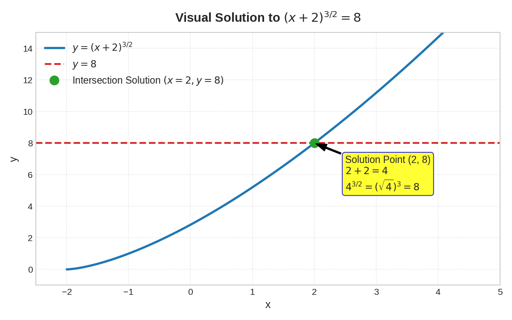
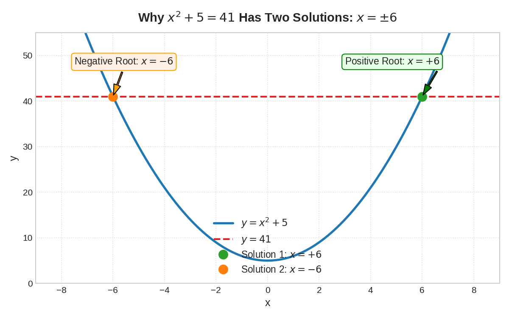
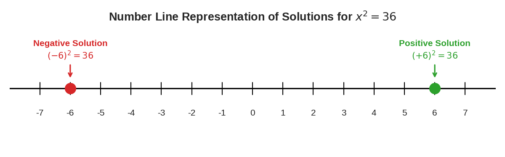

# Solving Algebraic Equations With Roots and Exponents: A Complete Beginner's Manual

---

## 1. Introduction

Algebraic equations can look scary when they contain **square roots**, **cube roots**, or **fractional exponents** (like $x^{3/2}$). However, these equations follow simple, consistent rules. 

The main purpose of solving an equation is to **isolate the variable**—which means getting the unknown letter (usually $x$) completely by itself on one side of the equal sign ($=$).

In this tutorial, you will learn how to undo roots and exponents step by step. By the end of this manual, you will know:
- How to convert between radical symbols and fractional exponents.
- How to eliminate roots and powers using inverse operations.
- Why equations with even powers (like $x^2$) have **two** solutions (positive and negative).
- How to avoid common mistakes that trick many algebra students.

---

## 2. Prerequisite Knowledge

Before solving equations with roots and exponents, let us review four essential mathematical foundations.

### A. Order of Operations ("Outside-In" Principle)
When solving equations, we undo operations in the reverse order of how they were applied. Think of an equation like a wrapped gift box: you must remove the outermost wrapping paper before you can open the inner box.
- If an operation is **outside** a radical or parenthesis, deal with it first.
- If an expression is **inside** a radical or parenthesis, you must eliminate the radical or parenthesis before you can touch the numbers inside.

### B. Inverse Operations
An **inverse operation** is an operation that undoes (cancels out) another operation:
- **Addition** ($+$) and **Subtraction** ($-$) undo each other.
- **Multiplication** ($\cdot$) and **Division** ($\div$) undo each other.
- **Squaring** ($x^2$) and taking a **Square Root** ($\sqrt{x}$) undo each other.
- **Raising to power $n$** ($x^n$) and taking the **$n$-th Root** ($\sqrt[n]{x}$) undo each other.

### C. Basic Rules of Exponents
Recall the **Power of a Power Rule**:
$$(x^a)^b = x^{a \cdot b}$$
When you raise an exponential term to another power, you multiply the two exponents together.

*Example:* 
$$(x^3)^2 = x^{3 \cdot 2} = x^6$$

### D. Roots as Fractional Exponents
A root can always be written as a fraction in the exponent:
- Square root: $\sqrt{x} = x^{1/2}$
- Cube root: $\sqrt[n]{x} = x^{1/n}$
- General root with a power: $\sqrt[n]{x^m} = x^{m/n}$

Because a square root is equal to a power of $\frac{1}{2}$, raising a square root to the power of $2$ results in:
$$\left(\sqrt{x}\right)^2 = \left(x^{1/2}\right)^2 = x^{(1/2 \cdot 2)} = x^1 = x$$

---

## 3. Important Definitions

| Term | Simple Definition | Example |
| :--- | :--- | :--- |
| **Equation** | A mathematical statement showing that two expressions are equal. | $x + 9 = 25$ |
| **Variable** | A symbol (usually a letter like $x$) representing an unknown number. | $x$ |
| **Exponent (Power)** | A small number written above and to the right of a base showing how many times to multiply the base by itself. | In $x^3$, the exponent is $3$. |
| **Radical Symbol ($\sqrt{\quad}$)** | The symbol used to represent a root (such as a square root or cube root). | $\sqrt{x+9}$ |
| **Radicand** | The expression located **inside** (underneath) the radical symbol. | In $\sqrt{x+9}$, the radicand is $x+9$. |
| **Fractional Exponent** | An exponent written as a fraction $\frac{m}{n}$, where $n$ represents the root and $m$ represents the power. | In $x^{3/2}$, $2$ is the root and $3$ is the power. |
| **Reciprocal** | The flipped version of a fraction. Multiplying a fraction by its reciprocal equals $1$. | The reciprocal of $\frac{3}{2}$ is $\frac{2}{3}$ because $\frac{3}{2} \cdot \frac{2}{3} = 1$. |
| **Principal Square Root** | The non-negative (positive or zero) result of evaluating a square root symbol. | $\sqrt{36} = 6$ |
| **Extraneous Solution** | A number obtained during algebraic solving that does **not** satisfy the original equation when checked. | Always verify your answers to spot these! |

---

## 4. Main Concepts

### Concept 1: Undoing Roots with Whole Powers
To cancel out a radical, raise both sides of the equation to the power equal to the root's index.
- To cancel a square root ($\sqrt{\quad}$), **square** both sides (raise to power $2$).
- To cancel a cube root ($\sqrt[3]{\quad}$), **cube** both sides (raise to power $3$).

### Concept 2: Undoing Fractional Exponents with Reciprocal Powers
If a variable expression is raised to a fraction $\frac{m}{n}$, raise both sides of the equation to the reciprocal exponent $\frac{n}{m}$.
$$\left(X^{m/n}\right)^{n/m} = X^{\frac{m}{n} \cdot \frac{n}{m}} = X^1 = X$$

### Concept 3: The Plus-or-Minus ($\pm$) Rule for Even Powers
When you solve an equation where the variable is squared (e.g., $x^2 = 36$), taking the square root yields **two solutions**: one positive and one negative.
- Why? Because $(+6)^2 = 36$ AND $(-6)^2 = 36$.
- Therefore, if $x^2 = k$, then $x = \pm \sqrt{k}$.

### Concept 4: Handling Coefficients Outside Radicals
If an expression has a coefficient multiplying a radical, such as $3\sqrt{x-1}$, squaring that entire term requires squaring **both** the number and the radical:
$$\left(3\sqrt{x-1}\right)^2 = 3^2 \cdot \left(\sqrt{x-1}\right)^2 = 9 \cdot (x - 1) = 9x - 9$$

---

## 5. Formulas and Rules

### Rule 1: Power of a Power Rule
$$(x^a)^b = x^{a \cdot b}$$

### Rule 2: Fractional Exponent Equivalence
$$x^{m/n} = \left(\sqrt[n]{x}\right)^m = \sqrt[n]{x^m}$$

### Rule 3: Reciprocal Power Cancellation Rule
$$\left(x^{a/b}\right)^{b/a} = x^{1} = x$$

### Rule 4: Square Root Property of Equations
$$\text{If } x^2 = k \quad (k \ge 0), \quad \text{then } x = \pm \sqrt{k}$$

### Rule 5: Squaring a Product with a Radical
$$(c \cdot \sqrt{A})^2 = c^2 \cdot A$$

---

## 6. Step-by-Step Examples

### Example 1 (Easy): Basic Equation with a Square Root

**Problem:** Solve for $x$:
$$\sqrt{x + 9} = 5$$

#### Step-by-Step Solution:

* **Step 1: Identify the outermost operation.**  
  Notice that the square root symbol extends over the entire expression $x + 9$. The radicand is $(x + 9)$. You **cannot** subtract $9$ first because it is locked inside the square root.

* **Step 2: Eliminate the square root by squaring both sides.**  
  To undo the square root, raise both sides to the second power:
  $$\left(\sqrt{x + 9}\right)^2 = (5)^2$$

* **Step 3: Simplify both sides.**  
  On the left side, the square root and the square cancel each other out:
  $$x + 9 = 25$$

* **Step 4: Isolate $x$.**  
  Subtract $9$ from both sides:
  $$x + 9 - 9 = 25 - 9$$
  $$x = 16$$

#### Verification Check:
Plug $x = 16$ back into the original equation:
$$\sqrt{16 + 9} = \sqrt{25} = 5 \quad \checkmark \text{ (Correct!)}$$

---

### Example 2 (Medium): Equation with an Even Power ($x^2$)

**Problem:** Solve for $x$:
$$x^2 + 5 = 41$$

#### Step-by-Step Solution:

* **Step 1: Isolate the exponential term ($x^2$).**  
  Subtract $5$ from both sides of the equation:
  $$x^2 + 5 - 5 = 41 - 5$$
  $$x^2 = 36$$

* **Step 2: Take the square root of both sides.**  
  Remember that an even power equation produces **two** roots: positive and negative ($\pm$).
  $$x = \pm \sqrt{36}$$

* **Step 3: Evaluate the root.**  
  $$x = \pm 6$$
  This means $x = 6$ or $x = -6$.

#### Verification Check:
- Check $x = +6$: $(6)^2 + 5 = 36 + 5 = 41 \quad \checkmark$
- Check $x = -6$: $(-6)^2 + 5 = 36 + 5 = 41 \quad \checkmark$

---

### Example 3 (Medium): Equation with a Fractional Exponent

**Problem:** Solve for $x$:
$$(x + 2)^{3/2} = 8$$

#### Step-by-Step Solution:

* **Step 1: Identify the reciprocal exponent.**  
  The exponent on the left side is $\frac{3}{2}$. The reciprocal of $\frac{3}{2}$ is $\frac{2}{3}$.

* **Step 2: Raise both sides to the reciprocal power $\frac{2}{3}$.**  
  $$\left[(x + 2)^{3/2}\right]^{2/3} = 8^{2/3}$$

* **Step 3: Simplify the left side.**  
  Multiply exponents: $\frac{3}{2} \cdot \frac{2}{3} = 1$.
  $$(x + 2)^1 = x + 2$$

* **Step 4: Evaluate the right side ($8^{2/3}$).**  
  Rewrite $8^{2/3}$ using roots and powers: $8^{2/3} = (\sqrt[3]{8})^2$.
  - First, find the cube root of $8$: $\sqrt[3]{8} = 2$ (since $2^3 = 8$).
  - Second, square the result: $2^2 = 4$.
  
  Therefore:
  $$x + 2 = 4$$

* **Step 5: Solve for $x$.**  
  Subtract $2$ from both sides:
  $$x = 4 - 2 = 2$$

#### Verification Check:
Plug $x = 2$ back into the original equation:
$$(2 + 2)^{3/2} = 4^{3/2} = (\sqrt{4})^3 = (2)^3 = 8 \quad \checkmark \text{ (Correct!)}$$

---

### Example 4 (Challenging): Radicals on Both Sides with Coefficients

**Problem:** Solve for $x$:
$$3\sqrt{x - 1} = \sqrt{x + 1}$$

#### Step-by-Step Solution:

* **Step 1: Square both sides of the equation.**  
  $$\left(3\sqrt{x - 1}\right)^2 = \left(\sqrt{x + 1}\right)^2$$

* **Step 2: Carefully expand the left side.**  
  Apply the exponent to **both** the coefficient $3$ and the radical $\sqrt{x-1}$:
  $$3^2 \cdot \left(\sqrt{x - 1}\right)^2 = x + 1$$
  $$9 \cdot (x - 1) = x + 1$$

* **Step 3: Distribute the $9$.**  
  $$9x - 9 = x + 1$$

* **Step 4: Move variable terms to one side and constants to the other.**  
  Subtract $x$ from both sides:
  $$8x - 9 = 1$$
  Add $9$ to both sides:
  $$8x = 10$$

* **Step 5: Solve for $x$ and simplify the fraction.**  
  $$x = \frac{10}{8}$$
  Divide numerator and denominator by $2$:
  $$x = \frac{5}{4}$$

#### Verification Check:
Plug $x = \frac{5}{4}$ back into the original equation:
- **Left Side:** $3\sqrt{\frac{5}{4} - 1} = 3\sqrt{\frac{1}{4}} = 3 \cdot \frac{1}{2} = \frac{3}{2}$
- **Right Side:** $\sqrt{\frac{5}{4} + 1} = \sqrt{\frac{9}{4}} = \frac{3}{2}$

Both sides equal $\frac{3}{2} \quad \checkmark \text{ (Correct!)}$

---

## 7. Visual Explanations

### Strategy Flowchart: How to Solve Equations with Roots and Exponents

```
+-------------------------------------------------------------+
|               EQUATION WITH ROOTS & EXPONENTS               |
+-------------------------------------------------------------+
                               |
                               v
           Is there a radical or fractional exponent?
                               |
            +------------------+------------------+
            |                                     |
            v                                     v
   [ Single Radical / Exponent ]        [ Radicals on Both Sides ]
            |                                     |
            v                                     v
 Isolate the radical/exponent term.    Square both sides completely.
            |                          (Remember: square coefficients!)
            v                                     |
 Raise both sides to inverse power.                v
 (e.g., square or reciprocal power)    Distribute and expand terms.
            |                                     |
            +------------------+------------------+
                               |
                               v
                 Isolate the variable x.
                               |
                               v
            Did you start with an even power x^2?
                               |
            +------------------+------------------+
            |                                     |
           YES                                   NO
            |                                     |
            v                                     v
  Include BOTH positive &             Single solution.
  negative roots (x = ±k).                        |
            |                                     |
            +------------------+------------------+
                               |
                               v
              Check solution in original equation!
```

---

### Graphical Visualizations

#### 1. Graphical Intersection for $(x + 2)^{3/2} = 8$
Below is a visual representation showing how the curve $y = (x+2)^{3/2}$ intersects the horizontal line $y = 8$ at exactly $x = 2$:



#### 2. Parabola Showing Two Solutions for $x^2 + 5 = 41$
The graph of $y = x^2 + 5$ intersects $y = 41$ at two distinct symmetric points: $x = +6$ and $x = -6$:



#### 3. Number Line Representation of Solutions for $x^2 = 36$
On the number line, both $-6$ and $+6$ lie at equal distances from zero:



---

## 8. Common Mistakes

### Mistake 1: Subtracting inside a radical before removing the root
* **Wrong Approach:**  
  In $\sqrt{x + 9} = 5$, subtracting $9$ first to get $\sqrt{x} = -4$.
* **Why it is wrong:**  
  The $9$ is locked inside the square root operator. Operations inside a radical cannot be separated until the radical itself is eliminated.
* **Correct Approach:**  
  Square both sides first: $(\sqrt{x + 9})^2 = 5^2 \implies x + 9 = 25 \implies x = 16$.

---

### Mistake 2: Forgetting the $\pm$ sign when taking square roots
* **Wrong Approach:**  
  In $x^2 = 36$, writing only $x = 6$.
* **Why it is wrong:**  
  Squaring a negative number also yields a positive result: $(-6)^2 = 36$. Ignoring the negative root eliminates half of your valid solutions.
* **Correct Approach:**  
  Always write $x = \pm \sqrt{36} \implies x = \pm 6$.

---

### Mistake 3: Forgetting to square coefficients outside radicals
* **Wrong Approach:**  
  In $(3\sqrt{x - 1})^2$, writing $3(x - 1)$.
* **Why it is wrong:**  
  The exponent applies to the *entire* term, including the number $3$. You must calculate $3^2 = 9$.
* **Correct Approach:**  
  $(3\sqrt{x - 1})^2 = 3^2 \cdot (\sqrt{x - 1})^2 = 9(x - 1)$.

---

### Mistake 4: Multiplying exponents incorrectly instead of using reciprocals
* **Wrong Approach:**  
  To solve $x^{3/2} = 8$, multiplying $8$ by $\frac{3}{2}$.
* **Why it is wrong:**  
  An exponent dictates power operations, not standard multiplication.
* **Correct Approach:**  
  Raise both sides to the reciprocal power $\frac{2}{3}$:  
  $x = 8^{2/3} = (\sqrt[3]{8})^2 = 2^2 = 4$.

---

## 9. Practice Problems

Test your understanding with these practice problems arranged from easy to challenging. Try solving them on paper before looking at the solutions!

1. **(Easy)** Solve for $x$:  
   $$\sqrt{x - 4} = 6$$

2. **(Easy/Medium)** Solve for $x$:  
   $$x^2 - 7 = 18$$

3. **(Medium)** Solve for $x$:  
   $$(x - 1)^{2/3} = 9$$

4. **(Medium)** Solve for $x$:  
   $$(x + 5)^{3/4} = 27$$

5. **(Challenging)** Solve for $x$:  
   $$2\sqrt{x + 3} = \sqrt{5x + 4}$$

---

## 10. Solutions

### Solution to Problem 1
**Equation:** $\sqrt{x - 4} = 6$
1. Square both sides to undo the square root:
   $$\left(\sqrt{x - 4}\right)^2 = 6^2$$
   $$x - 4 = 36$$
2. Add $4$ to both sides:
   $$x = 36 + 4 = 40$$
3. **Check:** $\sqrt{40 - 4} = \sqrt{36} = 6 \quad \checkmark$  
**Answer:** $x = 40$

---

### Solution to Problem 2
**Equation:** $x^2 - 7 = 18$
1. Add $7$ to both sides to isolate $x^2$:
   $$x^2 = 18 + 7 = 25$$
2. Take the square root of both sides, remembering the $\pm$ sign:
   $$x = \pm \sqrt{25}$$
   $$x = \pm 5$$
3. **Check:** $(\pm 5)^2 - 7 = 25 - 7 = 18 \quad \checkmark$  
**Answer:** $x = 5 \text{ or } x = -5 \quad (x = \pm 5)$

---

### Solution to Problem 3
**Equation:** $(x - 1)^{2/3} = 9$
1. Raise both sides to the reciprocal power $\frac{3}{2}$:
   $$\left[(x - 1)^{2/3}\right]^{3/2} = 9^{3/2}$$
2. Simplify the left side:
   $$x - 1 = 9^{3/2}$$
3. Evaluate the right side ($9^{3/2} = (\sqrt{9})^3$):
   $$\sqrt{9} = 3 \implies 3^3 = 27$$
   $$x - 1 = 27$$
4. Add $1$ to both sides:
   $$x = 28$$
5. **Check:** $(28 - 1)^{2/3} = 27^{2/3} = (\sqrt[3]{27})^2 = 3^2 = 9 \quad \checkmark$  
**Answer:** $x = 28$

---

### Solution to Problem 4
**Equation:** $(x + 5)^{3/4} = 27$
1. Raise both sides to the reciprocal power $\frac{4}{3}$:
   $$\left[(x + 5)^{3/4}\right]^{4/3} = 27^{4/3}$$
2. Simplify the left side:
   $$x + 5 = 27^{4/3}$$
3. Evaluate the right side ($27^{4/3} = (\sqrt[3]{27})^4$):
   $$\sqrt[3]{27} = 3 \implies 3^4 = 81$$
   $$x + 5 = 81$$
4. Subtract $5$ from both sides:
   $$x = 81 - 5 = 76$$
5. **Check:** $(76 + 5)^{3/4} = 81^{3/4} = (\sqrt[3]{81})^3 \dots \implies (\sqrt[4]{81})^3 = 3^3 = 27 \quad \checkmark$  
**Answer:** $x = 76$

---

### Solution to Problem 5
**Equation:** $2\sqrt{x + 3} = \sqrt{5x + 4}$
1. Square both sides:
   $$\left(2\sqrt{x + 3}\right)^2 = \left(\sqrt{5x + 4}\right)^2$$
2. Square both the coefficient $2$ and the radical on the left:
   $$2^2 \cdot (x + 3) = 5x + 4$$
   $$4(x + 3) = 5x + 4$$
3. Distribute the $4$:
   $$4x + 12 = 5x + 4$$
4. Subtract $4x$ from both sides:
   $$12 = x + 4$$
5. Subtract $4$ from both sides:
   $$x = 8$$
6. **Check:**  
   - Left Side: $2\sqrt{8 + 3} = 2\sqrt{11}$
   - Right Side: $\sqrt{5(8) + 4} = \sqrt{40 + 4} = \sqrt{44} = \sqrt{4 \cdot 11} = 2\sqrt{11} \quad \checkmark$  
**Answer:** $x = 8$

---

## 11. Summary

- **Work Outside-In:** Always clear numbers outside radicals or parentheses before working on the inside terms.
- **Undo Roots with Powers:** Squaring undoes square roots, cubing undoes cube roots, and raising to power $n$ undoes an $n$-th root.
- **Undo Fractional Exponents with Reciprocals:** To remove $x^{m/n}$, raise both sides to the power of $\frac{n}{m}$.
- **Always Include $\pm$ for Even Roots:** Equations involving $x^2 = k$ have two solutions ($x = +\sqrt{k}$ and $x = -\sqrt{k}$).
- **Square Coefficients:** When squaring terms like $a\sqrt{B}$, calculate $a^2 \cdot B$.
- **Verify Answers:** Substitute your final values into the original equation to verify correctness and rule out extraneous solutions.

---

## 12. Key Things to Remember

1. $\sqrt{x} = x^{1/2} \quad \text{and} \quad \sqrt[n]{x^m} = x^{m/n}$
2. $\left(x^{a/b}\right)^{b/a} = x^1 = x$
3. $\text{If } x^2 = k, \text{ then } x = \pm \sqrt{k}$
4. $(c \cdot \sqrt{A})^2 = c^2 \cdot A$
5. Always undo operations from the outside in!
